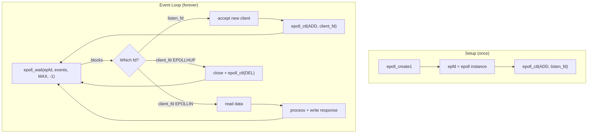
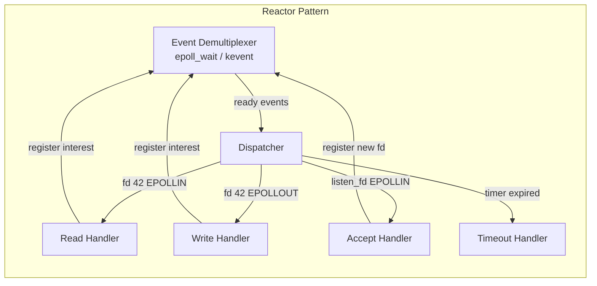
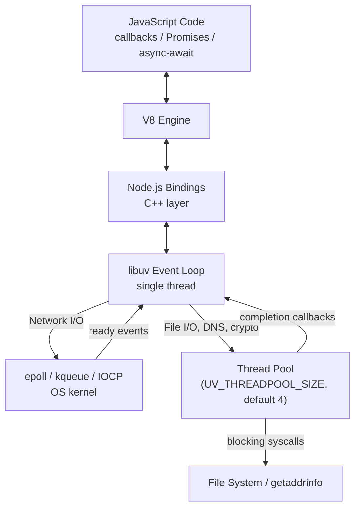

# Async I/O Models — select, epoll, kqueue, and Event-Driven Networking

**Date:** 2026-04-23 | **Updated:** 2026-04-23
**Tags:** `networking` `async-io` `epoll` `kqueue` `event-driven` `libuv`

---

## Table of Contents

- [Summary](#summary)
- [The C10K Problem](#the-c10k-problem)
  - [Thread-Per-Connection Does Not Scale](#thread-per-connection-does-not-scale)
  - [Memory and Context-Switch Overhead](#memory-and-context-switch-overhead)
  - [The Event-Driven Answer](#the-event-driven-answer)
- [Five I/O Models (Stevens Classification)](#five-io-models-stevens-classification)
  - [1. Blocking I/O](#1-blocking-io)
  - [2. Non-Blocking I/O](#2-non-blocking-io)
  - [3. I/O Multiplexing](#3-io-multiplexing)
  - [4. Signal-Driven I/O](#4-signal-driven-io)
  - [5. Asynchronous I/O](#5-asynchronous-io)
  - [Comparison Table](#comparison-table)
  - [I/O Models Mermaid Diagram](#io-models-mermaid-diagram)
- [select()](#select)
  - [How select Works](#how-select-works)
  - [Limitations](#limitations)
  - [Code Walkthrough](#code-walkthrough)
- [poll()](#poll)
  - [pollfd Struct](#pollfd-struct)
  - [Improvements over select](#improvements-over-select)
  - [Still O(n)](#still-on)
- [epoll (Linux)](#epoll-linux)
  - [The Three Syscalls](#the-three-syscalls)
  - [epoll_event Struct](#epoll_event-struct)
  - [Edge-Triggered vs Level-Triggered](#edge-triggered-vs-level-triggered)
  - [epoll Event Flow](#epoll-event-flow)
  - [C Pseudocode — epoll Server](#c-pseudocode--epoll-server)
- [kqueue (BSD/macOS)](#kqueue-bsdmacos)
  - [kevent Struct and Filters](#kevent-struct-and-filters)
  - [EV_SET Macro](#ev_set-macro)
  - [kqueue vs epoll](#kqueue-vs-epoll)
- [io_uring (Linux 5.1+)](#io_uring-linux-51)
  - [Submission and Completion Rings](#submission-and-completion-rings)
  - [Truly Async — No Readiness Notification](#truly-async--no-readiness-notification)
  - [Batching and Zero-Copy](#batching-and-zero-copy)
  - [Why io_uring Is the Future](#why-io_uring-is-the-future)
- [Reactor Pattern](#reactor-pattern)
  - [Single-Threaded Event Loop](#single-threaded-event-loop)
  - [Event Demultiplexer, Dispatcher, and Handlers](#event-demultiplexer-dispatcher-and-handlers)
  - [How It Maps to Node.js and Netty](#how-it-maps-to-nodejs-and-netty)
- [How Node.js Uses libuv](#how-nodejs-uses-libuv)
  - [libuv Event Loop Phases](#libuv-event-loop-phases)
  - [epoll/kqueue Underneath](#epollkqueue-underneath)
  - [Thread Pool for File I/O and DNS](#thread-pool-for-file-io-and-dns)
  - [Why Network I/O Does Not Use the Thread Pool](#why-network-io-does-not-use-the-thread-pool)
  - [libuv Architecture Diagram](#libuv-architecture-diagram)
- [How Netty Uses epoll/NIO](#how-netty-uses-epollnio)
  - [Java NIO Selector](#java-nio-selector)
  - [Netty EventLoopGroup and EventLoop](#netty-eventloopgroup-and-eventloop)
  - [EpollEventLoop — Native Transport](#epolleventloop--native-transport)
  - [Channel Pipeline](#channel-pipeline)
  - [Why Spring WebFlux Sits on Netty](#why-spring-webflux-sits-on-netty)
- [Benchmarking and Choosing](#benchmarking-and-choosing)
  - [When the Choice Matters](#when-the-choice-matters)
  - [Connection Count Thresholds](#connection-count-thresholds)
  - [Real-World Framework Benchmarks](#real-world-framework-benchmarks)
- [Related](#related)
- [References](#references)

---

## Summary

Every backend framework you use — Node.js, Spring WebFlux, Netty, Go's net package — is built on top of OS-level I/O multiplexing primitives: `select`, `poll`, `epoll`, `kqueue`, or `io_uring`. Understanding these primitives explains why a single Node.js process can handle tens of thousands of concurrent connections, why Netty uses an EventLoopGroup, why Spring WebFlux is non-blocking, and what "event-driven architecture" means at the syscall level.

This document walks through the C10K problem that motivated event-driven I/O, the five I/O models classified by W. Richard Stevens, the evolution from `select` to `io_uring`, the Reactor pattern that frameworks implement, and exactly how Node.js (via libuv) and Netty (via Java NIO / native epoll) build on these primitives.

---

## The C10K Problem

In 1999 Dan Kegel published "The C10K Problem" — how do you handle 10,000 concurrent connections on a single server? At the time most servers used thread-per-connection or process-per-connection, and 10K was considered unreachable.

### Thread-Per-Connection Does Not Scale

The naive model assigns one OS thread per connection:

```
Client 1  →  Thread 1  →  read() blocks until data arrives
Client 2  →  Thread 2  →  read() blocks until data arrives
...
Client 10000  →  Thread 10000  →  read() blocks until data arrives
```

Each thread sits idle most of the time (waiting for network I/O) but consumes real resources.

### Memory and Context-Switch Overhead

| Resource | Per Thread | 10,000 Threads |
|----------|-----------|-----------------|
| Stack memory (default) | 1-8 MB | 10-80 GB |
| Kernel thread struct | ~8 KB | ~80 MB |
| Context switches/sec | — | 10,000+ involuntary switches |
| Scheduler overhead | O(n) or O(log n) | Significant CPU waste |

At 10,000 connections, thread-per-connection either exhausts memory or drowns in context-switch overhead. The CPU spends more time switching between threads than doing actual work.

### The Event-Driven Answer

The solution: **one thread monitors many file descriptors simultaneously**. Instead of blocking one thread per connection, a single thread asks the kernel "which of these 10,000 sockets have data ready?" and processes only the ready ones.

```
Single event loop thread:
  1. Register 10,000 sockets with the kernel
  2. Ask kernel: "which sockets are ready?"
  3. Kernel returns: [fd 42, fd 1337, fd 8080]  ← only 3 ready
  4. Process those 3, go back to step 2
```

This is **I/O multiplexing** — the foundation of every modern event-driven server.

---

## Five I/O Models (Stevens Classification)

W. Richard Stevens classified Unix I/O into five models in *Unix Network Programming* (1998). Every I/O operation has two phases:

1. **Wait for data** — kernel buffers incoming data from the network
2. **Copy data** — kernel copies buffered data to the user-space buffer

The five models differ in how the application interacts with these two phases.

### 1. Blocking I/O

The default. `read()` suspends the calling thread until data arrives AND is copied to user space:

```
Application         Kernel
    |                  |
    |--- read() ------>|
    |   (blocked)      |  ← waiting for data
    |   (blocked)      |  ← copying data
    |<-- data ---------|
    |                  |
```

**When to use:** Simple clients, scripts, tools with few connections.

### 2. Non-Blocking I/O

Socket set to `O_NONBLOCK`. `read()` returns immediately with `EAGAIN`/`EWOULDBLOCK` if no data ready:

```
Application         Kernel
    |                  |
    |--- read() ------>|
    |<-- EAGAIN -------|  ← no data yet
    |--- read() ------>|
    |<-- EAGAIN -------|  ← still no data
    |--- read() ------>|
    |   (blocked)      |  ← copying data (brief)
    |<-- data ---------|
```

The application must **poll** repeatedly — burning CPU in a busy loop. Non-blocking alone is not useful; it becomes useful when combined with I/O multiplexing.

### 3. I/O Multiplexing

`select()`, `poll()`, `epoll()`, `kqueue()`. One call monitors multiple file descriptors:

```
Application         Kernel
    |                  |
    |--- epoll_wait -->|
    |   (blocked)      |  ← waiting for ANY fd to be ready
    |<-- fd 42 ready --|
    |--- read(42) ---->|
    |   (blocked)      |  ← copying data (brief)
    |<-- data ---------|
```

The application blocks on the multiplexer call (not on individual reads). When it returns, at least one fd is ready. This is how Node.js, Netty, Nginx, and Redis work.

### 4. Signal-Driven I/O

Register `SIGIO` on a socket. The kernel delivers a signal when data is ready:

```
Application         Kernel
    |                  |
    |--- sigaction --->|  ← register SIGIO handler
    |  (continues)     |
    |   ...            |
    |<-- SIGIO --------|  ← data ready
    |--- read() ------>|
    |<-- data ---------|
```

Rarely used directly. Signals are awkward to handle, not composable, and have race conditions. Mentioned for completeness.

### 5. Asynchronous I/O

True async: the application issues a read and the **kernel completes the entire operation** (wait + copy) in the background. The application is notified when the data is already in its buffer.

```
Application         Kernel
    |                  |
    |--- aio_read ---->|
    |  (continues)     |  ← not blocked at all
    |   ...            |
    |   ...            |  ← kernel waits + copies
    |<-- signal/cb ----|  ← data is IN your buffer
```

POSIX AIO was a poor implementation (thread pool internally). **io_uring** (Linux 5.1+) is the first real async I/O on Linux.

### Comparison Table

| Model | Wait Phase | Copy Phase | Truly Async? | Complexity | Used By |
|-------|-----------|------------|-------------|-----------|---------|
| Blocking | blocked | blocked | No | Lowest | Simple scripts |
| Non-blocking | polling (CPU waste) | blocked | No | Low | Rarely alone |
| I/O Multiplexing | blocked on mux call | blocked | No | Medium | Node.js, Netty, Nginx, Redis |
| Signal-driven | signal notification | blocked | No | High | Legacy systems |
| Async I/O (io_uring) | not blocked | not blocked | **Yes** | High | io_uring apps, SPDK |

> Key insight: **I/O multiplexing is not truly async** — the copy phase still blocks. But because copy from kernel buffer to user buffer is fast (microseconds), it behaves like async in practice. Only io_uring eliminates both phases from the application thread.

### I/O Models Mermaid Diagram

```mermaid
flowchart TD
    subgraph "Blocking I/O"
        B1[read] -->|blocks| B2[Wait for data]
        B2 -->|blocks| B3[Copy to user]
        B3 --> B4[Return data]
    end

    subgraph "I/O Multiplexing"
        M1[epoll_wait] -->|blocks| M2[Wait for ANY fd ready]
        M2 --> M3[Returns ready fd list]
        M3 --> M4[read on ready fd]
        M4 -->|brief block| M5[Copy to user]
        M5 --> M1
    end

    subgraph "Async I/O - io_uring"
        A1[io_uring_submit] --> A2[Continue working]
        A2 --> A3[Check completion ring]
        A3 -->|data already in buffer| A4[Process data]
    end
```



---

## select()

The original I/O multiplexer, introduced in 4.2 BSD (1983). Available on every Unix, Linux, macOS, and even Windows.

### How select Works

```c
int select(int nfds,
           fd_set *readfds,    // watch for read readiness
           fd_set *writefds,   // watch for write readiness
           fd_set *exceptfds,  // watch for exceptions
           struct timeval *timeout);
```

`fd_set` is a **bitmask** — each bit represents one file descriptor. You set bits for fds you want to monitor, call `select()`, and it modifies the sets in place to indicate which fds are ready.

```c
fd_set read_fds;
FD_ZERO(&read_fds);          // clear set
FD_SET(listen_fd, &read_fds); // add listening socket
FD_SET(client_fd, &read_fds); // add client socket

int max_fd = (listen_fd > client_fd) ? listen_fd : client_fd;
int ready = select(max_fd + 1, &read_fds, NULL, NULL, &timeout);

if (FD_ISSET(listen_fd, &read_fds)) {
    // new connection ready to accept
}
if (FD_ISSET(client_fd, &read_fds)) {
    // client data ready to read
}
```

### Limitations

| Limitation | Impact |
|------------|--------|
| **FD_SETSIZE = 1024** | Cannot monitor more than 1024 fds (compile-time limit) |
| **O(n) scan** | Kernel scans entire bitmask every call; userspace must check every bit |
| **fd_sets modified in place** | Must rebuild from scratch every call |
| **Copy overhead** | Entire fd_set copied from user → kernel → user every call |
| **No persistent state** | Kernel forgets everything between calls |

### Code Walkthrough

A minimal `select()`-based echo server (C pseudocode):

```c
int listen_fd = socket(AF_INET, SOCK_STREAM, 0);
bind(listen_fd, &addr, sizeof(addr));
listen(listen_fd, SOMAXCONN);

fd_set master_set, read_set;
FD_ZERO(&master_set);
FD_SET(listen_fd, &master_set);
int max_fd = listen_fd;

while (1) {
    read_set = master_set;  // copy because select modifies in place
    int ready = select(max_fd + 1, &read_set, NULL, NULL, NULL);

    for (int fd = 0; fd <= max_fd; fd++) {
        if (!FD_ISSET(fd, &read_set)) continue;

        if (fd == listen_fd) {
            int client = accept(listen_fd, NULL, NULL);
            FD_SET(client, &master_set);
            if (client > max_fd) max_fd = client;
        } else {
            char buf[4096];
            int n = read(fd, buf, sizeof(buf));
            if (n <= 0) {
                close(fd);
                FD_CLR(fd, &master_set);
            } else {
                write(fd, buf, n);  // echo back
            }
        }
    }
}
```

The `for` loop iterating 0 to `max_fd` on every wakeup is why select is O(n). With 10,000 connections, that is 10,000 iterations even if only 3 fds are ready.

---

## poll()

Introduced in SVR4 (1988). Replaced `fd_set` bitmask with an array of `pollfd` structs.

### pollfd Struct

```c
struct pollfd {
    int   fd;       // file descriptor
    short events;   // requested events (POLLIN, POLLOUT, etc.)
    short revents;  // returned events (filled by kernel)
};
```

Usage:

```c
struct pollfd fds[MAX_CLIENTS];
fds[0].fd = listen_fd;
fds[0].events = POLLIN;
int nfds = 1;

while (1) {
    int ready = poll(fds, nfds, -1);  // -1 = block indefinitely

    for (int i = 0; i < nfds; i++) {
        if (fds[i].revents & POLLIN) {
            if (fds[i].fd == listen_fd) {
                // accept new connection, add to fds[]
            } else {
                // read from client
            }
        }
    }
}
```

### Improvements over select

| Feature | select | poll |
|---------|--------|------|
| Max fd limit | 1024 (FD_SETSIZE) | No limit (array-based) |
| Input/output separation | fd_set modified in place | events vs revents (separate) |
| API clarity | Bitmask macros | Struct with explicit fields |

### Still O(n)

Poll's critical flaw is the same as select's: on every call, the **entire array is copied to kernel space** and the **kernel scans every entry** to check readiness. With 10,000 connections where 3 are active, poll still does 10,000 checks.

```
poll() with 10,000 fds:
  User → Kernel: copy 10,000 pollfd structs (160 KB)
  Kernel: scan all 10,000 fds
  Kernel → User: copy 10,000 structs back
  Result: 3 fds ready
  Efficiency: terrible
```

---

## epoll (Linux)

Introduced in Linux 2.5.44 (2002). The breakthrough: **persistent kernel-side state** and **O(1) readiness notification**.

### The Three Syscalls

```c
// 1. Create an epoll instance (returns a file descriptor)
int epfd = epoll_create1(0);

// 2. Register/modify/remove interest in a file descriptor
epoll_ctl(epfd, EPOLL_CTL_ADD, client_fd, &event);
epoll_ctl(epfd, EPOLL_CTL_MOD, client_fd, &event);
epoll_ctl(epfd, EPOLL_CTL_DEL, client_fd, NULL);

// 3. Wait for events (returns only READY fds)
int n = epoll_wait(epfd, events, MAX_EVENTS, timeout_ms);
```

The key difference from select/poll: **registration is separate from waiting**. You add fds to the epoll instance once with `epoll_ctl()`, and the kernel maintains an internal data structure (red-black tree for registered fds, linked list for ready fds). `epoll_wait()` returns **only the fds that are ready** — no scanning.

```
epoll with 10,000 fds, 3 ready:
  epoll_wait() blocks
  Kernel: maintains callback-based ready list internally
  Kernel → User: copies 3 epoll_event structs (36 bytes)
  Efficiency: O(1) relative to total fd count, O(k) for k ready fds
```

### epoll_event Struct

```c
struct epoll_event {
    uint32_t events;   // EPOLLIN, EPOLLOUT, EPOLLERR, EPOLLHUP, EPOLLET, EPOLLONESHOT
    epoll_data_t data;  // union: fd, ptr, u32, u64
};

// Typical setup
struct epoll_event ev;
ev.events = EPOLLIN | EPOLLET;  // edge-triggered read
ev.data.fd = client_fd;
epoll_ctl(epfd, EPOLL_CTL_ADD, client_fd, &ev);
```

The `data` field is a union — most commonly you store the fd itself, but you can store a pointer to your own connection context struct (common in Nginx, libuv).

### Edge-Triggered vs Level-Triggered

This is the most important distinction in epoll and a common source of bugs.

| Mode | Flag | Behavior | When epoll_wait returns |
|------|------|----------|------------------------|
| **Level-triggered** (LT) | default | Like poll — "is there data?" | Every call as long as data remains in buffer |
| **Edge-triggered** (ET) | `EPOLLET` | "Has new data arrived since last check?" | Only when NEW data arrives |

**Level-triggered (default, safer):**

```
Data arrives on fd 42 (1000 bytes)
  epoll_wait returns: fd 42 ready
  You read 500 bytes
  epoll_wait returns: fd 42 ready    ← still data in buffer
  You read 500 bytes
  epoll_wait blocks                  ← buffer now empty
```

**Edge-triggered (more efficient, more dangerous):**

```
Data arrives on fd 42 (1000 bytes)
  epoll_wait returns: fd 42 ready
  You read 500 bytes
  epoll_wait BLOCKS                  ← won't fire again until NEW data arrives!
  500 bytes orphaned in kernel buffer forever
```

**Edge-triggered rules (MUST follow all three):**

1. Socket **must be non-blocking** (`O_NONBLOCK`)
2. On each event, you **must read in a loop until EAGAIN**
3. For writes, you **must write until EAGAIN** or all data sent

```c
// Correct edge-triggered read loop
while (1) {
    ssize_t n = read(fd, buf, sizeof(buf));
    if (n == -1) {
        if (errno == EAGAIN) break;  // no more data, safe to go back to epoll_wait
        // handle real error
    }
    if (n == 0) {
        // connection closed
        break;
    }
    process(buf, n);
}
```

**When to use which:**

- **Level-triggered:** Simpler, good default. Used by libuv (Node.js), most applications.
- **Edge-triggered:** Less `epoll_wait` wakeups under high load. Used by Nginx, Netty's native epoll transport. Requires careful drain loops.

### epoll Event Flow



### C Pseudocode — epoll Server

```c
#define MAX_EVENTS 64

int listen_fd = socket(AF_INET, SOCK_STREAM, 0);
set_nonblocking(listen_fd);
bind(listen_fd, &addr, sizeof(addr));
listen(listen_fd, SOMAXCONN);

int epfd = epoll_create1(0);
struct epoll_event ev, events[MAX_EVENTS];

ev.events = EPOLLIN;
ev.data.fd = listen_fd;
epoll_ctl(epfd, EPOLL_CTL_ADD, listen_fd, &ev);

while (1) {
    int n = epoll_wait(epfd, events, MAX_EVENTS, -1);

    for (int i = 0; i < n; i++) {
        if (events[i].data.fd == listen_fd) {
            // Accept all pending connections (edge-triggered style)
            while (1) {
                int client = accept(listen_fd, NULL, NULL);
                if (client == -1) break;  // EAGAIN = no more
                set_nonblocking(client);
                ev.events = EPOLLIN | EPOLLET;
                ev.data.fd = client;
                epoll_ctl(epfd, EPOLL_CTL_ADD, client, &ev);
            }
        } else {
            // Handle client data
            char buf[4096];
            while (1) {
                ssize_t count = read(events[i].data.fd, buf, sizeof(buf));
                if (count == -1 && errno == EAGAIN) break;
                if (count <= 0) {
                    close(events[i].data.fd);
                    break;
                }
                write(events[i].data.fd, buf, count);  // echo
            }
        }
    }
}
```

---

## kqueue (BSD/macOS)

Introduced in FreeBSD 4.1 (2000). The BSD equivalent of epoll, used on macOS, FreeBSD, OpenBSD, NetBSD. Node.js on macOS uses kqueue via libuv.

### kevent Struct and Filters

```c
struct kevent {
    uintptr_t  ident;   // identifier (fd, signal number, timer id, etc.)
    int16_t    filter;  // event filter type
    uint16_t   flags;   // action flags (EV_ADD, EV_DELETE, EV_ENABLE, etc.)
    uint32_t   fflags;  // filter-specific flags
    intptr_t   data;    // filter-specific data (e.g., bytes available)
    void       *udata;  // user-defined pointer
};
```

kqueue's power is its **filter system** — it is not limited to socket readiness:

| Filter | Watches | Use Case |
|--------|---------|----------|
| `EVFILT_READ` | fd readable | Socket/pipe data available |
| `EVFILT_WRITE` | fd writable | Socket write buffer has space |
| `EVFILT_TIMER` | timer expiry | Schedule timeouts without timerfd |
| `EVFILT_VNODE` | file changes | inotify-like file watching |
| `EVFILT_SIGNAL` | signal delivery | Replaces sigaction for event loops |
| `EVFILT_PROC` | process events | Child process exit, fork, exec |

### EV_SET Macro

```c
// Convenience macro to fill a kevent struct
EV_SET(&kev, ident, filter, flags, fflags, data, udata);

// Example: watch a socket for readability
struct kevent change;
EV_SET(&change, client_fd, EVFILT_READ, EV_ADD | EV_ENABLE, 0, 0, NULL);

// Register and wait in one call
int kq = kqueue();
struct kevent events[64];
kevent(kq, &change, 1, NULL, 0, NULL);  // register
int n = kevent(kq, NULL, 0, events, 64, NULL);  // wait
```

A major design advantage: `kevent()` is a **single syscall** that can both register changes and wait for events. epoll requires separate `epoll_ctl` + `epoll_wait` calls.

### kqueue vs epoll

| Feature | epoll (Linux) | kqueue (BSD/macOS) |
|---------|--------------|-------------------|
| Registration | `epoll_ctl` (separate syscall) | `kevent` (same syscall as wait) |
| Batch registration | One fd per `epoll_ctl` call | Multiple changes in one `kevent` call |
| Event types | Socket readiness only (need timerfd, signalfd, inotify separately) | Unified: sockets, timers, signals, vnodes, processes |
| Edge/Level triggered | Both (`EPOLLET` flag) | Both (`EV_CLEAR` for edge-triggered) |
| Performance | O(1) for ready notification | O(1) for ready notification |
| Platform | Linux only | FreeBSD, macOS, OpenBSD, NetBSD |
| Maturity | Production battle-tested (Nginx, Redis, Node.js on Linux) | Production battle-tested (Nginx, Node.js on macOS) |

kqueue has a cleaner API design. epoll has more real-world deployment because Linux dominates servers. For application developers, libuv/Netty abstract the difference.

---

## io_uring (Linux 5.1+)

Introduced in 2019 by Jens Axboe. A fundamentally different approach: instead of asking the kernel "which fds are ready?" (readiness model), you tell the kernel "do this I/O for me" and it does it in the background (completion model).

### Submission and Completion Rings

io_uring uses two **shared memory ring buffers** between user space and kernel:

```
User Space                    Kernel Space
┌─────────────────┐          ┌─────────────────┐
│  Submission Queue │ ──────> │  Process SQEs    │
│  (SQ)            │          │  in kernel       │
│  [SQE][SQE][SQE] │          │  threads         │
└─────────────────┘          └────────┬────────┘
                                      │
┌─────────────────┐          ┌────────▼────────┐
│  Completion Queue │ <────── │  Post CQEs when  │
│  (CQ)            │          │  I/O completes   │
│  [CQE][CQE][CQE] │          │                  │
└─────────────────┘          └─────────────────┘
```

- **SQE** (Submission Queue Entry): describes an I/O operation (read, write, accept, connect, etc.)
- **CQE** (Completion Queue Entry): contains the result of a completed operation

The rings are in shared memory — **no syscall needed** to submit or reap completions (in polled mode). This eliminates the user/kernel copy overhead that plagues select/poll and even epoll.

### Truly Async — No Readiness Notification

The fundamental paradigm shift:

| Readiness Model (epoll/kqueue) | Completion Model (io_uring) |
|-------------------------------|-----------------------------|
| "Tell me when fd 42 is readable" | "Read 4096 bytes from fd 42 into this buffer" |
| Kernel says: "fd 42 is ready" | Kernel says: "Done. 4096 bytes are in your buffer" |
| Application calls `read()` | Application just uses the data |
| Two-step: notification + syscall | One-step: submit and forget |

With io_uring, the kernel does the actual `read`/`write` — you never call them yourself. Your application submits requests and checks completions.

### Batching and Zero-Copy

```c
// Submit 3 operations at once — one syscall (or zero in polled mode)
struct io_uring_sqe *sqe;

sqe = io_uring_get_sqe(&ring);
io_uring_prep_read(sqe, fd1, buf1, len1, 0);

sqe = io_uring_get_sqe(&ring);
io_uring_prep_write(sqe, fd2, buf2, len2, 0);

sqe = io_uring_get_sqe(&ring);
io_uring_prep_accept(sqe, listen_fd, NULL, NULL, 0);

io_uring_submit(&ring);  // one syscall submits all three
```

Features that make io_uring fast:
- **Batch submission:** Submit many operations in one syscall
- **Fixed buffers:** Pre-register buffers to avoid per-I/O mapping
- **Fixed files:** Pre-register fds to avoid per-I/O fd lookup
- **Linked operations:** Chain operations (read then write) without returning to user space
- **Kernel polling mode:** Kernel thread polls SQ — zero syscalls for submission

### Why io_uring Is the Future

1. **True async I/O for everything** — file I/O, network I/O, timers, all through one interface
2. **Fewer syscalls** — shared memory rings can avoid syscalls entirely
3. **Batching** — amortize syscall cost across many operations
4. **No readiness-notification overhead** — kernel does the I/O directly
5. **Unified interface** — replaces the patchwork of epoll + timerfd + signalfd + AIO

Current adoption: Tigerbeetle, Glommio (Rust), Tokio (optional), liburing. Not yet in Node.js or Netty mainline (as of 2026), but active work is underway.

> **Security note:** io_uring has been a significant source of kernel security vulnerabilities. Google and other organizations have disabled it in production for container workloads. It remains under active development with security hardening.

---

## Reactor Pattern

The architectural pattern that connects OS-level I/O multiplexing to application code. Nearly every event-driven framework implements a variant.

### Single-Threaded Event Loop

```
while (true) {
    events = demultiplexer.wait()     // epoll_wait / kevent / poll
    for event in events {
        handler = dispatch(event)      // look up handler for this fd/event type
        handler.handle(event)          // run application logic synchronously
    }
}
```

The loop is single-threaded. Each handler runs to completion before the next event is processed. This eliminates concurrency issues (no locks needed) but means **handlers must never block** — a blocking handler stalls the entire loop.

### Event Demultiplexer, Dispatcher, and Handlers



| Component | Role | OS Mapping |
|-----------|------|-----------|
| **Demultiplexer** | Waits for I/O events from the OS | epoll_wait, kevent, GetQueuedCompletionStatus |
| **Dispatcher** | Routes events to the correct handler | fd → handler lookup table |
| **Handler** | Application logic for a specific event | Your request processing code |
| **Event Loop** | Orchestrates the cycle | The `while(true)` loop |

### How It Maps to Node.js and Netty

| Reactor Component | Node.js | Netty |
|-------------------|---------|-------|
| Event Loop | libuv event loop | EventLoop (one per thread) |
| Demultiplexer | epoll/kqueue (via libuv) | Java NIO Selector or native epoll |
| Dispatcher | libuv + V8 callback queue | ChannelPipeline |
| Handler | JavaScript callback/Promise | ChannelHandler (inbound/outbound) |
| Multi-reactor | Single loop (cluster mode for multiple) | EventLoopGroup (multiple EventLoops) |

Node.js uses a **single reactor**. Netty uses **multi-reactor** — one boss EventLoop accepts connections, multiple worker EventLoops handle I/O, each on its own thread.

---

## How Node.js Uses libuv

libuv is the cross-platform async I/O library that powers Node.js. Written in C, it abstracts epoll (Linux), kqueue (macOS/BSD), IOCP (Windows), and event ports (Solaris).

### libuv Event Loop Phases

The libuv event loop runs through these phases in order on each tick:

```
   ┌───────────────────────────┐
┌─>│           timers          │  ← setTimeout, setInterval callbacks
│  └─────────────┬─────────────┘
│  ┌─────────────▼─────────────┐
│  │     pending callbacks     │  ← I/O callbacks deferred from previous tick
│  └─────────────┬─────────────┘
│  ┌─────────────▼─────────────┐
│  │       idle, prepare       │  ← internal use only
│  └─────────────┬─────────────┘
│  ┌─────────────▼─────────────┐
│  │           poll             │  ← retrieve new I/O events (epoll_wait/kevent HERE)
│  └─────────────┬─────────────┘
│  ┌─────────────▼─────────────┐
│  │           check           │  ← setImmediate callbacks
│  └─────────────┬─────────────┘
│  ┌─────────────▼─────────────┐
│  │      close callbacks      │  ← socket.on('close', ...)
│  └─────────────┴─────────────┘
│              │
│  (process.nextTick and Promise │
│   microtasks run between EVERY │
│   phase transition)            │
└────────────────────────────────┘
```

The **poll phase** is where epoll_wait/kevent happens. If the poll queue is empty and no timers are scheduled, the loop will block here waiting for I/O events.

### epoll/kqueue Underneath

On Linux, libuv uses epoll:

```c
// Simplified from libuv src/unix/linux.c
void uv__io_poll(uv_loop_t* loop, int timeout) {
    struct epoll_event events[1024];
    int nfds = epoll_wait(loop->backend_fd, events, 1024, timeout);

    for (int i = 0; i < nfds; i++) {
        uv__io_t* w = events[i].data.ptr;
        w->cb(loop, w, events[i].events);  // invoke the callback
    }
}
```

On macOS, the same function uses kqueue instead. Your JavaScript code never knows the difference.

### Thread Pool for File I/O and DNS

libuv has a **thread pool** (default 4 threads, configurable via `UV_THREADPOOL_SIZE`, max 1024) for operations that cannot be made non-blocking with epoll/kqueue:

| Operation | Mechanism | Why Not epoll? |
|-----------|-----------|----------------|
| Network I/O (TCP, UDP) | epoll/kqueue directly | Kernel has readiness notification for sockets |
| File system reads/writes | Thread pool | Linux has no reliable async file I/O (before io_uring). `epoll` only works on fds that support `poll()` — regular files always report "ready" |
| DNS resolution (`dns.lookup`) | Thread pool | Uses `getaddrinfo()` which is blocking (libc) |
| Crypto (zlib, etc.) | Thread pool | CPU-bound |
| `dns.resolve` | c-ares library (async) | Uses its own non-blocking sockets |

```
UV_THREADPOOL_SIZE=64 node server.js
```

> **Critical misconception:** "Node.js is single-threaded." Node.js has **one JavaScript thread** but libuv uses **multiple OS threads** for file I/O and DNS. The event loop itself is single-threaded. Network I/O is handled by the single event loop thread via epoll/kqueue.

### Why Network I/O Does Not Use the Thread Pool

Sockets support kernel-level readiness notification (epoll/kqueue can tell you when a socket is readable/writable). Regular files do not — a `read()` on a regular file will always say "ready" even if the data is on a slow spinning disk and will block for milliseconds.

So libuv's architecture is:
- **Network sockets** → epoll/kqueue (non-blocking, single thread, scales to 100K+ connections)
- **File I/O** → thread pool (blocking calls offloaded to worker threads)

This is why a Node.js web server can handle thousands of concurrent HTTP connections on one thread, but heavy file I/O will bottleneck on the thread pool size.

### libuv Architecture Diagram



---

## How Netty Uses epoll/NIO

Netty is the async networking framework that powers Spring WebFlux, gRPC-Java, Elasticsearch, Cassandra, and much of the JVM networking ecosystem.

### Java NIO Selector

Java NIO (since JDK 1.4) wraps the OS multiplexer:

```java
Selector selector = Selector.open();  // wraps epoll_create on Linux

ServerSocketChannel server = ServerSocketChannel.open();
server.configureBlocking(false);
server.bind(new InetSocketAddress(8080));
server.register(selector, SelectionKey.OP_ACCEPT);

while (true) {
    selector.select();  // wraps epoll_wait
    Set<SelectionKey> keys = selector.selectedKeys();

    for (SelectionKey key : keys) {
        if (key.isAcceptable()) {
            SocketChannel client = server.accept();
            client.configureBlocking(false);
            client.register(selector, SelectionKey.OP_READ);
        } else if (key.isReadable()) {
            SocketChannel client = (SocketChannel) key.channel();
            ByteBuffer buf = ByteBuffer.allocate(4096);
            int n = client.read(buf);
            // process data
        }
    }
    keys.clear();
}
```

Java NIO Selector limitations: uses `poll()`/`epoll` under the hood but has JNI overhead, garbage-generates `SelectionKey` sets, and historically had the "epoll bug" (spurious wakeups on Linux).

### Netty EventLoopGroup and EventLoop

Netty's threading model is a **multi-reactor** pattern:

```java
// Boss group: accepts connections (typically 1 thread)
EventLoopGroup bossGroup = new NioEventLoopGroup(1);

// Worker group: handles I/O on accepted connections (typically CPU cores * 2)
EventLoopGroup workerGroup = new NioEventLoopGroup();

ServerBootstrap b = new ServerBootstrap();
b.group(bossGroup, workerGroup)
 .channel(NioServerSocketChannel.class)
 .childHandler(new ChannelInitializer<SocketChannel>() {
     @Override
     protected void initChannel(SocketChannel ch) {
         ch.pipeline().addLast(new HttpServerCodec());
         ch.pipeline().addLast(new MyHandler());
     }
 });

b.bind(8080).sync();
```

```
Boss EventLoop (1 thread)           Worker EventLoops (N threads)
┌────────────────────┐
│ Selector.select()  │              ┌─────────────────────┐
│ accept() new conn  │──assign──>   │ Worker EventLoop 0   │
│ accept() new conn  │──assign──>   │ Worker EventLoop 1   │
│ accept() new conn  │──assign──>   │ Worker EventLoop 2   │
└────────────────────┘              │ ...                   │
                                    └─────────────────────┘
                                    Each worker:
                                    - Owns a Selector
                                    - Runs epoll_wait
                                    - Handles ~1000s of channels
                                    - Executes ChannelPipeline
```

Each connection is **pinned to one EventLoop for its lifetime** — no thread-safety concerns for channel handlers.

### EpollEventLoop — Native Transport

Netty provides a native epoll transport (bypassing Java NIO) for Linux:

```java
// Use native epoll instead of NIO (Linux only)
EventLoopGroup bossGroup = new EpollEventLoopGroup(1);
EventLoopGroup workerGroup = new EpollEventLoopGroup();

ServerBootstrap b = new ServerBootstrap();
b.group(bossGroup, workerGroup)
 .channel(EpollServerSocketChannel.class)  // native channel
 .childHandler(...);
```

| Feature | NioEventLoop | EpollEventLoop |
|---------|-------------|----------------|
| Platform | All (Linux, macOS, Windows) | Linux only |
| Mechanism | Java NIO Selector (JNI → epoll) | Direct epoll syscalls via JNI |
| Edge-triggered | No (NIO is level-triggered) | Yes (EPOLLET by default) |
| JNI overhead | Higher (through NIO layer) | Lower (direct syscall) |
| Features | Standard NIO features | epoll-specific: `SO_REUSEPORT`, `TCP_FASTOPEN`, `EPOLLRDHUP` |

For macOS development + Linux production, use NIO in dev and swap to Epoll in prod via configuration.

### Channel Pipeline

Netty's handler chain processes I/O events:

```
Inbound (read):
  ByteBuf → HttpRequestDecoder → HttpObjectAggregator → YourHandler
                                                            │
Outbound (write):                                           ▼
  ByteBuf ← HttpResponseEncoder ← ─────────────── YourHandler.writeAndFlush()
```

Each handler in the pipeline transforms the data. This is a clean separation — protocol decoding, business logic, and response encoding are independent handlers.

### Why Spring WebFlux Sits on Netty

Spring WebFlux needs a non-blocking HTTP server. Its architecture:

```
Spring WebFlux Application
        │
        ▼
Reactive Streams (Project Reactor: Mono, Flux)
        │
        ▼
HttpHandler adapter (ReactorHttpHandlerAdapter)
        │
        ▼
Reactor Netty (reactor-netty-http)
        │
        ▼
Netty EventLoopGroup + ChannelPipeline
        │
        ▼
epoll_wait / kqueue (OS)
```

When you write `Mono<ServerResponse>` in WebFlux, it ultimately becomes a Netty `ChannelFuture`. The non-blocking contract flows from your controller all the way down to the epoll syscall. **If you block a WebFlux thread (e.g., JDBC call without R2DBC), you block the Netty EventLoop and stall all connections on that loop.**

---

## Benchmarking and Choosing

### When the Choice Matters

For most backend developers, the I/O multiplexer is an implementation detail hidden by your framework. You care about it when:

1. **Writing a custom protocol server** (game server, message broker)
2. **Tuning an existing server** under extreme load
3. **Debugging latency** and need to understand where time is spent
4. **Choosing between frameworks** and understanding their architectural limits

### Connection Count Thresholds

| Connections | Recommended | Rationale |
|-------------|-------------|-----------|
| < 100 | Thread-per-connection is fine | Simpler, easier to debug, overhead is negligible |
| 100 - 1,000 | poll() works | O(n) scan still fast, cross-platform |
| 1,000 - 10,000 | epoll/kqueue | O(1) readiness notification matters; poll's O(n) scan becomes measurable |
| 10,000 - 100,000 | epoll/kqueue + multi-reactor | Need multiple event loops on multiple threads |
| 100,000+ | epoll/kqueue + io_uring hybrid | io_uring for disk I/O, epoll for network; or full io_uring |

### Real-World Framework Benchmarks

From TechEmpower Framework Benchmarks (Round 22) for "plaintext" test (the test most sensitive to I/O model):

| Framework | Language | I/O Model | Requests/sec (approx) |
|-----------|----------|-----------|----------------------|
| may-minihttp | Rust | epoll + coroutines | ~7M |
| drogon | C++ | epoll, multi-threaded | ~6M |
| Netty (native epoll) | Java | epoll, multi-reactor | ~4M |
| fasthttp | Go | epoll via netpoller | ~3.5M |
| Node.js (uWebSockets.js) | JS | epoll via libuv | ~3M |
| Express.js | JS | epoll via libuv | ~100K |

> Express.js at ~100K vs uWebSockets.js at ~3M on the same I/O model shows that the **application layer overhead** (HTTP parsing, middleware, framework abstractions) often matters far more than the I/O multiplexer choice. Optimize your application code before switching I/O models.

**Key takeaway:** The I/O multiplexer sets the ceiling. Your framework, HTTP parser, serializer, and business logic determine where you actually land. At fewer than 10,000 connections, the differences between epoll and kqueue are unmeasurable — focus on your application.

---

## Related

- [Connection Pooling & Keep-Alive](connection-pooling.md) — how persistent connections interact with event loops
- [Network Debugging](network-debugging.md) — tcpdump, Wireshark, and tools to observe I/O behavior
- [Socket Programming Fundamentals](../transport/socket-programming.md) — the Berkeley sockets API that I/O multiplexers build on
- [Event Loop Internals](../../typescript/runtime/event-loop-internals.md) — deep dive into the Node.js event loop phases

---

## References

1. **Kegel, D.** (1999). "The C10K Problem." <http://www.kegel.com/c10k.html> — the original paper that motivated event-driven I/O
2. **Stevens, W. R. & Rago, S.** (2013). *Unix Network Programming, Volume 1* (3rd ed.). Addison-Wesley. — Chapter 6: I/O Multiplexing, the definitive classification of five I/O models
3. **Linux man pages.** `epoll(7)`, `epoll_create(2)`, `epoll_ctl(2)`, `epoll_wait(2)`. <https://man7.org/linux/man-pages/man7/epoll.7.html> — authoritative epoll documentation
4. **FreeBSD man pages.** `kqueue(2)`. <https://man.freebsd.org/cgi/man.cgi?query=kqueue&sektion=2> — authoritative kqueue documentation
5. **Axboe, J.** (2019-present). io_uring documentation. <https://kernel.dk/io_uring.pdf> — original design document for io_uring
6. **libuv documentation.** "Design Overview." <https://docs.libuv.org/en/v1.x/design.html> — libuv event loop architecture, thread pool, and platform abstraction
7. **Netty project.** "Netty User Guide." <https://netty.io/wiki/user-guide-for-4.x.html> — EventLoopGroup, Channel, and pipeline architecture
8. **TechEmpower Framework Benchmarks.** <https://www.techempower.com/benchmarks/> — real-world framework performance comparisons across I/O models
