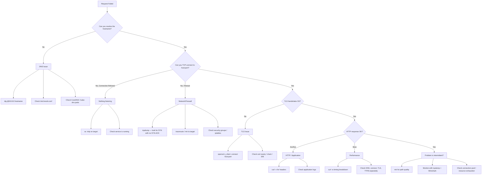

# Network Debugging — tcpdump, Wireshark, and Diagnostic Tools

**Date:** 2026-04-23 | **Updated:** 2026-04-23
**Tags:** `networking` `debugging` `tcpdump` `wireshark` `diagnostics`

---

## Table of Contents

- [Summary](#summary)
- [1. Debugging Methodology](#1-debugging-methodology)
  - [1.1 Think in Layers](#11-think-in-layers)
  - [1.2 Symptom-to-Layer Map](#12-symptom-to-layer-map)
  - [1.3 Diagnostic Flowchart](#13-diagnostic-flowchart)
- [2. tcpdump](#2-tcpdump)
  - [2.1 Capture Basics](#21-capture-basics)
  - [2.2 BPF Filter Syntax](#22-bpf-filter-syntax)
  - [2.3 Reading tcpdump Output](#23-reading-tcpdump-output)
  - [2.4 Common Recipes](#24-common-recipes)
  - [2.5 BPF Filter Cheat Sheet](#25-bpf-filter-cheat-sheet)
  - [2.6 Running in Containers and Kubernetes](#26-running-in-containers-and-kubernetes)
- [3. Wireshark](#3-wireshark)
  - [3.1 Opening and Navigating pcap Files](#31-opening-and-navigating-pcap-files)
  - [3.2 Display Filters vs Capture Filters](#32-display-filters-vs-capture-filters)
  - [3.3 Following TCP Streams](#33-following-tcp-streams)
  - [3.4 TLS Decryption with SSLKEYLOGFILE](#34-tls-decryption-with-sslkeylogfile)
  - [3.5 Protocol Dissectors](#35-protocol-dissectors)
  - [3.6 Useful Columns to Add](#36-useful-columns-to-add)
- [4. netstat and ss](#4-netstat-and-ss)
  - [4.1 Listing Connections by State](#41-listing-connections-by-state)
  - [4.2 Finding Processes by Port](#42-finding-processes-by-port)
  - [4.3 Watching TIME_WAIT Accumulation](#43-watching-time_wait-accumulation)
  - [4.4 Socket Statistics](#44-socket-statistics)
- [5. DNS Troubleshooting](#5-dns-troubleshooting)
  - [5.1 dig](#51-dig)
  - [5.2 nslookup and host](#52-nslookup-and-host)
  - [5.3 Checking DNS Propagation](#53-checking-dns-propagation)
  - [5.4 Common DNS Issues](#54-common-dns-issues)
- [6. traceroute and mtr](#6-traceroute-and-mtr)
  - [6.1 How traceroute Works](#61-how-traceroute-works)
  - [6.2 Reading traceroute Output](#62-reading-traceroute-output)
  - [6.3 mtr for Continuous Monitoring](#63-mtr-for-continuous-monitoring)
  - [6.4 TCP Traceroute for Firewall Traversal](#64-tcp-traceroute-for-firewall-traversal)
- [7. curl Deep Flags](#7-curl-deep-flags)
  - [7.1 Verbose Mode](#71-verbose-mode)
  - [7.2 Timing Breakdown with -w](#72-timing-breakdown-with--w)
  - [7.3 DNS Override with --resolve](#73-dns-override-with---resolve)
  - [7.4 Protocol and Proxy Flags](#74-protocol-and-proxy-flags)
  - [7.5 Full Trace](#75-full-trace)
- [8. ping and Connectivity](#8-ping-and-connectivity)
  - [8.1 ICMP Echo](#81-icmp-echo)
  - [8.2 When Ping Fails but Service Works](#82-when-ping-fails-but-service-works)
  - [8.3 MTU Discovery](#83-mtu-discovery)
- [9. OpenSSL Diagnostics](#9-openssl-diagnostics)
  - [9.1 s_client — Connect and Inspect](#91-s_client--connect-and-inspect)
  - [9.2 Certificate Inspection](#92-certificate-inspection)
  - [9.3 Checking Expiry](#93-checking-expiry)
  - [9.4 Verifying the Certificate Chain](#94-verifying-the-certificate-chain)
- [10. Debugging in Containers](#10-debugging-in-containers)
  - [10.1 Ephemeral Debug Containers](#101-ephemeral-debug-containers)
  - [10.2 nsenter for Network Namespace](#102-nsenter-for-network-namespace)
  - [10.3 tcpdump in a Sidecar](#103-tcpdump-in-a-sidecar)
  - [10.4 nicolaka/netshoot Toolkit](#104-nicolakanetshoot-toolkit)
- [11. Common Scenarios](#11-common-scenarios)
  - [11.1 Connection Refused](#111-connection-refused)
  - [11.2 Connection Timeout](#112-connection-timeout)
  - [11.3 Connection Reset](#113-connection-reset)
  - [11.4 SSL Handshake Failure](#114-ssl-handshake-failure)
  - [11.5 DNS Resolution Failure](#115-dns-resolution-failure)
  - [11.6 Intermittent 502/504](#116-intermittent-502504)
- [Related](#related)
- [References](#references)

---

## Summary

When a request fails in production, the first instinct is to read the application log. But application logs only see what your code sees — they cannot tell you whether the TCP handshake completed, whether DNS returned the wrong IP, or whether a firewall silently dropped a SYN packet. Network debugging tools give you visibility below the application layer, so you can isolate whether a problem is DNS, TCP, TLS, HTTP, or your code. This document covers the full diagnostic toolkit: packet capture with tcpdump and Wireshark, socket inspection with ss, DNS troubleshooting with dig, path analysis with traceroute/mtr, HTTP-level timing with curl, TLS inspection with openssl, and practical workflows for debugging inside containers and Kubernetes. Every backend developer writing Node.js or Spring Boot services will eventually need these tools — the goal is to know which tool to reach for when a specific symptom appears.

---

## 1. Debugging Methodology

### 1.1 Think in Layers

Network problems span the entire stack. The most common mistake is jumping straight to the application layer when the root cause is three layers below. A systematic approach starts by identifying which layer is broken, then drilling into details with the right tool.

**The layers you care about as a backend developer:**

| Layer | What Breaks Here | First Tool to Reach For |
|-------|-----------------|------------------------|
| **DNS** | Wrong IP, NXDOMAIN, stale cache, slow resolution | `dig`, `nslookup` |
| **TCP** | Connection refused/timeout/reset, port not listening, SYN dropped | `ss`, `tcpdump`, `telnet`/`nc` |
| **TLS** | Handshake failure, expired cert, wrong SNI, cipher mismatch | `openssl s_client`, `curl -v` |
| **HTTP** | 4xx/5xx, slow TTFB, wrong headers, bad routing | `curl -v -w`, application logs |
| **Application** | Logic bugs, payload issues, auth failures | Application logs, debugger |

**Rule of thumb:** Start from the bottom and work up. If TCP cannot connect, there is no point debugging TLS. If DNS returns the wrong IP, the TCP connection goes to the wrong host.

### 1.2 Symptom-to-Layer Map

| Symptom | Likely Layer | Start With |
|---------|-------------|------------|
| "Connection refused" | TCP — nothing listening on that port | `ss -tnlp`, `curl -v` |
| "Connection timed out" | TCP/Network — SYN packets dropped (firewall, wrong IP) | `tcpdump`, `traceroute` |
| "Connection reset by peer" | TCP — server rejected after connect | `tcpdump` (look for RST) |
| "SSL handshake failure" | TLS — cert or cipher mismatch | `openssl s_client` |
| "Name or service not known" | DNS — resolution failed | `dig`, check `/etc/resolv.conf` |
| "502 Bad Gateway" | HTTP — upstream unreachable from proxy/LB | Check upstream with `curl` from proxy host |
| "504 Gateway Timeout" | HTTP — upstream too slow or connection hung | `curl -w` timing, `tcpdump` |
| Intermittent failures | Often DNS TTL, connection pool exhaustion, or flaky network path | `mtr`, `ss -s`, application metrics |
| Slow responses | Could be any layer; use timing breakdown | `curl -w` to isolate DNS vs connect vs TLS vs TTFB |

### 1.3 Diagnostic Flowchart



---

## 2. tcpdump

tcpdump is the command-line packet capture tool available on virtually every Linux server and macOS machine. It reads packets directly from a network interface (or from a saved pcap file) and can filter them using Berkeley Packet Filter (BPF) expressions.

### 2.1 Capture Basics

```bash
# Capture all traffic on the default interface (requires root/sudo)
sudo tcpdump

# Capture on a specific interface
sudo tcpdump -i eth0

# Capture with human-readable timestamps and no DNS reverse lookup
sudo tcpdump -i eth0 -tttt -n

# Limit to 100 packets
sudo tcpdump -i eth0 -c 100

# Write to a pcap file for later Wireshark analysis
sudo tcpdump -i eth0 -w /tmp/capture.pcap

# Read from a pcap file
tcpdump -r /tmp/capture.pcap
```

**Key flags:**

| Flag | Purpose |
|------|---------|
| `-i <iface>` | Interface to capture on (`eth0`, `lo`, `any`) |
| `-n` | Do not resolve hostnames (faster, less ambiguous) |
| `-nn` | Do not resolve hostnames or port names |
| `-tttt` | Print timestamps in human-readable format |
| `-c <N>` | Stop after N packets |
| `-w <file>` | Write raw packets to pcap file |
| `-r <file>` | Read from pcap file |
| `-s <snaplen>` | Capture N bytes per packet (0 = full packet) |
| `-A` | Print packet payload in ASCII |
| `-X` | Print packet payload in hex + ASCII |
| `-v`, `-vv`, `-vvv` | Increasing verbosity |

### 2.2 BPF Filter Syntax

BPF (Berkeley Packet Filter) expressions go at the end of the tcpdump command. They are evaluated in the kernel, so filtered packets never reach userspace — this is critical for performance on busy servers.

```bash
# Filter by host
sudo tcpdump -i eth0 host 10.0.1.50

# Filter by source or destination
sudo tcpdump -i eth0 src host 10.0.1.50
sudo tcpdump -i eth0 dst host 10.0.1.50

# Filter by port
sudo tcpdump -i eth0 port 443
sudo tcpdump -i eth0 dst port 8080

# Filter by protocol
sudo tcpdump -i eth0 tcp
sudo tcpdump -i eth0 udp
sudo tcpdump -i eth0 icmp

# Combine with and/or/not
sudo tcpdump -i eth0 'host 10.0.1.50 and port 443'
sudo tcpdump -i eth0 'port 80 or port 443'
sudo tcpdump -i eth0 'not port 22'

# Filter by TCP flags
sudo tcpdump -i eth0 'tcp[tcpflags] & (tcp-syn) != 0'  # SYN packets
sudo tcpdump -i eth0 'tcp[tcpflags] & (tcp-rst) != 0'  # RST packets
sudo tcpdump -i eth0 'tcp[tcpflags] & (tcp-fin) != 0'  # FIN packets

# Filter by subnet
sudo tcpdump -i eth0 net 10.0.1.0/24
```

### 2.3 Reading tcpdump Output

A typical tcpdump line:

```
14:23:45.123456 IP 10.0.1.50.52340 > 10.0.2.100.443: Flags [S], seq 1234567890, win 65535, options [mss 1460,sackOK,TS val 123456 ecr 0,nop,wscale 7], length 0
```

Breaking this down:

| Field | Meaning |
|-------|---------|
| `14:23:45.123456` | Timestamp |
| `IP` | IPv4 packet |
| `10.0.1.50.52340` | Source IP.port |
| `10.0.2.100.443` | Destination IP.port |
| `Flags [S]` | TCP flags: S=SYN, .=ACK, F=FIN, R=RST, P=PUSH |
| `seq 1234567890` | Sequence number |
| `win 65535` | Window size |
| `length 0` | Payload length (SYN has no payload) |

**TCP flag combinations you see frequently:**

| Flags | Meaning |
|-------|---------|
| `[S]` | SYN — connection initiation |
| `[S.]` | SYN-ACK — server acknowledges |
| `[.]` | ACK |
| `[P.]` | PSH-ACK — data push |
| `[F.]` | FIN-ACK — connection teardown |
| `[R]` | RST — connection reset |
| `[R.]` | RST-ACK |

### 2.4 Common Recipes

**Capture HTTP traffic (unencrypted):**

```bash
sudo tcpdump -i eth0 -A -s 0 'tcp port 80'
```

**Capture TLS handshake (Client Hello / Server Hello):**

```bash
# TLS handshake starts with content type 0x16 (22) and handshake type 0x01 (Client Hello)
sudo tcpdump -i eth0 -nn 'tcp port 443 and (tcp[((tcp[12:1] & 0xf0) >> 2):1] = 0x16)'
```

**Capture DNS queries (port 53):**

```bash
sudo tcpdump -i eth0 -nn 'udp port 53'
```

**Capture only SYN packets (new connections):**

```bash
sudo tcpdump -i eth0 -nn 'tcp[tcpflags] == tcp-syn'
```

**Capture RST packets (connection resets):**

```bash
sudo tcpdump -i eth0 -nn 'tcp[tcpflags] & (tcp-rst) != 0'
```

**Capture traffic between two specific hosts:**

```bash
sudo tcpdump -i eth0 -nn 'host 10.0.1.50 and host 10.0.2.100'
```

**Write to a pcap file with rotation (10MB files, keep 5):**

```bash
sudo tcpdump -i eth0 -w /tmp/capture.pcap -C 10 -W 5 'port 443'
```

### 2.5 BPF Filter Cheat Sheet

| Filter Expression | Captures |
|-------------------|----------|
| `host 10.0.1.50` | All traffic to/from 10.0.1.50 |
| `src host 10.0.1.50` | Traffic originating from 10.0.1.50 |
| `dst host 10.0.1.50` | Traffic destined to 10.0.1.50 |
| `port 443` | All traffic on port 443 (src or dst) |
| `dst port 8080` | Traffic destined to port 8080 |
| `portrange 8000-8999` | Traffic on ports 8000 through 8999 |
| `tcp` | Only TCP packets |
| `udp` | Only UDP packets |
| `icmp` | Only ICMP packets |
| `net 10.0.0.0/8` | Traffic to/from the 10.x.x.x subnet |
| `tcp[tcpflags] == tcp-syn` | Only SYN packets (new connections) |
| `tcp[tcpflags] & tcp-rst != 0` | Packets with RST flag set |
| `tcp[tcpflags] & tcp-fin != 0` | Packets with FIN flag set |
| `not port 22` | Exclude SSH traffic |
| `greater 1000` | Packets larger than 1000 bytes |
| `less 100` | Packets smaller than 100 bytes |

### 2.6 Running in Containers and Kubernetes

Containers typically ship without tcpdump. You have several options:

**Option 1: kubectl debug (ephemeral container):**

```bash
# Attach a debug container to a running pod
kubectl debug -it <pod-name> --image=nicolaka/netshoot --target=<container-name> -- tcpdump -i eth0 -nn port 8080
```

**Option 2: Copy tcpdump binary in:**

```bash
# If the container has a writable filesystem
kubectl cp /usr/sbin/tcpdump <pod-name>:/tmp/tcpdump
kubectl exec -it <pod-name> -- /tmp/tcpdump -i eth0 -nn port 8080
```

**Option 3: Capture on the host's network namespace:**

```bash
# Find the container's PID
docker inspect --format '{{.State.Pid}}' <container-id>

# Use nsenter to enter the container's network namespace
sudo nsenter -t <pid> -n tcpdump -i eth0 -nn port 8080
```

**Option 4: tcpdump sidecar (pre-deploy for debug-ready pods):**

```yaml
# Add to your pod spec as a sidecar
- name: tcpdump
  image: nicolaka/netshoot
  command: ["sleep", "infinity"]
  securityContext:
    capabilities:
      add: ["NET_ADMIN", "NET_RAW"]
```

Then exec into the sidecar when needed:

```bash
kubectl exec -it <pod-name> -c tcpdump -- tcpdump -i eth0 -w /tmp/capture.pcap
```

---

## 3. Wireshark

Wireshark is the GUI packet analyzer. Its strength over tcpdump is protocol dissection — it parses hundreds of protocols and presents them in a navigable tree structure. The usual workflow is: capture with tcpdump (on the server) and analyze with Wireshark (on your laptop).

### 3.1 Opening and Navigating pcap Files

```bash
# Copy pcap from server to local machine
scp server:/tmp/capture.pcap .

# Open in Wireshark
wireshark capture.pcap

# Or use tshark (Wireshark's CLI) for scripted analysis
tshark -r capture.pcap -Y 'http.response.code == 500'
```

**Keyboard shortcuts worth memorizing:**

| Shortcut | Action |
|----------|--------|
| `Ctrl+F` | Find packet by display filter |
| `Ctrl+G` | Go to packet number |
| `Ctrl+Shift+E` | Expert Info (errors, warnings) |
| Right-click a packet → Follow → TCP Stream | Reconstruct the full conversation |

### 3.2 Display Filters vs Capture Filters

Wireshark has two independent filter systems. This confuses everyone at first.

| Aspect | Capture Filter | Display Filter |
|--------|---------------|----------------|
| **Syntax** | BPF (same as tcpdump) | Wireshark display filter language |
| **Applied when** | During capture | After capture, to the packet list |
| **Performance** | Reduces file size; kernel-level | No effect on capture; post-processing |
| **Example: filter port** | `port 443` | `tcp.port == 443` |
| **Example: filter host** | `host 10.0.1.50` | `ip.addr == 10.0.1.50` |
| **Example: filter HTTP** | `tcp port 80` | `http` |

**Common display filters:**

```
# HTTP requests and responses
http.request or http.response

# HTTP 5xx errors
http.response.code >= 500

# TLS handshake messages
tls.handshake

# TLS Client Hello only
tls.handshake.type == 1

# DNS queries
dns.qr == 0

# DNS responses with NXDOMAIN
dns.flags.rcode == 3

# TCP retransmissions
tcp.analysis.retransmission

# TCP resets
tcp.flags.reset == 1

# TCP SYN without ACK (new connections)
tcp.flags.syn == 1 && tcp.flags.ack == 0

# Packets with specific IP
ip.addr == 10.0.1.50

# Packets between two hosts
ip.addr == 10.0.1.50 && ip.addr == 10.0.2.100

# Slow TCP segments (delta time > 1 second from previous)
frame.time_delta > 1
```

### 3.3 Following TCP Streams

The single most useful Wireshark feature for debugging HTTP/TCP issues:

1. Right-click any packet in a conversation
2. **Follow** → **TCP Stream**
3. Wireshark reconstructs the full request/response exchange
4. Toggle between ASCII, hex, raw views
5. Use the stream number dropdown to navigate between different TCP connections

This instantly shows you the full HTTP request and response, including headers and body, reassembled from individual TCP segments.

### 3.4 TLS Decryption with SSLKEYLOGFILE

Modern TLS uses ephemeral key exchange (ECDHE), so you cannot decrypt with the server's private key. Instead, applications can log per-session keys to a file.

**Step 1: Tell your application to log keys:**

```bash
# Works with Chrome, Firefox, curl, and any app using OpenSSL/NSS/BoringSSL
export SSLKEYLOGFILE=/tmp/sslkeys.log

# Then run your application or browser
curl https://api.example.com/health
```

**For Node.js:**

```javascript
const tls = require('tls');
const fs = require('fs');

// Node.js 12.3+ supports keylog event
const logStream = fs.createWriteStream('/tmp/sslkeys.log', { flags: 'a' });
const agent = new https.Agent();
agent.on('keylog', (line, tlsSocket) => {
  logStream.write(line);
  logStream.write('\n');
});
```

**For Java (JDK 17+ with javax.net.ssl.SSLContext):**

```bash
# Use jSSLKeyLog agent (third-party) or set
-Djavax.net.debug=ssl,handshake   # debug output, not SSLKEYLOGFILE format
```

**Step 2: Configure Wireshark:**

1. Preferences → Protocols → TLS
2. Set **(Pre)-Master-Secret log filename** to `/tmp/sslkeys.log`
3. Apply — encrypted traffic is now decrypted in the packet list

### 3.5 Protocol Dissectors

Wireshark auto-detects protocols on standard ports. For non-standard ports, tell Wireshark what to expect:

1. Right-click a packet → **Decode As...**
2. Set the port mapping (e.g., port 8443 → TLS, port 9090 → HTTP)
3. Wireshark re-dissects all packets on that port

Useful for debugging backend services running on non-standard ports.

### 3.6 Useful Columns to Add

The default columns miss important timing and connection info. Add these via Edit → Preferences → Columns:

| Column Title | Type / Field | Why |
|-------------|-------------|-----|
| **Delta Time** | `frame.time_delta_displayed` | Time since previous displayed packet — spots slow segments |
| **TCP Stream Index** | `tcp.stream` | Groups packets by connection — essential when multiple connections interleave |
| **TCP Window Size** | `tcp.window_size_value` | Spots zero-window or small-window issues |
| **HTTP Host** | `http.host` | Which virtual host was requested |
| **TLS SNI** | `tls.handshake.extensions_server_name` | Which hostname the client sent in Client Hello |

---

## 4. netstat and ss

ss (socket statistics) is the modern replacement for netstat on Linux. It reads directly from kernel socket tables via netlink and is significantly faster on machines with thousands of connections.

### 4.1 Listing Connections by State

```bash
# All TCP connections with state
ss -tan

# Only ESTABLISHED connections
ss -tan state established

# Only LISTEN sockets
ss -tnl

# Only TIME_WAIT sockets
ss -tan state time-wait

# Only CLOSE_WAIT sockets (likely a bug — your app isn't closing connections)
ss -tan state close-wait

# Filter by destination port
ss -tan 'dport = :443'

# Filter by source port
ss -tan 'sport = :8080'
```

**macOS note:** macOS does not have ss. Use netstat:

```bash
# All TCP connections
netstat -an -p tcp

# Listening sockets
netstat -an -p tcp | grep LISTEN

# Connections to a specific port
netstat -an -p tcp | grep '.443 '
```

### 4.2 Finding Processes by Port

```bash
# Which process is listening on port 8080? (Linux)
ss -tnlp 'sport = :8080'
# Output: LISTEN  0  128  *:8080  *:*  users:(("java",pid=12345,fd=7))

# Which process is listening on port 8080? (macOS)
lsof -i :8080 -P -n

# Which process has a connection to a remote host? (Linux)
ss -tnp 'dst 10.0.2.100'
```

### 4.3 Watching TIME_WAIT Accumulation

TIME_WAIT sockets are normal — they exist for 2 * MSL (typically 60 seconds on Linux) after a TCP connection closes. But excessive TIME_WAIT counts indicate your application is creating and destroying connections too aggressively instead of pooling them.

```bash
# Count connections by state
ss -tan | awk '{print $1}' | sort | uniq -c | sort -rn

# Watch TIME_WAIT count over time
watch -n 1 'ss -tan state time-wait | wc -l'

# Count TIME_WAIT per destination
ss -tan state time-wait | awk '{print $4}' | sort | uniq -c | sort -rn
```

If you see thousands of TIME_WAIT sockets to the same destination, you need connection pooling. See [Connection Pooling](connection-pooling.md).

### 4.4 Socket Statistics

```bash
# Summary statistics
ss -s
# Output:
# Total: 1532
# TCP:   842 (estab 456, closed 12, orphaned 3, timewait 198)
# UDP:   23
# ...

# Detailed socket info (timer, retransmit count, congestion window)
ss -tnei 'dport = :5432'

# Show memory usage per socket
ss -tnm 'sport = :8080'
```

---

## 5. DNS Troubleshooting

DNS resolution failure is one of the most common causes of "it works on my machine." A wrong or stale DNS response sends your traffic to the wrong place, and the resulting TCP or HTTP errors give no hint that DNS was the real problem.

### 5.1 dig

dig (Domain Information Groper) is the primary DNS diagnostic tool. It queries DNS servers directly and shows the full response.

```bash
# Basic lookup (A record)
dig example.com

# Short output — just the answer
dig +short example.com

# Query a specific record type
dig example.com AAAA         # IPv6
dig example.com MX           # Mail servers
dig example.com TXT          # TXT records (SPF, DKIM, domain verification)
dig example.com CNAME        # Canonical name
dig _http._tcp.example.com SRV  # Service discovery

# Query a specific DNS server (bypass local resolver)
dig @8.8.8.8 example.com
dig @1.1.1.1 example.com

# Trace the full resolution path (root → TLD → authoritative)
dig +trace example.com

# Check the authoritative nameservers
dig example.com NS

# Reverse DNS lookup
dig -x 93.184.216.34

# Check TTL values (how long is this cached?)
dig +noall +answer example.com
# example.com.    300    IN    A    93.184.216.34
#                 ^^^-- 300 seconds remaining TTL
```

### 5.2 nslookup and host

Simpler alternatives when you just need a quick answer:

```bash
# nslookup — quick lookup
nslookup example.com
nslookup example.com 8.8.8.8    # use a specific server

# host — even simpler output
host example.com
host -t MX example.com
host -t TXT example.com
```

### 5.3 Checking DNS Propagation

When you change a DNS record, propagation takes time (up to the old TTL).

```bash
# Check what different resolvers see
dig @8.8.8.8 example.com +short      # Google
dig @1.1.1.1 example.com +short      # Cloudflare
dig @208.67.222.222 example.com +short # OpenDNS

# Check the authoritative server directly
dig example.com NS +short
# ns1.example.com
dig @ns1.example.com example.com +short

# Flush local DNS cache (macOS)
sudo dscacheutil -flushcache; sudo killall -HUP mDNSResponder

# Flush local DNS cache (systemd-resolved on Linux)
sudo systemd-resolve --flush-caches
```

### 5.4 Common DNS Issues

| Symptom | dig Output | Likely Cause | Fix |
|---------|-----------|-------------|-----|
| **NXDOMAIN** | `status: NXDOMAIN` | Domain does not exist in DNS | Check for typos, verify record exists at registrar |
| **SERVFAIL** | `status: SERVFAIL` | Authoritative server cannot answer | DNSSEC validation failure, authoritative server down |
| **Stale cache** | Old IP returned | Local resolver caches old record until TTL expires | Wait for TTL, flush cache, or query authoritative directly |
| **Wrong /etc/resolv.conf** | Correct dig output, but app fails | App uses system resolver which has different config | Check `/etc/resolv.conf`, CoreDNS config in k8s |
| **DNS timeout** | No response | Resolver unreachable, firewall blocking UDP 53 | Check network path to resolver, try TCP (`dig +tcp`) |
| **search domain confusion** | Extra suffix appended | `/etc/resolv.conf` has `search` directive | Use FQDN with trailing dot: `example.com.` |

**In Kubernetes specifically:** Pods use CoreDNS. If DNS resolution fails inside a pod but works on the host:

```bash
# Check CoreDNS pods are running
kubectl get pods -n kube-system -l k8s-app=kube-dns

# Check CoreDNS logs
kubectl logs -n kube-system -l k8s-app=kube-dns

# Test from inside a pod
kubectl exec -it <pod> -- nslookup kubernetes.default.svc.cluster.local
```

---

## 6. traceroute and mtr

### 6.1 How traceroute Works

traceroute discovers the path packets take by exploiting the IP TTL (Time To Live) field. It sends packets with incrementally increasing TTL values:

1. Send packet with TTL=1 → First router decrements to 0, replies with ICMP "Time Exceeded"
2. Send packet with TTL=2 → Second router replies
3. Continue until the destination replies or max hops reached

Each hop is probed three times by default to show latency variation.

```bash
# Basic traceroute (uses UDP by default on Linux, ICMP on macOS)
traceroute example.com

# Use ICMP echo (like ping) — more likely to be blocked
traceroute -I example.com

# Use TCP SYN to port 443 — traverses most firewalls
sudo traceroute -T -p 443 example.com

# Limit hops
traceroute -m 15 example.com

# Don't resolve hostnames (faster)
traceroute -n example.com
```

### 6.2 Reading traceroute Output

```
 1  192.168.1.1 (192.168.1.1)  1.234 ms  0.987 ms  1.102 ms
 2  10.0.0.1 (10.0.0.1)  5.432 ms  4.876 ms  5.101 ms
 3  * * *
 4  72.14.215.212 (72.14.215.212)  12.345 ms  11.987 ms  12.567 ms
 5  93.184.216.34 (93.184.216.34)  15.678 ms  14.890 ms  15.234 ms
```

| Pattern | Meaning |
|---------|---------|
| `* * *` | Hop does not respond — router configured to not reply to TTL exceeded (common and often harmless) |
| Sudden large latency jump | Possible congestion or geographic distance at that hop |
| Consistent high latency from a hop onward | Problem at or beyond that hop |
| Last hop responds but no further | Firewall blocking, or destination not replying |
| Asymmetric latency (high in one direction) | Return path is different — check with reverse traceroute |

**Important caveat:** High latency at an intermediate hop does not necessarily mean that hop is congested. Many routers deprioritize ICMP responses. Only care about high latency if it persists for all subsequent hops (cumulative degradation).

### 6.3 mtr for Continuous Monitoring

mtr combines traceroute and ping into a single tool that continuously probes and updates statistics. Far superior for diagnosing intermittent path issues.

```bash
# Interactive mode (updates in real-time)
mtr example.com

# Report mode (run N cycles, then print summary)
mtr -r -c 100 example.com

# Use TCP to port 443 (bypasses ICMP blocking)
mtr -T -P 443 example.com

# No DNS resolution
mtr -n example.com
```

**Key mtr columns:**

| Column | Meaning |
|--------|---------|
| **Loss%** | Packet loss percentage — anything above 0% at the final hop is concerning |
| **Snt** | Packets sent |
| **Last** | Most recent RTT |
| **Avg** | Average RTT |
| **Best** | Minimum RTT |
| **Wrst** | Maximum RTT |
| **StDev** | Standard deviation — high StDev means jitter |

### 6.4 TCP Traceroute for Firewall Traversal

Many firewalls drop ICMP and UDP traceroute packets but allow TCP on common ports. TCP traceroute sends SYN packets instead:

```bash
# tcptraceroute (separate tool)
sudo tcptraceroute example.com 443

# Or use traceroute with -T flag
sudo traceroute -T -p 443 example.com

# Or use mtr with TCP
mtr -T -P 443 example.com
```

This is often the only way to trace the path to a service behind a cloud load balancer or firewall.

---

## 7. curl Deep Flags

curl is arguably the most important debugging tool for HTTP services. Beyond basic GET requests, its diagnostic flags reveal the full timeline of a request.

### 7.1 Verbose Mode

```bash
# -v shows the entire request/response exchange including TLS handshake
curl -v https://api.example.com/health

# Output includes:
# * Trying 93.184.216.34:443...
# * Connected to api.example.com (93.184.216.34) port 443
# * ALPN: offers h2,http/1.1
# * TLSv1.3 (OUT), TLS handshake, Client hello
# * TLSv1.3 (IN), TLS handshake, Server hello
# * SSL connection using TLSv1.3 / TLS_AES_256_GCM_SHA384
# * Server certificate:
# *  subject: CN=api.example.com
# *  issuer: C=US; O=Let's Encrypt; CN=R3
# *  SSL certificate verify ok.
# > GET /health HTTP/2
# > Host: api.example.com
# > User-Agent: curl/8.4.0
# >
# < HTTP/2 200
# < content-type: application/json
# ...
```

### 7.2 Timing Breakdown with -w

The `-w` (write-out) flag extracts per-phase timing. This is the single most valuable curl feature for diagnosing slow requests.

```bash
curl -o /dev/null -s -w "\
    DNS Lookup:  %{time_namelookup}s\n\
   TCP Connect:  %{time_connect}s\n\
   TLS Handshake: %{time_appconnect}s\n\
   TTFB:         %{time_starttransfer}s\n\
   Total:        %{time_total}s\n\
   HTTP Code:    %{http_code}\n\
   Size:         %{size_download} bytes\n\
   Remote IP:    %{remote_ip}\n" \
    https://api.example.com/health
```

**Example output and what to look for:**

```
    DNS Lookup:  0.025s        ← >1s? DNS resolver slow or unreachable
   TCP Connect:  0.052s        ← (connect - dns) = network RTT. >1s? Route problem
   TLS Handshake: 0.142s       ← (appconnect - connect) = TLS overhead. >1s? Cert chain issue
   TTFB:         0.387s        ← (starttransfer - appconnect) = server processing. >1s? Slow backend
   Total:        0.412s        ← Transfer time included. Much larger than TTFB? Large response
   HTTP Code:    200
   Size:         42 bytes
   Remote IP:    93.184.216.34
```

**Save this as a shell alias:**

```bash
# Add to ~/.bashrc or ~/.zshrc
alias curltime='curl -o /dev/null -s -w "DNS: %{time_namelookup}s | Connect: %{time_connect}s | TLS: %{time_appconnect}s | TTFB: %{time_starttransfer}s | Total: %{time_total}s | Code: %{http_code}\n"'

# Usage
curltime https://api.example.com/health
```

### 7.3 DNS Override with --resolve

Bypass DNS resolution to test against a specific backend IP without modifying `/etc/hosts`:

```bash
# Force api.example.com to resolve to a specific IP
curl --resolve api.example.com:443:10.0.1.50 https://api.example.com/health

# Test a new server before DNS cutover
curl --resolve newsite.example.com:443:10.0.2.200 https://newsite.example.com/

# Test multiple hosts
curl --resolve "host1.example.com:443:10.0.1.1" \
     --resolve "host2.example.com:443:10.0.1.2" \
     https://host1.example.com/api/data
```

### 7.4 Protocol and Proxy Flags

```bash
# Skip TLS certificate verification (never in production scripts!)
curl -k https://self-signed.example.com/

# Force HTTP/2
curl --http2 https://api.example.com/health

# Force HTTP/3 (QUIC) — requires curl built with HTTP/3 support
curl --http3 https://api.example.com/health

# Use a proxy
curl -x http://proxy.example.com:3128 https://api.example.com/health
curl -x socks5://localhost:1080 https://api.example.com/health

# Send custom headers
curl -H "Authorization: Bearer TOKEN" -H "X-Request-Id: debug-123" https://api.example.com/health

# POST with JSON body
curl -X POST -H "Content-Type: application/json" -d '{"key": "value"}' https://api.example.com/data
```

### 7.5 Full Trace

For maximum detail, write the entire exchange (including TLS records) to a file:

```bash
# ASCII trace
curl --trace-ascii /tmp/curl-trace.txt https://api.example.com/health

# Binary trace (for non-text protocols)
curl --trace /tmp/curl-trace.bin https://api.example.com/health

# Trace with timestamps
curl --trace-ascii /tmp/curl-trace.txt --trace-time https://api.example.com/health
```

---

## 8. ping and Connectivity

### 8.1 ICMP Echo

ping sends ICMP Echo Request packets and waits for Echo Reply. It tests basic IP-layer reachability and round-trip time.

```bash
# Basic ping
ping example.com

# Limit to 5 packets
ping -c 5 example.com

# Set interval (seconds between packets)
ping -i 0.2 example.com     # 200ms interval (requires root for < 0.2s)

# Set packet size
ping -s 1400 example.com    # 1400 byte payload + 8 ICMP header + 20 IP header = 1428

# Timestamp each reply (Linux)
ping -D example.com
```

### 8.2 When Ping Fails but Service Works

ICMP is often blocked by firewalls. A failed ping does **not** mean the host is unreachable.

**Correct diagnostic sequence:**

```bash
# 1. Ping fails?
ping -c 3 api.example.com
# PING api.example.com (10.0.2.100): 56 data bytes
# Request timeout for icmp_seq 0

# 2. Try TCP connectivity instead
nc -zv api.example.com 443
# Connection to api.example.com 443 port [tcp/https] succeeded!

# 3. Or use curl
curl -o /dev/null -s -w "%{http_code}\n" https://api.example.com/health
# 200
```

**Lesson:** Use ping for measuring RTT to hosts you know respond to ICMP. Use `nc -zv` (netcat) or `curl` to test TCP/HTTP service availability.

### 8.3 MTU Discovery

Path MTU (Maximum Transmission Unit) issues cause mysterious failures: small requests work, large ones fail or hang.

```bash
# Test with Don't Fragment flag and increasing sizes
# Default Ethernet MTU = 1500 (payload 1472 + 20 IP header + 8 ICMP header)

# macOS:
ping -D -s 1472 example.com    # -D = Don't Fragment

# Linux:
ping -M do -s 1472 example.com # -M do = Don't Fragment

# If "Frag needed" or "Message too long" → something in the path has a smaller MTU
# Reduce size until it works — that's the Path MTU
ping -M do -s 1400 example.com
```

Common culprits: VPN tunnels (overhead reduces effective MTU), Docker overlay networks, GRE tunnels.

---

## 9. OpenSSL Diagnostics

### 9.1 s_client — Connect and Inspect

openssl s_client establishes a TLS connection and displays every step of the handshake. This is the first tool to use when TLS fails.

```bash
# Connect and show certificate + handshake details
openssl s_client -connect api.example.com:443

# Specify SNI (Server Name Indication) — critical for shared hosting / CDNs
openssl s_client -connect api.example.com:443 -servername api.example.com

# Show the full certificate chain
openssl s_client -connect api.example.com:443 -showcerts

# Check which TLS version was negotiated
openssl s_client -connect api.example.com:443 2>/dev/null | grep "Protocol"
# Protocol  : TLSv1.3

# Check which cipher was negotiated
openssl s_client -connect api.example.com:443 2>/dev/null | grep "Cipher"
# Cipher    : TLS_AES_256_GCM_SHA384

# Force a specific TLS version
openssl s_client -connect api.example.com:443 -tls1_2
openssl s_client -connect api.example.com:443 -tls1_3

# Connect via STARTTLS (for SMTP, IMAP, etc.)
openssl s_client -connect mail.example.com:587 -starttls smtp
```

### 9.2 Certificate Inspection

```bash
# Download and inspect the server certificate
echo | openssl s_client -connect api.example.com:443 -servername api.example.com 2>/dev/null | openssl x509 -noout -text

# Just the subject and issuer
echo | openssl s_client -connect api.example.com:443 2>/dev/null | openssl x509 -noout -subject -issuer

# Subject Alternative Names (SANs) — which domains does this cert cover?
echo | openssl s_client -connect api.example.com:443 2>/dev/null | openssl x509 -noout -ext subjectAltName

# Inspect a local certificate file
openssl x509 -in cert.pem -noout -text
```

### 9.3 Checking Expiry

```bash
# Check when the certificate expires
echo | openssl s_client -connect api.example.com:443 2>/dev/null | openssl x509 -noout -dates
# notBefore=Jan  1 00:00:00 2026 GMT
# notAfter=Apr  1 00:00:00 2027 GMT

# Check if it expires within 30 days
echo | openssl s_client -connect api.example.com:443 2>/dev/null | openssl x509 -noout -checkend 2592000
# Certificate will not expire (exit code 0)
# or
# Certificate will expire (exit code 1)
```

**Automate cert expiry monitoring in CI:**

```bash
#!/bin/bash
DOMAINS=("api.example.com" "web.example.com" "auth.example.com")
WARN_DAYS=30
WARN_SECS=$((WARN_DAYS * 86400))

for domain in "${DOMAINS[@]}"; do
  if ! echo | openssl s_client -connect "${domain}:443" -servername "${domain}" 2>/dev/null | \
       openssl x509 -noout -checkend "${WARN_SECS}" 2>/dev/null; then
    echo "WARNING: ${domain} certificate expires within ${WARN_DAYS} days"
  fi
done
```

### 9.4 Verifying the Certificate Chain

```bash
# Verify the chain against system CA store
echo | openssl s_client -connect api.example.com:443 2>/dev/null | grep "Verify return code"
# Verify return code: 0 (ok)

# Common non-zero return codes:
# 10 = certificate has expired
# 18 = self-signed certificate
# 19 = self-signed certificate in chain
# 20 = unable to get local issuer certificate (missing intermediate)
# 21 = unable to verify the first certificate

# Verify against a custom CA bundle
openssl s_client -connect api.example.com:443 -CAfile /path/to/ca-bundle.pem
```

---

## 10. Debugging in Containers

Minimal container images (distroless, Alpine, scratch) ship without any debugging tools. You cannot just `apt-get install tcpdump` in a scratch-based image. Here are the workarounds.

### 10.1 Ephemeral Debug Containers

Kubernetes 1.23+ supports ephemeral containers that attach to a running pod without modifying its spec:

```bash
# Attach a debug container with full networking tools
kubectl debug -it <pod-name> \
  --image=nicolaka/netshoot \
  --target=<container-name> \
  -- /bin/bash

# Inside the debug container, you share the pod's network namespace
# All tools work: tcpdump, dig, curl, ss, nslookup, traceroute, etc.
tcpdump -i eth0 -nn port 8080
curl localhost:8080/health
dig kubernetes.default.svc.cluster.local
```

### 10.2 nsenter for Network Namespace

When you have access to the host but not the container, use nsenter to enter the container's network namespace:

```bash
# Find the container's PID
# Docker:
PID=$(docker inspect --format '{{.State.Pid}}' <container-id>)

# containerd (via crictl):
PID=$(crictl inspect <container-id> | jq '.info.pid')

# Enter the network namespace
sudo nsenter -t $PID -n

# Now you're in the container's network namespace on the host
# Use the host's tools (tcpdump, ss, etc.) against the container's network stack
ss -tnlp
tcpdump -i eth0 -nn port 8080

# Exit
exit
```

### 10.3 tcpdump in a Sidecar

For production debugging, pre-deploy a dormant sidecar that can be activated on demand:

```yaml
apiVersion: v1
kind: Pod
metadata:
  name: my-app
spec:
  containers:
    - name: app
      image: my-app:latest
      ports:
        - containerPort: 8080
    - name: debug
      image: nicolaka/netshoot
      command: ["sleep", "infinity"]
      securityContext:
        capabilities:
          add: ["NET_ADMIN", "NET_RAW"]
      resources:
        requests:
          memory: "32Mi"
          cpu: "10m"
        limits:
          memory: "64Mi"
          cpu: "50m"
```

```bash
# Activate when needed
kubectl exec -it my-app -c debug -- tcpdump -i eth0 -w /tmp/capture.pcap port 8080

# Copy pcap out for Wireshark analysis
kubectl cp my-app:/tmp/capture.pcap ./capture.pcap -c debug
```

### 10.4 nicolaka/netshoot Toolkit

The [nicolaka/netshoot](https://github.com/nicolaka/netshoot) image is the de facto standard for container network debugging. It includes:

| Tool | Purpose |
|------|---------|
| `tcpdump` | Packet capture |
| `tshark` | CLI Wireshark |
| `dig` / `nslookup` / `host` | DNS debugging |
| `curl` / `wget` | HTTP debugging |
| `ss` / `netstat` | Socket inspection |
| `traceroute` / `mtr` | Path analysis |
| `iperf3` | Bandwidth testing |
| `nmap` | Port scanning |
| `openssl` | TLS debugging |
| `ip` / `bridge` | Network configuration |
| `ethtool` | Interface info |
| `termshark` | TUI Wireshark |

```bash
# Run as a standalone debug pod in a specific namespace
kubectl run netshoot --rm -it --image=nicolaka/netshoot -n <namespace> -- /bin/bash

# Or attach to a specific node's host network
kubectl debug node/<node-name> -it --image=nicolaka/netshoot
```

---

## 11. Common Scenarios

### 11.1 Connection Refused

**Error:** `ECONNREFUSED` (Node.js) / `java.net.ConnectException: Connection refused`

**What happened:** TCP SYN was sent, and the destination responded with RST. The port is not open.

**Step-by-step debugging:**

```bash
# 1. Verify the target is listening
ss -tnlp 'sport = :8080'  # on the target machine
# Empty output means nothing is listening

# 2. Check if the service process is running
systemctl status my-service
docker ps | grep my-service

# 3. Check if it's bound to the right interface
ss -tnlp 'sport = :8080'
# LISTEN  0  128  127.0.0.1:8080  *:*
#                 ^^^^^^^^^ bound to localhost only — won't accept remote connections

# Fix: Bind to 0.0.0.0 instead of 127.0.0.1

# 4. In Kubernetes, check the Service and Endpoints
kubectl get endpoints my-service
# If ENDPOINTS is empty, no pods match the Service selector
```

### 11.2 Connection Timeout

**Error:** `ETIMEDOUT` / `java.net.ConnectException: Connection timed out`

**What happened:** TCP SYN was sent but no SYN-ACK came back. The SYN is being silently dropped — typically a firewall, wrong IP, or routing issue.

```bash
# 1. Verify DNS resolves to the right IP
dig +short api.example.com
# Is this the IP you expect?

# 2. Try TCP connectivity
nc -zv -w 5 api.example.com 443
# If timeout → network issue, not application issue

# 3. Capture the SYN to confirm it's being dropped
sudo tcpdump -i eth0 -nn 'host api.example.com and tcp[tcpflags] == tcp-syn'
# You should see repeated SYN packets with no SYN-ACK

# 4. Trace the path
mtr -T -P 443 api.example.com
# Look for where packet loss starts

# 5. Check firewall rules
# AWS: Check Security Group inbound rules
# GCP: Check VPC firewall rules
# Linux: sudo iptables -L -n
```

### 11.3 Connection Reset

**Error:** `ECONNRESET` / `java.net.SocketException: Connection reset`

**What happened:** The remote side sent a TCP RST after the connection was established. Common causes: application crash, load balancer health check failure, connection idle timeout, or the server's accept backlog overflowed.

```bash
# 1. Capture the RST to see who sent it and when
sudo tcpdump -i eth0 -nn 'host api.example.com and tcp[tcpflags] & tcp-rst != 0'

# 2. Check if a load balancer is in the middle
# LBs have idle timeouts (typically 60s for ALB, 350s for NLB).
# If your connection is idle longer than the LB timeout, the LB sends RST.

# 3. Check the backlog
ss -tnl 'sport = :8080'
# LISTEN  0  128  *:8080  *:*
#            ^^^ backlog size
# If current queue exceeds this, new connections get RST

# 4. Check server logs for crashes or restarts
kubectl logs <pod> --previous   # in Kubernetes
journalctl -u my-service       # on Linux with systemd
```

### 11.4 SSL Handshake Failure

**Error:** `UNABLE_TO_VERIFY_LEAF_SIGNATURE` (Node.js) / `javax.net.ssl.SSLHandshakeException`

```bash
# 1. Check the certificate
openssl s_client -connect api.example.com:443 -servername api.example.com

# Look at: "Verify return code:"
# 0 = ok
# 10 = expired
# 20 = missing intermediate cert
# 21 = can't verify — unknown CA

# 2. Check expiry
echo | openssl s_client -connect api.example.com:443 2>/dev/null | openssl x509 -noout -dates

# 3. Check if SNI is the issue (multi-tenant hosting)
# Without SNI:
openssl s_client -connect api.example.com:443
# With SNI:
openssl s_client -connect api.example.com:443 -servername api.example.com
# If different certs are returned, SNI is required and your client may not be sending it

# 4. Check TLS version compatibility
openssl s_client -connect api.example.com:443 -tls1_2
# If this fails but -tls1_3 works, your client may be using an old TLS version

# 5. In Java, enable TLS debug logging
# Add to JVM args: -Djavax.net.debug=ssl,handshake
# This produces detailed handshake output to stderr
```

### 11.5 DNS Resolution Failure

**Error:** `ENOTFOUND` (Node.js) / `java.net.UnknownHostException`

```bash
# 1. Can the resolver reach the DNS server?
dig @$(grep nameserver /etc/resolv.conf | head -1 | awk '{print $2}') example.com

# 2. Try a public resolver
dig @8.8.8.8 example.com

# 3. Check /etc/resolv.conf for correctness
cat /etc/resolv.conf
# In Kubernetes: should point to CoreDNS ClusterIP (usually 10.96.0.10)

# 4. Check if it's a search domain issue
# /etc/resolv.conf may have: search default.svc.cluster.local svc.cluster.local cluster.local
# The resolver tries: example.com.default.svc.cluster.local first (!)
# Use the FQDN with trailing dot to skip search domains:
dig example.com.

# 5. In Kubernetes, check CoreDNS
kubectl get pods -n kube-system -l k8s-app=kube-dns
kubectl logs -n kube-system -l k8s-app=kube-dns --tail=50
```

### 11.6 Intermittent 502/504

The hardest to debug because the failure is transient. 502 means the proxy/LB got an invalid response from upstream. 504 means it got no response at all (timeout).

```bash
# 1. Is the upstream healthy?
curl -v http://upstream-host:8080/health
# from the proxy/LB host — not from your laptop

# 2. Check connection pool behavior
ss -tan state time-wait 'dport = :8080' | wc -l
# Thousands of TIME_WAIT → connection pool not reusing connections

# 3. Check if the upstream is overloaded
ss -tnl 'sport = :8080'
# Compare accept backlog to queue depth

# 4. Capture a failing request end-to-end
# On the LB/proxy:
sudo tcpdump -i eth0 -w /tmp/lb-capture.pcap 'host <upstream-ip> and port 8080'
# On the upstream:
sudo tcpdump -i eth0 -w /tmp/upstream-capture.pcap 'port 8080'
# Compare timestamps — did the upstream receive the request? Did it respond?

# 5. Check LB timeout settings
# AWS ALB: idle timeout default 60s — if backend takes longer, ALB sends 504
# Nginx: proxy_read_timeout default 60s
# Envoy: timeout settings in route configuration

# 6. Use curl timing from the LB to the upstream
curltime http://upstream-host:8080/slow-endpoint
# If TTFB exceeds LB timeout → 504

# 7. Check for upstream connection limits
# Node.js: default maxSockets was 5 per host in old versions
# Spring Boot: Check Tomcat maxThreads and accept-count
```

---

## Related

- [Async I/O Models — select, epoll, kqueue, and Event-Driven Networking](async-io-models.md) — understanding the I/O model helps explain connection behavior
- [Connection Pooling & Keep-Alive — Managing Persistent Connections](connection-pooling.md) — TIME_WAIT accumulation and pool sizing
- [TCP Deep Dive — Handshakes, Flow Control, and Congestion Control](../transport/tcp-deep-dive.md) — the TCP mechanics underlying everything in this document
- [DNS Internals — Resolution, Caching, and Record Types](../application-layer/dns-internals.md) — full DNS resolution lifecycle
- [TLS/SSL Handshake & Certificates — Encryption in Transit](../application-layer/tls-and-certificates.md) — TLS handshake details for deeper cert debugging

---

## References

1. **tcpdump man page** — https://www.tcpdump.org/manpages/tcpdump.1.html — authoritative reference for capture options and BPF filter syntax
2. **Wireshark User's Guide** — https://www.wireshark.org/docs/wsug_html_chunked/ — official Wireshark documentation covering display filters, protocol dissectors, and TLS decryption
3. **Wireshark Display Filter Reference** — https://www.wireshark.org/docs/dfref/ — complete list of display filter fields by protocol
4. **curl man page** — https://curl.se/docs/manpage.html — all curl flags including -w format variables for timing breakdown
5. **ss(8) man page** — https://man7.org/linux/man-pages/man8/ss.8.html — socket statistics utility reference
6. **nicolaka/netshoot** — https://github.com/nicolaka/netshoot — container network debugging toolkit with usage examples for Docker and Kubernetes
7. **Kubernetes: Debug Services** — https://kubernetes.io/docs/tasks/debug/debug-application/debug-service/ — official guide for debugging Service connectivity in Kubernetes
8. **OpenSSL s_client documentation** — https://www.openssl.org/docs/man3.0/man1/openssl-s_client.html — TLS connection testing and certificate inspection reference
