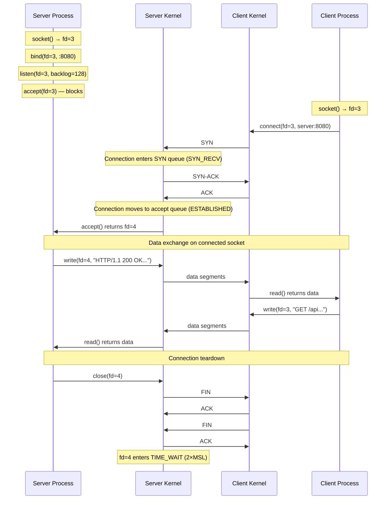
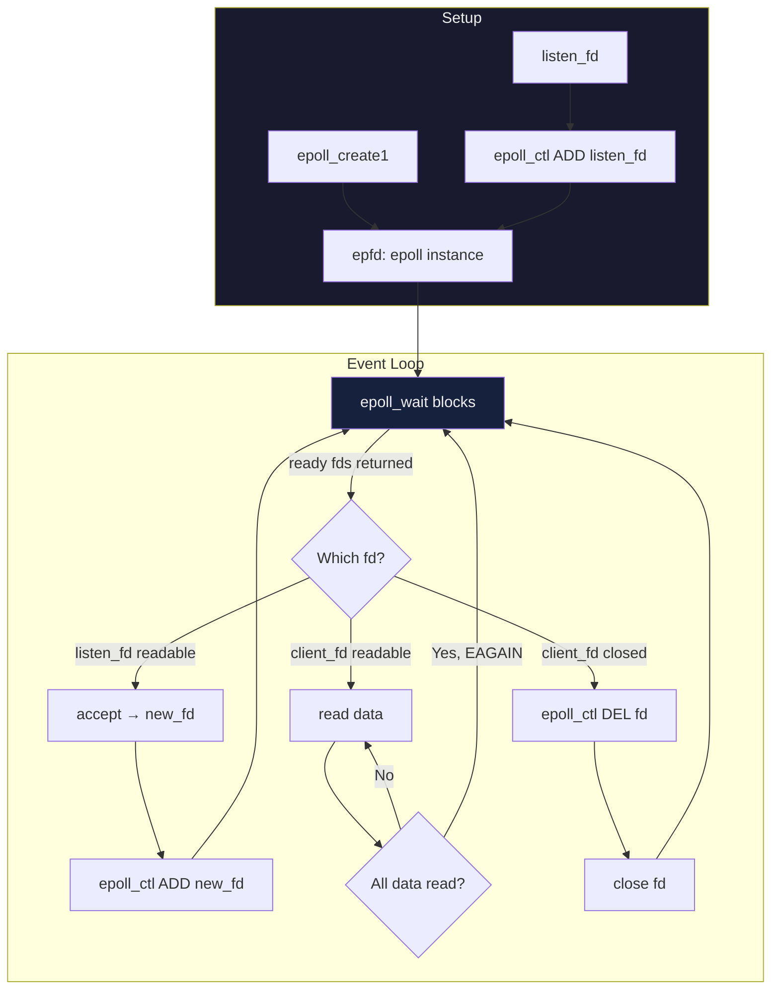

# Socket Programming Fundamentals — Berkeley Sockets and I/O Models

**Date:** 2026-04-23 | **Updated:** 2026-04-23
**Tags:** `networking` `sockets` `io-models` `blocking` `non-blocking`

---

## Table of Contents

- [Summary](#summary)
- [What Is a Socket?](#what-is-a-socket)
  - [The File Descriptor Model](#the-file-descriptor-model)
  - [Socket Identity — The 5-Tuple](#socket-identity--the-5-tuple)
  - [Socket Types](#socket-types)
- [Berkeley Sockets API](#berkeley-sockets-api)
  - [The Syscall Sequence](#the-syscall-sequence)
  - [Server Flow](#server-flow)
  - [Client Flow](#client-flow)
  - [Each Syscall Explained](#each-syscall-explained)
- [TCP Socket Lifecycle](#tcp-socket-lifecycle)
  - [Full Lifecycle Diagram](#full-lifecycle-diagram)
  - [Backlog and Accept Queues](#backlog-and-accept-queues)
  - [Connection States Mapped to TCP States](#connection-states-mapped-to-tcp-states)
- [Blocking vs Non-Blocking I/O](#blocking-vs-non-blocking-io)
  - [Blocking I/O — Thread per Connection](#blocking-io--thread-per-connection)
  - [Non-Blocking I/O — O_NONBLOCK and EAGAIN](#non-blocking-io--o_nonblock-and-eagain)
  - [Why Blocking Does Not Scale](#why-blocking-does-not-scale)
- [I/O Multiplexing](#io-multiplexing)
  - [select()](#select)
  - [poll()](#poll)
  - [epoll (Linux)](#epoll-linux)
  - [kqueue (BSD/macOS)](#kqueue-bsdmacos)
  - [epoll Event Flow Diagram](#epoll-event-flow-diagram)
- [I/O Models Comparison](#io-models-comparison)
- [How Frameworks Use Sockets](#how-frameworks-use-sockets)
  - [Node.js — libuv + Event Loop](#nodejs--libuv--event-loop)
  - [Java NIO — Selector, Channel, Buffer](#java-nio--selector-channel-buffer)
  - [Netty — EventLoopGroup over NIO/epoll](#netty--eventloopgroup-over-nioepoll)
  - [Spring WebFlux — Netty Underneath](#spring-webflux--netty-underneath)
- [Socket Options](#socket-options)
- [Unix Domain Sockets](#unix-domain-sockets)
  - [AF_UNIX vs AF_INET](#af_unix-vs-af_inet)
  - [When to Use UDS](#when-to-use-uds)
  - [Node.js UDS Example](#nodejs-uds-example)
  - [Java UDS Example](#java-uds-example)
- [Common Pitfalls](#common-pitfalls)
- [Practical — Checking Socket State](#practical--checking-socket-state)
- [Related](#related)
- [References](#references)

---

## Summary

A **socket** is the operating system's fundamental abstraction for network communication. Every HTTP request your Node.js server handles, every JDBC connection your Spring Boot app opens, every Redis command you send — all flow through sockets. Understanding the Berkeley sockets API, the difference between blocking and non-blocking I/O, and how I/O multiplexing (select, poll, epoll, kqueue) works gives you the ability to reason about why frameworks are designed the way they are, why thread-per-connection doesn't scale, and what "event-driven" actually means at the OS level.

---

## What Is a Socket?

A socket is an OS-level abstraction that represents one endpoint of a network communication channel. It provides a programming interface for sending and receiving data over a network, whether that network is the internet, a local machine, or anything in between.

### The File Descriptor Model

Unix follows the principle **"everything is a file."** When you create a socket, the kernel returns a **file descriptor** (fd) — a small non-negative integer that indexes into the process's open file table. You read from and write to a socket using the same `read()` and `write()` syscalls you'd use on a regular file.

```
Process file descriptor table:
fd 0  →  stdin
fd 1  →  stdout
fd 2  →  stderr
fd 3  →  /var/log/app.log      (regular file)
fd 4  →  socket(TCP, 0.0.0.0:8080)  (listening socket)
fd 5  →  socket(TCP, 10.0.1.5:8080 ↔ 192.168.1.10:54321)  (connected socket)
```

This uniformity is why you can use tools like `select()` and `epoll()` to monitor sockets, pipes, and files with the same API.

### Socket Identity — The 5-Tuple

A TCP connection is uniquely identified by a **5-tuple**:

| Component | Example |
|-----------|---------|
| Protocol | TCP |
| Source IP | 192.168.1.10 |
| Source Port | 54321 |
| Destination IP | 10.0.1.5 |
| Destination Port | 8080 |

This is why a single server listening on port 8080 can handle thousands of concurrent connections — each connection has a different source IP:port combination. The listening socket itself is identified by (protocol, local IP, local port).

### Socket Types

| Type | Constant | Protocol | Semantics |
|------|----------|----------|-----------|
| Stream | `SOCK_STREAM` | TCP | Reliable, ordered, connection-oriented byte stream |
| Datagram | `SOCK_DGRAM` | UDP | Unreliable, unordered, connectionless messages |
| Raw | `SOCK_RAW` | IP/ICMP | Direct access to lower-level protocols |

For backend work, you almost exclusively deal with `SOCK_STREAM` (TCP) and occasionally `SOCK_DGRAM` (UDP for DNS, metrics, etc.).

---

## Berkeley Sockets API

The Berkeley sockets API (also called POSIX sockets) was introduced in 4.2BSD in 1983 and became the universal networking API. Every language's networking library — `net` in Node.js, `java.net` / `java.nio` in Java, Python's `socket` module — is a wrapper around these syscalls.

### The Syscall Sequence

```
Server:                          Client:
socket()                         socket()
  ↓                                ↓
bind()                           connect() ──────────────────┐
  ↓                                                          │
listen()                                                     │
  ↓                                                          │
accept() ← ─ ─ ─ ─ ─ ─ ─ ─ ─ ─ ─ ─ ─ ─ ─ ─ ─ ─ ─ ─ ─ ─ ─┘
  ↓                                ↓
read() / write()  ←──────→  read() / write()
  ↓                                ↓
close()                          close()
```

### Server Flow

1. **socket()** — Create a socket file descriptor
2. **bind()** — Assign a local address (IP + port)
3. **listen()** — Mark socket as passive (willing to accept connections), set backlog size
4. **accept()** — Block until a client connects, return a *new* fd for the connection
5. **read()/write()** — Exchange data on the connected fd
6. **close()** — Tear down the connection

### Client Flow

1. **socket()** — Create a socket file descriptor
2. **connect()** — Initiate TCP 3-way handshake with the server's address
3. **read()/write()** — Exchange data
4. **close()** — Tear down the connection

The client does not need to call `bind()` — the OS assigns an ephemeral port automatically.

### Each Syscall Explained

**socket(domain, type, protocol)**

Creates an endpoint. Returns an fd.

```c
int sockfd = socket(AF_INET, SOCK_STREAM, 0);
// AF_INET  = IPv4 address family
// AF_INET6 = IPv6 address family
// AF_UNIX  = local inter-process communication
```

**bind(sockfd, addr, addrlen)**

Associates the socket with a specific IP address and port. Binding to `0.0.0.0` (or `::` for IPv6) listens on all interfaces. Binding to port `0` lets the OS choose an available port.

**listen(sockfd, backlog)**

Converts the socket from active to passive. The `backlog` argument is a hint to the kernel about the maximum length of the pending connections queue. On Linux, it controls the size of the **accept queue** (fully established connections waiting for `accept()`).

**accept(sockfd, addr, addrlen)**

Blocks (by default) until a connection arrives. Returns a **new file descriptor** for the connected socket, plus the client's address. The original listening socket continues to accept further connections.

This is a critical point: `accept()` returns a *different* fd from the listening fd. The server now has two socket fds — one for listening, one for the specific connection.

**connect(sockfd, addr, addrlen)**

Initiates the TCP 3-way handshake. Blocks (by default) until the handshake completes or fails. On success, the socket is ready for data transfer.

**read(sockfd, buf, len) / write(sockfd, buf, len)**

Transfer data. `read()` returns the number of bytes actually read, which may be less than requested (partial read). `write()` may also write fewer bytes than requested (partial write). These are **not** message-boundary-preserving for TCP — TCP is a byte stream.

Equivalent calls: `recv()`/`send()` with extra flags, `recvfrom()`/`sendto()` for UDP.

**close(sockfd)**

Closes the file descriptor and initiates TCP connection teardown (FIN sequence). The kernel handles the TIME_WAIT state after close.

---

## TCP Socket Lifecycle

### Full Lifecycle Diagram



### Backlog and Accept Queues

On Linux, incoming TCP connections pass through **two queues**:

```
Client SYN ──→ ┌─────────────┐ ──→ ┌──────────────┐ ──→ accept()
               │  SYN Queue   │     │ Accept Queue  │     returns fd
               │ (incomplete) │     │  (completed)  │
               │ half-open    │     │  ESTABLISHED   │
               └─────────────┘     └──────────────┘
                  tcp_max_syn_backlog     listen(backlog)
```

1. **SYN Queue** (incomplete connections): Holds connections in the `SYN_RECV` state (server has received SYN, sent SYN-ACK, waiting for final ACK). Sized by `net.ipv4.tcp_max_syn_backlog` (default 128–1024).

2. **Accept Queue** (complete connections): Holds connections that have completed the 3-way handshake (`ESTABLISHED`) but haven't been picked up by `accept()` yet. Sized by `min(listen(backlog), net.core.somaxconn)`.

If the accept queue is full, the kernel's behavior depends on `tcp_abort_on_overflow`:
- **0 (default)**: Silently drops the final ACK. The client thinks it's connected, but the server hasn't accepted yet. The server will retransmit SYN-ACK.
- **1**: Sends RST to the client, immediately rejecting the connection.

**Tuning for high-traffic servers:**

```bash
# Increase accept queue ceiling
sysctl -w net.core.somaxconn=65535

# Increase SYN queue
sysctl -w net.ipv4.tcp_max_syn_backlog=65535

# Enable SYN cookies to survive SYN floods
sysctl -w net.ipv4.tcp_syncookies=1
```

### Connection States Mapped to TCP States

| Socket API Event | TCP State (Server) | TCP State (Client) |
|-----------------|-------------------|-------------------|
| `socket()` + `listen()` | LISTEN | — |
| Client calls `connect()` | — | SYN_SENT |
| SYN received, SYN-ACK sent | SYN_RECV | — |
| 3-way handshake completes | ESTABLISHED (in accept queue) | ESTABLISHED |
| `accept()` returns | ESTABLISHED (application aware) | — |
| `close()` initiator | FIN_WAIT_1 → FIN_WAIT_2 → TIME_WAIT | — |
| `close()` responder | CLOSE_WAIT → LAST_ACK → CLOSED | — |

---

## Blocking vs Non-Blocking I/O

### Blocking I/O — Thread per Connection

In the default blocking mode, every I/O syscall blocks the calling thread until the operation completes:

- `accept()` blocks until a connection arrives
- `read()` blocks until data is available (or EOF / error)
- `write()` blocks until the kernel buffer has room
- `connect()` blocks until the handshake completes

The traditional server model assigns **one thread per connection**:

```
Thread 1 (main):   listen → accept → spawn thread
Thread 2:          read → process → write → close    (client A)
Thread 3:          read → process → write → close    (client B)
Thread 4:          read → process → write → close    (client C)
...
Thread 10002:      read → process → write → close    (client 10000)
```

This is the model used by **Apache HTTP Server** (prefork/worker MPM), traditional **Java Servlet containers** (Tomcat BIO connector), and early web servers.

### Non-Blocking I/O — O_NONBLOCK and EAGAIN

Setting a socket to non-blocking mode changes the behavior of I/O syscalls:

```c
// Set non-blocking mode
int flags = fcntl(sockfd, F_GETFL, 0);
fcntl(sockfd, F_SETFL, flags | O_NONBLOCK);
```

Now instead of blocking:
- `read()` returns `-1` with `errno = EAGAIN` (or `EWOULDBLOCK`) if no data is available
- `write()` returns `-1` with `EAGAIN` if the kernel send buffer is full
- `accept()` returns `-1` with `EAGAIN` if no pending connections
- `connect()` returns `-1` with `errno = EINPROGRESS` (handshake ongoing)

The application must **poll** or use an I/O multiplexer to know when operations will succeed without blocking.

### Why Blocking Does Not Scale

| Problem | Impact |
|---------|--------|
| **Thread memory** | Each thread needs a stack (~1 MB default on Linux). 10,000 connections = ~10 GB just for stacks. |
| **Context switching** | With 10k threads, the OS scheduler spends significant CPU time switching between them. |
| **Thread creation overhead** | Creating/destroying threads is expensive. Thread pools mitigate but don't eliminate this. |
| **Cache pollution** | Thousands of threads thrash CPU caches, reducing per-thread performance. |
| **Idle resource waste** | Most connections are idle most of the time (waiting for client input). Each idle connection still holds a thread. |

The **C10K problem** (handling 10,000 concurrent connections) drove the industry toward non-blocking I/O with multiplexing. Modern servers handle **C10M** (10 million) with event-driven architectures.

---

## I/O Multiplexing

I/O multiplexing lets a **single thread** monitor many file descriptors simultaneously and react only when one or more become ready for I/O.

### select()

The original multiplexing syscall (1983, 4.2BSD).

```c
int select(int nfds, fd_set *readfds, fd_set *writefds,
           fd_set *exceptfds, struct timeval *timeout);
```

**How it works:**
1. Build `fd_set` bitmasks for fds you want to monitor for read/write/except
2. Call `select()` — it blocks until at least one fd is ready (or timeout)
3. On return, the kernel modifies the fd_sets to indicate which fds are ready
4. Iterate through all fds to find the ready ones
5. Rebuild the fd_sets and call `select()` again (it destroys them each call)

**Limitations:**
- `FD_SETSIZE` hard limit: usually **1024** fds (compile-time constant)
- **O(n)** scan: must iterate all fds on every call
- **Copies data** between user space and kernel space on every call
- **Modifies input**: must rebuild fd_sets each time

### poll()

Improvement over select (1986, System V).

```c
int poll(struct pollfd *fds, nfds_t nfds, int timeout);

struct pollfd {
    int   fd;        // file descriptor
    short events;    // requested events (POLLIN, POLLOUT, ...)
    short revents;   // returned events (filled by kernel)
};
```

**Improvements over select:**
- No `FD_SETSIZE` limit — pass an array of any size
- Uses separate input (`events`) and output (`revents`) fields — no need to rebuild
- Cleaner API

**Still has:**
- **O(n)** scan: kernel must check every fd in the array, and userspace must scan `revents`
- Copies the entire `pollfd` array between user and kernel space each call

### epoll (Linux)

The Linux solution (kernel 2.5.44, 2002). Designed for scalability.

```c
// 1. Create an epoll instance (returns an fd)
int epfd = epoll_create1(0);

// 2. Register interest in socket events
struct epoll_event ev;
ev.events = EPOLLIN;         // interested in read readiness
ev.data.fd = sockfd;
epoll_ctl(epfd, EPOLL_CTL_ADD, sockfd, &ev);

// 3. Wait for events (blocks until at least one fd is ready)
struct epoll_event events[MAX_EVENTS];
int nready = epoll_wait(epfd, events, MAX_EVENTS, timeout_ms);

// 4. Process only the ready fds
for (int i = 0; i < nready; i++) {
    if (events[i].data.fd == listen_fd) {
        // new connection
    } else {
        // data available on connected socket
    }
}
```

**Why epoll scales:**
- **O(1) readiness notification**: The kernel maintains a ready-list internally using callbacks. `epoll_wait` returns only the fds that are actually ready.
- **No repeated copying**: The interest set is stored in kernel space. You modify it incrementally with `epoll_ctl(ADD/MOD/DEL)`.
- **No fd limit**: Limited only by system resources (`/proc/sys/fs/file-max`).

**Edge-Triggered vs Level-Triggered:**

| Mode | Flag | Behavior |
|------|------|----------|
| Level-triggered (default) | `EPOLLIN` | `epoll_wait` returns as long as the fd *is* ready (data in buffer). Same semantics as poll/select. |
| Edge-triggered | `EPOLLIN \| EPOLLET` | `epoll_wait` returns only when the fd *becomes* ready (new data arrives). You must drain the entire buffer in one go or you'll miss events. |

Edge-triggered is more efficient (fewer wakeups) but harder to use correctly — you must read until `EAGAIN` in a loop.

### kqueue (BSD/macOS)

The BSD equivalent of epoll (FreeBSD 4.1, 2000). Used on macOS, FreeBSD, NetBSD, OpenBSD.

```c
int kq = kqueue();

struct kevent changes[1];
EV_SET(&changes[0], sockfd, EVFILT_READ, EV_ADD, 0, 0, NULL);

struct kevent events[MAX_EVENTS];
int nready = kevent(kq, changes, 1, events, MAX_EVENTS, NULL);
```

**Key differences from epoll:**
- Single `kevent()` call handles both registration and waiting (epoll needs separate `epoll_ctl` and `epoll_wait`)
- Can monitor more event types: file changes, process exits, signals, timers
- Supports batch operations: register multiple changes and wait in one call
- Uses edge-triggered semantics by default

### epoll Event Flow Diagram



---

## I/O Models Comparison

The five I/O models, as described by W. Richard Stevens in *Unix Network Programming*:

| Model | Mechanism | Blocking Phase | Scalability | Complexity | Used By |
|-------|-----------|---------------|-------------|------------|---------|
| **Blocking I/O** | `read()` blocks until data ready + copy | Wait for data + copy to user | Poor (thread per connection) | Low | Apache prefork, Tomcat BIO |
| **Non-blocking I/O** | `read()` returns EAGAIN; app polls | Copy to user only | Poor (busy polling wastes CPU) | Medium | Rarely used alone |
| **I/O Multiplexing** | select/poll/epoll monitors many fds, then `read()` | `select` blocks; copy to user | Good (single thread, many conns) | Medium-High | Node.js, Nginx, Netty, Redis |
| **Signal-driven I/O** | Kernel sends SIGIO when data ready | Copy to user only | Moderate (signal overhead) | High | Rarely used |
| **Async I/O** | `aio_read()` / `io_uring`; kernel does copy, notifies on completion | None — truly async | Excellent | High | io_uring, Windows IOCP |

**The key distinction**: In models 1–4, the actual data copy from kernel buffer to user buffer is still **synchronous** (the `read()` call blocks during the copy). Only true async I/O (model 5) eliminates this by having the kernel complete the entire operation and signal the application.

**io_uring** (Linux 5.1, 2019) is the modern async I/O interface for Linux:
- Shared ring buffers between user space and kernel space — no syscall per operation
- Supports all I/O operations: read, write, accept, connect, send, recv, fsync
- Batching: submit many operations, harvest many completions
- Used by production systems: RocksDB, io_uring-based web servers, and emerging framework support

---

## How Frameworks Use Sockets

### Node.js — libuv + Event Loop

Node.js uses **libuv**, a C library that abstracts platform-specific I/O multiplexing:

| Platform | Backend |
|----------|---------|
| Linux | epoll |
| macOS | kqueue |
| Windows | IOCP |

```
┌───────────────────────────────┐
│         Your JS Code          │
│   net.createServer(handler)   │
├───────────────────────────────┤
│          Node.js API          │
│    net, http, http2, tls      │
├───────────────────────────────┤
│            libuv              │
│  event loop + thread pool     │
├───────────────────────────────┤
│   epoll / kqueue / IOCP       │
│     (kernel I/O multiplex)    │
└───────────────────────────────┘
```

**Node.js net.createServer() example — the socket API in action:**

```typescript
import net from 'node:net';

const server = net.createServer((socket) => {
  // This callback fires for each accepted connection.
  // 'socket' wraps the fd returned by accept().
  
  console.log(`Client connected: ${socket.remoteAddress}:${socket.remotePort}`);
  
  socket.on('data', (chunk: Buffer) => {
    // Fired when epoll/kqueue reports the fd is readable.
    // Node reads from the fd and emits this event.
    // 'chunk' may be a partial read — TCP is a byte stream.
    const message = chunk.toString();
    socket.write(`Echo: ${message}`);
  });
  
  socket.on('end', () => {
    // Client sent FIN (graceful close).
    console.log('Client disconnected');
  });
  
  socket.on('error', (err) => {
    // Handle ECONNRESET, EPIPE, etc.
    console.error(`Socket error: ${err.message}`);
  });
});

// bind() + listen() happen here:
server.listen(8080, '0.0.0.0', () => {
  console.log('Listening on :8080');
});

// Under the hood:
// 1. socket(AF_INET, SOCK_STREAM, 0) → fd
// 2. setsockopt(fd, SO_REUSEADDR, 1)
// 3. bind(fd, 0.0.0.0:8080)
// 4. listen(fd, backlog=511)  (Node default backlog)
// 5. epoll_ctl(epfd, EPOLL_CTL_ADD, fd, EPOLLIN)
// 6. Event loop: epoll_wait → accept() → register new fd → repeat
```

The critical insight: **Node.js runs one thread for JavaScript**, but libuv's event loop handles thousands of socket fds via epoll/kqueue. File I/O and DNS lookups are offloaded to a thread pool (default 4 threads), but network I/O stays on the main thread.

### Java NIO — Selector, Channel, Buffer

Java NIO (New I/O, since Java 1.4) maps directly to the OS multiplexing primitives:

| Java NIO | OS Concept |
|-----------|------------|
| `Selector` | epoll / kqueue / select wrapper |
| `ServerSocketChannel` | Listening socket fd |
| `SocketChannel` | Connected socket fd |
| `ByteBuffer` | User-space buffer for `read()`/`write()` |
| `SelectionKey` | Interest registration (like `epoll_event`) |

```java
import java.nio.ByteBuffer;
import java.nio.channels.*;
import java.net.InetSocketAddress;
import java.util.Iterator;

Selector selector = Selector.open();  // epoll_create1()

ServerSocketChannel serverChannel = ServerSocketChannel.open();
serverChannel.bind(new InetSocketAddress(8080));   // bind() + listen()
serverChannel.configureBlocking(false);             // O_NONBLOCK
serverChannel.register(selector, SelectionKey.OP_ACCEPT);  // epoll_ctl(ADD)

ByteBuffer buffer = ByteBuffer.allocate(4096);

while (true) {
    selector.select();  // epoll_wait() — blocks until events
    
    Iterator<SelectionKey> keys = selector.selectedKeys().iterator();
    while (keys.hasNext()) {
        SelectionKey key = keys.next();
        keys.remove();
        
        if (key.isAcceptable()) {
            // New connection: accept() → register for read
            SocketChannel client = serverChannel.accept();
            client.configureBlocking(false);
            client.register(selector, SelectionKey.OP_READ);
        }
        
        if (key.isReadable()) {
            SocketChannel client = (SocketChannel) key.channel();
            buffer.clear();
            int bytesRead = client.read(buffer);  // read() — non-blocking
            if (bytesRead == -1) {
                key.cancel();
                client.close();
            } else {
                buffer.flip();
                client.write(buffer);  // echo back
            }
        }
    }
}
```

### Netty — EventLoopGroup over NIO/epoll

Netty adds a high-performance abstraction over NIO:

```
┌──────────────────────────────────┐
│        Your Channel Handlers     │
│   HttpServerCodec, YourHandler   │
├──────────────────────────────────┤
│           Netty Pipeline         │
│   ChannelPipeline (chain of      │
│   inbound/outbound handlers)     │
├──────────────────────────────────┤
│        EventLoopGroup            │
│   N threads, each running        │
│   their own Selector loop        │
├──────────────────────────────────┤
│   NioEventLoop / EpollEventLoop  │
│   (wraps Selector / epoll)       │
├──────────────────────────────────┤
│     java.nio / JNI to epoll      │
└──────────────────────────────────┘
```

Netty typically uses two EventLoopGroups:
- **Boss group** (1 thread): Accepts connections (runs `accept()`)
- **Worker group** (N threads, default = 2 × CPU cores): Handles I/O on accepted connections

On Linux, Netty can bypass Java NIO and use epoll directly via JNI (`EpollEventLoopGroup`) for better performance — avoids the overhead of `java.nio.Selector`'s internal implementation.

### Spring WebFlux — Netty Underneath

When you write a reactive Spring WebFlux controller:

```java
@RestController
public class UserController {
    @GetMapping("/users/{id}")
    public Mono<User> getUser(@PathVariable String id) {
        return userRepository.findById(id);
    }
}
```

The call chain is:

```
HTTP request arrives
  → Netty EpollEventLoop reads from socket fd
    → Netty ChannelPipeline decodes HTTP
      → Spring WebFlux DispatcherHandler routes
        → Your controller returns Mono<User>
          → Reactive DB driver (R2DBC) sends query (non-blocking)
            → Response flows back through the pipeline
              → Netty writes to socket fd
```

The entire chain is non-blocking. No thread is parked waiting for the database — the same EventLoop thread processes other connections while the query is in flight.

---

## Socket Options

Socket options are set with `setsockopt()` and tune socket behavior. These are the ones you encounter most in production.

| Option | Level | Purpose | When to Use |
|--------|-------|---------|-------------|
| `SO_REUSEADDR` | SOL_SOCKET | Allow binding to a port that's in TIME_WAIT. Prevents "Address already in use" on server restart. | **Always** on server sockets. Node.js sets this by default. |
| `SO_REUSEPORT` | SOL_SOCKET | Allow multiple sockets to bind to the same port. Kernel load-balances incoming connections across them. | Multi-process servers (Nginx workers, Node.js cluster). Linux 3.9+. |
| `SO_KEEPALIVE` | SOL_SOCKET | Enable TCP keepalive probes. Detects dead peers after idle period. | Long-lived connections (database pools, WebSocket). Tune `tcp_keepalive_time`, `tcp_keepalive_intvl`, `tcp_keepalive_probes`. |
| `TCP_NODELAY` | IPPROTO_TCP | Disable Nagle's algorithm. Send small packets immediately instead of buffering. | Low-latency protocols (Redis, game servers, real-time APIs). Almost always enable for interactive traffic. |
| `SO_LINGER` | SOL_SOCKET | Control behavior on `close()`: linger with timeout (send buffered data), or hard reset (RST). | Usually leave default. Set `l_onoff=1, l_linger=0` to force RST (abort connection immediately). |
| `SO_RCVBUF` / `SO_SNDBUF` | SOL_SOCKET | Set receive/send buffer sizes. Kernel doubles the value (includes overhead). | High-throughput transfers, long-distance connections (large BDP). Usually auto-tuned is fine. |
| `TCP_FASTOPEN` | IPPROTO_TCP | Enable TFO — send data in the SYN packet for repeat connections. | HTTPS servers (saves 1 RTT on reconnect). See [TCP Deep Dive](tcp-deep-dive.md). |

**Checking options on a live socket (Node.js):**

```typescript
import net from 'node:net';

const server = net.createServer((socket) => {
  socket.setNoDelay(true);        // TCP_NODELAY
  socket.setKeepAlive(true, 60000); // SO_KEEPALIVE, 60s idle before probes
});
```

**Java:**

```java
ServerSocket ss = new ServerSocket();
ss.setReuseAddress(true);        // SO_REUSEADDR
ss.setReceiveBufferSize(65536);  // SO_RCVBUF

Socket s = ss.accept();
s.setTcpNoDelay(true);           // TCP_NODELAY
s.setKeepAlive(true);            // SO_KEEPALIVE
```

---

## Unix Domain Sockets

### AF_UNIX vs AF_INET

Unix domain sockets (UDS) use the filesystem as the address namespace instead of IP:port. They provide IPC (inter-process communication) on the same host.

| Feature | AF_INET (TCP) | AF_UNIX (UDS) |
|---------|---------------|---------------|
| Address | IP:port | Filesystem path (e.g., `/var/run/app.sock`) |
| Network traversal | Yes | No — same host only |
| Overhead | Full TCP/IP stack (checksums, routing, etc.) | Kernel-to-kernel memory copy, no protocol overhead |
| Performance | Baseline | ~2x throughput, ~50% less latency than loopback TCP |
| Authentication | None built-in | Kernel provides peer PID, UID, GID (`SO_PEERCRED`) |
| Socket types | STREAM, DGRAM | STREAM, DGRAM, SEQPACKET |

### When to Use UDS

- **Docker daemon communication**: Docker CLI talks to `dockerd` via `/var/run/docker.sock`
- **Database connections on same host**: PostgreSQL and MySQL support UDS (`/var/run/postgresql/.s.PGSQL.5432`)
- **Reverse proxy to application**: Nginx → Node.js/Java over UDS instead of `localhost:3000`
- **Container sidecars**: Envoy ↔ application in the same pod via UDS
- **Redis on same machine**: `redis-cli -s /var/run/redis/redis.sock`

### Node.js UDS Example

```typescript
import net from 'node:net';
import fs from 'node:fs';

const SOCKET_PATH = '/tmp/myapp.sock';

// Clean up stale socket file
if (fs.existsSync(SOCKET_PATH)) {
  fs.unlinkSync(SOCKET_PATH);
}

const server = net.createServer((socket) => {
  socket.on('data', (data) => {
    socket.write(`Received: ${data}`);
  });
});

// Listen on Unix domain socket instead of TCP port
server.listen(SOCKET_PATH, () => {
  console.log(`Listening on ${SOCKET_PATH}`);
});

// Client connecting to the UDS:
const client = net.createConnection(SOCKET_PATH, () => {
  client.write('Hello via UDS');
});
```

### Java UDS Example

Java 16+ supports Unix domain sockets natively via `java.net.UnixDomainSocketAddress`:

```java
import java.net.UnixDomainSocketAddress;
import java.nio.ByteBuffer;
import java.nio.channels.ServerSocketChannel;
import java.nio.channels.SocketChannel;
import java.nio.file.Path;

// Server
var address = UnixDomainSocketAddress.of(Path.of("/tmp/myapp.sock"));
var server = ServerSocketChannel.open(java.net.StandardProtocolFamily.UNIX);
server.bind(address);

SocketChannel client = server.accept();
ByteBuffer buf = ByteBuffer.allocate(1024);
client.read(buf);
buf.flip();
System.out.println(new String(buf.array(), 0, buf.limit()));
```

---

## Common Pitfalls

### 1. Not Handling Partial Reads/Writes

TCP is a byte stream, not a message stream. `read()` may return fewer bytes than you requested, and `write()` may accept fewer than you provided.

```typescript
// WRONG — assumes all data arrives in one chunk
socket.once('data', (data) => {
  const fullMessage = JSON.parse(data.toString()); // may crash on partial JSON
});

// CORRECT — accumulate until you have a complete message
let buffer = '';
socket.on('data', (chunk) => {
  buffer += chunk.toString();
  // Use a delimiter or length prefix to detect complete messages
  const delimiterIndex = buffer.indexOf('\n');
  if (delimiterIndex !== -1) {
    const message = buffer.slice(0, delimiterIndex);
    buffer = buffer.slice(delimiterIndex + 1);
    processMessage(JSON.parse(message));
  }
});
```

### 2. Ignoring EINTR

Syscalls can be interrupted by signals and return `EINTR`. In C, you must retry:

```c
ssize_t n;
do {
    n = read(fd, buf, len);
} while (n == -1 && errno == EINTR);
```

Most high-level frameworks (Node.js, Java) handle this internally, but it matters if you write native addons or use JNI.

### 3. Connection Backlog Overflow

If your application is slow to call `accept()`, the accept queue fills. New connections are silently dropped or RST'd. Symptoms: clients experience connection timeouts even though the server process is running.

**Diagnosis:**

```bash
# Check for overflows
ss -ltn | grep 8080
# Look at Recv-Q (current queue) vs Send-Q (max queue)

# Check kernel counters
nstat -a | grep -i overflow
# TcpExtListenOverflows shows accept queue drops
```

### 4. Ephemeral Port Exhaustion

When a client creates many short-lived connections (e.g., HTTP requests without keep-alive), each closed connection occupies an ephemeral port in TIME_WAIT for ~60 seconds.

```bash
# Check current ephemeral port range
cat /proc/sys/net/ipv4/ip_local_port_range
# Default: 32768–60999 → only ~28,000 ports

# Check TIME_WAIT count
ss -s | grep timewait

# Mitigations:
sysctl -w net.ipv4.ip_local_port_range="1024 65535"  # widen range
sysctl -w net.ipv4.tcp_tw_reuse=1                     # reuse TIME_WAIT ports
# Use connection pooling (the real fix)
```

### 5. File Descriptor Limits

Each socket consumes an fd. The default per-process limit is often 1024.

```bash
# Check current limits
ulimit -n        # soft limit
ulimit -Hn       # hard limit

# Check system-wide limit
cat /proc/sys/fs/file-max

# Increase for current session
ulimit -n 65535

# Permanent: /etc/security/limits.conf
# myapp  soft  nofile  65535
# myapp  hard  nofile  65535
```

### 6. Not Setting SO_REUSEADDR

Without this, restarting a server fails with "Address already in use" because the previous instance's socket is in TIME_WAIT.

### 7. Forgetting TCP_NODELAY

Default TCP uses Nagle's algorithm, which buffers small writes (up to ~200ms) to fill segments. For request/response protocols, this adds latency. Interactive services should almost always enable `TCP_NODELAY`.

### 8. Leaking File Descriptors

Failing to `close()` sockets (especially on error paths) leaks fds. Eventually the process hits its fd limit and can't accept new connections.

```bash
# Diagnose fd leaks
ls -la /proc/<pid>/fd | wc -l
# or on macOS:
lsof -p <pid> | wc -l
```

---

## Practical — Checking Socket State

### ss — Socket Statistics (replacement for netstat)

```bash
# List all TCP listening sockets with process info
ss -tlnp

# Output:
# State  Recv-Q  Send-Q  Local Address:Port  Peer Address:Port  Process
# LISTEN 0       511     0.0.0.0:8080        0.0.0.0:*          users:(("node",pid=1234,fd=18))
#        ^       ^
#        │       └── backlog size (listen(fd, 511))
#        └── current accept queue length

# List all established connections to port 8080
ss -tn state established sport = :8080

# Show TCP connections with timer info
ss -tno

# Count connections by state
ss -tan | awk '{print $1}' | sort | uniq -c | sort -rn

# Show socket memory usage
ss -tm
```

### lsof — List Open Files (including sockets)

```bash
# All network connections for a process
lsof -i -P -n -p <pid>

# All processes listening on a port
lsof -i :8080

# All Unix domain sockets for a process
lsof -U -p <pid>

# Show socket options (macOS)
lsof -i TCP:8080 -T
```

### /proc/net (Linux)

```bash
# Raw socket info
cat /proc/net/tcp    # all TCP sockets (hex-encoded)
cat /proc/net/tcp6   # IPv6 TCP sockets

# TCP statistics
cat /proc/net/snmp | grep Tcp

# Connection tracking
conntrack -L    # if conntrack is loaded (NAT environments)
```

---

## Related

- [TCP Deep Dive — Handshakes, Flow Control, and Congestion Control](tcp-deep-dive.md) — the TCP state machine and wire-level behavior these sockets ride on
- [UDP & QUIC — Connectionless Transport](udp-and-quic.md) — SOCK_DGRAM sockets and the QUIC transport protocol
- [Async I/O Models — select, epoll, kqueue, and Event-Driven Networking](../network-programming/async-io-models.md) — deeper coverage of reactor patterns and event-driven architectures
- [Event Loop Internals](../../typescript/runtime/event-loop-internals.md) — how Node.js/libuv uses these I/O primitives in its event loop

---

## References

- Stevens, W. Richard. *Unix Network Programming, Volume 1: The Sockets Networking API* (3rd ed., 2003). The definitive reference.
- `man 7 socket` — Linux socket overview. https://man7.org/linux/man-pages/man7/socket.7.html
- `man 7 epoll` — Linux epoll interface. https://man7.org/linux/man-pages/man7/epoll.7.html
- `man 2 kqueue` — FreeBSD/macOS kqueue. https://man.freebsd.org/cgi/man.cgi?query=kqueue&sektion=2
- `man 7 unix` — Unix domain sockets. https://man7.org/linux/man-pages/man7/unix.7.html
- libuv design overview — https://docs.libuv.org/en/v1.x/design.html
- io_uring documentation — https://kernel.dk/io_uring.pdf
- Java NIO Selector — https://docs.oracle.com/en/java/javase/21/docs/api/java.base/java/nio/channels/Selector.html
- Netty architecture — https://netty.io/wiki/user-guide-for-4.x.html
- Kegel, Dan. "The C10K Problem" — http://www.kegel.com/c10k.html
- `man 7 tcp` — TCP protocol and tuning. https://man7.org/linux/man-pages/man7/tcp.7.html
