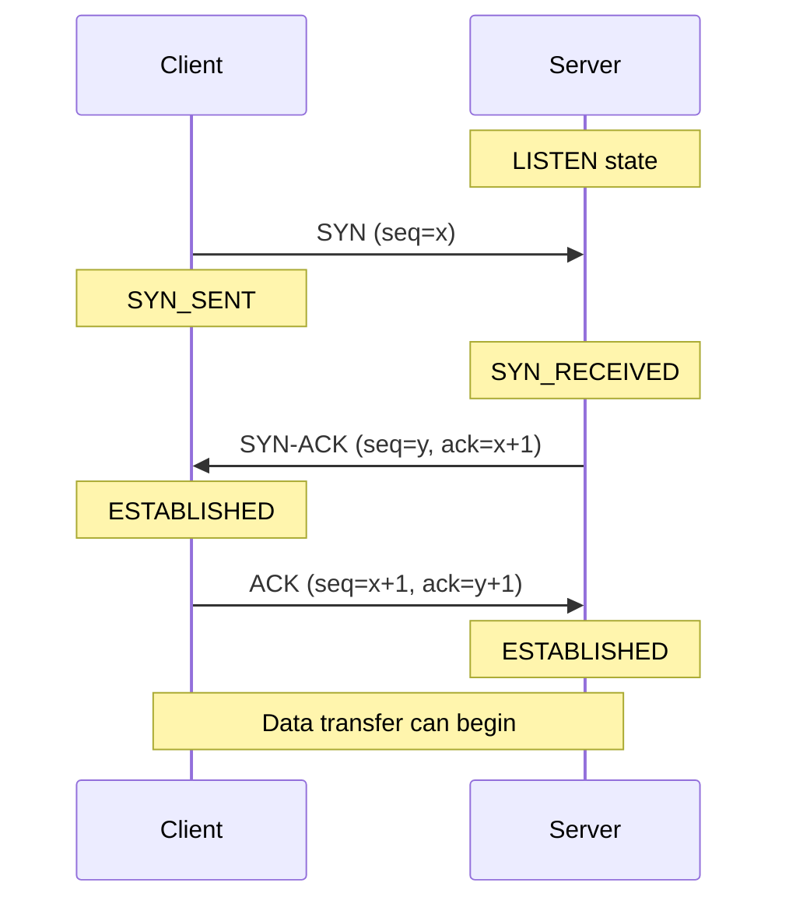
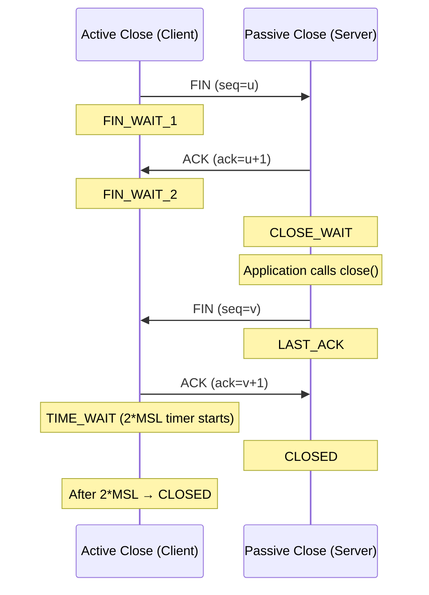

# TCP Deep Dive — Handshakes, Flow Control, and Congestion Control

**Date:** 2026-04-23 | **Updated:** 2026-04-23
**Tags:** `networking` `tcp` `transport` `congestion-control` `flow-control`

---

## Table of Contents

- [Summary](#summary)
- [1. TCP Segment Structure](#1-tcp-segment-structure)
  - [1.1 Header Fields](#11-header-fields)
  - [1.2 Flags](#12-flags)
  - [1.3 TCP Options](#13-tcp-options)
- [2. Three-Way Handshake](#2-three-way-handshake)
  - [2.1 The Sequence](#21-the-sequence)
  - [2.2 Initial Sequence Numbers (ISN)](#22-initial-sequence-numbers-isn)
  - [2.3 Why Three Packets, Not Two?](#23-why-three-packets-not-two)
  - [2.4 SYN Flood Attacks and SYN Cookies](#24-syn-flood-attacks-and-syn-cookies)
- [3. Connection Teardown](#3-connection-teardown)
  - [3.1 Four-Way Teardown](#31-four-way-teardown)
  - [3.2 TIME_WAIT State](#32-time_wait-state)
  - [3.3 Half-Close](#33-half-close)
  - [3.4 RST for Abort](#34-rst-for-abort)
  - [3.5 SO_REUSEADDR and Server Restarts](#35-so_reuseaddr-and-server-restarts)
- [4. Sequence Numbers and Acknowledgments](#4-sequence-numbers-and-acknowledgments)
  - [4.1 Cumulative ACKs](#41-cumulative-acks)
  - [4.2 Retransmission](#42-retransmission)
  - [4.3 Duplicate ACKs and Fast Retransmit](#43-duplicate-acks-and-fast-retransmit)
  - [4.4 Selective ACK (SACK)](#44-selective-ack-sack)
- [5. Flow Control](#5-flow-control)
  - [5.1 Receiver Window (rwnd)](#51-receiver-window-rwnd)
  - [5.2 Sliding Window Mechanism](#52-sliding-window-mechanism)
  - [5.3 Window Scaling (RFC 7323)](#53-window-scaling-rfc-7323)
  - [5.4 Zero Window and Window Probes](#54-zero-window-and-window-probes)
  - [5.5 Silly Window Syndrome](#55-silly-window-syndrome)
- [6. Congestion Control](#6-congestion-control)
  - [6.1 Slow Start](#61-slow-start)
  - [6.2 Congestion Avoidance (AIMD)](#62-congestion-avoidance-aimd)
  - [6.3 Fast Retransmit and Fast Recovery](#63-fast-retransmit-and-fast-recovery)
  - [6.4 cwnd vs rwnd](#64-cwnd-vs-rwnd)
  - [6.5 Modern Algorithms: CUBIC and BBR](#65-modern-algorithms-cubic-and-bbr)
  - [6.6 Explicit Congestion Notification (ECN)](#66-explicit-congestion-notification-ecn)
  - [6.7 Algorithm Comparison](#67-algorithm-comparison)
- [7. Nagle's Algorithm and TCP_NODELAY](#7-nagles-algorithm-and-tcp_nodelay)
  - [7.1 What Nagle Does](#71-what-nagle-does)
  - [7.2 Interaction with Delayed ACK](#72-interaction-with-delayed-ack)
  - [7.3 When to Disable Nagle](#73-when-to-disable-nagle)
  - [7.4 Code Examples](#74-code-examples)
- [8. TCP Fast Open (TFO)](#8-tcp-fast-open-tfo)
  - [8.1 How TFO Works](#81-how-tfo-works)
  - [8.2 When to Use TFO](#82-when-to-use-tfo)
- [9. TCP Keep-Alive](#9-tcp-keep-alive)
  - [9.1 How It Works](#91-how-it-works)
  - [9.2 Configuring Keep-Alive](#92-configuring-keep-alive)
  - [9.3 Keep-Alive vs Application-Level Heartbeats](#93-keep-alive-vs-application-level-heartbeats)
- [10. Common TCP Issues for Backend Devs](#10-common-tcp-issues-for-backend-devs)
  - [10.1 TIME_WAIT Accumulation](#101-time_wait-accumulation)
  - [10.2 Connection Reset by Peer](#102-connection-reset-by-peer)
  - [10.3 Broken Pipe](#103-broken-pipe)
  - [10.4 Half-Open Connections](#104-half-open-connections)
  - [10.5 Tuning Linux TCP sysctls](#105-tuning-linux-tcp-sysctls)
- [Related](#related)
- [References](#references)

---

## Summary

TCP (Transmission Control Protocol) is the workhorse of reliable, ordered, byte-stream communication on the internet. Every HTTP request, database query, and gRPC call you make from Node.js or Spring Boot rides on TCP. This document goes well beyond "it's reliable" to cover the actual mechanics: how connections are established and torn down, how the sender knows what to retransmit, how flow control prevents a fast sender from overwhelming a slow receiver, and how congestion control prevents the network itself from collapsing. It also covers practical concerns every backend developer encounters: Nagle's algorithm killing latency, TIME_WAIT sockets exhausting ports, and the Linux sysctls you actually need to tune in production.

---

## 1. TCP Segment Structure

### 1.1 Header Fields

The TCP header is 20 bytes minimum (without options), up to 60 bytes with options.

```
 0                   1                   2                   3
 0 1 2 3 4 5 6 7 8 9 0 1 2 3 4 5 6 7 8 9 0 1 2 3 4 5 6 7 8 9 0 1
+-+-+-+-+-+-+-+-+-+-+-+-+-+-+-+-+-+-+-+-+-+-+-+-+-+-+-+-+-+-+-+-+
|          Source Port          |       Destination Port        |
+-+-+-+-+-+-+-+-+-+-+-+-+-+-+-+-+-+-+-+-+-+-+-+-+-+-+-+-+-+-+-+-+
|                        Sequence Number                        |
+-+-+-+-+-+-+-+-+-+-+-+-+-+-+-+-+-+-+-+-+-+-+-+-+-+-+-+-+-+-+-+-+
|                    Acknowledgment Number                      |
+-+-+-+-+-+-+-+-+-+-+-+-+-+-+-+-+-+-+-+-+-+-+-+-+-+-+-+-+-+-+-+-+
|  Data |       |C|E|U|A|P|R|S|F|                               |
| Offset| Rsrvd |W|C|R|C|S|S|Y|I|            Window             |
|       |       |R|E|G|K|H|T|N|N|                               |
+-+-+-+-+-+-+-+-+-+-+-+-+-+-+-+-+-+-+-+-+-+-+-+-+-+-+-+-+-+-+-+-+
|           Checksum            |         Urgent Pointer        |
+-+-+-+-+-+-+-+-+-+-+-+-+-+-+-+-+-+-+-+-+-+-+-+-+-+-+-+-+-+-+-+-+
|                    Options (variable)                    |Pad  |
+-+-+-+-+-+-+-+-+-+-+-+-+-+-+-+-+-+-+-+-+-+-+-+-+-+-+-+-+-+-+-+-+
|                             Data                              |
+-+-+-+-+-+-+-+-+-+-+-+-+-+-+-+-+-+-+-+-+-+-+-+-+-+-+-+-+-+-+-+-+
```

| Field | Size | Purpose |
|-------|------|---------|
| Source Port | 16 bits | Identifies sending application |
| Destination Port | 16 bits | Identifies receiving application |
| Sequence Number | 32 bits | Byte offset of the first data byte in this segment |
| Acknowledgment Number | 32 bits | Next byte the sender expects to receive (valid when ACK flag set) |
| Data Offset | 4 bits | Header length in 32-bit words (min 5 = 20 bytes, max 15 = 60 bytes) |
| Window | 16 bits | Receiver's available buffer space in bytes (see [Window Scaling](#53-window-scaling-rfc-7323)) |
| Checksum | 16 bits | Covers header + data + pseudo-header (source/dest IP, protocol, TCP length) |
| Urgent Pointer | 16 bits | Offset from sequence number to end of urgent data (valid when URG flag set) |

### 1.2 Flags

| Flag | Bit | Meaning |
|------|-----|---------|
| **SYN** | Synchronize | Initiates a connection; carries the ISN |
| **ACK** | Acknowledge | Acknowledgment number field is valid; set on nearly every segment after handshake |
| **FIN** | Finish | Sender has no more data; initiates graceful close |
| **RST** | Reset | Abort the connection immediately; no graceful teardown |
| **PSH** | Push | Deliver data to the application immediately rather than buffering |
| **URG** | Urgent | Urgent pointer field is valid; rarely used in modern protocols |
| **ECE** | ECN-Echo | Tells sender that the receiver got an ECN congestion indication from the network |
| **CWR** | Congestion Window Reduced | Sender acknowledges it received ECE and has reduced its sending rate |

### 1.3 TCP Options

Options are negotiated during the handshake (SYN and SYN-ACK segments). Key options:

| Option | Kind | Purpose |
|--------|------|---------|
| **MSS** (Maximum Segment Size) | 2 | Largest payload the receiver can accept. Typically 1460 bytes on Ethernet (1500 MTU - 20 IP - 20 TCP). Prevents IP fragmentation. |
| **Window Scale** | 3 | Multiplier (shift count 0-14) applied to the 16-bit window field. Allows windows up to 1 GB. See [RFC 7323]. |
| **SACK Permitted** | 4 | Indicates willingness to use Selective ACK. Must be in SYN. |
| **SACK** | 5 | Carries up to 4 blocks of non-contiguous received ranges, allowing the sender to retransmit only missing segments. |
| **Timestamps** | 8 | Two 32-bit timestamps (TSval and TSecr) used for RTT measurement and PAWS (Protection Against Wrapped Sequence numbers). See [RFC 7323]. |

---

## 2. Three-Way Handshake

### 2.1 The Sequence



Step by step:

1. **Client sends SYN**: Picks an Initial Sequence Number (ISN), sets the SYN flag, and optionally includes MSS, Window Scale, SACK Permitted, and Timestamps options.
2. **Server sends SYN-ACK**: Picks its own ISN, ACKs the client's ISN + 1, includes its own options. The server allocates a Transmission Control Block (TCB) at this point.
3. **Client sends ACK**: ACKs the server's ISN + 1. The client can piggyback data on this segment (though most implementations don't unless using TFO).

### 2.2 Initial Sequence Numbers (ISN)

The ISN is **not** zero. Each side picks a pseudo-random 32-bit ISN to:

- **Prevent confusion with segments from old connections** on the same 4-tuple (source IP, source port, dest IP, dest port).
- **Resist sequence number prediction attacks**. RFC 6528 specifies using a cryptographic hash of the connection 4-tuple plus a secret key.

Historically, ISNs incremented by a fixed amount per unit time (RFC 793 suggested a clock-based approach), making them predictable. Modern kernels use randomized ISNs.

### 2.3 Why Three Packets, Not Two?

A two-way handshake would be:

1. Client sends SYN(x)
2. Server sends SYN-ACK(y, ack=x+1) and immediately considers the connection ESTABLISHED

The problem: the server has no proof that the client actually received segment 2. If segment 2 is lost or the original SYN was a **stale duplicate** from a previous connection, the server wastes resources on a phantom connection. The third ACK confirms:

- The client is **reachable** (not a spoofed IP).
- The client **agrees** on the sequence numbers for both directions.
- The SYN wasn't a stale duplicate — the client actively wants this connection.

### 2.4 SYN Flood Attacks and SYN Cookies

**SYN Flood**: An attacker sends thousands of SYN segments with spoofed source IPs. The server allocates a TCB for each SYN_RECEIVED state, exhausting memory. Legitimate clients can't connect.

**SYN Cookies** (RFC 4987) are the primary defense:

1. Instead of storing state on SYN receipt, the server **encodes connection state into the ISN** it sends back in the SYN-ACK:
   - Top 5 bits: `t mod 32` (a slowly incrementing timestamp)
   - Next 3 bits: encoded MSS value
   - Bottom 24 bits: cryptographic hash of source/dest IP, ports, and `t`
2. The server allocates **no memory** for the half-open connection.
3. When the client's ACK arrives, the server recomputes the cookie from the ACK number (minus 1), verifies the hash, and reconstructs the connection parameters.

Trade-off: SYN cookies disable TCP options that require state during handshake (window scaling, SACK, timestamps) unless using a newer "enhanced SYN cookies" scheme that encodes options in the timestamp field.

Linux: `net.ipv4.tcp_syncookies = 1` (enabled by default since kernel 2.6.26+, activates only when the SYN backlog overflows).

---

## 3. Connection Teardown

### 3.1 Four-Way Teardown



Why four segments instead of three? Because TCP is full-duplex: each direction must be shut down independently. The server may still have data to send after receiving the client's FIN (the **half-close** state).

In practice, the server's ACK and FIN are often combined into a single segment (three-way close), especially when the server has no pending data.

### 3.2 TIME_WAIT State

The side that **initiates** the close (sends the first FIN) enters TIME_WAIT after sending the final ACK. It stays in TIME_WAIT for **2 * MSL** (Maximum Segment Lifetime).

- **MSL** = 60 seconds on Linux (configurable), 120 seconds in the original RFC.
- **2 * MSL** on Linux = 60 seconds (hardcoded as `TCP_TIMEWAIT_LEN` in the kernel; the kernel uses MSL = 30s, so 2 * 30 = 60).

**Why TIME_WAIT exists:**

1. **Reliable termination**: If the final ACK is lost, the peer will retransmit its FIN. The TIME_WAIT state keeps the socket alive to re-ACK it.
2. **Prevent stale segments**: Ensures that delayed segments from the old connection expire before the same 4-tuple can be reused. Without TIME_WAIT, a new connection on the same 4-tuple could receive data from the old one.

### 3.3 Half-Close

TCP supports shutting down one direction while keeping the other open:

```
Client: shutdown(SHUT_WR)  →  sends FIN
Server: can still send data  →  Client reads until Server sends FIN
```

This is useful for protocols where the client says "I'm done sending" but still needs to receive the response. HTTP/1.0 used this pattern. In Node.js: `socket.end()` sends FIN but keeps the readable side open.

### 3.4 RST for Abort

A RST segment is sent when:

- A connection request arrives for a port with no listener.
- The application aborts the connection instead of closing gracefully (setting `SO_LINGER` with timeout 0).
- A segment arrives for a connection that doesn't exist (e.g., after a crash and restart).

RST is **not** acknowledged. The receiver immediately transitions to CLOSED and discards any queued data.

### 3.5 SO_REUSEADDR and Server Restarts

When you restart a server, the old socket may be in TIME_WAIT. Without `SO_REUSEADDR`, `bind()` fails with `EADDRINUSE`.

`SO_REUSEADDR` allows binding to a local address that is in TIME_WAIT. It does **not** allow two active listeners on the same port.

**Node.js**: The `net` module sets `SO_REUSEADDR` by default on server sockets.

**Java**: `ServerSocket.setReuseAddress(true)` must be called **before** `bind()`.

```java
ServerSocket server = new ServerSocket();
server.setReuseAddress(true);
server.bind(new InetSocketAddress(8080));
```

```typescript
import net from 'node:net';

// Node.js sets SO_REUSEADDR by default for server sockets.
// No explicit action needed — this just works:
const server = net.createServer((socket) => {
  // handle connection
});
server.listen(8080);
```

---

## 4. Sequence Numbers and Acknowledgments

### 4.1 Cumulative ACKs

TCP uses **cumulative acknowledgments**: an ACK number of N means "I have received all bytes up to N-1, send me byte N next." This is simple but has a weakness: if bytes 1000-1499 are lost but 1500-2999 arrive, the receiver can only ACK 1000 — it cannot tell the sender that 1500-2999 are already there.

### 4.2 Retransmission

TCP uses a **Retransmission Timeout (RTO)** calculated from smoothed RTT measurements:

```
SRTT = (1 - α) * SRTT + α * RTT_sample        (α = 1/8)
RTTVAR = (1 - β) * RTTVAR + β * |SRTT - RTT_sample|  (β = 1/4)
RTO = SRTT + max(G, 4 * RTTVAR)                (G = clock granularity)
```

- Minimum RTO: 200ms (Linux default), RFC 6298 suggests 1 second.
- RTO doubles on each timeout (exponential backoff) up to a maximum (typically 120 seconds).
- After a timeout, the sender resets `cwnd` to 1 MSS (goes back to slow start).

### 4.3 Duplicate ACKs and Fast Retransmit

When the receiver gets an out-of-order segment, it immediately re-ACKs the last in-order byte — this is a **duplicate ACK**. Three duplicate ACKs (four identical ACKs total) trigger **fast retransmit**: the sender retransmits the missing segment immediately without waiting for the RTO timer.

The threshold of three exists to tolerate minor reordering in the network.

### 4.4 Selective ACK (SACK)

SACK (RFC 2018) solves the information gap in cumulative ACKs. The receiver sends SACK blocks reporting non-contiguous byte ranges it has received:

```
ACK: 1000
SACK: 1500-2999, 3500-4999
```

Now the sender knows it only needs to retransmit bytes 1000-1499 and 3000-3499. Without SACK, the sender must either:

- Retransmit everything after byte 1000 (wasteful), or
- Retransmit one segment per RTT and wait for ACKs (slow).

SACK is negotiated during the handshake via the **SACK Permitted** option and is nearly universally enabled on modern systems.

---

## 5. Flow Control

Flow control prevents the sender from overwhelming the **receiver's buffer**.

### 5.1 Receiver Window (rwnd)

Every ACK advertises a **window size** — the number of bytes the receiver is willing to accept beyond the acknowledged sequence number. This is the `rwnd`. The sender must not have more than `rwnd` bytes of unacknowledged data in flight.

### 5.2 Sliding Window Mechanism

```
                    Sender's view of the byte stream
                    ================================

  [Already ACKed]  [Sent, not ACKed]  [Can send]  [Cannot send yet]
  ├──────────────┤├────────────────┤├──────────┤├────────────────────
  0            1000              2500        3500                   ∞

                   ←── usable window ──→
                   = rwnd - (bytes_in_flight)

  As ACKs arrive, the left edge slides right.
  As rwnd changes, the right edge moves.
```

The **effective send window** = `min(cwnd, rwnd)` (see [Section 6.4](#64-cwnd-vs-rwnd)).

Key invariant: `LastByteSent - LastByteAcked <= EffectiveWindow`.

### 5.3 Window Scaling (RFC 7323)

The window field in the TCP header is 16 bits, limiting the advertised window to 65,535 bytes. On high-bandwidth, high-latency links (e.g., 1 Gbps with 100ms RTT), you need a window of at least 12.5 MB to saturate the link (bandwidth-delay product).

The **Window Scale** option is a shift count (0-14) negotiated during the handshake. The actual window = header_value << shift_count. With shift 14, the maximum window is 65,535 * 2^14 = 1,073,725,440 bytes (~1 GB).

Linux default: `net.ipv4.tcp_window_scaling = 1` (enabled). The kernel auto-tunes the receive buffer up to `net.ipv4.tcp_rmem` max (typically 6 MB).

### 5.4 Zero Window and Window Probes

When the receiver's buffer is full, it advertises `window = 0`. The sender stops transmitting but starts a **persist timer** that periodically sends **window probes** — tiny segments (1 byte or zero-length) to elicit a fresh window update from the receiver.

Without probes, a deadlock occurs: the receiver's window update (sent as a standalone ACK) could be lost, and the sender would wait forever.

### 5.5 Silly Window Syndrome

If the receiver advertises a tiny window (e.g., 1 byte freed), the sender sends a 1-byte segment with 40 bytes of header overhead — extremely inefficient.

**Receiver-side fix (Clark's algorithm)**: Don't advertise a window update until either:
- The window is at least 1 MSS, or
- The buffer is at least half empty.

**Sender-side fix (Nagle's algorithm)**: Don't send small segments while there is unacknowledged data. See [Section 7](#7-nagles-algorithm-and-tcp_nodelay).

---

## 6. Congestion Control

Congestion control prevents the sender from overwhelming the **network** (as opposed to flow control, which protects the receiver). Without it, packet loss from buffer overflow causes retransmissions, which cause more congestion — congestion collapse.

### 6.1 Slow Start

When a connection starts (or after a timeout), the sender has no idea about the network's capacity. Slow start probes for bandwidth:

1. `cwnd` starts at **initcwnd** (10 MSS since Linux 2.6.39, per RFC 6928).
2. For each ACK received, `cwnd` increases by 1 MSS.
3. This means `cwnd` roughly **doubles each RTT** (exponential growth).
4. Slow start continues until `cwnd` reaches `ssthresh` (slow start threshold), at which point the algorithm switches to congestion avoidance.

### 6.2 Congestion Avoidance (AIMD)

Once `cwnd >= ssthresh`, growth becomes **linear** — Additive Increase, Multiplicative Decrease (AIMD):

- **Additive Increase**: `cwnd` increases by roughly 1 MSS per RTT (specifically, `cwnd += MSS * MSS / cwnd` for each ACK).
- **Multiplicative Decrease**: On loss detection (timeout or triple duplicate ACK):
  - `ssthresh = cwnd / 2`
  - On timeout: `cwnd = 1 MSS` (back to slow start)
  - On triple dup-ACK: `cwnd = ssthresh` (fast recovery, see below)

### 6.3 Fast Retransmit and Fast Recovery

**Fast Retransmit** (already covered in [4.3](#43-duplicate-acks-and-fast-retransmit)): Retransmit the lost segment after 3 duplicate ACKs instead of waiting for the timeout.

**Fast Recovery** (RFC 5681): After fast retransmit, instead of going back to slow start:

1. `ssthresh = cwnd / 2`
2. `cwnd = ssthresh + 3 * MSS` (the 3 dup-ACKs imply 3 segments left the network)
3. For each additional duplicate ACK, `cwnd += 1 MSS` (inflate the window since segments are leaving the network)
4. When a fresh ACK arrives (acknowledging the retransmitted segment), `cwnd = ssthresh` and return to congestion avoidance.

This avoids the severe penalty of a full slow-start restart for a single lost segment.

### 6.4 cwnd vs rwnd

The sender's effective window is always `min(cwnd, rwnd)`:

- **cwnd** (congestion window) — limited by network capacity. Maintained by the sender. Not communicated on the wire.
- **rwnd** (receiver window) — limited by receiver buffer. Advertised in every ACK.

In practice:
- On a LAN (low latency, no congestion), `rwnd` is usually the bottleneck.
- On a WAN (high latency, shared links), `cwnd` is usually the bottleneck.

### 6.5 Modern Algorithms: CUBIC and BBR

**CUBIC** (RFC 8312) — the Linux default since kernel 2.6.19:

- Uses a **cubic function** for window growth instead of linear AIMD.
- Window growth is a function of **time since the last loss event**, not RTT. This makes CUBIC fairer across connections with different RTTs.
- The window size follows `W(t) = C * (t - K)^3 + W_max`, where `K` is the time to reach the pre-loss window `W_max` and `C` is a scaling constant.
- More aggressive than Reno/NewReno on high-BDP paths, but converges to the same steady state on low-BDP paths.

**BBR** (Bottleneck Bandwidth and Round-trip propagation time) — developed by Google:

- Fundamentally different: instead of treating packet loss as congestion signal, BBR builds an explicit **model** of the network path.
- Continuously estimates two parameters:
  - `BtlBw` (bottleneck bandwidth) — max delivery rate over a sliding window.
  - `RTprop` (minimum RTT) — min RTT over a sliding window.
- Sets the pacing rate to `BtlBw` and inflight cap to `BtlBw * RTprop` (the BDP).
- Operates in four phases: Startup (exponential), Drain, ProbeBW (steady-state with periodic probing), and ProbeRTT (periodic RTT measurement).
- Much better performance on lossy links (e.g., WiFi) because it doesn't interpret random loss as congestion.
- **BBRv2** addresses fairness issues with CUBIC and reduces retransmission rates.

Linux: `net.ipv4.tcp_congestion_control = cubic|bbr`

### 6.6 Explicit Congestion Notification (ECN)

ECN (RFC 3168) allows routers to signal congestion **before** dropping packets:

1. Sender sets ECT (ECN-Capable Transport) bits in the IP header.
2. A congested router marks the packet with CE (Congestion Experienced) instead of dropping it.
3. The receiver echoes this back using the **ECE** TCP flag.
4. The sender reduces `cwnd` and sets the **CWR** flag to acknowledge.

Benefit: congestion signal without packet loss, avoiding retransmission latency.

Linux: `net.ipv4.tcp_ecn = 1` (request ECN on outgoing connections), `= 2` (respond to ECN but don't request).

### 6.7 Algorithm Comparison

| Algorithm | Loss Signal | Growth Function | RTT Fairness | Best For |
|-----------|-------------|-----------------|--------------|----------|
| **Reno** | Packet loss | Linear (AIMD) | Poor — high-RTT flows get less bandwidth | Legacy / simple networks |
| **CUBIC** | Packet loss | Cubic function of time since loss | Good — growth is time-based, not RTT-based | General-purpose (Linux/Windows default) |
| **BBR** | Bandwidth/RTT model | Model-based pacing | Excellent — explicitly measures path | High-latency, lossy links (cloud, CDN) |

---

## 7. Nagle's Algorithm and TCP_NODELAY

### 7.1 What Nagle Does

Nagle's algorithm (RFC 896) reduces the number of small segments ("tinygrams") on the network:

> If there is unacknowledged data in flight, buffer outgoing data until either:
> - A full MSS of data has accumulated, OR
> - The outstanding ACK arrives.
> Then send everything in the buffer as one segment.

This coalesces many small `write()` calls into fewer, larger segments.

### 7.2 Interaction with Delayed ACK

**Delayed ACK** (RFC 1122): The receiver delays sending an ACK by up to 200ms (Linux default: 40ms), hoping to piggyback it on a response.

The lethal combination:

1. Client sends a small request (less than MSS). Nagle holds any subsequent data until this is ACKed.
2. Server receives the request but **delays** the ACK, waiting to piggyback it on the response.
3. Server application hasn't generated the response yet (maybe it's waiting for more data from the client).
4. Both sides wait — 40-200ms latency penalty.

This is the classic Nagle + Delayed ACK deadlock scenario, and it's why `TCP_NODELAY` matters.

### 7.3 When to Disable Nagle

Disable Nagle (`TCP_NODELAY = true`) when:

- **Request-response protocols** (HTTP, gRPC, Redis client) — you want each write to go out immediately.
- **Real-time applications** (games, trading, live audio) — latency trumps throughput.
- **Interactive protocols** (SSH, Telnet) — keystrokes should appear immediately.
- **API servers** — every millisecond of added latency multiplies across microservice call chains.

Keep Nagle enabled (default) when:

- Streaming bulk data (file transfers, database dumps) — Nagle helps pack the pipe efficiently.

### 7.4 Code Examples

**Node.js:**

```typescript
import net from 'node:net';

const server = net.createServer((socket) => {
  // Disable Nagle's algorithm for low latency
  socket.setNoDelay(true);

  socket.on('data', (data) => {
    // Each write goes out immediately as its own segment
    socket.write(processRequest(data));
  });
});

server.listen(3000);
```

```typescript
// Client-side
const client = net.createConnection({ port: 3000, host: 'localhost' }, () => {
  client.setNoDelay(true);
  client.write('hello');
});
```

**Java:**

```java
import java.net.ServerSocket;
import java.net.Socket;

public class TcpServer {
    public static void main(String[] args) throws Exception {
        ServerSocket serverSocket = new ServerSocket();
        serverSocket.setReuseAddress(true);
        serverSocket.bind(new java.net.InetSocketAddress(3000));

        while (true) {
            Socket client = serverSocket.accept();
            // Disable Nagle's algorithm
            client.setTcpNoDelay(true);
            // Handle connection...
        }
    }
}
```

```java
// Spring Boot: configure in application.yml for the embedded server
// For Tomcat (default):
// server.tomcat.connection-timeout=5000
// Tomcat disables Nagle by default.

// For Netty (WebFlux):
// Netty disables Nagle by default (TCP_NODELAY = true).
```

---

## 8. TCP Fast Open (TFO)

### 8.1 How TFO Works

TCP Fast Open (RFC 7413) allows data to be sent in the **SYN segment** of subsequent connections, saving one RTT:

**First connection (cookie request):**

1. Client sends SYN with an empty TFO cookie option.
2. Server generates a cookie (encrypted blob based on client IP) and sends it in the SYN-ACK.
3. Client caches the cookie.

**Subsequent connections (fast open):**

1. Client sends SYN + TFO cookie + **request data** in a single segment.
2. Server validates the cookie. If valid, it passes the data to the application **before** the handshake completes.
3. Server sends SYN-ACK + response data.
4. Client sends ACK. Connection is fully established.

Net savings: the request-response exchange happens **one RTT earlier** than a standard connection.

**Caveat**: TFO data in the SYN may be replayed by the network (duplicate SYNs). The application must be **idempotent** for the TFO-delivered data, or handle deduplication.

### 8.2 When to Use TFO

- **Short-lived HTTPS connections** — the RTT saved on the TCP layer stacks with the TLS handshake savings.
- **DNS over TCP** — RFC 7858 recommends TFO for DNS.
- **Microservice calls** when connection pooling isn't used.

Linux: `net.ipv4.tcp_fastopen = 3` (1 = client, 2 = server, 3 = both).

Not widely deployed yet because of middlebox interference (firewalls stripping unknown TCP options) and the idempotency requirement.

---

## 9. TCP Keep-Alive

### 9.1 How It Works

TCP keep-alive is a mechanism to detect dead connections when no data is flowing:

1. After `tcp_keepalive_time` seconds of idle (default: 7200 = 2 hours on Linux), the OS sends a **keep-alive probe** — a segment with seq = SND.NXT - 1 and no data.
2. The peer responds with an ACK (if alive).
3. If no response, probes are repeated every `tcp_keepalive_intvl` seconds (default: 75).
4. After `tcp_keepalive_probes` failed probes (default: 9), the connection is declared dead and the application gets an error (ETIMEDOUT or connection reset).

Default total detection time: 7200 + 75 * 9 = **7875 seconds (~2 hours 11 minutes)** — far too slow for most applications.

### 9.2 Configuring Keep-Alive

**Node.js:**

```typescript
import net from 'node:net';

const server = net.createServer((socket) => {
  // Enable keep-alive with a 30-second idle timeout
  socket.setKeepAlive(true, 30_000); // initialDelay in ms

  // For finer control (Node 18.15+):
  // socket.setKeepAliveInitialDelay(30);  // seconds
  // Node doesn't expose interval/count — use OS defaults or set via sysctl
});

server.listen(3000);
```

**Java:**

```java
import java.net.Socket;

Socket socket = new Socket("example.com", 80);
socket.setKeepAlive(true);
// Java does not expose keepalive interval/probe count via the Socket API.
// You must configure via OS-level sysctls or use Netty:

// Netty example (Spring WebFlux / Reactor Netty):
// .option(ChannelOption.SO_KEEPALIVE, true)
// .option(NioChannelOption.of(ExtendedSocketOptions.TCP_KEEPIDLE), 30)
// .option(NioChannelOption.of(ExtendedSocketOptions.TCP_KEEPINTERVAL), 10)
// .option(NioChannelOption.of(ExtendedSocketOptions.TCP_KEEPCOUNT), 3)
```

**Linux sysctls** (apply system-wide or per-socket where the API allows):

```bash
# Detect dead connections in ~60 seconds instead of ~2 hours
sysctl -w net.ipv4.tcp_keepalive_time=30
sysctl -w net.ipv4.tcp_keepalive_intvl=10
sysctl -w net.ipv4.tcp_keepalive_probes=3
```

### 9.3 Keep-Alive vs Application-Level Heartbeats

| Aspect | TCP Keep-Alive | Application Heartbeat |
|--------|-----------------|----------------------|
| Layer | Transport | Application |
| Detects | Dead TCP connection (host crash, network failure) | Dead application (hung process, deadlock) |
| Configurability | Limited by OS API | Fully customizable |
| Payload | Empty / 1 byte probe | Can carry health info |
| Traverses proxies | Proxies may absorb/reset idle connections before keep-alive fires | Visible to the proxy as real traffic |
| Examples | `SO_KEEPALIVE` | WebSocket ping/pong, gRPC keepalive, Redis PING |

**Best practice**: Use both. TCP keep-alive catches dead hosts; application heartbeats catch dead processes and keep proxy connections alive.

---

## 10. Common TCP Issues for Backend Devs

### 10.1 TIME_WAIT Accumulation

**Symptom**: `ss -s` shows thousands of TIME_WAIT sockets; `bind()` or `connect()` fails with `EADDRINUSE` or `EADDRNOTAVAIL` (ephemeral port exhaustion).

**Cause**: The side that initiates the close (calls `close()` first) enters TIME_WAIT for 60 seconds. If your server closes connections (e.g., HTTP with `Connection: close` or idle timeout), it accumulates TIME_WAIT sockets.

**Fixes**:

```bash
# Increase ephemeral port range (default: 32768-60999 = ~28K ports)
sysctl -w net.ipv4.ip_local_port_range="1024 65535"

# Allow reusing TIME_WAIT sockets for new outgoing connections
# Safe for client-side connections (Linux 4.6+ renamed to tcp_tw_reuse)
sysctl -w net.ipv4.tcp_tw_reuse=1

# NEVER use tcp_tw_recycle — removed in Linux 4.12 due to NAT breakage
```

**Application-level**: Use connection pooling (HTTP keep-alive, database connection pools) to avoid rapid connection churn. Let the **client** initiate the close where possible.

### 10.2 Connection Reset by Peer

**Symptom**: `ECONNRESET` / `Connection reset by peer` in your application logs.

**Common causes**:

- The remote process crashed or was killed (OS sends RST for the defunct socket).
- A firewall or load balancer timed out the idle connection and sent RST.
- The remote application called `close()` while unread data was in its receive buffer (triggers RST instead of FIN).
- A middlebox (NAT gateway) dropped the connection state and the next packet triggers RST.

**Fix**: Handle the error gracefully. Implement retry with backoff for transient failures. Use keep-alive to detect dead connections before sending data.

### 10.3 Broken Pipe

**Symptom**: `EPIPE` / `Broken pipe` or `SIGPIPE` killing your process.

**Cause**: Writing to a socket whose remote end has already sent FIN or RST.

**Fix**:

- **Node.js**: Handle the `'error'` event on the socket. Node doesn't send SIGPIPE.
- **Java**: Catch `SocketException: Broken pipe` or `IOException`.
- **Linux**: Signal-based — either ignore SIGPIPE (`signal(SIGPIPE, SIG_IGN)`) or use `MSG_NOSIGNAL` flag on `send()`. Most frameworks handle this.

### 10.4 Half-Open Connections

**Symptom**: Server holds connections that the remote has abandoned (host crash without FIN/RST, network cable unplugged).

**Cause**: TCP has no way to detect a dead peer without sending data. If neither side sends anything, the connection appears alive forever.

**Fix**: Enable TCP keep-alive with aggressive timers (see [Section 9.2](#92-configuring-keep-alive)). Use application-level heartbeats for faster detection. Set read timeouts on sockets.

```typescript
// Node.js: set a read timeout
socket.setTimeout(30_000, () => {
  console.warn('Socket idle for 30s, destroying');
  socket.destroy();
});
```

```java
// Java: set a read timeout (throws SocketTimeoutException on blocking read)
socket.setSoTimeout(30_000);
```

### 10.5 Tuning Linux TCP sysctls

Key sysctls for backend servers:

| Sysctl | Default | Recommended | Purpose |
|--------|---------|-------------|---------|
| `net.ipv4.tcp_fin_timeout` | 60 | 15-30 | TIME_WAIT duration (actually FIN_WAIT_2 timeout, but affects cleanup) |
| `net.ipv4.tcp_tw_reuse` | 0 (or 2) | 1 | Reuse TIME_WAIT sockets for outgoing connections |
| `net.ipv4.ip_local_port_range` | 32768-60999 | 1024-65535 | Ephemeral port range |
| `net.ipv4.tcp_max_syn_backlog` | 128-1024 | 4096+ | SYN queue size (half-open connections) |
| `net.core.somaxconn` | 4096 | 4096-65535 | Listen backlog cap (fully established connections waiting for `accept()`) |
| `net.ipv4.tcp_keepalive_time` | 7200 | 30-300 | Seconds before first keep-alive probe |
| `net.ipv4.tcp_keepalive_intvl` | 75 | 10-30 | Seconds between keep-alive probes |
| `net.ipv4.tcp_keepalive_probes` | 9 | 3-5 | Failed probes before dropping connection |
| `net.ipv4.tcp_syncookies` | 1 | 1 | SYN flood protection |
| `net.ipv4.tcp_rmem` | 4096 131072 6291456 | Tune max per workload | Per-socket receive buffer (min, default, max) |
| `net.ipv4.tcp_wmem` | 4096 16384 4194304 | Tune max per workload | Per-socket send buffer (min, default, max) |
| `net.ipv4.tcp_congestion_control` | cubic | cubic or bbr | Congestion control algorithm |
| `net.ipv4.tcp_fastopen` | 1 | 3 | Enable TFO for client (1) + server (2) |
| `net.ipv4.tcp_window_scaling` | 1 | 1 | Must be on for windows > 64KB |
| `net.ipv4.tcp_sack` | 1 | 1 | SACK support |
| `net.ipv4.tcp_ecn` | 2 | 1 or 2 | ECN negotiation |

**Caution**: Tuning TCP sysctls should be driven by measurement, not cargo-culted from blog posts. Use `ss -i` and `nstat` to observe actual TCP behavior before changing defaults.

---

## Related

- [UDP & QUIC](udp-and-quic.md)
- [Socket Programming](socket-programming.md)
- [OSI & TCP/IP Models](../fundamentals/osi-and-tcp-ip-models.md)

---

## References

- **RFC 9293** — Transmission Control Protocol (TCP) — the modern consolidated TCP specification, obsoletes RFC 793 (2022). https://www.rfc-editor.org/rfc/rfc9293
- **RFC 793** — Transmission Control Protocol — the original 1981 specification by Vint Cerf and Bob Kahn's design, edited by Jon Postel. https://www.rfc-editor.org/rfc/rfc793
- **RFC 5681** — TCP Congestion Control — defines slow start, congestion avoidance, fast retransmit, and fast recovery. https://www.rfc-editor.org/rfc/rfc5681
- **RFC 7323** — TCP Extensions for High Performance — window scaling and timestamps. https://www.rfc-editor.org/rfc/rfc7323
- **RFC 7413** — TCP Fast Open. https://www.rfc-editor.org/rfc/rfc7413
- **RFC 8312** — CUBIC for Fast Long-Distance Networks. https://www.rfc-editor.org/rfc/rfc8312
- **RFC 2018** — TCP Selective Acknowledgment Options (SACK). https://www.rfc-editor.org/rfc/rfc2018
- **RFC 3168** — The Addition of Explicit Congestion Notification (ECN) to IP. https://www.rfc-editor.org/rfc/rfc3168
- **RFC 6928** — Increasing TCP's Initial Window. https://www.rfc-editor.org/rfc/rfc6928
- **RFC 6298** — Computing TCP's Retransmission Timer. https://www.rfc-editor.org/rfc/rfc6298
- **RFC 896** — Congestion Control in IP/TCP Internetworks (Nagle's Algorithm). https://www.rfc-editor.org/rfc/rfc896
- **RFC 4987** — TCP SYN Flooding Attacks and Common Mitigations. https://www.rfc-editor.org/rfc/rfc4987
- **BBR: Congestion-Based Congestion Control** — Cardwell et al., ACM Queue, 2016. https://queue.acm.org/detail.cfm?id=3022184
- **Linux kernel TCP documentation** — https://www.kernel.org/doc/html/latest/networking/ip-sysctl.html
- **Node.js `net` module** — https://nodejs.org/api/net.html
- **Java `Socket` class** — https://docs.oracle.com/en/java/javase/21/docs/api/java.base/java/net/Socket.html
