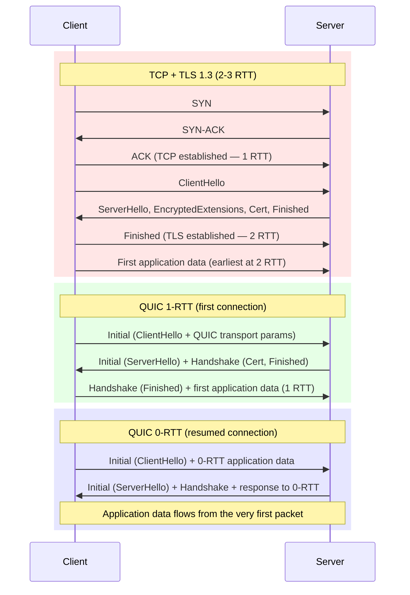
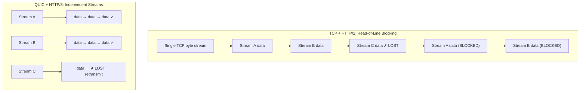

# UDP & When to Use It — Connectionless Transport and QUIC

**Date:** 2026-04-23 | **Updated:** 2026-04-23
**Tags:** `networking` `udp` `quic` `transport` `http3`

---

## Table of Contents

- [Summary](#summary)
- [1. UDP Datagram Structure](#1-udp-datagram-structure)
- [2. UDP Characteristics](#2-udp-characteristics)
- [3. When to Use UDP](#3-when-to-use-udp)
- [4. UDP in Practice](#4-udp-in-practice)
- [5. Reliability Over UDP](#5-reliability-over-udp)
- [6. QUIC Protocol Deep Dive](#6-quic-protocol-deep-dive)
- [7. QUIC vs TCP](#7-quic-vs-tcp)
- [8. HTTP/3 over QUIC](#8-http3-over-quic)
- [9. QUIC in Backend Development](#9-quic-in-backend-development)
- [Related](#related)
- [References](#references)

---

## Summary

UDP (User Datagram Protocol, RFC 768) is the simplest transport protocol in the IP suite. It offers a thin wrapper over raw IP with minimal overhead: no connection setup, no ordering guarantees, no retransmission, and no congestion control. This makes UDP ideal for latency-sensitive workloads like DNS, real-time media, and gaming.

QUIC (RFC 9000) builds a modern, encrypted, multiplexed transport **on top of UDP**. It combines the roles of TCP and TLS 1.3 into a single protocol, solving TCP's head-of-line blocking problem, enabling 0-RTT connection resumption, and supporting seamless connection migration across network changes. HTTP/3 (RFC 9114) runs exclusively over QUIC and is now the default protocol for major CDNs and browsers.

---

## 1. UDP Datagram Structure

UDP's header is only **8 bytes**, compared to TCP's minimum of 20 bytes (up to 60 with options).

```
 0                   1                   2                   3
 0 1 2 3 4 5 6 7 8 9 0 1 2 3 4 5 6 7 8 9 0 1 2 3 4 5 6 7 8 9 0 1
+-+-+-+-+-+-+-+-+-+-+-+-+-+-+-+-+-+-+-+-+-+-+-+-+-+-+-+-+-+-+-+-+
|          Source Port          |       Destination Port        |
+-+-+-+-+-+-+-+-+-+-+-+-+-+-+-+-+-+-+-+-+-+-+-+-+-+-+-+-+-+-+-+-+
|            Length             |           Checksum            |
+-+-+-+-+-+-+-+-+-+-+-+-+-+-+-+-+-+-+-+-+-+-+-+-+-+-+-+-+-+-+-+-+
|                         Data (payload)                        |
+-+-+-+-+-+-+-+-+-+-+-+-+-+-+-+-+-+-+-+-+-+-+-+-+-+-+-+-+-+-+-+-+
```

| Field | Size | Purpose |
|-------|------|---------|
| Source Port | 16 bits | Sender port (optional, can be 0) |
| Destination Port | 16 bits | Receiver port |
| Length | 16 bits | Header + payload in bytes (min 8, max 65,535) |
| Checksum | 16 bits | Integrity check over pseudo-header + UDP header + data. Optional in IPv4, mandatory in IPv6 |

**Key simplicity points:**
- No sequence numbers, no acknowledgments, no window sizes
- No connection state to maintain on either end
- Each datagram is completely independent — the protocol is stateless
- Maximum payload per datagram is limited by IP (65,507 bytes for IPv4), but in practice stays under the MTU (~1472 bytes for Ethernet) to avoid fragmentation

---

## 2. UDP Characteristics

| Property | UDP | TCP |
|----------|-----|-----|
| Connection | Connectionless | Connection-oriented (3-way handshake) |
| Ordering | No guarantee | Strict in-order delivery |
| Reliability | No retransmission | ACK-based retransmission |
| Flow control | None | Sliding window |
| Congestion control | None | Multiple algorithms (Cubic, BBR, etc.) |
| Header overhead | 8 bytes | 20-60 bytes |
| Latency | Minimal (no setup) | At least 1 RTT for handshake |
| Multiplexing | By port only | By connection (4-tuple) |

### Why "unreliable" is a feature, not a bug

For many use cases, TCP's reliability guarantees cause more harm than good:

1. **Stale data is useless.** In a video call, if frame N is lost, you want frame N+1 immediately — not a retransmitted N that arrives too late to display.
2. **Head-of-line blocking.** TCP forces all bytes to be delivered in order. One lost packet stalls everything behind it, even data from unrelated logical streams.
3. **Overhead adds up.** For tiny messages (DNS queries, game state ticks, sensor readings), TCP's connection setup and header overhead dwarf the actual payload.

---

## 3. When to Use UDP

### DNS (Port 53)

DNS queries are typically a single request-response exchange. A UDP datagram carries the query; another carries the answer. No connection setup needed. If the response is lost, the resolver simply retries. DNS over TCP is used only when responses exceed 512 bytes (or with EDNS0, ~4096 bytes) or for zone transfers.

### Real-Time Audio/Video (RTP/RTCP)

Voice and video traffic prioritizes low latency over perfect delivery. The Real-time Transport Protocol (RTP) runs over UDP and provides its own sequence numbers and timestamps for jitter calculation, but deliberately omits retransmission — a late packet is worse than a missing one.

### Online Gaming

Game servers send frequent, small state updates (player positions, inputs) at 20-128 ticks per second. Each update supersedes the previous one. TCP's retransmission and ordering guarantees would introduce unacceptable lag spikes. Games build custom reliability layers on top of UDP for the few messages that must be reliable (inventory changes, chat).

### IoT and Telemetry

Constrained devices (sensors, microcontrollers) use protocols like CoAP (Constrained Application Protocol) over UDP. The overhead of a TCP connection is too expensive when you have kilobytes of RAM and are sending a 20-byte temperature reading.

### Service Discovery (mDNS, SSDP)

Multicast DNS (port 5353) and Simple Service Discovery Protocol use UDP multicast. TCP cannot multicast — it requires a point-to-point connection. When a device asks "who has printer._tcp.local?", the question goes to the multicast group and any matching device responds.

### DHCP (Ports 67/68)

A device joining a network has no IP address yet, so it cannot establish a TCP connection. DHCP uses UDP broadcast to discover and negotiate an IP lease.

### Summary Table

| Use Case | Why UDP | Typical Protocol |
|----------|---------|-----------------|
| DNS | Single round-trip, tiny messages | DNS (RFC 1035) |
| Voice/Video | Latency > reliability, stale data useless | RTP (RFC 3550) |
| Gaming | Frequent superseding updates, custom reliability | Custom, ENet, GameNetworkingSockets |
| IoT/Telemetry | Constrained devices, minimal overhead | CoAP (RFC 7252) |
| Service Discovery | Multicast required | mDNS, SSDP |
| DHCP | No IP address yet, broadcast needed | DHCP (RFC 2131) |

---

## 4. UDP in Practice

### Node.js `dgram` Module

```typescript
import dgram from 'node:dgram';

// ── UDP Echo Server ──
const server = dgram.createSocket('udp4');

server.on('message', (msg: Buffer, rinfo: dgram.RemoteInfo) => {
  console.log(`Received ${msg.length} bytes from ${rinfo.address}:${rinfo.port}`);
  console.log(`Message: ${msg.toString()}`);

  // Echo the message back
  server.send(msg, rinfo.port, rinfo.address, (err) => {
    if (err) console.error('Send error:', err);
  });
});

server.on('error', (err: Error) => {
  console.error('Server error:', err);
  server.close();
});

server.on('listening', () => {
  const addr = server.address();
  console.log(`UDP server listening on ${addr.address}:${addr.port}`);
});

server.bind(41234);

// ── UDP Client ──
const client = dgram.createSocket('udp4');
const message = Buffer.from('Hello, UDP!');

client.send(message, 41234, 'localhost', (err) => {
  if (err) {
    console.error('Client send error:', err);
    client.close();
    return;
  }
  console.log('Message sent');
});

client.on('message', (msg: Buffer) => {
  console.log(`Reply: ${msg.toString()}`);
  client.close();
});
```

**Key `dgram` facts:**
- `createSocket('udp4')` for IPv4, `'udp6'` for IPv6
- `send()` is fire-and-forget — the callback confirms the OS accepted the data, not that it arrived
- No connection concept — each `send()` can target a different address
- `setBroadcast(true)` enables sending to `255.255.255.255`

### Java `DatagramSocket`

```java
import java.net.DatagramPacket;
import java.net.DatagramSocket;
import java.net.InetAddress;

public class UdpEchoServer {
    private static final int PORT = 41234;
    private static final int BUFFER_SIZE = 1024;

    public static void main(String[] args) throws Exception {
        try (DatagramSocket socket = new DatagramSocket(PORT)) {
            System.out.println("UDP server listening on port " + PORT);
            byte[] buffer = new byte[BUFFER_SIZE];

            while (true) {
                DatagramPacket request = new DatagramPacket(buffer, buffer.length);
                socket.receive(request);  // blocks until a datagram arrives

                String message = new String(
                    request.getData(), 0, request.getLength()
                );
                System.out.printf(
                    "Received from %s:%d → %s%n",
                    request.getAddress(), request.getPort(), message
                );

                // Echo back
                DatagramPacket response = new DatagramPacket(
                    request.getData(),
                    request.getLength(),
                    request.getAddress(),
                    request.getPort()
                );
                socket.send(response);
            }
        }
    }
}
```

```java
// Client
public class UdpClient {
    public static void main(String[] args) throws Exception {
        try (DatagramSocket socket = new DatagramSocket()) {
            socket.setSoTimeout(3000); // 3s receive timeout

            byte[] data = "Hello, UDP!".getBytes();
            InetAddress address = InetAddress.getByName("localhost");

            DatagramPacket packet = new DatagramPacket(data, data.length, address, 41234);
            socket.send(packet);

            byte[] buffer = new byte[1024];
            DatagramPacket response = new DatagramPacket(buffer, buffer.length);
            socket.receive(response); // blocks until reply or timeout

            System.out.println("Reply: " + new String(
                response.getData(), 0, response.getLength()
            ));
        }
    }
}
```

### Multicast

Multicast allows one sender to reach a group of receivers simultaneously. Multicast addresses: `224.0.0.0` to `239.255.255.255` (IPv4).

```typescript
// Node.js multicast receiver
import dgram from 'node:dgram';

const MULTICAST_GROUP = '239.1.2.3';
const PORT = 5007;

const socket = dgram.createSocket({ type: 'udp4', reuseAddr: true });

socket.on('listening', () => {
  socket.addMembership(MULTICAST_GROUP);
  console.log(`Joined multicast group ${MULTICAST_GROUP} on port ${PORT}`);
});

socket.on('message', (msg: Buffer, rinfo: dgram.RemoteInfo) => {
  console.log(`[${rinfo.address}] ${msg.toString()}`);
});

socket.bind(PORT);
```

```typescript
// Node.js multicast sender
import dgram from 'node:dgram';

const socket = dgram.createSocket('udp4');
const message = Buffer.from('Multicast hello');

socket.send(message, 5007, '239.1.2.3', (err) => {
  if (err) console.error(err);
  socket.close();
});
```

| Pattern | Address | Scope |
|---------|---------|-------|
| Unicast | Single target IP | One-to-one |
| Broadcast | `255.255.255.255` or subnet broadcast | One-to-all on subnet |
| Multicast | `224.0.0.0/4` | One-to-many (subscribed group) |

---

## 5. Reliability Over UDP

When you need **some** reliability but cannot accept TCP's tradeoffs, you build reliability at the application layer.

### Application-Level Reliability Patterns

```
┌──────────────────────────────────────────────────────┐
│                  Application Layer                    │
│  ┌─────────────┐ ┌──────────┐ ┌───────────────────┐ │
│  │  Sequence    │ │   ACK    │ │  Retransmission   │ │
│  │  Numbers     │ │  Tracking│ │  Timer            │ │
│  └─────────────┘ └──────────┘ └───────────────────┘ │
│  ┌─────────────┐ ┌──────────┐ ┌───────────────────┐ │
│  │  Ordering    │ │ Congestion│ │  Fragmentation   │ │
│  │  Buffer      │ │ Control  │ │  / Reassembly     │ │
│  └─────────────┘ └──────────┘ └───────────────────┘ │
├──────────────────────────────────────────────────────┤
│                       UDP                            │
├──────────────────────────────────────────────────────┤
│                        IP                            │
└──────────────────────────────────────────────────────┘
```

**Common techniques:**

1. **Sequence numbers** — Each message gets a monotonically increasing ID. The receiver detects gaps and duplicates.
2. **Selective ACKs** — The receiver reports which sequence numbers it has received. The sender retransmits only the missing ones.
3. **Retransmission timers** — If no ACK arrives within a timeout (often based on measured RTT), the sender retransmits.
4. **Channel types** — Many game networking libraries define multiple channel types:
   - *Unreliable*: fire-and-forget (position updates)
   - *Reliable ordered*: guaranteed, in-order (chat messages)
   - *Reliable unordered*: guaranteed, any order (asset loading)

### DTLS (Datagram Transport Layer Security)

DTLS (RFC 6347, updated by RFC 9147 for DTLS 1.3) adds TLS-equivalent encryption to UDP datagrams. It handles the unique challenges of datagram transport:
- Retransmission of handshake messages (since UDP does not guarantee delivery)
- Explicit sequence numbers in records to detect reordering and replay
- Larger handshake due to certificate exchange over unreliable transport

DTLS is used by WebRTC for its data channels, and by IoT protocols (CoAP over DTLS).

### Libraries That Build Reliability Over UDP

| Library | Language | Used By |
|---------|----------|---------|
| ENet | C | Many indie games |
| GameNetworkingSockets | C++ | Valve (Steam) |
| LiteNetLib | C# | Unity games |
| laminar | Rust | Amethyst engine |
| QUIC (see below) | Multiple | HTTP/3, everything modern |

---

## 6. QUIC Protocol Deep Dive

QUIC (RFC 9000) is the most significant evolution in transport protocols since TCP. It was originally developed by Google (gQUIC, 2012) and standardized by the IETF in May 2021.

### Motivation: TCP's Structural Problems

TCP was designed in the 1970s. Three structural issues cannot be fixed without breaking the protocol:

1. **Head-of-line (HOL) blocking.** TCP delivers a single byte stream in order. If packet 3 of 10 is lost, packets 4-10 are buffered and cannot be delivered to the application until packet 3 is retransmitted and arrives. When multiplexing HTTP/2 streams over TCP, a loss in one stream blocks all others.

2. **Ossified handshake.** TCP's 3-way handshake is separate from TLS negotiation. A TCP+TLS 1.3 connection requires at minimum 2 round trips (1 RTT for TCP SYN/SYN-ACK + 1 RTT for TLS). This cannot be optimized further without violating TCP semantics (TCP Fast Open exists but has poor middlebox support).

3. **Middlebox ossification.** NATs, firewalls, and load balancers inspect and sometimes rewrite TCP headers. Any attempt to extend TCP (new options, changed behavior) gets blocked by middleboxes that reject anything unexpected. This is why TCP Fast Open and ECN deployment remain patchy.

### QUIC Architecture

QUIC runs over UDP but implements its own transport logic:

```
┌─────────────────────────────────────────┐
│              Application                │
│           (HTTP/3, WebTransport)        │
├─────────────────────────────────────────┤
│              QUIC                       │
│  ┌────────┐ ┌──────┐ ┌──────────────┐  │
│  │Streams │ │ Loss │ │  Congestion   │  │
│  │Mux     │ │Detect│ │  Control      │  │
│  └────────┘ └──────┘ └──────────────┘  │
│  ┌────────┐ ┌──────┐ ┌──────────────┐  │
│  │Flow    │ │Conn  │ │  TLS 1.3     │  │
│  │Control │ │Migr  │ │  (built-in)  │  │
│  └────────┘ └──────┘ └──────────────┘  │
├─────────────────────────────────────────┤
│              UDP                        │
├─────────────────────────────────────────┤
│              IP                         │
└─────────────────────────────────────────┘
```

### Connection Establishment: TCP+TLS vs QUIC



**1-RTT (first connection):** QUIC merges transport and crypto handshake into one round trip. The client sends a QUIC Initial packet containing the TLS ClientHello and QUIC transport parameters. The server responds with its Initial and Handshake packets. After processing the server's response, the client can send application data — all in 1 RTT.

**0-RTT (resumed connection):** If the client has previously connected to the server, it caches session parameters (a PSK — Pre-Shared Key from TLS 1.3). On the next connection, the client computes encryption keys from the cached PSK and sends application data in the very first packet, before receiving any response. The server processes the 0-RTT data immediately.

**0-RTT security caveat:** 0-RTT data is not forward-secret and is vulnerable to replay attacks. Servers must ensure that 0-RTT-eligible operations are idempotent (e.g., a GET request is safe, but a POST that debits money is not).

### Independent Stream Multiplexing

This is QUIC's most impactful feature. Each QUIC connection supports multiple concurrent streams, and **packet loss on one stream does not block others**.



In TCP-based HTTP/2, a single lost TCP segment blocks delivery of **all** HTTP streams sharing that connection, even streams whose data is fully received. In QUIC, streams are independent. A loss on Stream C triggers retransmission only for that stream. Streams A and B continue delivering data uninterrupted.

QUIC supports four stream types:
- **Client-initiated bidirectional** (IDs: 0, 4, 8, ...)
- **Server-initiated bidirectional** (IDs: 1, 5, 9, ...)
- **Client-initiated unidirectional** (IDs: 2, 6, 10, ...)
- **Server-initiated unidirectional** (IDs: 3, 7, 11, ...)

### Connection Migration

TCP identifies a connection by its 4-tuple: `(source IP, source port, destination IP, destination port)`. Change any of these (e.g., switch from Wi-Fi to cellular) and the connection breaks.

QUIC identifies connections by a **Connection ID** — an opaque token negotiated during the handshake. When a client's IP changes:

1. The client sends a `PATH_CHALLENGE` frame on the new path using a fresh Connection ID
2. The server responds with a `PATH_RESPONSE` frame on the same path
3. Once validated, the connection seamlessly migrates — all streams, state, and encryption context are preserved

Multiple Connection IDs are pre-negotiated via `NEW_CONNECTION_ID` frames, so the new ID cannot be linked to the old one by a network observer — this provides a degree of privacy protection.

**Practical impact:** A user on a phone walks from Wi-Fi to cellular. With TCP, every HTTP connection drops and must be re-established (new handshake, new TLS session). With QUIC, the connection migrates transparently — no interruption, no new handshake.

### Built-In Encryption

Unlike TCP, where encryption is an optional layer (TLS), QUIC mandates encryption. All QUIC packets (except the very first Initial packets, which use publicly known keys) are encrypted with TLS 1.3. Even QUIC's transport headers are partially encrypted, making the protocol resistant to middlebox ossification — intermediaries cannot inspect or rewrite fields they cannot read.

---

## 7. QUIC vs TCP

### Feature Comparison

| Feature | TCP | UDP | QUIC |
|---------|-----|-----|------|
| Connection setup | 1 RTT (3-way handshake) | None | 1 RTT (0-RTT on resume) |
| Encryption | Optional (TLS layer) | Optional (DTLS) | Mandatory (TLS 1.3 built-in) |
| Handshake + encryption | 2-3 RTT (TCP+TLS) | N/A | 1 RTT (0-RTT on resume) |
| Stream multiplexing | Single byte stream | N/A | Native multi-stream |
| Head-of-line blocking | Yes (all streams blocked) | N/A | No (per-stream only) |
| Connection migration | Not possible | N/A | Supported (Connection ID) |
| Flow control | Per-connection (window) | None | Per-stream + per-connection |
| Congestion control | Built-in (Cubic, BBR, etc.) | None | Built-in (pluggable) |
| Reliability | Full (ACK + retransmit) | None | Full (per-stream) |
| Header overhead | 20-60 bytes | 8 bytes | ~20-30 bytes (varies) |
| Middlebox traversal | Ossified (changes blocked) | Good (opaque payload) | Good (runs over UDP) |
| Kernel implementation | OS kernel | OS kernel | User-space (typically) |
| Ecosystem maturity | Decades | Decades | Growing rapidly |

### When QUIC Wins

- **High-latency networks** — 0-RTT saves entire round trips on mobile/satellite connections
- **Lossy networks (mobile, Wi-Fi)** — Independent streams prevent one loss from blocking everything
- **Network switching** — Connection migration keeps sessions alive across Wi-Fi/cellular transitions
- **Multiple concurrent requests** — True multiplexing without HOL blocking
- **Privacy** — Encrypted transport headers resist fingerprinting and middlebox interference

### When TCP Is Still Better

- **Simple request-response** — For a single, short-lived exchange, TCP's mature ecosystem and kernel optimization can be faster in practice
- **Internal/datacenter traffic** — Low latency, low loss networks reduce QUIC's advantages. TCP is heavily optimized in kernels (zero-copy, TSO/GRO, eBPF)
- **Firewall environments** — Some corporate firewalls block UDP entirely or throttle it. Browsers fall back to TCP when QUIC fails
- **Debugging and tooling** — TCP is understood by every packet analyzer. QUIC's encrypted headers make debugging harder (though `qlog` helps)
- **Existing infrastructure** — Load balancers, proxies, and monitoring tools have decades of TCP optimization

---

## 8. HTTP/3 over QUIC

HTTP/3 (RFC 9114) is the HTTP version designed specifically for QUIC transport. It replaces the TCP-based framing of HTTP/2 with QUIC streams.

### How HTTP/3 Uses QUIC Streams

Each HTTP request-response pair maps to a single QUIC bidirectional stream. This is the fundamental difference from HTTP/2, where all requests share a single TCP connection and suffer from HOL blocking.

```
QUIC Connection
├── Stream 0 (bidi): GET /index.html → response
├── Stream 4 (bidi): GET /style.css → response
├── Stream 8 (bidi): GET /app.js → response
├── Stream 2 (uni):  Control stream (settings, GOAWAY)
├── Stream 6 (uni):  QPACK encoder stream
└── Stream 10 (uni): QPACK decoder stream
```

HTTP/3 uses three unidirectional streams for connection-level signaling:
- **Control stream** — carries `SETTINGS`, `GOAWAY`, and other connection-wide frames
- **QPACK encoder stream** — sends dynamic table updates from encoder to decoder
- **QPACK decoder stream** — sends acknowledgments from decoder to encoder

### QPACK Header Compression

HTTP/2 uses HPACK for header compression, which relies on TCP's in-order delivery to keep encoder and decoder tables synchronized. QUIC's out-of-order stream delivery would break HPACK, so HTTP/3 uses **QPACK** (RFC 9204).

QPACK maintains the same concepts as HPACK (static table, dynamic table, Huffman coding) but decouples compression state updates from request/response streams by using dedicated encoder/decoder streams. This prevents header compression from reintroducing head-of-line blocking.

The tradeoff: QPACK's compression ratio is slightly lower than HPACK's when configured for zero HOL blocking, but the difference is negligible in practice.

### Server Push Deprecation

HTTP/2 server push was designed to let servers proactively send resources before the client requested them. In practice, it was difficult to use correctly and often wasted bandwidth (pushing resources the client already had cached). HTTP/3 technically supports server push but Chrome removed support in 2022, and the feature is effectively deprecated. Use `103 Early Hints` instead.

### Adoption Status (as of 2026)

| Provider | HTTP/3 Status |
|----------|--------------|
| Cloudflare | Enabled by default for all sites |
| Google | Enabled across all Google services |
| AWS CloudFront | Supported |
| Fastly | Supported |
| Akamai | Supported |
| Chrome | Default since Chrome 87 |
| Firefox | Default since Firefox 88 |
| Safari | Default since Safari 14 |
| curl | Supported (built with ngtcp2 or quiche) |

W3Techs data indicates that over 30% of websites now support HTTP/3, with continued growth as CDN adoption drives deployment.

---

## 9. QUIC in Backend Development

### Node.js HTTP/3 Support

As of 2026, Node.js QUIC support is still experimental:

- **`node:quic`** module landed in Node.js 25 (October 2025) as experimental, built on OpenSSL 3.5's QUIC API
- The API is not yet stable and may change between releases
- Earlier attempts were archived (nodejs/quic repo archived August 2020, removed from core January 2021)

**Pragmatic approach today:** Terminate HTTP/3 at the edge (CDN, reverse proxy) and proxy to Node.js over HTTP/2 or HTTP/1.1 internally.

```
                                     ┌──────────────────┐
Browser ──── HTTP/3 (QUIC) ────→     │   CDN / Reverse  │
                                     │   Proxy (nginx,  │
                                     │   Caddy, Envoy)  │
                                     └──────┬───────────┘
                                            │ HTTP/2 or HTTP/1.1
                                            ▼
                                     ┌──────────────────┐
                                     │   Node.js App    │
                                     └──────────────────┘
```

This pattern gives you QUIC's faster handshakes and better multiplexing for end users while keeping application code unchanged and observable with mature HTTP/1.1 and HTTP/2 tooling.

**nginx config example:**

```nginx
server {
    listen 443 quic reuseport;   # HTTP/3 over QUIC
    listen 443 ssl;              # HTTP/2 + HTTP/1.1 fallback

    ssl_certificate     /path/to/cert.pem;
    ssl_certificate_key /path/to/key.pem;

    # Advertise HTTP/3 support via Alt-Svc header
    add_header Alt-Svc 'h3=":443"; ma=86400';

    location / {
        proxy_pass http://localhost:3000;  # Node.js backend
        proxy_http_version 1.1;
        proxy_set_header Upgrade $http_upgrade;
        proxy_set_header Connection "upgrade";
    }
}
```

### Java / Spring Boot HTTP/3 Support

Java's HTTP/3 landscape is more advanced but still experimental:

- **Jetty 12** — supports HTTP/3 via Cloudflare's `quiche` native library (JNA or Java 17 Foreign APIs). Spring Boot 3.2+ can use Jetty 12 as its embedded server. Experimental, not recommended for production.
- **Reactor Netty 1.2** (Reactor 2024.0 Release Train) — adds experimental HTTP/3. This means Spring WebFlux and Spring Cloud Gateway can be configured for HTTP/3.
- **Java `java.net.http.HttpClient`** — no QUIC/HTTP/3 support as of Java 24. The built-in client only supports HTTP/1.1 and HTTP/2.

The same edge-termination pattern applies: let your load balancer handle QUIC and talk HTTP/2 to your Spring Boot backend.

### Load Balancer Considerations

QUIC introduces unique challenges for load balancers:

1. **Connection ID routing.** Traditional L4 load balancers route based on the 4-tuple. QUIC connection migration changes the client IP, breaking hash-based routing. Load balancers must understand QUIC Connection IDs to route correctly. The IETF draft `QUIC-LB` standardizes encoding routing information into Connection IDs.

2. **UDP session tracking.** Most load balancers have shorter UDP session timeouts than TCP (30 seconds vs minutes). QUIC keep-alive intervals must be shorter than the LB timeout.

3. **Health checks.** QUIC health checks are less standardized than HTTP/TCP checks. Many LBs fall back to TCP or HTTP/2 health checks for QUIC backends.

4. **Supported load balancers:** AWS ALB supports QUIC termination. HAProxy 2.6+ supports QUIC. Envoy has experimental QUIC support. nginx supports QUIC since 1.25.

### Debugging QUIC Traffic

QUIC's encrypted headers make traditional packet capture harder, but several tools help:

- **qlog** (RFC 9272) — structured event logging format for QUIC implementations. Most libraries can emit qlog files.
- **qvis** (https://qvis.quictools.info/) — web-based qlog visualizer showing connection timelines, congestion windows, and stream states.
- **Wireshark** — can dissect QUIC Initial packets (publicly keyed) and, with TLS key logs (`SSLKEYLOGFILE`), can decrypt all QUIC traffic.
- **Chrome DevTools** → `chrome://net-internals/#quic` — shows active QUIC sessions, connection migration events, and 0-RTT usage.
- **curl with `--http3`** — test HTTP/3 connectivity from the command line.

```bash
# Test HTTP/3 with curl (requires curl built with QUIC support)
curl --http3 -I https://cloudflare-quic.com

# Enable QUIC key logging for Wireshark decryption
SSLKEYLOGFILE=~/quic-keys.log curl --http3 https://example.com

# Check if a site supports HTTP/3 via Alt-Svc
curl -sI https://www.google.com | grep -i alt-svc
```

---

## Related

- [TCP Deep Dive](tcp-deep-dive.md) — TCP fundamentals, flow control, congestion control, and the problems QUIC addresses
- [Socket Programming](socket-programming.md) — TCP and UDP socket APIs in depth
- [HTTP Evolution](../application-layer/http-evolution.md) — HTTP/1.1 to HTTP/2 to HTTP/3 progression

---

## References

- **RFC 768** — User Datagram Protocol (J. Postel, 1980). https://datatracker.ietf.org/doc/html/rfc768
- **RFC 9000** — QUIC: A UDP-Based Multiplexed and Secure Transport. https://www.rfc-editor.org/rfc/rfc9000.html
- **RFC 9001** — Using TLS to Secure QUIC. https://www.rfc-editor.org/rfc/rfc9001.html
- **RFC 9114** — HTTP/3. https://www.rfc-editor.org/rfc/rfc9114.html
- **RFC 9204** — QPACK: Field Compression for HTTP/3. https://datatracker.ietf.org/doc/rfc9204/
- **RFC 9147** — DTLS 1.3. https://www.rfc-editor.org/rfc/rfc9147.html
- **Cloudflare Blog** — Even Faster Connection Establishment with QUIC 0-RTT Resumption. https://blog.cloudflare.com/even-faster-connection-establishment-with-quic-0-rtt-resumption/
- **Internet Society** — How QUIC Helps You Seamlessly Connect to Different Networks. https://pulse.internetsociety.org/blog/how-quic-helps-you-seamlessly-connect-to-different-networks
- **Spring Blog** — HTTP/3 Support in Reactor 2024.0. https://spring.io/blog/2024/11/26/http3-in-reactor-2024/
- **Webtide** — Jetty HTTP/3 Support. https://webtide.com/jetty-http-3-support/
- **Node Vibe** — State of QUIC in Node.js. https://nodevibe.substack.com/p/state-of-quic-in-nodejs
- **Node.js dgram docs** — https://nodejs.org/api/dgram.html
- **Java DatagramSocket docs** — https://docs.oracle.com/en/java/javase/21/docs/api/java.base/java/net/DatagramSocket.html
