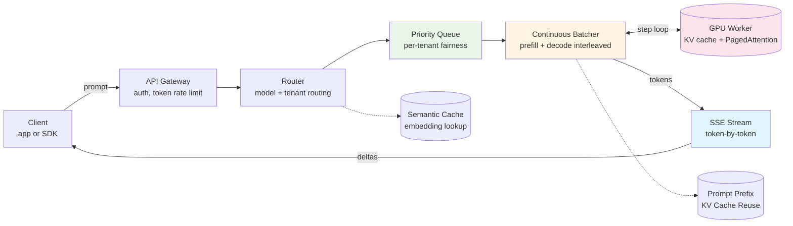
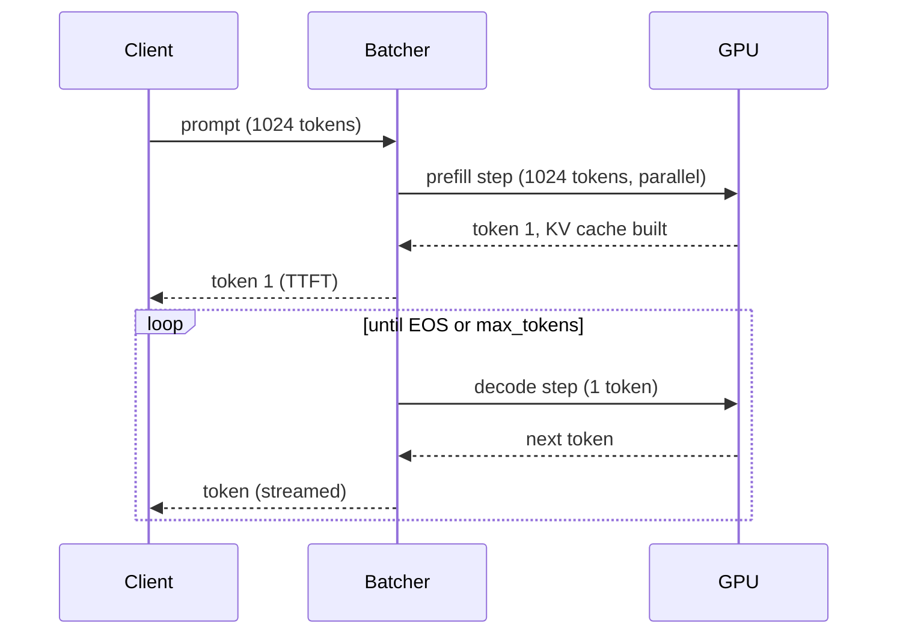

# LLM Inference Serving at Scale — vLLM, Continuous Batching, KV Cache, and Token Rate Limiting

**Date:** 2026-05-02 | **Updated:** 2026-05-02
**Tags:** `system-design` `ai-ml` `llm` `inference` `serving`

## Table of Contents

- [Summary](#summary)
- [Overview — The Shape of an Inference Request](#overview--the-shape-of-an-inference-request)
- [Inference vs Training — Different System Shape](#inference-vs-training--different-system-shape)
- [The Two Phases — Prefill and Decode](#the-two-phases--prefill-and-decode)
- [The KV Cache — Where the GPU Memory Goes](#the-kv-cache--where-the-gpu-memory-goes)
- [PagedAttention — KV Cache as Virtual Memory](#pagedattention--kv-cache-as-virtual-memory)
- [Batching — Static, Dynamic, and Continuous](#batching--static-dynamic-and-continuous)
- [Speculative Decoding](#speculative-decoding)
- [Quantization for Inference](#quantization-for-inference)
- [Model Parallelism](#model-parallelism)
- [Token-Based Rate Limiting](#token-based-rate-limiting)
- [Streaming Responses — SSE vs WebSocket](#streaming-responses--sse-vs-websocket)
- [Function and Tool Calling at the Inference Layer](#function-and-tool-calling-at-the-inference-layer)
- [Cold-Start vs Warm — Model Loading](#cold-start-vs-warm--model-loading)
- [GPU Hardware and Cost-Per-Token Math](#gpu-hardware-and-cost-per-token-math)
- [Inference Engines](#inference-engines)
- [Cloud Serving Options](#cloud-serving-options)
- [Multi-Tenant Serving and Priority Queues](#multi-tenant-serving-and-priority-queues)
- [Caching Strategies](#caching-strategies)
- [Observability](#observability)
- [Anti-Patterns](#anti-patterns)
- [Related](#related)
- [References](#references)

## Summary

An **LLM inference server** turns a neural-network checkpoint into a low-latency, high-throughput, multi-tenant service. The system shape is dominated by three facts: (1) every request runs on a **scarce, expensive GPU** that you cannot autoscale in seconds; (2) every request has **two phases** (parallel prefill, then sequential decode) with completely different compute and memory profiles; and (3) the **KV cache** — the per-request attention state — grows linearly with sequence length and is the actual capacity limit, not FLOPs. Modern engines like **vLLM** ship four ideas that together unlock 10–24× throughput over a naive implementation: **PagedAttention** (treats KV cache as paged virtual memory so fragmentation does not kill capacity), **continuous batching** (a new request joins the running batch the moment a slot frees, no head-of-line blocking), **speculative decoding** (a small draft model proposes tokens, the big model verifies in parallel), and aggressive **quantization** (INT8/INT4/AWQ/GPTQ) that fits bigger models on cheaper hardware. On top of that you need **token-based rate limiting** (input + output tokens, not requests), **streaming via SSE**, **prompt prefix caching**, and **observability tuned to LLM-specific signals** — time-to-first-token, tokens/sec, queue depth, and GPU memory headroom — because traditional p99 latency tells you almost nothing about a streaming generative system.

## Overview — The Shape of an Inference Request



The path looks superficially like a normal microservice — gateway, queue, worker, stream out — but every box has LLM-specific physics inside it.

- **Gateway** counts tokens, not requests. A 32 K-token prompt is not the same load as a 50-token prompt even though both are "one request".
- **Queue** is priority-based and tenant-fair, because GPU capacity is fixed and one tenant's 200 K-token batch can starve everyone else.
- **Batcher** is the heart of the system. It interleaves new requests' **prefill** work with running requests' **decode** work in the same GPU step.
- **GPU worker** is stateful — the KV cache for active requests _lives_ on the GPU. If memory fills up, you must preempt or evict, not just slow down.
- **Stream** delivers tokens as they are produced; closing the connection mid-generation must cancel the GPU work, not waste it.

## Inference vs Training — Different System Shape

Training and inference share a model architecture and almost nothing else.

| Dimension | Training | Inference |
|---|---|---|
| Goal | Update weights | Serve frozen weights |
| Workload | Long, batched, throughput-oriented | Many small, latency-sensitive |
| GPU pattern | Many GPUs, one job, hours-to-weeks | Many requests, shared GPUs, ms-to-s |
| Memory dominated by | Activations + gradients + optimizer state | KV cache + weights |
| Failure mode | Restart from checkpoint | Drop request, retry |
| Scaling unit | Cluster | Single replica |
| Cost model | Capex / training run | Per-token, continuous |

The single most important consequence: **training optimizes for throughput; inference optimizes for tail latency at a throughput floor**. A serving system that maximizes tokens/sec without watching p99 time-to-first-token (TTFT) is a serving system that nobody wants to use.

## The Two Phases — Prefill and Decode

Every chat completion has two phases on the GPU, and they have different compute profiles.

**Prefill** — process the entire prompt (system prompt + user message + chat history) in parallel. All prompt tokens go through the transformer at once. This is **compute-bound** (lots of matmul, GPU happy) and produces the first output token plus the KV cache for every prompt position.

**Decode** — generate output tokens one at a time. Each step takes the previously generated token, computes attention against the KV cache, and emits the next token. This is **memory-bound** (you read the entire KV cache from HBM every single step) and is sequential — you cannot parallelize within a single request because token N+1 depends on token N.



**Implications**

- **TTFT** (time-to-first-token) is dominated by prefill cost, which scales roughly linearly with prompt length.
- **TPOT** (time-per-output-token) is dominated by decode and depends on KV-cache size and batch composition.
- A "fast" model on short prompts can become unusable on long ones. Always test with realistic context lengths.
- Prefill and decode have **different optimal batch sizes**. Continuous batching exists precisely so you can mix them.

## The KV Cache — Where the GPU Memory Goes

When attention runs, each token attends to every previous token in the sequence. To avoid recomputing K and V projections for every previous token on every step, the model **caches** them — that is the **KV cache**.

Memory cost per request:

```
kv_bytes = 2  *  num_layers  *  num_kv_heads  *  head_dim  *  seq_len  *  bytes_per_element
            ^
            K and V
```

For Llama-3-70B (FP16, 80 layers, 8 KV heads, head dim 128) at 8 K context: roughly **1.3 GB per request**. An H100 with 80 GB total, after weights take ~140 GB across two GPUs (so ~70 GB per GPU), might have only 30–40 GB free for KV cache — which is a hard ceiling of a few dozen concurrent 8 K sequences.

That ceiling is the actual capacity of your serving system. It is _not_ FLOPs, it is _not_ bandwidth in the abstract — it is **how many KV-cache slots fit on the GPU at once**.

Two consequences:

1. **Throughput scales with how tightly you pack the KV cache.** Internal fragmentation (allocating 8 K worth of slots for a request that finishes at 200 tokens) is wasted capacity.
2. **Long-context support is exponentially expensive.** Doubling context length doubles per-request KV memory _and_ roughly halves how many requests fit. 200 K-context support is a different product, not the same product with a bigger number.

## PagedAttention — KV Cache as Virtual Memory

The vLLM paper (Kwon et al., SOSP 2023) made the key observation: traditional KV-cache allocators reserve **contiguous** memory of `max_seq_len` per request, which causes massive **internal fragmentation** (early-finishing requests waste their unused slots) and **external fragmentation** (free chunks too small to fit a new request).

**PagedAttention** borrows the OS virtual-memory trick:

- Split the KV cache into fixed-size **blocks** (e.g., 16 tokens per block).
- Each request gets a **block table** mapping its logical token positions to physical blocks anywhere in GPU memory.
- A request grows by appending blocks; it doesn't reserve a maximum up front.
- **Sharing** is free: prefix-cached blocks (e.g., a system prompt shared across users) are referenced by multiple block tables with copy-on-write on divergence.

The result, per the vLLM paper: 2–4× higher throughput than the previous SOTA (HuggingFace TGI without paging, FasterTransformer) and near-zero memory waste.

A concrete consequence: with PagedAttention, **prompt-prefix sharing across users is essentially free** at the KV-cache layer. If a million users all hit the same 4 K system prompt, you store it once.

## Batching — Static, Dynamic, and Continuous

Batching matters because the GPU is much more efficient on a batch of N tokens than on N separate steps of 1 token. The question is how you form the batch.

**Static batching (naive)** — collect N requests, run them together until all N finish. The whole batch waits for the slowest member. A single 4 K-token-output request blocks 31 other 50-token requests for seconds. This is **head-of-line blocking** and is unusable in production.

**Dynamic batching** — common in non-LLM serving (TensorFlow Serving, Triton). Wait up to `max_delay_ms` to form a batch, then run it as a unit. Better than static, still suffers head-of-line blocking once a batch starts.

**Continuous batching** (a.k.a. **in-flight batching**, **iteration-level scheduling**) — the LLM-specific answer. The scheduler runs a single GPU step over the union of all currently active sequences. Each step:

1. For requests in **decode**, generate the next token.
2. For requests in **prefill**, process their prompt (possibly chunked).
3. Any request that hits EOS or `max_tokens` exits the batch immediately, freeing its KV slots.
4. Any new request whose KV cache fits joins the next step.

```mermaid
gantt
    title Static vs Continuous Batching (4 requests, mixed lengths)
    dateFormat  X
    axisFormat %s

    section Static
    Req A (10 tok)  : 0, 10
    Req B (50 tok)  : 0, 50
    Req C (10 tok)  : 0, 10
    Req D (50 tok)  : 0, 50

    section Continuous
    Req A (10 tok)  : 0, 10
    Req B (50 tok)  : 0, 50
    Req C (10 tok)  : 10, 20
    Req D (50 tok)  : 20, 70
```



In static batching, A and C finish their work in 10 steps but the slot is held for 50. In continuous batching, A and C release their slots at step 10 and new requests start immediately. Real-world throughput improvements: 5–24× (vLLM benchmarks), with much better tail latency.

## Speculative Decoding

Decode is sequential and memory-bound — you process one token per GPU step but read the entire weight matrix from HBM every step. That is bandwidth-wasteful: you _could_ have processed many tokens in parallel for the same memory traffic if only you had known what they would be.

**Speculative decoding** (Leviathan et al., 2023) exploits this. Pair the big **target model** (the one you actually want to serve) with a small, fast **draft model** (e.g., a 1B model paired with a 70B target).

1. Draft model generates K candidate tokens autoregressively (cheap).
2. Target model **verifies** all K tokens in a single forward pass — same memory traffic as one decode step.
3. Accept the longest prefix on which target and draft agree; commit it. On disagreement, fall back to the target's correction.

If the draft model agrees with the target most of the time, you get **multiple committed tokens per target-model step**, with **no quality loss** (the output distribution is provably identical to running the target alone, because the verification is mathematically rejection-sampling).

Typical speedups: 2–3× for chat workloads, more for highly predictable text (code, structured output). Cost: extra GPU memory for the draft model and a more complex scheduler.

Variants: **Medusa** (multiple decoding heads on the same model), **EAGLE** (more accurate drafting), **lookahead decoding** (no draft model, uses Jacobi iteration).

## Quantization for Inference

A 70 B-parameter model in FP16 needs ~140 GB. In INT8 it needs ~70 GB. In INT4 it needs ~35 GB. The cheaper hardware that fits the smaller version is often the one you can actually afford.

| Format | Bits / param | Quality impact | Notes |
|---|---|---|---|
| FP16 / BF16 | 16 | Baseline | Default training and serving format |
| FP8 | 8 | Near-baseline on H100/Hopper | Native hardware support, low overhead |
| INT8 | 8 | Small (often <1% on benchmarks) | Mature; good throughput gain |
| INT4 (AWQ) | 4 | Moderate | Activation-aware; preserves salient weights |
| INT4 (GPTQ) | 4 | Moderate | Optimal-brain-surgeon style; per-layer error minimization |
| INT3 / INT2 | 2–3 | Significant degradation | Research-grade; rarely production |

**AWQ** (Activation-aware Weight Quantization) and **GPTQ** (Frantar et al., 2022) are the two production-grade INT4 schemes. AWQ scales weights based on activation magnitudes; GPTQ minimizes per-layer reconstruction error using approximate second-order information. Both produce calibrated, deployable INT4 checkpoints.

**Trade-offs**

- Quantization slows down **only weight loads** in decode — it does not help compute-bound prefill much.
- Calibration matters: a well-calibrated INT4 model often beats a badly calibrated INT8 one.
- Always benchmark on **your eval set**, not on MMLU. A model that loses 1% on MMLU might lose 10% on your tool-calling format.
- KV cache can also be quantized (INT8 KV cache) for additional capacity at minor quality cost.

## Model Parallelism

When a model does not fit on a single GPU you must split it. Three orthogonal axes:

**Tensor parallelism (intra-layer).** Shard weight matrices across GPUs along a hidden dimension. Each GPU computes a slice of every matmul; results are combined with all-reduce. Latency-friendly because every GPU works on every token. Communication-heavy: requires fast interconnect (NVLink, NVSwitch). This is the default for serving large models on a single node.

**Pipeline parallelism (inter-layer).** Assign different transformer layers to different GPUs. A request flows GPU 0 → GPU 1 → GPU 2 → output. Communication is small (just activations between stages) but **latency suffers** unless you pipeline many micro-batches simultaneously to keep all stages busy. Used to span nodes when tensor parallel exhausts a single node.

**Expert parallelism (MoE).** Mixture-of-Experts models (Mixtral, DeepSeek-V3) have many feedforward "experts" per layer; each token is routed to a small subset (e.g., top-2 of 8). Place different experts on different GPUs. Throughput is great but **load balancing is the hard problem** — popular experts become hotspots and starve underused ones.

Most production serves use **TP within a node + PP across nodes + EP for MoE layers**, configured per model.

## Token-Based Rate Limiting

LLM economics are token-denominated, not request-denominated, so your rate limiter must be too. See [Rate Limiters](../building-blocks/rate-limiters.md) for the underlying algorithms.

Three quotas to enforce, separately:

1. **Input tokens per minute (TPM-in)** — caps prefill load. Long prompts dominate prefill and TTFT, so this protects head-of-line latency.
2. **Output tokens per minute (TPM-out)** — caps decode load. Decode is what costs you GPU-seconds.
3. **Requests per minute (RPM)** — coarse abuse cap; protects the queue and routing layer.

**Tiered quotas** scale with subscription level, model size (smaller models = higher TPM), and tenant trust. Anthropic and OpenAI both publish tier-based TPM and RPM tables; see their API docs.

**Reservation vs post-charge.** You charge for output tokens _after_ generation (you don't know the count up front), but you should **reserve** an upper bound (`max_tokens`) before admitting the request. Otherwise an aggressive caller can blow through their quota by issuing many `max_tokens=4096` requests simultaneously while quota is still nominally available.

**Headers** — return `X-RateLimit-Limit-Tokens`, `X-RateLimit-Remaining-Tokens`, `X-RateLimit-Reset-Tokens` (and the requests variants) so clients can self-pace. See OpenAI and Anthropic API docs for the canonical shape.

## Streaming Responses — SSE vs WebSocket

Generation takes seconds; closing a connection that long without showing progress is a UX disaster. Always stream.

**Server-Sent Events (SSE)** is the de-facto standard for LLM APIs (OpenAI, Anthropic, Bedrock all use it). One-way, text-only, runs over plain HTTP/1.1 or HTTP/2, traverses corporate proxies, supported natively by browsers via `EventSource`. The wire format is `data: <json>\n\n`-delimited frames.

**WebSocket** is bidirectional, lower-overhead per frame, and allows mid-generation cancellation by sending a control message on the same connection. The cost is more infrastructure complexity (sticky sessions, separate proxy config) and weaker compatibility with HTTP intermediaries.

**Choosing.** SSE wins for almost all chat-completion APIs because the workload is one-way. WebSocket wins for **voice / multimodal / agentic** systems where the client streams audio or interrupts mid-thought.

**Cancellation.** Whichever you pick, an aborted client must trigger a server-side cancel that frees the GPU slot immediately — otherwise you bill the customer (and yourself) for tokens nobody reads.

## Function and Tool Calling at the Inference Layer

Modern chat models can emit structured "tool call" JSON instead of free text. Implementing this well at the inference layer requires:

- **Constrained decoding** — at each step, mask the logits so only tokens that keep the partial output in the tool-call grammar (or JSON schema) are allowed. Ensures the model emits parseable structure even when it would otherwise hallucinate.
- **Schema enforcement** — guidance from the JSON schema (or OpenAPI tool spec) is compiled into a finite-state machine that drives the logit mask.
- **Multi-turn tool loops** — the inference server may not orchestrate the loop itself; that often lives in the application. But it must surface tool calls in the streaming format cleanly (incremental JSON deltas).
- **Parallel tool calls** — the model emits multiple tool calls in one response; the streaming format must distinguish them by index so the client can dispatch in parallel.

Libraries: **outlines**, **lm-format-enforcer**, **xgrammar**. Most production engines (vLLM, TGI, TensorRT-LLM) integrate at least one.

## Cold-Start vs Warm — Model Loading

A 70 B FP16 model is ~140 GB on disk. Loading from object storage to GPU takes minutes, not seconds:

- Network read from S3/GCS: ~100 GB at 1–2 GB/s = 1–2 minutes.
- Disk → CPU memory: another 30–60 seconds.
- CPU → GPU HBM: 30+ seconds via PCIe (faster on NVLink-attached storage).
- Engine compilation / kernel autotuning: 30 s–several minutes (TensorRT-LLM is the worst offender).

**Implications**

- **Autoscaling on demand is impractical** for large models. You over-provision and accept idle cost, or you use scale-to-zero only for small or quantized models.
- **Warm pools** — keep N replicas pre-loaded; scale the pool on slower signals (5–15 minute trends), not per-second load.
- **Adapter swapping (LoRA)** is the workaround for many fine-tunes — load the base model once, hot-swap small adapters per tenant in milliseconds. vLLM, TGI, and TensorRT-LLM all support multi-LoRA serving.
- **Faster loading paths** — direct GPU storage (NVIDIA GPUDirect Storage), tensorized formats (`safetensors` mmap), and progressive layer load can shave significant time but rarely change the order of magnitude.

## GPU Hardware and Cost-Per-Token Math

| GPU | HBM | Memory BW | Compute (FP16) | Typical use |
|---|---|---|---|---|
| H100 SXM | 80 GB | 3.35 TB/s | ~1 PFLOP | Frontier serving, training |
| H200 | 141 GB | 4.8 TB/s | ~1 PFLOP | Long-context inference |
| A100 80 GB | 80 GB | 2 TB/s | ~312 TFLOPS | Workhorse, still common |
| L40S | 48 GB | 0.86 TB/s | ~360 TFLOPS | Smaller models, INT8/INT4 |
| L4 | 24 GB | 0.3 TB/s | ~120 TFLOPS | Edge / small-model inference |

**Cost-per-token sketch** (very rough, illustrative only):

```
H100 spot price                ≈ $2–4 / hour
Throughput (Llama-3-70B FP8,
  vLLM, mixed prefill+decode)  ≈ 1500 tokens / sec / GPU
Cost per 1M tokens             ≈ $3.60 / 1.5M = ~$0.40 / M tokens (compute only)
```

Compare to public API list prices ($1–15 / M output tokens) to see margin and headroom. Real costs add ingress/egress, redundancy, idle time, and engineering — typically 3–5× the raw compute cost.

Decode is **bandwidth-bound**, not flops-bound, on most modern GPUs serving large models. That is why H200 (more bandwidth, same compute) is a meaningful upgrade despite identical FLOPs.

## Inference Engines

| Engine | Owner | Strengths | Trade-offs |
|---|---|---|---|
| **vLLM** | Open source / Berkeley | PagedAttention, continuous batching, broad model support, fast iteration | Less optimized for very small batch / single-stream than TRT-LLM |
| **TGI (Text Generation Inference)** | Hugging Face | Production-hardened, good HF model integration, multi-LoRA | Throughput now lags vLLM on many workloads |
| **TensorRT-LLM** | NVIDIA | Highest peak throughput on NVIDIA hardware, FP8 first-class | NVIDIA-only, complex build, long compile times, less flexible |
| **llama.cpp** | Open source / ggml | CPU + Apple Silicon + small GPUs, GGUF format, edge inference | Not designed for multi-tenant high-throughput serving |
| **SGLang** | Open source | Aggressive prefix caching, structured generation focus | Newer, smaller community |
| **DeepSpeed-MII / FasterTransformer** | Microsoft / NVIDIA | Used in specific stacks | Largely superseded by vLLM and TRT-LLM |

The pragmatic choice for most teams in 2026: **vLLM** for general use, **TensorRT-LLM** when you have NVIDIA-only infra and need to squeeze the last 30% out, **llama.cpp** for on-device, **TGI** if you are deep in the Hugging Face ecosystem.

## Cloud Serving Options

You generally pick from three tiers:

**Frontier APIs** — OpenAI, Anthropic, Google. Best models, simplest integration, highest per-token cost, no infrastructure burden. Token-based pricing, prompt caching offered (Anthropic explicit, OpenAI automatic), structured streaming.

**Aggregator APIs** — Together, Fireworks, Replicate, Groq, DeepInfra. Open-weight models (Llama, Mistral, DeepSeek) served on their hardware. Lower per-token cost, more model choice, often per-model pricing pages. Good when you want vendor-neutral open models with one bill.

**Cloud-native managed** — AWS Bedrock, Azure AI Foundry, Vertex AI (Google). Open and proprietary models behind a unified API, with VPC integration, IAM, observability tied into the cloud you already use. Usually pricier than aggregators, cheaper than frontier per token, with enterprise compliance hooks.

**Self-hosted** — vLLM/TGI on your own GPUs (or rented ones from CoreWeave, Lambda, Crusoe). Lowest unit cost at scale, highest engineering cost. Worth it above ~$50k/month spend or with strict data-residency needs.

Real architectures often span tiers: frontier API for production traffic that demands the best quality, self-hosted for high-volume cheap calls, aggregator as backup.

## Multi-Tenant Serving and Priority Queues

A single GPU replica serves many tenants. Without scheduling, one tenant's batch starves the rest.

- **Priority queues per tenant tier** — free, paid, enterprise. High-tier requests jump the queue; low-tier degrade first.
- **Token-fair scheduling** — track tokens-served-per-tenant in the recent window; the scheduler picks the next admit by inverse weight (deficit round-robin in token space).
- **Per-tenant max concurrency** — cap the number of in-flight requests per tenant so one tenant cannot fill all KV-cache slots.
- **Backpressure to the queue** — when KV-cache utilization crosses ~90%, stop admitting new requests and let in-flight ones drain. Pair with proper 429s upstream. See [Backpressure, Bulkhead, Circuit Breaker](../scalability/backpressure-bulkhead-circuit-breaker.md).
- **Preemption** — for hard priority, you can _evict_ a low-priority request's KV cache to make room for a high-priority one. The evicted request restarts on next admission. Costs throughput; gains tail latency control.

## Caching Strategies

Three cache layers, each at a different abstraction level:

**Prompt prefix cache (KV-cache reuse).** When two requests share a prefix (system prompt, few-shot examples, conversation history), reuse the prefill KV blocks. PagedAttention makes this nearly free — you point the new request's block table at the existing blocks. Typical hit: **3–10× faster TTFT** on long shared system prompts. Anthropic exposes this as explicit prompt caching with discounted token billing.

**Response cache (exact match).** If the exact same prompt has been served recently, return the cached response. Useful for popular queries (FAQs, code completions for the same snippet). Hit rate is usually low for chat (prompts contain user-specific context) but can be high for embedding endpoints and documentation Q&A.

**Semantic cache (embedding lookup).** Embed the incoming prompt; look up nearest neighbours in a vector index of past prompts; if cosine similarity > threshold, return that response. See [Vector Databases and Semantic Search](./vector-databases-and-semantic-search.md). Risky for generative output (similar prompt ≠ correct answer for a different user) but well-suited to RAG retrieval results, where the retrieved documents legitimately depend only on the query, not the user. See [RAG Architecture](./rag-architecture.md).

## Observability

LLM serving has its own SLI vocabulary; the standard web-service dashboards lie to you.

| Metric | What it tells you |
|---|---|
| **Time-to-first-token (TTFT)** | Prefill cost + queue + scheduling overhead. Most user-perceptible latency for chat. |
| **Time-per-output-token (TPOT)** | Decode efficiency; degrades when KV cache fills or batch composition is bad. |
| **Tokens / second (per replica)** | Headline throughput. Track in + out separately. |
| **Queue depth + queue time** | Backpressure indicator; pair with admission control. |
| **GPU utilization** | Misleading: can be 100% while serving few tokens (memory-bound decode). |
| **GPU memory utilization** | The _real_ capacity signal. Above ~85% is dangerous. |
| **KV-cache hit rate** | How well prefix caching is paying off. |
| **Cancellation rate** | Clients giving up — if high, your TTFT is too slow. |
| **Cost per 1M tokens** | The business metric. Plot it daily. |

For latency targets, see [Performance Budgets](../performance-observability/performance-budgets.md). A typical chat product budget: TTFT p95 < 1.5 s, TPOT p95 < 80 ms (~12 tokens/sec), end-to-end p95 < 30 s for normal prompts.

Tracing must be **token-aware** — log per-request prefill duration, output token count, model version, quantization, KV-cache occupancy at admission, and queue wait. Without those you cannot diagnose a regression.

## Anti-Patterns

- **Treating LLM serving like a normal microservice.** Autoscaling on CPU% is meaningless. p99 latency hides streaming behavior. Standard load tests miss prefill/decode asymmetry.
- **Static batching in production.** Head-of-line blocking turns one slow generation into a global pause. Use continuous batching from day one.
- **No KV-cache budget.** Admitting requests until OOM, then crashing the worker. Track KV-cache occupancy and apply backpressure at 85–90%.
- **Rate limiting by request count only.** A single 100 K-token call costs more than 1 000 short calls. Limit on tokens, with separate input and output meters.
- **`max_tokens` defaulted to model maximum.** Reserves enormous KV slots per request, slashes effective concurrency, shouts "DoS me" at clients. Set sane defaults (256–1024) and require explicit opt-in to long outputs.
- **Ignoring client cancellation.** When a user closes the tab, the GPU keeps generating. Wire abort signals through the batcher and free the slot.
- **Assuming bigger model = better product.** A well-quantized 8 B model on cheap hardware often beats a 70 B model with worse latency and 5× the cost. Pick the smallest model that hits eval.
- **Skipping evals on quantization changes.** "INT4 looks fine on MMLU" is not the same as "INT4 still parses my tool-calling JSON". Quantize, eval on _your_ task, then ship.
- **One global queue across tenants.** A noisy tenant starves everyone. Priority + per-tenant fairness are non-negotiable in multi-tenant serving.
- **Hot-loading models on demand.** Cold start is minutes, not seconds. Use warm pools and adapter swapping.
- **No prompt-prefix caching when prompts share long preambles.** Leaves 5–10× TTFT improvements on the table for system-prompt-heavy workloads.
- **Treating SSE as best-effort.** Forgetting `Cache-Control: no-cache` or `X-Accel-Buffering: no` causes proxies to buffer streams and break the entire UX.
- **Assuming GPU% means saturation.** Decode is memory-bound; you can be 100% util-by-time while only delivering 10% of theoretical tokens/sec. Use GPU memory occupancy and tokens/sec instead.

## Related

- [RAG (Retrieval-Augmented Generation) Architecture](./rag-architecture.md) — feeds retrieved context into the inference path; prompt-prefix caching and TTFT budgets are the integration points.
- [Vector Databases and Semantic Search](./vector-databases-and-semantic-search.md) — the storage tier behind RAG retrieval and semantic response caches.
- [Backpressure, Bulkhead, Circuit Breaker](../scalability/backpressure-bulkhead-circuit-breaker.md) — admission control and overload patterns; KV-cache pressure is just another saturation signal.
- [Rate Limiters — Token Bucket, Leaky Bucket, Sliding Window](../building-blocks/rate-limiters.md) — algorithmic foundation for token-based quotas.
- [Performance Budgets](../performance-observability/performance-budgets.md) — TTFT and TPOT as user-facing latency budgets.

## References

- Kwon et al., **"Efficient Memory Management for Large Language Model Serving with PagedAttention"**, SOSP 2023 — the vLLM paper introducing PagedAttention and continuous batching: <https://arxiv.org/abs/2309.06180>
- **vLLM documentation** — engine architecture, model support matrix, deployment guides: <https://docs.vllm.ai/en/latest/>
- **HuggingFace Text Generation Inference (TGI)** — production-hardened serving for HF models, multi-LoRA, quantization recipes: <https://huggingface.co/docs/text-generation-inference/>
- **NVIDIA TensorRT-LLM** — NVIDIA's optimized inference engine; FP8, in-flight batching, multi-GPU partitioning: <https://nvidia.github.io/TensorRT-LLM/>
- **Anthropic API documentation** — Messages API, streaming events, tool use, prompt caching, rate-limit headers: <https://docs.anthropic.com/en/api/messages>
- **OpenAI API documentation** — chat completions, streaming, tool calling, rate-limit tiers: <https://platform.openai.com/docs/api-reference>
- **AWS Bedrock User Guide** — managed multi-model inference, provisioned throughput, on-demand and batch APIs: <https://docs.aws.amazon.com/bedrock/latest/userguide/what-is-bedrock.html>
- Leviathan, Kalman, Matias, **"Fast Inference from Transformers via Speculative Decoding"**, ICML 2023 — speculative decoding with provably identical output distribution: <https://arxiv.org/abs/2211.17192>
- Frantar et al., **"GPTQ: Accurate Post-Training Quantization for Generative Pre-trained Transformers"**, ICLR 2023 — INT4 quantization via approximate second-order information: <https://arxiv.org/abs/2210.17323>
