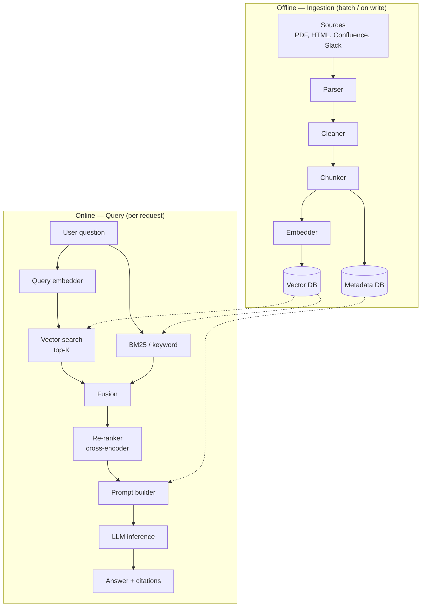
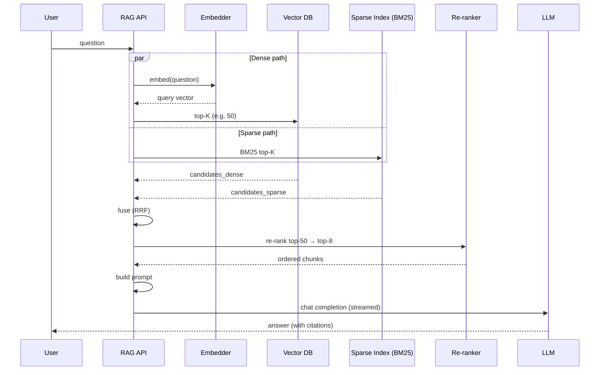

# RAG Architecture — Ingestion, Chunking, Retrieval, and Prompt Construction

**Date:** 2026-05-02 | **Updated:** 2026-05-02
**Tags:** `system-design` `ai-ml` `rag` `llm` `retrieval`

## Table of Contents

- [Summary](#summary)
- [Why RAG Exists — The Motivation](#why-rag-exists--the-motivation)
- [The Two Phases — Offline Ingestion + Online Query](#the-two-phases--offline-ingestion--online-query)
- [Ingestion Pipeline](#ingestion-pipeline)
  - [Source → Parse → Clean](#source--parse--clean)
  - [Document Parsers in Practice](#document-parsers-in-practice)
- [Chunking — The Most Underrated Decision](#chunking--the-most-underrated-decision)
  - [Chunking Strategies](#chunking-strategies)
  - [Chunk Size Trade-offs](#chunk-size-trade-offs)
  - [Sliding Window with Overlap](#sliding-window-with-overlap)
- [Embeddings — Per-Chunk Vectors](#embeddings--per-chunk-vectors)
- [Storage — Vector DB + Metadata DB](#storage--vector-db--metadata-db)
- [Query Path](#query-path)
- [Hybrid Retrieval — Dense + Sparse](#hybrid-retrieval--dense--sparse)
- [Re-Ranking the Top-K](#re-ranking-the-top-k)
- [Prompt Construction](#prompt-construction)
  - [Context Window Management](#context-window-management)
- [Evaluation — RAGAS, TruLens, and the Triad](#evaluation--ragas-trulens-and-the-triad)
- [Multi-Modal RAG](#multi-modal-rag)
- [Caching at Every Layer](#caching-at-every-layer)
- [Production Concerns](#production-concerns)
- [Common Failures](#common-failures)
- [Decision Guidance](#decision-guidance)
- [Anti-Patterns](#anti-patterns)
- [Related](#related)
- [References](#references)

## Summary

**Retrieval-Augmented Generation (RAG)** is the pattern of injecting *retrieved* text from a private corpus into an LLM prompt at query time so the model can answer grounded in your data instead of its pre-training. At its core RAG is two pipelines glued to a vector index: an **offline ingestion pipeline** that parses, chunks, embeds, and stores your documents, and an **online query pipeline** that embeds the user question, retrieves top-K chunks, optionally re-ranks them, and assembles a final prompt for the LLM. The hard parts are not the LLM call — they are **chunking strategy, embedding/query model alignment, hybrid retrieval, re-ranking, and evaluation**. RAG is fundamentally a **search problem with an LLM at the end** — most failures come from the search half, not the generation half.

## Why RAG Exists — The Motivation

LLMs ship with two structural limitations:

1. **Frozen knowledge.** A model trained with data through 2025-Q3 cannot know your internal wiki, last week's incident report, or yesterday's product launch.
2. **Hallucination.** When asked about something the model does not know, the default failure mode is to *confidently invent* plausible-sounding text.

Three approaches exist to inject private knowledge into an LLM:

| Approach | What It Does | Cost | Freshness | Best For |
|---|---|---|---|---|
| **Long context dump** | Stuff every document into the prompt | High per-call cost; degrades past ~100k tokens | Real-time | Tiny corpora (< a few documents) |
| **Fine-tuning** | Train weights on your corpus | One-time training cost; expensive to refresh | Stale (refresh = retrain) | Style, tone, format conformance — *not* factual recall |
| **RAG** | Retrieve relevant chunks at query time, inject into prompt | Low per-call (cheap embeddings + vector search) | Near-real-time (re-index on write) | Factual Q&A, doc search, support bots, code search |

RAG wins for **factual grounding** because:

- Adding a document = a few embeddings + an upsert into a vector DB. No retraining.
- The model is told *exactly which passages to use*, so hallucination drops if the prompt is constructed correctly.
- You can show **citations** — every claim in the answer maps back to a source document, which is non-negotiable for legal, medical, finance, and enterprise use cases.

The original idea is from Lewis et al. (2020), formalized as a hybrid of a dense retriever and a seq2seq generator. The 2023–2026 production pattern keeps the retrieve-then-generate shape but swaps the seq2seq generator for a frontier LLM (GPT-4-class, Claude, Gemini, Llama 3.x).

## The Two Phases — Offline Ingestion + Online Query



Two pipelines, one shared store. The asymmetry is **fundamental**:

- **Ingestion is throughput-bound and bursty.** New docs arrive, you batch-embed, you upsert. Latency does not matter; total cost matters.
- **Query is latency-bound and steady.** A user is waiting. The whole pipeline must finish in 1–3 seconds (embed query → retrieve → re-rank → LLM stream first token).

Treating them as the *same* pipeline is the first mistake; they have different SLOs, different scaling axes, and usually different infrastructure.

## Ingestion Pipeline

### Source → Parse → Clean

A real corpus is messy. Sources include:

- PDFs (scanned, born-digital, mixed)
- DOCX, PPTX, XLSX
- HTML (rendered or raw)
- Markdown / wikis (Confluence, Notion, Obsidian)
- Code repositories
- Email threads, Slack history, support tickets
- Database tables (rendered as text)

Each source needs a parser that produces **clean text plus structural metadata** (section headings, page numbers, source URL, author, last-modified timestamp, ACLs). The metadata is not optional — it powers filtering, citation, freshness, and access control downstream.

A canonical chunk record looks like:

```json
{
  "chunk_id": "doc_4192_chunk_07",
  "doc_id": "doc_4192",
  "text": "The retry policy uses exponential backoff with full jitter ...",
  "embedding": [0.0123, -0.0451, ...],
  "metadata": {
    "source_url": "https://wiki.acme.com/runbooks/retry",
    "title": "Retry Policy Runbook",
    "section": "Backoff Strategy",
    "page": 3,
    "doc_updated_at": "2026-04-12T09:30:00Z",
    "author": "platform-team",
    "acl": ["engineering", "sre"],
    "language": "en",
    "tokens": 312
  }
}
```

### Document Parsers in Practice

| Format | Recommended Parser | Notes |
|---|---|---|
| Born-digital PDF | **PyMuPDF** (`fitz`) — fastest, preserves layout; **pdfplumber** for table extraction | Reading order on multi-column layouts is the failure mode |
| Scanned PDF | **Tesseract OCR** + layout model; or hosted: **AWS Textract**, **Azure Doc Intelligence**, **Unstructured.io** | OCR errors propagate everywhere; budget time for cleanup |
| DOCX | **python-docx**, **mammoth** (DOCX → HTML/MD) | Mammoth's MD output is friendliest to chunkers |
| HTML | **trafilatura** (boilerplate removal) or **readability-lxml** | Strip nav/footer/cookie banners or you embed garbage |
| Markdown | Just read it; respect heading structure | Markdown is the easiest case — preserve hierarchy |
| Code | **Tree-sitter** for AST-aware splitting | Splitting code by character count breaks semantics |
| Tables | Convert to markdown table, *or* serialize each row as a sentence | Embeddings of raw CSVs are usually worthless |
| Images in docs | Extract, caption with a vision model, store caption alongside | Multi-modal RAG section below |

**Higher-level frameworks** — LlamaIndex's `LlamaParse`, LangChain's `DocumentLoaders`, and Unstructured.io wrap many of these and standardize the output shape. Use them for breadth; drop to the underlying library when a specific format misbehaves.

The cleaning step typically:

- Normalizes Unicode (NFC), strips control characters.
- Collapses repeated whitespace.
- Removes headers/footers/page numbers from PDFs.
- Drops navigation chrome from HTML.
- Optionally redacts PII (emails, SSNs, credit cards) — see production concerns below.

## Chunking — The Most Underrated Decision

A "chunk" is the unit of retrieval. Get this wrong and nothing downstream rescues you. The model sees what you retrieve; if you retrieve a chunk that ends mid-sentence and is missing the antecedent, the LLM will either say "I don't know" or hallucinate.

### Chunking Strategies

| Strategy | How It Works | Pros | Cons |
|---|---|---|---|
| **Fixed-size by characters** | Split every N characters | Trivial, deterministic | Cuts mid-sentence, mid-word |
| **Fixed-size by tokens** | Split every N tokens (using model tokenizer) | Predictable embedding cost | Still cuts mid-sentence |
| **Sentence-boundary** | Split on sentence ends, pack sentences up to N tokens | Respects sentences | Sentences vary widely; weak on long expository prose |
| **Recursive (semantic)** | Try paragraph → sentence → word, in order, until under token limit | Respects natural boundaries; LangChain's default | Boundary heuristics are still heuristics |
| **Heading-aware / hierarchical** | One chunk per section; child chunks for subsections; embed both | Aligns with author intent; great citation granularity | Requires structural metadata; uneven chunk sizes |
| **Semantic chunking** | Embed each sentence; cluster adjacent sentences by cosine drift | Boundaries follow topic shifts | Embedding cost at ingest doubles; tricky to tune |
| **Sliding window with overlap** | Fixed-size chunks but each shares N% with the previous | Mitigates boundary loss | Storage and embedding cost grow linearly with overlap |

For most production RAG stacks, the recommended starting point is **recursive splitting on natural boundaries** (paragraph → sentence) capped at **300–800 tokens** per chunk with **50–150 token overlap**. Then iterate based on evaluation.

### Chunk Size Trade-offs

The chunk size knob trades two opposing failure modes:

- **Too small** (< ~100 tokens): chunks lose context. A retrieved sentence references "this approach" with no antecedent. Embeddings of short snippets are noisy.
- **Too large** (> ~1500 tokens): chunks dilute the retrieval signal. A 2000-token chunk that mentions "Kubernetes" once will rank lower for a Kubernetes query than a 200-token chunk *about* Kubernetes — even if the small chunk is less useful overall. Plus, the LLM context fills up faster, and you can fit fewer chunks.

A useful mental model: **chunks are the resolution of your search index**. Smaller chunks = higher resolution but each carries less context. Many systems index two resolutions — small chunks for retrieval precision, larger parent passages returned for the LLM ("small-to-big" retrieval, well documented in LlamaIndex).

### Sliding Window with Overlap

```text
Document: [A B C D E F G H I J]
Chunks of size 4 with overlap 2:
  Chunk 1: [A B C D]
  Chunk 2: [C D E F]
  Chunk 3: [E F G H]
  Chunk 4: [G H I J]
```

Overlap insures against the unlucky case where a key sentence sits *exactly* on a chunk boundary. The cost is 25–50% more storage and embedding compute, which is usually fine because embeddings are cheap and storage is cheaper than wrong answers.

## Embeddings — Per-Chunk Vectors

An **embedding model** maps text → fixed-dimensional vector such that semantically similar texts land near each other (cosine similarity, dot product, or L2 distance).

Common choices in 2025–2026:

| Model | Provider | Dim | Notes |
|---|---|---|---|
| `text-embedding-3-large` | OpenAI | 3072 (resizable) | Strong default; pricing per 1M tokens |
| `text-embedding-3-small` | OpenAI | 1536 (resizable) | Cheaper; usually good enough |
| `embed-v3` | Cohere | 1024 | Multilingual variants; good with their re-ranker |
| `voyage-3-large` | Voyage AI | 1024 | Domain-tuned variants (code, finance) |
| `bge-large-en-v1.5` | BAAI (open) | 1024 | Strong open weights; self-hostable |
| `bge-m3` | BAAI (open) | 1024 | Multilingual + multi-granularity (dense + sparse + multi-vector) |
| `nomic-embed-text-v1.5` | Nomic (open) | 768 | Long context (8k); MIT license |

**Operational notes:**

- **Batch embed.** Hitting an embedding API one chunk at a time is 10–100x slower and more expensive than batching 32–512 chunks per call.
- **The same model embeds documents and queries.** Mismatch is the second most common bug after chunking errors. If you upgrade the model, you must re-embed the whole corpus.
- **Asymmetric models** (e.g., some BGE variants) use different prompt prefixes for queries vs documents (`"Represent this query for retrieval: ..."`). Read the model card; do not skip the prefix.
- **Cost matters at scale.** Embedding 100M chunks at $0.13/1M tokens (300 tokens/chunk avg) is ~$3,900 — not trivial. Re-embedding on every model upgrade compounds.
- **Dimensionality vs latency.** 3072-dim vectors are 2x larger and slower to search than 1536-dim. Many models support **Matryoshka** truncation (use the first N dimensions of a longer vector) — a free knob for cost/quality.

## Storage — Vector DB + Metadata DB

You typically need **two stores** working together:

- **Vector store** — the ANN (approximate nearest neighbor) index. Pinecone, Weaviate, Qdrant, Milvus, pgvector, Elasticsearch/OpenSearch with `dense_vector`, Vespa.
- **Metadata / document store** — stores chunk text, full document text, ACLs, source URLs, timestamps. Often Postgres or your existing primary DB.

Most vector DBs let you store metadata alongside vectors and filter by it (`WHERE author = "platform-team" AND updated_at > '2026-01-01'`). For small/medium scale, **pgvector + Postgres** unifies both into one store and is the right call for "is RAG worth it?" prototypes — see the [vector database doc](./vector-databases-and-semantic-search.md) for the deeper trade-offs.

A typical schema in pgvector:

```sql
CREATE TABLE chunks (
    chunk_id      TEXT PRIMARY KEY,
    doc_id        TEXT NOT NULL,
    text          TEXT NOT NULL,
    embedding     VECTOR(1536),
    source_url    TEXT,
    section       TEXT,
    updated_at    TIMESTAMPTZ NOT NULL,
    acl           TEXT[]
);

CREATE INDEX ON chunks USING hnsw (embedding vector_cosine_ops);
CREATE INDEX ON chunks (updated_at);
CREATE INDEX ON chunks USING gin (acl);
```

The HNSW index handles ANN; the secondary indexes handle metadata filters. This combination is the cheapest way to ship RAG.

## Query Path



Latency budget for a 2-second p95:

| Stage | Budget |
|---|---|
| Embed query | 50–150 ms |
| Vector search (top-50) | 30–100 ms |
| BM25 search (top-50) | 30–100 ms |
| Fuse + dedupe | 5 ms |
| Re-rank (cross-encoder) | 100–400 ms |
| Build prompt | < 5 ms |
| LLM time-to-first-token | 300–800 ms |
| LLM streaming finish | varies (stream to user) |

The dominant cost is the LLM. The dominant *quality* lever is the retrieval+re-rank stage. Optimizing the wrong one is the most common waste of engineering time on RAG.

## Hybrid Retrieval — Dense + Sparse

Pure vector search has a known weakness: **exact-token queries**. A user typing the SKU `XQ-7741` or the function name `parse_iso8601` is poorly served by semantic similarity — they want a literal match, which BM25 nails and embeddings smear.

Pure sparse (BM25) has the opposite weakness: **paraphrase**. "How do I cancel my subscription?" misses a doc titled "Ending Your Plan."

**Hybrid retrieval** runs both and fuses the results. The two dominant fusion methods:

**Reciprocal Rank Fusion (RRF)** — rank-based, no score calibration needed.

```text
RRF_score(d) = Σ_retrievers  1 / (k + rank_i(d))   where k ≈ 60
```

Each retriever contributes `1/(k+rank)` for documents it returned; sum across retrievers; sort. RRF is parameter-light, robust, and the default in OpenSearch/Elasticsearch hybrid queries.

**Weighted score fusion** — `final = α · normalize(dense_score) + (1-α) · normalize(sparse_score)`. More tunable but you must normalize scores (dense cosine vs BM25 raw scores live on different scales) and α drifts as your corpus grows.

For most teams: **start with RRF**. Move to weighted fusion only after you have an evaluation harness that proves it helps.

## Re-Ranking the Top-K

Vector search gives you 50 *plausibly* relevant candidates. The top-3 might not be the best 3.

**Cross-encoders** read the query and the candidate passage *together* and output a relevance score. They are slower per pair than embeddings but more accurate, because they can attend across the query and document jointly instead of relying on pre-computed cosine similarity.

The standard recipe:

1. **Retrieve top 50–200** with cheap dense + sparse search.
2. **Re-rank** with a cross-encoder to top 5–10.
3. **Pass those to the LLM.**

Production options:

- **Cohere Rerank** (`rerank-v3.5`) — hosted API, multilingual, strong baseline.
- **BGE-reranker** (`bge-reranker-v2-m3`) — open weights, self-hostable on a small GPU.
- **Voyage AI Rerank** — strong on RAG benchmarks, API-only.
- **MS MARCO–trained Cross-Encoders** (sentence-transformers `cross-encoder/ms-marco-MiniLM-L-12-v2`) — small, fast, free.

Re-ranking typically adds **5–15 points to nDCG@10** on RAG benchmarks compared to vector-only. It's the single most cost-effective quality lever after fixing chunking.

## Prompt Construction

A prompt for RAG has four sections:

```text
[System message]
You are a support assistant for ACME products. Answer using only the
provided context. If the answer is not in the context, say
"I don't have that information." Always cite sources with [source_id].

[Context]
[1] (Runbook: Retry Policy, updated 2026-04-12)
The retry policy uses exponential backoff with full jitter. Maximum
delay is 30 seconds and the retry budget is 5% of base RPS...

[2] (FAQ: SLA Guarantees, updated 2026-03-30)
Our standard SLA is 99.9% uptime measured monthly. Credits are
issued automatically when monthly availability falls below...

[User question]
What is the retry policy and what's the maximum delay?

[Instruction-following constraints]
- Cite each fact with the [number] of the source.
- Quote no more than 25 words verbatim from any single source.
- If sources conflict, surface the conflict to the user.
```

Key construction rules:

1. **System message constrains behavior.** Include the "if not in context, say 'I don't know'" instruction. This is the single most effective hallucination control.
2. **Attach source IDs to every chunk.** The model can only cite what you label. Use stable IDs (`[1]`, `[2]`, ...) in the prompt and resolve back to URLs/titles after the LLM responds.
3. **Order chunks by relevance.** Put the strongest chunk first. LLMs exhibit a primacy bias (and the "lost in the middle" effect — chunks dropped into the middle of a long context are recalled worse than chunks at the ends). Two reasonable orderings: highest-score-first, or "U-shape" (best at start *and* end).
4. **Include metadata users care about.** Source title, last-updated date — both as context for the model *and* for the final citation rendered to the user.
5. **Constrain output format.** If you want JSON, ask for JSON and validate it. If you want citations, name the format and parse it.

### Context Window Management

Even with 200k-token context windows, dumping every retrieved chunk in is wasteful and counter-productive:

- **Cost is per input token.** A 50k-token prompt run a million times a day is real money.
- **Quality degrades** beyond roughly 30–60k tokens, depending on model. The "needle in a haystack" benchmarks lie about real-world Q&A.
- **Latency grows.** Time-to-first-token increases roughly linearly with prompt length.

Tactics:

- **Token budget.** Pick a fixed budget for context (e.g., 8k tokens), then fit chunks until full. Truncate the lowest-ranked chunks first, not the highest.
- **MMR (Maximal Marginal Relevance).** Greedy selection that balances *relevance to the query* against *diversity from already-selected chunks*. Stops you from filling the prompt with five near-duplicate paragraphs.
- **Compression.** Run a cheap LLM over each chunk to extract only the query-relevant sentences before concatenation (LangChain's "contextual compression"; LlamaIndex's "sentence compressor"). Trades latency and cost for context density.
- **Citation passthrough.** Keep `chunk_id → source_url` in your application memory, send only stable numeric labels to the model, resolve them after.

## Evaluation — RAGAS, TruLens, and the Triad

You cannot improve what you do not measure. RAG evaluation has two layers:

**Component metrics** (does the retrieval work?):

- **Context Recall** — of the chunks needed to answer, how many were retrieved?
- **Context Precision** — of the chunks retrieved, how many were actually useful?
- **MRR / nDCG@K** — classic IR metrics on a labeled set.

**End-to-end metrics** (does the system answer well?):

- **Faithfulness** — does the answer make claims supported by the retrieved context, with no hallucinated facts?
- **Answer Relevance** — does the answer actually address the question?
- **Answer Correctness** — does the answer match a reference?

The **RAGAS triad** ("context recall, faithfulness, answer relevance") is the canonical starting set, computable with an LLM-as-judge and no human labels. **TruLens** packages a similar set with a UI for drilling into failures. **Ragas** and **TruLens** both ship as Python libraries that wrap your retrieval + generation pipeline and emit metrics per query.

A practical evaluation workflow:

1. **Build a gold set.** 50–200 representative questions with ideal answers and supporting source IDs. Hand-curate. This is the highest-leverage hour you'll spend.
2. **Wire RAGAS / TruLens** into CI or a notebook. Run on every change to chunking, embeddings, prompt, or model.
3. **Watch the deltas, not the absolutes.** A 0.78 faithfulness score means little. Going from 0.78 → 0.71 after a prompt change is a regression.
4. **Spot-check failures by hand.** LLM-as-judge has its own biases; sample-and-eyeball remains essential.
5. **A/B test in production.** Log retrieved chunks + answers + user thumbs, mine for bad cases, expand the gold set.

## Multi-Modal RAG

Real corpora include images, tables, charts, code, and audio. Pure-text RAG drops information.

Patterns:

- **Image captioning at ingest.** Pass each image through a vision-language model (Claude, GPT-4o, Gemini, LLaVA) to generate a caption. Embed and store the caption as text. The LLM at query time receives the caption; optionally pass the image too if the model supports vision.
- **Table linearization.** Convert tables to markdown-table or JSON-of-rows; embed each row plus the header schema as a unit. Embedding raw HTML tables performs poorly.
- **Code chunks.** Use Tree-sitter to chunk by function/class. Embed the function signature + docstring + body; consider embedding signature alone separately for "find a function that does X" queries.
- **Multi-modal embedding models** (CLIP, SigLIP, Voyage's multimodal, Cohere multimodal) put text and images in a shared space — useful when users search for images by description.
- **Audio.** Transcribe with Whisper, optionally diarize, then chunk the transcript. Store timestamps so you can play back the source clip.

## Caching at Every Layer

RAG has three independent caches, each with different invalidation semantics:

| Cache | Key | TTL | Hit Rate Notes |
|---|---|---|---|
| **Embedding cache** | `hash(text + model_id)` | Until model changes | High for ingestion (re-runs); low for query (questions vary) |
| **Retrieval cache** | `hash(query_text + filters)` | Minutes to hours | Significant on FAQ-style queries; useless for free-form |
| **Response cache** | `hash(query_text + retrieved_chunk_ids)` | Until source docs change | Low for diverse queries; valuable for hot questions |

**Embedding caches** are the easiest win — Redis or even a local SQLite mapping `(text_hash, model) → vector`. Re-running ingestion after a parser tweak skips the embedding cost for unchanged chunks.

**Semantic caching** is fancier: cache by *embedding-similarity* rather than exact text, so "How do I reset my password?" and "I forgot my password — how do I reset it?" share a cached answer if their embeddings are within ε. Useful for support bots; risky elsewhere because near-duplicates are not always equivalent. See the [caching layers doc](../building-blocks/caching-layers.md) for general caching invalidation patterns.

**Response caches** must invalidate when the underlying retrieved chunks change. Store the set of chunk IDs that produced the cached answer; on chunk update, evict every cached response that referenced it.

## Production Concerns

**PII and data classification.**

- Run a PII detector at ingest (Presidio, AWS Comprehend, custom regex) and either redact, tag, or block depending on policy.
- Embeddings are *not* one-way — recent attacks (the *vec2text* line of work) show original text can sometimes be approximately recovered from embeddings, especially for short text. Treat the vector store as containing the original text.
- Per-tenant isolation: either separate collections/indexes, or every query filters by `tenant_id` (and you trust your code never to drop the filter — write tests that assert this).

**Source attribution.**

- Always show users *where* an answer came from. This is not just UX — it's how users notice the model is wrong.
- Render source titles + dates + links beside the answer, not as a buried footnote.
- For regulated domains (legal, medical, finance): an unsourced answer is worse than no answer.

**Freshness.**

- Wire ingestion to source events (webhook, CDC from your wiki, file-watcher). Polling-based re-ingestion gives stale answers and a guilty conscience.
- Tag every chunk with `doc_updated_at`. At query time, prefer recent chunks for time-sensitive intents (detected from the question or selected by the user with a "show only recent" filter).
- For multi-version docs (product v1 vs v2 docs), filter by version metadata so users on v2 don't get v1 instructions.

**Access control.**

- Filter at retrieval time by the user's ACLs, not by hiding chunks in the prompt. The LLM must never see content the user can't.
- Pre-filter is faster than post-filter — push ACL filters into the vector DB query, not into your application after-the-fact.

**A/B testing prompts and pipelines.**

- Treat the prompt template, chunking strategy, and re-ranker as **versioned config**. Roll out changes behind a flag, log per-flag eval metrics + user thumbs, compare before promoting.
- Latency is part of quality. A 5% answer-quality gain that adds 800ms of latency may net negative on user satisfaction.

**Observability.**

- Log: query text, retrieved chunk IDs + scores, re-ranked order, final prompt token count, LLM latency, total tokens in/out, user feedback.
- Build a "bad answer" dashboard: queries with thumbs-down, queries where the LLM said "I don't know" — these are your highest-value evaluation expansion.

**Cost control.**

- Cap context tokens. A user prompt that retrieves 40 chunks because of a vague query can blow your budget.
- Route easy queries to a cheaper model (Haiku/Mini) and complex ones to a stronger model.
- Cache aggressively at every layer above.

## Common Failures

The failure modes that show up in nearly every production RAG, in rough order of frequency:

1. **Chunk boundary mid-sentence.** The retrieved chunk starts with "...therefore, the recommended approach is to" and the antecedent is in the previous chunk. Fix with overlap, recursive splitting on natural boundaries, or hierarchical retrieval that returns the parent passage.
2. **Embedding/query model mismatch.** Documents embedded with model A, queries embedded with model B. Either silently or catastrophically broken. Wire a startup check that asserts both pipelines reference the same model ID.
3. **Stale index.** Source doc was updated yesterday; vector DB still has the old chunks. Symptom: model confidently quotes outdated info. Fix with event-driven ingestion and `doc_updated_at` filtering.
4. **Asymmetric prompt prefix forgotten.** BGE / Cohere / others want different prefixes for queries vs documents. Forgetting cuts retrieval quality 5–15 points.
5. **Top-K too small.** K=3 with a 5% recall miss per chunk = catastrophic miss rate. Retrieve K=50, re-rank to K=5.
6. **Pure-vector retrieval on exact-token queries.** Customer searches for the SKU `ACM-7741` and gets nothing. Fix: hybrid retrieval.
7. **Lost-in-the-middle.** The needed chunk was retrieved but landed at position 12 of 20, and the model overlooked it. Fix: re-rank, then truncate to 5–8 chunks; or use a smarter ordering.
8. **Hallucinated citations.** The model invents `[7]` when only `[1]`–`[5]` were provided. Fix with stricter system prompt + post-hoc citation validation that drops or flags invalid IDs.
9. **No "I don't know" path.** The model has been instructed to always answer. It will. Fix the system prompt, then trust it less and add an LLM-as-judge faithfulness check before showing answers in high-stakes flows.
10. **Vector DB without metadata filtering.** Tenants see each other's data, or v1 users get v2 docs. Filter at the index, not after.
11. **Re-embedding a 100M-doc corpus on a model upgrade.** Plan for it — version your embeddings, run dual indexes during migration, swap atomically.
12. **One pipeline for both ingest and query.** Different SLOs, different scaling. Split them.

## Decision Guidance

**RAG is a fit when:**

- You have a private corpus the LLM has not seen.
- The answer is "look it up and summarize" rather than "create something new."
- Sources need to be cited (legal, medical, support, internal docs).
- The corpus changes too often for fine-tuning to keep up.

**RAG is overkill when:**

- The corpus is small enough to fit in the prompt comfortably (a few thousand tokens). Just dump it.
- The task is creative generation, not factual retrieval.
- You actually need style/format learning — fine-tune instead.

**Start simple:**

1. Pick a single source. Parse → chunk (recursive, 500 tokens, 100 overlap) → embed (a strong default like `text-embedding-3-small`) → store in pgvector.
2. Query path: embed → top-10 → simple prompt → answer.
3. Build a 50-question gold set; measure faithfulness + answer relevance.
4. **Then** add hybrid, re-ranking, MMR, multi-modal — one at a time, measure each.

Most failed RAG projects fail because they tried to ship the whole pipeline at once and could not localize which knob was broken. See the [search systems doc](../building-blocks/search-systems.md) for the lexical-search half of hybrid retrieval, and the [LLM inference serving doc](./llm-inference-serving.md) for the generation-side concerns once your retrieval is solid.

## Anti-Patterns

1. **Treating RAG as "vector DB plus an LLM call."** It is a *search system* with an LLM as the post-processing step. Chunking, retrieval, and re-ranking determine quality; the LLM is downstream of all three.
2. **No evaluation harness.** Shipping a RAG bot without RAGAS-style metrics is shipping a black box. You will iterate by vibes and ship regressions.
3. **Mixing ingestion and query in one service.** Their SLOs and scaling axes are different. They share a vector DB; that's all they should share.
4. **Skipping hybrid retrieval.** Vector-only retrieval breaks on SKUs, function names, exact phrases. Add BM25 with RRF — it's cheap and large-impact.
5. **Cross-encoder re-ranker on every result of every query, with no top-K cap.** Re-ranking 1000 candidates is slow. Retrieve broadly with cheap dense+sparse, re-rank only the top 50–100.
6. **Embedding short isolated keywords.** "Refund" as a chunk is meaningless to an embedding model. Embed enough surrounding context.
7. **Ignoring the "lost in the middle" effect.** Stuffing 30 chunks into a prompt and assuming the model will find the relevant one is wrong even with 200k-token windows.
8. **No citations.** Users cannot tell when the model is wrong. They will trust it until they catch one fabrication, then trust it never again.
9. **Re-embedding everything every release.** Version your embedding model. Run dual-write during migrations. Cut over with a flag, not a deploy.
10. **Storing chunks but not the parent document text.** Citations need to render context, sometimes the user wants to read the source. Keep both.
11. **Per-tenant isolation by application code only.** Either the vector DB enforces it (separate indexes / mandatory filter) or you will leak. Don't rely on every code path remembering to add `WHERE tenant_id = ?`.
12. **Treating the LLM as the place to fix retrieval problems.** "Just ask the model to ignore irrelevant chunks." It will not. Fix retrieval upstream.

## Related

- [Vector Databases and Semantic Search](./vector-databases-and-semantic-search.md) — the underlying ANN index (HNSW, IVF-PQ), pgvector vs Pinecone, distance metrics, the storage layer for the retrieval half of RAG.
- [LLM Inference Serving at Scale](./llm-inference-serving.md) — vLLM, continuous batching, KV cache; how the generation half of RAG actually scales in production.
- [Recommendation Systems Architecture](./recommendation-systems.md) — candidate generation + re-ranking; structurally identical pattern (retrieve broadly, re-rank, present top-K) with different objectives.
- [Search Systems — Inverted Index, Elasticsearch / OpenSearch](../building-blocks/search-systems.md) — BM25, analyzers, hybrid search; the sparse half of RAG retrieval lives here.
- [ETL, ELT, and Data Pipeline Architecture](../batch-and-stream/etl-elt-and-pipelines.md) — the ingestion pipeline pattern (sources → parse → transform → store) generalizes; RAG ingest is one such pipeline.
- [Caching Layers](../building-blocks/caching-layers.md) — embedding, retrieval, and response caches; invalidation strategies that apply directly to the three RAG cache layers.

## References

- Lewis et al., ["Retrieval-Augmented Generation for Knowledge-Intensive NLP Tasks"](https://arxiv.org/abs/2005.11401) (NeurIPS 2020) — the original RAG paper formalizing dense retriever + seq2seq generator; required reading for the framing even though production stacks have moved on.
- [LangChain documentation](https://python.langchain.com/docs/introduction/) — broad RAG framework; loaders, splitters, retrievers, chains. Read for breadth even if you don't use the framework end-to-end.
- [LlamaIndex documentation](https://docs.llamaindex.ai/en/stable/) — RAG-focused framework with strong primitives for hierarchical retrieval, query routing, and evaluation.
- [OpenAI Cookbook — RAG examples](https://cookbook.openai.com/) — practical recipes for embeddings, retrieval, evaluation, and re-ranking with the OpenAI stack.
- [Cohere Rerank documentation](https://docs.cohere.com/docs/rerank) — hosted cross-encoder re-ranking; the drop-in quality lever after vector retrieval.
- [BGE embeddings (BAAI on HuggingFace)](https://huggingface.co/BAAI) — open-weight embedding and reranker models (`bge-large-en`, `bge-m3`, `bge-reranker-v2`); strong self-hosted defaults.
- [RAGAS evaluation](https://docs.ragas.io/) — the canonical Python library for RAG evaluation: faithfulness, answer relevance, context precision/recall.
- [Anthropic Claude documentation](https://docs.anthropic.com/en/home) — Claude API reference, prompt construction patterns, and long-context guidance directly applicable to the generation half of RAG.
