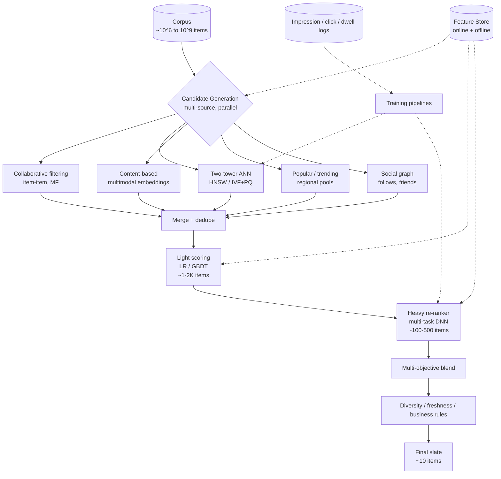
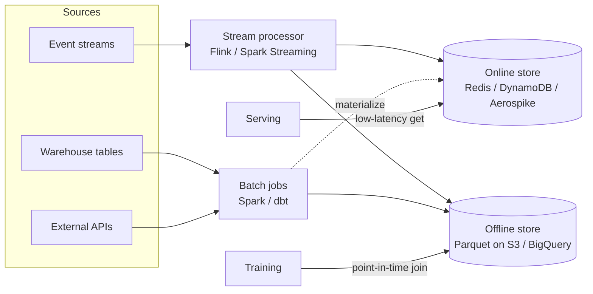
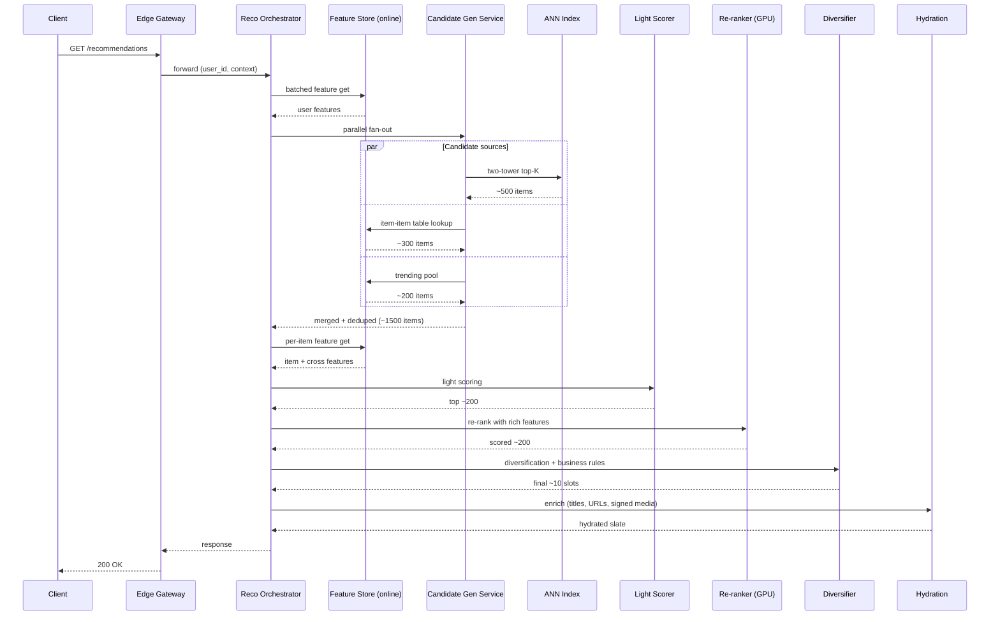

# Recommendation Systems Architecture — Candidate Generation, Scoring, Re-ranking, and Two-Tower Models

**Date:** 2026-05-02 | **Updated:** 2026-05-02
**Tags:** `system-design` `ai-ml` `recommendations` `ranking` `ml-systems`

## Table of Contents

- [Summary](#summary)
- [Overview — The Funnel Is the Architecture](#overview--the-funnel-is-the-architecture)
- [Why a Funnel — Cost Curves and Latency Budgets](#why-a-funnel--cost-curves-and-latency-budgets)
- [Candidate Generation Strategies](#candidate-generation-strategies)
  - [Collaborative Filtering — Item-Item and Matrix Factorization](#collaborative-filtering--item-item-and-matrix-factorization)
  - [Embedding-Based ANN Retrieval](#embedding-based-ann-retrieval)
  - [Content-Based Retrieval](#content-based-retrieval)
  - [Popular and Trending Pools](#popular-and-trending-pools)
  - [Social-Graph Retrieval](#social-graph-retrieval)
- [The Two-Tower Model](#the-two-tower-model)
- [Light Scoring Layer](#light-scoring-layer)
- [Re-ranking with Cross-Encoder DNN](#re-ranking-with-cross-encoder-dnn)
- [Multi-Objective Optimization](#multi-objective-optimization)
- [Feature Stores — Online and Offline](#feature-stores--online-and-offline)
- [Real-Time vs Batch Features](#real-time-vs-batch-features)
- [Cold Start — New Users, New Items, Bandits](#cold-start--new-users-new-items-bandits)
- [Diversity, Freshness, Novelty](#diversity-freshness-novelty)
- [Position Bias and Counterfactual Evaluation](#position-bias-and-counterfactual-evaluation)
- [A/B Testing Infrastructure](#ab-testing-infrastructure)
- [Privacy — DP, Federated Learning, On-Device](#privacy--dp-federated-learning-on-device)
- [Production Patterns at YouTube, Netflix, Pinterest, TikTok](#production-patterns-at-youtube-netflix-pinterest-tiktok)
- [Serving Stack — End-to-End Path](#serving-stack--end-to-end-path)
- [Logging for Training](#logging-for-training)
- [Anti-Patterns](#anti-patterns)
- [Related](#related)
- [References](#references)

## Summary

A modern recommendation system is not a single model — it is a **multi-stage funnel** that narrows millions of candidate items down to a personalized list of ~10 in roughly a hundred milliseconds. The architecture has stabilized across the industry into the same shape: cheap, multi-source **candidate generation** (recall over precision), an optional **light scoring** stage that prunes a few thousand candidates to a few hundred, a heavy **re-ranking** stage built around a multi-task cross-encoder DNN (precision over recall), and a final **diversification / business-rules** layer that satisfies hard constraints and soft objectives before returning the slate.

The two-tower model is the workhorse of candidate generation at large corpus sizes — independent user and item encoders share a dot-product space so item embeddings can be precomputed offline and indexed in an ANN structure (HNSW, IVF, IVF+PQ), while the user tower runs online to produce a query vector. The re-ranking stage layers cross-features and rich context the towers cannot see, often with multi-task heads predicting CTR, watch time, like rate, share rate, and skip — combined into a final score via a tunable linear blend or a constrained-optimization objective.

Around the model sit the systems that make the model possible: a feature store with separate offline (warehouse) and online (low-latency KV) tiers, a streaming pipeline that keeps online features minute-fresh, a logging pipeline that captures impressions, clicks, and dwell time as training labels, an A/B testing harness that drives every change, and counterfactual evaluation tooling (IPS estimators) that lets the team reason about offline replays despite position bias. Privacy is increasingly a first-class concern — differential privacy on training data, federated learning for on-device personalization, and careful handling of user features.

This doc maps the foundational architecture. Concrete case studies that exercise it live in [`../case-studies/social-media/tiktok/for-you-page.md`](../case-studies/social-media/tiktok/for-you-page.md), [`../case-studies/media-streaming/netflix/recommendation-system.md`](../case-studies/media-streaming/netflix/recommendation-system.md), and [`../case-studies/e-commerce/amazon-ecommerce/recommendation-pipeline.md`](../case-studies/e-commerce/amazon-ecommerce/recommendation-pipeline.md).

## Overview — The Funnel Is the Architecture



A few architectural properties recur:

- **Each stage has its own metric.** Candidate generation is judged on recall@K. Heavy re-ranking is judged on calibrated precision and on the multi-task objective. The diversification layer is judged on slate-level constraints. Optimizing the wrong metric at the wrong stage is the most common newcomer mistake.
- **Each stage has its own latency budget.** Candidate generation is bounded by the slowest source running in parallel. Re-ranking is bounded by GPU forward-pass cost on a fixed-size pool. Total budget is roughly 100–200 ms p99 for consumer products.
- **Stages share a feature store.** Both online (request-time KV lookups) and offline (training set materialization) traffic hit the same feature definitions. Skew between online and offline features is one of the top reasons production models underperform their offline metrics.
- **Stages share a training pipeline.** Impression and engagement logs feed the encoders, the towers, the rankers, and the calibrators — but with different label horizons and weighting schemes per stage.

## Why a Funnel — Cost Curves and Latency Budgets

The math is unforgiving. A modern cross-encoder ranker with rich features and dozens of embedding lookups costs single-digit milliseconds per item on a GPU. At a 100 ms total budget, you can score on the order of a few thousand items per request — not millions. So the system **must prune cheaply first, score richly second**.

| Stage | Items | Per-item cost | Total cost | Goal |
|-------|-------|--------------|-----------|------|
| Corpus | 10^6 – 10^9 | — | — | universe |
| Candidate generation | 10^3 – 10^4 | sub-microsecond (ANN), microseconds (CF) | tens of ms | recall |
| Light scoring | 10^2 – 10^3 | tens of microseconds | a few ms | prune |
| Heavy re-ranker | 10^1 – 10^2 | single-digit ms (GPU batch) | tens of ms | precision |
| Diversification | 10^1 | microseconds | sub-ms | constraints |

The same shape underpins YouTube (Covington 2016), Netflix Home rows, Instagram Explore, Pinterest Home, Amazon item-page recommendations, and most large-scale recommenders. The numbers shift — Pinterest serves tens of items per page at sub-300 ms; Netflix builds row-by-row carousels with their own per-row recall stage — but the funnel is universal.

A useful framing: **the funnel is a cost-amortization strategy**. Expensive computation is reserved for the small subset of items that survived cheap pruning; cheap computation runs over the corpus to ensure no good item is missed. Skipping any stage either blows the latency budget (if you skip pruning) or starves the heavy ranker of a good candidate set (if you skip generation).

## Candidate Generation Strategies

A production system runs **multiple candidate generators in parallel** and merges their outputs. The generators are complementary, each covering a different failure mode of the others. Adding a sixth generator costs a few merge-stage milliseconds but no wall-clock time (the fan-out is bounded by the slowest source).

### Collaborative Filtering — Item-Item and Matrix Factorization

The classical foundation. Build a sparse user×item interaction matrix; learn or precompute relationships.

**Item-item collaborative filtering.** For each item, precompute a top-K list of items most frequently co-engaged within a session (Linden, Smith, York 2003 — the original Amazon paper). Serving is O(1): look up the user's recent items, fetch their item-item neighbors, dedupe, return. Cheap, robust, and surprisingly competitive for "more like the last thing you engaged with."

**Matrix factorization (Funk, Koren et al.).** Factor the interaction matrix into low-rank user and item latent vectors; serve via dot product. Variants include:

- **Funk SVD** — gradient-descent factorization, popularized by the Netflix Prize.
- **Implicit ALS (Hu, Koren, Volinsky 2008)** — treats every observed interaction as a positive with a confidence weight (longer dwell → higher weight) and unobserved pairs as weak negatives. Better fit for implicit-feedback signals than explicit-rating SVD.
- **Bayesian Personalized Ranking (BPR)** — pairwise ranking loss over (user, positive, sampled negative) triples.

Strengths:

- Cheap to compute and to serve.
- Captures cross-cluster patterns that pure content similarity misses (the "diapers and beer" story).
- Robust once a user has a few interactions.

Weaknesses:

- **Cold-start fails for both new users and new items** — there are no rows or columns to factor against.
- **Popularity bias** — latent factors gravitate toward globally popular items.
- Static factor models lag real-time trends.

In modern systems, collaborative filtering is one generator among several, often as the item-item table for "more like recent X" use cases.

### Embedding-Based ANN Retrieval

The dominant primary generator at large corpus sizes. Items are encoded into a dense vector space; users are encoded into the same space; retrieval is approximate nearest neighbor in that space. The encoders are usually the two halves of a two-tower model (next section).

**ANN algorithms in production:**

- **HNSW (Hierarchical Navigable Small World)** — Malkov & Yashunin 2016. Multi-layer proximity graph, O(log N) average search, strong recall at low latency. Tunable `efSearch` for recall vs cost. The default for in-memory indexes.
- **IVF (Inverted File)** — Voronoi partitioning via k-means; query probes the closest `nprobe` cells. Cheaper memory than HNSW; tunable `nprobe`.
- **IVF + PQ (Product Quantization)** — compress vectors via per-subspace codebooks. Massive memory reduction at small recall cost. Used when the corpus exceeds RAM.
- **DiskANN-style SSD-resident indexes** — for billion-scale long tails where in-memory cost is prohibitive.

Operational reality: a billion-scale index is sharded across many machines. The query is fanned out, partial top-Ks are merged at the coordinator. Recall is deliberately tuned below 100% — the downstream re-ranker corrects for retrieval miss, and chasing the last few percent of recall costs disproportionate latency.

For the storage layer underneath ANN serving, see [`./vector-databases-and-semantic-search.md`](./vector-databases-and-semantic-search.md).

### Content-Based Retrieval

For each item, derive an embedding from its content — title, description, image, video frames, audio. For media items, this is a multimodal encoder (CLIP-style image+text tower; audio encoder; fusion head). For e-commerce items, this is a structured encoder over title + bullets + image + category. For each user, derive an interest embedding from the content embeddings of recently engaged items.

Strengths:

- **Solves cold-start for items.** A brand-new item has a content embedding immediately, no engagement history needed.
- Discovers content with no graph signal — the TikTok superpower.
- Robust to long-tail content, assuming the encoder generalizes.

Weaknesses:

- Encoder quality is the ceiling. Bad embeddings → bad retrieval, regardless of the ranker.
- Multimodal training is expensive and slow to refresh.
- Risks topical filter bubbles when used alone.

### Popular and Trending Pools

A precomputed list of currently popular items, segmented by region, language, category, and (sometimes) time-of-day. Refreshed by a streaming aggregator every few minutes. Strengths:

- Always available, no personalization required — works for brand-new users.
- Captures real-time trends faster than personalized models can adapt.
- Cheap to serve (Redis/Aerospike list lookup).

Weaknesses:

- Not personalized.
- Reinforces popularity bias if it dominates the candidate mix.

A small fraction (5–15%) of the candidate pool from the trending source is usually enough for the cold-start safety net without crowding out personalized recall.

### Social-Graph Retrieval

For products with a meaningful follow / friend graph (LinkedIn, Facebook, Twitter, Instagram), traverse the graph for items recently engaged by people in the user's neighborhood. Strengths:

- Strong intent signal — users care about their friends' activity.
- Privacy-friendly framing (the user explicitly opted into seeing this graph).

Weaknesses:

- Sparse for low-graph users.
- Echo-chamber risk when used as the dominant source.
- Heavy graph traversal at request time — usually precomputed as "top items engaged by my N closest neighbors" and refreshed periodically.

## The Two-Tower Model

The architecture that made large-scale embedding retrieval feasible. Originally popularized by Covington et al. (Deep Neural Networks for YouTube Recommendations, RecSys 2016) and extended by Yi et al. (Sampling-Bias-Corrected Neural Modeling, RecSys 2019).

```text
       User features              Item features
   (ID, recent actions,        (content embedding,
    geo, device, lang, ...)      tags, creator, ...)
            │                            │
            ▼                            ▼
       ┌─────────┐                  ┌─────────┐
       │  User   │                  │  Item   │
       │ Tower   │                  │ Tower   │
       │  (DNN)  │                  │  (DNN)  │
       └────┬────┘                  └────┬────┘
            │                            │
        u_emb (d-dim)                i_emb (d-dim)
            │                            │
            └────────── dot ─────────────┘
                         │
                       score
```

**Training.** Joint training with implicit-feedback labels — engaged items as positives, sampled non-engagements as negatives. The Yi et al. paper's contribution is the **sampling-bias correction** for in-batch negatives: when negatives are drawn from the same minibatch, their selection probability is proportional to popularity, which biases the loss toward unpopular items. The fix is a `log Q` correction term in the softmax denominator.

**Serving.** The decoupling that makes this scale:

- The **item tower runs offline** over the entire corpus, producing one embedding per item. The output is shipped into an ANN index.
- The **user tower runs online** at request time, conditioned on the user's current features. Its output is the query vector.
- Retrieval is a top-K dot-product against the ANN index — no per-item neural forward pass needed at request time.

**Why both towers must be independent.** If the model uses cross-features (user × item interactions) inside the encoder, you can no longer precompute item embeddings — every (user, item) pair would need a fresh forward pass. The whole point of two-tower is that **cross-features are deferred to the re-ranker**, where they can be computed against a pruned candidate set.

**Practical extensions:**

- **Multiple negatives per positive.** In-batch negatives are cheap; explicit negatives (skips, dwell-too-short) are signal-rich.
- **Mixed negative sampling.** Combine in-batch negatives with random uniform negatives to balance the easy/hard distribution.
- **Sequence-aware user tower.** Encode the user's recent N actions with a transformer or GRU rather than a bag-of-actions, capturing order-of-engagement signal.

The two-tower paradigm has spread far beyond recommendations — semantic search, RAG retrieval, ad targeting, fraud signals all use the same shape.

## Light Scoring Layer

Optional but increasingly common. Between the merged candidate pool (a few thousand items) and the heavy re-ranker (a few hundred), a **cheap second-pass scorer** prunes further. Typical implementations:

- **Logistic regression** with a few hundred hand-engineered features — fast, calibrated, easy to debug.
- **Gradient-boosted decision trees (LightGBM, XGBoost)** — strong feature interactions, excellent on tabular features, single-digit-microsecond inference per item.
- **A small DNN** without expensive embedding lookups — purely on counters and dense features.

Why insert a light layer between candidate generation and heavy re-ranking?

- The two-tower retrieval score is calibrated for recall at the corpus level, not for fine-grained ordering. A second pass with a different feature set produces a sharper top-K.
- The heavy re-ranker has a fixed-size budget. Feeding it 200 items selected by a smarter pre-scorer outperforms feeding it the raw top-1000 from ANN.
- Counters and recency features (hourly trending, last-N-minutes engagement) refresh at minute scale and update light-scorer outputs faster than retraining a deep model.

The light layer is sometimes called "early ranking," "first-stage ranker," or "pre-ranker" depending on the team's vocabulary. The principle is the same: cheaper than the final ranker, sharper than the candidate generator.

## Re-ranking with Cross-Encoder DNN

The heavy stage where rich features and deep architectures earn their cost. Inputs are concatenated into a wide feature vector:

- **User features.** Dense embedding from the user tower; sparse IDs of recent N actions; geo; language; device class; session-time features; long-term interest profile.
- **Item features.** Content embedding; creator/seller embedding; popularity stats (windowed CTR, completion rate); freshness; language; category; tags.
- **Cross features.** `is_following(user, creator)`, `recent_actions_with_creator`, `query × item_text` BM25 / cosine, `historical_completion_in_topic`, `user_avg_dwell_for_category`. Cross features are the secret sauce — they let the model learn user-item-specific patterns the towers cannot see by construction.
- **Context features.** Time of day, day of week, surface (home vs search vs notification), slot position, request sequence number within session.

The architecture is typically a **multi-task DNN** with shared lower layers and per-objective heads:

```text
                 wide feature vector
                         │
                         ▼
               shared MLP (e.g. 4 layers)
              /     |     |     |     \
           p_click p_dwell p_like p_share ... p_skip
```

Notable variants seen in production:

- **DCN / DCN-v2 (Deep & Cross Network).** Explicit cross-feature layers stacked alongside the MLP — gives the model an inductive bias toward learning bounded-degree feature interactions that vanilla DNNs struggle to fit in finite training.
- **DIN / DIEN (Deep Interest Network / Evolution).** Attention over the user's recent interaction history conditioned on the candidate item — "for this candidate, which of your last 50 actions matter?"
- **MMoE / PLE (Multi-gate Mixture of Experts / Progressive Layered Extraction).** Expert routing per task to reduce negative transfer when objectives conflict (predicting `share` and `complete` may pull shared layers in different directions).
- **Slate-aware ranking.** Score depends on the slate context (which items will appear above this one). Pure pointwise scoring ignores the fact that diversity at the slate level affects per-position click probability.

Latency: scoring 100–500 items through a moderately deep DNN with batched GPU inference fits comfortably in 30–60 ms when the model is co-located with the feature lookups and warm in GPU memory.

## Multi-Objective Optimization

Real systems care about more than one outcome. A pure CTR maximizer drives clickbait; a pure dwell-time maximizer drives long but unengaging videos; a pure share maximizer drives outrage. The combination matters.

**Linear blend.** The simplest and most common approach:

```python
score = (w_click   * p_click
       + w_dwell   * f(p_dwell)        # often log or sqrt to compress
       + w_like    * p_like
       + w_share   * p_share
       - w_skip    * p_skip
       - w_dislike * p_dislike)
```

Weights are tuned via online A/B tests against a top-line metric (session length, retention, revenue). The weights are policy levers — leaning into virality means raising `w_share`; leaning into watch-time means raising `w_dwell`.

**Constrained optimization.** Maximize one objective subject to floors on others. Example: maximize predicted dwell time subject to CTR ≥ baseline and skip rate ≤ baseline. Implemented via Lagrangian multipliers tuned on a validation set.

**Pareto frontier.** Treat the multi-objective problem as finding the Pareto-optimal frontier of policies. Useful for offline analysis and for product discussions about trade-offs; rarely deployed directly because production needs a single ordering.

**Slate-aware ranking.** The score of an item depends on the items above it. Greedy slate construction (pick the best item conditional on already-picked items) approximates this. The Determinantal Point Process (DPP) framework formalizes it via determinants of similarity-quality kernels.

**Calibration.** Each head should output calibrated probabilities — `p_click = 0.1` should mean 10% of users actually click. Without calibration, the linear blend weights are not interpretable, and downstream systems (ad pacing, exploration budgeting) misbehave. Per-head calibration via isotonic regression on a sliding holdout is standard.

## Feature Stores — Online and Offline

A feature store solves the **online/offline skew problem**: training data and serving features are computed by the same logic, so the model's offline metrics correlate with its online performance.



**Two stores, one definition.** A feature like `user_completion_rate_7d` is defined once. The streaming pipeline writes it to the online store every few minutes; the batch pipeline writes the historical time-series to the offline store. Training reads time-correct snapshots from offline; serving reads the latest values from online.

**Point-in-time correctness.** When generating training data for a (user, item, timestamp) row, the joined feature value must be what would have been served at that timestamp — not the current value. Offline stores must support time-travel queries. This is non-negotiable; getting it wrong leaks future information into training and inflates offline metrics.

**Feature freshness.** Features have an SLO for how stale they may be. User-level engagement counters might be 1-minute fresh; item-level popularity might be 5-minute fresh; long-term user-interest embeddings might be daily-refreshed. The freshness SLO drives the choice of pipeline (stream vs micro-batch vs batch) and the online store sizing.

**Open-source ecosystem.** [Feast](https://docs.feast.dev/) is the most-used open-source feature store; Tecton (commercial) is its lineage. [Vertex AI Feature Store](https://cloud.google.com/vertex-ai/docs/featurestore), [SageMaker Feature Store](https://aws.amazon.com/sagemaker/feature-store/), and [Databricks Feature Store](https://docs.databricks.com/machine-learning/feature-store/index.html) are the cloud-native options.

## Real-Time vs Batch Features

| Feature class | Examples | Pipeline | Freshness | Where used |
|---------------|----------|----------|-----------|------------|
| Long-term user profile | Topical interests, demographic priors | Daily batch | 24 h | All stages |
| Long-term item stats | Lifetime CTR, category embeddings | Daily batch | 24 h | All stages |
| Session-level user state | Last 50 actions, current dwell pattern | Streaming | seconds–minutes | Re-ranker |
| Real-time item counters | Hourly CTR, last-N-minute completion | Streaming | minutes | Re-ranker, light scorer |
| Trending pools | Top-K items per region/lang | Streaming aggregation | 1–5 min | Candidate generator |
| Static catalog | Title, category, language | Batch | hours–days | All stages |

The split is operational: streaming pipelines are expensive and on-call-heavy, so they are reserved for features whose business value justifies the freshness. Daily batch is cheap and reliable; use it where minute-level freshness doesn't move the metric.

For the streaming layer underneath, see [`../batch-and-stream/etl-elt-and-pipelines.md`](../batch-and-stream/etl-elt-and-pipelines.md).

## Cold Start — New Users, New Items, Bandits

Two distinct problems share a name.

**New user (no interaction history).**

1. **Demographic priors.** Geo, language, device class, registration source seed a starting bias.
2. **Onboarding interest selection.** Optional but powerful — pick a few topics from a grid; seed the user embedding with a weighted average of those topic centroids.
3. **Trending fallback.** Region- and language-segmented trending pools cover the user before any personal signal exists.
4. **Aggressive exploration in session 1.** The first ~10 impressions are deliberately diverse; the system gathers signal as fast as possible.

**New item (no engagement history).**

1. **Pre-engagement features.** Content embedding, creator/seller features, language, category. Enough to seed retrieval and ranking.
2. **Freshness pool.** A small fraction (5–10%) of every recommendation slate is reserved for under-tested content. New items are shown to a few thousand users selected via ANN match plus randomization.
3. **Multi-armed bandit promotion.** If early CTR / completion rates are above a threshold, distribution expands geometrically. If signals are flat, exposure caps and the item sits in the long tail.

**Bandit / exploration techniques.**

- **Epsilon-greedy.** With probability `ε`, show a random item from a candidate pool; otherwise exploit the current best score. Simple, effective, well-understood.
- **Thompson sampling.** Maintain a Beta distribution over each arm's reward; sample from each posterior; pick the arm with the highest sample. Naturally balances exploration and exploitation as posteriors tighten.
- **UCB (Upper Confidence Bound).** Pick the arm with the highest `mean + c * sqrt(log(t) / n)`. Strong theoretical guarantees; widely deployed for trending and freshness pool decisions.
- **Contextual bandits.** Each impression has features; the policy is `π(action | context)`. LinUCB and neural contextual bandits are common; map naturally onto the recommendation problem since every request has rich context.

The exploration budget is a real cost line in the recommendation P&L — every freshness-pool slot is one that could have shown a higher-confidence item. Tune the budget via online A/B tests.

## Diversity, Freshness, Novelty

A pure score-maximizing slate falls into traps:

- **Topical monoculture** — five videos on the same subject in a row.
- **Creator monoculture** — three items from the same author.
- **Engagement-bait monoculture** — only highly viral, low-substance content.
- **Filter-bubble drift** — a single session's signal locking the user out of new topics.

Diversity is enforced as a **post-rank reranking layer** rather than baked into the score. Common techniques:

- **Maximal Marginal Relevance (MMR).** Greedily pick the next item to maximize `score - λ * max_similarity_to_already_picked`. Tunable `λ` controls the diversity-relevance trade-off.
- **Determinantal Point Processes (DPP).** Sample sets that are both high-quality and high-diversity by leveraging determinants of similarity-quality kernels.
- **Hard constraints.** No same creator within K positions; cap topic frequency per page; cap consecutive ads.
- **Exploration noise.** A small randomized fraction of slots reserved for items below the score threshold but above an exploration threshold.

**Novelty** is distinct from diversity — it's about exposing items the user has not seen before. Penalize already-impressed items (impression discounting) and de-duplicate against the user's recent impression log. Without this, the same items resurface across sessions and feel stale.

**Freshness** is a related lever — boost items uploaded within the last N hours. Implemented as a feature in the ranker (e.g., `hours_since_upload`) or as a deterministic boost in the post-rank stage.

The framing: think of the post-rank stage as a **constrained optimization** rather than a sort. The ranker produces scores; the post-rank stage produces an ordered, filtered, slot-aware list that satisfies hard constraints (geo restrictions, ad placements, frequency caps) and soft objectives (topic diversity, creator diversity, exploration).

## Position Bias and Counterfactual Evaluation

Users click items at the top of the list more often, partly because those items are better, partly because they are more visible. **Position bias** confounds the click signal: a click at position 1 is not the same evidence as a click at position 10.

**Detection.** Train a model on `click | item, user, position`; if the position coefficient is large and stable across user segments, position bias is significant (it almost always is).

**Correction at training time.**

- **Position as a feature** — include position in the input, drop it at serving time. Simple, sometimes effective, but conflates position with all the other things that depend on position.
- **Inverse propensity scoring (IPS).** Weight each training example by `1 / P(impressed at this position)`. The weights de-bias the loss. The hard part is estimating the propensities accurately.
- **Counterfactual reasoning.** Models like Bias Tower (a separate sub-network that learns position bias and is detached at serving) explicitly factor out position effects.

**Counterfactual evaluation.** Offline replay against logged data is biased — the logged data was generated by the production policy, not by the candidate policy you want to evaluate. **IPS estimators** correct for this:

```text
                    Σ  [r_i / π_log(a_i | x_i)] · π_eval(a_i | x_i)
   V_IPS(π_eval) = ───────────────────────────────────────────────
                                    N
```

Where `π_log` is the production policy's probability of taking the logged action and `π_eval` is the candidate policy's probability. Variants include self-normalized IPS (lower variance) and doubly-robust estimators (combine IPS with a learned reward model).

Counterfactual evaluation lets you compare candidate policies against historical traffic without an online A/B test — useful for quick iteration. It does not replace A/B testing; it pre-filters candidates for online evaluation.

## A/B Testing Infrastructure

Every change ships through an experiment. The infra that makes that possible:

- **Feature flags / experiment framework.** Bucket users deterministically by `hash(user_id + experiment_name) mod 100`. Each experiment has a control and one or more variants.
- **Holdout groups.** A persistent slice (often 1–5%) of users always receives the baseline. Used to measure long-term cumulative impact of all the launched experiments.
- **OEC (Overall Evaluation Criterion).** A single top-line metric that experiments are judged against — session length, 7-day retention, revenue per user, etc. Guard rails prevent gaming (a CTR win that hurts retention is rejected).
- **Stratification and CUPED.** Reduce variance by stratifying on user features known to affect the metric, or by using pre-experiment data to control for individual user baselines (CUPED — Controlled-experiment Using Pre-Experiment Data).
- **Experiment governance.** Every shipped experiment must declare its hypothesis, its sample size, its decision metric, and its guard rails before launch. After-the-fact metric shopping is the road to false discoveries.

A typical recommendations team runs hundreds of concurrent experiments. Multi-armed bandits at the experiment level (Thompson sampling over variants) accelerate iteration but require care — peeking at experiment results breaks frequentist guarantees.

## Privacy — DP, Federated Learning, On-Device

Recommendation systems consume sensitive behavioral data. Privacy controls are increasingly first-class.

**Differential privacy (DP).** Add calibrated noise during training such that the trained model's outputs are statistically indistinguishable whether or not any individual user's data was included. Implementations:

- **DP-SGD** — clip per-example gradients to a fixed L2 norm, add Gaussian noise scaled to the clipping bound. Trades off privacy budget (`ε`) against model quality.
- **PATE / DP-FTRL** — alternative DP training procedures with different privacy-utility profiles.

DP is most relevant for embedding tables and user-segment models where memorization of individuals is the concern. For feature counters that aggregate over many users, the natural aggregation provides some privacy protection without explicit DP.

**Federated learning.** Train on user devices instead of in a central server; only model updates (gradients) are uploaded. Combined with secure aggregation and DP, individual gradients are never seen in the clear. Production deployments include Gboard next-word prediction and on-device recommendation candidates.

**On-device personalization.** A small personalization layer runs on the user's device, taking the central model's predictions as input and adjusting them based on local-only signals. The local layer never leaves the device; only aggregated metrics are reported. Apple's on-device recommendation features and Google's privacy-preserving Topics API are public-facing examples.

**Data minimization.** Beyond cryptographic and statistical techniques, the most effective privacy lever is collecting less. Define a retention SLA per data type (raw event logs: 90 days; aggregated counters: 2 years); enforce automated deletion; never log fields the model doesn't need.

## Production Patterns at YouTube, Netflix, Pinterest, TikTok

The two-stage funnel is industry consensus, but the surrounding choices differ.

**YouTube (Covington et al., 2016).** The seminal public description of the two-stage architecture. Candidate generation network produces a few hundred items; ranking network scores them with rich features. Heavy lean on watch-time as the primary objective. Subscriptions and search intent are first-class signals — much richer than a typical short-video platform's follow graph. Covington's paper remains the canonical reference for the funnel shape.

**Netflix (Gomez-Uribe & Hunt, 2015).** Multi-row home page, each row a separately-ranked carousel ("Because You Watched X", "Trending Now", "Top Picks"). Candidate generation is per-row pool construction; ranking is within-row ordering plus row ordering plus artwork personalization (which thumbnail to show). Strong public engineering writing on contextual bandits, exploration, and the artwork-personalization problem. The ACM TMIS paper "The Netflix Recommender System" remains a reference for surface design and offline-online evaluation.

**Pinterest.** Heavy investment in graph signals (PinSage — graph convolutional networks over the pin/board graph). The candidate generation stage combines GNN retrieval, two-tower retrieval, and curator-graph retrieval. Re-ranking layers in MMoE for multi-task objectives (saves, clicks, repins). Pinterest engineering posts on Medium document the iterations.

**TikTok / ByteDance.** Pushes the funnel hardest on (a) multi-source candidate generation, (b) implicit-feedback labels, (c) real-time training. The Monolith paper (Liu et al., 2022) describes the parameter-server architecture with collisionless embedding tables built on Cuckoo hashing — billions of unique IDs each get their own embedding without bucket collisions. Online training as the primary mode (not batch); models refresh in minutes. See [`../case-studies/social-media/tiktok/for-you-page.md`](../case-studies/social-media/tiktok/for-you-page.md) for the full deep dive.

**Amazon (Linden, Smith, York, 2003).** The original item-item collaborative filtering paper. Still the conceptual root of "customers who bought X also bought Y." Modern Amazon recommendations layer many newer techniques on top, but the item-item table remains a cornerstone of the candidate mix. See [`../case-studies/e-commerce/amazon-ecommerce/recommendation-pipeline.md`](../case-studies/e-commerce/amazon-ecommerce/recommendation-pipeline.md).

The pattern that recurs across all of them: **two stages, multi-source candidates, multi-task ranking, implicit feedback dominant, real-time or near-real-time learning, ANN-backed retrieval over learned embeddings**. Surface-specific details (rows vs feed vs grid, watch time vs purchases vs saves) are decorations on the same skeleton.

## Serving Stack — End-to-End Path



Operational realities:

- **Co-locate hot paths.** Feature store, ranker GPUs, and orchestrator in the same datacenter and ideally same rack family. A cross-AZ hop is 1–2 ms; cross-region is fatal.
- **Time-bound every fan-out.** Each candidate generator has its own deadline; if it misses, the orchestrator proceeds without it. Tail latencies kill p99.
- **Warm caches and warm models.** Cold-starting a new ranker pod is slow; route around it via health checks and slow-start ramp.
- **Graceful degradation.** When the re-ranker is unhealthy, fall back to merged candidate pools sorted by light-scorer output. When the light scorer is also unhealthy, fall back to popularity. Better stale than empty.

## Logging for Training

Training data quality is the model quality ceiling. The serving path must log every decision precisely.

**Impression log.** Every item shown to a user, with rank position, candidate-generator source(s), score components, and the model version. This is the row-level training data for re-ranker objectives.

**Click log.** Every click event with timestamp, item, user, and surface context. Joined to impressions via `(user, item, request_id)` to produce labeled (impression, click) pairs.

**Dwell-time log.** How long the user stayed on / engaged with the clicked item. The strongest implicit signal beyond the click itself; critical for distinguishing clickbait from genuinely engaging content.

**Negative-action log.** Skips, dismissals, "not interested" feedback, dislikes. These are first-class training signals.

**Counterfactual log.** For items shown but not clicked, log the model's score and the candidate-generator source. Enables IPS-based offline evaluation.

**Feature snapshot log.** Either log the actual feature values used at serving time, or log the timestamp + feature definition so the offline pipeline can reconstruct point-in-time features. The former is bandwidth-heavy but eliminates skew; the latter requires the offline store to support time-travel queries.

**Schema discipline.** Use a schema registry (Confluent Schema Registry, Apicurio) with backwards-compatible evolution rules. Never reuse a field name with a new meaning. Breaking schema changes have caused multi-day training outages at every major recommendation system.

For the streaming infrastructure that ingests and processes this firehose, see [`../batch-and-stream/etl-elt-and-pipelines.md`](../batch-and-stream/etl-elt-and-pipelines.md).

## Anti-Patterns

- **Single-source candidate generation.** Relying on only collaborative filtering (cold-start fails) or only content-based (filter bubbles, popularity blind) is fragile. Multiple complementary sources are mandatory.
- **Treating clicks as the primary label.** Clicks are biased by position and by clickbait. Pair with dwell time, completion rate, or task-completion signals to get a clean target.
- **Brute-force nearest neighbor at request time.** Will not fit in a 100 ms budget at corpus sizes above a few million items. ANN is the only viable retrieval engine.
- **Skipping the diversification stage.** A pure score-max slate collapses into monoculture within minutes of a session.
- **One global trending pool.** Trending must be regional, language-segmented, and ideally category-aware. A single global pool is a weak fallback.
- **Batch-only training for fast-moving domains.** A 24-hour training cadence cannot keep up with hour-scale trends. Streaming or near-real-time training is necessary for short-video, news, and live-event domains.
- **Shared weights between user and item towers.** Breaks the precompute-and-ANN-serve property that makes two-tower scale. Cross-features belong in the re-ranker, not the encoder.
- **Skipping calibration.** Uncalibrated heads make the multi-objective blend uninterpretable and break downstream consumers (ad pacing, exploration budgets) that need probabilities, not just rankings.
- **Online/offline feature skew.** Computing features one way during training and another way during serving silently kills model quality. Use a feature store with a single feature definition.
- **Offline metrics without counterfactual correction.** Naive offline replay overstates a candidate policy's improvement. IPS or a doubly-robust estimator is mandatory before A/B.
- **No exploration budget.** Without a freshness pool, new content cannot accumulate signal, the creator pipeline collapses, and the corpus stagnates.
- **Caching personalized response payloads at the edge.** The slate is per-user, per-session. Cache the underlying assets — never the response itself.
- **Treating ANN recall as a primary metric.** Recall is tuned to ~90–95% deliberately. The re-ranker corrects for retrieval miss; chasing 100% recall is a latency/cost trap.
- **No fallback for ranker outage.** When the heavy ranker is unhealthy, the system must degrade to light-scorer or popularity ordering. Better stale than empty.
- **Coupling moderation, ANN refresh, and serving in one binary.** These have very different lifecycles. Bundling them invites cross-impact incidents.
- **Forgetting per-feature update rate limits in online trainers.** A single hot creator or runaway hashtag can dominate the gradient signal and pollute hot embeddings. Per-feature update caps and gradient clipping are mundane but critical.
- **Designing for the median user instead of the long tail.** Most engagement comes from the long tail of users with eclectic interests. Optimizing for the median produces a feed that feels generic to the heaviest engagers — the ones the product economics depend on.
- **Confusing position-correction with personalization.** Removing position bias from training does not personalize the model; it just stops over-rewarding top-position clicks. Personalization comes from features and the user tower, not from bias correction.
- **No holdout group.** Without a permanent control slice, you cannot measure cumulative impact of all your launched experiments. The team optimizes individual experiments forever without knowing whether the system as a whole is improving.

## Related

- [`./vector-databases-and-semantic-search.md`](./vector-databases-and-semantic-search.md) — the storage and indexing layer underneath ANN-based retrieval.
- [`../case-studies/media-streaming/netflix/recommendation-system.md`](../case-studies/media-streaming/netflix/recommendation-system.md) — multi-row carousel architecture and artwork personalization.
- [`../case-studies/social-media/tiktok/for-you-page.md`](../case-studies/social-media/tiktok/for-you-page.md) — the canonical short-video deep dive on this funnel.
- [`../case-studies/e-commerce/amazon-ecommerce/recommendation-pipeline.md`](../case-studies/e-commerce/amazon-ecommerce/recommendation-pipeline.md) — item-item collaborative filtering and e-commerce-specific patterns.
- [`../batch-and-stream/etl-elt-and-pipelines.md`](../batch-and-stream/etl-elt-and-pipelines.md) — the streaming and batch infrastructure that feeds the feature store and online trainer.

## References

- Covington, P., Adams, J., Sargin, E. *Deep Neural Networks for YouTube Recommendations.* RecSys 2016. <https://research.google/pubs/deep-neural-networks-for-youtube-recommendations/>
- Yi, X., Yang, J., Hong, L., Cheng, D., Heldt, L., Kumthekar, A., Zhao, Z., Wei, L., Chi, E. *Sampling-Bias-Corrected Neural Modeling for Large Corpus Item Recommendations.* RecSys 2019. <https://research.google/pubs/sampling-bias-corrected-neural-modeling-for-large-corpus-item-recommendations/>
- Gomez-Uribe, C. A., Hunt, N. *The Netflix Recommender System: Algorithms, Business Value, and Innovation.* ACM TMIS 2015. <https://dl.acm.org/doi/10.1145/2843948>
- Linden, G., Smith, B., York, J. *Amazon.com Recommendations: Item-to-Item Collaborative Filtering.* IEEE Internet Computing 2003. <https://www.cs.umd.edu/~samir/498/Amazon-Recommendations.pdf>
- Koren, Y., Bell, R., Volinsky, C. *Matrix Factorization Techniques for Recommender Systems.* IEEE Computer 2009. <https://datajobs.com/data-science-repo/Recommender-Systems-[Netflix].pdf>
- Hu, Y., Koren, Y., Volinsky, C. *Collaborative Filtering for Implicit Feedback Datasets.* ICDM 2008.
- Pinterest Engineering blog (recommendation systems). <https://medium.com/pinterest-engineering>
- TensorFlow Recommenders. <https://www.tensorflow.org/recommenders>
- Feast — Open-source feature store. <https://docs.feast.dev/>
- Liu, Z. et al. (ByteDance). *Monolith: Real Time Recommendation System With Collisionless Embedding Table.* arXiv 2209.07663, 2022. <https://arxiv.org/abs/2209.07663>
- Malkov, Y. A., Yashunin, D. A. *Efficient and robust approximate nearest neighbor search using Hierarchical Navigable Small World graphs.* arXiv 1603.09320, 2016. <https://arxiv.org/abs/1603.09320>
- FAISS — A library for efficient similarity search. <https://github.com/facebookresearch/faiss>
- Wang, R., Shivanna, R., Cheng, D., Jain, S., Lin, D., Hong, L., Chi, E. *DCN V2: Improved Deep & Cross Network.* WWW 2021.
- Zhou, G. et al. *Deep Interest Network for Click-Through Rate Prediction.* KDD 2018.
- Tang, H., Liu, J., Zhao, M., Gong, X. *Progressive Layered Extraction (PLE): A Novel Multi-Task Learning Model for Personalized Recommendations.* RecSys 2020.
- Joachims, T., Swaminathan, A., Schnabel, T. *Unbiased Learning-to-Rank with Biased Feedback.* WSDM 2017. (IPS estimators for ranking.)
- Kohavi, R., Tang, D., Xu, Y. *Trustworthy Online Controlled Experiments.* Cambridge University Press, 2020. (A/B testing canon.)
- Abadi, M. et al. *Deep Learning with Differential Privacy.* CCS 2016. (DP-SGD reference.)
- Bonawitz, K. et al. *Towards Federated Learning at Scale: System Design.* MLSys 2019.
