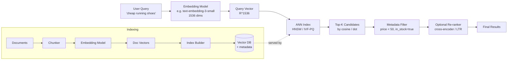
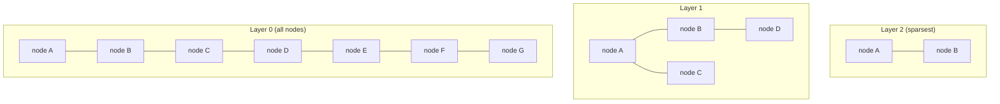
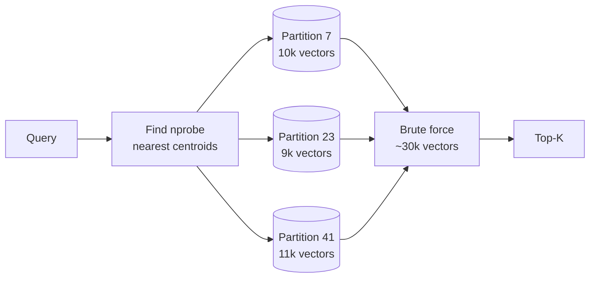
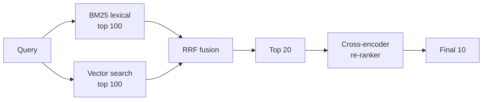

# Vector Databases and Semantic Search — HNSW, IVF-PQ, Hybrid Search, and the pgvector vs Specialized Trade-off

**Date:** 2026-05-02 | **Updated:** 2026-05-02
**Tags:** `system-design` `ai-ml` `vectors` `semantic-search` `embeddings`

## Table of Contents

- [Summary](#summary)
- [Why Vector Search Exists](#why-vector-search-exists)
- [Overview — Query → Embedding → ANN Search](#overview--query--embedding--ann-search)
- [Embedding Models and Dimensionality](#embedding-models-and-dimensionality)
- [Distance Metrics — Cosine, Dot Product, L2](#distance-metrics--cosine-dot-product-l2)
- [Exact Nearest Neighbor and Why It Doesn't Scale](#exact-nearest-neighbor-and-why-it-doesnt-scale)
- [ANN Index Families](#ann-index-families)
  - [HNSW — Hierarchical Navigable Small World](#hnsw--hierarchical-navigable-small-world)
  - [IVF — Inverted File](#ivf--inverted-file)
  - [Product Quantization (PQ, IVF-PQ, OPQ)](#product-quantization-pq-ivf-pq-opq)
  - [ScaNN, Annoy, and Friends](#scann-annoy-and-friends)
- [Hybrid Search — BM25 + Vector with RRF](#hybrid-search--bm25--vector-with-rrf)
- [Filtering — Pre-Filter vs Post-Filter and the Cardinality Trap](#filtering--pre-filter-vs-post-filter-and-the-cardinality-trap)
- [pgvector vs Specialized Vector DBs](#pgvector-vs-specialized-vector-dbs)
- [Sharding Strategy for Vector Indexes](#sharding-strategy-for-vector-indexes)
- [Recall, Latency, and Memory Trade-offs](#recall-latency-and-memory-trade-offs)
- [Update Patterns and Re-indexing](#update-patterns-and-re-indexing)
- [Embedding Versioning and Model Upgrades](#embedding-versioning-and-model-upgrades)
- [Anti-Patterns](#anti-patterns)
- [Related](#related)
- [References](#references)

## Summary

Vector search retrieves items by **semantic similarity** rather than token match. You encode each document and each query into a **high-dimensional embedding vector** with a neural model, then ask the index for the K nearest neighbors under some distance metric (cosine, dot product, or L2). Exact nearest-neighbor is O(N × d) and falls over past roughly a million vectors at low latency, so production systems use **approximate nearest-neighbor (ANN)** indexes — most often **HNSW** (a layered proximity graph) or **IVF-PQ** (coarse k-means partitioning with product-quantized residuals). The hard parts are not the algorithms — they are **picking an embedding model and committing to its dimensionality, building a hybrid pipeline that combines lexical and semantic retrieval, handling metadata filters without destroying recall, choosing pgvector vs a specialized engine based on join needs and scale, and managing the painful re-indexing whenever the embedding model changes**.

## Why Vector Search Exists

Classical search matches *tokens*. A query for `"dog food"` against a catalog containing `"canine nutrition"` returns nothing unless you've hand-curated synonyms. Lexical search is precise but recall-poor on paraphrase, semantic equivalence, multilingual queries, or anything requiring understanding rather than substring overlap.

Embedding models map text (or images, audio, code) into points in $\mathbb{R}^d$ such that **semantically similar inputs land near each other**. Two paragraphs about canine diets cluster together even when they share no tokens. The retrieval problem becomes a geometry problem: given a query vector $q$, return the K vectors in the corpus closest to $q$.

This is the foundation of:

- **Retrieval-augmented generation (RAG)** — fetch top-K relevant chunks before calling the LLM. See [RAG Architecture](./rag-architecture.md).
- **Recommendation systems** — "users who liked X" by nearest neighbors over user/item embeddings.
- **Deduplication / near-duplicate detection** — images, documents, code clones.
- **Anomaly detection** — points far from any cluster are anomalies.
- **Multi-modal retrieval** — embed text and images into the same space (CLIP) and retrieve cross-modally.

Vector search **complements** lexical search; it does not replace it. The 2024–2026 production default is hybrid retrieval (covered below).

## Overview — Query → Embedding → ANN Search

The query path: **encode → search → filter → re-rank → return**. The indexing path: **chunk → encode → store with metadata → build index**. Two pipelines, one shared embedding model. Skew between encode-at-index-time and encode-at-query-time is the same class of bug as analyzer mismatch in lexical search — same model, same version, same preprocessing.

## Embedding Models and Dimensionality

The embedding model is the single most important choice in the stack. It dictates dimensionality, language coverage, domain fit, cost per token, and whether you can run it on your own hardware.

| Model | Dim | Hosted / Local | Notes |
|---|---|---|---|
| **OpenAI `text-embedding-3-small`** | 1536 (truncatable) | Hosted | Strong baseline, cheap, supports Matryoshka truncation to 512 / 256. |
| **OpenAI `text-embedding-3-large`** | 3072 (truncatable) | Hosted | Higher quality, ~6.5x cost of `-small`. |
| **Cohere `embed-v3`** | 1024 | Hosted | Strong multilingual, classification-tuned variants. |
| **`all-MiniLM-L6-v2` (sentence-transformers)** | 384 | Local | Tiny, fast, surprisingly good for English; ubiquitous default for self-hosted. |
| **`BAAI/bge-large-en-v1.5`** | 1024 | Local | Top open-weight English embedding through 2024–2025. |
| **`E5-mistral-7b-instruct`** | 4096 | Local (heavy) | LLM-as-encoder; strong but expensive. |
| **CLIP / SigLIP** | 512–1024 | Local | Joint text + image embedding for multi-modal retrieval. |

**Dimensionality trade-off**: higher dimensions usually mean more capacity to encode nuance, but they cost linearly more memory and roughly linearly more distance-computation time. 384 vs 1536 is a 4x memory difference at corpus scale — that's the difference between a $200/month and an $800/month box.

**Matryoshka embeddings** (Kusupati et al. 2022) train the model so that the first $k$ dimensions are themselves a usable embedding. OpenAI's v3 family supports this — you can truncate 1536 → 512 with modest recall loss and 3x memory savings. Use it.

**Domain fit** beats raw benchmark numbers. A model trained on web text may underperform a smaller model fine-tuned on legal or medical text. Evaluate on your own retrieval set with **NDCG@10** or **Recall@K** before committing.

## Distance Metrics — Cosine, Dot Product, L2

Three metrics dominate, and the choice is not arbitrary — it must match how the embedding model was trained.

| Metric | Formula | When to Use |
|---|---|---|
| **Cosine similarity** | $\cos(a,b) = \frac{a \cdot b}{\|a\| \cdot \|b\|}$ | Default for normalized text embeddings; magnitude-invariant. |
| **Dot product** | $a \cdot b$ | When vectors are pre-normalized (then dot product = cosine, faster); some models train with dot. |
| **Euclidean (L2)** | $\sqrt{\sum (a_i - b_i)^2}$ | Image embeddings, geometric data, models trained with L2 loss. |

If vectors are L2-normalized (length 1), cosine and dot product are equivalent and you should use dot product because it skips the divisions. Many vector DBs auto-normalize on ingest if you tell them the metric is cosine.

**The error**: indexing with one metric and querying with another. Recall craters. Always confirm what metric the embedding model was trained for — the model card will say. OpenAI's `text-embedding-3-*` outputs are normalized; cosine and dot are equivalent.

## Exact Nearest Neighbor and Why It Doesn't Scale

**Exact NN** is brute force: compute the distance from the query to every vector, sort, return top K. Complexity is **O(N × d)** per query, with no index.

| N (vectors) | d=384 | d=1536 |
|---|---|---|
| 10,000 | < 5 ms | ~15 ms |
| 100,000 | ~40 ms | ~150 ms |
| 1,000,000 | ~400 ms | ~1500 ms |
| 10,000,000 | ~4 s | ~15 s |

These are rough single-thread CPU numbers; SIMD and GPU help by 10–50x. **Up to ~1M vectors at d=384, exact search on a modern box is fine** — and pgvector's `ivfflat`/`hnsw` plus exact fallback covers this comfortably. Past that, you need ANN.

Exact search has one virtue: **100% recall**. ANN trades recall for latency and memory. The recall-latency-memory triangle is the central trade-off of the rest of this document.

## ANN Index Families

### HNSW — Hierarchical Navigable Small World

HNSW (Malkov & Yashunin, 2016) is the dominant ANN index in production. It builds a **multi-layer proximity graph**: each vector is a node, edges connect vectors to their nearest neighbors, and higher layers contain progressively sparser sub-samples of the corpus.

**Search**: enter at a fixed top-layer node, greedily walk toward the query, descend to the next layer at the closest node, repeat. At layer 0, do a beam search with width $efSearch$ and return the K best.

**Build parameters**:

- `M` — max edges per node (typical 8–48). Higher M → better recall, more memory.
- `efConstruction` — beam width during graph construction (typical 100–400). Higher → better graph quality, slower build.
- `efSearch` — beam width at query time. Tunable per query for recall/latency trade-off.

**Strengths**:

- Excellent recall-vs-latency trade-off for in-memory workloads.
- Handles **incremental inserts well** — just add a node and link it. No periodic rebuild required for moderate write rates.
- Fine-grained tunability via `efSearch` at query time.

**Weaknesses**:

- **Memory-heavy** — the entire graph and all vectors must fit in RAM for low latency. ~1.5–2x raw vector size.
- Deletes are expensive (most implementations use tombstones; rebuild eventually).
- Build time is O(N · log N · efConstruction) — slow for billion-scale corpora.

HNSW is the default in pgvector (since 0.5.0), Qdrant, Weaviate, Elasticsearch, OpenSearch, Milvus, Faiss, and almost everything else.

### IVF — Inverted File

**IVF** (Inverted File index) partitions the vector space with **k-means clustering**: pick `nlist` centroids (typical 1k–65k), assign every vector to its nearest centroid. At query time, find the `nprobe` closest centroids and brute-force search only those partitions.

**Trade-off**: searching `nprobe / nlist` of the data. With `nlist=1024`, `nprobe=8`, you scan ~0.78% of vectors. Recall depends on whether the query's true neighbors actually live in the probed cells.

**Strengths**:

- Cheaper memory than HNSW (no graph overhead, just centroids + posting lists).
- Combines naturally with quantization (next section).
- Builds fast on large corpora.

**Weaknesses**:

- **Periodic re-clustering** when data drifts — centroids learned on the initial sample become stale as you ingest new data. Plan for `nlist` retraining.
- Recall is bumpier than HNSW; you tune `nprobe` and live with the cliff.
- Inserts go to the nearest existing centroid, not always optimal.

### Product Quantization (PQ, IVF-PQ, OPQ)

**Product Quantization** (Jégou, Douze, Schmid, TPAMI 2011) is the technique that made billion-scale vector search affordable.

The idea: split each $d$-dimensional vector into $m$ sub-vectors of $d/m$ dimensions each, then **k-means quantize each sub-vector independently** into one of $k$ codewords (typically $k=256$ so each code fits in a byte).

A 1536-dim float32 vector occupies **6144 bytes**. With PQ at $m=96$, $k=256$, it becomes **96 bytes** — a **64x compression**. Distance to a query is computed via lookup tables, often faster than full float arithmetic.

| Variant | What it Does |
|---|---|
| **PQ** | Split + quantize sub-vectors independently. |
| **OPQ (Optimized PQ)** | Apply a learned rotation before splitting so that sub-spaces are decorrelated. Better recall at the same compression. |
| **SQ (Scalar Quantization)** | Quantize each dimension independently to int8 / int4. ~4x compression, easier and faster than PQ. |
| **IVF-PQ** | Combine IVF coarse partitioning with PQ-compressed residuals inside each cell. The standard recipe for billion-scale corpora. |
| **Binary quantization** | One bit per dimension. Massive compression, big recall hit; useful as a coarse first stage. |

**Recall cost**: PQ is lossy. Expect 5–15% Recall@10 drop vs unquantized HNSW at typical settings. Combine with **re-ranking the top-N candidates against full vectors** to recover most of it.

Faiss is the canonical PQ / IVF-PQ implementation; Milvus and Qdrant expose it; pgvector does not (as of 2026 it ships HNSW + IVFFlat without PQ).

### ScaNN, Annoy, and Friends

| Index | Origin | Notes |
|---|---|---|
| **ScaNN** | Google Research | Anisotropic quantization + IVF + reranking. State-of-the-art recall/latency on the ANN-Benchmarks for many datasets. |
| **Annoy** | Spotify | Random-projection forest of binary trees. Static; rebuild on changes. Used heavily in recommendations. |
| **Faiss** | Meta | Library of indexes (IVF, IVF-PQ, HNSW, GPU variants). The reference implementation many engines wrap. |
| **NSG / DiskANN** | Microsoft | Disk-resident graph index for billion-scale on a single SSD-equipped box. Powers Bing. |
| **SPANN** | Microsoft | Hybrid memory + disk; centroids in RAM, posting lists on SSD. |

For most teams in 2026, **HNSW for in-memory**, **IVF-PQ for compressed billion-scale**, and **DiskANN/SPANN for "I have one big box and one billion vectors"** is the entire decision tree.

## Hybrid Search — BM25 + Vector with RRF

Pure vector search loses on:

- **Exact identifiers** — SKUs, model numbers, person names. `"iPhone 15 Pro Max 256GB"` becomes a fuzzy semantic blob; lexical match nails it.
- **Rare terms** — terms with strong signal but low frequency, where the embedding model under-trained.
- **Multi-token boolean queries** — `"acetaminophen NOT ibuprofen"` is a token-level concept.

Pure lexical search loses on paraphrase, synonyms, and cross-lingual.

**Hybrid search** runs both, then fuses. The standard fusion is **Reciprocal Rank Fusion (RRF)**:

$$
\text{RRF}(d) = \sum_{r \in \text{rankers}} \frac{1}{k + r(d)}
$$

where $r(d)$ is the rank of document $d$ in a given ranker's list and $k \approx 60$ is a smoothing constant. RRF is **score-free** — it only uses ranks, so it sidesteps the headache of normalizing BM25 scores against cosine similarities.

**Alternatives to RRF**:

- **Weighted score fusion** — `final = α · normalize(bm25) + (1−α) · normalize(cosine)`. Requires per-corpus tuning of α.
- **Learned re-ranking** — feed the top-N from each ranker into a cross-encoder (e.g. `bge-reranker-large`) that scores each `(query, doc)` pair jointly. Slow per query but small N (20–100), so still under 100 ms.
- **ColBERT-style late interaction** — token-level vectors, MaxSim aggregation. Higher quality, much higher index size.

Elasticsearch, OpenSearch, Weaviate, Vespa, and Qdrant all ship RRF natively. See also the [Search Systems](../building-blocks/search-systems.md) doc for the BM25 side of the picture.

## Filtering — Pre-Filter vs Post-Filter and the Cardinality Trap

Real queries carry metadata constraints: `price < 50 AND in_stock = true AND category = 'shoes'`. Where you apply the filter is a load-bearing decision.

| Strategy | How it Works | Failure Mode |
|---|---|---|
| **Post-filter** | Run ANN, get top K, drop results that fail the filter. | If filter is selective (rare), you keep almost nothing — recall collapses. |
| **Pre-filter** | Apply filter first, then ANN over the filtered set. | If the filter set is huge, you've thrown away the index's organization and may degrade to exact search. |
| **Filtered HNSW** | The graph traversal itself respects the filter — only walk to nodes that pass. | Standard implementation in modern engines; degrades when the filter is *very* selective (graph has few legal paths). |

**The cardinality trap**: imagine a corpus of 10M vectors and a filter that admits 0.01% (1000 vectors). Post-filter on top-100 ANN results returns ~0 matches. Pre-filter sounds fine — until you realize the 1000 surviving vectors are scattered through the HNSW graph and the filtered traversal can't navigate efficiently. At very low filter cardinality, **exact brute-force over the filtered set is the right answer** — and good engines automatically choose it.

**Rules of thumb**:

- Filter cardinality > 10% of corpus → filtered HNSW / pre-filter is fine.
- Filter cardinality < 1% → consider exact search over the filtered set, or shard by the filter dimension (one tenant per shard, etc.).
- Filter cardinality between 1–10% → measure. This is the messy middle.

Engines differ wildly in filtering quality. Qdrant and Weaviate are strong; older pgvector versions (pre-0.7) post-filter and lose recall hard; Pinecone's filtered queries have well-documented failure modes at low cardinality.

## pgvector vs Specialized Vector DBs

The single biggest architectural decision: **do you put vectors in your existing Postgres or run a separate vector engine?**

### When pgvector wins

- **You need SQL joins between vectors and other data.** `JOIN` the vector match to `users`, `orders`, `permissions` in one query. Specialized vector DBs require you to materialize joins client-side.
- **Transactional consistency matters.** A document insert and its vector indexing happen in the same transaction. No CDC pipeline, no eventual-consistency window.
- **Scale is < 10–50M vectors at d ≤ 1536.** pgvector with HNSW is well within Postgres limits here.
- **You already operate Postgres.** One fewer system, one fewer on-call rotation, one fewer backup story.
- **Permissions / RLS apply to vector data.** Postgres row-level security composes naturally; specialized DBs reinvent it.

### When specialized engines win

- **Scale exceeds ~100M vectors** or you need IVF-PQ / DiskANN-class compression that pgvector doesn't ship.
- **Vectors are the primary access pattern**, not a supplement to relational queries.
- **You need horizontal scale-out** with sharding, replication, and rebalancing built in. pgvector inherits Postgres's single-writer ceiling.
- **You need built-in filtering with strong recall guarantees** at low cardinality.
- **Multi-tenant isolation per collection** with separate index parameters and quotas.

### The landscape

| Engine | Strengths | Weaknesses |
|---|---|---|
| **pgvector** | Postgres-native, SQL joins, transactional, simple ops | No PQ, single-writer ceiling, replication is Postgres replication |
| **Pinecone** | Fully managed, scales to billions, simple API, low ops | Hosted-only, expensive, vendor lock-in, opaque internals |
| **Weaviate** | Open source, hybrid search built in, GraphQL, modular | Heavier to operate, schema-first |
| **Milvus** | Distributed, billion-scale, GPU acceleration, IVF-PQ | Complex topology (proxy, query node, index node, data node, coordinator) |
| **Qdrant** | Rust, fast, strong filtering, open source | Smaller ecosystem than ES/Weaviate |
| **Chroma** | Dead-simple Python-first DX, embedded mode | Not for production multi-node scale |
| **Vespa** | Yahoo-grade, ranking + vector + lexical in one engine | Steep learning curve |
| **Elasticsearch / OpenSearch** | Reuse existing search cluster, hybrid native | Heavyweight if you don't already run it |

**Pragmatic default**: start with pgvector. Move to a specialized engine when you hit a concrete pgvector limit you can name (corpus size, write rate, missing PQ, missing tenant isolation). Do not pre-optimize for billions of vectors you don't have.

## Sharding Strategy for Vector Indexes

Once a single node can't hold the index, you shard. Three strategies:

| Strategy | How | Trade-off |
|---|---|---|
| **Random sharding** | `shard = hash(id) % N`. Each shard holds a subset; queries fan out, top-K per shard, merge. | Simple. All shards always queried — full fan-out tax on every query. |
| **Tenant / category sharding** | `shard = hash(tenant_id) % N`. All of tenant X's vectors on one shard. | Tenant queries hit one shard. Cross-tenant queries fan out. |
| **Centroid sharding (geometric)** | Cluster the corpus, route each vector to the shard owning its centroid. Queries route to nearest shard centroids. | Locality-aware: hot regions of the space cluster together. Hard to rebalance as data drifts. |

**Replica fan-out and gather**: with random sharding and N shards, every query hits N shards in parallel and merges top-K results. Tail latency becomes max of N shard latencies — the classic [scatter-gather problem](../scalability/sharding-strategies.md). Mitigate with hedged requests and per-shard caches.

**Replication**: vector indexes are usually **read-replicated** for throughput, not for strong consistency. Most engines build the index once on a primary and ship the immutable artifact to replicas, the way Lucene segments propagate.

## Recall, Latency, and Memory Trade-offs

Three knobs. You optimize two and accept the third.

| Goal | Lever | Cost |
|---|---|---|
| **Higher recall** | More HNSW edges (M↑), wider beam (efSearch↑), more IVF probes (nprobe↑), unquantized vectors | More memory, more CPU per query |
| **Lower latency** | Smaller efSearch, fewer probes, lighter quantization, more replicas | Lower recall and/or higher memory cost |
| **Lower memory** | Aggressive quantization (PQ, SQ, binary), lower dimensions (Matryoshka truncation) | Recall loss; sometimes latency improves due to cache effects |

**Measure with Recall@K**: out of the K results returned, how many are also in the true (exact) top K? Recall@10 of 0.95 means 9.5 of the top 10 ground-truth neighbors are recovered on average.

**Latency targets**: a serving SLO of p95 < 50 ms for ANN over 100M vectors is achievable with HNSW + sufficient RAM, harder with IVF-PQ. RAG pipelines that call an LLM after retrieval have headroom — 100–200 ms ANN latency is fine when the LLM call costs 2 seconds.

**Re-ranking is the cheat code**: retrieve top-100 with cheap quantized ANN, then re-score with full vectors or a cross-encoder. You get the recall of the slow-but-accurate path at the latency of the fast-but-lossy path, modulo the small re-ranker cost.

## Update Patterns and Re-indexing

Indexes have very different relationships with mutation.

| Index | Insert | Delete | Update |
|---|---|---|---|
| **HNSW** | Fine — link new node, cheap | Tombstone, periodic rebuild | Delete + insert |
| **IVF / IVF-PQ** | Assign to nearest existing centroid; cluster drift accumulates | Tombstone, periodic rebuild | Delete + insert |
| **Annoy / static trees** | Not supported in place — full rebuild | Same | Full rebuild |
| **DiskANN** | Supported but more expensive than HNSW | Tombstone | Delete + insert |

**Soft deletes and tombstones**: most engines mark deleted IDs and skip them during search. Compaction (rebuilding the segment without the tombstones) happens periodically — Lucene-style. If your delete rate is high, watch tombstone bloat.

**IVF re-clustering**: IVF centroids are learned from a sample of the data at index time. As the corpus drifts, centroids stop reflecting the distribution and recall drops. Schedule periodic retraining (weekly / monthly depending on drift) — this is invisible operational debt that bites teams who treat IVF as fire-and-forget.

**Bulk loads**: rebuild from scratch is often faster than incremental. For large reindexes, build offline and atomically swap collections / aliases — same playbook as Elasticsearch reindexing in [Search Systems](../building-blocks/search-systems.md).

## Embedding Versioning and Model Upgrades

The most under-discussed operational pain in vector search.

You launched with `text-embedding-ada-002` (1536d) in 2023. OpenAI released `text-embedding-3-large` (3072d) in 2024. The new model is better. You want to migrate.

**You cannot mix vectors from different models in the same index.** They live in different geometric spaces — distances are meaningless across them. Every existing vector must be re-embedded.

For 100M documents at $0.13 / 1M tokens × ~250 tokens per doc, that's ~$3,250 in OpenAI fees — and probably weeks of time given rate limits, plus the storage to hold both versions during cutover.

**Migration playbook**:

1. **Tag every stored vector with `embedding_model_version`.** From day one. This is non-negotiable.
2. **Re-embed in the background** with a new model version, write to a new index / collection.
3. **Dual-read** during transition: query both, fuse with RRF, prefer the new index as recall improves.
4. **Cut over** when the new index is fully populated and quality is verified on your eval set.
5. **Drop the old index.**

Costs:

- **Re-embedding cost** — money + time, often the bottleneck.
- **Storage doubling** during cutover.
- **Downstream quality regression** — the new model isn't strictly better on every query class. Measure with a held-out eval set before promoting.

**Implication for model choice**: pick a model you can live with for 1–2 years. Aggressively swapping models because each new release is "5% better on MTEB" is a path to perpetual re-embedding bills. Anchor on stable hosted families (OpenAI v3, Cohere v3) or stable open-weight models (`bge-large-en-v1.5`).

## Anti-Patterns

1. **Vector-only retrieval for catalog / e-commerce.** SKUs, brand names, exact identifiers vanish in semantic space. Always hybrid.
2. **Mismatched metric.** Indexing with cosine, querying with L2 (or vice versa) silently destroys recall. Confirm the model's training metric.
3. **Treating the vector DB as the system of record.** It's a derived projection, like the search index. The source of truth lives in your primary database; you must be able to rebuild the vector index from raw documents.
4. **Skipping `embedding_model_version` on stored vectors.** Future-you will not know which vectors came from which model, and you will pay for it during the next migration.
5. **Re-embedding the entire corpus on every model release.** Pin a version. Re-embed deliberately, not reflexively.
6. **Post-filtering when filter cardinality is low.** Recall collapses to near zero. Use pre-filter or filtered HNSW; fall back to exact search at very low cardinality.
7. **HNSW with too-small M / efConstruction at build time.** You can tune `efSearch` at query time, but you cannot fix a poorly-built graph without rebuilding.
8. **Over-quantizing without re-ranking.** Binary quantization is appealing; raw recall is unusable. Re-rank top-100 with full vectors to recover.
9. **Indexing an entire 50-page document as one vector.** The embedding becomes a meaningless average. Chunk thoughtfully (500–1500 tokens, with overlap). See [RAG Architecture](./rag-architecture.md).
10. **Ignoring IVF re-clustering.** Centroids drift, recall silently degrades. Schedule retraining.
11. **Not measuring with Recall@K on a real eval set.** "It feels right" is not a benchmark. Build a labeled retrieval eval set early.
12. **Choosing a specialized vector DB before measuring whether pgvector suffices.** Premature complexity. Most teams under 50M vectors do not need a separate engine.
13. **Storing the full document text in the vector DB.** Store an ID and minimal metadata; rehydrate from the primary store. Keeps the index small and avoids dual-source-of-truth on document content.
14. **Same vector dimension across all collections "for consistency."** Different domains may benefit from different models with different dimensionalities. Don't constrain unnecessarily.

## Related

- [RAG Architecture](./rag-architecture.md) — vector retrieval is the *R* in RAG; this doc focuses on the retrieval substrate, RAG covers chunking, prompt assembly, and grounding.
- [LLM Inference Serving](./llm-inference-serving.md) — the LLM that consumes retrieved vectors; latency and cost trade-offs at the generation step.
- [Search Systems](../building-blocks/search-systems.md) — lexical / inverted-index search; the BM25 side of hybrid retrieval and the conceptual sibling of vector indexes.
- [Databases as a Component](../building-blocks/databases-as-a-component.md) — when to add a specialized store vs extend Postgres; the framing applies directly to pgvector vs Pinecone.
- [Sharding Strategies](../scalability/sharding-strategies.md) — random / range / tenant sharding generalizes to vector indexes; scatter-gather and tail-latency patterns are shared.

## References

- Malkov, Yu. A. & Yashunin, D. A. — *Efficient and robust approximate nearest neighbor search using Hierarchical Navigable Small World graphs* (2016). https://arxiv.org/abs/1603.09320 — the canonical HNSW paper; read for the layered graph construction and search proofs.
- Jégou, H., Douze, M. & Schmid, C. — *Product Quantization for Nearest Neighbor Search* (TPAMI 2011). https://hal.inria.fr/inria-00514462v2/document — the foundational PQ paper; everything IVF-PQ / OPQ extends from here.
- Faiss (Meta AI Research). https://github.com/facebookresearch/faiss — the reference C++/Python library for IVF, IVF-PQ, HNSW, and GPU variants. Wiki and tutorials are excellent.
- pgvector. https://github.com/pgvector/pgvector — Postgres extension for vector storage, exact search, IVFFlat, and HNSW indexes.
- Pinecone Documentation. https://docs.pinecone.io/ — managed vector DB; useful for understanding hosted-vector-DB ergonomics and pricing models.
- Weaviate Documentation. https://weaviate.io/developers/weaviate — open-source vector engine with hybrid search, modules, and GraphQL.
- Milvus Documentation. https://milvus.io/docs — distributed vector DB targeting billion-scale; rich documentation on IVF, IVF-PQ, DiskANN.
- ScaNN (Google Research). https://github.com/google-research/google-research/tree/master/scann — anisotropic-vector-quantization-based ANN library; strong on ANN-Benchmarks.
- BM25 / Okapi BM25 (Wikipedia). https://en.wikipedia.org/wiki/Okapi_BM25 — survey-grade reference for the lexical side of hybrid retrieval.
- Cormack, Clarke & Büttcher — *Reciprocal Rank Fusion outperforms Condorcet and individual Rank Learning Methods* (SIGIR 2009). The RRF paper; widely cited in hybrid-search literature.
- ANN-Benchmarks. https://ann-benchmarks.com/ — third-party benchmark of ANN libraries on standard datasets; the right place to sanity-check claims.
