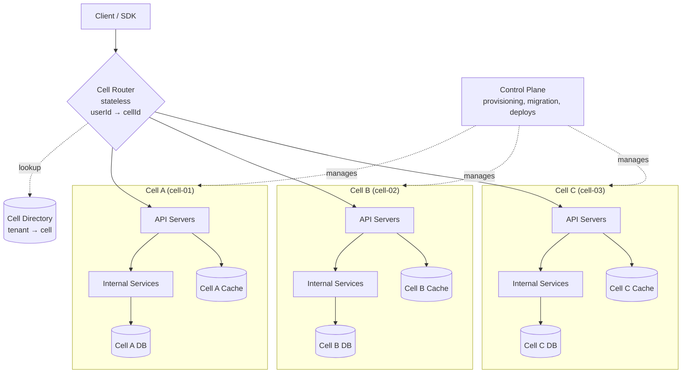

# Cell-Based Architecture — Containing Blast Radius with Pods, Cells, and Stateless Routing

**Date:** 2026-05-02 | **Updated:** 2026-05-02
**Tags:** `system-design` `architecture` `cells` `blast-radius` `isolation`

## Table of Contents

- [Summary](#summary)
- [Why This Matters](#why-this-matters)
- [Overview — Cells as Independent, Self-Contained Units](#overview--cells-as-independent-self-contained-units)
- [The Blast-Radius Problem at Scale](#the-blast-radius-problem-at-scale)
- [What a Cell Actually Contains](#what-a-cell-actually-contains)
- [The Stateless Cell Router](#the-stateless-cell-router)
- [Cell Sizing — How Big, How Many, How Full](#cell-sizing--how-big-how-many-how-full)
- [AWS — Cells, Shuffle-Sharding, and the Builders' Library](#aws--cells-shuffle-sharding-and-the-builders-library)
- [Slack's Cellular Migration (2023)](#slacks-cellular-migration-2023)
- [Shopify's Pods Architecture](#shopifys-pods-architecture)
- [Cell Discovery — Directory Service, DNS, Smart Client](#cell-discovery--directory-service-dns-smart-client)
- [Failure Modes — Stuck Cell, Hot Cell, Cross-Cell Drift](#failure-modes--stuck-cell-hot-cell-cross-cell-drift)
- [Cell Migration — Moving Tenants Between Cells](#cell-migration--moving-tenants-between-cells)
- [Multi-Cell Features — DMs, Search, and Fan-Out](#multi-cell-features--dms-search-and-fan-out)
- [Deployment Safety — Canary Cells, Blue-Green, Quarantine](#deployment-safety--canary-cells-blue-green-quarantine)
- [Observability — Per-Cell Dashboards and Cell-Tagged Metrics](#observability--per-cell-dashboards-and-cell-tagged-metrics)
- [Comparing to Multi-Tenant SaaS, Microservices, and Shared-Everything Monolith](#comparing-to-multi-tenant-saas-microservices-and-shared-everything-monolith)
- [Anti-Patterns](#anti-patterns)
- [Related](#related)
- [References](#references)

## Summary

A **cell** is a self-contained, independently operated unit of your service that handles a slice of users with its own infrastructure — its own database, cache, application servers, and frequently its own deployment pipeline. Cells are **isolated by design**: a failure in cell C-07 should affect only the tenants routed to C-07, not the rest of the fleet. A thin, stateless **cell router** in front of the cells maps each request (by user ID, account ID, workspace ID, or partition key) to its home cell. The architectural commitment is simple to state and hard to honor: nothing crosses cell boundaries on the hot path except routing decisions. AWS has been doing this for over a decade (Aurora storage nodes, S3, DynamoDB partitions), Slack migrated to a cellular topology in 2023, and Shopify runs the whole platform in pods. This doc covers the structural commitments — what a cell contains, how routing works, how you size cells, the failure modes, and how cells differ from microservices and from shared-everything monoliths.

## Why This Matters

When a single shared system serves every customer, every bad deploy, every slow query, every poison message, every memory leak is a company-wide outage. The blast radius of a single bug is the size of the entire customer base. As fleets grow into hundreds of millions of users, that math stops working — the expected blast radius becomes "your business" every time anyone pushes code on a Friday.

Cells flip the math. The expected blast radius of any single failure becomes **one cell's worth of users**. If you run 50 cells with even partition, a worst-case bad deploy that's caught after one cell rolls forward affects 2% of the fleet. That's the difference between a postmortem and a P0 page that wakes up the CEO. The price you pay is real: cells are operationally heavier than a single shared cluster, the routing tier becomes a critical infrastructure component, and any feature that crosses cell boundaries (cross-workspace messaging, global search, cross-account billing) needs explicit fan-out machinery.

Cell-based architecture is not microservices. Microservices decompose by **function** — auth service, billing service, search service. Cells decompose by **tenant slice** — every cell has a complete copy of every function it needs to serve its users end-to-end. You can, and most large systems do, run microservices *inside* a cell. But the cell boundary is the fault domain.

## Overview — Cells as Independent, Self-Contained Units



Three structural rules define the style:

1. **A cell is sufficient.** A single cell can serve the requests of the tenants assigned to it without depending on any other cell. No cross-cell calls on the hot path.
2. **The router is stateless and minimal.** It knows how to map a tenant to a cell and how to forward bytes. It does not hold session state, run business logic, or aggregate data across cells.
3. **The control plane is separate from the data plane.** Provisioning new cells, moving tenants between cells, rolling deploys — all of that lives in a control plane that operates *on* cells but is not in the request path. See [Control Plane vs Data Plane](./control-plane-vs-data-plane.md).

## The Blast-Radius Problem at Scale

Without cells, every shared dependency is a single point of failure for the whole product:

- A bad index migration on the shared DB locks every customer.
- A poison message in the shared queue back-pressures every consumer.
- A bug in a shared service crashes pods until every tenant feels it.
- A noisy neighbor saturating CPU degrades every other tenant's latency.
- A bad deploy rolled out fleet-wide is a fleet-wide outage in seconds.

The math gets ugly fast. If your shared system has a 99.95% monthly availability target, that's about 22 minutes of downtime budget per month. A single fleet-wide P0 typically burns more than that in a single incident. Once you cross a few hundred million users, the *probability* of at least one global incident per month approaches one — not because engineers are bad, but because the surface area of "something can break" grows with fleet size while the downtime budget stays constant.

Cells convert a single fleet-wide outage budget into N independent cell-level outages. If 1 cell of 50 has a 30-minute outage, the fleet-level availability impact is `30 minutes × (1/50) = 36 seconds` of fleet-equivalent downtime. The same incident in a shared system is the full 30 minutes for everyone. The asymmetry is enormous, and it's the core reason high-scale operators move to cells.

## What a Cell Actually Contains

A cell is a **vertical slice** of your stack, not just a database shard. The exact contents depend on the system, but the canonical inventory is:

- **API / front-door servers** scoped to that cell.
- **Application / domain services** that run the business logic for that cell's tenants.
- **Primary database** (often a Postgres or MySQL cluster, or a Vitess keyspace, or a DynamoDB partition group).
- **Cache** (Redis / Memcached) that holds only that cell's data.
- **Search indices** for that cell's documents (per-cell OpenSearch, per-cell tantivy, etc.).
- **Async workers** consuming queues that carry only that cell's events.
- **Cell-local object storage prefixes** for tenant blobs.
- **Cell-tagged metrics, logs, and traces** so observability segments cleanly.

Not every shared resource has to be cell-local. Some things are reasonable to share: identity provider primitives, public CDN edges, large global static assets, billing rollups that intentionally span tenants. The discipline is to keep the **request path** for normal user actions inside one cell. If serving a single API call requires touching three cells, you don't have cells — you have a slow distributed system pretending to.

## The Stateless Cell Router

The cell router is a thin tier in front of every cell that does one job: take a request, identify the tenant, look up the tenant's home cell in the directory, and forward.

```text
Request → extract tenantId → directory.lookup(tenantId) → cellId → forward to cellId.api
```

Properties that matter:

- **Stateless.** The router holds no session data. It can be replaced, scaled, and load-balanced freely.
- **Tiny in functionality.** Resist the urge to put business logic, authorization, or rate limiting into the router. Each of those becomes a stronger argument for keeping the router shared, which turns it into a fleet-wide single point of failure.
- **Cacheable.** The tenant→cell mapping changes rarely. The router can cache mappings locally with short TTLs and fall back to the directory on miss. Aurora-style "the lookup itself is cellularized" is also valid for very large fleets.
- **Sticky for the lifetime of a connection.** Once a connection is bound to a cell, you want it to stay there. WebSocket / long-poll / streaming connections especially benefit from cell affinity.

The choice of routing key is fundamental. Common keys:

| Key | Use case | Trade-off |
|-----|----------|-----------|
| `userId` | Consumer apps where each user is independent | Multi-user features need cross-cell fan-out |
| `accountId` / `workspaceId` / `tenantId` | B2B SaaS | Single tenant can grow large enough to dominate a cell |
| `regionId × tenantId` | Multi-region SaaS | Migration across regions becomes possible |
| `hash(key)` consistent-hash | Pure horizontal scale | Loses semantic meaning, harder to migrate manually |

Pick the key your **product features actually align with**. If your features are workspace-scoped, `workspaceId` is the right key. Routing by `userId` when 90% of features need workspace context just means every request fans out across cells, which defeats the whole architecture.

## Cell Sizing — How Big, How Many, How Full

Cell sizing is a balance between three pressures:

1. **Small enough that one bad cell is not catastrophic.** A cell holding 60% of your fleet is barely a cell.
2. **Large enough to be operationally manageable.** 10,000 cells means 10,000 deployment targets, 10,000 dashboards, 10,000 paging contexts.
3. **Full enough to be cost-efficient.** Half-empty cells multiply baseline infra cost (idle DBs, idle caches, idle compute floor) across every cell.

Common heuristics from operators of cellular systems:

- Target **1–5%** of fleet load per cell as a maximum-size policy. AWS internal services often go even smaller.
- Set a **soft cap** (start migrations) at ~70% of cell capacity, **hard cap** (refuse new tenant placements) at ~85%.
- Run **at least 10 cells per region** even at small scale, so a single bad cell is "less than 10% of the fleet" by construction.
- Watch the **largest tenant ratio** — if any single tenant occupies more than 30% of any cell, you're one tenant away from a hot cell.

Sizing is a control-plane policy decision, not a static value. Cells grow, fleet grows, the policy is re-evaluated. Some operators express it as a **cell capacity unit** (CCU) — `2 vCPU + 8 GB RAM + 100 GB storage = 1 CCU` — and define cell size by number of CCUs. That makes capacity planning auditable.

## AWS — Cells, Shuffle-Sharding, and the Builders' Library

AWS has been operating internal services as cells for over a decade. The Builders' Library article on workload isolation through **shuffle-sharding** is the canonical primer. The argument:

- Naive sharding gives a tenant one shard. If their shard breaks, they're 100% down.
- Replica sharding gives a tenant two shards. If both break together, they're 100% down.
- **Shuffle-sharding** gives a tenant a unique combination of shards drawn from a larger pool. Two tenants probably do not share the *same* combination, so a poison input from tenant A only damages a small probabilistic subset of the shards tenant B uses.

The math is striking: with 8 shards and a tenant-shard fan-out of 2, you get `C(8,2) = 28` distinct shard combinations. With 64 shards and a fan-out of 4, you get `C(64,4) = 635,376` combinations — collisions become vanishingly rare. AWS uses this to isolate noisy-neighbor and poison-pill failure modes inside services like Route 53 and Aurora.

Cells and shuffle-sharding compose well. Cells contain blast radius for **physical / config / deploy** failures. Shuffle-sharding contains blast radius for **logical / poison-input / hostile-tenant** failures inside a cell or across cells.

Aurora's storage layer, S3's index, DynamoDB partitions, and Route 53 hosted zones are all internally cellular. The Builders' Library entry point ([aws.amazon.com/builders-library](https://aws.amazon.com/builders-library/)) collects multiple essays on the operational discipline.

## Slack's Cellular Migration (2023)

Slack publicly described their migration from a regional active-active topology to a **cellular topology** in their 2023 engineering post on cellular reliability. Highlights:

- **Pre-cellular**: a regional outage cascaded across services because services in the failing region were dependencies for services in healthy regions. The regional boundary was nominal.
- **Cellular boundary**: traffic for a given workspace is pinned to a cell, and the cell can serve that workspace independently. Cells are smaller than regions and live entirely inside one AZ-scoped failure domain when possible.
- **Cell drain**: the operational primitive Slack added is "drain a cell" — withdraw traffic from a cell within seconds while the team investigates, without affecting any other cell.
- **Safer deploys**: deploys roll out one cell at a time, with health checks gating the next cell. A bad change is contained at one cell and reverted before the rest of the fleet sees it.

The key engineering investment was the **cell-aware routing tier** plus the discipline of **never adding cross-cell coupling** to the request path. Features that genuinely span workspaces (DMs across orgs, Slack Connect channels) are explicit fan-out paths, not implicit cross-cell calls.

Reference: [slack.engineering/slacks-migration-to-a-cellular-architecture](https://slack.engineering/slacks-migration-to-a-cellular-architecture/).

## Shopify's Pods Architecture

Shopify calls their cells **pods**. The 2018 post "A Pods Architecture to Allow Shopify to Scale" describes the core motivation: at the scale of millions of merchants, the shared MySQL primary became the limiting factor for both throughput and blast radius. Pods solved both problems at once.

- A **pod** holds a complete vertical slice of the stack — Rails app servers, MySQL, Redis, and queues — for a fixed shard of merchants.
- A **shop directory service** maps `shopDomain → podId`. The directory is itself replicated and cached aggressively.
- **Shop migrations between pods** are an explicit operation, used to rebalance load and to relocate large merchants away from noisy neighbors.
- **Black Friday Cyber Monday** capacity planning becomes per-pod, which is much easier to model than fleet-wide.

The Shopify post explicitly frames pods as a blast-radius mechanism: a database failure in one pod takes down only that pod's merchants, not all of Shopify. That's the same trade Slack and AWS are making, expressed in different vocabulary.

Reference: [shopify.engineering/a-pods-architecture-to-allow-shopify-to-scale](https://shopify.engineering/a-pods-architecture-to-allow-shopify-to-scale).

## Cell Discovery — Directory Service, DNS, Smart Client

The router needs to know which cell hosts which tenant. Three patterns dominate, and most large systems use a hybrid of all three.

**1. Central directory service.** A small, highly available service exposes `lookup(tenantKey) → cellId`. Routers cache results with short TTLs. The directory is itself replicated, often run as a multi-region quorum store (etcd, Spanner, or a custom service). Pros: explicit, auditable, easy to migrate tenants. Cons: directory availability is the floor on routing availability.

**2. DNS-based discovery.** Each cell has a stable name, and a tenant's hostname (`acme.api.example.com`) resolves through a CNAME chain to the cell's load balancer. Pros: works with any HTTP client without custom logic. Cons: DNS TTLs limit migration speed, and clients with broken DNS caching pin to old cells for hours.

**3. Smart client.** SDK / driver knows the routing rules and reaches the cell directly. Used by databases (Cassandra, ScyllaDB, MongoDB sharded clusters) and by some internal AWS services. Pros: one fewer hop, faster failover. Cons: clients must be kept updated, harder to change routing without a coordinated rollout.

A mature system typically uses a directory service for the source of truth, DNS as a fallback for non-SDK clients, and smart-client logic for the highest-throughput internal callers.

## Failure Modes — Stuck Cell, Hot Cell, Cross-Cell Drift

Cells contain blast radius but introduce their own failure modes:

- **Stuck cell.** A cell is up but not making progress — queue backed up, GC death-spiral, slow disk. The router still sends traffic. The fix: **active health checks** that drain traffic from a cell at the router level, not just LB-level dead/alive checks. A cell is "stuck" if its 99th percentile latency or error rate crosses thresholds, not just if connections fail.
- **Hot cell.** One tenant's traffic dominates one cell. Latency for that cell's other tenants degrades. Fix: monitor per-cell tenant skew, and migrate the heavy tenant to a fresh cell or a dedicated cell.
- **Noisy neighbor inside a cell.** A tenant runs an expensive query that consumes the cell's DB CPU. Other tenants in the same cell suffer. Fix: per-tenant rate limits *inside* the cell, query timeouts, and resource quotas.
- **Cross-cell drift.** Cells diverge in software version, schema version, or config because deploys roll out one cell at a time. Fix: explicit version-skew testing, contract tests between cells and the control plane, and bounded skew windows (`no cell may be more than N versions behind head`).
- **Routing inversion.** The router goes down → traffic stops to all cells. The router is the new fleet-wide SPOF. Fix: keep the router stateless and tiny, deploy independently from cells, replicate aggressively, and have a degraded-mode fallback (DNS-only routing) that still works if the directory is down.
- **Directory split-brain.** Two routers disagree about a tenant's home cell during a migration. Tenant writes go to two different DBs. Fix: serialize migrations through a single authority, and use a write-fence on the source cell (the source DB rejects writes during cutover).

See [Failure Modes and Fault Tolerance](../reliability/failure-modes-and-fault-tolerance.md) for a broader catalog.

## Cell Migration — Moving Tenants Between Cells

Migration is a first-class operation in cellular systems. Reasons to migrate:

- A cell is overfull; some tenants need to move to drain it.
- A tenant grew too large for shared cohabitation; they get a dedicated cell.
- Hardware refresh; old cells are drained and replaced with new ones.
- Region change; tenant requests data residency in a new region.
- Quarantine; suspicious tenant moves to an isolated cell pending investigation.

The migration pattern is the same resharding pattern as in [Sharding Strategies](../scalability/sharding-strategies.md), executed at the cell granularity:

```text
1. Provision target cell capacity for the tenant.
2. Begin dual-write (or async replication) source cell → target cell.
3. Backfill historical data target ← source.
4. Verify: row counts, checksums, sample reads match.
5. Freeze writes on source (write-fence).
6. Catch up tail of replication.
7. Flip directory: tenantId → newCellId.
8. Drain reads from source cell.
9. Decommission tenant data on source.
```

The hard parts in practice:

- **Long-running connections** (WebSockets, gRPC streams) need to be torn down and reconnected during the flip.
- **In-flight async jobs** must be drained or reassigned.
- **External integrations** (webhooks, OAuth tokens) may have cell-specific URLs that need updating.
- **Caches** at the edge or in the SDK may pin the old cell; you need cache busting on the routing key.

A common operational pattern: keep migrations per-tenant, transactional, and cancellable. Never migrate "the whole cell" in one shot — migrate tenant by tenant, verifying each.

## Multi-Cell Features — DMs, Search, and Fan-Out

Some product features are intrinsically cross-cell. Direct messages between users in different workspaces, global search, cross-tenant analytics, fleet-wide audit logs, billing rollups. The discipline is: do not try to make these features look local. Build explicit cross-cell machinery.

Common patterns:

- **Async fan-out via a global event bus.** Cells publish events to a topic. A separate aggregation service consumes from all cells and produces cross-cell views. The hot path stays cell-local; the global view is eventually consistent.
- **Routing layer with multi-cell awareness.** For a DM from user A (cell-01) to user B (cell-07), the router or a thin "messaging" service replicates the message to both cells' inboxes. The user reads from their own cell.
- **Read replicas of small global tables.** Tenant directory, billing config, feature flags — replicated to every cell so reads are local. Writes go through a central authority.
- **Cross-cell APIs as a separate, throttled service.** Global search runs as a fleet-level query that fan-outs to each cell's search index. Treat it as expensive and rate-limit it heavily.

The architectural rule: **every cross-cell feature needs an explicit budget and explicit fault-tolerance story.** "Just call the other cell" is not a design.

## Deployment Safety — Canary Cells, Blue-Green, Quarantine

Cells are the natural unit for safe deploys.

- **Canary cell.** Pick one or two cells (often deliberately the smallest, or holding internal-only test tenants) as the canary. New code deploys there first, soaks for a fixed window with elevated monitoring, then proceeds.
- **Wave deploys.** After the canary, deploy in waves: 1 cell → 5 cells → 25% of cells → 50% → 100%. Health checks gate each wave. A bad wave halts the whole rollout.
- **Blue-green per cell.** Each cell has two identical environments. Deploy to the inactive one, flip the cell-internal router, keep the old one warm. Roll back is "flip back" — instant.
- **Cell quarantine.** When a cell shows anomalous behavior, the control plane quarantines it: no new traffic, existing connections drained, on-call investigates. Quarantine is a routing operation, not a deploy.
- **Per-cell feature flags.** Roll a new feature out to one cell first, verify, then expand. The feature flag system itself is cell-aware.

The crucial rule: **the deploy pipeline must respect cell boundaries.** "Deploy to all cells in parallel" defeats the architecture. Most operators enforce a minimum bake time per wave (15–60 minutes) before the next wave proceeds.

## Observability — Per-Cell Dashboards and Cell-Tagged Metrics

If you cannot see per cell, you do not have cells.

- Every metric carries a `cell_id` tag. CPU, memory, DB query rate, error rate, latency percentiles — all tagged.
- Every log line carries `cell_id` and `tenant_id`. The log pipeline routes by cell so an incident in cell-07 can be investigated without grepping the whole fleet.
- Every trace span carries `cell_id`. Cross-cell spans are visible as a different color in the trace UI; if a trace is supposed to be cell-local, a cross-cell span is a bug indicator.
- Dashboards exist at three altitudes: **fleet-level** (rollup across cells), **cell-level** (one cell's health), and **tenant-level** (one tenant within a cell).
- Alerting is **cell-aware**: an alert fires for "cell-07 P95 > 500ms" rather than "fleet P95 > 500ms." A fleet-wide alert is a sign that many cells degraded simultaneously, which is itself a meaningful signal (probably a bad config push or shared dependency failure).
- A **cell scoreboard** ranks cells by recent health: error rate, P99, capacity headroom, version skew. The on-call uses it as the first stop in any incident.

This level of observability has a cost. It is non-negotiable in a cellular system because the operational benefit of cells is *only* realized when you can act on them surgically.

## Comparing to Multi-Tenant SaaS, Microservices, and Shared-Everything Monolith

| Style | Decomposes by | Blast radius | Operational weight | Hot path crosses boundary? |
|-------|---------------|--------------|--------------------|----------------------------|
| Shared-everything monolith | Nothing — one box | Whole product | Lowest | N/A |
| Multi-tenant SaaS (shared DB, shared app) | Tenant rows, schemas | Whole product (tenants share infra) | Low | No |
| Microservices | Function (auth, billing, search) | One function for everyone | High | Yes — services call services |
| Cells / pods | Tenant slice | One slice of tenants | Highest | No (by rule) |

Cells are **orthogonal to microservices**. You can run a microservice fleet inside each cell. You can also run a monolith inside each cell — Shopify's pods run a Rails monolith. The cell boundary is the **fault domain**. The microservice boundary is the **functional domain**. They serve different problems, and large systems use both.

Multi-tenant SaaS at small scale is the right answer because cells are operationally heavy. Migrate to cells when (a) blast radius cost from a single shared dependency exceeds the operational cost of running cells, or (b) regulatory / data-residency requirements demand tenant isolation that shared infrastructure cannot provide.

## Anti-Patterns

- **Fake cells.** Multiple "cells" share a database, cache, or queue. The first time the shared dependency fails, you discover you don't actually have cells.
- **Smart router.** Business logic creeps into the router. Now the router is a critical service on every request path with stateful logic, and a router bug is a fleet-wide outage.
- **Hot path crosses cells.** "We just call cell-07 from cell-03 for this one feature." First time cell-07 is down, cell-03 is also down for that feature. Cells are no longer independent.
- **No migration tooling.** Cells were sized for last year's traffic. The largest tenants are 80% of their cells. There is no way to move them. Fix this *before* you need it; building migration tooling under fire is brutal.
- **Ungoverned cell creation.** Each team spins up cells without a control plane. Cell-12 has different software than cell-07, no one knows which features each cell supports, version skew explodes.
- **Fleet-wide deploys.** The deploy system deploys to all cells in parallel because it's faster. The operational benefit of cells is gone — a bad change reaches everyone simultaneously.
- **Per-cell dashboards never built.** Every alert is fleet-rolled up. The on-call sees "P99 went up" without knowing which cell. Triage takes hours instead of seconds.
- **Cells too small.** 10,000 cells, each with one tenant. The control plane is now the bottleneck and the cost floor of empty infrastructure dominates the bill.
- **Cells too large.** 3 cells across the fleet. Each cell holds 33% of the business. A cell incident is a one-third outage, which is barely better than a single-cell shared system.
- **Cross-cell consistency assumed.** A feature reads from cell A and cell B and assumes they're in sync. They are not, ever. Build the feature with eventual-consistency semantics or push it onto a global aggregator.
- **No quarantine primitive.** When a cell misbehaves, the only response is a full rollback. There's no way to drain it, isolate it, or operate on it surgically. Build the quarantine primitive before you need it.

## Related

- [Microservices vs Monolith](./microservices-vs-monolith.md) — cells are orthogonal to this axis; you can run either inside cells.
- [Control Plane vs Data Plane](./control-plane-vs-data-plane.md) — cell management lives in the control plane; cells are the data plane.
- [Sharding Strategies](../scalability/sharding-strategies.md) — cell migration is a resharding operation at the tenant granularity.
- [Failure Modes and Fault Tolerance](../reliability/failure-modes-and-fault-tolerance.md) — stuck cell, hot cell, and cross-cell drift catalogued.
- [Backpressure, Bulkhead, and Circuit Breaker](../scalability/backpressure-bulkhead-circuit-breaker.md) — cells *are* a bulkhead pattern at the fleet altitude.
- [Multi-Region Architectures](../reliability/multi-region-architectures.md) — cells often map onto regions and AZs; understand the interaction.
- [Service Mesh as Architectural Decision](./service-mesh-as-architectural-decision.md) — service mesh inside a cell is common; mesh across cells is usually wrong.

## References

- AWS Builders' Library, "Workload isolation using shuffle-sharding": [aws.amazon.com/builders-library/workload-isolation-using-shuffle-sharding](https://aws.amazon.com/builders-library/workload-isolation-using-shuffle-sharding/)
- AWS Builders' Library (entry point, additional cell-based essays): [aws.amazon.com/builders-library](https://aws.amazon.com/builders-library/)
- Slack Engineering, "Slack's Migration to a Cellular Architecture" (2023): [slack.engineering/slacks-migration-to-a-cellular-architecture](https://slack.engineering/slacks-migration-to-a-cellular-architecture/)
- Shopify Engineering, "A Pods Architecture to Allow Shopify to Scale": [shopify.engineering/a-pods-architecture-to-allow-shopify-to-scale](https://shopify.engineering/a-pods-architecture-to-allow-shopify-to-scale)
- Werner Vogels, "10 Lessons from 10 Years of Amazon Web Services": [allthingsdistributed.com/2016/03/10-lessons-from-10-years-of-aws.html](https://www.allthingsdistributed.com/2016/03/10-lessons-from-10-years-of-aws.html)
