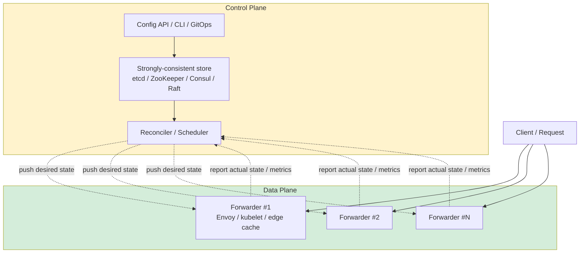
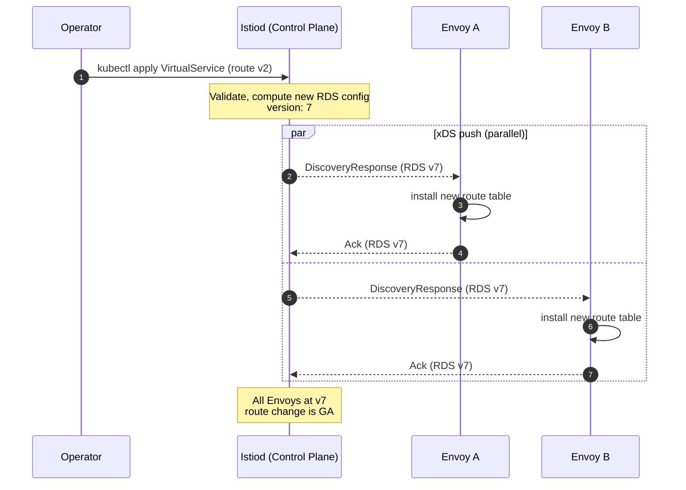

# Control Plane vs Data Plane — Configuration Push, Traffic Flow, and the Mental Model Behind Gateways and Mesh

**Date:** 2026-05-02 | **Updated:** 2026-05-02
**Tags:** `system-design` `architecture` `control-plane` `data-plane` `networking`

## Table of Contents

- [Summary](#summary)
- [Why This Matters](#why-this-matters)
- [Overview — Two Planes, One System](#overview--two-planes-one-system)
- [Key Concepts](#key-concepts)
  - [Network Origin: Routing Protocol vs Packet Forwarding](#network-origin-routing-protocol-vs-packet-forwarding)
  - [Why Splitting Matters: Different Performance Budgets](#why-splitting-matters-different-performance-budgets)
  - [Reconciliation Loop — Desired State vs Actual State](#reconciliation-loop--desired-state-vs-actual-state)
  - [Push vs Pull Configuration](#push-vs-pull-configuration)
  - [xDS — How Envoy Learns the World](#xds--how-envoy-learns-the-world)
  - [Failure Isolation — Stale Config Beats No Traffic](#failure-isolation--stale-config-beats-no-traffic)
  - [Versioning, Canary Configs, Rollback](#versioning-canary-configs-rollback)
  - [Why ZooKeeper / etcd / Consul Live in the Control Plane](#why-zookeeper--etcd--consul-live-in-the-control-plane)
  - [Multi-Tenant Control Planes](#multi-tenant-control-planes)
  - [SDN Genealogy](#sdn-genealogy)
- [Worked Examples](#worked-examples)
  - [Kubernetes — apiserver/etcd vs kubelet](#kubernetes--apiserverearcd-vs-kubelet)
  - [Service Mesh — Istiod vs Envoy](#service-mesh--istiod-vs-envoy)
  - [API Gateway — Route Table vs Forwarding](#api-gateway--route-table-vs-forwarding)
  - [CDN — Configuration vs Cache Fleet](#cdn--configuration-vs-cache-fleet)
  - [Database — DDL vs DML](#database--ddl-vs-dml)
  - [Deploying a Route Change to 1000 Envoy Proxies](#deploying-a-route-change-to-1000-envoy-proxies)
- [Anti-Patterns](#anti-patterns)
- [Related](#related)
- [References](#references)

## Summary

The control-plane / data-plane split is the single most useful mental model for reasoning about gateways, meshes, schedulers, CDNs, and software-defined networks. The **data plane** sits on the request path: it forwards packets, terminates TLS, executes routing rules, enforces policy, and reports metrics. It must be fast, stateless (or near-stateless), and survive control-plane outages. The **control plane** decides what the data plane does: it computes routing tables, distributes configuration, watches health, and reconciles desired state. It can be slow, strongly consistent, and tolerant of brief unavailability — because the data plane keeps serving traffic with its last-known config. Once you internalize the split — Kubernetes apiserver vs kubelet, Istiod vs Envoy, BGP daemon vs forwarding ASIC, CDN config API vs edge caches — the architecture of every modern distributed system suddenly looks the same.

## Why This Matters

If you only remember one architectural pattern from this whole section, make it this one. It tells you where to put state (control plane), where to optimize for latency (data plane), what can fail without taking down traffic (control plane outage = degraded mode, not outage), and where consistency models actually matter (control plane uses Raft/Paxos; data plane uses eventually-consistent fan-out). It explains why kube-apiserver going down doesn't immediately kill running pods, why Envoy keeps routing during an Istiod restart, why a CDN purge is async, and why your "edge router config push" tool always has versioning, canary, and rollback. Reading any system-design diagram becomes easier the moment you ask: "which boxes are on the request path, and which boxes only push config?"

## Overview — Two Planes, One System

The principle generalizes a single observation from networking: forwarding a packet and deciding where the packet should go are two different jobs with two different budgets. Bundle them into one process and you get either a slow data plane or an unstable control plane.



Read the diagram top-down: operators (or GitOps, or autoscalers) write **desired state** to a strongly-consistent store. A reconciler computes a config delta and **pushes** it to every data-plane instance. The data plane carries traffic and **reports** metrics, health, and actual state back. Crucially, the user request arrow only touches the data plane — it never traverses the control plane. That single property is the entire reason the split exists.

The defining axes:

| Axis | Control Plane | Data Plane |
|------|--------------|-------------|
| **On the request path?** | No | Yes |
| **Latency budget** | seconds to minutes (config push) | microseconds to milliseconds (per request) |
| **Consistency** | strong (Raft/Paxos), single source of truth | eventually consistent (last config received) |
| **State** | desired state, history, audit | active connections, counters, caches |
| **Scaling** | a handful of replicas (3, 5, 7) | hundreds to millions of instances |
| **Failure mode** | degraded mode — no new config | outage — traffic stops |
| **Update cadence** | seconds to hours | nanoseconds (every packet) |
| **Languages picked for** | correctness, expressiveness (Go, Java) | throughput (C++, Rust, eBPF, ASIC) |

## Key Concepts

### Network Origin: Routing Protocol vs Packet Forwarding

The split was invented in classical IP networking long before the cloud. A router has two halves:

- **Control plane** — runs OSPF, BGP, IS-IS. Computes the routing table by exchanging messages with neighbors. Lives in software on a CPU, on the order of seconds to converge after a topology change.
- **Data plane** — the line cards. Takes a destination IP, looks it up in the FIB (forwarding information base, derived from the routing table), forwards the packet at line rate. Lives in custom ASICs, FPGAs, or eBPF, processing tens of millions of packets per second per port.

When a link flaps, the **control plane** notices, recomputes routes via Dijkstra/Bellman-Ford, programs the new FIB into the **data plane**, and the data plane carries traffic with the new entries. Users see at most a few hundred milliseconds of dropped packets.

This is the whole pattern. Everything that follows — Kubernetes, Istio, CDNs, gateways — is a refinement of this idea applied to a different transport.

### Why Splitting Matters: Different Performance Budgets

Pretend for a moment that you didn't split. A single process owns both "decide where to send this packet" and "send the packet". What happens?

- **The control logic slows down forwarding.** Every config recomputation locks the forwarding table.
- **Forwarding bugs crash the controller.** A malformed packet that crashes the data path takes the routing brain with it.
- **You can't scale them independently.** You need 1000 forwarders for traffic. You need 3 controllers for consistency. Bundling them forces you to scale the wrong thing.
- **You can't choose different languages.** The data plane wants C++/Rust/eBPF/hardware; the control plane wants Go/Java/Python with a real type system, libraries, and observability.

Splitting them lets each side be optimized for its job. The data plane is **hot, fast, dumb-by-design** (no business logic). The control plane is **cold, smart, careful** (lots of validation, lots of consensus).

### Reconciliation Loop — Desired State vs Actual State

The control-plane / data-plane interaction is almost always a **reconciliation loop**:

1. Operator declares desired state ("I want 5 pods of `payments` v1.4.2 in `prod`").
2. Control plane writes desired state to storage (etcd/ZooKeeper/Consul).
3. Reconciler observes a diff between desired and actual and produces an action plan.
4. Reconciler pushes config (or schedules work) to data-plane instances.
5. Data-plane instances apply the config and **report actual state back**.
6. Reconciler observes the new actual state. If it matches desired, the loop converges. If not, repeat.

This is exactly what Kubernetes does (`kubectl apply` → apiserver → etcd → kube-scheduler/kube-controller-manager → kubelet → updated Pod status → apiserver). It is exactly what Istio does (`VirtualService` CR → Istiod → xDS push → Envoy applies → Envoy stats back). It is exactly what BGP does in a different vocabulary.

The implication: **the control plane never directly does the work**. It writes intent. Some other process — running close to the work — pulls intent and acts. The control plane just keeps watching to see if reality has caught up to intent.

### Push vs Pull Configuration

There are two families for getting config to the data plane:

**Pull** — the data plane periodically asks the control plane "what's my config?".

- Simple, reliable, naturally backpressure-friendly.
- Control plane is stateless re: connections (it just answers GETs).
- Latency is the polling interval (e.g., kubelet polls apiserver every few seconds via watch).
- Works through firewalls — only the data plane initiates outbound connections.
- Examples: pre-xDS Envoy with file-based config reloads, classic Puppet/Chef agents, Consul Template polling.

**Push** — the control plane streams config to subscribed data-plane instances.

- Lower latency — config arrives within milliseconds of being written.
- Control plane must hold a long-lived connection per data-plane instance (memory cost).
- Requires careful flow control to avoid hammering slow consumers.
- Needs reconnect/resubscribe logic for network blips.
- Examples: xDS over gRPC streaming (Envoy), Kubernetes watch streams, NATS JetStream config push.

In practice, "push" is usually a **streaming watch**: the data plane opens a long-lived gRPC/HTTP connection and the control plane pushes deltas as state changes. This is technically initiated by the data plane (it's a long-poll/stream), but behaves like push. Kubernetes' watch and Envoy's xDS-on-gRPC both work this way.

### xDS — How Envoy Learns the World

xDS is the de-facto standard config API between control planes (Istiod, Consul, AWS App Mesh, Kuma, Gloo) and Envoy data planes. It's a small family of gRPC services:

| API | Stands for | What it pushes |
|-----|------------|----------------|
| **LDS** | Listener Discovery | TCP/UDP/HTTP listeners — sockets to bind |
| **RDS** | Route Discovery | HTTP route tables — which upstream cluster matches which path/header |
| **CDS** | Cluster Discovery | Upstream clusters — logical groups of endpoints |
| **EDS** | Endpoint Discovery | Concrete endpoints (IP:port) inside each cluster |
| **SDS** | Secret Discovery | TLS certs and keys (rotated independently of routes) |
| **ADS** | Aggregated Discovery | Single stream that multiplexes all of the above |

The mental picture: a route in Envoy is a **chain** — a Listener pulls in a Route Configuration, which references a Cluster, which references Endpoints. The control plane pushes each layer separately on its own resource version. ADS exists because pushing them out of order can produce a momentary "dangling reference" (route points to cluster X, cluster X arrives a few ms later). ADS guarantees ordered delivery.



Two important properties of xDS:

- **Eventual consistency, not transactional.** Envoy A might be on v7 while Envoy B is still on v6 for tens of milliseconds. The system is designed to tolerate this — both versions of the config are individually safe, and the change is rolled out in any order.
- **Acks and Naks.** Envoy explicitly acknowledges each config version. If a config is invalid (e.g., references a cluster that doesn't exist), Envoy sends a Nak. The control plane sees the Nak and stops the rollout instead of breaking every proxy.

### Failure Isolation — Stale Config Beats No Traffic

The single biggest payoff from the split: **the control plane can fail and the data plane keeps serving**.

What "control-plane outage" means in practice:

- **Kubernetes:** kube-apiserver/etcd is down. Existing Pods keep running. Existing kube-proxy IPVS rules keep routing. Services that don't change keep working. What you lose: the ability to deploy, scale, or recover from node failures. Cluster freezes — but does not die.
- **Istio:** Istiod is down. Existing Envoys keep their last config. Existing mTLS certs keep working until rotation expiry (typically 24h). What you lose: new routes, new policies, new certs. Old traffic flows continue.
- **AWS:** Region-level control-plane events have happened (the `us-east-1` apiserver / IAM control plane has had outages). EC2 instances kept running because their data plane (the hypervisor + SDN forwarders) is decoupled. You couldn't launch new instances; existing ones served traffic.

This is the explicit design intent. The control plane is allowed to be temporarily unavailable because the data plane treats its last-known config as the source of truth for ongoing traffic. Engineers should test this — kill the control plane in staging and verify traffic continues. If it doesn't, you've accidentally put control-plane state on the request path (a common bug).

### Versioning, Canary Configs, Rollback

Because pushing a config to 1000 forwarders is itself a rollout, control planes treat config changes like deployments:

- **Resource versions.** Every config has a version (etcd's `resourceVersion`, xDS's `version_info`, Consul's `ModifyIndex`). Data-plane instances acknowledge the version they applied.
- **Canary push.** Push the new config to one Envoy first; watch metrics; if healthy, expand to a fraction; then to all. Service-mesh control planes typically support this via "gateway labels" or "canary class" selectors.
- **Rollback.** If the new config produces errors, the control plane re-pushes the previous version. Because configs are versioned, rollback is just another forward-push of an older version.
- **Validation gates.** Most control planes (Kubernetes admission controllers, Istio's Galley, Consul's CLI validation) reject invalid config _before_ it reaches the store, so a bad config can't even start propagating.
- **Drain on rollback.** Some changes (e.g., listener config) require draining existing connections. The control plane orchestrates draining via lifecycle hooks; the data plane just executes them.

A reasonable rule: treat every control-plane config change as a code deploy. Same care with diff, review, canary, monitoring, and rollback procedures.

### Why ZooKeeper / etcd / Consul Live in the Control Plane

The strongly-consistent KV stores (etcd, ZooKeeper, Consul) are the **state core** of the control plane. They live there for a specific reason: the control plane is the **only** place where you actually need transactional, linearizable consistency. The data plane works fine with eventual consistency (whatever config arrived last is what I serve).

What lives in the consistent store:

- Desired state (Pod specs, Services, VirtualServices).
- Leader election state (who is the active scheduler / controller manager).
- Membership and registration (which nodes are alive, which services exist).
- Lock state (distributed locks for serializing operations).
- Resource versions / generation counters.

What does **not** live in the consistent store:

- Per-request state (active connections, current request counters).
- Cache contents.
- Per-packet metadata.
- Anything that changes on every request.

This is also why etcd and ZooKeeper are bad answers when someone asks "where should I store user sessions?". They're optimized for write-rare/read-watch workloads with strong consistency — not for high-throughput read-write. They are control-plane stores by design.

### Multi-Tenant Control Planes

A single control plane can manage many data planes. Concrete examples:

- **AWS** runs one control plane per region (effectively) and an enormous data-plane fleet (millions of EC2 instances, hundreds of thousands of NAT gateways, etc.).
- **Cloudflare** runs a few global control planes and ~300 PoPs (data-plane locations).
- **Fastly's** VCL config compiler is a single global control plane; the data plane is the worldwide cache fleet.
- **Kubernetes-as-a-service** providers (GKE, EKS, AKS) often run one big multi-tenant control-plane fleet that manages thousands of customer clusters' data planes.

The pattern: control plane scales by tenant or region; data plane scales by load. Isolation between tenants happens primarily at the data plane (network policy, namespace, IAM), with the control plane providing strong identity and validation.

A failure mode worth knowing: a noisy tenant making 10k API calls/sec at the control plane can starve other tenants' control-plane operations. This is the cell-based / shuffle-sharding motivation — see [cell-based architecture](./cell-based-architecture.md).

### SDN Genealogy

Software-Defined Networking (SDN) is where this whole pattern was named and standardized. The seminal paper is Nick McKeown et al., "OpenFlow: Enabling Innovation in Campus Networks" (2008). The pitch:

- Take the control plane out of the switches.
- Centralize it in a single controller (a server running OpenFlow software).
- Let the controller program the switches' forwarding tables remotely via OpenFlow.

The implications were enormous: instead of each switch running its own OSPF brain, a single SDN controller had global topology knowledge and could compute optimal paths, do fine-grained traffic engineering, and react to failures in milliseconds. Google's B4 backbone, OpenStack Neutron, AWS VPC's underlying SDN — all are descendants.

The SDN movement directly informed the design of:

- **Kubernetes** (apiserver as the centralized "controller", kubelets as the dumb data plane).
- **Service mesh** (Istiod as the controller, Envoy as the data plane).
- **eBPF / Cilium** (controller programs eBPF datapath in the kernel directly, OpenFlow-style but in software).

If you read McKeown's paper and then read the Istio architecture page, you'll see the same picture twice in different vocabularies.

## Worked Examples

### Kubernetes — apiserver/etcd vs kubelet

```text
Control plane                           Data plane
─────────────                           ──────────
kube-apiserver  ──┐                     kubelet  (one per node)
  ↑               │ watches/lists       kube-proxy / cilium / etc.
  │               ▼                       ↓
etcd            kube-scheduler           Pod containers (the actual work)
                kube-controller-manager
```

Flow of `kubectl apply -f deploy.yaml`:

1. `kubectl` POSTs to `kube-apiserver`.
2. Apiserver validates against admission controllers, writes to **etcd**.
3. `kube-scheduler` watches Pods with no node assignment, picks a node, writes the binding to apiserver, which writes to etcd.
4. The target node's `kubelet` watches its Pods via apiserver, sees the new Pod, pulls the image, starts the container.
5. `kubelet` reports container status to apiserver, which writes to etcd.
6. `kubectl get pods` reads from apiserver, which reads from etcd, sees Running.

The data plane is the kubelet plus the running Pods. If apiserver dies right after step 4, the Pod still runs — kubelet doesn't need apiserver to keep an already-running Pod alive. You just can't deploy anything new.

### Service Mesh — Istiod vs Envoy

```text
Control plane (Istiod)                  Data plane (Envoy sidecars)
──────────────────────                  ────────────────────────────
Reads Kubernetes Services                Per-pod Envoy
Reads VirtualService, DestinationRule    Listens on iptables-redirected ports
Computes per-Envoy xDS config            Routes/retries/mTLS
Streams xDS over gRPC ────────────────►  Applies config, acks version
                  ◄──────────────────── Reports per-request metrics
```

Flow of "shift 10% of `payments` traffic to v2":

1. Operator applies a `VirtualService` with weighted destinations: 90% v1, 10% v2.
2. Istiod sees the new CR, validates it, computes new RouteConfiguration objects for every Envoy that has visibility to the `payments` service.
3. Istiod streams an `RDS` xDS push (version `n+1`) to those Envoys.
4. Each Envoy installs the new route table in memory, immediately routes 10% of `payments` calls to v2 endpoints.
5. Each Envoy reports per-route metrics (rate, latency, errors) back to Prometheus.
6. The operator watches metrics. If healthy, edits the `VirtualService` to 50/50, then 0/100. Three seconds total per step.

If Istiod dies between steps 2 and 6, the partial rollout is "stuck" — Envoys that received `n+1` are at the new config; Envoys that didn't are still at `n`. Both are individually correct. When Istiod restarts, it republishes; Envoys converge to the latest version. No traffic lost.

### API Gateway — Route Table vs Forwarding

A typical API gateway (Kong, Envoy/Gloo, AWS API Gateway, Apigee, NGINX Plus):

- **Control plane:** the admin API where operators define routes (`POST /routes { path: "/v1/users", upstream: "users-svc" }`), plugins (rate limiting, JWT validation), consumers, and credentials. State lives in a database (Postgres/Cassandra/etcd).
- **Data plane:** the actual gateway processes that terminate TLS, parse HTTP, look up the route, apply plugins, and proxy to the upstream. Stateless — they pull config from the control plane on startup and on push.

When you add a new route, the data plane processes are running with version `n` of the route table. The admin API writes the change to the DB. The data plane processes pull (or get a push of) version `n+1` and rebuild their route table without dropping connections (Envoy does a hot config swap; NGINX Plus does a worker reload). Users hitting the gateway see no impact.

See [API Gateways and BFF](../building-blocks/api-gateways-and-bff.md) for the gateway itself.

### CDN — Configuration vs Cache Fleet

A CDN like Cloudflare or Fastly:

- **Control plane:** the configuration system. Cache rules, page rules, redirects, firewall rules, custom Lua/VCL/Worker code. State sits in a global config DB; the dashboard and API write to it.
- **Data plane:** the edge cache fleet — hundreds of PoPs worldwide. Each edge is a beefy server running NGINX, Varnish, or a custom proxy with a local disk cache. It serves traffic at line rate.

When you change a cache rule, the control plane validates, distributes the new config to every PoP (often in 30 seconds or less, via an internal config-push pipeline). The PoPs reload config without dropping connections. Cache-purge requests are similar: the API receives the purge, distributes "invalidate this URL" messages to every PoP, the PoPs evict. The user-facing response to "purge succeeded" is sometimes returned before every PoP has actually processed it — eventual consistency on purpose.

### Database — DDL vs DML

A more abstract example to anchor the concept: a relational database has its own version of the split.

- **Control plane:** DDL (CREATE TABLE, ALTER TABLE, CREATE INDEX, GRANT). Modifies the catalog. Slow, transactional, often takes locks. Run rarely. Failure is annoying but doesn't take down running queries.
- **Data plane:** DML (SELECT, INSERT, UPDATE, DELETE) running against existing tables and indexes. Hot path. Optimized for throughput. Runs millions of times per second.

If your DDL system fails (e.g., a migration tool crashes), DML keeps working. If your DML path fails, the application is down. This is why DDL changes are scheduled, gated, and reviewed differently from queries — they're control-plane operations.

### Deploying a Route Change to 1000 Envoy Proxies

Putting it all together for the canonical worked example:

**Goal:** shift 5% of `checkout` traffic to a new build (`v2`).

**Step 1 — Author the change.**

```yaml
# checkout-vs.yaml
apiVersion: networking.istio.io/v1beta1
kind: VirtualService
metadata:
  name: checkout
  namespace: prod
spec:
  hosts: ["checkout.prod.svc.cluster.local"]
  http:
    - route:
        - destination: { host: checkout, subset: v1 }
          weight: 95
        - destination: { host: checkout, subset: v2 }
          weight: 5
```

**Step 2 — Apply via GitOps.** Argo CD picks up the commit, runs `kubectl apply`. The Kubernetes apiserver validates and writes to etcd. ResourceVersion bumps from 1487 to 1488.

**Step 3 — Istiod observes.** Istiod's watch on `VirtualService` resources fires. It re-runs its computation: which Envoys have visibility to `checkout`? (In Istio, that's controlled by `Sidecar` CRs and namespace scoping — say it's 1000 Envoys in this case.) It computes new `RouteConfiguration` objects.

**Step 4 — xDS push.** Istiod streams a `DiscoveryResponse` over the existing gRPC/ADS streams to each of the 1000 Envoys. The push is parallel, but not synchronized — Envoys receive at slightly different times (typically a few ms apart). Istiod is configured with **push debouncing** (default 100 ms) to coalesce rapid changes into a single push. With 1000 Envoys, the rollout typically completes in under one second.

**Step 5 — Per-Envoy apply.** Each Envoy parses the new RDS config, validates it, and atomically swaps the active route table. No connection draining is needed for a route-weight change — existing connections are unaffected; new requests use the new table.

**Step 6 — Acknowledge.** Each Envoy responds with an Ack carrying `version_info: "1488"`. Istiod tracks per-Envoy versions; once all 1000 are on `1488`, the rollout is "complete".

**Step 7 — Observe.** Prometheus scrapes per-Envoy stats (`istio_requests_total{destination_version="v2"}`). The dashboard immediately shows ~5% of traffic on v2. The operator watches latency and error rate for that subset.

**Step 8 — Promote or rollback.** If healthy, the operator (or automation) commits a new VirtualService with weights `90/10`, then `0/100`. If unhealthy, they revert the commit; Argo CD applies the old VirtualService; Istiod pushes again; Envoys revert. Total time to rollback: ~3 seconds.

What did **not** happen during this rollout: the user request never traversed Istiod, never read from etcd, never hit the apiserver. Every user request went app → Envoy → upstream. The control-plane work happened entirely off the request path, asynchronously. That is the whole point of the split.

## Anti-Patterns

- **Putting the control plane on the request path.** A "gateway" that synchronously calls the control plane to authorize each request, or to look up routes, is not actually a data plane — it's now coupling user latency to control-plane availability and scale. Always cache routes/policies locally on the data plane and refresh asynchronously.
- **Storing per-request state in etcd/ZooKeeper.** Using a strongly-consistent store for hot data (sessions, counters, per-request metadata) does not scale. The store is a control-plane substrate; treat it that way. For hot data, use Redis, DynamoDB, Cassandra, or something built for it.
- **No graceful degradation when the control plane is down.** If your data plane refuses to serve traffic because it can't reach the control plane, you've turned a control-plane outage into a global outage. The data plane should always serve with stale config and log warnings — not refuse traffic.
- **Forgetting to version configs.** Pushing config without versions makes rollback ambiguous. Every config change should have an incrementing version that data-plane instances Ack — this is what xDS, etcd's resourceVersion, and Consul's ModifyIndex give you for free if you use them.
- **No canary push.** Pushing to all 1000 instances simultaneously means a bad config takes down everything. Even within a control plane, treat config push as a deploy: subset, observe, expand.
- **Synchronous control-plane writes from the request path.** "Save the new user, then update the config in etcd so the gateway routes to them" — now the user-create latency is bound to the control plane. The control plane should never be in the user-facing critical path.
- **Tight version coupling between control and data plane.** Mismatched xDS protocol versions between Istiod and Envoy produce subtle, hard-to-debug failures. Treat them as a paired upgrade, but allow rolling skew (data plane should read N-1 control-plane configs and vice versa).
- **Single control-plane failure domain for unrelated workloads.** One global Istiod controlling 50 unrelated tenants is a single blast radius. Use cell-based architecture (one Istiod per cell) for isolation.
- **Hidden data plane in the control plane.** A control plane that, e.g., proxies API calls through itself to the data plane (for "convenience"), suddenly has a request-path component. Now its outage is a real outage.
- **Reconciliation loop without bounded retry.** A reconciler that retries forever on a malformed config will hammer the data plane endlessly. Always cap retries, use exponential backoff, and surface "stuck" reconciliations to humans.

## Related

- [Service Mesh as an Architectural Decision](./service-mesh-as-architectural-decision.md) — the canonical control-plane / data-plane split applied to service-to-service traffic.
- [Sidecar Pattern](./sidecar-pattern.md) — the data-plane shape for service mesh; how Envoy gets injected into every Pod.
- [Cell-Based Architecture](./cell-based-architecture.md) — multi-tenant control planes and shuffle-sharding for blast-radius reduction.
- [API Gateways and BFF](../building-blocks/api-gateways-and-bff.md) — the gateway is itself a control-plane / data-plane system.
- [Load Balancers in System Design](../building-blocks/load-balancers-in-system-design.md) — load balancers split into a config plane and a forwarding plane for the same reasons.

## References

- Nick McKeown, Tom Anderson, Hari Balakrishnan, et al., ["OpenFlow: Enabling Innovation in Campus Networks"](https://dl.acm.org/doi/10.1145/1355734.1355746) (SIGCOMM CCR, 2008) — the seminal SDN paper that named the modern control-plane / data-plane split.
- Envoy Project, ["xDS REST and gRPC protocol"](https://www.envoyproxy.io/docs/envoy/latest/api-docs/xds_protocol) — the canonical config-push protocol; covers ADS, versioning, Ack/Nak semantics.
- Istio, ["Architecture"](https://istio.io/latest/docs/ops/deployment/architecture/) — Istiod (control) and Envoy (data) responsibilities and component diagram.
- Kubernetes, ["Kubernetes Components"](https://kubernetes.io/docs/concepts/architecture/) — official architecture overview; what's a control-plane component vs a node component.
- AWS, ["Static stability using Availability Zones"](https://aws.amazon.com/builders-library/static-stability-using-availability-zones/) and the broader [AWS Builders' Library](https://aws.amazon.com/builders-library/) — workload isolation, control-plane vs data-plane stability, multi-tenant control-plane patterns.
- Cilium, ["Cilium Overview"](https://docs.cilium.io/en/stable/overview/intro/) — eBPF as a kernel-resident data plane programmed by a Kubernetes-native control plane.
- HashiCorp, ["Consul Architecture"](https://developer.hashicorp.com/consul/docs/architecture) — Consul servers (control plane) vs Consul clients and proxies (data plane); gossip, Raft, and config delivery.
- Matt Klein, ["Service mesh data plane vs. control plane"](https://blog.envoyproxy.io/service-mesh-data-plane-vs-control-plane-2774e720f7fc) — the Envoy author's own framing; recommended one-page read.
- Brendan Burns, _Designing Distributed Systems_ (O'Reilly, 2018) — chapter on reconciliation loops and the controller pattern; the Kubernetes mental model in book form.
