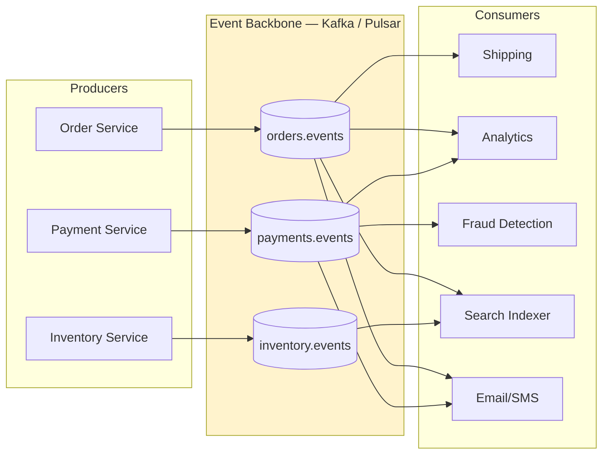
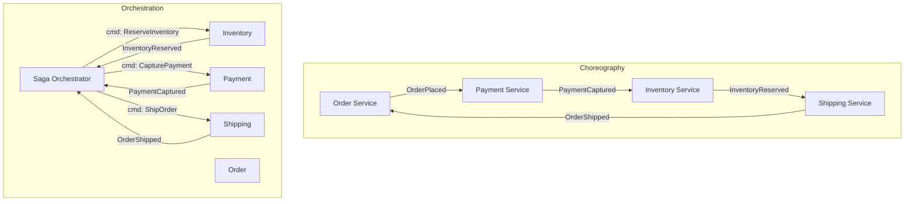
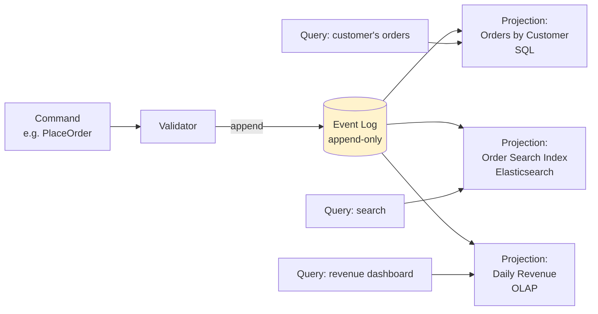
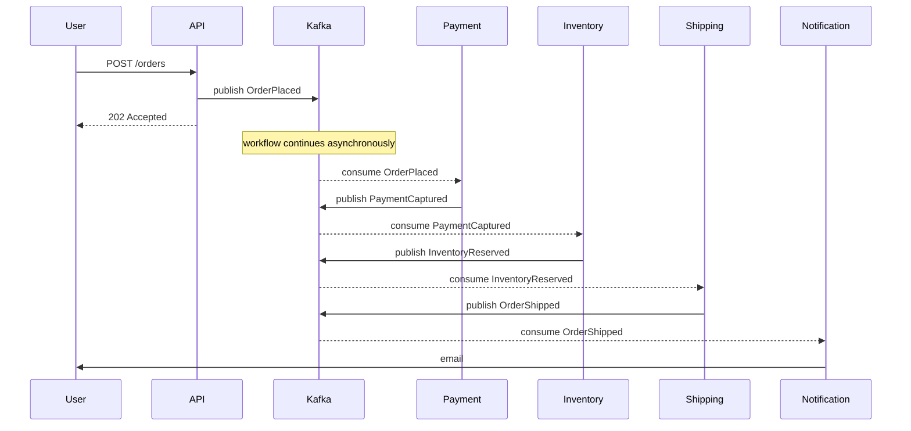

# Event-Driven Architecture as a Style

**Date:** 2026-04-26 | **Updated:** 2026-04-26
**Tags:** `system-design` `architecture` `event-driven` `kafka`

## Table of Contents

- [Summary](#summary)
- [Why This Matters](#why-this-matters)
- [Overview — EDA as an Organizing Principle, Not Just a Pattern](#overview--eda-as-an-organizing-principle-not-just-a-pattern)
- [Key Concepts](#key-concepts)
  - [The Event Backbone — Kafka and Pulsar as the Nervous System](#the-event-backbone--kafka-and-pulsar-as-the-nervous-system)
  - [Event Types — Domain, Integration, and Why Commands Are Not Events](#event-types--domain-integration-and-why-commands-are-not-events)
  - [Choreography vs Orchestration](#choreography-vs-orchestration)
  - [Event Sourcing and the CQRS Pairing](#event-sourcing-and-the-cqrs-pairing)
  - [Schema Evolution — Avro, Protobuf, and the Schema Registry](#schema-evolution--avro-protobuf-and-the-schema-registry)
- [Trade-offs — When EDA Wins, When It Loses](#trade-offs--when-eda-wins-when-it-loses)
  - [When EDA Is the Right Style](#when-eda-is-the-right-style)
  - [When EDA Is the Wrong Style](#when-eda-is-the-wrong-style)
  - [Observability Complexity — The Missing Trace](#observability-complexity--the-missing-trace)
- [Real-World Uses](#real-world-uses)
- [Anti-Patterns](#anti-patterns)
- [Related](#related)
- [References](#references)

## Summary

Event-Driven Architecture (EDA) is not a pattern you sprinkle into a service — it is an **organizing principle** for the whole system. State transitions are modeled as immutable events on a durable log, services subscribe rather than call each other, and the log itself (Kafka, Pulsar, Kinesis) becomes the system's nervous system. Done well, EDA decouples producers from consumers, gives you replayable history, and lets you add new consumers without touching producers. Done badly, it dresses synchronous workflows in async clothes, hides cycles inside topic graphs, and turns every incident into a forensic archaeology dig because no single trace exists. This doc covers the style at the system level — backbone, event types, choreography vs orchestration, event sourcing + CQRS, schema evolution, and the anti-patterns that turn an event mesh into a distributed mud ball.

## Why This Matters

In a design review someone says "we'll use Kafka for that" or "let's make it event-driven." Both sentences are usually meaningless without the structural commitments behind them. Choosing EDA as a **style** means accepting:

- Producers no longer know who their consumers are.
- Workflows are no longer expressible as a single call stack.
- "What happened" lives in the log, not in any one service's database.
- A late or duplicate event is a normal operating condition, not an exception.

If you sign up for those rules, EDA is enormously powerful. If you don't, you'll build a system where Kafka is just a slow, expensive, and lossier RPC bus. The point of treating EDA as a style — alongside layered, hexagonal, microservices, or service-based — is to know which whole-system commitments you've made before any individual service is designed.

## Overview — EDA as an Organizing Principle, Not Just a Pattern

EDA in the small is a useful tactic: drop a queue between two services to absorb load. EDA as a **style** is a different proposition. The system's source of truth becomes the **stream of events**, and individual services become caches and projections of that stream.

Key shifts in mindset:

| Style | Source of truth | Coupling between services | Communication shape |
|-------|-----------------|---------------------------|---------------------|
| Layered monolith | Database tables | Compile-time function calls | Request → response |
| REST microservices | Each service's DB | HTTP API contracts | Request → response, point-to-point |
| **EDA as style** | **The event log** | **Schema of events on shared topics** | **Publish → subscribe, asynchronous fan-out** |

The third row is the entire game. In a REST microservice world, when Service A wants Service B to do something, A calls B. In an EDA world, A emits an event saying "this happened" and any number of consumers — including B — react. A does not know B exists. B does not know A exists. The contract is the **event schema on the topic**, not a URL.

That single shift produces every other property of EDA: the decoupling, the observability pain, the schema-evolution hardship, the replay superpower, the saga complexity. Read the rest of this doc with that single rule in mind.

A useful litmus test: imagine deleting a consumer from the system. In a REST architecture, deleting the caller of an API is invisible to the API; deleting the *callee* breaks the caller. In a properly EDA-styled system, **deleting any consumer is invisible to producers**, and adding a new consumer requires zero change to producers. If your "EDA" system can't pass that test, you have point-to-point messaging with extra hops, not EDA.

The corollary that makes senior engineers nervous: **the producer cannot reason about the system's behavior**. When you publish `OrderPlaced`, you do not know what will happen next — and that's the *intended* property. The benefits (decoupling, extensibility, replay) and the costs (no single trace, eventual consistency, schema as public API) are two sides of one coin. You cannot have one without the other.

## Key Concepts

### The Event Backbone — Kafka and Pulsar as the Nervous System

In an EDA-styled system the broker is not "a queue we use sometimes." It is the **central infrastructure**, treated with the same operational seriousness as a primary database. Properties you actually need from a real backbone:

- **Durable, replayable log.** Events are kept for days, weeks, or forever — not deleted on consume. New consumers can subscribe and replay history. This is the property that distinguishes Kafka/Pulsar from RabbitMQ/SQS.
- **Partitioned ordering.** Total order across the whole topic is impossible at scale; instead you get **per-key order** within a partition. Choosing the partition key is the most consequential design decision in any EDA system: order ID, user ID, account ID, conversation ID — pick the entity whose events must be observed in order.
- **At-least-once delivery as the default.** Exactly-once is achievable in narrow cases (Kafka transactions + idempotent producer + transactional consumer) but the system you actually run handles duplicates everywhere. See [idempotency-and-exactly-once](../communication/idempotency-and-exactly-once.md).
- **Consumer groups for horizontal scaling.** Multiple consumer instances share a topic by partition assignment; adding consumers is how you scale.
- **Multi-tenant isolation.** Topics, namespaces, ACLs, quotas. The backbone is a platform — not a deployment artifact.

| Backbone | Strength | Weakness |
|----------|----------|----------|
| **Kafka** | Highest throughput, mature ecosystem (Connect, Streams, ksqlDB), de-facto industry standard | Operational burden (ZK/KRaft, rebalancing, retention tuning); not great for millions of low-volume topics |
| **Pulsar** | Tiered storage built-in, multi-tenancy first-class, geo-replication is native, supports both queue and stream semantics | Smaller ecosystem; more moving parts (BookKeeper + brokers + ZK) |
| **Kinesis** | Managed, no broker ops, integrates with AWS analytics | Lower throughput per shard, fewer client features, fixed-shard scaling friction |
| **RabbitMQ / SQS** | Simple, great for task queues | Not a log — once a message is consumed it's gone; no replay, no "join the topic late" |
| **Redpanda** | Kafka-protocol-compatible, single binary, lower latency | Smaller community, newer, fewer enterprise integrations |

If you're choosing an EDA backbone for a new system in 2026, the default answer is Kafka or Pulsar. Reach for Kinesis if you're all-in on AWS and willing to live with shard mechanics. Reach for SQS/RabbitMQ when you actually want a **task queue**, not a log — they're the right tool for "do this job once, ack, forget."

See [design-message-queue](../case-studies/distributed-infra/design-message-queue.md) for the case-study walkthrough of building such a backbone.

### Event Types — Domain, Integration, and Why Commands Are Not Events

A frequent and expensive confusion: not every message on Kafka is an "event." Three categories matter, and conflating them is how you end up with cyclic topic graphs and hidden RPC.

| Type | Semantics | Owner | Example |
|------|-----------|-------|---------|
| **Domain event** | A fact that occurred inside a bounded context. Past tense. Immutable. Owner publishes; nobody else can. | The producing service | `OrderPlaced`, `PaymentCaptured`, `InventoryReserved` |
| **Integration event** | A domain event reshaped for cross-context consumption — usually flatter, with a stable contract and minimal internal detail | The producing service (often a separate "public" topic) | `order.public.v1.OrderPlaced` (only the fields downstream needs) |
| **Command** | A request that something *should* happen. Imperative. Has an addressee. Can be rejected. | The sender; addressee is the recipient | `ShipOrder`, `RefundPayment`, `SendEmail` |

The command-vs-event distinction is the one most teams blow. Heuristics:

- **Events** are facts about the past. They are not addressed to anyone. They have many consumers, including ones that don't exist yet. `OrderPlaced` says "this happened" — what shipping, billing, fraud, and analytics each do with it is their problem.
- **Commands** are intentions about the future. They are addressed. They have exactly one logical handler. They can be **rejected** — the recipient can say no. `ShipOrder` says "please ship this" — and shipping might refuse because the address is invalid.

Putting commands on a Kafka topic is fine when you need durable command queueing, but you must be honest that the topic has **one logical consumer** and that the message is a request, not a fact. Conflating the two — having `OrderPlaced` mean both "the order happened" and "now shipping must ship it" — is how downstream services end up coupled to the producer's workflow rather than its facts.

Two practical rules:

1. **Domain events are internal; integration events are public.** Don't publish your internal `Order` aggregate's events directly to a topic the whole company subscribes to. Define an integration event with a stable schema and translate at the boundary.
2. **If the producer needs to know the consumer succeeded, it's a command, not an event.** That's an RPC dressed as an event, and you should either make it a real RPC or model the success/failure as a separate event the original producer subscribes to.

### Choreography vs Orchestration

Once a workflow involves more than one service, EDA forces a choice: **choreography** (each service reacts to events and emits its own) or **orchestration** (a central coordinator drives steps).

| Axis | Choreography | Orchestration |
|------|--------------|---------------|
| Coupling | Loosest — services know only event schemas | Coupled to the orchestrator |
| Visibility of the workflow | Implicit in the event graph; must be reconstructed from logs | Explicit in the orchestrator's state machine |
| Adding a step | Add a new subscriber; existing services don't change | Update the orchestrator |
| Compensation on failure | Each service must know how to undo its own step *and* publish a compensating event | Orchestrator drives compensation explicitly |
| Cycles and feedback loops | Easy to introduce by accident | Caught by the orchestrator's design |
| Best for | Fan-out, broadcast, simple linear chains | Multi-step transactions with business-meaningful rollback |

The lazy take is "choreography is the EDA way." The honest take is **choreography is great for fan-out and small linear chains; orchestration is better for sagas with three-plus steps and real compensation logic.** Mixing both — orchestrating the transactional core and choreographing the side-effects fan-out — is what mature systems actually do.

Tools you actually use for orchestration in EDA: **Temporal**, **Cadence**, **AWS Step Functions**, **Camunda Zeebe**, or hand-rolled state machines persisted in a database. The orchestrator's state itself is often built from the events on the bus — you can have your saga state and your event log too.

Three practical heuristics for the choice:

1. **Count the steps.** Two steps with a simple linear flow → choreography. Five steps with conditional branches → orchestration.
2. **Count the compensations.** If a failure at step N requires undoing M previous steps in a specific order, you need a workflow engine. Choreographed compensation chains turn into spaghetti by step three.
3. **Ask who owns the workflow.** If the workflow is a *business process* with stakeholders ("the refund process," "the onboarding flow"), the workflow itself deserves to be a first-class artifact owned by a team — that's an orchestrator. If the "workflow" is just a chain of side effects nobody talks about, choreography is fine.

### Event Sourcing and the CQRS Pairing

EDA does not require event sourcing, but the two are deeply complementary. If your system is already publishing immutable domain events, storing them as the **primary source of truth** for a service is a small extra step.

**Event sourcing**: instead of storing the current state of an aggregate (e.g. `Account.balance = 50`), store the sequence of events that produced it (`AccountOpened`, `Deposited(100)`, `Withdrew(50)`). Current state is a fold over events.

**CQRS** (Command Query Responsibility Segregation): the write model and read model are separate. Commands are validated against the event-sourced aggregate; queries are served from one or more **projections** built by replaying the event stream into shapes optimized for reading (a denormalized SQL table, an Elasticsearch index, a Redis cache).

What you get:

- **Perfect audit log** — every state change is recorded with its cause.
- **Time travel** — replay events up to any timestamp to see historical state.
- **New projections for free** — need a new view? Replay the log into it.
- **Bug fix and reprocess** — fix the projection logic, drop the projection, replay.

What you pay:

- **Schema evolution is harder** — old events must remain readable forever, or you need an upcasting pipeline.
- **Eventual consistency in queries** — projections lag the write log. You almost always need read-your-writes session guarantees on top.
- **Cognitive load** — engineers used to "select * from orders" find the indirection painful.
- **Storage** — keeping every event forever isn't free, though it's usually cheap relative to the value.

When event sourcing is *worth it*: ledgers, banking, inventory, anything with strong audit requirements; complex domains where "how did we get here" is a frequent operational question.

When event sourcing is *not worth it*: CRUD apps with no temporal queries; teams unfamiliar with the pattern; domains where the aggregate has hundreds of fine-grained event types and the model isn't worth the bookkeeping.

See [cqrs-and-event-sourcing](../scalability/cqrs-and-event-sourcing.md) for the full pattern walkthrough.

### Schema Evolution — Avro, Protobuf, and the Schema Registry

In a REST world, breaking the API contract is a compile-time or test-time problem; the consumer is right there. In EDA, **the producer doesn't know who its consumers are**, and consumers may be replaying events from years ago. Schema evolution is therefore a first-class operational concern, not a footnote.

The minimum viable setup:

1. **A binary, schema-aware format** — Avro or Protobuf. JSON is tempting but lacks enforced schemas, costs 5–10× more bytes, and makes evolution a free-for-all.
2. **A schema registry** — Confluent Schema Registry, Apicurio, or AWS Glue Schema Registry. Producers register schemas; consumers fetch them by ID embedded in the message; the registry enforces compatibility rules.
3. **A compatibility policy per topic** — usually `BACKWARD` (new schema can read old data) or `FULL` (both directions).

| Compatibility mode | New schema can read old data | Old schema can read new data | Use when |
|--------------------|------------------------------|------------------------------|----------|
| BACKWARD | yes | no | New consumers deploy first, then producer |
| FORWARD | no | yes | Producer upgrades first, consumers later |
| FULL | yes | yes | Mixed deployment order, safest |
| NONE | no guarantee | no guarantee | Only for greenfield, never use long-term |

Practical rules for evolving event schemas without breaking history:

- **Add fields only with defaults.** A new field without a default is a breaking change.
- **Never rename or repurpose a field.** Add a new one, deprecate the old one, retire it after all consumers have upgraded.
- **Never remove a required field.** Make it optional first.
- **Version at the topic level, not the message level**, when you need a true breaking change — `orders.public.v1` → `orders.public.v2`. Run both in parallel until consumers migrate.
- **Treat the integration event schema as a public API.** It's harder to change than your service's REST endpoints, because the consumers are invisible to you.

Without a registry and a compatibility policy, an EDA system slowly accretes silent schema drift; a producer adds a field, a downstream consumer parses strictly and crashes on the next event, and you discover your dependencies the hard way. With a registry, the failure is moved to deploy time of the producer — which is exactly where you want it.

**Avro vs Protobuf in practice.** Both work. Avro has tighter Kafka ecosystem integration (Confluent's tooling is Avro-first) and embeds schema IDs naturally; Protobuf has broader cross-language support outside Kafka and is the default if you also use gRPC internally. Pick one per organization and stick with it — mixing both on the same backbone doubles the integration surface for every new consumer language.

**Schema as product.** In a mature EDA org, integration-event schemas are versioned, reviewed, and owned like any other API. There's a `schemas/` repo, schema PRs require reviewers from downstream teams, and breaking changes go through a deprecation calendar. If your event schemas live only in producer source code with no review, your EDA is technically functioning but socially fragile.

## Trade-offs — When EDA Wins, When It Loses

### When EDA Is the Right Style

- **Many consumers per producer** — analytics, search index, cache invalidation, audit log, notification, fraud, ML feature store. Adding a new consumer is free.
- **Asynchronous workflows** — "send the welcome email," "notify the warehouse," "update the leaderboard." The user doesn't wait.
- **High-throughput data pipelines** — telemetry, clickstream, IoT, logs. Append-only, fan-out, replayable.
- **Cross-team decoupling** — when teams ship at different cadences and you don't want one team's deploy to block another's.
- **Replayability matters** — you need to rebuild a projection, recompute a metric, onboard a new consumer to historical data.
- **Audit and time travel are core requirements** — finance, healthcare, supply chain.

### When EDA Is the Wrong Style

EDA is **not** a default. It's a commitment with serious costs, and it's the wrong choice when:

- **The workflow is fundamentally synchronous.** "User clicks Buy → must see Order Confirmed" is a request/response problem. Forcing it through Kafka adds latency, failure modes, and complexity for no benefit. Use HTTP. Maybe emit a side-effect event after the fact.
- **You need request-response semantics.** EDA is publish/subscribe. If the caller needs an answer back from a specific handler, that's RPC. Trying to fake RPC over Kafka with reply topics and correlation IDs is a known anti-pattern that performs worse than HTTP and is harder to debug.
- **You need strict transactional consistency across services.** EDA is eventually consistent across consumers. If the invariant is "the order must not be confirmed unless inventory is reserved AND payment captured AND fraud cleared, atomically," you need an orchestrated saga with explicit compensation — and even then you'll have visible intermediate states. Two-phase commit across services in EDA is not a thing.
- **The system is small and the team is small.** EDA's payoff comes from many producers, many consumers, many teams. A two-service system with one team doesn't need it; a well-defined REST API will be cheaper, faster, and easier to operate.
- **You don't have observability infrastructure.** Without distributed tracing across event boundaries, structured logs with correlation IDs, and a way to inspect the topic, you cannot debug an EDA system. Showing up to EDA without those is professional negligence.

### Observability Complexity — The Missing Trace

The single hardest thing about running EDA in production is that **no single trace covers a workflow.** A REST request has a clean call tree: `client → A → B → C → D → response`. Distributed tracing follows it natively.

In EDA, the same logical workflow is:

There is no single trace. Each consumer's processing of an event is its own trace. To answer "what happened to order 12345" you need to:

1. **Propagate a correlation ID** (the order ID, or a workflow-level UUID) through every event header. Without this, you have nothing.
2. **Stitch traces across event boundaries** — OpenTelemetry's spec for this exists (`traceparent` in event headers, span links between produce and consume), and you must implement it.
3. **Centralize logs** with the correlation ID indexed (Loki, Splunk, Datadog).
4. **Instrument consumer lag** — a consumer falling behind is invisible from any single service's metrics.
5. **Be able to inspect topic contents** — `kafka-console-consumer`, `kcat`, or a UI like Conduktor / AKHQ. If your incident response is "let me redeploy with more logging," you're going to lose hours.
6. **Build a workflow-level view** — sometimes called an "event dashboard" or, with event sourcing, a per-aggregate timeline.

The lesson: **EDA observability is not free, and it must be designed in from day one.** Retrofitting tracing onto a year-old EDA system is several engineer-quarters of work. Budget it up front or accept that incidents will be archaeology.

A practical observability stack for EDA in 2026 looks like:

| Layer | Tool examples | What you watch |
|-------|---------------|----------------|
| Event tracing | OpenTelemetry with messaging semantic conventions, Jaeger, Tempo | end-to-end span graph across produce/consume boundaries |
| Topic-level metrics | Kafka exporter → Prometheus → Grafana | throughput, partition lag, ISR shrinkage, under-replicated partitions |
| Consumer group health | Burrow, Cruise Control, Kafka UI | consumer lag, rebalance frequency, stuck partitions |
| Dead-letter monitoring | DLQ topic with alerting | poison-message rate, age of oldest failed message |
| Schema-registry health | Registry's own metrics | compatibility-rejection rate, registration churn |
| Workflow-level view | Custom dashboards or per-aggregate event timelines | "tell me everything that happened to order 12345" |

If you do not have at least the first four, you are not running EDA in production — you are running an outage waiting for a trigger.

## Real-World Uses

- **Uber's microservices over Kafka.** Uber operates one of the largest Kafka deployments in the world (multi-trillions of messages/day). Trip lifecycle events, dispatch, surge, fraud, and analytics all flow through Kafka. The "uReplicator" and "Chaperone" tools they open-sourced exist specifically because operating Kafka at that scale requires custom replication and auditing infrastructure. Reference: [Uber Engineering blog on Kafka ecosystem](https://www.uber.com/blog/reliable-reprocessing/).
- **Netflix Keystone.** Netflix's entire telemetry and event pipeline runs on Kafka, processing trillions of events per day for analytics, ML feature pipelines, and operational signals. Keystone is a Kafka-as-a-platform inside Netflix — teams self-serve topics, schemas, and consumers. Reference: [Netflix Tech Blog — Evolution of the Netflix Data Pipeline](https://netflixtechblog.com/evolution-of-the-netflix-data-pipeline-da246ca36905).
- **LinkedIn — where Kafka was born.** LinkedIn invented Kafka to solve precisely this problem: one source of truth for the activity stream, consumed by search, recommendations, monitoring, and the data warehouse. Their entire site activity data backbone is Kafka. The original paper from Kreps, Narkhede, and Rao is the founding document of the modern EDA movement. Reference: [Kafka: a Distributed Messaging System for Log Processing](https://notes.stephenholiday.com/Kafka.pdf).
- **Confluent's customers (banking, retail, telco).** A canonical EDA case is a bank using Kafka to feed core-banking events into fraud, compliance, customer-360, and downstream ledgers. The pattern is the same as Uber's, just with regulators in the mix. Reference: [Confluent — Building Event-Driven Microservices](https://www.confluent.io/resources/ebook/designing-event-driven-systems/).
- **Stripe's webhook system.** Conceptually EDA-flavored: Stripe's internal services produce events, and `webhook` is the integration-event mechanism for external consumers. Same schema-evolution and at-least-once delivery problems, same lessons.
- **Shopify's pub/sub for storefront events.** Inventory changes, order events, and storefront activity flow through a Kafka backbone consumed by analytics, search, and webhook delivery to merchants.

The common thread: in each of these companies, EDA wasn't a feature flag — it was a **whole-org commitment** with platform teams owning the backbone and clear governance over schemas and topics.

## Anti-Patterns

These are the failure modes that turn an EDA-styled system into worse-than-monolith mud. Each is common enough to deserve a name and a callout.

- **Synchronous calls dressed as events.** Producer publishes `RequestX` to a topic, then blocks waiting for `ResponseX` on a reply topic with a correlation ID. This is RPC with extra steps — higher latency, harder to trace, more fragile. If you need request/response, use HTTP/gRPC. Use events for facts, not requests-for-answers.
- **No schema registry.** Topics carry JSON blobs with implicit schemas. Producers add fields without telling anyone. Downstream consumers crash silently or — worse — ingest malformed data into projections. The first incident in an EDA system without a registry teaches you why you needed one. Install it before the first event.
- **Choreography for complex sagas.** A six-step workflow with three rollback paths implemented as a chain of "service A reacts to event X by emitting Y, service B reacts to Y by emitting Z." When step 4 fails, who undoes 1–3? In choreography, every service has to know about every other service's compensation logic. This is a saga that should have been an orchestration. Switch to Temporal/Step Functions/Camunda before the third "what should happen on rollback" meeting.
- **Cyclic topic graphs.** Service A publishes to topic T1, Service B reads T1 and publishes to T2, Service C reads T2 and publishes back to T1. You now have an infinite event loop one bad deploy away. Treat the topic graph as a DAG; visualize it; prevent cycles in code review.
- **Topics as databases.** Treating a Kafka topic as a primary store with point-lookups (`give me the latest event for key K`) instead of building a projection. Compacted topics give you something close, but for any read pattern more complex than "tail the log," you want a proper projection.
- **Single giant topic for everything.** "Domain events" topic that carries `OrderPlaced`, `UserSignedUp`, `InventoryDecremented`. Now every consumer must filter and parse heterogeneous events, schemas can't evolve independently, and partitioning is broken. Topics are the API surface — split them by aggregate or by business domain.
- **No retention policy thought-through.** Either retention is too short and you can't replay, or it's infinite and storage costs and topic boot times balloon. Pick a policy per topic based on whether downstream consumers ever need history, and revisit it.
- **No DLQ strategy.** A poison message stalls a partition because the consumer keeps retrying. Without a dead-letter topic and an alert when it fills, an EDA system fails closed and silent. See [dead-letter-queues-and-retries](../communication/dead-letter-queues-and-retries.md).
- **Treating at-least-once as exactly-once.** Building consumers that aren't idempotent on the assumption Kafka transactions cover you. Then a partition rebalances and the same event is delivered twice and you double-bill someone. Idempotency is a consumer property, not a broker feature. See [idempotency-and-exactly-once](../communication/idempotency-and-exactly-once.md).
- **"We'll add tracing later."** You won't. Or you will, but only after a 4-hour incident where you couldn't tell which service dropped event 78431. Correlation IDs in event headers from day one.
- **Coupling consumers to producer's internal model.** Producer publishes its full domain aggregate. Consumer parses every field. Producer refactors and renames a field. Every consumer breaks. The fix: **integration events are flat, stable, public contracts** — distinct from internal domain events.

## Related

- [Event-Driven Architecture (Communication View)](../communication/event-driven-architecture.md) — the tactical communication-pattern view; this doc is the system-level style view.
- [CQRS and Event Sourcing](../scalability/cqrs-and-event-sourcing.md) — the read/write split and event-as-source-of-truth pattern that pairs naturally with EDA.
- [Designing a Message Queue](../case-studies/distributed-infra/design-message-queue.md) — case study of building the kind of backbone EDA depends on.
- [Sync vs Async Communication](../communication/sync-vs-async-communication.md) — the lower-level question that EDA-as-style commits you to a particular answer for.
- [Idempotency and Exactly-Once](../communication/idempotency-and-exactly-once.md) — the consumer-side discipline EDA requires.
- [Dead-Letter Queues and Retries](../communication/dead-letter-queues-and-retries.md) — the failure-handling vocabulary.
- [Stream Processing](../communication/stream-processing.md) — what consumers built on the backbone often look like (Kafka Streams, Flink, ksqlDB).
- [Push vs Pull Architecture](../communication/push-vs-pull-architecture.md) — the consumer-pull model is core to log-based EDA.
- [CAP, PACELC, and Consistency Models](../foundations/cap-and-consistency-models.md) — EDA is fundamentally an eventual-consistency style; this is the vocabulary.

## References

- Martin Fowler, ["What do you mean by 'Event-Driven'?"](https://martinfowler.com/articles/201701-event-driven.html) (2017) — the canonical breakdown of the four meanings hidden inside "event-driven" (notification, state transfer, sourcing, CQRS); essential vocabulary.
- Sam Newman, _Building Microservices_, 2nd edition (O'Reilly, 2021), chapters 4 and 6 — the clearest treatment of choreography vs orchestration and why they're not the same trade-off.
- Ben Stopford, _Designing Event-Driven Systems_ (O'Reilly / Confluent, 2018, free PDF) — [confluent.io/designing-event-driven-systems](https://www.confluent.io/resources/ebook/designing-event-driven-systems/) — the practical Kafka-shaped book on EDA at the system level.
- Jay Kreps, ["The Log: What every software engineer should know about real-time data's unifying abstraction"](https://engineering.linkedin.com/distributed-systems/log-what-every-software-engineer-should-know-about-real-time-datas-unifying) (LinkedIn, 2013) — the foundational essay; the entire modern EDA movement is downstream of this.
- Confluent, ["Event-Driven Microservices Whitepaper"](https://www.confluent.io/resources/event-driven-microservices/) — vendor-flavored but operationally honest about the schema, ordering, and idempotency problems.
- Greg Young, ["CQRS and Event Sourcing"](https://cqrs.files.wordpress.com/2010/11/cqrs_documents.pdf) (2010) — the original write-up of the patterns; opinionated and short.
- Chris Richardson, _Microservices Patterns_ (Manning, 2018), chapters 4–6 — sagas, event sourcing, and CQRS in the context of a real e-commerce system; the orchestrator-vs-choreography trade-off is treated rigorously.
- Martin Kleppmann, _Designing Data-Intensive Applications_ (O'Reilly, 2017), chapter 11 (Stream Processing) — the systems-research grounding for why log-based messaging is different from queue-based messaging.
- Confluent Schema Registry documentation — [docs.confluent.io/platform/current/schema-registry](https://docs.confluent.io/platform/current/schema-registry/index.html) — the operational manual for the schema-evolution discipline this style requires.
- Uber Engineering, ["Reliable Reprocessing of Real-Time Data Streams"](https://www.uber.com/blog/reliable-reprocessing/) and related Kafka posts — concrete EDA-at-scale war stories.
