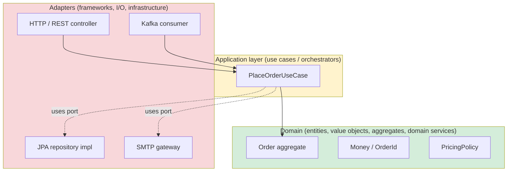
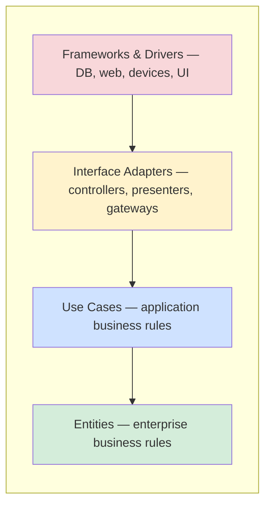
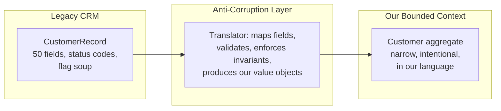

# Hexagonal, Clean, and DDD — Ports, Adapters, Bounded Contexts

**Date:** 2026-04-26 | **Updated:** 2026-04-26
**Tags:** `system-design` `architecture` `ddd` `hexagonal` `clean-architecture`

## Table of Contents

- [Summary](#summary)
- [Overview — Three Ideas, One Stack](#overview--three-ideas-one-stack)
- [Key Concepts](#key-concepts)
  - [Hexagonal — Ports and Adapters](#hexagonal--ports-and-adapters)
  - [Clean Architecture — The Dependency Rule](#clean-architecture--the-dependency-rule)
  - [DDD — Ubiquitous Language and Tactical Patterns](#ddd--ubiquitous-language-and-tactical-patterns)
  - [Aggregates as the Transactional Boundary](#aggregates-as-the-transactional-boundary)
  - [Bounded Contexts and Context Maps](#bounded-contexts-and-context-maps)
  - [Anti-Corruption Layer Between Contexts](#anti-corruption-layer-between-contexts)
  - [Strategic vs Tactical DDD](#strategic-vs-tactical-ddd)
- [How the Three Relate](#how-the-three-relate)
- [Trade-offs — When the Overhead Is Worth It](#trade-offs--when-the-overhead-is-worth-it)
- [Code Example](#code-example)
  - [Java — Port Interface and Two Adapters](#java--port-interface-and-two-adapters)
  - [Python — Aggregate Root with Invariant](#python--aggregate-root-with-invariant)
- [Real-World Uses](#real-world-uses)
- [Anti-Patterns](#anti-patterns)
- [Related](#related)
- [References](#references)

## Summary

**Hexagonal Architecture** (Cockburn, 2005) wraps a pure domain core in **ports** (interfaces the core defines) and **adapters** (concrete implementations on the outside — HTTP controllers, JPA repositories, message-bus listeners). **Clean Architecture** (Martin, 2012/2017) generalizes the same idea into concentric rings governed by a single **dependency rule**: source-code dependencies always point inward, toward the domain. **Domain-Driven Design** (Evans, 2003; Vernon, 2013) supplies the language and modeling primitives — **ubiquitous language**, **entities**, **value objects**, **aggregates**, **domain events**, and the strategic primitives **bounded context** and **context map**. The three are complementary, not competing: **DDD shapes what's inside the hexagon; Hex/Clean structure how it touches the outside world.** They earn their keep when the domain is genuinely complex; on a CRUD form-over-database app they are pure overhead.

## Overview — Three Ideas, One Stack

A common confusion in design reviews is treating these as alternatives ("we'll do Clean, not Hex"). They aren't alternatives — they layer cleanly:

| Layer | Question it answers | Author / origin |
|-------|---------------------|------------------|
| **DDD** | _What does the domain actually do, and in whose words?_ | Eric Evans, _Domain-Driven Design_ (2003) |
| **Hexagonal** | _How do we keep the domain from knowing about HTTP, SQL, or Kafka?_ | Alistair Cockburn, "Hexagonal Architecture" (2005) |
| **Clean** | _What is the universal rule that makes the above hold over time?_ | Robert C. Martin, _Clean Architecture_ (2017) |

DDD is a **modeling discipline**. Hex and Clean are **structural disciplines**. You can do DDD inside a layered Spring app, inside a hexagon, or inside Clean's onion — but you cannot do Hex or Clean honestly without _some_ kind of domain model worth defending. If your "domain core" is a bag of getters and setters, the hexagon is decorative.



Dependencies in the diagram only ever point inward. The domain ring imports nothing from the outer rings. That is the whole game.

## Key Concepts

### Hexagonal — Ports and Adapters

Cockburn's framing was deliberately _not_ "layers" because layers tend to leak: a "service layer" imports a JPA `Session`, the domain object becomes a JPA entity, and the database schema starts driving the model.

The hexagon flips this:

- **Ports** are interfaces _owned by the domain or application layer_. They describe what the domain needs ("I need to load an Order by ID", "I need to publish an OrderPlaced event") in domain terms — never `ResultSet`, never `HttpServletRequest`.
- **Adapters** are concrete implementations of those ports living _outside_ the hexagon (a JPA repository, a Kafka producer, a Spring controller).
- There are two _kinds_ of ports:
  - **Driving / inbound ports** — interfaces the outside world calls _into_ (use cases, application services). Adapters here translate from the transport (HTTP, CLI, message) into a use-case call.
  - **Driven / outbound ports** — interfaces the domain calls _out through_ (repositories, gateways, notifiers). Adapters here translate domain calls into infrastructure (SQL, Kafka, SMTP).
- Hexagonal is _shape-agnostic_ — six sides was a drawing convenience to break the layers metaphor, not a rule. Some people draw it as an octagon. It does not matter.

Mechanically, the test for "is this hexagonal?" is: **can I run the entire domain + use-case layer in a unit test with no Spring, no database, no HTTP, no Kafka?** If yes, you have a hexagon. If you need an `@SpringBootTest` to instantiate an order, you do not.

### Clean Architecture — The Dependency Rule

Uncle Bob's contribution was to notice that Hexagonal, Onion (Palermo, 2008), DCI, and BCE all collapse into one rule. He drew it as concentric circles:



**The Dependency Rule:** _source-code dependencies must point only inward._ A name from an outer ring may only appear in an inner ring through an interface that the inner ring defines (the port). Concretely:

- Entities know about Entities.
- Use Cases know about Entities and define interfaces they need.
- Interface Adapters implement those interfaces and translate to/from frameworks.
- Frameworks/Drivers are leaves; nothing inward depends on them.

This is where **dependency inversion** earns its keep. The use-case _defines_ `OrderRepository`; the JPA module _implements_ it. At runtime a DI container wires the implementation in — at compile time, the inner code is ignorant of the outer.

The payoff is **independent deployability of decisions**: you can swap Postgres for DynamoDB, REST for gRPC, or Spring for Quarkus without touching the entity/use-case rings. In practice you rarely do — but every refactor in the inner rings happens without dragging the framework with it.

### DDD — Ubiquitous Language and Tactical Patterns

Evans' core thesis is that the **biggest leverage in software is the model, and the biggest risk is a divergence between the model in the code, the model in the heads of domain experts, and the model in the heads of developers.** The remedy is the **ubiquitous language** — a single vocabulary used consistently in conversation, documentation, tests, and code.

If the domain expert says "ship the order", the method is `order.ship()`, not `orderService.updateStatus(id, "SHIPPED")`. If the language drifts, the model has drifted.

Inside a bounded context (see below), DDD provides a **tactical toolkit**:

| Pattern | What it is | Distinguishing rule |
|---------|-----------|---------------------|
| **Entity** | Object with identity that persists across state changes | Equality by ID, not by attributes |
| **Value Object** | Immutable thing defined entirely by its attributes | Equality by attributes; replace, don't mutate |
| **Aggregate** | Cluster of entities/VOs treated as a transactional unit | One **aggregate root** is the only entry point |
| **Domain Service** | Domain logic that doesn't naturally belong to one entity | Stateless, named in domain language ("PricingPolicy") |
| **Domain Event** | Something meaningful that happened in the domain | Past tense (`OrderPlaced`), immutable, carries enough data to react |
| **Repository** | Collection-like abstraction for retrieving aggregates | One repository per aggregate, never per table |
| **Factory** | Encapsulates complex aggregate construction | Used when constructors get noisy or invariants need orchestration |

Value objects are the most underused weapon. Replacing primitive `String email` and `BigDecimal amount` parameters with `Email` and `Money` value objects pushes invariants down to where they cannot be bypassed and eliminates a whole class of "did I validate this yet?" bugs. Vernon calls this **"Whole Value"**.

### Aggregates as the Transactional Boundary

Aggregates are the single most consequential idea in tactical DDD, and the most often gotten wrong.

**The rules** (Evans, sharpened by Vernon's _Effective Aggregate Design_ paper):

1. **One aggregate root, one transaction.** A single business operation modifies one aggregate. If you need to modify two, you have either drawn the aggregate boundary wrong or you need a domain event + eventual consistency between them.
2. **Reference other aggregates by ID, not by object reference.** `Order` does not hold a `Customer` field; it holds `CustomerId`. This keeps the object graph from sprawling and makes the transactional boundary explicit.
3. **The root enforces all invariants.** External callers cannot reach inside; they go through the root. Internal entities/VOs are package-private, and there are no setters that bypass invariants.
4. **Keep aggregates small.** A common smell is the "God aggregate" — `Customer` containing all orders, all addresses, all payment methods. That aggregate is a transactional bottleneck and almost always means you've bundled separate consistency concerns.

Concretely, "modify one aggregate per transaction" is what makes it possible to scale-out: each aggregate becomes a unit of optimistic locking, of sharding, and of event publication. Cross-aggregate consistency moves to **domain events** plus **eventual consistency** — see [Event-Driven Architecture as a Style](./event-driven-architecture-style.md).

### Bounded Contexts and Context Maps

The strategic move that took DDD from "another design book" to a foundation for microservices.

A **bounded context** is an explicit boundary inside which a particular model is consistent and the ubiquitous language has a single meaning. The same word — _Customer_, _Product_, _Order_ — almost always means subtly different things to Sales, Billing, Shipping, and Support. The naive instinct is to build "the canonical Customer model." The DDD answer is the opposite: **let each context have its own model, and translate at the boundary.**

A **context map** documents the relationships between bounded contexts. The pattern names matter because they describe power dynamics, not just integration shapes:

| Relationship | Meaning | Common shape |
|--------------|---------|--------------|
| **Shared Kernel** | Two contexts deliberately share a small model fragment | Risky; needs joint ownership |
| **Customer / Supplier** | Downstream depends on upstream; upstream agrees to support downstream's needs | Most healthy team relationship |
| **Conformist** | Downstream just accepts upstream's model as-is | Fine when upstream's model fits |
| **Anti-Corruption Layer (ACL)** | Downstream translates upstream's model into its own | Use when upstream's model would corrupt yours |
| **Open Host Service** | Upstream publishes a stable, public protocol | Typical for platform services |
| **Published Language** | A formally-defined interchange schema (often events) | Avro/Protobuf event schemas |
| **Separate Ways** | The two contexts deliberately do not integrate | Often the right call |
| **Big Ball of Mud** | No clear context boundaries | Documenting it honestly is the first step |

Bounded contexts are the natural seam for **service decomposition**. The most common path from monolith to services is _identify bounded contexts → extract one as a service → put an ACL between it and the rest_. See [Monolith to Microservices](./monolith-to-microservices.md) for the migration mechanics.

### Anti-Corruption Layer Between Contexts

The ACL is a translation membrane. It exists to stop another system's model from leaking concepts into yours.



Concrete shape: an ACL is usually one or more port adapters that hide the upstream model behind a port whose interface is in _your_ language. Inside, it talks to the upstream system; outside, it speaks the local ubiquitous language. When the upstream system changes, only the ACL moves.

### Strategic vs Tactical DDD

| | Strategic DDD | Tactical DDD |
|---|---------------|--------------|
| **Concerned with** | Where boundaries go | What's inside a boundary |
| **Artifacts** | Bounded contexts, context maps, core/supporting/generic subdomains | Entities, value objects, aggregates, domain events, repositories, services |
| **Audience** | Architects, product, platform leadership | Developers writing the code |
| **Time horizon** | Quarters to years | Sprint to release |
| **Cost of getting wrong** | Wrong service boundaries, distributed monoliths, painful re-orgs | Anemic models, transaction storms, broken invariants |

**The honest take:** strategic DDD is what most teams need but skip; tactical DDD is what most teams reach for and over-apply. A team that draws clean bounded contexts and runs CRUD inside each one will outperform a team that builds beautiful aggregates inside a single tangled context.

## How the Three Relate

A useful mental model:

- **DDD** tells you _what to put in the middle of the diagram_.
- **Hexagonal** tells you _what shape the middle should be so the outside doesn't leak in_.
- **Clean** tells you _the universal rule that makes the shape hold over time_.

You can use them independently. You can do Hexagonal with an anemic CRUD model — many teams do, and it's fine for non-complex domains. You can do DDD inside a classic n-tier app — old Spring Boot codebases full of careful aggregates exist. But the combination is the one that scales: **DDD aggregates as your inner ring, Clean's dependency rule as your enforcement mechanism, Hexagonal ports as your concrete naming scheme for the boundary.** That's the pattern most modern Spring Boot, .NET, and Kotlin server codebases that take architecture seriously end up at.

## Trade-offs — When the Overhead Is Worth It

This is the question that matters in a real review.

**Worth it when:**

- The domain has **non-trivial invariants** that change over time (financial, healthcare, supply chain, marketplace, telecom, multi-tenant SaaS billing).
- Multiple teams will work on the codebase for years; the **ubiquitous language is doing real coordination work**.
- The product strategy will likely **swap infrastructure** (DB, broker, IDP) at least once over the system's lifetime.
- You're carving a monolith into services and need **bounded contexts** as the seams.
- The domain experts and engineers are in the same room often enough to actually maintain a shared language.

**Overkill when:**

- The system is genuinely CRUD: forms in, rows out, very thin business logic. A single Spring `@RestController` + `@Repository` is honest and fast. Wrapping that in ports and aggregates adds friction without trapping bugs.
- The domain is deeply understood and unlikely to change (e.g. URL shortener, image resizer).
- The team is small, junior, and ship-velocity dominates correctness for the next year. Premature DDD on a small team becomes cargo-cult: ports everywhere, but the model is still anemic.
- You're prototyping. Throw it away first; model it later.

**The cost you pay** even when it's worth it: more files, more indirection, more translation between layers, harder for newcomers to find "where the work happens", and a real risk of architecture-astronaut over-abstraction. The discipline is to keep the domain ring small, sharp, and obviously domain-shaped. If your `Order` entity has a `@JsonProperty` annotation, you've already lost.

## Code Example

### Java — Port Interface and Two Adapters

This shows the inbound (use case) and outbound (repository) ports, with two outbound adapters: one JPA, one in-memory for testing. The domain has a tiny aggregate root with a real invariant.

```java
// === domain ring (no Spring, no JPA, no Jackson) ===
package shop.domain;

import java.math.BigDecimal;
import java.util.ArrayList;
import java.util.List;
import java.util.UUID;

public final class OrderId {
    private final UUID value;
    public OrderId(UUID value) { this.value = value; }
    public UUID value() { return value; }
}

public record Money(BigDecimal amount, String currency) {
    public Money {
        if (amount.signum() < 0) throw new IllegalArgumentException("negative money");
    }
    public Money plus(Money other) {
        if (!currency.equals(other.currency)) throw new IllegalArgumentException("currency mismatch");
        return new Money(amount.add(other.amount), currency);
    }
}

public final class Order {                 // aggregate root
    private final OrderId id;
    private final List<OrderLine> lines = new ArrayList<>();
    private boolean placed = false;

    public Order(OrderId id) { this.id = id; }

    public void addLine(String sku, int qty, Money unitPrice) {
        if (placed) throw new IllegalStateException("order already placed");
        if (qty <= 0) throw new IllegalArgumentException("qty must be positive");
        lines.add(new OrderLine(sku, qty, unitPrice));
    }

    public Money total() {
        return lines.stream()
            .map(OrderLine::lineTotal)
            .reduce(new Money(BigDecimal.ZERO, "USD"), Money::plus);
    }

    public void place() {
        if (lines.isEmpty()) throw new IllegalStateException("cannot place empty order");
        placed = true;                       // invariant lives in the root
    }

    public OrderId id() { return id; }
}

record OrderLine(String sku, int qty, Money unitPrice) {
    Money lineTotal() { return new Money(unitPrice.amount().multiply(BigDecimal.valueOf(qty)), unitPrice.currency()); }
}

// === application ring: ports ===
package shop.application;

import shop.domain.Order;
import shop.domain.OrderId;
import java.util.Optional;

public interface OrderRepository {                // outbound port
    Optional<Order> findById(OrderId id);
    void save(Order order);
}

public interface PlaceOrderUseCase {              // inbound port
    void place(OrderId id);
}

public final class PlaceOrderService implements PlaceOrderUseCase {
    private final OrderRepository repo;
    public PlaceOrderService(OrderRepository repo) { this.repo = repo; }

    @Override public void place(OrderId id) {
        Order order = repo.findById(id).orElseThrow();
        order.place();                            // domain enforces invariants
        repo.save(order);
    }
}

// === adapter ring: two implementations of the same outbound port ===
package shop.infra.jpa;
// import jakarta.persistence.* etc.
public class JpaOrderRepository implements OrderRepository {
    // maps OrderEntity (JPA) <-> Order (domain) — the boundary stays clean
    @Override public Optional<Order> findById(OrderId id) { /* ... */ return Optional.empty(); }
    @Override public void save(Order order) { /* ... */ }
}

package shop.infra.memory;
import java.util.HashMap;
import java.util.Map;
public class InMemoryOrderRepository implements OrderRepository {
    private final Map<UUID, Order> store = new HashMap<>();
    @Override public Optional<Order> findById(OrderId id) { return Optional.ofNullable(store.get(id.value())); }
    @Override public void save(Order order) { store.put(order.id().value(), order); }
}
```

The domain package depends on nothing outside `java.*`. The application package depends only on the domain. Adapters depend on the application's ports. Tests for `PlaceOrderService` use `InMemoryOrderRepository` and never touch Spring or a database.

### Python — Aggregate Root with Invariant

Same shape, terser, with the invariant inside the root:

```python
# domain.py — pure Python, no framework
from __future__ import annotations
from dataclasses import dataclass, field
from decimal import Decimal
from typing import List, Optional, Protocol
from uuid import UUID

@dataclass(frozen=True)
class Money:
    amount: Decimal
    currency: str

    def __post_init__(self) -> None:
        if self.amount < 0:
            raise ValueError("negative money")

    def __add__(self, other: "Money") -> "Money":
        if self.currency != other.currency:
            raise ValueError("currency mismatch")
        return Money(self.amount + other.amount, self.currency)

@dataclass
class _OrderLine:
    sku: str
    qty: int
    unit_price: Money

    def line_total(self) -> Money:
        return Money(self.unit_price.amount * self.qty, self.unit_price.currency)

@dataclass
class Order:                                      # aggregate root
    id: UUID
    _lines: List[_OrderLine] = field(default_factory=list)
    _placed: bool = False

    def add_line(self, sku: str, qty: int, unit_price: Money) -> None:
        if self._placed:
            raise RuntimeError("order already placed")
        if qty <= 0:
            raise ValueError("qty must be positive")
        self._lines.append(_OrderLine(sku, qty, unit_price))

    def total(self) -> Money:
        zero = Money(Decimal("0"), "USD")
        return sum((l.line_total() for l in self._lines), zero)

    def place(self) -> None:
        if not self._lines:
            raise RuntimeError("cannot place empty order")
        self._placed = True                       # invariant enforced by the root

# ports.py — protocols are the Python idiom for interfaces
class OrderRepository(Protocol):
    def find_by_id(self, oid: UUID) -> Optional[Order]: ...
    def save(self, order: Order) -> None: ...

# use_cases.py
class PlaceOrderUseCase:
    def __init__(self, repo: OrderRepository) -> None:
        self._repo = repo

    def __call__(self, oid: UUID) -> None:
        order = self._repo.find_by_id(oid)
        if order is None:
            raise LookupError(oid)
        order.place()
        self._repo.save(order)
```

Tests pass an in-memory `dict`-backed `OrderRepository`. Production wires SQLAlchemy. Neither knows about the other.

## Real-World Uses

- **Netflix** popularized hexagonal-style services internally well before microservices were a buzzword; their guidance to engineers is essentially Cockburn's hexagon plus event-driven boundaries between contexts.
- **eBay's** marketplace platform documented bounded-context decomposition as the seam for splitting their monolith — Sales, Catalog, Checkout, and Fulfillment as separate contexts with ACLs between them.
- **Vaughn Vernon's** consulting work at large insurers and banks (documented in _Implementing DDD_ and _Domain-Driven Design Distilled_) is the canonical reference for tactical DDD inside Hex/Clean shells.
- **Spring Modulith** (the modular-monolith pattern Spring is officially endorsing as of 2023) is bounded contexts as Java modules, with events as the inter-context contract — DDD strategic patterns inside a single deployable.
- **.NET's eShopOnContainers** reference app from Microsoft is a textbook walkthrough of Clean + DDD aggregates + bounded contexts as separate services, with anti-corruption layers between them.
- **Uber's** domain-oriented microservice architecture (DOMA) post (2020) is essentially "we tried microservices for two years and re-discovered bounded contexts."

## Anti-Patterns

The four most common mistakes — every one of these will appear at least once in any team that adopts these patterns.

**1. Anemic Domain Model.**
Aggregate classes that are bags of getters and setters with all logic in `OrderService`. Fowler named this in 2003 and it remains the dominant failure mode. Symptom: `order.setStatus(SHIPPED)` instead of `order.ship()`. Cure: move logic _onto_ the entity, delete setters, make invariants the root's job. If you cannot do that because of JPA proxies or framework constraints, you have a framework problem dressed up as a model problem.

**2. Hexagonal That's Just Three Layers in a Trench Coat.**
A `controller → service → repository` Spring app renamed to `adapter → use-case → port`, with no actual domain model in the middle. The hexagon is decorative; the database schema is still the model. This is worse than honest layering because it lies about where the value is. Cure: either bring real DDD inside, or stop calling it hexagonal.

**3. Sharing Entities Across Bounded Contexts.**
"Customer" defined once and imported by Sales, Billing, and Support. Every change forces a coordinated release across three teams; every team's edge cases pollute the shared type; the model becomes a lowest-common-denominator. The whole point of bounded contexts is _separate models with translation at the boundary_. Cure: each context owns its own `Customer`; integration is via events or ACL, not a shared library.

**4. The God Aggregate.**
`Customer` containing all orders, all addresses, all payments, all notifications. Loading a customer pages a megabyte; a single transaction locks half the table; everything serializes through one root. Cure: re-read Vernon's _Effective Aggregate Design_; almost always the right move is splitting into multiple small aggregates connected by ID and reconciled via domain events.

**5. Domain Events as RPC.**
Publishing `GetCustomerCommand` as a "domain event" or treating event handlers as synchronous request/response. This is RPC with extra steps; it has all the coupling and none of the benefits. Domain events are _facts that happened_, past tense, fire-and-forget. If your handler "needs an answer", that's a query, not an event.

**6. Tactical DDD Without Strategic DDD.**
Beautiful aggregates inside a single bounded context that quietly contains four different mental models. Engineers add patterns; the underlying confusion stays. Cure: do the Event Storming session before the code. Identify the bounded contexts first; only then do tactical DDD inside each.

## Related

- [Monolith to Microservices](./monolith-to-microservices.md) — bounded contexts are the seam along which monoliths split.
- [Event-Driven Architecture as a Style](./event-driven-architecture-style.md) — domain events are the contract between bounded contexts at scale.
- [CAP, PACELC, and Consistency Models](../foundations/cap-and-consistency-models.md) — eventual consistency between aggregates is the price of "one aggregate per transaction".
- [Replication Patterns — Primary-Replica, Multi-Primary, Quorum](../scalability/replication-patterns.md) — the storage primitives behind transactional aggregate boundaries.
- [Databases as a Component](../building-blocks/databases-as-a-component.md) — picking a store that respects, rather than dictates, your aggregate model.

## References

- Eric Evans, _Domain-Driven Design: Tackling Complexity in the Heart of Software_ (Addison-Wesley, 2003) — the foundational text. Strategic and tactical patterns originate here.
- Vaughn Vernon, _Implementing Domain-Driven Design_ (Addison-Wesley, 2013) — the practitioner's companion; especially the _Effective Aggregate Design_ rules.
- Vaughn Vernon, _Domain-Driven Design Distilled_ (Addison-Wesley, 2016) — the 30-minute version; good for sharing with non-DDD-curious teammates.
- Alistair Cockburn, ["Hexagonal Architecture"](https://alistair.cockburn.us/hexagonal-architecture/) (2005) — the original ports-and-adapters post.
- Robert C. Martin, ["The Clean Architecture"](https://blog.cleancoder.com/uncle-bob/2012/08/13/the-clean-architecture.html) (2012); _Clean Architecture: A Craftsman's Guide to Software Structure and Design_ (Prentice Hall, 2017) — the dependency-rule formulation.
- Martin Fowler, ["BoundedContext"](https://martinfowler.com/bliki/BoundedContext.html) and ["AnemicDomainModel"](https://martinfowler.com/bliki/AnemicDomainModel.html) — the two posts most often linked in DDD discussions.
- Vaughn Vernon, ["Effective Aggregate Design"](https://www.dddcommunity.org/library/vernon_2011/) (three-part paper, 2011) — the rules-of-thumb for sizing aggregates correctly.
- Eric Evans, ["DDD Reference"](https://www.domainlanguage.com/ddd/reference/) (free PDF) — the patterns from the blue book in summary form.
- Microsoft, [".NET Microservices: Architecture for Containerized .NET Applications"](https://learn.microsoft.com/en-us/dotnet/architecture/microservices/) — Clean + DDD applied; eShopOnContainers reference implementation.
- Uber Engineering, ["Introducing Domain-Oriented Microservice Architecture"](https://www.uber.com/blog/microservice-architecture/) (2020) — bounded contexts as the answer to microservices sprawl.
