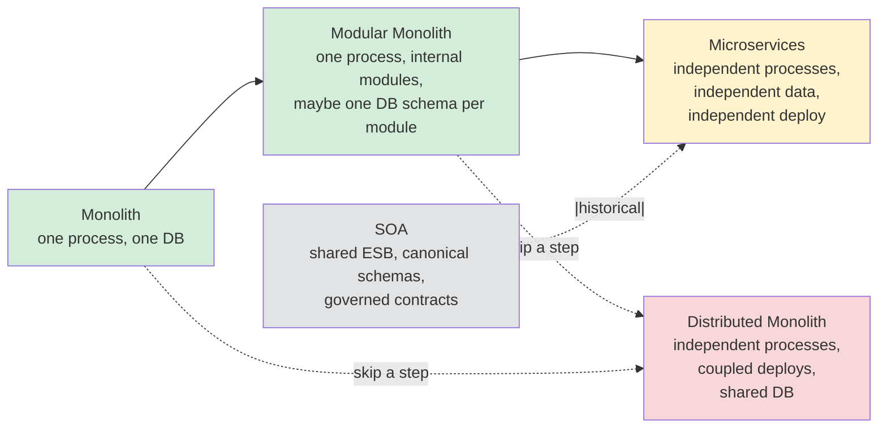
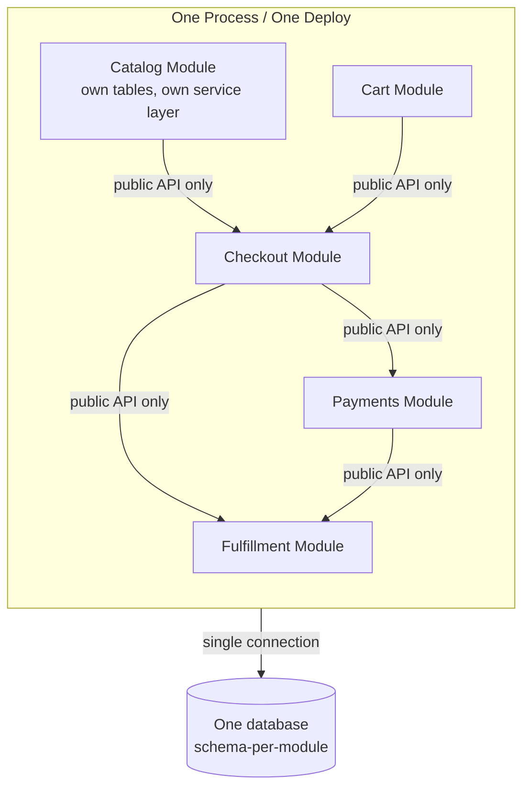
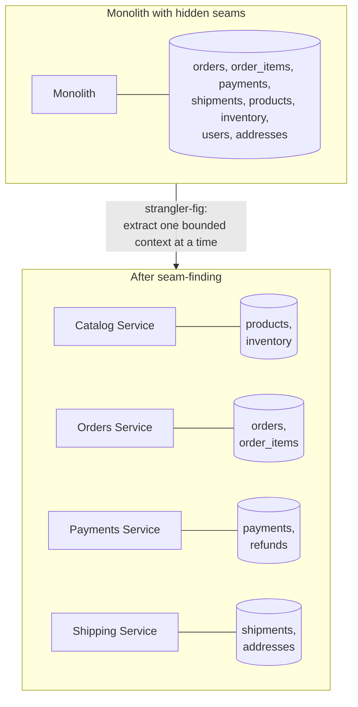

# Monolith, Modular Monolith, SOA, Microservices — When Each Wins

**Date:** 2026-04-26 | **Updated:** 2026-04-26
**Tags:** `system-design` `architecture` `microservices` `modular-monolith`

## Table of Contents

- [Summary](#summary)
- [Overview — Why The Choice Keeps Coming Back](#overview--why-the-choice-keeps-coming-back)
- [Key Concepts](#key-concepts)
  - [The Monolith — Still The Right Default](#the-monolith--still-the-right-default)
  - [The Modular Monolith — The Shape You Probably Want](#the-modular-monolith--the-shape-you-probably-want)
  - [SOA — The Bit Of History You Need To Know](#soa--the-bit-of-history-you-need-to-know)
  - [Microservices — A Real Architectural Style With Real Costs](#microservices--a-real-architectural-style-with-real-costs)
  - [Conway's Law — The Reason Your Architecture Keeps Drifting](#conways-law--the-reason-your-architecture-keeps-drifting)
  - [Microservices Prerequisites](#microservices-prerequisites)
  - [Finding The Seams — Sam Newman's Decomposition Guidance](#finding-the-seams--sam-newmans-decomposition-guidance)
- [Trade-offs Matrix](#trade-offs-matrix)
- [When To Split, When NOT To Split](#when-to-split-when-not-to-split)
- [Team Size And Service Count — A Rule Of Thumb](#team-size-and-service-count--a-rule-of-thumb)
- [Real-World Uses](#real-world-uses)
- [Anti-Patterns](#anti-patterns)
- [Design-Review Phrases That Actually Work](#design-review-phrases-that-actually-work)
- [Related](#related)
- [References](#references)

## Summary

Monolith vs microservices is not a quality scale — it's a trade between **build speed** (monolith wins) and **independent deploy/scale per team** (microservices win, _if_ you can pay for it). The strict ordering you should default to is **modular monolith first, microservices only when team size, deploy friction, observability maturity, and Conway-aligned ownership all force the split.** SOA was the 1990s/2000s pre-cursor — heavyweight ESBs, canonical schemas — and is mostly dead, but the lessons (contract-first, async messaging, governed boundaries) are still alive in microservices today. The dangerous intermediate state is the **distributed monolith**: services that have to be deployed together, share a database, and chain synchronous calls. That is strictly worse than the monolith you started with.

## Overview — Why The Choice Keeps Coming Back

Every few years a technical lead pushes "let's break this up into microservices" and a few years later somebody else pushes "let's collapse this back into a monolith." Both can be right. The actual question is never **"monolith or microservices?"** It is:

1. Where are the natural seams in this domain?
2. How many independent teams need to ship without coordinating with each other?
3. Can we afford the fixed cost (observability, CI/CD, deploy infra, on-call) that distributed systems impose?
4. What is _actually_ slow today — building features, deploying them, or scaling specific hot paths?

If the answer to (4) is "building features," more services almost always make it worse. If the answer is "scaling a specific hot path" or "two teams keep blocking each other on a single deploy pipeline," services may be the right move. The middle ground — modular monolith — answers a surprising number of these without the operational tax.

The arrows that matter: **the path through modular monolith is the safe one.** The dotted arrows into the distributed monolith are how teams skip a step and end up with the worst of both worlds.

## Key Concepts

### The Monolith — Still The Right Default

A single deployable unit that owns the full domain. One process, one binary or container, typically one database (or one logical schema-per-bounded-context inside one cluster). Most successful products start here and many stay here forever.

**What the monolith is genuinely good at:**

- **Local function calls instead of network calls.** A monolith does not have a distributed system's failure modes — no partial failure, no retries, no circuit breakers, no service discovery. A function returns or throws.
- **Atomic transactions across the whole domain.** Order, payment, and inventory tables all live in one DB; one transaction commits or rolls back. The moment you split to microservices you trade ACID for sagas, outboxes, and eventual consistency. See [CAP, PACELC, and Consistency Models](../foundations/cap-and-consistency-models.md).
- **One refactor changes the whole codebase.** Renaming a field, changing a type, or moving a method is a compiler-checked operation across millions of lines.
- **One deploy.** One pipeline, one rollback, one observability story, one on-call story.
- **One mental model.** New engineers ramp on one repo, one runtime, one deploy command.

**Where it actually breaks:**

- The build/test cycle gets slow enough that engineers cannot iterate (think: 30-minute test suite, 20-minute deploy).
- One team's deploy regularly breaks another team's feature; merge conflicts and shared release calendars become the bottleneck.
- A specific subsystem needs to scale dramatically differently from the rest (image processing, ML inference, search) and cannot be scaled in isolation.
- Different parts of the system genuinely need different runtimes (a Python ML service alongside a Java OLTP service).

Note: items 1 and 4 can be addressed without microservices — sharper module boundaries, a shared library extracted as a sidecar, or one breakout service for the heavy workload. Items 2 and 3 are real triggers.

### The Modular Monolith — The Shape You Probably Want

A **modular monolith** is a single deployable that is internally partitioned into modules with explicit boundaries: each module owns its domain entities, exposes only a public API to other modules, and ideally has its own schema or set of tables that no other module reads from directly.

Discipline that makes it work:

- **Module-level public API.** Other modules never reach into private internals. Use language-level visibility (Java packages with `package-private`, Kotlin `internal`, Go internal packages, TypeScript barrel files) to enforce.
- **Schema-per-module inside a shared database.** Each module owns its tables; reads from another module go through the public API, not through `JOIN`. This is the single rule that prevents the distributed-monolith disaster later.
- **In-process events between modules.** Decouple modules with an internal event bus (Spring `ApplicationEventPublisher`, an in-process message dispatcher) so that splitting one module out into a service later is mostly a transport change.
- **No circular dependencies between modules.** Enforce with ArchUnit (Java/Kotlin), `dependency-cruiser` (TS), `import-linter` (Python).

**Why it wins:** when you eventually need to extract `payments` into its own service because it must scale independently, you already have a clean module boundary, a clean public API, an event contract, and an isolated schema. The extraction is a transport swap — internal call becomes HTTP/gRPC, in-process event becomes Kafka — not a domain model untangling.

**Shopify** ran (and still runs) the canonical example: a Rails monolith of millions of lines, internally restructured into "components" with explicit dependency rules, enforced via static checks. They did not move to microservices; they made the monolith livable. See the references.

A common objection: "but doesn't the modular monolith just delay the decision?" Yes — and that is the point. Most projects that go straight to microservices do so before they understand their domain, then spend two years redrawing service boundaries that turned out wrong. The modular monolith lets the boundaries _move_ for free (they are package boundaries inside one repo) until the domain has stabilised. Once it stabilises, the boundaries you have are the ones to extract along.

Concrete signals you have built a real modular monolith and not just "a folder structure":

- A new engineer can answer "which module owns the `Customer` aggregate?" in under thirty seconds.
- A pull request that imports across module boundaries fails CI unless the import touches the public API.
- Each module has its own integration test suite that runs in isolation against just its own schema.
- The domain events between modules are named and documented as if they were already on the wire.
- Removing a module is a mechanical operation: delete the package, delete its tables, delete the events nobody else listens to.

### SOA — The Bit Of History You Need To Know

SOA (Service-Oriented Architecture, ~1996–2008) was the previous decade's answer to the same question. Its emblematic tooling was the **Enterprise Service Bus (ESB)** — a centralized mediation layer (TIBCO, BizTalk, WebSphere, MuleSoft) that routed, transformed, and governed messages between services using XML, SOAP, WSDL, and a "canonical data model" everyone had to agree on.

What SOA got right and microservices kept:

- Services around business capabilities, not technical layers.
- Explicit contracts between services (SOAP/WSDL → today's OpenAPI, gRPC, AsyncAPI).
- Asynchronous messaging as a first-class option.

What SOA got wrong and microservices reject:

- The smart pipe / dumb endpoint inversion. ESBs accumulated business logic, became a deployment bottleneck, and one team owned them all.
- Canonical data models — every service forced to speak one shared schema. In practice this collapsed under domain drift; bounded contexts replaced canonical models in microservices thinking.
- Heavyweight protocol (SOAP, WS-*) and tooling.

Microservices' slogan "**smart endpoints, dumb pipes**" is a direct reaction: keep routing and transport simple (HTTP, gRPC, Kafka), put the logic in the services. If you encounter SOA in the wild today, it usually shows up as a legacy ESB inside a large enterprise; the migration target is almost always "kill the ESB, replace with a service mesh + event broker." See [Service Mesh As An Architectural Decision](./service-mesh-as-architectural-decision.md).

The most useful thing to take from SOA's failure mode is a sharp warning: any time a "platform team" starts owning shared business logic in a central component (an ESB, a "common library" that everyone depends on, a shared `domain-core` package), you are reinventing the ESB. The platform layer is allowed to own _transport-level_ concerns — auth, retries, mTLS, traffic shifting, schema registry. It is not allowed to own _business_ concerns. The line is sharp on purpose.

### Microservices — A Real Architectural Style With Real Costs

Microservices are independently deployable services, each owned by a small team, each with its own data store, communicating over a network with explicit contracts. The honest definition: **a microservice is a service that you can deploy without coordinating with any other team.** That is the only test that matters.

Concrete invariants of a real microservices architecture:

| Invariant | What it means | What breaks if you skip it |
|-----------|---------------|----------------------------|
| Independent deploy | A service can ship to prod without releasing anything else | You have a distributed monolith |
| Independent data | A service owns its database; no other service reads its tables directly | You have a distributed monolith with extra steps |
| Owned by one team | One team can answer "why does this service do X?" | Bus-factor and on-call collapse |
| Explicit contracts | OpenAPI, gRPC proto, AsyncAPI — versioned and tested | Silent breaking changes during deploys |
| Backward-compatible changes | Producers add fields, never break consumers | Coordinated big-bang deploys |
| Observability built in | Distributed tracing, structured logging, RED/USE metrics | You cannot debug production |

What microservices actually buy you:

- **Independent scale.** Scale `recommendations` to 200 pods without scaling `accounting`.
- **Independent technology choices.** Python for ML, Java for OLTP, Go for proxies. Use sparingly — heterogeneity has a cost.
- **Independent failure domains.** A bug in `notifications` cannot crash `checkout`'s process.
- **Independent deploy cadence.** Two teams ship features without merging into one release.

What they cost you (the price tag in the small print):

- **Distributed-systems failure modes.** Partial failures, retries, idempotency, circuit breakers, timeout budgets, service discovery, mTLS — all become daily concerns. See [Service Discovery](./service-discovery.md).
- **No global ACID.** Cross-service consistency is sagas, transactional outbox, and idempotency keys. Plan to spend a quarter just on these patterns.
- **Network as a failure surface.** Every previously-local call now has a 99.99-percentile tail latency, a timeout, and a failure mode.
- **Operational fixed cost.** CI/CD per service, observability stack, secret rotation, deploy automation, environment management. This is real headcount.
- **Versioning and contract management.** A breaking change to one service's API is now a multi-team coordination event.

If you cannot afford that fixed cost, microservices will hurt you more than they help. That is the most-skipped sentence in this whole topic.

### Conway's Law — The Reason Your Architecture Keeps Drifting

> "Any organization that designs a system... will produce a design whose structure is a copy of the organization's communication structure." — Mel Conway, 1968

The practical translation: **your service boundaries will eventually mirror your team boundaries, whether you want them to or not.** Two teams sharing one service eventually splits the service or merges the teams. One team owning two services eventually merges them or splits the team.

The actionable form is the **Inverse Conway Maneuver**: design the team structure you want first, and the architecture follows. If you want a `payments` service owned by one team, you need a payments team that exists, has a tech lead, an on-call rotation, and a roadmap.

Symptoms of Conway misalignment:

- "Everyone has to coordinate with team X to ship anything." — team X owns a service that everybody else depends on synchronously; either flip the dependency to async, or split the service.
- "We have a service per team, but every feature touches every service." — bounded contexts are wrong; the seams are not where the service boundaries are.
- "One team owns 12 services." — either six of them should merge, or you need three teams.

### Microservices Prerequisites

Sam Newman's prerequisites are often quoted but rarely actually checked. Treat them as a literal checklist before any greenfield service split:

- [ ] **Conway-aligned teams.** One team per service (or per small group of related services), with a clear product owner.
- [ ] **DevOps maturity.** Self-service CI/CD per service. Push-button deploy, push-button rollback. If a deploy needs a ticket to ops, you are not ready.
- [ ] **Observability investment.** Distributed tracing (OpenTelemetry), structured logs with trace correlation, golden-signal dashboards, alert routing per service. If you cannot answer "which service is slow?" in 30 seconds, you are not ready.
- [ ] **Data ownership per service.** Every service has its own database. No cross-service `JOIN`. No "shared database for reporting" — that is a distributed monolith with a reporting alibi.
- [ ] **Versioned contracts.** OpenAPI / gRPC / AsyncAPI checked into source control, contract-tested in CI (Pact, Schemathesis, Buf breaking-change detection).
- [ ] **A deployment substrate.** Kubernetes, ECS, Nomad — something that lets you run N services without N hand-rolled deploys. With service discovery, secrets, mTLS.
- [ ] **A cross-cutting concerns story.** Auth, rate limiting, retries, circuit breakers — solved once at the platform layer (gateway + service mesh), not re-implemented per service.

If you check fewer than 5 of those, **stop and build the modular monolith.** The split can wait.

A useful pre-mortem: imagine production is on fire at 3 a.m. and one specific service is the suspect. Walk through the steps you'd take. Can you find the right log lines correlated to the trace ID without grep-ing across 40 cluster nodes? Can you roll the service back without rolling its peers back? Can you confirm whether the bug is upstream or downstream in under five minutes? If the answers are vague, the prerequisites are not in place — the split will turn one outage into a series of cascading ones.

Two prerequisites that are routinely under-specified:

- **Idempotency by default.** Once you have a network between services, retries are mandatory. Retries without idempotency are corruption. Every state-changing endpoint needs an idempotency key, every event consumer needs deduplication. This is not optional, and it is non-trivial to retrofit into an existing monolith.
- **Backwards-compatible schema evolution.** A monolith deploys all its code at once; a producer and a consumer of an event are always in sync. In microservices they are not. Every event schema and every API needs an explicit additive-only evolution policy (Protobuf field-number rules, Avro schema registry, OpenAPI deprecation policies). Without this, every release is a coordination meeting.

### Finding The Seams — Sam Newman's Decomposition Guidance

When you have decided to split, the question becomes _where to cut?_ Newman's guidance (from _Building Microservices_, 2nd ed.) is the canonical playbook:

1. **Identify bounded contexts (DDD).** A bounded context is a chunk of the domain with its own ubiquitous language, its own model, its own invariants. The catalog's "Product" is not the same Product as fulfillment's "Product." Each bounded context is a candidate seam. Run an Event Storming or Domain Storytelling workshop to surface them; do not pick seams from architecture diagrams alone.
2. **Look for places where data is owned versus consumed.** A service should own data exactly once. If two services both update `orders` row, that's not two services — it's one service split into two pieces.
3. **Cut along the line of least change-coupling.** Use commit history (`git log` or [code-maat](https://github.com/adamtornhill/code-maat)) to find files that change together. Files that always change together are one module. Files that change independently are candidate splits.
4. **Cut along organizational boundaries (Conway).** Whatever the data says, the team-ownership model wins long-term.
5. **Strangler-fig migration, not big-bang rewrites.** Route traffic from the monolith to the new service incrementally; keep the monolith as the source of truth until the new service is provably stable.
6. **Database first, then code.** Before extracting code, separate the data: split tables by bounded context inside the monolith's DB. Once that's clean, the code split becomes mechanical.
7. **Pick a vertical slice, not a horizontal layer.** "Auth service" or "shared utilities service" cutting horizontally across all features is an anti-pattern — it touches every team. A vertical slice (e.g., "shipping" — its API, business logic, and data) is owned end-to-end.

## Trade-offs Matrix

| Concern | Monolith | Modular Monolith | SOA (legacy) | Microservices |
|---------|----------|------------------|--------------|---------------|
| **Build / iteration speed for small team** | Best | Best | Worst | Worst |
| **Independent deploy per team** | No | No | Limited (ESB couples) | Yes |
| **Independent scale** | No | Limited | Limited | Yes |
| **ACID across domain** | Yes | Yes | No | No (sagas) |
| **Refactor cost** | Cheap (compiler) | Cheap | Expensive | Very expensive (cross-service) |
| **Operational fixed cost** | Low | Low | High (ESB ops) | High |
| **Failure modes** | Process crash = whole app | Process crash = whole app | ESB outage = everything | Partial failure, network |
| **Onboarding new engineer** | One repo | One repo, learn modules | Many repos + ESB | Many repos + platform |
| **Right team size** | 1–8 engineers | 8–50 engineers | (avoid) | 50+ engineers, multiple teams |
| **Observability requirement** | Logs + metrics | Logs + metrics | Centralized via ESB | Distributed tracing mandatory |
| **Data store** | One DB | One DB, schema per module | Often shared DBs | One per service |
| **Where bugs hide** | In code | In code | In ESB transformations | In contracts and network |

## When To Split, When NOT To Split

**Split when (any 2+ apply):**

- Two or more teams regularly block each other on the same release pipeline.
- A specific subsystem has a 10x+ different scaling profile (e.g., search, ML, video processing).
- A specific subsystem has a 10x+ different reliability profile (e.g., payments must stay up while marketing pages can fail).
- Different regulatory boundaries demand isolation (PCI, HIPAA — payment or PHI data segregated).
- The domain has clearly separable bounded contexts whose data ownership is already disjoint in the monolith.
- A team needs a different runtime/language for a legitimate reason (ML in Python, the rest in Java).

**Do NOT split when (any apply):**

- The team is fewer than ~10 engineers — there is not enough capacity to operate the platform.
- You do not yet have automated CI/CD, observability, and rollback.
- You cannot point to a bounded context whose data ownership is clean inside the monolith.
- The pain is "the build is slow" — that is fixable inside a monolith (test sharding, build caching, modular rebuilds).
- The pain is "the codebase is messy" — splitting will make a mess into many distributed messes.
- The pain is "we want to use Kubernetes / shiny tech" — that is resume-driven design and you will pay for it.
- The "service" you'd extract has fewer than ~3 endpoints and no independent data — it's a function, not a service.

A short decision script:

1. Name the bottleneck in one sentence. ("Two teams keep merging conflicting migrations." / "Search needs to scale 50x while the rest does not." / "Our test suite takes 45 minutes.")
2. List two or three solutions inside the monolith first (test sharding, feature flags, trunk-based, schema-per-module, extract a worker pool).
3. Only if those do not solve the named bottleneck, list the smallest possible service extraction.
4. Compute the operational fixed cost of that extraction (engineer-quarters of CI/CD, observability, on-call, data migration). Be honest.
5. If (4) is larger than the cost of (2), do (2). Revisit in six months.

## Team Size And Service Count — A Rule Of Thumb

Heuristics from observed practice (Amazon, Spotify, ThoughtWorks):

| Team count | Reasonable service count | Notes |
|------------|--------------------------|-------|
| 1 team (~5–8 eng) | 1 service (modular monolith) | Anything more is overhead; you don't have on-call coverage for 4 services. |
| 2–3 teams | 1 modular monolith + maybe 1 extracted service | Extract one thing at a time; prove the platform works first. |
| 4–10 teams | One service per team, plus shared platform services | Conway-aligned. Each team owns 1–3 services. |
| 10+ teams | 2–4 services per team, with explicit platform team(s) | Now you need a platform org and a paved road. |

Amazon's **two-pizza team** rule (a team that can be fed with two pizzas, ~6–10 people) gives the lower bound of "team large enough to own a service end-to-end including on-call." If a service does not have a two-pizza team owning it, it has no owner, and it will rot.

Symmetric rule: **a single team should not own more services than it can on-call cover.** If a team of 6 owns 15 services, every page is somebody scrambling to remember what the service does. Cap it.

A second-order rule: **count synchronous dependencies, not services.** A team that owns 4 services where each calls 3 of the others synchronously has, for incident purposes, one tightly-coupled system with extra deploy steps. A team that owns 10 services connected only through async events and idempotent consumers has 10 genuinely-independent operational units. The number that drives on-call pain is the synchronous fan-out, not the service count.

## Real-World Uses

- **Amazon — two-pizza teams + microservices (~2002 onward).** The famous Bezos "API mandate" in 2002 forced every internal team to expose data only via service interfaces, with no exceptions. This is the origin of the modern microservices style. Crucially, Amazon paired this with team structure: each service owned by a two-pizza team with full operational responsibility ("you build it, you run it"). The architectural choice and the team choice are inseparable.

- **Shopify — modular monolith ("the Shopify monolith").** A multi-million-line Rails app, internally split into "components" with explicit dependency rules enforced by static analysis (`packwerk`). They have explicitly _chosen not to_ go microservices for the core commerce platform; they extract services only when there is a forcing function (e.g., search, checkout). Modular boundaries plus aggressive testing keep deploy cadence high. See [Designing Shopify-style Commerce](../case-studies/e-commerce/design-shopify.md) for the case study.

- **Basecamp — DHH's "Majestic Monolith."** A deliberate, public stance against microservices for a SaaS at Basecamp's scale (~50 engineers, millions of users). Single Rails app, single deploy, no microservices. The argument: the operational complexity tax of microservices does not pay back at this team size. Worth reading even if you disagree.

- **Netflix — microservices at scale (~500+ services).** Netflix is the canonical example, but note: they also built and open-sourced a generation of platform tooling (Hystrix, Eureka, Zuul, Ribbon) precisely because the microservices fixed cost was unmanageable without it. The Netflix architecture is enabled by a substantial platform investment — that is the part that gets skipped in cargo-cult adoption.

- **Spotify — squads / tribes / chapters / guilds.** The "Spotify model" is primarily a team structure (squads = small autonomous teams, tribes = collections of squads in one product area), with services aligned to squad ownership. Spotify themselves have publicly clarified that the model is descriptive, not prescriptive; copying the org chart without the underlying engineering culture and platform is the most common failure.

- **Hexagonal/Clean architecture inside each service.** Whether you stay monolith or go microservices, the internal design of each unit matters. See [Hexagonal, Clean Architecture, and DDD](./hexagonal-clean-ddd.md) — the patterns that make a monolith refactorable into microservices later are the same patterns that make a microservice testable and replaceable.

## Anti-Patterns

- **Distributed Monolith.** Multiple services that must be deployed together because they share a database, share a contract change, or have synchronous chains where any failure cascades. Symptoms: a "release train" across services; a schema migration that requires coordinated deploys; a `JOIN` across services replaced by a chain of N HTTP calls. This is strictly worse than a monolith — you have all the network failure modes _and_ all the deploy-coupling, with none of the independence. **Fix:** consolidate back into a service per bounded context, give each its own DB, use async events for cross-context flows.

- **Premature microservices.** Splitting before you have CI/CD, observability, on-call rotations, or even a clear domain model. Result: 5 services owned by 4 engineers, none of whom can keep them all healthy. **Fix:** stop splitting; build the modular monolith and the platform; extract only when forced.

- **No service ownership.** A service exists but no team owns it; it rots, deps go stale, on-call is "ask in #help." **Fix:** name an owning team or delete the service. There is no third option.

- **Shared database across services.** Two services writing to the same table is one service in disguise. Two services reading from the same table couples their schema migrations. **Fix:** strict DB-per-service; cross-service reads via API; cross-service derived data via CDC + event-driven projection.

- **Chatty synchronous chains.** Service A → B → C → D, all synchronous, each adds a 50 ms p99 — your end-to-end p99 is now unusable. **Fix:** flatten to event-driven where possible; co-locate data via projections; use a backend-for-frontend (BFF) to fan out.

- **Canonical data model resurrected as "shared schema."** One central `User` schema that every service must use. Bounded contexts revolt; every change is a multi-team negotiation. **Fix:** each context defines its own model; translate at boundaries.

- **The "auth service" cutting across all features.** Pulling cross-cutting concerns into a horizontal service that everybody calls synchronously. Becomes the new ESB. **Fix:** sidecar pattern or service mesh for transport-level concerns; identity tokens (JWT) verified locally; no synchronous call to "auth" in the hot path.

- **Microservices to fix culture problems.** "Teams keep breaking each other's code in the monolith — let's split." Splitting hides the symptom; the contract-breaking problem reappears as production incidents. **Fix:** add tests, modules, code review, and ownership in the monolith first.

- **Resume-driven design.** Choosing microservices because they are on a job ad. **Fix:** name the business problem first; pick the simplest architecture that solves it.

- **"Nano-services."** Splitting so finely that each service does one HTTP-handler's worth of work. The overhead per service (deploy, observability, on-call, network hop) dwarfs the work. **Fix:** consolidate around bounded contexts, not endpoints. A service should own a domain capability, not a function.

- **Re-implementing transactions across services with two-phase commit.** Cross-service 2PC over HTTP is fragile and a known anti-pattern (the coordinator becomes a single point of blocking failure). **Fix:** model it as a saga with explicit compensations, or rethink whether the operation should be split at all — sometimes the right answer is "these two things belong in one service because they must commit together."

- **Distributed transaction smuggled in as "we'll just retry until it works."** Sounds innocent; produces double-charges and inventory corruption when retries run without idempotency. **Fix:** idempotency keys end-to-end, deterministic dedup at every consumer.

## Design-Review Phrases That Actually Work

What to say instead of "we should use microservices":

- "The pain is two teams blocking each other on the release pipeline. We have two options: split `payments` into a service, or move to trunk-based development with feature flags. Let's quantify the deploy-coupling first."
- "This is a Conway problem, not a code problem. We have one service owned by three teams. Either give it to one team, or split it along team boundaries."
- "Before extracting `search`, let's draw the data ownership boundary inside the monolith. If `search` reads from 6 tables owned by other modules, we are not ready to extract."
- "We don't need microservices; we need a modular monolith with `packwerk`-style enforcement. Most of the deploy pain goes away with trunk-based + feature flags."
- "What's the smallest seam we can cut to prove the platform works? Pick one bounded context, run it for a quarter, then decide whether to extract a second."
- "We are about to ship a distributed monolith. Both services must deploy together and share a DB. That's strictly worse than what we have. Let's roll back the split."
- "If we split this, the on-call rotation goes from 6 engineers to 3 per service. We don't have the headcount; we'd be paging the same person every other week."
- "What's the rollback story? If the new service crashes in prod, can we route 100% of traffic back to the monolith path in under five minutes? If not, we are not ready to cut over."
- "We need read-your-writes for the user's own profile, not global linearizability. That's a session-scoped guarantee — see the consistency doc — and it does not require a service split."

## Related

- [Hexagonal, Clean Architecture, and DDD](./hexagonal-clean-ddd.md) — the inside-the-service patterns that make any of these styles refactorable. Critical for the "modular monolith → extract a service later" path.
- [Service Discovery](./service-discovery.md) — once you have multiple services, how do they find each other? Required reading before any extraction.
- [Service Mesh As An Architectural Decision](./service-mesh-as-architectural-decision.md) — the modern answer to cross-cutting concerns (mTLS, retries, traffic shifting) that SOA tried to solve with the ESB.
- [Designing Shopify-style Commerce](../case-studies/e-commerce/design-shopify.md) — the modular monolith case study at scale.
- [CAP, PACELC, and Consistency Models](../foundations/cap-and-consistency-models.md) — the consistency vocabulary you'll need the moment you split a domain across services.

## References

- Sam Newman, _Building Microservices_, 2nd edition (O'Reilly, 2021) — the canonical reference. Chapters 3 (decomposition) and 4 (communication) are the seam-finding playbook used here.
- Sam Newman, _Monolith to Microservices_ (O'Reilly, 2019) — the strangler-fig and incremental-migration guidance.
- Martin Fowler, ["MonolithFirst"](https://martinfowler.com/bliki/MonolithFirst.html) (2015) — the canonical argument for starting with a monolith.
- Martin Fowler, ["Microservice Premium"](https://martinfowler.com/bliki/MicroservicePremium.html) — the productivity penalty microservices impose at small scale.
- Alberto Brandolini, _Introducing EventStorming_ — and Stefan Hofer / Henning Schwentner, _Domain Storytelling_ (Addison-Wesley, 2021) — workshop techniques for finding bounded contexts before drawing services.
- Eric Evans, _Domain-Driven Design_ (Addison-Wesley, 2003) — the bounded-context vocabulary that microservices borrow.
- Shopify Engineering, ["Deconstructing the Monolith: Designing Software that Maximizes Developer Productivity"](https://shopify.engineering/deconstructing-monolith-designing-software-maximizes-developer-productivity) (2019) and ["Under Deconstruction: The State of Shopify's Monolith"](https://shopify.engineering/shopify-monolith) (2023) — the modular-monolith case study and the `packwerk` tooling.
- David Heinemeier Hansson, ["The Majestic Monolith"](https://m.signalvnoise.com/the-majestic-monolith/) (2016) and ["The Majestic Monolith can become The Citadel"](https://m.signalvnoise.com/the-majestic-monolith-can-become-the-citadel/) (2020) — the explicit anti-microservices stance from Basecamp.
- Werner Vogels, ["A Conversation with Werner Vogels"](https://queue.acm.org/detail.cfm?id=1142065) (ACM Queue, 2006) — Amazon's two-pizza teams and "you build it, you run it" articulated by the CTO.
- Mel Conway, ["How Do Committees Invent?"](http://www.melconway.com/Home/Committees_Paper.html) (Datamation, 1968) — the original Conway's Law paper.
- Adam Tornhill, _Your Code as a Crime Scene_ (Pragmatic Bookshelf, 2015) — using version-control history and `code-maat` to find seams from change-coupling.
- James Lewis and Martin Fowler, ["Microservices"](https://martinfowler.com/articles/microservices.html) (martinfowler.com, 2014) — the article that crystallised the term and the "smart endpoints, dumb pipes" framing.
- Simon Brown, ["Modular Monoliths"](https://www.youtube.com/watch?v=5OjqD-ow8GE) (talk) — the precise definition of the modular monolith plus the bridge to microservices later.
- Vaughn Vernon, _Implementing Domain-Driven Design_ (Addison-Wesley, 2013) — the practitioner-level companion to Evans, with explicit advice on translating bounded contexts to deployable units.
