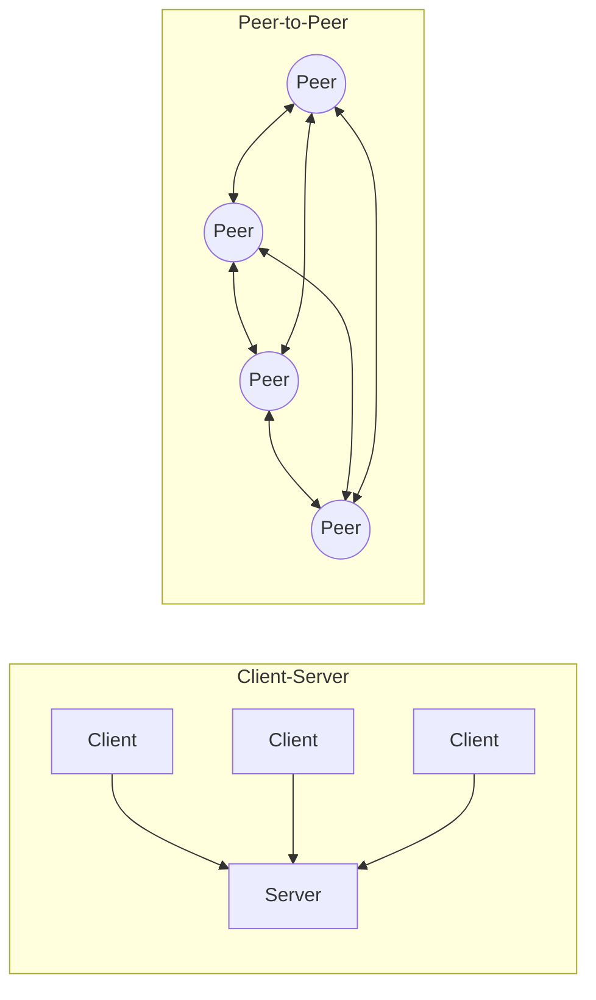
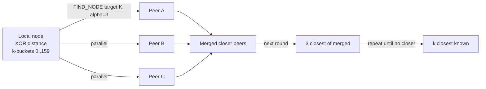

# Peer-to-Peer Architecture — DHTs, Gossip, BitTorrent, IPFS

**Date:** 2026-04-26 | **Updated:** 2026-04-26
**Tags:** `system-design` `architecture` `p2p` `dht` `gossip`

## Table of Contents

- [Summary](#summary)
- [Why This Matters](#why-this-matters)
- [The P2P Principle — No Central Server, Equal Roles](#the-p2p-principle--no-central-server-equal-roles)
- [Key Concepts](#key-concepts)
  - [Kademlia DHT — XOR Distance and k-Buckets](#kademlia-dht--xor-distance-and-k-buckets)
  - [Chord DHT — Consistent Hashing Ring and Finger Tables](#chord-dht--consistent-hashing-ring-and-finger-tables)
  - [Gossip Overlays — Push, Pull, Push-Pull](#gossip-overlays--push-pull-push-pull)
  - [BitTorrent — Tracker, Pieces, and Rarest-First](#bittorrent--tracker-pieces-and-rarest-first)
  - [Content Addressing — IPFS and CIDs](#content-addressing--ipfs-and-cids)
  - [libp2p — The Modular P2P Stack](#libp2p--the-modular-p2p-stack)
  - [NAT Traversal — STUN, TURN, ICE, Hole Punching](#nat-traversal--stun-turn-ice-hole-punching)
  - [Churn Handling](#churn-handling)
- [Trade-offs vs Client-Server](#trade-offs-vs-client-server)
- [When P2P Is Right vs Wrong](#when-p2p-is-right-vs-wrong)
- [Code Examples](#code-examples)
  - [Kademlia Node Skeleton (Python Pseudocode)](#kademlia-node-skeleton-python-pseudocode)
  - [Gossip Round](#gossip-round)
- [Real-World Uses](#real-world-uses)
- [Anti-Patterns](#anti-patterns)
- [Related](#related)
- [References](#references)

## Summary

Peer-to-peer (P2P) architecture replaces the client-server asymmetry with a mesh of equal participants — every node is both client and server, locating data and routing for others. The two foundational primitives are **distributed hash tables** (Kademlia, Chord) for structured key→peer lookup in `O(log N)` hops, and **gossip overlays** for unstructured probabilistic dissemination. P2P wins where censorship resistance, infrastructure cost, or content-distribution bandwidth dominate (BitTorrent, IPFS, Bitcoin, Cassandra membership). It loses where you need transactional consistency, low-latency steady-state RPC, or strict membership control.

## Why This Matters

Most backend engineers treat P2P as either "Bitcoin" or "BitTorrent" and stop there. That's a mistake — the same primitives ship inside systems you operate every day:

- Cassandra and DynamoDB use **gossip** for cluster membership and failure detection.
- Service meshes and Tailscale/WireGuard use **NAT traversal** and DHT-style discovery to build mesh overlays.
- Modern CDN and content systems (IPFS, Cloudflare R2 with CIDs, video swarms) lean on **content addressing**.
- Consensus protocols (Bitcoin block propagation, Ethereum's devp2p) use gossip to flood transactions and blocks.

The vocabulary below — XOR distance, finger tables, push-pull gossip, rarest-first, hole punching — is what lets you read those systems' design docs, debate trade-offs, and recognize when a problem is actually shaped like a P2P problem instead of forcing a centralized solution onto it.

## The P2P Principle — No Central Server, Equal Roles

In a client-server system, clients initiate, servers serve, and the addressing model is "I know the server's hostname." In P2P, every node has a **node ID** (usually a hash of a public key), maintains a **routing table** of other peers, and answers requests on behalf of the network. The four properties that matter:

1. **Symmetry** — any peer can play any role: lookup, storage, routing, validation.
2. **Self-organization** — joins/leaves are local events; no global config.
3. **Decentralized addressing** — keys map to peers via a deterministic function (hash, XOR distance, ring position), not a directory service.
4. **Tolerance to churn** — peers come and go constantly; protocol must heal.



The asymmetry of client-server is also its convenience: one place to authenticate, one place to log, one place to upgrade. P2P trades all of that away for the four properties above. Every design decision in this doc is some form of "how do we get a useful property back without re-introducing a central server?"

## Key Concepts

### Kademlia DHT — XOR Distance and k-Buckets

Kademlia (Maymounkov & Mazières, 2002) is the DHT used by BitTorrent's Mainline DHT, Ethereum's discovery protocol, IPFS, and libp2p's default Kad-DHT. Three ideas make it the practical winner over earlier designs (Chord, Pastry, Tapestry):

**1. XOR distance metric.** Node IDs and keys both live in a 160-bit (or 256-bit) keyspace. The distance between two IDs `x` and `y` is `d(x,y) = x XOR y` interpreted as an integer. XOR is symmetric (`d(x,y) = d(y,x)`), satisfies the triangle inequality, and — critically — is **unidirectional**: for any `x` and distance `d`, there is exactly one `y` at that distance. This means lookups converge regardless of which side initiates.

**2. k-buckets.** Each node maintains, for each bit-prefix length `i` from 0 to 159, a bucket of up to `k` peers (typically `k=20`) whose IDs share exactly `i` leading bits with the local node's ID. This produces an exponentially detailed view: lots of peers close to you, fewer further away. Buckets are kept fresh by an LRU eviction policy that prefers long-lived peers (resilience to churn and Sybil attacks).

**3. Iterative parallel lookup.** To find the `k` closest peers to a target key, the node picks the `α` (typically 3) closest peers it knows, sends them `FIND_NODE` in parallel, merges the results, picks the next `α` closest from the merged set, repeats. Each round halves the remaining XOR distance on average, giving `O(log N)` hops. The use of parallelism (`α > 1`) hides slow or dead peers without timing out.



Storage in Kademlia is "store on the `k` closest peers to the key's hash." Republishing happens periodically to survive churn.

### Chord DHT — Consistent Hashing Ring and Finger Tables

Chord (Stoica et al., SIGCOMM 2001) is older but pedagogically clean and still influential. It arranges all node IDs on a circular keyspace (mod `2^m`). A key `k` is owned by its **successor** — the first node clockwise from `k` on the ring. This is plain consistent hashing.

The trick that makes lookups fast: each node maintains a **finger table** with `m` entries. Entry `i` points to the successor of `(n + 2^i) mod 2^m`. So one finger jumps half the ring away, the next a quarter, the next an eighth, and so on. Lookup forwards each hop to the finger that overshoots the target the least without passing it — halving the remaining distance each step, giving `O(log N)` hops.

Joins and leaves require maintaining the finger table and a separate **stabilization** protocol that periodically checks immediate successor/predecessor. Chord's weakness vs Kademlia is that lookup is unidirectional (clockwise only), so a single dead finger can stall a lookup, and the protocol does not naturally accumulate routing information from incoming requests the way Kademlia does.

| Aspect | Kademlia | Chord |
|--------|----------|-------|
| Distance metric | XOR (symmetric, unidirectional in the math sense) | Modular ring distance (clockwise) |
| Routing table | k-buckets (exponential, redundant) | Finger table (m entries) |
| Lookup | Iterative + parallel (`α`) | Recursive (or iterative) sequential |
| Hops | `O(log N)` | `O(log N)` |
| Refresh | Piggybacks on every traffic | Separate stabilization loop |
| Where used | BitTorrent Mainline, Ethereum, IPFS, libp2p | Cassandra-era research, academic |

### Gossip Overlays — Push, Pull, Push-Pull

Gossip protocols (also called **epidemic protocols**, after Demers et al.'s 1987 Xerox PARC paper "Epidemic Algorithms for Replicated Database Maintenance") spread information by random pairwise exchange. Each round, each node picks a random peer and exchanges state. Three variants:

- **Push.** Infected node sends update to a random peer. Fast initial spread, but late-stage bandwidth waste — most pushes hit already-infected peers.
- **Pull.** Each peer periodically asks a random other peer "got anything new?" Slow start (no infection if no peer is infected), excellent end-game (each pull discovers all remaining missing items quickly).
- **Push-pull.** Combine: each round, exchange both ways. Empirically converges in `O(log N)` rounds with the lowest combined message cost. This is what production systems use.

Mathematically, push-pull is the gold standard: any single update reaches all `N` nodes in `O(log N)` rounds with high probability, and the per-node fanout is small (often 1–3 peers per round). Failure detection layers on top: phi-accrual, SWIM, or simple heartbeat-with-suspicion.

**Where gossip shines:**
- Membership lists (Cassandra, Consul, Serf)
- Failure detection (SWIM in Hashicorp products, Akka, Cassandra)
- Block and transaction propagation (Bitcoin, Ethereum)
- Anti-entropy / Merkle reconciliation (DynamoDB, Cassandra read repair)
- Configuration distribution

**Where gossip fails:**
- Anything requiring a total order (use consensus, not gossip)
- Tight latency budgets (gossip is per-round; rounds are 100ms–1s)
- Small clusters where flat broadcast is cheaper

### BitTorrent — Tracker, Pieces, and Rarest-First

BitTorrent (Bram Cohen, 2001) was the first wildly successful P2P content-distribution protocol. Its data model:

- A **torrent** is described by a `.torrent` metainfo file: filename, total length, piece length (typically 256KB–4MB), and the SHA-1 hash of each piece.
- A **swarm** is the set of peers currently uploading or downloading that torrent.
- A **tracker** is an HTTP service that maintains a list of peers in each swarm. Modern BitTorrent supplements (or replaces) trackers with the **Mainline DHT** (Kademlia) for trackerless operation, and with **PEX** (Peer Exchange) where peers gossip peer lists directly.

**Piece-picking is the heart of the protocol.** Naive sequential download starves the swarm: late peers can't find rare pieces because everyone has the same head and missing tail. BitTorrent uses **rarest-first**: each peer prefers to download pieces that are scarcest in its visible swarm. This maximizes piece diversity and keeps the swarm productive even as the original seeder leaves. Two refinements:

- **Random first piece.** Until the peer has its first piece, it picks randomly — rarest-first needs you to be uploading something to get reciprocation.
- **Endgame mode.** When only a few pieces remain, the peer requests them from many peers in parallel and cancels duplicates as they arrive; trades bandwidth for tail latency.

Incentives are enforced by **choking**: each peer uploads to the few peers giving it the best download rate (typically 4) and choke the rest, with one **optimistic unchoke** slot rotated every ~30 seconds to discover better partners. This tit-for-tat discourages free-riders.

The full protocol is specified in BEP-3 (Bittorrent Enhancement Proposal 3). DHT, magnet links, and PEX are layered extensions (BEP-5, BEP-9, BEP-11).

### Content Addressing — IPFS and CIDs

Traditional URLs are **location-addressed**: `https://example.com/foo.png` says where to fetch, not what. Content addressing flips this — the address **is** the content's hash. If two systems have different bytes under the same address, one is wrong by definition.

**Content Identifiers (CIDs)** in IPFS are self-describing multihashes: a version, a codec (raw, dag-pb, dag-cbor), and the hash itself (typically SHA-256). A CID like `bafybeigdyrzt5sfp7udm7hu76uh7y26nf3efuylqabf3oclgtqy55fbzdi` deterministically identifies one specific blob. Two consequences:

1. **Verification is intrinsic.** If you fetch by CID, you can hash the bytes and verify; no signature or TLS is needed for integrity (you still need them for confidentiality and trust in the requester).
2. **Deduplication is automatic.** Identical content has identical CID; one copy serves all referrers.

IPFS layers a Merkle DAG on top: large files are chunked, chunks are hashed, the chunk hashes form intermediate nodes, and the root CID identifies the whole tree. Edits at one chunk only reshape the path from that chunk to the root — the rest of the tree is shared. (Cross-link: see [Merkle Trees](../data-structures/merkle-trees.md) for the broader pattern.)

Discovery in IPFS uses Kademlia: a node providing CID `C` periodically announces `(C, my_peer_id)` to the `k` closest peers in the Kad-DHT. A fetcher resolves `C` by looking up those peers, then opens a libp2p connection to one and downloads the chunks.

### libp2p — The Modular P2P Stack

libp2p emerged from IPFS as a reusable P2P networking toolkit and is now used by Ethereum 2.0 (consensus layer), Polkadot, Filecoin, and many other projects. It splits the P2P stack into pluggable layers:

| Layer | Responsibility | Examples |
|-------|----------------|----------|
| Transport | Connect bytes to bytes | TCP, QUIC, WebSocket, WebTransport, WebRTC |
| Security | Authenticate & encrypt | Noise, TLS 1.3 |
| Multiplexing | Many streams over one connection | yamux, mplex |
| Peer routing | Find peer for a given peer ID | Kademlia DHT, mDNS, Rendezvous |
| Content routing | Find providers for a given CID | Kademlia DHT, Bitswap |
| Pub/sub | Topic-based messaging | gossipsub, floodsub, episub |
| NAT traversal | Reach peers behind firewalls | AutoNAT, Circuit Relay v2, hole punching (DCUtR) |

The key insight: every modern P2P system needs the same dozen primitives. libp2p makes them composable so application authors only pick the protocols they care about. The **Peer ID** is a hash of a public key; every peer is cryptographically identifiable from first contact.

### NAT Traversal — STUN, TURN, ICE, Hole Punching

Most home and mobile peers sit behind a NAT — they have no public IP and cannot accept inbound connections. Solving this is a precondition for any consumer-grade P2P system.

- **STUN** (Session Traversal Utilities for NAT, RFC 8489) is a tiny request/response protocol: ask a public STUN server "what IP and port do you see me from?" The server replies with the **server-reflexive address**. Two peers exchanging their reflexive addresses can sometimes connect directly.

- **TURN** (Traversal Using Relays around NAT, RFC 8656) is the fallback: when direct connection is impossible (symmetric NAT, restrictive firewall), a TURN server **relays** traffic. This works always but costs bandwidth and is the last resort.

- **ICE** (Interactive Connectivity Establishment, RFC 8445) is the orchestrator: each peer gathers candidate addresses (host, server-reflexive via STUN, relayed via TURN), exchanges them via signaling, and tries connectivity checks in parallel, picking the best working pair. WebRTC uses ICE; libp2p's hole-punching protocol (DCUtR) is a P2P-native equivalent.

- **Hole punching** is the trick that makes most peer-to-peer connections work without TURN. Two peers behind NATs both initiate outbound packets to each other's reflexive addresses simultaneously. Many NATs, having seen the outbound packet, then accept the matching inbound packet. This works for most cone-NAT types; it fails for symmetric NATs, where TURN relays are unavoidable.

**WireGuard and Tailscale.** Tailscale uses WireGuard for the data plane and a coordination service (DERP relays + STUN) plus its own discovery for the control plane. The result is mesh networking where any laptop on any Wi-Fi can reach any other laptop, with TURN-style DERP relays as fallback. This is essentially "P2P with a centralized discovery service" — a pragmatic hybrid.

### Churn Handling

Peers join and leave constantly — the empirical median peer lifetime in BitTorrent swarms is on the order of minutes to hours, and similar in many open networks. The protocol must absorb this without service degradation. Standard techniques:

- **Replication factor.** Store each item on `k` peers (Kademlia uses `k=20`). Probability that all `k` are simultaneously gone is small.
- **Periodic republish.** The owner of an item periodically re-stores it to the current `k` closest peers. The set drifts as peers leave; republish heals.
- **Refresh routing tables.** Buckets/fingers that have not been touched in a while get re-checked.
- **Failure detection.** Suspicion + accrual (phi-accrual), not binary up/down. (Cross-link: [Failure Detection](../reliability/failure-detection.md).)
- **Eviction policies.** Kademlia's "prefer long-lived peers" rule is a Sybil mitigation: an attacker spinning up new nodes can't easily displace established peers in your buckets.

## Trade-offs vs Client-Server

| Axis | Client-Server | P2P |
|------|---------------|-----|
| Latency (steady state) | Low — one hop, known endpoint | High — `O(log N)` hops + NAT traversal handshake |
| Scaling cost | Servers grow with users | Effectively free — peers bring resources |
| Single point of failure | Yes (central server) | No |
| Operational complexity | Low — one stack to operate | High — protocol-level debugging, churn, attacks |
| Censorship resistance | Low | High |
| Consistency model | Easy (one writer) | Hard (eventual at best, often weaker) |
| Membership control | Trivial | Hard (Sybil, eclipse attacks) |
| Observability | Centralized logs | Distributed tracing across untrusted peers |
| Auth & identity | Server is the trust anchor | Cryptographic peer IDs, no central CA |
| Bandwidth distribution | Provider pays | Distributed across users |

The trade-off is best summarized as: **P2P trades steady-state latency and operational simplicity for unbounded scaling, censorship resistance, and zero infrastructure cost.** Hybrids (Tailscale, BitTorrent with trackers, Spotify's old P2P client) often win in practice — centralized control plane for discovery and identity, P2P data plane for bandwidth.

## When P2P Is Right vs Wrong

**P2P is right when:**

- **Content distribution dominates bandwidth.** Game patches, OS images, video — anyone seeding helps everyone download. Blizzard, World of Warcraft, and Steam used BitTorrent for patch distribution for years.
- **Censorship resistance is a feature.** Cryptocurrencies, Tor, archival projects (Internet Archive's IPFS mirrors), uncensorable publishing.
- **No single party should own infrastructure.** Federated, decentralized, or open networks: Bitcoin, Ethereum, Mastodon (federated, not strictly P2P, but same family), Matrix.
- **You want zero infrastructure cost.** Open-source projects shipping multi-GB datasets via BitTorrent or IPFS instead of paying for CDN egress.
- **The participants are mutually distrusting.** Cryptographic peer IDs and content addressing remove the need to trust a central operator.

**P2P is wrong when:**

- **You need transactional consistency.** P2P at best gives eventual or causal consistency. Bitcoin is "eventually consistent" with multi-confirmation finality measured in tens of minutes — a horrible model for an order entry system.
- **You need low-latency steady-state RPC.** Adding NAT traversal and `O(log N)` DHT hops to a request that wants `<10ms` is a non-starter. Use a load-balanced service.
- **Membership must be controlled.** B2B systems, internal services, regulated environments where you must know who's on the network.
- **You must comply with audit, takedown, or DSAR.** P2P content addressing makes deletion essentially impossible — bad for GDPR right-to-erasure on user-generated content.
- **The network is small or short-lived.** Below a few hundred peers, gossip and DHTs lose their `O(log N)` scaling advantage; flat broadcast or a coordinator is cheaper.
- **You'd struggle to debug it.** Without strong distributed-systems and networking expertise on the team, P2P incidents are brutal to triage.

A useful framing: ask whether your problem is **"distribute these bytes to many readers"** (good P2P fit) or **"coordinate a small mutable shared state"** (bad P2P fit, use consensus or a primary).

## Code Examples

### Kademlia Node Skeleton (Python Pseudocode)

A minimal sketch — production implementations add LRU eviction, parallel lookup, refresh timers, signed records, and many more details. This is the shape, not a library you should ship.

```python
import hashlib
from dataclasses import dataclass

K = 20         # bucket size
ALPHA = 3      # parallelism
ID_BITS = 160  # SHA-1 keyspace; production uses 256 with SHA-256

def node_id_from_pubkey(pubkey: bytes) -> int:
    return int.from_bytes(hashlib.sha1(pubkey).digest(), "big")

def xor_distance(a: int, b: int) -> int:
    return a ^ b

def bucket_index(local_id: int, other_id: int) -> int:
    """Index of the k-bucket that other_id belongs in."""
    d = xor_distance(local_id, other_id)
    if d == 0:
        return 0
    return d.bit_length() - 1  # 0..ID_BITS-1

@dataclass
class Peer:
    node_id: int
    address: tuple   # (host, port) or libp2p multiaddr

class KademliaNode:
    def __init__(self, node_id: int):
        self.id = node_id
        self.buckets: list[list[Peer]] = [[] for _ in range(ID_BITS)]
        self.store: dict[int, bytes] = {}

    def add_peer(self, peer: Peer) -> None:
        if peer.node_id == self.id:
            return
        idx = bucket_index(self.id, peer.node_id)
        bucket = self.buckets[idx]
        # LRU: move existing to tail; evict head if full and head is dead.
        # (Real impl: ping head; only evict if unresponsive.)
        existing = next((p for p in bucket if p.node_id == peer.node_id), None)
        if existing:
            bucket.remove(existing)
            bucket.append(existing)
        elif len(bucket) < K:
            bucket.append(peer)
        # else: bucket full, leave the live head; new peer is dropped.

    def closest_known(self, target: int, count: int = K) -> list[Peer]:
        all_peers = [p for b in self.buckets for p in b]
        all_peers.sort(key=lambda p: xor_distance(p.node_id, target))
        return all_peers[:count]

    # --- RPCs (simplified; real protocol uses signed messages over UDP/QUIC) ---

    def on_ping(self) -> int:
        return self.id

    def on_find_node(self, target: int) -> list[Peer]:
        return self.closest_known(target, K)

    def on_find_value(self, key: int) -> bytes | list[Peer]:
        if key in self.store:
            return self.store[key]
        return self.closest_known(key, K)

    def on_store(self, key: int, value: bytes) -> None:
        # Real impl: validate signature, enforce TTL, cap size.
        self.store[key] = value

    # --- Iterative lookup (sketch) ---

    async def lookup(self, target: int) -> list[Peer]:
        shortlist = self.closest_known(target, ALPHA)
        queried: set[int] = set()
        closest_seen = shortlist[0] if shortlist else None

        while True:
            to_query = [p for p in shortlist if p.node_id not in queried][:ALPHA]
            if not to_query:
                break
            results = await gather(*(self.rpc_find_node(p, target) for p in to_query))
            for p in to_query:
                queried.add(p.node_id)
            for peers in results:
                for p in peers:
                    self.add_peer(p)
                    if p not in shortlist:
                        shortlist.append(p)
            shortlist.sort(key=lambda p: xor_distance(p.node_id, target))
            shortlist = shortlist[:K]
            new_closest = shortlist[0] if shortlist else None
            if new_closest is None or (closest_seen and
                xor_distance(new_closest.node_id, target) >=
                xor_distance(closest_seen.node_id, target)):
                break  # converged: no closer peer found this round
            closest_seen = new_closest

        return shortlist
```

The interesting structural points:

- The **routing table is implicit** — every received message updates buckets via `add_peer`, so traffic itself maintains routing.
- **`closest_known` is local** — no network round trip — and gives you a starting set in `O(log N)` after a brief warm-up.
- The lookup terminates when **a full round produces no peer closer than the best previously seen**, not at a fixed hop count.

### Gossip Round

Push-pull anti-entropy round. Each node, once per gossip interval, picks a random peer and merges versioned state.

```python
import random
from dataclasses import dataclass, field

@dataclass
class VersionedEntry:
    value: bytes
    version: int      # logical clock per key
    node_id: int      # who last wrote it

@dataclass
class GossipNode:
    node_id: int
    peers: list[int] = field(default_factory=list)      # known peer IDs
    state: dict[str, VersionedEntry] = field(default_factory=dict)

    def merge(self, incoming: dict[str, VersionedEntry]) -> None:
        # Last-writer-wins by (version, node_id) tuple to break ties deterministically.
        for key, entry in incoming.items():
            local = self.state.get(key)
            if local is None or (entry.version, entry.node_id) > (local.version, local.node_id):
                self.state[key] = entry

    def digest(self) -> dict[str, tuple[int, int]]:
        # Compact summary: key -> (version, node_id). Sent first to avoid shipping unchanged values.
        return {k: (e.version, e.node_id) for k, e in self.state.items()}

    def diff_against(self, peer_digest: dict[str, tuple[int, int]]) -> dict[str, VersionedEntry]:
        # Items the peer is missing or has older versions of.
        out = {}
        for k, e in self.state.items():
            peer_v = peer_digest.get(k)
            if peer_v is None or (e.version, e.node_id) > peer_v:
                out[k] = e
        return out

    async def gossip_once(self) -> None:
        if not self.peers:
            return
        target = random.choice(self.peers)

        # Phase 1: exchange digests.
        my_digest = self.digest()
        their_digest = await rpc_send_digest(target, my_digest)

        # Phase 2: ship the deltas in both directions.
        to_send = self.diff_against(their_digest)
        from_them = await rpc_exchange_deltas(target, to_send, my_digest)

        # Phase 3: merge what they sent us.
        self.merge(from_them)
```

The key properties:

- **Digest before deltas.** Saves bandwidth — most rounds find the peer up to date and ship nothing.
- **Deterministic conflict resolution.** `(version, node_id)` lexicographic is one option; vector clocks or CRDTs are richer choices.
- **Fanout = 1, frequency tuned.** With `N` nodes and a 1-second interval, an update reaches all peers in `O(log N)` seconds with high probability — typically under 10 seconds for clusters of thousands.

For failure detection, layer phi-accrual or SWIM-style suspicion on top: every gossip round is also a heartbeat. Dead peers naturally fall out of the routing tables.

## Real-World Uses

- **Bitcoin & Ethereum.** Block and transaction propagation use unstructured gossip (Bitcoin's `inv`/`getdata` protocol, Ethereum's devp2p with gossipsub on the consensus layer). Peer discovery uses a Kademlia variant ("discovery v4/v5" in Ethereum). Consensus (PoW/PoS) layers on top.
- **BitTorrent.** Mainline DHT (Kademlia) for trackerless peer discovery, BEP-3 wire protocol for piece exchange, rarest-first for piece selection, choking + optimistic unchoke for fairness. Still moves a measurable share of global internet traffic for large content (game patches, Linux ISOs, scientific datasets).
- **IPFS & Filecoin.** Kademlia for content routing, libp2p for transport, Bitswap for block exchange. Filecoin adds an incentive layer (pay for storage, prove with PoSt/PoRep).
- **Cassandra & DynamoDB-style stores.** Gossip-based membership and failure detection (phi-accrual). Consistent hashing ring for partitioning. Anti-entropy via Merkle trees and read repair. (Cross-link: [Consistent and Rendezvous Hashing](../data-structures/consistent-and-rendezvous-hashing.md), [Merkle Trees](../data-structures/merkle-trees.md).)
- **Consul, Serf, HashiCorp Nomad.** SWIM gossip for membership. Used in service registries and orchestration. (Cross-link: [Service Discovery](./service-discovery.md).)
- **Tailscale, WireGuard, ZeroTier mesh VPNs.** WireGuard or similar for the data plane; centralized coordination service plus STUN/TURN/DERP for NAT traversal and discovery. The "P2P with hybrid control plane" pattern in production.
- **WebRTC.** Browser-native ICE + STUN + TURN for video/audio/data. The signaling channel is centralized; the media path is direct peer-to-peer when it can be.
- **Apache Cassandra membership.** Gossip every second between random peers; full state in `O(log N)` rounds. Failure suspicion via phi-accrual. Same primitive shows up in Akka Cluster, Riak, ScyllaDB.

## Anti-Patterns

- **"Let's go decentralized"** without a real censorship/cost/infra reason. P2P operations cost dwarf the centralized alternative for most B2B and consumer apps. The only good reasons are listed above; check yours against them.
- **Treating a DHT as a low-latency KV store.** It is not. Lookup is multi-hop and can be hundreds of milliseconds even healthy. Use Redis, Memcached, or DynamoDB for low-latency KV.
- **Ignoring Sybil and eclipse attacks.** Open P2P networks are adversarial environments. An attacker that can spawn cheap node IDs can dominate your routing tables (Sybil) or fully encircle a victim (eclipse) and feed them fake state. Mitigations: PoW node IDs, prefer-long-lived eviction, signed records, multiple disjoint routing paths.
- **Trusting unsigned content.** Content addressing fixes integrity but not authenticity. "I have a CID" tells you what the bytes are; it does not tell you who made them. Sign at the application layer.
- **Building your own DHT or gossip protocol.** Use libp2p, the existing Kademlia and gossipsub implementations, or HashiCorp memberlist/serf. Rolling your own means re-discovering the lessons in the references below the painful way.
- **Assuming every NAT can be punched.** Symmetric NATs and CGNATs (carrier-grade NAT, common on mobile) defeat hole punching. Ship a TURN/relay fallback. Tailscale's DERP is an example done right.
- **Letting churn break invariants.** "We replicate to 3 peers" — and then all three churn out within a republish interval. Either replicate higher (`k=20` is Kademlia's default for a reason) or reduce republish interval, and observe the actual lifetime distribution in your network.
- **Skipping observability.** P2P incidents without distributed tracing and per-peer metrics are unsolvable. Instrument peer-level RPC counts, lookup hop counts, churn rate, message bandwidth, and bucket fullness from day one.
- **Conflating peer ID and IP.** Peer IDs are stable; IPs are ephemeral (NAT rebinding, mobility, DHCP renewals). Always key state on peer ID and resolve IP per connection.

## Related

- [Service Discovery](./service-discovery.md) — gossip-based service registries (Consul, Serf) are the line where P2P primitives meet service-mesh design.
- [Consistent and Rendezvous Hashing](../data-structures/consistent-and-rendezvous-hashing.md) — the hashing primitives behind Chord, Kademlia bucketing, and DHT-based key partitioning.
- [Merkle Trees](../data-structures/merkle-trees.md) — content addressing in IPFS, anti-entropy in Cassandra/DynamoDB, and block validation in Bitcoin/Ethereum all rely on this.
- [Failure Detection](../reliability/failure-detection.md) — phi-accrual and SWIM are the layers gossip protocols use to convert "didn't hear from you" into actionable suspicion.
- [Replication Patterns](../scalability/replication-patterns.md) — how P2P stores reconcile the `k` replicas they spread keys across.
- [CAP, PACELC, and Consistency Models](../foundations/cap-and-consistency-models.md) — P2P systems live almost entirely in the AP / PA-EL quadrants; this doc explains the vocabulary for what they sacrifice.

## References

- Petar Maymounkov and David Mazières, ["Kademlia: A Peer-to-Peer Information System Based on the XOR Metric"](https://pdos.csail.mit.edu/~petar/papers/maymounkov-kademlia-lncs.pdf) (IPTPS 2002) — the Kademlia paper. XOR distance, k-buckets, iterative parallel lookup.
- Ion Stoica, Robert Morris, David Karger, M. Frans Kaashoek, Hari Balakrishnan, ["Chord: A Scalable Peer-to-peer Lookup Service for Internet Applications"](https://pdos.csail.mit.edu/papers/chord:sigcomm01/chord_sigcomm.pdf) (SIGCOMM 2001) — finger tables, ring topology, `O(log N)` lookup.
- Bram Cohen, ["The BitTorrent Protocol Specification" (BEP-3)](https://www.bittorrent.org/beps/bep_0003.html) — the canonical wire-protocol specification; tracker, pieces, choking, rarest-first.
- Juan Benet, ["IPFS - Content Addressed, Versioned, P2P File System"](https://arxiv.org/abs/1407.3561) (2014) — the IPFS whitepaper; CIDs, Merkle DAG, libp2p genesis.
- Protocol Labs, [libp2p documentation and specifications](https://docs.libp2p.io/) and [github.com/libp2p/specs](https://github.com/libp2p/specs) — the modular P2P stack used by IPFS, Ethereum 2.0, Filecoin, Polkadot.
- Alan Demers et al., ["Epidemic Algorithms for Replicated Database Maintenance"](https://www.cs.cornell.edu/people/egs/cs6410/papers/p1-demers.pdf) (PODC 1987) — the original gossip / anti-entropy paper; push, pull, push-pull analyzed.
- Abhinandan Das, Indranil Gupta, Ashish Motivala, ["SWIM: Scalable Weakly-consistent Infection-style Process Group Membership Protocol"](https://en.wikipedia.org/wiki/SWIM_Protocol) (DSN 2002) — direct ancestor of Hashicorp's memberlist/Serf and Cassandra-era gossip.
- Bryan Ford, Pyda Srisuresh, Dan Kegel, ["Peer-to-Peer Communication Across Network Address Translators"](https://bford.info/pub/net/p2pnat/) (USENIX 2005) — the canonical hole-punching / NAT traversal reference.
- IETF RFC 8445 (ICE), RFC 8489 (STUN), RFC 8656 (TURN) — the signaling/relay/discovery primitives every P2P system on the public internet uses.
- Andy Tanenbaum and Maarten van Steen, _Distributed Systems: Principles and Paradigms_, chapters on naming and replication — solid academic grounding for DHT and gossip topics.
- Giuseppe DeCandia et al., ["Dynamo: Amazon's Highly Available Key-value Store"](https://www.allthingsdistributed.com/files/amazon-dynamo-sosp2007.pdf) (SOSP 2007) — gossip-based membership, consistent hashing, Merkle anti-entropy in production.
