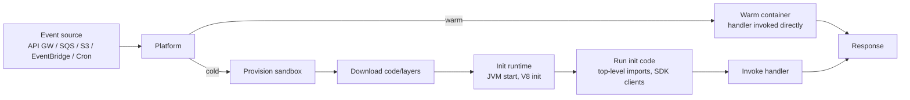

# Serverless and FaaS Trade-offs

**Date:** 2026-04-26 | **Updated:** 2026-04-26
**Tags:** `system-design` `architecture` `serverless` `faas`

## Table of Contents

- [Summary](#summary)
- [Overview](#overview)
- [Key Concepts](#key-concepts)
  - [The FaaS Execution Model](#the-faas-execution-model)
  - [Cold Starts — Where the Pain Lives](#cold-starts--where-the-pain-lives)
  - [State Externalization Is Not Optional](#state-externalization-is-not-optional)
  - [Concurrency Limits and Throttling](#concurrency-limits-and-throttling)
  - [Vendor Portability — Code vs Infrastructure](#vendor-portability--code-vs-infrastructure)
  - [The Cost Curve — Cheap Until It Isn't](#the-cost-curve--cheap-until-it-isnt)
  - [Edge Functions](#edge-functions)
- [Trade-offs](#trade-offs)
  - [vs Always-on Containers](#vs-always-on-containers)
  - [vs Always-on Services on VMs](#vs-always-on-services-on-vms)
- [Code Examples](#code-examples)
  - [Lambda Node Handler with DynamoDB](#lambda-node-handler-with-dynamodb)
  - [Provisioned Concurrency Configuration (SAM)](#provisioned-concurrency-configuration-sam)
  - [CDK Equivalent](#cdk-equivalent)
  - [Cloudflare Worker — Edge Variant](#cloudflare-worker--edge-variant)
- [Real-World Uses](#real-world-uses)
- [Anti-Patterns](#anti-patterns)
  - [Chatty Function-to-Function Calls](#chatty-function-to-function-calls)
  - [Large-State Functions](#large-state-functions)
  - [Synchronous DB Queries from the Cold-Start Path](#synchronous-db-queries-from-the-cold-start-path)
  - [Long-Running Sync Workloads](#long-running-sync-workloads)
  - [Fan-out Without Backpressure](#fan-out-without-backpressure)
- [Related](#related)
- [References](#references)

## Summary

Serverless / FaaS (AWS Lambda, GCP Cloud Functions, Azure Functions, Cloudflare Workers) trades operational ownership of a runtime for an opinionated, ephemeral execution model: code runs in short-lived containers that the platform spins up on demand, charges by millisecond-of-CPU plus invocation, and reclaims when idle. This is brilliant for **event-driven glue, batch jobs, webhooks, and traffic with sharp peaks-and-valleys**, and bad for **long-running, low-latency, sustained, or stateful** workloads. The hard parts are cold starts, state externalization, concurrency limits, and the way the cost curve crosses always-on containers somewhere between 30% and 60% sustained utilization. Vendor lock-in is real but lives in **infrastructure config**, not your function code; pick your IaC layer (SAM, Serverless Framework, CDK, Terraform) accordingly.

## Overview

"Serverless" is a misnomer — there are still servers, you just don't own a long-running process. The unit of deployment is a **function** (a handler), the unit of scaling is **concurrent invocations** (the platform runs N copies of your function for N concurrent events), and the unit of billing is **GB-seconds plus per-invocation fees**.

The mental model worth keeping:

- **Stateless, ephemeral runtime.** Each invocation may run on a fresh container or a warm one; you cannot rely on local memory, disk, or background tasks surviving between invocations.
- **Event-triggered.** Functions run because an HTTP request, queue message, S3 event, scheduled CloudWatch rule, DB stream record, or pub/sub message arrived. There is no `main()` you control.
- **Time-bounded.** Lambda caps at 15 minutes per invocation. Cloud Functions Gen 2 caps at 60 minutes. Cloudflare Workers cap at ~30s CPU time on paid plans (much less on free). If your job is longer, FaaS is the wrong shape.
- **Auto-scaled, but with a ceiling.** The platform spawns instances to match load up to a per-account concurrency limit (Lambda default: 1000 per region, soft).
- **Charged per-millisecond.** No paying for idle. This is the entire pitch and the entire trap.



The whole "serverless trade-off" conversation lives in the gap between the warm path (single-digit ms platform overhead) and the cold path (tens of ms to several seconds depending on language and package size).

## Key Concepts

### The FaaS Execution Model

A FaaS platform owns the OS, the runtime (Node 22, Python 3.13, Java 21, .NET 9, Go custom runtime, etc.), the network stack, and the lifecycle. You ship a deployment artifact — a zip, a container image up to 10 GB on Lambda, or a bundle on Cloudflare — and a handler signature. The platform:

1. Receives an event from a registered trigger.
2. Routes it to an existing **execution environment** (warm) or provisions a new one (cold).
3. Calls your handler with `(event, context)`.
4. Captures the return value or thrown error.
5. Keeps the environment around for ~5–60 minutes of idle (varies by platform and traffic) before reclaiming it.

Concurrency model: **one invocation per environment at a time**. If 100 requests arrive simultaneously, the platform spins up 100 environments. This is critical because it means your function cannot rely on in-process locks, in-memory rate limiters, or shared mutable state between concurrent invocations. Each concurrent invocation is a separate process.

### Cold Starts — Where the Pain Lives

A cold start is what happens the first time a given environment serves your code:

| Phase | What runs | Typical cost (Node) | Typical cost (Java) |
|-------|-----------|---------------------|---------------------|
| Sandbox provisioning | Firecracker microVM boot, network attach | ~50–150 ms | ~50–150 ms |
| Code download / extract | Pull artifact from S3, extract | ~50–200 ms (depends on size) | ~100–500 ms (fat jars) |
| Runtime init | Start interpreter / VM | ~50–100 ms | **~500–2000 ms (JVM warmup)** |
| Init code | Top-level imports, SDK client construction, DB pool creation | ~50–500 ms | ~200–1000 ms |
| Handler invocation | Your `handler(event, context)` runs | n/a | n/a |

Total: Node/Python typically land at **150–800 ms** cold; Java/.NET routinely hit **2–6 seconds** cold without tuning. This is why language choice matters far more in FaaS than it does in always-on services.

**Mitigations, in order of cost-effectiveness:**

1. **Move work out of the handler into init code.** SDK clients, DB pools, config parsing, JSON schema compilation — do all of it at module load, once per environment, not on every invocation. The platform already paid for the cold start; you might as well amortize as much as possible across the warm invocations that follow.
2. **Slim the package.** Tree-shake, prune dev deps, drop unused AWS SDK clients (use modular `@aws-sdk/client-dynamodb` instead of the v2 `aws-sdk` monolith). Every MB shaves ~10–20ms off cold start.
3. **Pick a faster runtime for latency-sensitive paths.** Node and Python are the cheapest cold starts; Go and Rust (custom runtimes) are even faster but lose some ecosystem. Java and .NET are the worst out of the box.
4. **For Java specifically: SnapStart (Lambda).** AWS snapshots the post-init JVM and restores from snapshot on cold start, dropping cold starts from 4s to ~200ms for many Spring Boot apps. Free for Java 11+, requires explicit opt-in and `BeforeCheckpoint`/`AfterRestore` hooks if you have non-deterministic init.
5. **Provisioned concurrency.** Pay to keep N environments perpetually warm. Eliminates cold starts for up to N concurrent requests. **You are now paying for idle**, which inverts the entire serverless cost model — only justified for latency-critical user-facing endpoints.
6. **Scheduled warmer pings.** A CloudWatch rule that pings the function every 5 minutes to keep it warm. Cheap, hacky, only handles **one** environment — the moment you hit concurrency >1, the warming is gone for everyone but the pinged path. Largely obsoleted by provisioned concurrency.

The key design insight: **cold starts are a predictable tax on the first request to a new environment, not on every request.** If you serve 10k req/s and only 0.1% land on a cold start, your p50 looks great and your p99 looks terrifying. Always look at p99 in serverless dashboards, never p50.

### State Externalization Is Not Optional

Because environments are ephemeral and concurrent invocations don't share memory, anything that needs to outlive a single invocation must live somewhere else. The standard pattern stack:

| State kind | Where it lives | Why |
|------------|----------------|-----|
| Session / cache | Redis (ElastiCache, Upstash, Momento), DynamoDB | Sub-ms access, TTL support, accessible from any concurrent invocation |
| Persistent data | DynamoDB, RDS Proxy + Postgres, Aurora Serverless v2, Spanner | Connection pooling matters — see RDS Proxy below |
| Large blobs | S3, GCS, R2 | Pass S3 keys through events, not file contents |
| Workflow state | Step Functions, Durable Functions, Cloud Workflows | When multi-step orchestration outlives a single 15-minute Lambda |
| Configuration | Parameter Store, Secrets Manager, AppConfig | Pulled at init time, optionally cached |

**The connection pool problem.** A naïve Lambda-to-Postgres design opens a fresh DB connection on every cold start. At 1000 concurrent Lambdas, that's 1000 connections — Postgres dies. Solutions:

- **RDS Proxy** (AWS): a managed connection multiplexer. Lambdas connect to the proxy, proxy maintains a small pool to Postgres.
- **Aurora Serverless v2 / Data API**: HTTP-based query interface, no persistent connection needed.
- **DynamoDB / Firestore** instead of an RDBMS: connectionless, HTTP-based by design.
- **Hyperdrive** (Cloudflare): pooled connections from edge to your origin DB.

If your function talks to a relational DB, you must answer "how do connections get pooled" before shipping. "We'll just connect from each Lambda" is the standard catastrophic outage.

### Concurrency Limits and Throttling

Lambda's default account-level concurrency cap is **1000 per region** (soft, raisable on request). It's the single most important number in your runbook.

What happens when you hit it depends on the trigger:

- **Synchronous (API Gateway, Function URL):** the platform returns 429 Throttled to the caller. Client sees an error.
- **Asynchronous (S3, EventBridge, SNS):** events go to an internal queue and retry with exponential backoff for up to 6 hours, then to a dead-letter queue if configured.
- **Stream-based (SQS, Kinesis, DynamoDB Streams):** the platform stops draining the source until concurrency frees up. Backlog grows, but no events are lost.

**Reserved concurrency** carves out a slice of the 1000 for a specific function (guarantees it can scale to N, prevents it from scaling past N). Use it for two opposite reasons: protect a critical function from being starved by a noisy neighbor, or cap a function that hammers a downstream RDBMS.

**Provisioned concurrency** is orthogonal — it's pre-warmed environments, separate budget from reserved. Use both together: reserve 200, provision 50, so you have 50 always-warm and a ceiling of 200.

Other platforms have analogous limits: Cloud Functions Gen 2 defaults to 1000 max instances per function; Azure Functions Consumption plan caps at 200 instances per app (Premium plan up to 1000+); Cloudflare Workers scale to ~tens of thousands of concurrent invocations per account but each is single-threaded with its own limits.

### Vendor Portability — Code vs Infrastructure

The honest framing: **your function body is portable, your platform integration is not.**

A Node `(event, context) => { ... }` handler is a few lines of platform-specific glue away from running on Lambda, Cloud Functions, or Azure Functions. The hard part is everything around it:

| Concern | Lock-in level | Why |
|---------|---------------|-----|
| Handler signature | Low | Adapter pattern in 20 LOC |
| Event shape (S3, SQS, Pub/Sub events) | Medium | Each platform has its own JSON shape |
| IAM and identity | High | IAM roles, GCP service accounts, Azure Managed Identities are wholly different |
| Triggers (API GW, EventBridge, Pub/Sub, Service Bus) | High | Different config, different semantics |
| Observability hooks (X-Ray, Cloud Trace, App Insights) | High | Different tracing libraries, sampling rules |
| Networking (VPC integration, private endpoints) | Very High | Each cloud's networking model is different |

The IaC tool you pick determines how much of this lock-in is hidden:

- **AWS SAM** — AWS-only. Concise. The natural choice if you're committed to Lambda and want short YAML.
- **Serverless Framework** — Cross-cloud abstraction. Mature plugin ecosystem. Now commercial-licensed for larger orgs.
- **AWS CDK / Pulumi** — Infrastructure as imperative code (TypeScript, Python). Best for teams that want types, refactoring, and shared constructs across services. CDK is AWS-only; Pulumi is multi-cloud.
- **Terraform / OpenTofu** — Cross-cloud, declarative HCL. Strongest if you already have a multi-cloud Terraform shop.
- **SST** — TS-native, opinionated, AWS-focused, with a great local dev story.

The honest portability advice: **don't try to be cloud-agnostic at the function level.** Pick one platform, lean into its primitives, and accept that a migration would mean rewriting the IaC + adapters. Trying to abstract "any cloud queue" usually produces a leaky LCD that's worse than just using SQS or Pub/Sub natively.

### The Cost Curve — Cheap Until It Isn't

This is the single most common modeling mistake in serverless adoption.

**At low and bursty traffic:** Lambda is dramatically cheaper than a fleet of always-on containers. A function invoked 100k times a month at 100ms / 256 MB costs cents. The same workload on a 24/7 ECS task or t3.small VM is $10–20/month minimum.

**At sustained high traffic:** the cost curve crosses. Past roughly 30–60% sustained CPU utilization on an equivalent always-on instance, Lambda becomes more expensive per request than Fargate or EC2.

Rough rule-of-thumb numbers for a 256 MB Lambda at us-east-1 prices:

| Sustained req/s | Monthly invocations | Lambda cost (no PC) | Equivalent t3.medium 24/7 | Verdict |
|-----------------|---------------------|---------------------|---------------------------|---------|
| 1 | ~2.6M | ~$10–20 | ~$30 | Lambda wins |
| 50 | ~130M | ~$400–800 | ~$30 (single VM, near saturation) | Container wins by 10× |
| 500 | ~1.3B | ~$4000–8000 | ~$120 (a few VMs) | Container wins by 30× |

The crossover happens earlier than people expect. The defensive design is to **monitor the function's invocation rate × duration**, and when sustained utilization implies you'd be running 1+ VMs flat-out anyway, port to ECS/Fargate/Cloud Run. Cloud Run in particular has become the modern "containerized serverless" answer for steady-state workloads — it scales to zero like Lambda but charges per request like Lambda only when scaled to zero, and per-instance time when warm.

### Edge Functions

A different shape of serverless: code runs at CDN POPs, often hundreds globally, on a constrained runtime (V8 isolates, not full containers). Examples: **Cloudflare Workers, Lambda@Edge, Vercel Edge Functions, Deno Deploy, Fastly Compute@Edge**.

Trade-offs vs regional Lambda:

- **Latency:** edge functions run within ~50ms of any user globally; Lambda runs in your chosen region.
- **Cold start:** V8 isolates start in **<5ms** versus 100–500ms for Lambda containers. This is a fundamentally different runtime model — isolates share a single V8 process, so there's no per-request container provisioning.
- **CPU time limits:** Workers cap at 30s CPU time (paid), Lambda@Edge at 5s for viewer events. Edge is for latency, not heavy compute.
- **Constrained APIs:** Workers don't have full Node — there's no `fs`, no native modules, limited `crypto.subtle`. You write to the Web Platform API surface (`fetch`, `Request`, `Response`, `URL`, `crypto.subtle`).
- **Storage:** edge functions usually pair with edge KV (Workers KV, Vercel KV, Lambda@Edge with regional Lambdas behind it). Sub-ms reads, eventually consistent across POPs.

Good fits for edge: A/B routing, auth-token rewriting, geolocation-based redirects, image transforms, edge caching with personalization, lightweight API responses that need <50ms p99 globally. Bad fits: anything CPU-heavy, anything that needs a relational DB connection (use Hyperdrive / D1 or call back to a regional service).

## Trade-offs

### vs Always-on Containers

| Axis | Serverless / FaaS | Containers (ECS / Cloud Run / GKE) |
|------|-------------------|-----------------------------------|
| Cold start | ~100ms–6s depending on runtime | None once warm; minutes for new pods to boot |
| Idle cost | Zero | Pay for the instance even at 0 RPS |
| Cost at high sustained load | Linear, expensive | Flat or sublinear (one VM serves many req) |
| Operational ownership | Platform owns runtime, OS, scaling | You own image, base OS choice, scaling policy |
| Deploy speed | Seconds (zip upload) | Tens of seconds to minutes (image build + push + roll) |
| Local development | Hard (emulators are imperfect) | Easy (Docker run) |
| Network latency to in-VPC RDBMS | Adds RDS Proxy / cold-start ENI attach | Direct, with PgBouncer or whatever pool you want |
| Concurrency cap | Account-wide soft cap (1000 default) | Bounded only by your cluster size |
| Long-running jobs | Capped (15 min Lambda, 60 min Cloud Functions) | Unbounded |
| WebSocket / streaming | Awkward (API GW WebSockets is a workaround) | Natural |
| Observability | Platform logs/metrics, lambda-specific tooling | Standard Prometheus / OTEL stack |

### vs Always-on Services on VMs

The same axes shift further toward "VMs win for steady state, lose for sporadic." Plus: VMs let you run anything (custom kernel modules, GPUs, sidecars) that the FaaS sandbox forbids.

The right framing in a design review: **"How predictable is the load and how variable is the rate?"** Sporadic, bursty, event-shaped → Lambda. Sustained, steady, latency-critical, stateful → containers or VMs.

## Code Examples

### Lambda Node Handler with DynamoDB

The pattern shown here is the production-shaped version: SDK clients in module scope, structured logging, idempotency-aware put, and explicit error envelope.

```typescript
// handler.ts
import { DynamoDBClient } from "@aws-sdk/client-dynamodb";
import { DynamoDBDocumentClient, PutCommand, GetCommand } from "@aws-sdk/lib-dynamodb";
import type { APIGatewayProxyEventV2, APIGatewayProxyResultV2 } from "aws-lambda";

// CRITICAL: client lives in module scope so it survives across warm invocations.
// The AWS SDK reuses HTTPS connections; recreating per-invocation costs 50-100ms.
const ddb = DynamoDBDocumentClient.from(
  new DynamoDBClient({
    maxAttempts: 3,
    requestHandler: { requestTimeout: 3000, connectionTimeout: 1000 },
  }),
  { marshallOptions: { removeUndefinedValues: true } }
);

const TABLE = process.env.ORDERS_TABLE!;
if (!TABLE) throw new Error("ORDERS_TABLE not configured"); // fail fast at init

interface CreateOrderBody {
  orderId: string;
  userId: string;
  amountCents: number;
}

export const handler = async (
  event: APIGatewayProxyEventV2
): Promise<APIGatewayProxyResultV2> => {
  const requestId = event.requestContext.requestId;
  try {
    const body = JSON.parse(event.body ?? "{}") as Partial<CreateOrderBody>;

    if (!body.orderId || !body.userId || typeof body.amountCents !== "number") {
      return jsonResponse(400, { error: "invalid_body", requestId });
    }

    // Conditional put — succeeds only if orderId doesn't exist. This makes the
    // handler safe to retry on the same order without double-writing, which is
    // critical because async triggers (SQS, EventBridge) retry at-least-once.
    await ddb.send(
      new PutCommand({
        TableName: TABLE,
        Item: {
          pk: `ORDER#${body.orderId}`,
          sk: "META",
          userId: body.userId,
          amountCents: body.amountCents,
          createdAt: new Date().toISOString(),
        },
        ConditionExpression: "attribute_not_exists(pk)",
      })
    );

    return jsonResponse(201, { orderId: body.orderId });
  } catch (err: any) {
    if (err?.name === "ConditionalCheckFailedException") {
      // Idempotent retry — order already exists, treat as success.
      return jsonResponse(200, { orderId: JSON.parse(event.body!).orderId, idempotent: true });
    }
    console.error(JSON.stringify({ level: "error", requestId, msg: err.message, stack: err.stack }));
    return jsonResponse(500, { error: "internal", requestId });
  }
};

const jsonResponse = (statusCode: number, body: unknown): APIGatewayProxyResultV2 => ({
  statusCode,
  headers: { "content-type": "application/json" },
  body: JSON.stringify(body),
});
```

The non-obvious things this handler is doing right:

- **Module-scope clients** so the cold-start cost is paid once and reused.
- **Fail-fast at init** if config is missing — better to crash on first invocation than silently 500 later.
- **Conditional put** for at-least-once trigger semantics (retries are safe).
- **Tight timeouts** on the SDK so a downstream stall doesn't burn your whole 15-minute Lambda budget.
- **Structured JSON logs** that CloudWatch Insights can query.

### Provisioned Concurrency Configuration (SAM)

```yaml
# template.yaml
AWSTemplateFormatVersion: '2010-09-09'
Transform: AWS::Serverless-2016-10-31

Parameters:
  ProvisionedCount:
    Type: Number
    Default: 5
    Description: Number of pre-warmed environments to keep ready.

Resources:
  CreateOrderFunction:
    Type: AWS::Serverless::Function
    Properties:
      CodeUri: ./dist
      Handler: handler.handler
      Runtime: nodejs22.x
      MemorySize: 512
      Timeout: 10
      Architectures: [arm64]               # arm64 is ~20% cheaper than x86_64
      ReservedConcurrentExecutions: 200    # cap to protect downstreams
      AutoPublishAlias: live               # required for provisioned concurrency
      ProvisionedConcurrencyConfig:
        ProvisionedConcurrentExecutions: !Ref ProvisionedCount
      Environment:
        Variables:
          ORDERS_TABLE: !Ref OrdersTable
          NODE_OPTIONS: '--enable-source-maps'
      Policies:
        - DynamoDBCrudPolicy:
            TableName: !Ref OrdersTable
      Events:
        Api:
          Type: HttpApi
          Properties:
            Path: /orders
            Method: POST

  OrdersTable:
    Type: AWS::DynamoDB::Table
    Properties:
      BillingMode: PAY_PER_REQUEST
      AttributeDefinitions:
        - { AttributeName: pk, AttributeType: S }
        - { AttributeName: sk, AttributeType: S }
      KeySchema:
        - { AttributeName: pk, KeyType: HASH }
        - { AttributeName: sk, KeyType: RANGE }
```

For **scheduled** provisioning (e.g., 50 warm during business hours, 5 overnight) use Application Auto Scaling on the alias — keeps cost down while still eliminating cold starts during peak.

### CDK Equivalent

Same shape, expressed as TypeScript constructs. Useful when the IaC has logic, sharing, or per-environment branching:

```typescript
import * as cdk from "aws-cdk-lib";
import * as lambda from "aws-cdk-lib/aws-lambda";
import * as nodejs from "aws-cdk-lib/aws-lambda-nodejs";
import * as ddb from "aws-cdk-lib/aws-dynamodb";
import * as apigw from "aws-cdk-lib/aws-apigatewayv2";
import * as integ from "aws-cdk-lib/aws-apigatewayv2-integrations";
import { Construct } from "constructs";

export class OrdersStack extends cdk.Stack {
  constructor(scope: Construct, id: string, props?: cdk.StackProps) {
    super(scope, id, props);

    const table = new ddb.Table(this, "OrdersTable", {
      partitionKey: { name: "pk", type: ddb.AttributeType.STRING },
      sortKey: { name: "sk", type: ddb.AttributeType.STRING },
      billingMode: ddb.BillingMode.PAY_PER_REQUEST,
    });

    const fn = new nodejs.NodejsFunction(this, "CreateOrderFn", {
      entry: "src/handler.ts",
      handler: "handler",
      runtime: lambda.Runtime.NODEJS_22_X,
      architecture: lambda.Architecture.ARM_64,
      memorySize: 512,
      timeout: cdk.Duration.seconds(10),
      reservedConcurrentExecutions: 200,
      bundling: { minify: true, sourceMap: true, target: "node22" },
      environment: { ORDERS_TABLE: table.tableName },
    });
    table.grantReadWriteData(fn);

    // Provisioned concurrency requires a versioned alias.
    const alias = new lambda.Alias(this, "Live", {
      aliasName: "live",
      version: fn.currentVersion,
      provisionedConcurrentExecutions: 5,
    });

    const httpApi = new apigw.HttpApi(this, "OrdersApi");
    httpApi.addRoutes({
      path: "/orders",
      methods: [apigw.HttpMethod.POST],
      integration: new integ.HttpLambdaIntegration("Int", alias),
    });
  }
}
```

### Cloudflare Worker — Edge Variant

Same business shape (accept order, write to KV) but on the edge runtime. Notice how different the API surface is:

```typescript
export interface Env {
  ORDERS: KVNamespace;
}

export default {
  async fetch(req: Request, env: Env): Promise<Response> {
    if (req.method !== "POST") return new Response("method not allowed", { status: 405 });

    const body = await req.json<{ orderId: string; userId: string; amountCents: number }>();
    if (!body.orderId || !body.userId || typeof body.amountCents !== "number") {
      return Response.json({ error: "invalid_body" }, { status: 400 });
    }

    // KV is eventually consistent across POPs — reads from a different POP may
    // briefly miss the write. Acceptable for many idempotency caches; not for ledgers.
    const key = `order:${body.orderId}`;
    const existing = await env.ORDERS.get(key);
    if (existing) return Response.json({ orderId: body.orderId, idempotent: true });

    await env.ORDERS.put(
      key,
      JSON.stringify({ ...body, createdAt: new Date().toISOString() }),
      { expirationTtl: 60 * 60 * 24 * 30 }
    );
    return Response.json({ orderId: body.orderId }, { status: 201 });
  },
};
```

This runs in <5ms cold start at the edge. It also cannot do any of: open a TCP socket to your Postgres (without Hyperdrive), use native Node modules, or hold long-lived connections — which is exactly the cost of edge isolation.

## Real-World Uses

Patterns where serverless is the obviously-correct shape:

- **Webhooks and async glue.** Stripe events, GitHub webhooks, third-party callbacks. Sporadic, bursty, idempotency-friendly.
- **Image / file processing.** S3 PUT triggers a Lambda that resizes, transcodes, or virus-scans. Burstable workload, naturally one-shot, scales with upload rate.
- **ETL fan-out.** S3 → Lambda → DynamoDB / OpenSearch / Snowpipe. The "modern data ingestion" backbone at most mid-size companies.
- **Scheduled batch jobs.** Replace cron + always-on worker boxes with EventBridge schedules + Lambdas. Per-job billing, no idle servers, audit trail in CloudWatch.
- **API backends with peaky traffic.** A B2B API used during business hours by a few hundred customers — peak 50 RPS, average 2 RPS. Lambda + API Gateway is dramatically cheaper than always-on containers here.
- **Edge personalization.** Cloudflare Workers rewriting marketing site responses based on geolocation, A/B cohorts, or auth state.
- **Chatbot / LLM tool execution.** Each tool call is a stateless function invocation; Lambda's isolation and per-call billing fit the model precisely.
- **Step Functions orchestration.** Multi-step workflows (approve order → charge → ship → notify) where each step is a small Lambda and Step Functions owns retries, branching, and state.

## Anti-Patterns

### Chatty Function-to-Function Calls

Lambda invoking Lambda invoking Lambda is a **double-cost anti-pattern**:

1. You pay for the calling Lambda to sit idle waiting on the synchronous response (billed at 100% of duration).
2. The cold-start tax stacks — three hops, three potential cold starts, latencies multiply.

The standard mitigation is to either fold the logic into one function, or, when you genuinely need separation, communicate via **events** (SNS, EventBridge, SQS) so the caller returns immediately. If you find yourself drawing a synchronous Lambda → Lambda → Lambda chain, that's a microservices-as-functions smell — you've decomposed too far. See [Monolith to Microservices](./monolith-to-microservices.md) for sizing.

### Large-State Functions

Loading a 200 MB ML model from S3 on every cold start kills latency, then loading it into memory means provisioned concurrency costs balloon (you pay for the memory). Better:

- Move the model behind a SageMaker / Vertex / dedicated inference service.
- If it must run in Lambda, use container images (10 GB) and **provision** a small pool so cold starts are amortized.
- For modest state (<50 MB), package it in the deployment artifact and load at init time, accepting the one-time cold-start hit per environment.

The general rule: **anything with significant per-cold-start setup belongs in an always-on service or behind a managed inference endpoint.**

### Synchronous DB Queries from the Cold-Start Path

The first request to a new environment runs init code, which often opens a DB connection, which means: cold start latency = sandbox + runtime + your DB handshake. If your DB is in a VPC and the Lambda needs an ENI, add another ~500ms. The first user to hit your endpoint after a quiet period gets a 2–4 second response because they paid for everyone else's setup.

Mitigations:
- Use HTTP-based data stores (DynamoDB, Firestore) so there's no handshake.
- Use RDS Proxy so the connection pool lives outside the Lambda.
- Use provisioned concurrency on the latency-critical paths so cold starts are eliminated for typical traffic.
- Stop using a relational DB from a Lambda fronting public traffic if cold-start p99 matters; put a queue between them and let an async worker absorb the latency.

### Long-Running Sync Workloads

If your job runs for 14 minutes, it does not belong in Lambda — even though it technically fits in the 15-minute window. You're one S3 hiccup away from a timeout, you can't survive a deploy, and you pay for the entire duration at GB-second rates. Move to:
- **Step Functions** if the workflow is multi-step (each step short).
- **Fargate task / Cloud Run job / GKE Job** if it's a single long-running computation.
- **Batch (AWS Batch / GCP Batch)** if it's a fleet of large jobs.

### Fan-out Without Backpressure

A common bug: an S3 bucket triggers a Lambda for each upload, the Lambda writes to RDS Postgres. Someone uploads 50,000 small files. Lambda scales to ~1000 concurrency. Postgres opens 1000 connections, dies. The fix is **always** to put a queue with a configured batch size and concurrency limit between the unbounded event source and the bounded downstream:

```text
S3 → SQS → Lambda(reservedConcurrency=20, batchSize=10) → RDS via RDS Proxy
```

This is the canonical event-driven shape. See [Event-Driven Architecture](./event-driven-architecture-style.md) for the broader pattern.

## Related

- [Monolith to Microservices](./monolith-to-microservices.md) — sizing functions vs services and avoiding microservices-as-functions.
- [Event-Driven Architecture Style](./event-driven-architecture-style.md) — the broader async pattern that FaaS slots into; backpressure and queue patterns.
- [Designing a CDN](../case-studies/distributed-infra/design-cdn.md) — edge functions are CDN-adjacent; Cloudflare Workers and Lambda@Edge run on CDN POPs.
- [CAP, PACELC, and Consistency Models](../foundations/cap-and-consistency-models.md) — DynamoDB and edge KV consistency choices a serverless architecture inherits.

## References

- AWS, ["AWS Lambda Developer Guide"](https://docs.aws.amazon.com/lambda/latest/dg/welcome.html) — official reference for execution model, limits, provisioned concurrency, SnapStart, and concurrency controls.
- AWS, ["Lambda execution environment lifecycle"](https://docs.aws.amazon.com/lambda/latest/dg/lambda-runtime-environment.html) — the canonical description of the cold-start phases and Init/Invoke/Shutdown hooks.
- Google Cloud, ["Cloud Functions documentation"](https://cloud.google.com/functions/docs) — Cloud Functions Gen 2 runtime, triggers, and scaling.
- Microsoft, ["Azure Functions documentation"](https://learn.microsoft.com/en-us/azure/azure-functions/) — Consumption / Premium / Dedicated plans, triggers, durable functions.
- Eric Jonas et al., ["Cloud Programming Simplified: A Berkeley View on Serverless Computing"](https://arxiv.org/abs/1902.03383) (2019) — the academic baseline; what serverless gets right, what it gets wrong, and the open research problems.
- Cloudflare, ["Workers documentation"](https://developers.cloudflare.com/workers/) — V8 isolates execution model, KV, Durable Objects, Hyperdrive, and the edge runtime API surface.
- Werner Vogels, ["Building a serverless multi-region active-active architecture"](https://www.allthingsdistributed.com/2018/08/multi-region-multi-master-serverless.html) — production patterns for serverless at AWS scale.
- Yan Cui (theburningmonk), ["Serverless Patterns"](https://theburningmonk.com/) — the most practical working blog on Lambda patterns and anti-patterns; particularly his cold-start and observability writing.
