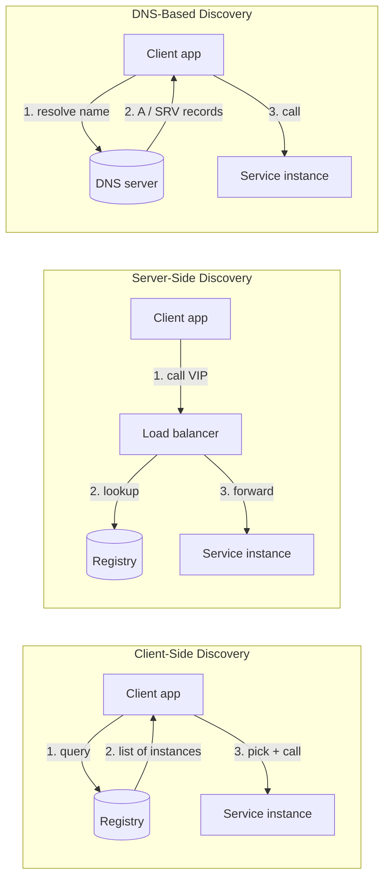
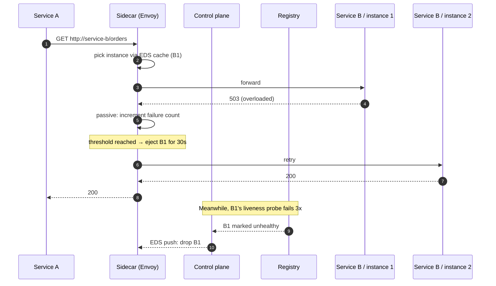

# Service Discovery — Client-Side, Server-Side, DNS-Based

**Date:** 2026-04-26 | **Updated:** 2026-04-26
**Tags:** `system-design` `architecture` `service-discovery` `microservices`

## Table of Contents

- [Summary](#summary)
- [Why This Matters](#why-this-matters)
- [Overview — The Three Dial Positions](#overview--the-three-dial-positions)
- [Key Concepts](#key-concepts)
  - [Client-Side Discovery](#client-side-discovery)
  - [Server-Side Discovery](#server-side-discovery)
  - [DNS-Based Discovery](#dns-based-discovery)
  - [The Service Registry — Consul, etcd, Eureka, ZooKeeper](#the-service-registry--consul-etcd-eureka-zookeeper)
  - [Mesh-Integrated Discovery — xDS and Sidecars](#mesh-integrated-discovery--xds-and-sidecars)
  - [Health Checks — Active vs Passive](#health-checks--active-vs-passive)
  - [Registration Patterns — Self vs Third-Party](#registration-patterns--self-vs-third-party)
  - [Failover Behavior](#failover-behavior)
- [Trade-offs Matrix](#trade-offs-matrix)
- [Code Examples](#code-examples)
  - [Eureka Client (Spring Cloud)](#eureka-client-spring-cloud)
  - [Consul DNS Query](#consul-dns-query)
  - [Kubernetes Service Definition](#kubernetes-service-definition)
- [Real-World Uses](#real-world-uses)
- [Anti-Patterns](#anti-patterns)
- [Picking a Discovery Style](#picking-a-discovery-style)
- [Related](#related)
- [References](#references)

## Summary

Service discovery is the mechanism that turns a logical name like `payments-service` into a concrete `IP:port` of a healthy instance. There are three dial positions — **client-side** (caller queries a registry and load-balances itself), **server-side** (caller hits a stable VIP and a load balancer dispatches), and **DNS-based** (caller resolves a name and the platform handles everything else). Modern service meshes collapse these into a fourth model where a sidecar proxy reads endpoints over the **xDS protocol** and gives the application what looks like plain HTTP to localhost. The decision is rarely "which is best" — it is which trade-off (extra hop, language coupling, propagation delay, ops complexity) you can afford for this product, today.

## Why This Matters

Every microservices design review eventually asks: _how does service A find service B?_ A surprising number of failures in production trace back to a wrong answer to that question — DNS caches that hold dead IPs for 24 hours, a Eureka client built into a Java service that no Go service can talk to, a Consul agent that quietly stopped publishing health checks, a Kubernetes Service that load-balances onto a pod still draining connections.

If you can articulate:

- which discovery model the system uses,
- where the registry lives and how it stays consistent,
- who registers (the service or a third party) and how stale registrations get culled,
- how active vs passive health checks combine,
- what happens during a registry partition,

you cover most of the failure modes upfront. This doc gives you that vocabulary so a design review goes "we'll use server-side discovery via Envoy with xDS pulling from the control plane, passive health checks plus an active /healthz every 5s, third-party registration via the K8s controller" — instead of "we'll use service discovery."

## Overview — The Three Dial Positions



The differences are about **where the load-balancing decision lives** and **what protocol the client speaks**:

- Client-side: client speaks the registry's protocol, owns the LB algorithm, calls instances directly.
- Server-side: client speaks plain HTTP/gRPC to a VIP, the LB owns LB.
- DNS-based: client speaks DNS, then plain HTTP/gRPC. Simpler, but loses everything you can't encode in DNS.

A mesh sidecar (Envoy/Linkerd) is **server-side discovery on localhost** — the client speaks plain HTTP to `127.0.0.1:port`, and the sidecar does everything else.

## Key Concepts

### Client-Side Discovery

The classic Netflix model: every service ships with an **embedded library** that talks to the registry, caches the instance list, and chooses one per call.

**Reference stack:** Netflix Eureka (registry) + Ribbon (client LB) + Hystrix (circuit breaker), bundled into Spring Cloud Netflix.

**Flow:**

1. Client starts and pulls the registry's full snapshot into a local cache.
2. Background thread refreshes the cache every N seconds (Eureka default: 30s).
3. Per call, client picks an instance via round-robin, weighted, or zone-affinity rules.
4. Failed call → mark instance as suspect locally, retry on a different one.
5. Eureka clients re-register every 30s as a heartbeat; missing 3 heartbeats removes them.

**Why teams pick it:**

- No extra network hop. The client calls the chosen instance directly.
- The client knows about all instances, so it can do **smart LB** — weighted by zone, latency-aware, sticky for consistency, load-aware.
- Resilient to registry outage: cached snapshots keep traffic flowing if the registry is down (Eureka's "self-preservation mode" leans hard into this).

**Why it hurts:**

- **Language coupling.** A polyglot fleet needs a Eureka client for Java, Python, Go, Node, Rust… Some are official, some are third-party, all drift in features and bugs.
- **Logic in the application.** Retry policy, circuit breaker, LB algorithm all live in app processes — upgrading them means redeploying every service.
- **Cache staleness.** A 30s refresh means up to 30s of traffic to a dead instance unless you have aggressive passive health checks.
- **Heavy clients.** The Netflix stack adds significant memory and startup time per service.

This is the pattern the **service mesh model fixes** by moving the client logic out of the app and into a sidecar (see [./service-mesh-as-architectural-decision.md](./service-mesh-as-architectural-decision.md) and [./sidecar-pattern.md](./sidecar-pattern.md)).

### Server-Side Discovery

Client calls a stable address — a virtual IP, a load balancer hostname, an API gateway — and that intermediary owns lookup and dispatch.

**Reference stacks:**

- AWS ALB / NLB in front of ECS or EC2 target groups.
- HAProxy, NGINX, or Envoy as a centralized LB pool.
- Kubernetes `Service` of type `ClusterIP` (kube-proxy iptables/IPVS rules).
- An API gateway like Kong or AWS API Gateway acting as the discovery layer at the edge.

**Flow:**

1. Client calls `payments.internal.example.com` or `10.0.0.42:8080`.
2. The LB consults its endpoint pool (refreshed via registry watches, ARP, K8s Endpoints API, etc.).
3. LB applies its policy — round-robin, least-connections, P2C, ring-hash for stickiness.
4. LB forwards or proxies the request to the chosen instance.
5. Active health checks remove unhealthy backends from the pool.

**Why teams pick it:**

- **Language-agnostic.** Clients only need to speak HTTP/gRPC; no SDK to integrate.
- **Centralized policy.** Rate limits, TLS termination, retries, timeouts all live in one place.
- **Operationally familiar.** LB metrics and access logs are the standard place to debug.
- **Easy "blue/green" and canary**, since the LB controls weights centrally.

**Why it hurts:**

- **Extra hop.** Every call traverses the LB — extra latency (usually <1ms in-cluster, but real over the WAN) and an extra failure domain.
- **LB itself must scale.** A central LB becomes a chokepoint and a hot HA target.
- **Health check noise.** Active probes from the LB to every backend can be expensive at scale.

Note: a hardware/L4 LB and an L7 mesh sidecar are both "server-side discovery" in this model — the difference is where the proxy lives, not what it does.

### DNS-Based Discovery

The simplest model: encode discovery in DNS records.

**Reference stacks:**

- **Consul DNS** — Consul exposes registered services as `<service>.service.<dc>.consul` A records.
- **Kubernetes CoreDNS / kube-dns** — `<service>.<namespace>.svc.cluster.local` resolves to the Service ClusterIP, or to pod IPs if it's a headless Service.
- **Route 53 service discovery** — AWS Cloud Map registrations exposed as DNS.
- **AWS ECS Service Connect / SD** — registers tasks under a private namespace.

**Flow:**

1. Service A resolves `service-b.namespace.svc.cluster.local`.
2. DNS returns one or more A records (or SRV records with port info).
3. Client opens TCP/HTTP to that IP.
4. The platform churns DNS records as instances come and go.

**Why teams pick it:**

- **Ubiquitous.** Every language, every runtime, every CLI tool speaks DNS already.
- **Zero coupling.** A bash curl call has the same discovery story as a Go service.
- **Composable.** DNS over the WAN, DNS inside the cluster, DNS for cross-region — same primitive.

**Why it hurts:**

- **TTL-bound staleness.** DNS clients (and intermediate resolvers, JVM caches, container runtimes) cache aggressively. A pod dying does not propagate until TTL expires; some clients cache forever unless tuned. The JVM in particular caches successful resolves indefinitely by default (`networkaddress.cache.ttl=-1` on legacy JVMs is a classic trap).
- **Coarse load balancing.** DNS round-robin distributes resolutions, not requests. One client opening a long-lived gRPC connection ends up pinned to a single backend until it reconnects.
- **No health-check awareness in the client.** The client doesn't know that the resolved IP is sick — it just sees connection refused or a hung socket.
- **No metadata.** SRV records carry weight and port; A records don't even carry that. No version tags, no canary weights, no zone hints.

DNS-based discovery is the right floor when you need ubiquity and don't need fine-grained policy. Inside Kubernetes it's the default and works fine for stateless HTTP. For long-lived gRPC, sticky sessions, or progressive rollouts, layer something more capable on top.

### The Service Registry — Consul, etcd, Eureka, ZooKeeper

All three discovery models depend on a registry that says "these are the live instances of `payments-service`." The choices differ in their **consistency model** and the **shape of the data**.

| Registry | Consistency | Strengths | Weaknesses |
|---|---|---|---|
| **Eureka** (Netflix) | AP (eventual) | Heartbeat-based, self-preservation mode keeps stale data during partitions, cheap to run | No strong consistency, primarily JVM ecosystem, deprecated by Netflix internally |
| **Consul** (HashiCorp) | CP (Raft) | Multi-datacenter, KV store, native DNS interface, ACLs, mature health checks | Heavier ops, Raft means writes need quorum |
| **etcd** | CP (Raft) | Backbone of Kubernetes, simple KV semantics, strong consistency | Not a discovery system on its own — you build on it |
| **ZooKeeper** | CP (ZAB) | Battle-tested (HBase, Kafka, Solr), ephemeral nodes are perfect for liveness | Old client APIs, watcher complexity, not friendly to ephemeral cloud workloads |

**The CAP framing:** Eureka chose AP because Netflix's premise was "stale data is better than no data when traffic is on the line." Consul/etcd/ZooKeeper chose CP because they also store config and locks, where stale data corrupts state. See [../foundations/cap-and-consistency-models.md](../foundations/cap-and-consistency-models.md) for the underlying trade-offs.

**The right mental model:** the registry is the **source of truth for liveness**. Everything else — DNS, sidecars, LBs — is a projection of registry state into a different protocol.

### Mesh-Integrated Discovery — xDS and Sidecars

Service meshes (Istio, Linkerd, Consul Connect, AWS App Mesh) collapse discovery, LB, retries, and TLS into a sidecar proxy (typically **Envoy**) that the application talks to over localhost.

The discovery protocol is **xDS** — a family of gRPC-streaming APIs:

- **CDS** (Cluster Discovery Service) — list of upstream clusters (logical services).
- **EDS** (Endpoint Discovery Service) — instances and their IPs/health for each cluster.
- **LDS** (Listener Discovery Service) — what ports/protocols Envoy listens on.
- **RDS** (Route Discovery Service) — how requests map to clusters (path, header rules).
- **SDS** (Secret Discovery Service) — TLS material.

The control plane (Istio's `istiod`, Consul's controller, App Mesh's service) reads from the registry and pushes updates to every sidecar over xDS streams. Sidecars apply the deltas without redeploying the app.

**What you get:**

- Application code calls `http://payments:8080` — the sidecar transparently picks an instance, retries, applies mTLS, emits metrics, and reports outliers back.
- Discovery decisions update across the fleet in **seconds**, not DNS-TTL minutes.
- Polyglot fleets get the same retry, timeout, and circuit-breaker semantics for free.

**What you pay:**

- One extra hop (localhost), 1–2 extra ms per call.
- Significant ops complexity — control plane HA, sidecar lifecycle, version skew between sidecars and control plane.
- Memory/CPU overhead per pod (Envoy is hundreds of MB of RSS, not nothing).

This is where most modern Kubernetes shops land for east-west traffic. See [./service-mesh-as-architectural-decision.md](./service-mesh-as-architectural-decision.md) for the full decision framework.

### Health Checks — Active vs Passive

The registry only matters if it knows what's actually healthy. Two complementary mechanisms:

**Active health checks** — the registry, LB, or mesh proxy probes each instance on a schedule. Examples: Consul HTTP/TCP/gRPC checks, Envoy `/healthz`, AWS ALB target groups, Kubernetes `livenessProbe`/`readinessProbe`. Deterministic — you know when an instance is marked dead. Cost: every probe is load on the backend (n_probers × n_targets / period); can DDoS your own service.

**Passive health checks (outlier detection)** — observe real traffic and eject instances that misbehave (5xx rate, connect timeouts, consecutive failures). Examples: Envoy outlier detection, NGINX `max_fails`, HAProxy `observe`, gRPC client LBs. Free — uses traffic you already send. Reacts in seconds to failure modes `/healthz` misses (slow upstream, partial deploy, GC stall). Needs volume to accumulate signal; easy to flap if thresholds are wrong.

**Production stacks combine both:** active probes set the baseline for liveness; passive detection reacts faster to in-the-wild failures. A stale `/healthz=200` while every real call returns 500 is a real failure mode you only catch with passive detection.

### Registration Patterns — Self vs Third-Party

How does an instance end up in the registry?

**Self-registration:** the service registers itself on startup and sends heartbeats while it lives.

- Examples: Eureka client built into Spring Boot apps, Consul Template's `consul services register` from the binary, custom code that hits the registry's API.
- Strengths: no extra moving parts. The service knows when it's truly ready.
- Weaknesses: every language needs a client. A crash before deregistration leaves stale entries (mitigated by TTL/heartbeat).

**Third-party registration:** an external controller watches platform events and updates the registry on the service's behalf.

- Examples: Kubernetes endpoint controller (watches Pods → updates Endpoints), AWS Cloud Map auto-registration via ECS/EKS integrations, Consul `consul-k8s` sync controller.
- Strengths: language-agnostic, centralized. The platform already knows when a pod is alive/dead.
- Weaknesses: depends on the platform's view matching reality. A controller bug can drop an entire service.

**Modern default:** in Kubernetes, you let the platform do third-party registration via Endpoints / EndpointSlices and never write registration code yourself.

### Failover Behavior

What happens when something goes wrong is the most important thing about a discovery system, and the easiest thing to forget to test.

**Registry partition (the registry can't be reached):**

- Eureka clients keep using their last cached snapshot — service stays up, possibly with stale instance lists.
- Consul/etcd minority partitions stop accepting writes; reads with `?stale=true` continue. New instances can't register on the wrong side of the partition.
- DNS-based: TTL-bound. Clients keep using last resolution until TTL expires.
- Mesh sidecars: cached xDS state continues to drive decisions; new endpoints aren't picked up.

**Instance crash (no graceful deregistration):**

- Active health check picks up the failure within `interval × failure_threshold`.
- Passive detection (outlier ejection) reacts within a few failed requests.
- Eureka heartbeat-based liveness clears stale entry within ~90s of missed heartbeats by default.
- Kubernetes pod death triggers an Endpoints update within seconds via the controller; sidecars see it via xDS push.

**Slow / brownout instance:**

- Active `/healthz=200` probes can mistakenly call it healthy. Passive detection or P2C+latency LB algorithms react.
- Connection draining must be wired in: a graceful shutdown should mark the instance unhealthy first, drain in-flight requests, then exit.



## Trade-offs Matrix

| Dimension | Client-side (Eureka/Ribbon) | Server-side (LB/VIP) | DNS-based (Consul/K8s) | Mesh (xDS) |
|---|---|---|---|---|
| **Extra hop?** | No | Yes (1) | No | Yes (sidecar, localhost) |
| **Polyglot ergonomics** | Poor (per-language SDK) | Excellent | Excellent | Excellent |
| **LB sophistication** | High (full algorithm in client) | High (LB owns it) | Low (round-robin per resolve) | Very high (Envoy LB) |
| **Propagation speed** | 30s default (Eureka) | Seconds (LB watches) | TTL-bound (10s–min) | Seconds (xDS push) |
| **Resilience to registry down** | Excellent (cached) | Good (LB has cache) | Good (DNS cache) | Good (sidecar cache) |
| **Operational surface** | Low (just registry) | Medium (registry + LB) | Low (DNS + registry) | High (control plane + sidecars) |
| **Where logic lives** | App | LB | App (just retries) | Sidecar |
| **Upgrade story** | Redeploy every service | Upgrade LB | Update DNS / TTL | Upgrade control plane + sidecars |
| **Best fit** | Legacy JVM monoculture | Edge / cross-cluster | Simple intra-cluster | Polyglot microservices at scale |

**One-line picks:** one language, max control, min hops → client-side. Polyglot, modest scale → DNS-based. Polyglot, edge or cross-cluster → server-side LB. Polyglot at scale, consistent retry/security/observability → mesh.

## Code Examples

### Eureka Client (Spring Cloud)

A Spring Boot service registering itself with Eureka and calling another service via a load-balanced client. This is client-side discovery in canonical form.

```java
// build.gradle dependencies
// implementation 'org.springframework.cloud:spring-cloud-starter-netflix-eureka-client'
// implementation 'org.springframework.cloud:spring-cloud-starter-loadbalancer'

@SpringBootApplication
@EnableDiscoveryClient
public class OrderServiceApplication {
    public static void main(String[] args) {
        SpringApplication.run(OrderServiceApplication.class, args);
    }

    @Bean
    @LoadBalanced
    RestClient.Builder restClientBuilder() {
        return RestClient.builder();
    }
}

@Service
public class PaymentClient {
    private final RestClient restClient;

    public PaymentClient(RestClient.Builder builder) {
        // "payments-service" is the logical service ID registered in Eureka.
        // The @LoadBalanced builder rewrites the URL using the cached
        // Eureka snapshot and the configured LB algorithm (default RR).
        this.restClient = builder.baseUrl("http://payments-service").build();
    }

    public PaymentResult charge(ChargeRequest req) {
        return restClient.post()
                .uri("/charge")
                .body(req)
                .retrieve()
                .body(PaymentResult.class);
    }
}
```

```yaml
# application.yml
spring:
  application:
    name: order-service
eureka:
  client:
    service-url:
      defaultZone: http://eureka:8761/eureka/
    registry-fetch-interval-seconds: 30
  instance:
    lease-renewal-interval-in-seconds: 30
    lease-expiration-duration-in-seconds: 90
    prefer-ip-address: true
```

Notes:

- The `@LoadBalanced` annotation is the seam — without it, `http://payments-service` is just a hostname and would fail DNS resolution.
- `lease-expiration-duration` is what governs how fast a dead instance gets evicted; default 90s is too slow for many SLOs, tune per service.
- For non-JVM services in the same fleet you would either run a Eureka-compatible client (rare) or sidecar a Sidecar Pattern adapter — usually the trigger to switch styles.

### Consul DNS Query

A service registered in Consul becomes resolvable via Consul's DNS interface. This shows the registration plus a query from any DNS-aware client.

```hcl
# /etc/consul.d/payments.hcl on each payments-service host
service {
  name = "payments"
  id   = "payments-${HOSTNAME}"
  port = 8080
  tags = ["v2", "canary"]

  # Active health check — Consul polls /healthz every 5s, 3 strikes = unhealthy.
  check {
    id       = "payments-http"
    name     = "HTTP /healthz on 8080"
    http     = "http://localhost:8080/healthz"
    method   = "GET"
    interval = "5s"
    timeout  = "1s"
  }
}
```

```bash
# Resolve healthy payments instances via Consul DNS.
# Only instances passing the check are returned — Consul filters at DNS time.
$ dig +short @127.0.0.1 -p 8600 payments.service.dc1.consul
10.0.1.14
10.0.1.22

# SRV records expose port and priority/weight; useful for non-80/443 services.
$ dig +short @127.0.0.1 -p 8600 SRV payments.service.dc1.consul
1 1 8080 ip-10-0-1-14.node.dc1.consul.
1 1 8080 ip-10-0-1-22.node.dc1.consul.

# Filter by tag — only canary v2 instances.
$ dig +short @127.0.0.1 -p 8600 v2.payments.service.dc1.consul
10.0.1.22
```

```go
// Go client using stdlib net.Resolver pointed at the Consul agent.
// No Consul SDK required — DNS is the API.
resolver := &net.Resolver{
    PreferGo: true,
    Dial: func(ctx context.Context, network, _ string) (net.Conn, error) {
        var d net.Dialer
        return d.DialContext(ctx, network, "127.0.0.1:8600")
    },
}

ips, err := resolver.LookupHost(ctx, "payments.service.dc1.consul")
if err != nil {
    return fmt.Errorf("discover payments: %w", err)
}
// Naive: dial first. Production: shuffle, retry on failure, respect SRV weights.
addr := net.JoinHostPort(ips[0], "8080")
```

Notes:

- **TTL** on Consul DNS records is configurable (`dns_config.service_ttl`); the default is 0 (no caching). Production setups usually set 10–30s and live with the staleness.
- Tag-based names (`v2.payments.service…`) are how you do canaries via DNS without changing the consumer.

### Kubernetes Service Definition

The Kubernetes-native combination of third-party registration (the endpoints controller) and DNS-based discovery (CoreDNS), with a server-side LB step inside kube-proxy.

```yaml
# Pod template — readiness probe controls Endpoints membership.
apiVersion: apps/v1
kind: Deployment
metadata:
  name: payments
  namespace: shop
spec:
  replicas: 4
  selector:
    matchLabels:
      app: payments
  template:
    metadata:
      labels:
        app: payments
    spec:
      containers:
        - name: payments
          image: registry.example.com/payments:v2.3.1
          ports:
            - name: http
              containerPort: 8080
          # The kubelet probes /healthz; failing readiness removes the pod
          # from the Service's Endpoints. Failing liveness restarts it.
          readinessProbe:
            httpGet: { path: /healthz/ready, port: http }
            initialDelaySeconds: 5
            periodSeconds: 5
            failureThreshold: 3
          livenessProbe:
            httpGet: { path: /healthz/live, port: http }
            initialDelaySeconds: 15
            periodSeconds: 10
            failureThreshold: 3
          lifecycle:
            preStop:
              # Drain: mark not-ready, sleep so Endpoints update propagates,
              # then let SIGTERM in. Prevents losing in-flight traffic.
              exec:
                command: ["/bin/sh", "-c", "sleep 15"]
---
apiVersion: v1
kind: Service
metadata:
  name: payments
  namespace: shop
spec:
  selector:
    app: payments
  ports:
    - name: http
      port: 80
      targetPort: http
  # ClusterIP (default): server-side discovery via kube-proxy iptables/IPVS.
  # Set to "None" for headless service: DNS returns pod IPs directly,
  # which is what gRPC clients usually want for client-side LB.
  type: ClusterIP
```

```bash
# From any pod in the cluster, no SDK needed.
$ curl http://payments.shop.svc.cluster.local/charge

# Headless variant returns pod IPs directly — clients can do their own LB.
$ dig +short payments-headless.shop.svc.cluster.local
10.244.1.5
10.244.1.7
10.244.2.3
10.244.2.9
```

Notes:

- The `Service` is the **stable VIP**. kube-proxy programs iptables/IPVS rules on every node to load-balance traffic to current Endpoints.
- The `Endpoints` (or `EndpointSlice`) object is updated by a controller as pods become ready — pure third-party registration. The application doesn't know discovery exists.
- For long-lived gRPC, use a **headless Service** so the gRPC client picks up all pod IPs and does P2C/round-robin per RPC, not per connection.
- The `preStop` sleep is the single most-often-missed piece — without it, the pod terminates before kube-proxy updates iptables, dropping in-flight requests.

## Real-World Uses

- **Netflix (pre-mesh):** Eureka + Ribbon + Hystrix across tens of thousands of JVM services. Self-preservation mode keeps clients on stale data rather than no data. Modern Netflix has moved much of this into mesh-shaped infra (gRPC + xDS).
- **Kubernetes:** every cluster does DNS + server-side discovery for free. CoreDNS resolves Service names; kube-proxy does L4 LB; the Endpoints controller does third-party registration; readiness probes are the active health check.
- **HashiCorp Consul shops:** mixed VM and container fleets where Kubernetes alone isn't enough. Consul as the source of truth, exposed via DNS for ubiquity and Consul Connect (mesh) for finer policy.
- **Istio / Linkerd shops:** large polyglot K8s deployments. Control plane reads K8s Endpoints, pushes xDS to every sidecar. Discovery becomes invisible — every call is `http://service-name/`.
- **AWS Cloud Map / ECS Service Connect:** managed registry exposed via DNS and HTTP — standard for ECS/Fargate fleets that don't run Kubernetes.
- **API gateways (Kong, AWS API Gateway):** server-side discovery at the edge. The gateway looks up upstreams in its own registry or in Consul/K8s, then dispatches.

## Anti-Patterns

**Caching service IPs forever in the client.** A client, DNS resolver, or JVM caches a resolved IP and never refreshes. The pod dies, a new one comes up at a different IP, the client throws connection refused for hours. Classic JVM trap (`networkaddress.cache.ttl=-1`). Set a sane TTL and respect it.

**No health checks at all.** Registering an instance and never proving it's alive. Crashed JVMs, OOM-killed pods, deadlocked processes all keep getting traffic until something else times out. Every service needs liveness + readiness; passive outlier detection on top is even better.

**Liveness probe that exits the world.** `/healthz` that calls the database, the cache, and three downstream services. One downstream blip restarts every instance simultaneously, taking the whole service down. Liveness tests the process; readiness can test dependencies; never conflate the two.

**Manual registration / hardcoded IPs.** Putting `payments-1.internal.example.com` in a config file. The first reschedule breaks everything. If you're updating a config map of IPs, you've reinvented service discovery, badly.

**Treating DNS round-robin as load balancing.** A single gRPC client opens one connection to the first IP DNS returned and pins forever. New backends never get traffic until the client reconnects. Use a headless Service plus client-side LB, or a sidecar.

**Single-region registry behind a global service.** One Consul cluster in `us-east-1` serving every region. Cross-region link flaps and discovery in `eu-west-1` collapses. Registries are per-region with WAN federation (Consul) or per-cluster (K8s); cross-cluster traffic uses explicit routing.

**Skipping graceful shutdown.** Pod gets SIGTERM, exits immediately, Endpoints catches up two seconds later. Two seconds of 5xx per deploy. Add a `preStop` sleep, deregister-then-drain, and adequate `terminationGracePeriodSeconds`.

**Using a CP registry as the latency-critical path with no caching.** Hitting Consul KV or etcd on every request. The registry is now your bottleneck, and a Raft leader election is now your incident. Always cache.

**Ignoring registration failure on startup.** Service starts, fails to register, serves anyway — invisible to discovery, traffic ratios skew. Either fail startup or block readiness until registered.

## Picking a Discovery Style

Short framework for the design review:

1. **On Kubernetes?** Default to DNS + Service VIPs. Add a mesh when retry/timeout/security policy starts living in app code in two languages.
2. **Polyglot fleet?** Avoid client-side discovery unless one language dominates — SDK drift will burn you.
3. **Need <5s propagation for canaries?** xDS via mesh, or a server-side LB watching the registry. DNS won't keep up.
4. **Long-lived gRPC or websockets?** Headless Service + client-side LB, or a mesh sidecar. Don't rely on TCP VIPs alone — they pin you to one backend.
5. **Cross-region?** Explicit registry federation (Consul WAN, multi-cluster mesh) — never just "longer DNS TTLs." Discovery is regional; cross-region routing is its own concern.
6. **Mixed VM/K8s/Lambda?** Consul or Cloud Map — both speak DNS and an HTTP API, giving a uniform story.

## Related

- [./service-mesh-as-architectural-decision.md](./service-mesh-as-architectural-decision.md) — when discovery should move into a sidecar mesh, what you give up, what you gain.
- [./sidecar-pattern.md](./sidecar-pattern.md) — the deployment pattern that hosts the per-pod discovery proxy.
- [../case-studies/distributed-infra/design-load-balancer.md](../case-studies/distributed-infra/design-load-balancer.md) — server-side discovery's other half: the LB that consumes registry data and dispatches traffic.
- [../foundations/cap-and-consistency-models.md](../foundations/cap-and-consistency-models.md) — the consistency trade-offs behind Eureka (AP) vs Consul/etcd (CP).

## References

- Chris Richardson, ["Service Discovery in a Microservices Architecture"](https://www.nginx.com/blog/service-discovery-in-a-microservices-architecture/) (NGINX, 2015) — the canonical client-side vs server-side framing.
- Netflix Tech Blog, ["Eureka: Why You Shouldn't Use ZooKeeper for Service Discovery"](https://netflixtechblog.com/eureka-why-you-shouldnt-use-zookeeper-for-service-discovery-4932c5c7237) (2014) — the AP-vs-CP argument from Netflix's perspective.
- HashiCorp, [Consul Service Discovery documentation](https://developer.hashicorp.com/consul/docs/discovery/services) — registration, DNS interface, health checks.
- Kubernetes documentation, ["Service"](https://kubernetes.io/docs/concepts/services-networking/service/) and ["DNS for Services and Pods"](https://kubernetes.io/docs/concepts/services-networking/dns-pod-service/).
- Envoy documentation, ["xDS REST and gRPC protocol"](https://www.envoyproxy.io/docs/envoy/latest/api-docs/xds_protocol) — the discovery protocol behind Istio, Consul Connect, and AWS App Mesh.
- Martin Fowler / Chris Richardson, ["Service Registry pattern"](https://microservices.io/patterns/service-registry.html) and ["Self-Registration"](https://microservices.io/patterns/service-registry.html) / ["3rd-Party Registration"](https://microservices.io/patterns/3rd-party-registration.html) entries on microservices.io.
- Sam Newman, _Building Microservices_ (2nd ed., O'Reilly 2021), chapter on service discovery and the mesh transition.
- Brendan Burns et al., _Designing Distributed Systems_ (O'Reilly), ambassador and adapter patterns relevant to per-instance discovery proxies.
- Cindy Sridharan, ["Service Mesh: A Critical Component of the Cloud Native Stack"](https://buoyant.io/service-mesh-manifesto) — context on why mesh-based discovery emerged from the limits of the prior models.
