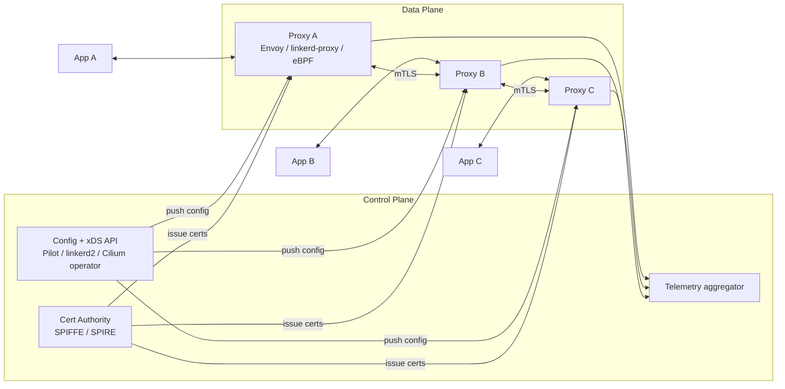
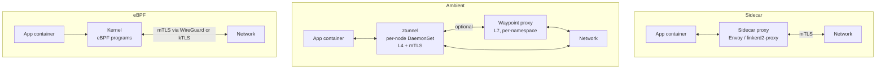
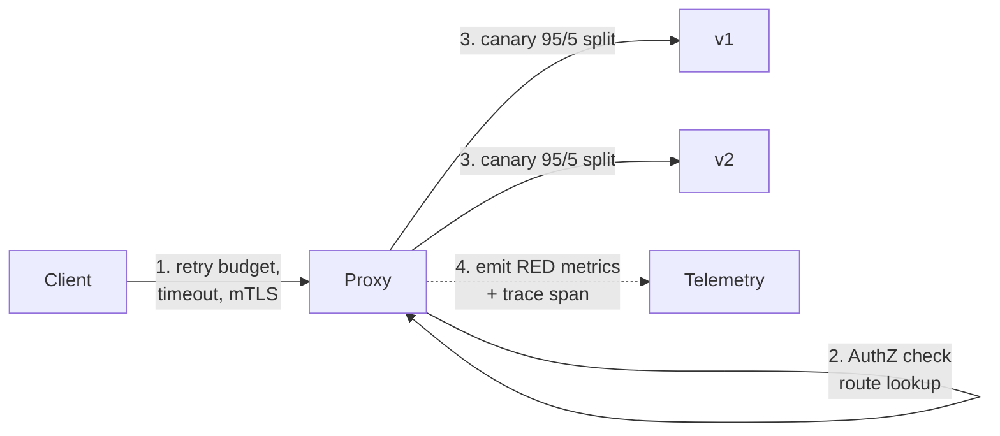
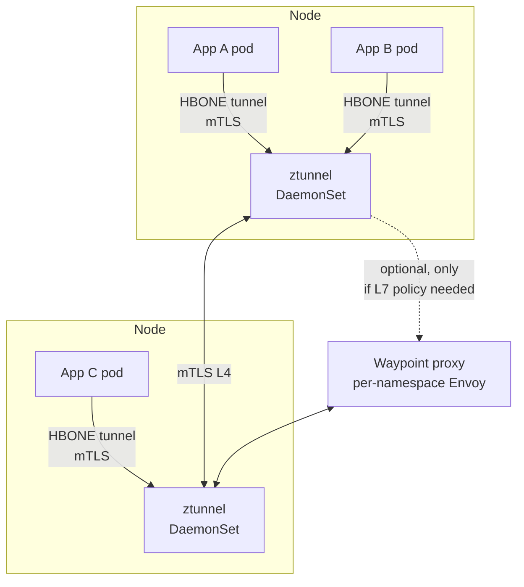

# Service Mesh as an Architectural Decision

**Date:** 2026-04-26 | **Updated:** 2026-04-26
**Tags:** `system-design` `architecture` `service-mesh` `istio` `linkerd`

## Table of Contents

- [Summary](#summary)
- [Why This Matters](#why-this-matters)
- [Overview — What a Mesh Actually Is](#overview--what-a-mesh-actually-is)
- [Key Concepts](#key-concepts)
  - [Data Plane vs Control Plane](#data-plane-vs-control-plane)
  - [Sidecar vs Ambient vs eBPF](#sidecar-vs-ambient-vs-ebpf)
  - [What a Mesh Provides](#what-a-mesh-provides)
- [Trade-offs vs the Alternatives](#trade-offs-vs-the-alternatives)
  - [Mesh vs Library SDK (gRPC interceptors, Finagle, Hystrix)](#mesh-vs-library-sdk-grpc-interceptors-finagle-hystrix)
  - [Mesh vs API Gateway](#mesh-vs-api-gateway)
  - [Mesh vs Nothing (Plain Kubernetes Services)](#mesh-vs-nothing-plain-kubernetes-services)
- [What a Mesh Costs](#what-a-mesh-costs)
- [Comparison Matrix — Istio, Linkerd, Cilium, Consul Connect](#comparison-matrix--istio-linkerd-cilium-consul-connect)
- [Ambient Mesh — Istio's Sidecar-less Path](#ambient-mesh--istios-sidecar-less-path)
- [eBPF Mesh — Cilium's No-Sidecar Bet](#ebpf-mesh--ciliums-no-sidecar-bet)
- [Operational Realities — What Production Actually Looks Like](#operational-realities--what-production-actually-looks-like)
- [When a Mesh Is Overkill](#when-a-mesh-is-overkill)
- [When a Mesh Is Essential](#when-a-mesh-is-essential)
- [Migration Playbook — How to Adopt One Without Breaking Production](#migration-playbook--how-to-adopt-one-without-breaking-production)
- [Real-World Uses](#real-world-uses)
- [Anti-Patterns](#anti-patterns)
- [Design-Review Phrases That Actually Work](#design-review-phrases-that-actually-work)
- [Related](#related)
- [References](#references)

## Summary

A **service mesh** is dedicated infrastructure that handles east-west service-to-service traffic — encryption (mTLS), retries, timeouts, circuit-breaking, traffic splitting, and L7 observability — by intercepting calls outside your application code. The classic implementation is a **sidecar proxy** per pod (Envoy, linkerd2-proxy); newer designs split that into per-node L4 plus optional L7 waypoints (Istio Ambient) or push the L4 path into the kernel via eBPF (Cilium). A mesh buys you uniform policy across a polyglot fleet at the cost of sidecar resources, control-plane complexity, and a debugging surface that now spans both the mesh and the app. **Mesh is essential when the fleet is heterogeneous, polyglot, and operates at scale where library-based solutions can't be enforced uniformly.** It is overkill for a small mono-language fleet — gRPC interceptors and a thin shared library deliver 80% of the value at near-zero ops cost.

## Why This Matters

"Should we adopt a service mesh?" is one of the most expensive yes/no questions in platform engineering. A wrong yes commits you to a multi-quarter rollout, ~10% per-pod CPU/memory tax, and an entire new debugging surface. A wrong no leaves you with N inconsistent retry implementations across N languages, mTLS that nobody actually enforces, and observability that stops at the ingress.

The goal of this doc is to give you the precise vocabulary to:

- Reject "we need Istio because everyone uses it" — Istio is the heaviest mesh and the wrong default for most teams.
- Push back on "the mesh will fix our reliability problems" — a mesh adds a control loop, not magic.
- Articulate _which_ of mTLS, traffic shaping, observability, and policy you actually need, instead of buying all four bundled.
- Separate **mesh** (east-west, intra-cluster) from **API gateway** (north-south, edge) so nobody conflates them.
- Decide between **sidecar**, **ambient**, and **eBPF** modes by their actual operational profiles, not vendor marketing.

If you can do that in an architectural review you're operating a tier above teams that adopted Istio because the CNCF graduation badge looked nice.

## Overview — What a Mesh Actually Is

Strip away the marketing and a service mesh is two things working together:

- The **data plane** is a fleet of proxies that intercept every service-to-service call. Each proxy terminates the inbound TLS, applies retries/timeouts/circuit-breaking/auth policy, and re-originates the outbound call (often as mTLS to the next proxy).
- The **control plane** distributes config (route tables, policies, certs) to the proxies and aggregates telemetry. It does **not** sit on the request path.

The architectural commitment: every L7 concern that used to live in your app or in a shared library now lives in the proxy. Your service code becomes the business logic only, and policy becomes a YAML object the platform team owns.

## Key Concepts

### Data Plane vs Control Plane

Critical distinction: control-plane outages should _not_ break the data plane.

- **Control plane**: receives `VirtualService` / `HTTPRoute` / `AuthorizationPolicy` / `TrafficSplit` resources from Kubernetes API, compiles them, pushes to proxies via xDS (Istio/Envoy) or proprietary gRPC stream (Linkerd). Cert issuance is here too. If the control plane dies, **existing traffic keeps flowing** — proxies use last-known-good config — but new pods can't get certs and config can't change.
- **Data plane**: proxies that handle every request. Latency-critical. Memory-resident config. Their reliability budget is much tighter than the control plane's.

A common production failure mode is operators treating the control plane as if it's on the request path: alerting on control-plane CPU as a P0 when it's actually a P2 because the data plane is fine.

### Sidecar vs Ambient vs eBPF

Three architectural styles, each with different trade-offs:

| Mode | What runs per pod | Per-pod overhead | L7 features | Debug surface |
|------|-------------------|------------------|-------------|---------------|
| **Sidecar** (Istio classic, Linkerd) | Full proxy container | ~50–150 MB RAM, ~10–50 mCPU idle | Full L7 (HTTP, gRPC, JWT, headers) | App + sidecar |
| **Ambient (Istio)** | Nothing per pod; ztunnel per node | ~near-zero per pod | L4 always; L7 only if waypoint deployed | App + ztunnel + waypoint |
| **eBPF (Cilium)** | Nothing per pod; eBPF programs in kernel | Negligible per pod | L4 mostly; L7 via Envoy DaemonSet | App + kernel + DaemonSet |

The trade is consistently: **more isolation per pod = more resources per pod**. Sidecar gives you per-pod blast radius and full L7. Ambient and eBPF amortize across the node.

### Sidecar Injection — How It Actually Works

Worth understanding the mechanics, because half of mesh debugging is debugging the injection plumbing:

1. You label a namespace `istio-injection=enabled` (or `linkerd.io/inject=enabled`).
2. A **MutatingAdmissionWebhook** in the control plane intercepts every Pod admission.
3. The webhook rewrites the pod spec to add the proxy container, an `initContainer` (or eBPF rule on newer setups) that programs iptables to redirect inbound traffic to port 15006 and outbound to 15001 (Istio numbering), and the necessary volume mounts for certs.
4. Kubelet pulls the pod with both containers; the proxy starts, pulls config from the control plane via xDS, and the iptables rules redirect every TCP byte through the proxy.

Failure modes that come from this:
- Webhook misconfiguration → pods either fail to schedule or schedule without sidecars.
- iptables-init container running after the app container starts → races where early outbound calls bypass the mesh.
- Pods that exit before the proxy is ready → readiness probe flapping. Fixed by `holdApplicationUntilProxyStarts`.
- Jobs and CronJobs that complete cleanly but the sidecar keeps running → solved by sidecar lifecycle hooks (`SIGTERM` on app exit) or by the new native sidecar Kubernetes feature (`restartPolicy: Always` on init containers, GA in 1.29).

### What a Mesh Provides

The four buckets a mesh actually fills:

1. **Identity and encryption (mTLS)**
   - Each workload gets a SPIFFE identity (`spiffe://cluster.local/ns/orders/sa/orders-svc`) bound to its Kubernetes ServiceAccount.
   - Auto-rotated short-lived certs (typically 1–24h).
   - Authorization policies expressed in terms of identity, not IP — which is the only sane primitive in a world of churning pods.

2. **Resilience (retries, timeouts, circuit breaking, outlier ejection)**
   - Configurable per route / per destination, no app code change.
   - Critical caveat: **retries multiply load**. Mesh-level retries that aren't budgeted (`retryRemaining` headers, retry budgets) cause retry storms, the same way client-side retries always have. The mesh doesn't fix that — it just moves it.

3. **Traffic management (canary, blue-green, mirroring, A/B, fault injection)**
   - Route 1% of traffic to v2; mirror prod traffic to staging for shadow testing; inject 5xx for chaos drills.
   - This is the strongest argument for adoption — uniform progressive delivery across a polyglot fleet.

4. **Observability (golden signals + L7 metrics)**
   - RED metrics (Rate, Errors, Duration) per service, per route, per destination, automatically.
   - Distributed traces — the mesh propagates `traceparent` / B3 headers; you still need to instrument app spans, but the network hops come for free.
   - Access logs at L7.

## Trade-offs vs the Alternatives

A mesh is one option among three for the same set of concerns. Pick deliberately.

### Mesh vs Library SDK (gRPC interceptors, Finagle, Hystrix)

| Axis | Library SDK | Mesh |
|------|-------------|------|
| Performance | Lower latency (in-process call, no extra hop) | +0.5–2ms p50 per hop, more p99 tail |
| Polyglot fit | Need an SDK per language; consistency drifts | One proxy, language-agnostic |
| Update velocity | Rolling deploy of every service to push a fix | Push config to control plane, propagates in seconds |
| Visibility into app | Can hook business logic, propagate context cleanly | Black-box from app perspective |
| Operational ownership | Each app team owns their SDK upgrade | Platform team owns the mesh |

**The honest test:** if you can list every language and framework in your fleet on one hand, and you control all the codebases, a library is enough. The moment you have a Java/Go/Python/Node mix where Python is on Flask 1.x and Java is on Spring 2.x, library uniformity is a fantasy and a mesh is the cheaper path.

### Mesh vs API Gateway

These solve different problems. People conflate them constantly.

| | API Gateway | Service Mesh |
|---|---|---|
| Direction | North-south (external client → cluster) | East-west (service → service inside cluster) |
| Concerns | AuthN of external users (OAuth, JWT, API keys), rate limiting per consumer, request transformation, schema validation, monetization | Service-to-service identity, retries, traffic split, observability |
| Where it sits | At the cluster edge, often per-product | Per-pod / per-node, fleet-wide |
| Examples | Kong, Apigee, AWS API Gateway, Envoy Gateway | Istio, Linkerd, Cilium |

A real production stack often has both: a gateway terminates external TLS and enforces consumer-level policy, then hands off to the mesh which enforces internal identity-based AuthZ. Newer projects like **Envoy Gateway** and Istio's **Gateway API** support narrow the implementation gap (same proxy, different config surface), but the architectural roles are still distinct.

See [API Gateway design case study](../case-studies/distributed-infra/design-api-gateway.md) for the north-south half.

### Mesh vs Nothing (Plain Kubernetes Services)

Plain Kubernetes gives you:
- DNS-based service discovery (`http://orders.default.svc.cluster.local`).
- L4 load balancing via kube-proxy iptables/IPVS.
- NetworkPolicy for IP-CIDR-based microsegmentation.

It does **not** give you mTLS, retries, timeouts, circuit-breaking, traffic splitting, L7 metrics, or identity-based AuthZ. If your app does all of that itself (via library or by accepting that your network is implicitly trusted), you don't need a mesh.

The watershed moment is usually: "we need mTLS for compliance" or "we need progressive delivery across all services." Up to that point, plain k8s + a thin shared library is fine.

## What a Mesh Costs

Be honest about the bill.

- **Per-pod resources (sidecar mode):** Envoy idles at ~50–100 MB RSS and ~10–30 mCPU even doing nothing; under load this scales with QPS. For a fleet of 5,000 pods, that's ~250–500 GB of RAM and ~50–150 cores reserved purely for the mesh data plane. Linkerd's Rust proxy is materially leaner (~10–30 MB idle) and is the strongest argument for it over Istio in cost-sensitive environments.
- **Control-plane complexity:** Istio adds Istiod (control), the cert authority, and historically the egress/ingress gateways. That's a new operational surface with its own upgrades, its own CRDs (`VirtualService`, `DestinationRule`, `AuthorizationPolicy`, `PeerAuthentication`), and its own failure modes.
- **Debugging surface explodes:** A failed request can now fail in the app, the inbound proxy, the outbound proxy, the control-plane config, the cert chain, or any of the mesh's CRDs. The mental model is "two extra hops with their own L7 policy" and operators must internalize that.
- **Upgrade risk:** Mesh upgrades touch every pod (sidecar) or every node (ambient/eBPF). Botched upgrades cause cluster-wide incidents. The 2022 Istio CVE-2022-21679 and various Linkerd cert-rotation bugs have been real outages at real companies.
- **Telemetry cost:** The mesh emits per-request metrics. At 100k QPS with default Istio metric cardinality, you can blow up Prometheus. Sampling and metric pruning are mandatory at scale.

### Mesh vs Service Discovery Layer

A subtle one. Service discovery (kube-dns, Consul catalog, Eureka) returns _where_ a service is. A mesh decides _how_ to call it — which endpoint, with what retry policy, with what identity. They are complementary, not substitutes. The mesh consumes service discovery output (the endpoint list) and adds the L7 layer on top. See [Service Discovery](./service-discovery.md) for the layer below.

## Comparison Matrix — Istio, Linkerd, Cilium, Consul Connect

| | Istio (sidecar) | Istio Ambient | Linkerd | Cilium Service Mesh | Consul Connect |
|---|---|---|---|---|---|
| **Data plane** | Envoy sidecar | ztunnel (L4) + waypoint Envoy (L7) | linkerd2-proxy (Rust) sidecar | eBPF + per-node Envoy for L7 | Envoy sidecar (or built-in) |
| **Per-pod overhead** | High (~100 MB) | Near-zero | Low (~20 MB) | Near-zero | Medium |
| **Language of proxy** | C++ (Envoy) | C++ + Rust ztunnel | Rust | C (eBPF) + C++ (Envoy for L7) | C++ |
| **mTLS** | SPIFFE, Istiod CA, configurable cert lifetime | Same | Mandatory by default; auto cert rotation | WireGuard or IPsec (L4); mTLS via Envoy (L7) | Built-in CA or external (Vault) |
| **L7 features** | Full (HTTP, gRPC, headers, JWT, WASM filters) | Full (when waypoint deployed) | HTTP, gRPC, basic headers; less than Istio | Via Envoy DaemonSet — narrower than Istio | Full (Envoy) |
| **API surface** | `VirtualService`, `DestinationRule`, `AuthorizationPolicy`; moving to Gateway API + new Istio CRDs | Same + waypoint resources | `ServiceProfile`, `HTTPRoute`, lightweight | `CiliumNetworkPolicy`, Gateway API, `CiliumEnvoyConfig` | `ServiceIntention`, `ServiceRouter` |
| **Multi-cluster** | Mature (multi-primary, primary-remote) | Maturing | Multi-cluster via gateway pairing | Cluster Mesh (eBPF tunnel between clusters) | Yes |
| **Best for** | Largest ecosystem, most knobs, biggest team | Cost-sensitive Istio shops; orgs that want fewer per-pod resources | Simplicity, low overhead, "it just works" | Already running Cilium CNI; want kernel-level perf | HashiCorp shops; non-k8s workloads (VMs, Nomad) |
| **Worst for** | Small teams; cost-sensitive fleets | Brand-new tech; rough edges on L7 waypoint | Teams needing rich L7 routing or WASM | Teams needing rich L7 right now | Teams without HashiCorp investment |

A few of these comparisons deserve unpacking:

- **Linkerd** is opinionated and deliberately small. Its proxy is Rust (memory-safe, leaner than Envoy), its CRDs are minimal, and it ships with sane defaults. The Buoyant team's argument — that you should not need WASM filters or 50 CRDs — is correct for most teams.
- **Istio's ecosystem** is genuinely the biggest: integrations with Kiali, Jaeger, every CNI, every cloud provider's load balancer, and the deepest catalog of WASM extensions. If you need a feature, Istio probably has it. The cost is operational weight.
- **Cilium** comes from the CNI direction, not the mesh direction. If you are already running Cilium as your CNI, getting mesh features is largely a config flip. If you are running another CNI, swapping to Cilium just to get the mesh is a much bigger commit.
- **Consul Connect** is the right pick when you have non-k8s workloads (VMs, bare metal, Nomad) participating in the mesh. Pure-k8s shops generally pick Istio or Linkerd.

## Ambient Mesh — Istio's Sidecar-less Path

Announced 2022, in active rollout 2024–2026. The architectural idea is to split mesh concerns by layer:

- **ztunnel** (Rust, per-node DaemonSet): handles L4 mTLS using a custom protocol called HBONE (HTTP-Based Overlay Network Environment — basically HTTP CONNECT tunneling over TLS). Provides identity, encryption, and basic telemetry for every pod on the node.
- **Waypoint proxies** (Envoy, per-namespace): deployed only when L7 features are needed for that namespace's traffic. Can be skipped entirely for L4-only flows.

What this buys you:

- Per-pod resource cost drops to near-zero. Big fleets save real money.
- L7 cost becomes opt-in per namespace. The 80% of services that just need mTLS pay only for ztunnel.
- Pods don't need to be restarted to join the mesh — ztunnel intercepts at the node level via iptables/eBPF redirection.

What it costs:

- New tech with a smaller production track record than sidecar Istio.
- Debugging now spans app + ztunnel + waypoint, with HBONE in the middle.
- Some Envoy-specific features (WASM filters that needed sidecar context) don't translate cleanly.

## eBPF Mesh — Cilium's No-Sidecar Bet

Cilium's argument: most of what a sidecar does at L4 (mTLS, identity, basic policy) can be done in the kernel via eBPF programs, with no userspace proxy at all. L7 features — when needed — go through a per-node Envoy that's shared across all pods on that node.

What eBPF lets you do:
- Hook every packet at the socket / TC / XDP layer in-kernel. No userspace context switch.
- Apply identity-based policy with O(1) lookup using BPF maps.
- Encrypt with WireGuard or IPsec at the kernel level (faster than Envoy-terminated TLS for raw bytes).
- Get tracing/observability via `cilium hubble` without a per-pod proxy.

What eBPF can't (or shouldn't) do:
- Rich HTTP routing, header manipulation, JWT validation. Cilium delegates this to Envoy.
- WASM extensions. Same reason.
- Complex retry budgets and circuit-breaking logic. eBPF is great for fast paths; complex stateful logic belongs in userspace.

The pragmatic line in Cilium today: eBPF for L4 + identity, Envoy DaemonSet (not per-pod sidecar) for L7. That gives you most of a mesh's value without per-pod overhead, with the caveat that the L7 surface is narrower than Istio's.

## Operational Realities — What Production Actually Looks Like

A few operational truths that vendor docs gloss over:

- **Cert rotation is the most common mesh outage.** Short-lived certs (1–24h) are great for security and a constant background source of incidents. Clock skew, control-plane unreachable for >TTL, mistuned `peerAuthentication` policies — all manifest as 503s with TLS errors in the proxy log. Your runbook should include "is the cert expired?" as the first check.
- **The proxy log is not your friend at 100k QPS.** Default access logging at full L7 detail will fill your log pipeline. Sample, or restrict to error responses.
- **Upgrade in canary mode, never in-place fleet-wide.** Istio supports revision-based upgrades (`istio.io/rev` label) — install the new control plane alongside the old, migrate namespaces one at a time. This is non-negotiable for production.
- **Mesh CRDs need to be in the same GitOps repo as workloads.** A `VirtualService` change can break traffic just like a `Deployment` change can. Same review process, same deployment cadence.
- **mTLS migration is a multi-quarter project.** You roll out in **PERMISSIVE** mode first (mesh accepts both plaintext and mTLS), let everything migrate, then flip to **STRICT**. Skipping PERMISSIVE causes outages because some traffic source you forgot about (a cron job, a debug pod, an external scraper) was still plaintext.

## When a Mesh Is Overkill

A mesh is the wrong answer when:

- **Mono-language fleet, < ~30 services.** A gRPC interceptor library (`grpc.UnaryInterceptor` / `grpc.StreamInterceptor`) plus a thin retry/timeout helper covers retries, timeouts, deadline propagation, mTLS via the standard `credentials` package, and metrics emission. You spend a week, not a quarter.
- **You don't have a platform team.** A mesh requires someone to own the control plane upgrades, debug the cert rotation issues, and answer "why is my service returning 503?" If that owner doesn't exist, the mesh becomes shadow infrastructure that nobody understands.
- **Your real bottleneck is observability, not policy.** OpenTelemetry SDKs + Prometheus client libraries solve observability without a mesh.
- **You need a feature in two weeks.** A mesh rollout is a multi-quarter project. If the next deadline is "implement canary releases," start with a `Deployment` + `kubectl scale` + a feature flag service. Add a mesh when the friction of doing it manually exceeds the cost of operating one.
- **Your security model is "trust the network."** If your compliance team is fine with that (it shouldn't be in 2026, but sometimes), the mTLS argument doesn't carry.

## When a Mesh Is Essential

A mesh is the right answer when:

- **Polyglot fleet at scale.** Java, Go, Python, Node, Rust, Ruby — getting consistent retry policy, mTLS, deadline propagation, and metrics across that mix via libraries is a Sisyphean version drift problem. A mesh makes it one config plane.
- **Compliance demands uniform mTLS.** PCI-DSS, HIPAA, SOC 2, FedRAMP — the auditor wants "every service-to-service hop is encrypted with rotating short-lived certs and identity-based AuthZ." Hand-rolling that across N languages is a nightmare; a mesh is the answer.
- **Progressive delivery across the whole fleet.** Canary, blue-green, traffic mirroring at 1% — uniform across all services. The platform team rolls these out as standard primitives instead of each team rebuilding them.
- **Multi-cluster / multi-region with identity-aware routing.** When `orders` in `us-east` needs to fail over to `orders` in `us-west`, with the same identity and the same policy, you're in mesh territory.
- **Zero-trust mandate.** Identity-based AuthZ (`only payments-svc with ServiceAccount X can call ledger-svc`) is hard to do without a mesh. NetworkPolicy alone is too coarse — pods get recycled, IPs churn.
- **You already broke 1,000 services into microservices and the support surface is unmanageable.** This is the unfortunate but most common reason. The mesh becomes the lingua franca that lets a platform team enforce defaults across teams that don't agree on anything.

## Migration Playbook — How to Adopt One Without Breaking Production

If you've decided to adopt, the rough sequence that has worked across multiple production rollouts:

1. **Pick the mesh based on the dominant constraint.** Cost-sensitive polyglot fleet → Linkerd. Largest feature surface and biggest team → Istio. Already running Cilium → Cilium. Multi-platform (k8s + VMs) → Consul.
2. **Stand up the control plane in a non-production cluster first.** Run for at least two weeks. Practice a control-plane upgrade. Practice a cert authority rotation.
3. **Roll out to one low-risk namespace in production.** PERMISSIVE mTLS, no AuthZ policies yet, no traffic shaping. Just observe metrics.
4. **Wire the mesh metrics into existing dashboards and SLOs.** This is where you start getting value back. RED metrics per service, latency percentiles per route, error breakdowns by upstream identity.
5. **Expand to more namespaces, still PERMISSIVE.** Watch for protocol incompatibilities (HTTP/1.0 services that the proxy can't parse, services that do raw TCP that you need to mark as TCP-only routes).
6. **Roll out STRICT mTLS, namespace by namespace.** Each flip is a small blast radius. Have a rollback plan that's been tested.
7. **Add AuthZ policies last, default-allow → default-deny.** Start with `AuthorizationPolicy` in dry-run / log-only mode if your mesh supports it. Burn down the unintended denies. Then enforce.
8. **Layer in traffic management once the boring stuff is solid.** Canary, mirroring, fault injection — these are the high-value features that make adoption worth it. They are also the ones most likely to break things, so they go last, not first.

The whole rollout is typically 2–4 quarters for a fleet in the hundreds of services. Anyone promising faster is selling something.

## Real-World Uses

- **Lyft**: built Envoy specifically because the polyglot mesh problem at Lyft scale was unsolvable with libraries. Envoy is now the dominant mesh data plane in the industry (donated to CNCF, used by Istio, Consul Connect, AWS App Mesh).
- **Google**: runs an internal mesh predating Kubernetes (the lineage that became Istio). Anthos Service Mesh is the productized version. Cross-cluster identity and policy at Google scale required mesh-style infrastructure since the early 2010s.
- **Microsoft / Azure**: Open Service Mesh (now retired) tried the simpler-Linkerd approach; Microsoft has since aligned more on Istio and Cilium.
- **HelloFresh, Salesforce, eBay, Shopify**: published case studies of Istio rollouts ranging from "uniform mTLS for compliance" (HelloFresh) to "thousands-of-services traffic management" (eBay, Salesforce).
- **Linkerd at Buoyant customers**: heavily picked by mid-sized teams that explicitly chose simplicity over Istio's surface area. Buoyant's blog has the most honest comparative writing in the space.
- **Cilium at Datadog, Adobe, Bell Canada**: largely came in via the CNI side (Cilium replacing kube-proxy, calico, etc.) and then turning on mesh features as a free upgrade.
- **Consul Connect at HashiCorp shops**: Roblox is a notable case — multi-cloud, multi-platform (k8s + VMs + Nomad), where Consul's identity layer spans more than just Kubernetes.

## Anti-Patterns

- **Adopting a mesh as a default.** "Every k8s cluster gets Istio" is a platform-team flex, not an architectural decision. The right default for a small cluster is no mesh.
- **Mesh for 5 services.** The complexity tax dwarfs the value. Use library interceptors and a `NetworkPolicy`. Re-evaluate at ~30 services.
- **Ignoring sidecar resource overhead.** Teams that adopt Istio classic without budgeting ~100 MB and ~30 mCPU per pod are surprised when their cluster bill jumps 15–25%. Linkerd or ambient is materially cheaper here.
- **Treating mesh retries as free reliability.** Retries multiply load. Without retry budgets, mesh-level retries cause retry storms during incidents (every layer retries 3x, total amplification ~27x). Always cap mesh retries _and_ propagate retry budgets via headers.
- **Conflating mesh with API gateway.** "We have Istio so we don't need Kong" — you do, unless you accept that consumer-level rate limiting, OAuth flows, and request transformation belong in the same proxy as your service-to-service mTLS. Most teams find that scope is too wide.
- **Letting policy CRDs sprawl.** Each `VirtualService`, `DestinationRule`, and `AuthorizationPolicy` is a piece of cluster-wide config that can break traffic. No CRD review process = production outages. GitOps + a review process for mesh CRDs is non-negotiable.
- **Skipping the observability rollout.** Adopting a mesh and not piping the L7 metrics into your dashboards / SLOs is leaving the biggest single value on the floor.
- **Using the mesh to paper over a bad service boundary.** If two services need to call each other 50 times for one user request, a mesh doesn't fix the chattiness — it makes each hop slower and more visible. Fix the boundary first.
- **Believing the control plane is on the request path.** Operators page on Istiod CPU at 90% as if it's a P0. It's not. Data-plane errors are P0; control-plane errors are P1/P2 unless they prevent cert rotation.

## Design-Review Phrases That Actually Work

What to say instead of "let's adopt Istio":

- "We have a polyglot fleet and a compliance-driven mTLS requirement. Mesh is the cheapest path to uniform encryption. We're picking Linkerd over Istio because our L7 needs are basic and the per-pod overhead matters at our scale."
- "We don't need a mesh yet. We have 12 services, all Go, and a shared `internal/grpcmw` package handles retries, timeouts, deadline propagation, and OTel spans. Re-evaluate at 30+ services or when we add a second language."
- "Ambient mode lets us pay for L7 only in the namespaces that need it. We'll roll out ztunnel cluster-wide for mTLS and add waypoints for the two namespaces that actually need header-based routing."
- "Mesh and gateway are different scopes. Kong stays at the edge for OAuth and per-consumer rate limiting; the mesh enforces internal SPIFFE-based AuthZ. Don't merge them."
- "Mesh retries without a budget will amplify load during incidents. We're capping mesh-level retries at 1 and pushing client retry decisions back into the app where the business context lives."

## Related

- [Sidecar Pattern](./sidecar-pattern.md) — the per-pod deployment pattern that classic mesh is built on.
- [Service Discovery](./service-discovery.md) — what the mesh's data plane is doing under the hood for endpoint resolution.
- [Design a Load Balancer](../case-studies/distributed-infra/design-load-balancer.md) — the L4/L7 load-balancing mechanics the mesh proxies implement at every hop.
- [Design an API Gateway](../case-studies/distributed-infra/design-api-gateway.md) — the north-south sibling to the east-west mesh.
- [CAP, PACELC, and Consistency Models](../foundations/cap-and-consistency-models.md) — the consistency vocabulary that helps frame "what does the mesh actually guarantee about my distributed call?"

## References

- [Istio documentation](https://istio.io/latest/docs/) — the canonical Istio reference, including Ambient and the new Gateway API integration.
- [Istio Ambient Mesh announcement](https://istio.io/latest/blog/2022/introducing-ambient-mesh/) (2022) — the original architectural argument for ztunnel + waypoint.
- [Linkerd documentation](https://linkerd.io/2/overview/) — Linkerd's reference and the linkerd2-proxy (Rust) design rationale.
- [William Morgan, "The Service Mesh: What Every Software Engineer Needs to Know about the World's Most Over-Hyped Technology"](https://servicemesh.es/) — the canonical comparative essay; required reading.
- [Buoyant blog](https://buoyant.io/blog) — Linkerd-team writing on simplicity vs Istio's surface area, ambient mesh trade-offs, and per-pod resource costs.
- [Cilium Service Mesh documentation](https://cilium.io/use-cases/service-mesh/) — the eBPF-first argument and where Cilium delegates to Envoy.
- [Consul Connect documentation](https://developer.hashicorp.com/consul/docs/connect) — multi-platform mesh covering k8s + VMs + Nomad.
- [Lyft Envoy blog series](https://eng.lyft.com/announcing-envoy-c-l7-proxy-and-communication-bus-78a52e3f3e95) — origin story of the dominant data-plane proxy.
- [SPIFFE / SPIRE spec](https://spiffe.io/) — the workload identity standard used by every modern mesh.
- [CNCF Service Mesh landscape](https://landscape.cncf.io/card-mode?category=service-mesh&grouping=category) — current vendor and project map.
