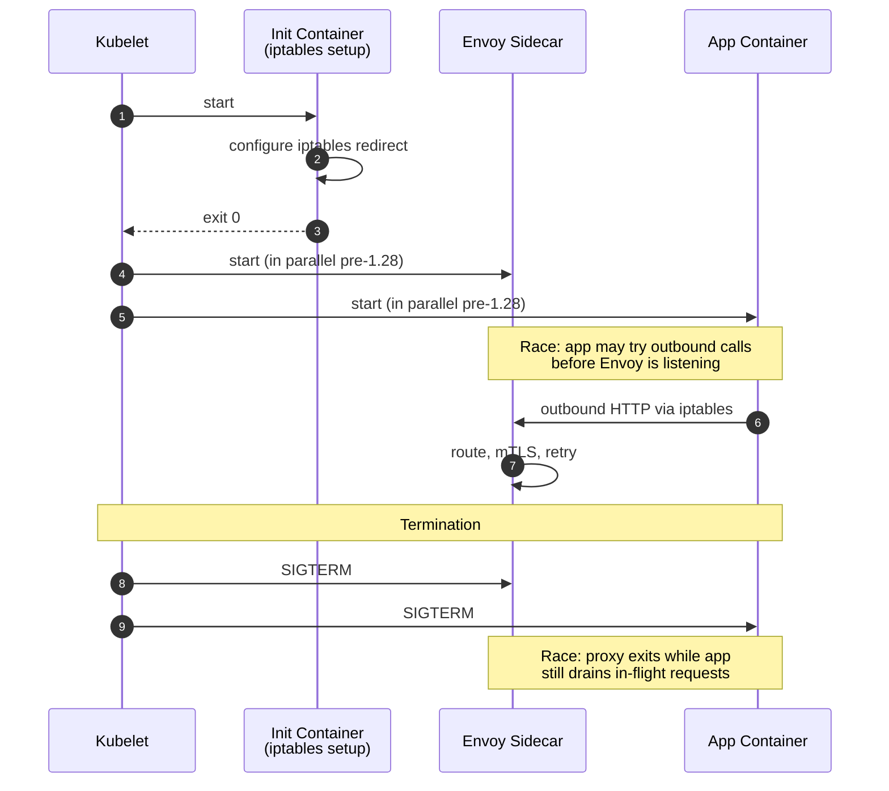
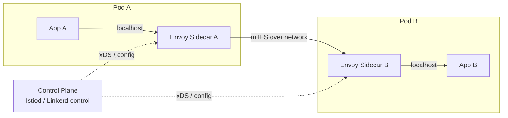
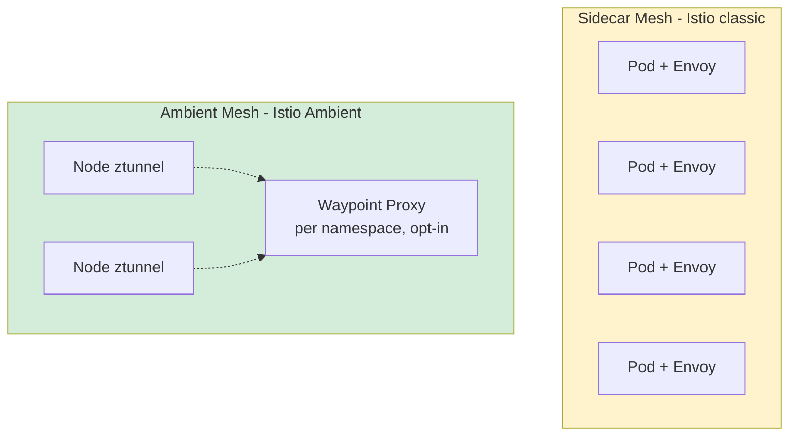

# Sidecar Pattern — Beyond Service Mesh

**Date:** 2026-04-26 | **Updated:** 2026-04-26
**Tags:** `system-design` `architecture` `sidecar` `service-mesh` `kubernetes`

## Table of Contents

- [Summary](#summary)
- [Why This Matters](#why-this-matters)
- [Overview — Out-of-Process Companion](#overview--out-of-process-companion)
- [Key Concepts](#key-concepts)
  - [Sidecar Lifecycle and the Pod Model](#sidecar-lifecycle-and-the-pod-model)
  - [Init Containers vs Sidecars](#init-containers-vs-sidecars)
  - [Classic Sidecar Use Cases](#classic-sidecar-use-cases)
  - [Traffic Proxy Sidecars — Envoy, Linkerd2-proxy, NGINX](#traffic-proxy-sidecars--envoy-linkerd2-proxy-nginx)
  - [Ambient Mesh and the Sidecarless Alternative](#ambient-mesh-and-the-sidecarless-alternative)
  - [Kubernetes 1.28 Native Sidecar Support](#kubernetes-128-native-sidecar-support)
- [Trade-offs](#trade-offs)
  - [Resource Overhead](#resource-overhead)
  - [Isolation and Failure Domains](#isolation-and-failure-domains)
  - [Operational Complexity](#operational-complexity)
- [Code Examples](#code-examples)
  - [Pod with Logging Sidecar](#pod-with-logging-sidecar)
  - [Pod with Init Container Plus Sidecar](#pod-with-init-container-plus-sidecar)
  - [Native Sidecar (K8s 1.28+)](#native-sidecar-k8s-128)
  - [Envoy Traffic Sidecar (Istio-style)](#envoy-traffic-sidecar-istio-style)
- [Real-World Uses](#real-world-uses)
- [Anti-Patterns](#anti-patterns)
- [Related](#related)
- [References](#references)

## Summary

The sidecar pattern attaches an auxiliary, out-of-process companion to a main application — same lifecycle, same network and storage namespaces, separate concern. Kubernetes makes the pattern first-class through the **Pod** abstraction: multiple containers sharing a network namespace and volumes. Classic sidecars include log shippers, config-sync agents, secret fetchers, and TLS-terminating proxies. The most famous instance is the **service-mesh data plane** — Envoy in Istio, linkerd2-proxy in Linkerd — injected next to every workload to do mTLS, retries, traffic shifting, and telemetry. The cost is a per-pod CPU/memory tax that scales linearly with the fleet, which is why **ambient meshes** (Istio Ambient, Cilium Service Mesh) are pushing the data plane out of the pod and onto the node. Kubernetes 1.28 finally made sidecar lifecycle a real, supported concept (`restartPolicy: Always` on init containers) instead of a community workaround.

## Why This Matters

A senior engineer will hit the sidecar pattern from at least three angles: as the cleanest way to add cross-cutting concerns to a service without changing its code (logging, metrics, secrets), as the architectural backbone of a service mesh (every Istio install is "Envoy as a sidecar"), and as a recurring source of production headaches (proxy starts after the app, app shuts down before the proxy drains, OOMKills triggered by a misconfigured Envoy). Understanding when to reach for a sidecar — and when **not** to — is what separates someone who deploys a Helm chart from someone who actually owns a platform.

## Overview — Out-of-Process Companion

The pattern's principle is unchanged from the original Bill Wilder / Microsoft Azure articulation:

> Deploy components of an application into a separate process or container to provide isolation and encapsulation. This pattern can also enable applications to be composed of heterogeneous components and technologies.

A sidecar is **not a microservice**. The defining properties:

- **Same lifecycle as the main app.** It starts with it, scales with it, dies with it. If you are running it on a different schedule, it's a separate service, not a sidecar.
- **Co-located.** Same host (in K8s, same Pod). Network calls between the main app and sidecar are localhost, not cross-node hops.
- **Separate process / container.** Different language, runtime, release cadence, security context. This is the whole point — you don't want to link a C++ Envoy library into your Java app.
- **Single concern.** A sidecar that does logging _and_ TLS _and_ config sync is three sidecars.

Compared to the alternatives:

| Approach | Where the cross-cutting code lives | Per-language SDKs needed? | Independent rollouts? |
|----------|------------------------------------|---------------------------|------------------------|
| **In-app library** | Linked into every service | Yes — one per language | No — service redeploys |
| **Sidecar** | Adjacent container | No — language-agnostic | Yes — bump the sidecar image |
| **Node-level agent (DaemonSet)** | One per node, shared by all pods | No | Yes — but blast radius is the node |
| **Ambient / sidecarless** | Node-level shared proxy + L7 waypoints | No | Yes |

## Key Concepts

### Sidecar Lifecycle and the Pod Model

A Kubernetes Pod is the unit of co-location: one or more containers sharing:

- A **network namespace** — they all reach each other on `localhost`. This is what lets the app `POST http://localhost:15000/log` to its log shipper without service discovery.
- A **set of volumes** — emptyDir, configMaps, projected secrets. This is how a config-sync sidecar drops a freshly-rendered file that the app reads.
- A **lifecycle** — the pod is the scheduling and termination unit. Kubelet starts/stops containers in a pod together (with caveats below).
- An **IPC namespace and PID namespace** (optionally shared via `shareProcessNamespace: true`).

Before Kubernetes 1.28 (stable in 1.29), a "sidecar" was just _a regular container that happened to be in the same pod_. That distinction matters because it broke in two predictable ways:

1. **Startup ordering.** Containers in `spec.containers` start in parallel. The app would race the proxy. If your app made an outbound call before Envoy was ready, it failed.
2. **Shutdown ordering.** All containers got SIGTERM at the same time. The proxy would die before the app finished draining, so in-flight requests got connection-reset.

Operators worked around this with `preStop` hooks, init containers that "primed" things, and Istio's notorious `holdApplicationUntilProxyStarts` flag.



### Init Containers vs Sidecars

These are different beasts despite both living in the pod spec:

| | **Init container** | **Sidecar (classic)** | **Native sidecar (1.28+)** |
|--|--------------------|------------------------|------------------------------|
| Field | `spec.initContainers` | `spec.containers` | `spec.initContainers` with `restartPolicy: Always` |
| Runs to completion? | Yes, before app starts | No, runs alongside app | No, runs alongside app |
| Order | Sequential, before main containers | Parallel with main | Sequential start, lifecycle tied to main |
| Restart on failure | Per pod restart policy | Yes | Yes |
| Use case | Setup work: DB migration, iptables, secret bootstrap | Log shipping, proxy, telemetry | Same as classic, but with proper ordering |

The Istio install does both: an **init container** runs `istio-iptables` to redirect pod traffic to the proxy, then the **sidecar container** (Envoy) runs as a long-lived process.

### Classic Sidecar Use Cases

The pattern predates service mesh by a decade. Real production sidecars:

- **Log shipper.** Fluent Bit / Vector / Filebeat tailing the app's stdout or a shared volume and forwarding to Loki/Elasticsearch/CloudWatch. Keeps the app blissfully unaware of where logs go.
- **Config sync / config reloader.** `git-sync` cloning a repo into a volume; `config-reloader` watching a ConfigMap and SIGHUP-ing the app. Standard in Prometheus, Alertmanager, NGINX setups.
- **Secret fetcher.** Vault Agent injector, AWS Secrets Manager CSI sidecar, doppler-cli. Pulls fresh credentials, writes them to a tmpfs, signals the app to reload. Avoids baking secrets into images.
- **Crypto / TLS proxy.** Stunnel, ghostunnel, hitch — a TLS-terminating sidecar that lets a plain-HTTP app speak HTTPS. The original "envoy" pattern before Envoy.
- **Database proxy.** Cloud SQL Auth Proxy, RDS Proxy via sidecar, PgBouncer. App talks plaintext localhost; sidecar handles authentication, IAM tokens, connection pooling, TLS to the cloud DB.
- **Adapter / API translator.** Old SOAP service in front of a modern HTTP/JSON API; sidecar translates and exposes a clean port.
- **Traffic proxy (service mesh data plane).** The big one — see next section.

### Traffic Proxy Sidecars — Envoy, Linkerd2-proxy, NGINX

The service-mesh world standardized on injecting an L7 proxy next to every workload. Three notable implementations:

| Proxy | Language | Used by | Strengths | Weaknesses |
|-------|----------|---------|-----------|------------|
| **Envoy** | C++ | Istio, Consul, AWS App Mesh, Gloo | Most features (xDS, WASM filters, deep observability), battle-tested at Lyft/Google | Heavy: ~50–150 MB RAM idle, complex config |
| **linkerd2-proxy** | Rust | Linkerd 2.x | Tiny (~15–20 MB RAM), memory-safe, single-purpose | Less feature surface; Linkerd-specific |
| **NGINX** | C | Kong Mesh (older), some custom setups | Familiar, fast | Less dynamic config, weaker xDS support |

Why Linkerd chose Rust over Envoy is worth knowing: Linkerd's proxy is intentionally minimal and security-paranoid. Memory safety in C++ Envoy has been a real CVE source. Rust eliminates an entire vulnerability class (use-after-free, buffer overrun) at zero runtime cost. The trade is a smaller feature surface — Envoy's WASM extensibility and rich filter chain don't exist in linkerd2-proxy.



What the traffic sidecar gives you:

- **mTLS** between every pod, with cert rotation handled by the control plane.
- **Retries, timeouts, circuit breaking** — moved out of the app.
- **Traffic shifting** — canary, blue-green, fault injection (chaos testing).
- **Telemetry** — RED metrics (rate, errors, duration), distributed tracing headers, access logs.
- **Authorization policy** — service-to-service AuthZ at L7.

See [Service Mesh as an Architectural Decision](./service-mesh-as-architectural-decision.md) for when this is worth the cost.

### Ambient Mesh and the Sidecarless Alternative

The cost of "Envoy in every pod" is real: at 1000 pods you've duplicated Envoy 1000 times, paying CPU/RAM for each instance. Two responses to that:

**Istio Ambient Mesh** (GA in 2024) splits the data plane in two:

- **ztunnel** — a per-node proxy (one per K8s node, written in Rust) that handles L4 mTLS for every pod on that node. No more sidecars.
- **Waypoint proxy** — an Envoy deployment per namespace/identity that handles L7 policy when you actually need it (HTTP routing, AuthZ on paths, etc.).

If you only need mTLS and L4 policy, you pay for ztunnel only. If you need L7 features for some workloads, you opt them into a waypoint. The per-pod tax goes away.

**Cilium Service Mesh** takes a different angle: use eBPF in the kernel to do mesh functions at the socket layer, eliminating the proxy hop entirely for many cases. mTLS via SPIFFE, L7 policy via Envoy when needed (one Envoy per node, not per pod).



The trade-off in ambient: you lose the strong "every pod's identity is enforced at its own edge" property. The blast radius of a compromised ztunnel covers every pod on the node, not just one.

### Kubernetes 1.28 Native Sidecar Support

In K8s 1.28 (alpha), 1.29 (beta, default-on), and 1.33 (stable), sidecars became a first-class concept. The mechanism is deliberately minimal: a container in `initContainers` with `restartPolicy: Always`.

What that buys you:

1. **Sequential startup** — sidecar inits start in order; main containers start only after all sidecar inits report `Started: true`. No more proxy/app race.
2. **Reverse-order shutdown** — main containers terminate first, then sidecars. The proxy outlives the app's draining window.
3. **Long-lived** — unlike a normal init container, it doesn't run-to-completion. It restarts if it crashes.
4. **Job-friendly** — sidecars no longer block `Job` completion. Previously, a logging sidecar would keep a Job "running" forever; now the Job sees app completion and terminates the sidecar.

This single feature has retired thousands of lines of `holdApplicationUntilProxyStarts` workarounds, custom `preStop` sleeps, and lifecycle-coordination Helm voodoo across the ecosystem.

## Trade-offs

### Resource Overhead

The honest math, per pod, for a typical Envoy sidecar:

- **CPU:** 50–200 millicores idle, spikes to 500m+ under load.
- **Memory:** 50–150 MiB idle, can balloon with large config (xDS pushes for 10k clusters can hit 500 MiB+).
- **Latency:** 1–5 ms added per hop for mTLS handshake reuse + L7 routing.

For a 1000-pod cluster, that's an extra ~50–200 cores and ~50–150 GiB just for sidecars. linkerd2-proxy cuts that by roughly 5–10×, which is much of the reason teams pick Linkerd over Istio when feature parity allows.

### Isolation and Failure Domains

Pros:

- **Crash isolation.** Sidecar OOMs do not crash the app. (They can still break its networking — a dead Envoy means no outbound calls.)
- **Independent upgrades.** Bump the proxy image without redeploying the app. Critical for security patches.
- **Polyglot.** A Java app, a Rust app, and a Python app all use the same sidecar binary.

Cons:

- **Shared blast radius for resources.** If the sidecar consumes the pod's memory limit, the kernel OOM-killer may kill the wrong container. Set independent resource limits.
- **Implicit coupling.** The app silently depends on the sidecar's presence. Forgetting to inject the sidecar in a new namespace produces baffling failures.
- **Debugging surface area.** "Why did this request fail?" now has two processes to inspect, not one.

### Operational Complexity

A sidecar adds:

- A second container in every pod to monitor, alert on, and patch.
- A control-plane dependency (Istiod, Linkerd control) — another tier-1 system.
- A new CRD surface — `VirtualService`, `DestinationRule`, `AuthorizationPolicy`, `Gateway`.
- A non-trivial mental model — iptables redirect, mTLS identity, xDS push timing, certificate rotation.

The sidecar pattern is **not free**. Use it when the cross-cutting concern genuinely justifies the per-pod cost. For one or two services, a library is simpler. For 50 services in 5 languages, the sidecar wins.

## Code Examples

### Pod with Logging Sidecar

```yaml
apiVersion: v1
kind: Pod
metadata:
  name: app-with-log-shipper
spec:
  volumes:
    - name: app-logs
      emptyDir: {}
  containers:
    - name: app
      image: registry.example.com/api:1.4.2
      volumeMounts:
        - name: app-logs
          mountPath: /var/log/app
      # App writes JSONL to /var/log/app/app.log
    - name: log-shipper
      image: fluent/fluent-bit:3.1
      volumeMounts:
        - name: app-logs
          mountPath: /var/log/app
          readOnly: true
      resources:
        requests: { cpu: "20m", memory: "32Mi" }
        limits:   { cpu: "100m", memory: "128Mi" }
```

The shared `emptyDir` is the contract. The app does not know about Loki; the shipper does not know about the app's business logic.

### Pod with Init Container Plus Sidecar

```yaml
apiVersion: v1
kind: Pod
metadata:
  name: app-with-istio-classic
  annotations:
    sidecar.istio.io/inject: "true"
spec:
  initContainers:
    - name: istio-init   # init container — runs to completion
      image: docker.io/istio/proxyv2:1.22.0
      args: ["istio-iptables", "-p", "15001", "-z", "15006", ...]
      securityContext:
        capabilities: { add: ["NET_ADMIN", "NET_RAW"] }
  containers:
    - name: app
      image: registry.example.com/api:1.4.2
      ports: [{ containerPort: 8080 }]
    - name: istio-proxy  # classic sidecar — long-lived, parallel start
      image: docker.io/istio/proxyv2:1.22.0
      ports:
        - { containerPort: 15090, name: http-envoy-prom }
      resources:
        requests: { cpu: "100m", memory: "128Mi" }
        limits:   { cpu: "2",    memory: "1Gi" }
      lifecycle:
        preStop:
          exec:
            command: ["sh", "-c", "sleep 5 && pilot-agent request POST quitquitquit"]
```

The `preStop` hook is the historical workaround for the shutdown race: sleep 5s so the app finishes draining, then ask Envoy to exit gracefully.

### Native Sidecar (K8s 1.28+)

```yaml
apiVersion: v1
kind: Pod
metadata:
  name: app-with-native-sidecar
spec:
  initContainers:
    - name: istio-init
      image: docker.io/istio/proxyv2:1.22.0
      args: ["istio-iptables", "-p", "15001", "-z", "15006"]
      # No restartPolicy — runs to completion, traditional init container
    - name: istio-proxy
      image: docker.io/istio/proxyv2:1.22.0
      restartPolicy: Always         # ← makes this a NATIVE SIDECAR
      ports:
        - { containerPort: 15090 }
      startupProbe:
        httpGet: { path: /ready, port: 15021 }
        periodSeconds: 1
        failureThreshold: 30
      resources:
        requests: { cpu: "100m", memory: "128Mi" }
  containers:
    - name: app
      image: registry.example.com/api:1.4.2
      # Will only start AFTER istio-proxy startupProbe passes
      # Will terminate BEFORE istio-proxy on shutdown
      ports: [{ containerPort: 8080 }]
```

`restartPolicy: Always` on an init container is the entire 1.28 native-sidecar API. Note: that field is otherwise illegal on init containers — that's how the kubelet recognizes the sidecar role.

### Envoy Traffic Sidecar (Istio-style)

A snippet of the auto-generated Envoy config that the istio-proxy sidecar runs with — for context on what's actually happening at the sidecar layer:

```yaml
# Listener: intercepts outbound traffic via iptables redirect
listeners:
  - name: virtualOutbound
    address: { socket_address: { address: 0.0.0.0, port_value: 15001 } }
    filter_chains:
      - filters:
          - name: envoy.filters.network.http_connection_manager
            typed_config:
              http_filters:
                - name: envoy.filters.http.fault       # fault injection
                - name: envoy.filters.http.router      # actual routing
              tracing:
                provider:
                  name: envoy.tracers.zipkin
              access_log:
                - name: envoy.access_loggers.stdout
clusters:
  - name: outbound|443|v1|payments.prod.svc.cluster.local
    connect_timeout: 1s
    transport_socket:
      name: envoy.transport_sockets.tls
      typed_config:
        common_tls_context:
          tls_certificates: [{ certificate_chain: { filename: /etc/certs/cert-chain.pem } }]
```

The app's request to `payments.prod` becomes: app → iptables redirect → Envoy listener `15001` → cluster lookup → mTLS to remote pod's Envoy → app on the other side. The app sees a localhost call; Envoy does the mesh.

## Real-World Uses

- **Istio.** Envoy injected into every pod via mutating admission webhook. Powers L7 routing, mTLS, telemetry across thousands of pods at companies like Airbnb, eBay, T-Mobile.
- **Linkerd 2.x.** linkerd2-proxy (Rust) sidecar in every meshed pod. Smaller footprint, tighter security posture; deployed at Microsoft, HP, Adidas.
- **Consul Connect.** Envoy sidecar managed by Consul; popular in HashiCorp shops with non-K8s workloads (mixed VM + K8s).
- **AWS App Mesh.** Envoy sidecar driven by AWS-managed control plane; deprecated in favor of native ALB/NLB + ECS Service Connect, but still in production at many shops.
- **Dapr.** A "distributed application runtime" sidecar (in Go) that exposes pub/sub, state stores, secrets, and service invocation as HTTP/gRPC APIs to the app. Different from a mesh — Dapr is opinionated app-runtime APIs, not just network plumbing.
- **HashiCorp Vault Agent.** Sidecar that authenticates with Vault, fetches secrets, renders templates, and signals the app on rotation.
- **Cloud SQL Auth Proxy.** Google's recommended way to talk to Cloud SQL from GKE — a sidecar that handles IAM auth and TLS so the app speaks plain Postgres on `localhost:5432`.
- **Open Policy Agent (OPA) sidecar.** App makes a localhost call to OPA for policy decisions; OPA's `Rego` policies live separately from app code.

## Anti-Patterns

- **Sidecar without resource limits.** A misconfigured Envoy that builds a 500 MiB xDS state can OOMKill the whole pod. **Always** set requests and limits independently for each container; do not let the sidecar share a budget with the app.
- **Sidecar for everything.** Logging + secrets + DB proxy + mesh proxy + metrics shipper = five sidecars and a 600 MiB-per-pod tax. Stack only the ones whose value clears their cost. Prefer a node-level DaemonSet for things that don't need per-pod identity (e.g., node-level log aggregation).
- **Ignoring init order pre-1.28.** Apps that make outbound calls at startup will race the proxy. If you can't move to native sidecars, use `holdApplicationUntilProxyStarts: true` (Istio) or a `postStart` lifecycle hook that polls the proxy's readiness.
- **No graceful shutdown coordination.** SIGTERM hits both containers simultaneously, and the proxy dies before the app drains. Either move to native sidecars or use a `preStop` sleep on the proxy.
- **Sidecar as a microservice in disguise.** If the sidecar has its own scaling profile, its own database, and a separate team owning it, it's not a sidecar — it's a service. Stop forcing it into the pod.
- **Tight coupling via shared state.** Two sidecars that both write to the same emptyDir without coordination will corrupt each other. Either keep volumes single-writer or use a real coordination mechanism.
- **Different security contexts that defeat the purpose.** Running the proxy as root "to keep things simple" hands an attacker everything if they pop the proxy. Sidecars should run as non-root with the minimum capabilities they need.
- **Cargo-culting service mesh.** "Everyone uses Istio so we should too" — for a 5-service shop, the per-pod overhead and operational tax usually exceeds the value. A library + load balancer is fine.
- **Ignoring sidecar version drift.** App version is at `v1.4.2` but the istio-proxy sidecar pinned in your manifests is six minor versions behind the control plane. xDS protocol drift causes weird, hard-to-trace failures. Re-inject regularly.

## Related

- [Service Mesh as an Architectural Decision](./service-mesh-as-architectural-decision.md) — when the per-pod sidecar tax is worth it, and when it isn't.
- [Service Discovery](./service-discovery.md) — what the mesh sidecar is doing under the hood when it routes `payments.prod` to a real endpoint.
- [CAP, PACELC, and Consistency Models](../foundations/cap-and-consistency-models.md) — why retries-and-timeouts (a sidecar concern) interact with consistency choices.

## References

- Microsoft Azure Architecture Center, ["Sidecar pattern"](https://learn.microsoft.com/en-us/azure/architecture/patterns/sidecar) — the canonical pattern definition.
- Kubernetes blog, ["Native sidecar containers in Kubernetes 1.28"](https://kubernetes.io/blog/2023/08/25/native-sidecar-containers/) — the alpha announcement and rationale.
- Kubernetes documentation, ["Sidecar Containers"](https://kubernetes.io/docs/concepts/workloads/pods/sidecar-containers/) — current API surface and lifecycle semantics.
- Istio, ["Istio Ambient Mesh"](https://istio.io/latest/docs/ambient/overview/) — the official sidecarless architecture, ztunnel and waypoint proxies.
- Linkerd, ["Why Linkerd doesn't use Envoy"](https://linkerd.io/2020/12/03/why-linkerd-doesnt-use-envoy/) — the rationale for the Rust linkerd2-proxy.
- Envoy Project, ["What is Envoy"](https://www.envoyproxy.io/docs/envoy/latest/intro/what_is_envoy) — the proxy's design and feature surface.
- Cilium, ["Service Mesh — Sidecar-free, eBPF-based"](https://cilium.io/use-cases/service-mesh/) — the eBPF alternative to per-pod proxies.
- Bilgin Ibryam and Roland Huß, _Kubernetes Patterns_ (2nd ed., O'Reilly 2023) — chapter on Sidecar, Adapter, and Ambassador as distinct co-located patterns.
- William Morgan, ["The Service Mesh: What Every Software Engineer Needs to Know about the World's Most Over-Hyped Technology"](https://servicemesh.es/) — Linkerd founder's honest assessment of the cost/benefit.
