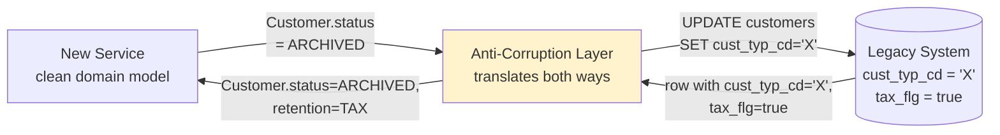
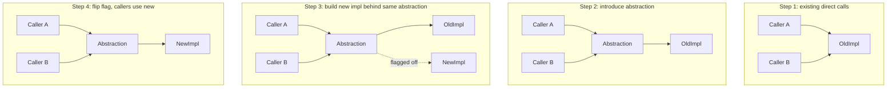
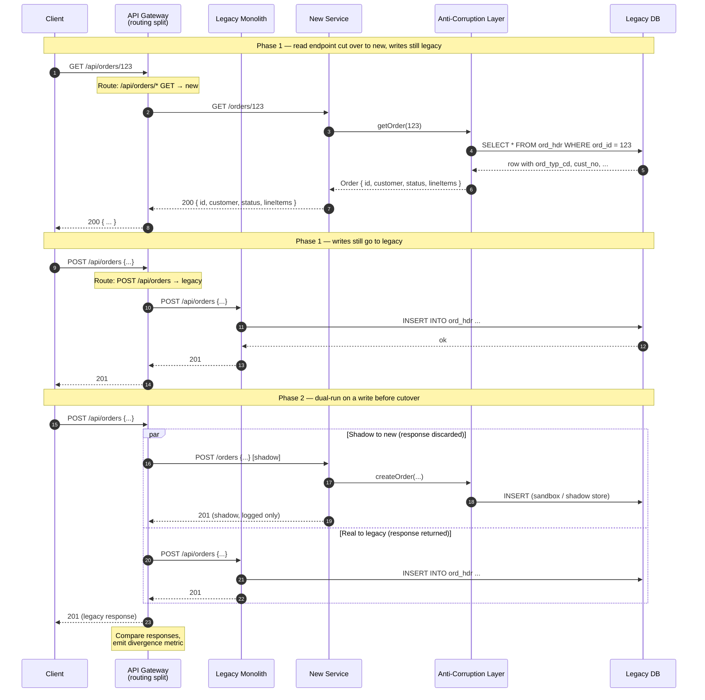

# Strangler Fig Pattern — Incremental Migration

**Date:** 2026-04-26 | **Updated:** 2026-04-26
**Tags:** `system-design` `architecture` `migration` `strangler-fig`

## Table of Contents

- [Summary](#summary)
- [Why This Matters](#why-this-matters)
- [The Metaphor — Fowler's 2004 Banyan Tree](#the-metaphor--fowlers-2004-banyan-tree)
- [Key Concepts](#key-concepts)
  - [Routing Split — The Proxy or Gateway](#routing-split--the-proxy-or-gateway)
  - [Anti-Corruption Layer (ACL)](#anti-corruption-layer-acl)
  - [Dual-Run / Shadow Read for Verification](#dual-run--shadow-read-for-verification)
  - [Branch-by-Abstraction — The Sibling Pattern](#branch-by-abstraction--the-sibling-pattern)
- [Cutover Sequence — Route, Verify, Migrate Next](#cutover-sequence--route-verify-migrate-next)
- [Mermaid — Routing Split + ACL in Flight](#mermaid--routing-split--acl-in-flight)
- [Trade-offs vs Big-Bang Rewrite](#trade-offs-vs-big-bang-rewrite)
- [Real-World Migration Timelines](#real-world-migration-timelines)
- [Real-World Uses](#real-world-uses)
- [When Strangler Is Wrong](#when-strangler-is-wrong)
- [Anti-Patterns](#anti-patterns)
- [Design-Review Phrases That Actually Work](#design-review-phrases-that-actually-work)
- [Related](#related)
- [References](#references)

## Summary

The **Strangler Fig Pattern** replaces a legacy system gradually, one capability at a time, by placing a routing layer (proxy, gateway, or ingress) in front of it that forwards traffic to either the legacy or the new system depending on the endpoint, route, or feature flag. The new system grows around the old one — like the banyan strangler fig that Martin Fowler observed in 2004 — until the legacy is fully replaced and can be decommissioned. The pattern's three load-bearing pieces are the **routing split** (so you can move one slice at a time), an **anti-corruption layer (ACL)** (so legacy domain concepts don't bleed into the new system), and a **dual-run / shadow read** verification step (so you ship cutovers with evidence, not hope). Realistic timelines for serious legacy migrations are 12-36 months; the pattern is wrong when the legacy is too coupled to extract any vertical slice, when business rules are unknowable, or when the system is small enough that a clean-room rewrite is genuinely cheaper.

## Why This Matters

In a design review someone will say "we'll just rewrite it" or "we'll cut over in one weekend." Both sentences are how multi-quarter migrations get killed. The strangler fig is the boring, evidence-based alternative: it lets you ship a migration as a sequence of small, reversible changes, each of which adds value and each of which can be rolled back independently. The point of this doc is not to learn that "incremental is better" — you already know — but to give you the precise vocabulary to:

- Reject "big-bang rewrite" proposals when there is no compelling reason to take that risk.
- Argue for an ACL when stakeholders push to "just match the legacy schema for now."
- Insist on dual-run / shadow verification before any cutover, not after the first incident.
- Distinguish strangler fig (parallel system, traffic routing) from branch-by-abstraction (in-place refactor behind an abstraction seam).
- Flag a stalled migration — the half-finished cutover that has been "90% done" for two years.

If you can do that in a migration kickoff you're operating a tier above teams who declare a rewrite and then crater nine months later.

## The Metaphor — Fowler's 2004 Banyan Tree

Martin Fowler coined "Strangler Fig Application" after watching strangler figs in Australian rainforests. The fig seed germinates in the canopy of a host tree, drops aerial roots down the trunk, and over decades grows a self-supporting lattice. By the time the host tree dies and rots, the fig's own structure is load-bearing. There is no moment where the forest loses a tree.

Translated to software:

- **Host tree** = the legacy system. Generating revenue, full of business rules nobody fully documented, brittle, but working.
- **Fig seedling** = the first new capability. Tiny. One endpoint, one bounded context, one feature flag.
- **Aerial roots** = the routing layer. As the new system grows, more roots come down — more endpoints route to the new system.
- **Strangulation** = each route migrated is a route the legacy no longer serves. Eventually the legacy is dead weight.
- **Decommission** = the host tree finally rots. The fig stands on its own.

The metaphor matters because it implies three things teams forget:

1. **It takes years, not weeks.** A real strangler fig migration is measured in quarters and quarters and quarters.
2. **The fig adds structure before removing the host.** You do not delete legacy code until the new system is genuinely load-bearing.
3. **At every moment, the forest is still a forest.** The system serves users continuously through the entire migration. There is no maintenance window the size of a rewrite.

## Key Concepts

### Routing Split — The Proxy or Gateway

The single most important mechanical piece. You insert something in front of the legacy system that can decide, per request, whether to send the request to legacy or to new. This decision can be made on:

| Routing dimension | Example | Use when |
|-------------------|---------|----------|
| **URL path** | `/api/v2/orders/*` → new, everything else → legacy | New endpoints are clearly partitioned by surface area |
| **HTTP method** | `GET /orders/:id` → new (read-only), writes → legacy | You want to migrate reads first while writes are still risky |
| **Feature flag** | `if user in cohort: new else: legacy` | You want canary / cohort rollout |
| **Tenant or user ID** | `if tenant_id < 1000: new else: legacy` | Multi-tenant SaaS migrating per tenant |
| **Header / experiment ID** | `X-Migration-Cohort: new` | Internal testing or partner-led migration |
| **Geography / region** | EU traffic → new, US → legacy | Regulatory carve-out drives the migration order |

The routing component is usually one of:

- **API gateway** (Kong, Apigee, AWS API Gateway, Envoy, Traefik) — if you already have one, this is the cheapest place to put the split.
- **Reverse proxy** (Nginx, HAProxy) — when the legacy is HTTP and the team is comfortable with config-based routing.
- **Application-level facade** — a thin service that owns the routing decisions. Use when routing logic gets complex (per-tenant, per-feature flag, dual-run logic).
- **Service mesh** (Istio, Linkerd) — for service-to-service migrations rather than ingress migrations.

The routing layer must be observable. You need per-route metrics for "how many requests went to legacy vs new, what was the latency delta, what was the error rate delta, what was the response-divergence rate." Without those, you cannot tell whether a slice is ready to fully cut over.

### Anti-Corruption Layer (ACL)

Coined by Eric Evans in _Domain-Driven Design_. The ACL is a translation boundary between the legacy domain model and the new domain model. Its job is to **prevent legacy concepts, names, and assumptions from leaking into the new system**.

Why this matters: legacy systems accumulate decades of domain debt. A field called `cust_typ_cd` with values `'A'`, `'B'`, `'X'`, where `'X'` actually means "deleted but kept for tax reasons since 2009." Replicating that into the new system is how you get a new system that's just legacy with newer syntax.

The ACL is a translation module — usually a service or a library that:

1. Reads from legacy (database, API, message queue) using legacy vocabulary.
2. Translates into the new bounded context's clean model (`Customer.status = ARCHIVED`, with the tax-retention reason captured in a separate `RetentionReason` value object).
3. On the way back, translates new-model commands into legacy operations.

Properties of a good ACL:

- **It owns the legacy vocabulary entirely.** No code outside the ACL should know what `cust_typ_cd = 'X'` means.
- **It is the single point of bidirectional translation.** Reads, writes, events — all go through it.
- **It is testable in isolation.** Its inputs are legacy-shaped data, its outputs are new-domain objects. Pure translation logic. High coverage is cheap.
- **It is throwaway by design.** When the legacy dies, the ACL dies with it. Do not over-engineer it. Do not give it features. It is glue.

Teams that skip the ACL ship a new system that inherits all the legacy's accidental complexity. Three years later, "the new system" is just a reskinned legacy with the same field names and the same tribal knowledge.

### Dual-Run / Shadow Read for Verification

Before you flip a route from legacy to new, you should have evidence that the new system produces the same answer as the legacy for real production traffic. The mechanism is **dual-run**, also called **shadow read** or **shadow traffic**.

The pattern:

1. Production request arrives.
2. Routing layer sends the request to **both** legacy (for the real response) and new (in shadow mode).
3. The new system executes the request as if it were real, but its response is **not returned to the client**.
4. The two responses are compared, and the diff is logged or emitted as a metric.
5. The legacy response is the one returned to the user.

Variations:

- **Shadow read** — read-only operations are dual-run. Easy because there are no side effects.
- **Shadow write to a parallel store** — writes go to legacy (real) and to new (parallel database). You compare resulting state. Higher risk; needs idempotency or a sandbox store.
- **Replay-based dual-run** — capture production traffic, replay later in a sandbox against the new system. No live impact, but you miss timing-sensitive bugs.

The output of dual-run is a **divergence rate**. "Out of the last 24 hours of production traffic, the new `/api/orders/:id` endpoint produced byte-identical responses for 99.94% of requests; 0.06% diverged. Of the diverging cases, 80% were timestamp formatting, 15% were a real bug in tax calculation, 5% were a legacy quirk we decided to fix."

That number — divergence rate — is the gating metric for cutover. You do not flip the route until the divergence rate is acceptable and the residual divergences are explained.

GitHub built and open-sourced [Scientist](https://github.com/github/scientist) for exactly this pattern in 2014; it remains the canonical reference implementation.

### Branch-by-Abstraction — The Sibling Pattern

Strangler fig works at the **system boundary** — you can route traffic between separate processes. **Branch-by-abstraction** (Paul Hammant, 2007) works at the **codebase boundary** — for refactors that have to happen inside a single application without splitting it.

The mechanic:

1. Identify the chunk of code to replace.
2. Introduce an abstraction (interface, port, function pointer) in front of it. Existing code now goes through the abstraction.
3. Build a new implementation behind the same abstraction.
4. Switch consumers from old implementation to new — one at a time, behind a feature flag if needed.
5. Once all consumers use the new implementation, delete the old one and (optionally) the abstraction.

When to choose which:

| Situation | Use |
|-----------|-----|
| Replacing a service or system, traffic is HTTP/gRPC | **Strangler fig** |
| Replacing a library, internal module, or in-process subsystem | **Branch-by-abstraction** |
| Replacing a database under a single application | Branch-by-abstraction (with a repository abstraction) often beats strangler fig |
| Replacing a whole application + database + integrations | Strangler fig at the network edge, branch-by-abstraction inside the new system as it grows |

They compose. Inside a strangler-fig migration, branch-by-abstraction is how you safely refactor the new service as it grows.

### Routing-Layer Capabilities Checklist

Before relying on a routing layer for a multi-quarter migration, confirm it can do all of the following. Anything missing is technical debt that will surface mid-migration when it is most expensive to fix.

- **Per-route traffic split** by percentage, not just on/off. You will need 1% / 5% / 25% / 50% / 100% ramps.
- **Header- or cookie-based sticky routing.** Once a user lands on the new path mid-session, they should stay there until the session ends — otherwise you re-create read-your-writes anomalies across legacy and new.
- **Synchronous shadow / mirror traffic.** Sending the same request to two backends, returning one, comparing both. Envoy's `request_mirror_policies`, AWS API Gateway via Lambda, Nginx with `ngx_http_mirror_module`, and Istio's `mirrorPercentage` all support this.
- **Per-route timeouts and circuit breakers.** A struggling new service must not take down the legacy path it shadows.
- **Structured access logs with both upstream identities.** "This request was answered by `legacy`, shadowed against `new`, divergence=true."
- **Header propagation for trace IDs.** You will need distributed traces that span gateway → legacy → new during dual-run.
- **Fast config reload.** Cutover is a config flip; a 30-minute reload is a 30-minute window in which you cannot roll back cleanly.

## Cutover Sequence — Route, Verify, Migrate Next

The repeating loop of a strangler fig migration looks like this for each slice:

1. **Pick the slice.** Smallest meaningful capability — usually a bounded context with low coupling. Often: read-only endpoints first, then writes; leaf capabilities first, then orchestration; new features at the edges first, then core.
2. **Build the new implementation.** With its own data store if appropriate, behind the ACL.
3. **Wire up dual-run.** Routing layer sends shadow traffic to the new path. Compare responses. Iterate until divergence rate is acceptable.
4. **Cohort cutover.** Route 1% of real traffic to the new path. Watch error rates, latency, business metrics. Roll back instantly via flag if needed.
5. **Ramp.** 1% → 10% → 50% → 100%. At each step, hold long enough to see real traffic patterns (peak hours, batch jobs, end-of-month).
6. **Decommission the legacy slice.** Delete the old code path. Remove the dual-run wiring. Update runbooks. Celebrate.
7. **Pick the next slice.** Repeat.

Things that go wrong if you skip steps:

- Skip step 3 (dual-run): cutover surprises in production. The bug you ship is the one the legacy was masking.
- Skip step 4 (cohort): blast radius is everyone. One bug = page everyone.
- Skip step 6 (decommission): the legacy never dies. Two years later you have two systems forever and double the on-call.

### Slice Selection — Picking The First One

The first slice is a strategic choice, not a "lowest-risk technical thing" choice. A useful rubric:

| Criterion | Why it matters |
|-----------|----------------|
| **Bounded and cohesive** | If extracting it requires touching ten unrelated tables, it is not a slice |
| **Read-heavy before write-heavy** | Reads are easier to dual-run safely; pick a read-only slice first if possible |
| **Low business risk** | If this slice fails in production, blast radius is small (e.g., a reporting endpoint, not the checkout flow) |
| **High learning value** | Teaches you the migration mechanics — ACL, routing, dual-run — before you bet anything important on them |
| **Visible win** | Demonstrates progress to stakeholders so the migration keeps its political budget |
| **Owned by one team** | Cross-team coordination kills first slices; pick something one team can ship end to end |

The textbook bad first slice: "let's migrate the checkout because it's the most important." Important things deserve to be migrated _later_, when the team has built confidence with the migration mechanics on lower-risk slices.

## Mermaid — Routing Split + ACL in Flight

## Trade-offs vs Big-Bang Rewrite

| Dimension | Strangler Fig | Big-Bang Rewrite |
|-----------|---------------|------------------|
| **Time to first value** | Weeks (first slice in production) | Quarters or years (nothing in prod until cutover) |
| **Risk profile** | Many small, reversible cutovers | One huge irreversible cutover |
| **Rollback cost** | Flip a flag | Restore from backup, replay events, hope |
| **Business continuity** | Continuous; new features can ship during migration | Frozen; no new features in legacy or new during the rewrite |
| **Team morale** | Wins every quarter | "Are we ever shipping?" after month 9 |
| **Discovery of unknown business rules** | Found incrementally; one slice at a time | Found all at once during cutover, when it's too late |
| **Total engineering cost** | Higher in absolute hours (you build adapters, ACLs, dual-run rigs) | Lower _if it succeeds_; near-infinite if it fails |
| **Probability of failure** | Low — each slice is independently small | High — most large rewrites die or get cancelled |
| **Dual-system tax** | Real and ongoing — two systems for the duration | Zero (you only ever have one running at a time) |
| **Best for** | Live, revenue-generating systems with users you cannot pause | Prototypes, internal tools with one weekend of downtime budget, or systems where the legacy is genuinely beyond extraction |

The empirical observation: a high fraction of large rewrites are cancelled, descoped, or quietly abandoned. Studies of IT project outcomes (Standish "CHAOS" reports, McKinsey/Oxford 2012) consistently show large software projects overrun budget and time by very large margins, and a meaningful share are outright failures. The strangler fig is not faster on a stopwatch; it is a strategy with a much higher probability of finishing.

### The Data Layer — The Hardest Half

The trade-off table above hides the part most teams underestimate: **migrating data is much harder than migrating code**. Routing HTTP traffic between two services is mechanical. Migrating the system of record under those services is where projects die.

Three common data-migration shapes inside a strangler-fig migration:

1. **Shared database, shared schema.** Both legacy and new read/write the same tables through the ACL. Lowest migration overhead; highest coupling. Acceptable as a stepping stone, dangerous as a destination — you are not actually migrating, just adding a second front end.
2. **Shared database, owned tables.** Each service owns a disjoint set of tables; cross-service joins go through APIs. This is often the realistic mid-state in a monolith decomposition. Requires discipline to enforce ownership.
3. **Separate databases, dual-write or CDC.** New service has its own store. Writes are dual-written (synchronously or via outbox/CDC) for the validation window; eventually one store becomes authoritative and the other is decommissioned. Highest correctness risk, highest payoff.

The dual-write pattern is itself an anti-pattern when implemented naively (synchronous writes to two stores with no transactional guarantee). Use the **transactional outbox** + **change-data-capture** pattern instead: write to one store inside a transaction, plus an outbox row, then a CDC pipeline (Debezium, Kafka Connect) propagates to the other. See [Replication Patterns](../scalability/replication-patterns.md) for the full mechanic.

## Real-World Migration Timelines

Honest numbers from public case studies and industry experience:

| Migration | Reported timeline | Notes |
|-----------|-------------------|-------|
| Mainframe COBOL → modern stack at a bank or insurer | 5-10 years | Often slice-by-slice; some legacy mainframes still alive after the "migration" finishes |
| Monolith → microservices at a typical mid-sized SaaS | 18-36 months | Usually 3-6 bounded contexts extracted; the last 20% of monolith is often deferred indefinitely |
| Stripe-style payments platform internal rewrite | 12-24 months for a critical subsystem | Heavy investment in dual-run and replay tooling |
| Amazon's monolith decomposition (early 2000s) | Several years | Famously triggered the "two-pizza team" + service-orientation reorg |
| Shopify's modular monolith refactor | Multi-year, ongoing | Branch-by-abstraction at scale rather than full strangler fig |
| eBay's V3/V4 platform replatform | ~5 years | Classic strangler fig at the front end |

Rough rule of thumb: a **serious legacy migration is 12-36 months** from "we are starting" to "the legacy is decommissioned." If your plan says six weeks, your plan is wrong, or your scope is small enough that strangler fig is overkill.

A second rule of thumb: the **first slice takes the longest** because you are building the routing infrastructure, the ACL skeleton, the dual-run rig, the deployment pipeline, and the observability for the new path. Slices two through N are dramatically cheaper. If the first slice is taking less time than slices two and three combined, you have probably skipped some infrastructure that you'll regret later.

## Real-World Uses

- **Legacy mainframe migration.** Banks, insurers, airlines moving off COBOL/CICS/IMS to JVM or .NET services. The mainframe stays as the system of record for years; new services intercept reads and progressively own writes via ACL → MQ-based event capture → eventual database cutover.
- **Monolith-to-microservices.** The textbook case from Sam Newman's _Monolith to Microservices_. Identify a bounded context, extract it behind an API, route traffic to the new service via the existing ingress, decommission the corresponding code in the monolith. Repeat.
- **Database engine swap.** Postgres → Cockroach, MySQL → Aurora, SQL Server → Postgres. Often combined with branch-by-abstraction (a repository interface) inside the application, plus dual-write to both stores during the validation window. See [Database Migrations Operations](../../database/operations/replication.md) for the data-side mechanics.
- **Frontend re-platform.** Old monolithic Rails or .NET MVC frontend → Next.js / React. The new frontend is mounted at `/v2/*` and gradually absorbs routes; sometimes the old and new run side-by-side in a "frame" or via reverse proxy until the last legacy page is replaced.
- **Cloud migration.** On-prem datacenter → AWS/GCP. Strangler fig at the DNS or load-balancer layer. Per-service or per-region cutover.
- **API versioning.** `/v1/*` → `/v2/*` is strangler fig in miniature. Same pattern, smaller scope.
- **Multi-tenant SaaS shard split.** "Tenants A-M migrate to new infrastructure first; tenants N-Z stay on old until ready." Per-tenant routing key.

The pattern transcends the metaphor — anywhere there is a routing layer in front of a system you want to change, strangler fig applies.

## When Strangler Is Wrong

Strangler fig is the default for live systems, but it is not universal. Cases where you should _not_ use it:

- **The legacy is not extractable.** A monolith with a single shared mutable database, where every "module" reads and writes every table, has no seams. You cannot move one capability without moving everything. In this case, branch-by-abstraction inside the monolith is the right starting move; strangler fig at the network edge comes only after you have created internal seams.
- **The legacy is small enough that a clean rewrite is genuinely cheaper.** A 5,000-line CRUD app with two endpoints and one database table does not need a routing layer, an ACL, or a dual-run rig. Just rewrite it. The strangler-fig overhead exceeds the size of the thing being migrated.
- **The business logic is unknowable from outside.** If the legacy is the spec, and the spec lives only in the legacy code (no docs, no tests, original developers gone), you cannot build a new system to match it without reverse-engineering. In this case, strangler fig still works, but the dual-run / shadow phase is doing the actual work — and may take longer than building the new system itself. Plan for it.
- **The legacy is being decommissioned for regulatory reasons within a hard deadline.** If you have to be off the legacy by a fixed date (vendor end-of-life, compliance), and the strangler-fig timeline cannot fit, you may be forced into a more aggressive cutover even though it is riskier.
- **The cost of running both systems exceeds the cost of one short outage.** Some internal tools can take a weekend of downtime; the dual-system tax is not worth paying.
- **The new system is genuinely a different product.** If you are building "Order Management v2" but it has different features, different domain model, different users, you are building a new product, not migrating. Don't pretend it is a strangler fig — that framing constrains design unnecessarily.

The honest review question: _what specifically about this system makes strangler fig the right choice?_ If the only answer is "it's the safe default," double-check that you have the budget for 12-36 months of two systems running side by side.

## Anti-Patterns

Common ways strangler-fig migrations fail. Watch for these in design reviews and in your own running migrations.

- **No verification before cutover.** Team flips routing from legacy to new based on "it works on staging." Production traffic exposes a behavior the new system doesn't replicate, and you find out via customer escalation. The fix: dual-run with divergence metrics is non-negotiable for any non-trivial cutover. If you cannot dual-run (for example, side-effect-heavy writes against external systems), build a recorded-replay rig.
- **No ACL — legacy schema leaks into the new system.** New service is shipped, but it speaks legacy field names, legacy enum values, legacy nullability conventions. Five years later, "the new system" needs the same migration done again because it is itself legacy now. The fix: budget for the ACL on day one, even when stakeholders say "let's just match the legacy schema for speed."
- **Half-finished cutover lingers for years.** Slice 1 cut over, slice 2 cut over, then political will evaporates. Slices 3-7 stay on legacy. Two years later you have two systems forever, doubled on-call burden, and no clear path to finishing. The fix: every migration plan must include a credible decommission date for the legacy and an executive owner who is on the hook for it. If nobody is empowered to decommission, the migration will not finish.
- **Big-bang dual-run with no scoping.** Team turns on dual-run for the entire system at once. Every write is shadowed. Storage costs balloon, latency increases, comparison logic is overwhelmed. The fix: dual-run one slice at a time, with explicit budget for the comparison layer.
- **Routing logic in the application code.** "If feature flag, call new service, else call legacy." Spread across dozens of call sites. The routing intent is buried in business logic. The fix: routing belongs in the routing layer (gateway, proxy, facade). Application code should not know whether it is the new or old system.
- **No rollback plan past the first slice.** Cutover succeeds for slices 1-3. By slice 4, the legacy is partially decommissioned and you cannot route back to it because the legacy database has drifted. The fix: maintain rollback capability for at least one slice back, and never fully decommission a slice until the next slice is also stable.
- **ACL becomes a permanent home for business logic.** It started as glue; now it has caching, validation, side effects, and its own database. The fix: keep the ACL stupid. Logic belongs in the new bounded context. The ACL only translates.
- **Dual-run never ends.** The team enjoys the safety net so much that they never actually flip the switch. Six months of "we'll cut over next sprint." The fix: set an explicit cutover SLO ("once divergence rate is below 0.01% for 7 consecutive days, we cut over") and hold to it.
- **Treating strangler fig as license to ship without observability.** The new system has no metrics, no traces, no structured logs. When divergence happens, nobody can explain why. The fix: the new path needs better observability than the legacy, not equal observability.
- **Ignoring the dual-system tax.** Two systems means two on-calls, two incident processes, two deployment pipelines, two sets of secrets. The fix: budget for it explicitly. Migration cost is not just engineering hours building the new thing; it is also the operational cost of running both.

## Design-Review Phrases That Actually Work

What to say instead of "let's just rewrite it":

- "We'll route `GET /orders/*` to the new service first, behind a 1% canary, with shadow reads on the rest. Writes stay on legacy until the read path is stable."
- "The ACL owns translation between `cust_typ_cd` and our `Customer.status` enum. Nothing else in the new service knows that field exists."
- "We need a divergence rate below 0.05% for 7 days before cutting over this slice. Until then, dual-run remains on."
- "This is branch-by-abstraction, not strangler fig — the change is in-process. We're introducing a `PaymentGateway` interface, building a new implementation behind it, and switching consumers via flag."
- "The plan has a decommission date for legacy slice X by Q3. If we don't hit it, we either ship the cutover or formally cancel — we don't let it sit half-done."
- "First slice will take longer than slices 2-5 combined because we're building the routing rig, the ACL skeleton, and the dual-run comparator. That investment amortizes."
- "The legacy doesn't have a clean seam here. Before we extract anything, we need to introduce internal seams via branch-by-abstraction — three months of refactoring inside the monolith first."
- "I want to see the rollback plan for this cutover, not just the forward plan. What flag do we flip if error rate spikes?"

## Related

- [Monolith to Microservices](./monolith-to-microservices.md) — the most common context where strangler fig is applied; covers extraction order, bounded-context identification, and the data-coupling problem.
- [Service Discovery](./service-discovery.md) — the routing-layer mechanic that makes per-endpoint cutover possible without redeploying clients.
- [API Gateway and BFF](../building-blocks/api-gateway-and-bff.md) — gateways are the typical home of the routing split.
- [Replication Patterns](../scalability/replication-patterns.md) — when the migration includes a database swap, dual-write and CDC patterns live here.
- [CAP, PACELC, and Consistency Models](../foundations/cap-and-consistency-models.md) — dual-run across two stores raises consistency questions the migration plan must answer.
- [Database Migrations](../../database/operations/replication.md) — the data-layer side of any system migration, including dual-write strategies and backfill.

## References

- Martin Fowler, ["StranglerFigApplication"](https://martinfowler.com/bliki/StranglerFigApplication.html) (2004; renamed from "StranglerApplication" in 2019) — the original metaphor and pattern.
- Sam Newman, _Monolith to Microservices_ (O'Reilly, 2019) — chapter 3 ("Splitting the Monolith") is the practical playbook for strangler fig in a monolith decomposition; chapter 4 covers the database side.
- Eric Evans, _Domain-Driven Design_ (Addison-Wesley, 2003) — chapter 14 introduces the Anti-Corruption Layer pattern.
- Paul Hammant, ["Branch by Abstraction"](https://www.branchbyabstraction.com/) (2007) and Jez Humble's _Continuous Delivery_ chapter on it — the in-codebase sibling pattern.
- Martin Fowler, ["BranchByAbstraction"](https://martinfowler.com/bliki/BranchByAbstraction.html) — Fowler's summary and comparison to feature toggles.
- ThoughtWorks Technology Radar entries on [Strangler Fig Application](https://www.thoughtworks.com/radar/techniques/strangler-fig-application) and [Branch by Abstraction](https://www.thoughtworks.com/radar/techniques/branch-by-abstraction) — long-running industry endorsements of both patterns.
- GitHub, ["Scientist"](https://github.com/github/scientist) (2014) — open-source library for shadow-read / dual-run comparison; the canonical reference implementation.
- Microsoft Azure Architecture Center, ["Strangler Fig pattern"](https://learn.microsoft.com/en-us/azure/architecture/patterns/strangler-fig) — cloud-vendor write-up with concrete routing-layer guidance.
- AWS Prescriptive Guidance, ["Strangler fig pattern"](https://docs.aws.amazon.com/prescriptive-guidance/latest/cloud-design-patterns/strangler-fig.html) — AWS-flavored implementation including API Gateway + Lambda routing splits.
- Bloch, Brunsting, Bonér, et al., ["Reactive Systems and Strangler Patterns"](https://www.reactivemanifesto.org/) — context on resilience patterns that compose with strangler fig at scale.
