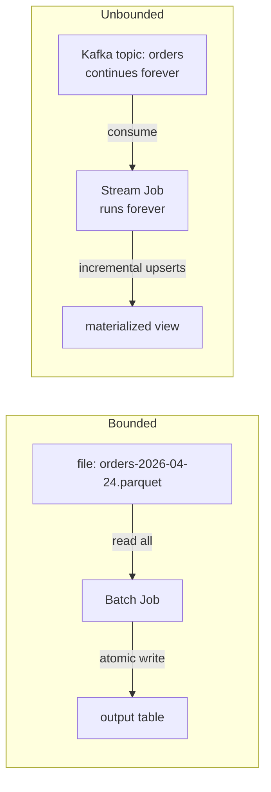
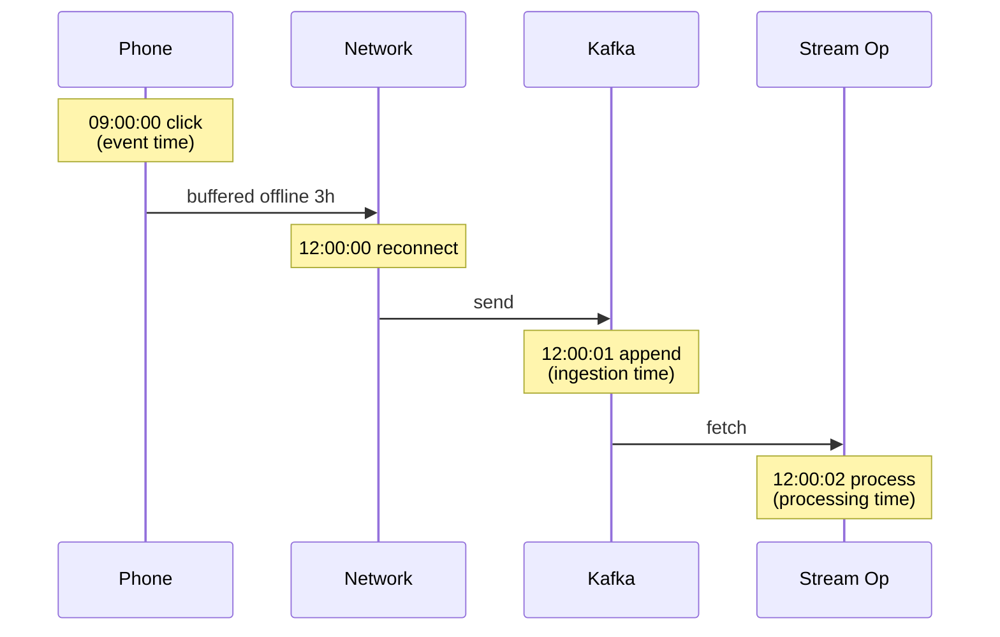
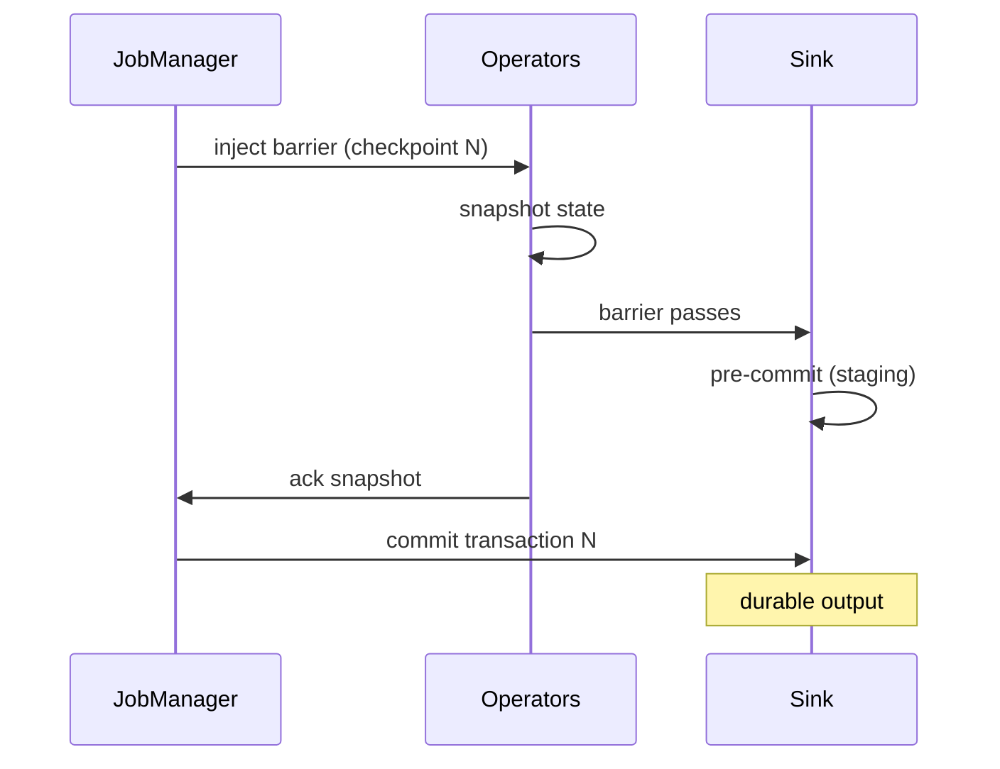

# Batch vs Stream Processing

**Date:** 2026-04-25 | **Updated:** 2026-04-25
**Tags:** `system-design` `data-engineering` `batch` `streaming`

## Table of Contents

- [Summary](#summary)
- [Overview](#overview)
- [Key Concepts](#key-concepts)
  - [Bounded vs Unbounded Data](#bounded-vs-unbounded-data)
  - [Event Time vs Processing Time](#event-time-vs-processing-time)
  - [Watermarks for Out-of-Order Events](#watermarks-for-out-of-order-events)
  - [Windows — Tumbling, Sliding, Session](#windows--tumbling-sliding-session)
  - [Exactly-Once in Batch](#exactly-once-in-batch)
  - [Exactly-Once in Streams](#exactly-once-in-streams)
- [Trade-offs](#trade-offs)
  - [Latency vs Completeness](#latency-vs-completeness)
  - [Cost Shape](#cost-shape)
  - [Operational Complexity](#operational-complexity)
  - [Debuggability and Reproducibility](#debuggability-and-reproducibility)
- [Code Examples](#code-examples)
  - [Spark Batch — Word Count](#spark-batch--word-count)
  - [Flink Stream — Word Count](#flink-stream--word-count)
- [Real-World Uses](#real-world-uses)
  - [Where Batch Wins](#where-batch-wins)
  - [Where Streams Win](#where-streams-win)
  - [The Hybrid That Actually Ships](#the-hybrid-that-actually-ships)
- [Modern Unification — Flink, Beam, Spark](#modern-unification--flink-beam-spark)
- [Anti-Patterns](#anti-patterns)
- [Related](#related)
- [References](#references)

## Summary

Batch and stream processing are not competing paradigms — they are two ends of a spectrum defined by whether the input is bounded (a fixed dataset known up front) or unbounded (an infinite, ongoing sequence). Batch jobs run to completion on a snapshot, optimize for throughput, and tolerate hours of latency in exchange for simple correctness guarantees: read everything, compute, write atomically, done. Stream jobs run forever, must reason about three different clocks (event, ingestion, processing), and approximate completeness via watermarks because "all the data" is a moving target. The historical answer was Lambda architecture (run both, reconcile), then Kappa (stream-only, replay the log), and the current answer is unified engines like Flink and Beam that treat batch as the bounded case of streaming. This doc covers the conceptual divide, where each model genuinely wins, and why most real systems run both.

## Overview

The choice between batch and stream is a choice about what you are willing to trade off. Batch trades freshness for simplicity and exact correctness. Streams trade simplicity for freshness and the ability to react to events in flight.

| Dimension | Batch | Stream |
|-----------|-------|--------|
| Input shape | Bounded (file, table, partition) | Unbounded (topic, log, queue) |
| Trigger | Scheduled (cron, DAG, sensor) | Continuous |
| Latency | Minutes to hours | Milliseconds to seconds |
| Completeness | Known when job starts | Approximated via watermarks |
| Reprocessing | Re-run on same input | Replay from offset/savepoint |
| Failure model | Restart whole job, idempotent on output | Restart from checkpoint, transactional sink |
| Cost shape | Periodic spikes | Steady-state utilization |
| Mental model | "Compute over a finite set" | "Compute over a moving window of an infinite set" |
| Canonical engines | MapReduce, Spark, Hive, Trino, dbt | Kafka Streams, Flink, Storm, Pulsar Functions |

The historical evolution went through three architectures:

- **Lambda (2011, Marz)** — run a batch layer for accuracy and a parallel stream layer for freshness. Merge results in a serving layer. Two codebases, two sources of truth, constant drift.
- **Kappa (2014, Kreps)** — keep only the streaming layer. Reprocess history by replaying the log from offset 0 with new code. One codebase. Requires the log to be the system of record.
- **Unified (2016+)** — Apache Beam, Flink's unified runtime, Spark Structured Streaming. Batch is "the bounded case of streaming." One API, two execution modes.

> See [lambda-vs-kappa-architecture.md](./lambda-vs-kappa-architecture.md) for the full architectural comparison and [modern-streaming-engines.md](./modern-streaming-engines.md) for an engine-by-engine comparison.

## Key Concepts

### Bounded vs Unbounded Data

The single most useful distinction, popularized by Akidau in "Streaming 101":

- **Bounded data** — a finite collection. You know the size when the job starts. Example: all orders from yesterday, sitting in `s3://orders/dt=2026-04-24/`. The job reads everything, computes, writes, exits.
- **Unbounded data** — an infinite, ongoing sequence. You never have all of it. Example: the live `orders` Kafka topic. Any "result" you compute is a snapshot of a moving target.

The trap is treating unbounded data as bounded by chopping it into hourly batches. That works until late-arriving events show up after the hourly job has already run, and now your "complete" hourly aggregate is silently wrong.



### Event Time vs Processing Time

Three clocks that batch jobs can usually ignore but streaming jobs cannot:

| Clock | Definition | Owned by | Reproducible? |
|-------|-----------|----------|---------------|
| **Event time** | When the event happened in the real world | Producer device/app | Yes — embedded in record |
| **Ingestion time** | When the broker received it | Broker | Mostly |
| **Processing time** | When the operator handled it | Worker node | No — depends on load |

In batch, event time is implicit in the partition (the file is _named_ `dt=2026-04-24` because every record inside has event-time date 2026-04-24, give or take cleanup of late files). In streaming, event time is whatever the producer stamped on the record, and the gap between event time and processing time can be seconds, minutes, or — when a phone has been offline — hours.



The cost of confusing them is silent: dashboards say slightly wrong numbers, and nobody notices until an auditor or a finance team asks why the daily totals never match the source of truth.

### Watermarks for Out-of-Order Events

A **watermark** is the streaming system's assertion: _"I believe I have seen all events with event time ≤ T."_ It is a moving lower bound on event-time progress. When the watermark passes the end of a window, the window can fire and emit its result.

Watermarks are heuristics, not facts. They are computed from observed timestamps:

- **Bounded out-of-orderness** — assume events arrive at most _N_ seconds late. Watermark = `max_event_time_seen - N`.
- **Per-partition** — track each input partition; the global watermark is the minimum across partitions (so one stalled source holds back the whole job — usually what you want).
- **Punctuated** — derived from special marker records.

What about events that arrive _after_ the watermark has passed their window? Three options:

1. **Drop** — cheapest, silently lossy.
2. **Side output** — route late events to a separate stream you can audit or backfill.
3. **Allowed lateness** — keep window state alive past the watermark for a defined budget; re-emit updated aggregates as retractions.

Batch jobs sidestep this entirely by waiting until the data is "settled" (e.g., daily job runs at 02:00 the next day) — but the cost is hours of latency.

> Deeper coverage in [../communication/stream-processing.md](../communication/stream-processing.md).

### Windows — Tumbling, Sliding, Session

A window slices unbounded data into bounded chunks so aggregations can emit a result. Windows are always per-key (after a `keyBy` / `groupBy`).

```text
Tumbling (size 5s, contiguous, non-overlapping)
[0────5)[5────10)[10────15)[15────20)
 ●●●     ●●●●     ●         ●●

Sliding / Hopping (size 10s, slide 5s, overlap)
[0─────────10)
     [5─────────15)
          [10─────────20)

Session (variable, defined by inactivity gap of 3 min)
User A:  ●●●─────|gap 5m|─────●●  → 2 sessions
User B:  ●─●─●─●─●                → 1 session
```

- **Tumbling** — hourly counts, daily reports, anything where every event belongs to exactly one bucket.
- **Sliding / Hopping** — rolling averages, "top-K in the last 5 min refreshed every 30 sec." Overlap means more state in flight.
- **Session** — clickstream sessionization, IoT device runs. Most state-hungry: until the gap is observed, the window can't close.

In batch this is a `GROUP BY date_trunc('hour', event_time)`. Trivial. In streams it is the heart of the system, with state-store sizing, watermark tuning, and lateness budgets to manage.

### Exactly-Once in Batch

Batch's exactly-once story is mostly about output atomicity:

1. **Checkpointing** — Spark/MapReduce track which tasks succeeded. On failure, only the failed tasks rerun; their partial output is discarded.
2. **Atomic output** — write to a staging path, then atomic rename / `INSERT OVERWRITE` / `swap partition`. Readers either see the old version or the new, never a half-written mixture.
3. **Deterministic computation** — given the same input, the same code produces the same output. So a re-run after partial failure is safe.

The classic recipe:

```text
1. Read input partition (immutable snapshot).
2. Compute into staging output path.
3. On full job success: atomic rename staging → final.
4. On failure: discard staging, retry the whole job.
```

Hadoop's `FileOutputCommitter`, Iceberg/Delta/Hudi atomic commits, and BigQuery's `WRITE_TRUNCATE` job option all implement this pattern. Exactly-once falls out almost for free because the input is finite and the output write is one atomic transaction.

### Exactly-Once in Streams

Streams cannot rely on "compute, then atomic-rename the whole output" because there is no end. Exactly-once in streams means: _the externally observable output is as if every input record was processed exactly once_, despite failures and retries. It requires:

1. **Idempotent producers** — broker-side dedup of duplicate sends (Kafka producer ID + sequence number).
2. **Transactional writes** — output, state changelog, and consumer offset commit must commit atomically.
3. **Read-committed consumers** — downstream consumers skip uncommitted (in-flight) records.

Two implementations dominate:

**Kafka Streams + Kafka EOS** (`processing.guarantee=exactly_once_v2`) — each task commits output records, changelog updates, and consumed offsets in a single Kafka transaction. End-to-end exactly-once **within Kafka**. Side effects to external systems still need their own idempotency.

**Flink + Two-Phase Commit Sinks** — checkpoint barriers flow through the dataflow graph; each operator snapshots state when the barrier passes; sinks **pre-commit** to a staging area, then **commit** when the JobManager confirms all operators acked. Works for any sink that supports a 2PC protocol (Kafka, JDBC with XA, Iceberg, file sinks with rename-on-commit).



The conceptual move: batch achieves exactly-once via _one big atomic write at the end_; streams achieve it via _many small atomic transactions, one per checkpoint_.

> See [../communication/stream-processing.md](../communication/stream-processing.md) for the deeper EOS treatment.

## Trade-offs

### Latency vs Completeness

The fundamental tension. You cannot have both maximum freshness and maximum completeness simultaneously, because completeness requires waiting for late data.

```text
                 latency
                    ▲
   batch (daily) ───┤■■■■■■■■■■■■■■■■  hours, very complete
                    │
   batch (hourly) ──┤■■■■■■            ~1 hour, mostly complete
                    │
   streaming        ┤■                 sub-second, approximate
   (low watermark)  │
                    └──────────────────► completeness
```

Akidau's framing: _completeness_ is a function of how long you wait. Batch waits a long time and is therefore very complete. Streams emit early estimates and refine via late-data handling. Pick the right point on the curve _per use case_ — it is fine to run both for the same data with different SLAs.

### Cost Shape

| Mode | Resource pattern | Implication |
|------|------------------|-------------|
| Batch | Periodic spikes (job runs, cluster scales up, cluster scales down) | Cheap on spot/preemptible instances; idle most of the day; cheap storage matters more than compute |
| Streaming | Continuous baseline (24/7 cluster) | Reserved/committed instances make sense; tuning state-store size and checkpoint interval is core to cost; hot keys = wasted parallelism |

A common surprise: a streaming pipeline that does the same work as a daily batch job typically costs 5–10× more in compute, because the cluster runs 24×7 instead of 1 hour per day. The justification is the latency, not the throughput.

### Operational Complexity

Batch is operationally simpler in nearly every way:

- One job runs for an hour and exits. Failure → rerun. No long-lived state.
- The DAG is the deployment unit. Airflow / Dagster / dbt run, monitor, retry.
- Schema changes are easy: deploy new code, next run uses it.

Streams introduce categories of problems batch never has:

- Long-lived state in RocksDB / state backend that must be checkpointed and restored on every restart.
- Schema evolution mid-flight — the running job has buffered records under the old schema while the new code is being deployed.
- Savepoints required before every code change, or risk losing state on upgrade.
- Watermark tuning, allowed-lateness budget, hot-key detection, backpressure monitoring.
- 24/7 on-call. The job is "down" the moment it stops, not just slow.

### Debuggability and Reproducibility

Batch wins decisively. A failed batch job is reproducible: the input is a fixed snapshot, the code is a fixed version, you run it locally with the same input and step through. Determinism makes "why did the daily total drop?" tractable.

Stream debugging is harder because:

- The "input" depends on what was in the topic at the moment the job ran, including the order of arrival across partitions.
- Watermark progress is a function of the rate at each source — replaying the same data faster or slower changes which window each event lands in (for processing-time logic) and changes when windows fire (for event-time logic if late-data settings differ).
- Bugs that depend on timing (race between two operators, slow downstream causing backpressure) reproduce only under load.

Tools that help: Flink's **savepoints** (deterministic restart point), Kafka **offset replay** (replay a specific window of input through a debugging job), and **dual-write to a batch sink** so you can run an exact-correctness batch job over the same data and compare.

## Code Examples

### Spark Batch — Word Count

```scala
// Spark batch — count words in a fixed snapshot of files.
import org.apache.spark.sql.SparkSession

object BatchWordCount {
  def main(args: Array[String]): Unit = {
    val spark = SparkSession.builder()
      .appName("batch-word-count")
      .getOrCreate()

    import spark.implicits._

    // Bounded input: read every file in the path. Job ends when done.
    val lines = spark.read
      .textFile("s3://logs/dt=2026-04-24/*.txt")

    val counts = lines
      .flatMap(line => line.toLowerCase.split("\\W+"))
      .filter(_.nonEmpty)
      .groupByKey(identity)
      .count()

    // Atomic output: write to staging, commit on full success.
    counts.write
      .mode("overwrite")
      .partitionBy("dt")
      .parquet("s3://output/word-counts/dt=2026-04-24/")

    spark.stop()
  }
}
```

Properties:

- Input is finite and known when the job starts.
- One job, one atomic commit. Failure → discard staging, rerun.
- No event-time reasoning needed; the partition path encodes the day.
- Runs once, exits.

### Flink Stream — Word Count

```java
// Flink stream — count words per 1-minute tumbling event-time window.
import org.apache.flink.api.common.eventtime.WatermarkStrategy;
import org.apache.flink.streaming.api.datastream.DataStream;
import org.apache.flink.streaming.api.environment.StreamExecutionEnvironment;
import org.apache.flink.streaming.api.windowing.assigners.TumblingEventTimeWindows;
import org.apache.flink.streaming.api.windowing.time.Time;
import org.apache.flink.connector.kafka.source.KafkaSource;
import org.apache.flink.connector.kafka.sink.KafkaSink;
import org.apache.flink.connector.base.DeliveryGuarantee;
import java.time.Duration;

public class StreamWordCount {
  public static void main(String[] args) throws Exception {
    StreamExecutionEnvironment env =
        StreamExecutionEnvironment.getExecutionEnvironment();

    // Checkpoint every 30s for exactly-once recovery.
    env.enableCheckpointing(30_000);

    // Unbounded input: Kafka topic, runs forever.
    KafkaSource<LogEvent> source = KafkaSource.<LogEvent>builder()
        .setBootstrapServers("kafka:9092")
        .setTopics("logs")
        .setValueOnlyDeserializer(new LogEventDeserializer())
        .build();

    DataStream<LogEvent> events = env.fromSource(
        source,
        // Watermark: tolerate up to 30s out-of-orderness.
        WatermarkStrategy.<LogEvent>forBoundedOutOfOrderness(Duration.ofSeconds(30))
            .withTimestampAssigner((e, ts) -> e.eventTimeMillis()),
        "kafka-source");

    DataStream<WordCount> counts = events
        .flatMap((LogEvent e, org.apache.flink.util.Collector<String> out) -> {
          for (String w : e.text().toLowerCase().split("\\W+")) {
            if (!w.isEmpty()) out.collect(w);
          }
        })
        .returns(String.class)
        .keyBy(word -> word)
        // Tumbling 1-min event-time windows; allow 5 min late.
        .window(TumblingEventTimeWindows.of(Time.minutes(1)))
        .allowedLateness(Time.minutes(5))
        .sum("count")
        .map(WordCount::fromAccumulator);

    // Exactly-once sink via 2PC into Kafka.
    counts.sinkTo(KafkaSink.<WordCount>builder()
        .setBootstrapServers("kafka:9092")
        .setRecordSerializer(/* ... */)
        .setDeliveryGuarantee(DeliveryGuarantee.EXACTLY_ONCE)
        .build());

    env.execute("stream-word-count");
  }
}
```

Properties:

- Input is unbounded; the job runs forever.
- Event-time windowing with explicit watermark strategy.
- Allowed lateness of 5 minutes for late-arriving events.
- Exactly-once via Flink checkpoints + Kafka transactional sink.
- Operational surface: Flink cluster, checkpoint storage, savepoint discipline.

The two programs compute conceptually the same aggregate. The streaming version is roughly 5× more code, requires a long-running cluster, and demands explicit decisions about watermarks, lateness, and transactional sinks. The batch version is one read, one transform, one write, exits.

## Real-World Uses

### Where Batch Wins

- **BI and analytics dashboards updated daily/hourly.** Tableau, Looker, dbt-on-Snowflake. Latency tolerance is high; correctness and cost matter more.
- **Training data preparation for ML.** A reproducible snapshot of yesterday's data, with deterministic feature engineering. Streaming feature stores get incremental updates; the training set is a batch.
- **Regulatory reports and finance reconciliation.** Bank statements, tax filings, audit logs. The numbers must match the source of truth exactly, and "the source of truth" is the closed daily ledger — by definition a batch.
- **Backfills and historical reprocessing.** "We changed the metric definition; recompute the last 2 years." Always batch, even on a streaming-first stack — though Flink's batch mode now lets you express it in the same code.
- **Periodic ETL with complex joins.** Joining the day's events against five large dimension tables is much cheaper to do once at end of day than continuously.
- **Cold archive analytics.** Querying years of Parquet on S3 with Trino / Athena / BigQuery. The data is naturally bounded.

### Where Streams Win

- **Fraud detection and risk scoring.** A transaction must be scored before authorization completes — sub-second latency or it's useless.
- **Real-time billing and metering.** Cloud usage, telecom call records, ad-click counters. The bill itself is a streaming aggregate; running it as batch means delaying invoicing or risking double-charge on retries.
- **Personalization and feed ranking.** Update the user's feature vector the moment they engage; the next request gets the fresh signal.
- **Operational alerting.** Threshold breaches, error-rate spikes, anomaly detection on metrics or logs. Anything where "find out tomorrow morning" is too late.
- **CDC-driven materialized views.** Postgres logical replication or MySQL binlog → Kafka → denormalized read model continuously kept fresh. The whole point is freshness measured in seconds.
- **Stream-to-stream joins for enrichment.** Click events joined against a user-profile changelog, in flight, before landing in the analytics store.

### The Hybrid That Actually Ships

Most production data platforms run both, deliberately:

- **Stream** for the live serving path: real-time dashboards, alerting, fraud, feed personalization. Sub-second to seconds latency. Approximate, refined later.
- **Batch** as the source of truth: nightly reconciliation, regulatory reporting, ML training datasets, backfills. Hours of latency, exact correctness, reproducible.
- **Reconcile** by either accepting the streaming approximation as the published number and using the batch run as a daily audit, or by overwriting the streaming aggregates with the batch result at end of day.

This is the spirit of Lambda architecture even on a Kappa-style codebase: two SLAs, two consumers, but ideally one engine and one set of expressions.

## Modern Unification — Flink, Beam, Spark

The "unified" pitch has converged across the major engines:

- **Apache Flink** — the same `DataStream` / Table API runs in `STREAMING` or `BATCH` execution mode. In batch mode the runtime knows the input is bounded, can use blocking shuffles, sort-based aggregations, and skip checkpointing. In stream mode it pipelines, checkpoints, and watermark-tracks. One codebase, two physical execution strategies.
- **Apache Beam** — designed unified from day one. Pipelines express the _what_ (windows, triggers, accumulation modes); runners (Dataflow, Flink, Spark) decide the _how_ (batch vs streaming execution).
- **Spark Structured Streaming** — the streaming API is "the same DataFrame API as batch, with `readStream` instead of `read`." Underneath, the runtime is still micro-batch (with experimental continuous mode). Latency floor is in the hundreds of milliseconds, not single milliseconds, but the developer ergonomics of "same code, two modes" are real.

Choosing among them is its own conversation — see [./modern-streaming-engines.md](./modern-streaming-engines.md) for the head-to-head.

The conceptual takeaway: batch and stream are now two execution modes of one programming model. Pick batch when latency tolerance is hours and you want simplicity. Pick streaming when latency requirement is seconds and you can afford the operational overhead. Use the same code where you can.

## Anti-Patterns

- **Re-running batch on a tight schedule to fake low-latency.** Cron-running an hourly batch as "near real-time" produces 30–90 minute end-to-end latency, costs almost as much as a streaming job (because the cluster runs constantly), and gives you neither real freshness nor the simplicity of a daily batch. Either commit to streaming or accept hourly latency.
- **Streaming for archive analytics.** Running a continuous job to compute "total signups in 2024" when the year is over is wasted compute. That's a one-shot batch SELECT. Streaming is for ongoing, never-finished questions.
- **Treating an hourly batch as exactly-once for late data.** If your hourly job runs at `:05` past the hour, any event that arrives `:06` past with timestamp inside the previous hour is silently dropped or attributed to the wrong hour. Either widen the gap (run later, accept higher latency) or move to a stream job with allowed lateness.
- **Processing-time windows on streaming for analytics that humans read.** Users ask "how many users signed up between 9 and 10 AM yesterday?" — they mean event time. Processing-time windows produce numbers that change when the cluster lags. Always event time for human-facing aggregates.
- **No allowed-lateness budget on streams.** Either explicitly drop late events to a side output you audit, or define a finite tolerance. Silent drops are the worst outcome.
- **Lambda forever.** Two codebases that drift apart over the years. Every metric quietly disagrees by a few percent. Pick a unification strategy (Kappa with replay, or unified API like Flink/Beam) and migrate.
- **Streaming a join against a "current" lookup table during reprocessing.** Replaying 2024 traffic against the user table's _current_ value gives wrong answers. Use temporal/versioned joins or rebuild the lookup table to its 2024 state.
- **Running streaming exactly-once against a non-idempotent sink.** EOS within Kafka does not extend to a downstream HTTP webhook that has no idempotency key. The pipeline is "exactly-once" only as far as the last transactional sink.
- **Using "Spark Streaming" (the old DStream API) for new work.** It's deprecated. Use Structured Streaming, or use Flink/Beam for true streaming semantics.
- **Batch jobs without atomic output.** Writing partial output directly to the final path means a failed mid-job leaves the consumer reading half-old, half-new data. Always write to staging + atomic rename or use a table format (Iceberg/Delta/Hudi) that gives transactional commits.

## Related

- [Stream Processing — Kafka Streams, Flink, and Windowing](../communication/stream-processing.md) — the deeper streaming-only treatment: state, watermarks, joins, EOS
- [MapReduce and Its Descendants](./mapreduce-and-descendants.md) — the canonical batch model and its evolution into Spark, Hive, and modern lakehouse engines
- [Lambda vs Kappa Architecture](./lambda-vs-kappa-architecture.md) — the architectural patterns for combining batch and stream
- [Modern Streaming Engines — Kafka Streams vs Flink vs Spark vs Beam](./modern-streaming-engines.md) — head-to-head engine selection
- [Design an Ad Click Aggregator (Case Study)](../case-studies/search-aggregation/design-ad-click-aggregator.md) — the canonical case where the trade-off between batch (billing accuracy) and stream (real-time spend caps) is forced

## References

- [Tyler Akidau — "Streaming 101: The world beyond batch"](https://www.oreilly.com/radar/the-world-beyond-batch-streaming-101/) — the foundational article: bounded vs unbounded, the streaming model, time domains
- [Tyler Akidau — "Streaming 102: The world beyond batch"](https://www.oreilly.com/radar/the-world-beyond-batch-streaming-102/) — watermarks, triggers, accumulation modes, completeness; required reading for anyone designing streaming systems
- [Designing Data-Intensive Applications, Chapter 10 — Batch Processing](https://dataintensive.net/) by Martin Kleppmann — MapReduce, dataflow engines, the systems-level framing
- [Designing Data-Intensive Applications, Chapter 11 — Stream Processing](https://dataintensive.net/) by Martin Kleppmann — events, streams, change data capture, exactly-once
- [Apache Flink — Execution Mode (Batch / Streaming)](https://nightlies.apache.org/flink/flink-docs-stable/docs/dev/datastream/execution_mode/) — the unified-API documentation showing one codebase running in two modes
- [Spark Structured Streaming Programming Guide](https://spark.apache.org/docs/latest/structured-streaming-programming-guide.html) — the canonical Spark streaming reference, with batch/stream parity discussion
- [Jay Kreps — "Questioning the Lambda Architecture"](https://www.oreilly.com/radar/questioning-the-lambda-architecture/) — the original Kappa architecture argument
- [Apache Beam — Programming Guide](https://beam.apache.org/documentation/programming-guide/) — the unified batch/stream model expressed as one API across runners
- [Streaming Systems](https://www.oreilly.com/library/view/streaming-systems/9781491983867/) by Akidau, Chernyak, Lax — the book-length treatment of the unified model
