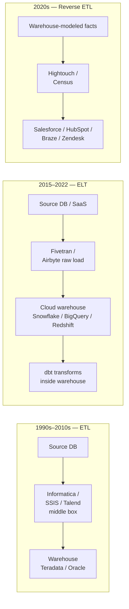
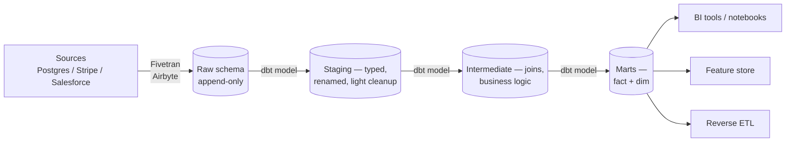

# ETL, ELT, and Data Pipelines

**Date:** 2026-04-25 | **Updated:** 2026-04-25
**Tags:** `system-design` `data-engineering` `etl` `pipelines`

## Table of Contents

- [Summary](#summary)
- [Overview — The Pipeline as a Product](#overview--the-pipeline-as-a-product)
- [Key Concepts](#key-concepts)
  - [ETL — Transform Before Load](#etl--transform-before-load)
  - [ELT — Load Raw, Transform in Warehouse](#elt--load-raw-transform-in-warehouse)
  - [Reverse ETL — Warehouse to Operational Systems](#reverse-etl--warehouse-to-operational-systems)
  - [Orchestrators — The Control Plane](#orchestrators--the-control-plane)
  - [Declarative vs Imperative Pipelines](#declarative-vs-imperative-pipelines)
  - [Data Contracts — Schema as API](#data-contracts--schema-as-api)
  - [Idempotent Pipeline Design](#idempotent-pipeline-design)
  - [Backfills, Incremental Loads, Full Refreshes](#backfills-incremental-loads-full-refreshes)
  - [dbt — The SQL Transform Layer](#dbt--the-sql-transform-layer)
  - [Observability — Tests, Freshness, Anomalies](#observability--tests-freshness-anomalies)
  - [CDC as an Ingest Source](#cdc-as-an-ingest-source)
- [Trade-offs](#trade-offs)
- [Code Examples](#code-examples)
  - [Airflow DAG — Imperative Orchestration](#airflow-dag--imperative-orchestration)
  - [dbt Model — Declarative SQL Transform](#dbt-model--declarative-sql-transform)
  - [Dagster Asset — Asset-Centric Orchestration](#dagster-asset--asset-centric-orchestration)
- [Real-World Uses](#real-world-uses)
- [Anti-Patterns](#anti-patterns)
- [Related](#related)
- [References](#references)

## Summary

An ETL or ELT pipeline is the machinery that moves data from where it is _produced_ (operational databases, SaaS APIs, event streams, files) to where it is _analyzed or consumed_ (warehouses, lakehouses, ML feature stores, downstream operational systems). The shape of that machinery has changed twice in twenty years: from ETL on dedicated transformation servers, to ELT pushing transforms into cloud warehouses, to reverse-ETL pushing warehouse-derived facts back into operational tools. Underneath the acronyms, the engineering questions are the same — what triggers a run, what is the unit of work, how do you handle reruns and backfills, how do you detect schema drift before it breaks dashboards, and how do you trust that yesterday's number is still yesterday's number tomorrow. This doc covers the architectural shapes, the orchestrator landscape, idempotency and contracts as design constraints, dbt as the modern transform layer, and the observability practices that keep pipelines honest.

## Overview — The Pipeline as a Product

A data pipeline is a directed graph where nodes are _tasks_ (extract a table, run a transform, materialize a view, send a webhook) and edges are _dependencies_ (this task needs that one's output). Three cross-cutting properties separate a real pipeline from a one-off script:

1. **Schedulable** — runs on cron, on event, or on the completion of an upstream signal
2. **Recoverable** — can be re-run safely after partial failure without producing duplicates or corrupting downstream state
3. **Observable** — emits metrics, lineage, and data-quality signals so humans can detect "this run looks wrong" before consumers do

The historical evolution:



The pivot from ETL to ELT was driven by cloud-warehouse economics: separation of storage and compute meant you could afford to land everything raw and transform inside the warehouse with elastic SQL compute, instead of paying for a separate transform tier. Reverse ETL emerged because the warehouse became the canonical source of analytical truth — and operational tools (sales CRM, marketing automation) needed that truth pushed back to them.

## Key Concepts

### ETL — Transform Before Load

In classic ETL, an external engine (Informatica, SSIS, Talend, custom Python) pulls from sources, applies cleaning/joining/aggregation in its own memory or staging tier, and lands the _already-modeled_ output into a warehouse. The warehouse holds curated marts; raw data is rarely retained.

**Strengths**:
- Warehouse stays small and cheap (only modeled data lands)
- Sensitive raw data can be filtered/masked before it touches analytics storage
- Predictable warehouse load — no ad-hoc transform compute against the warehouse

**Weaknesses**:
- Transform compute is bottlenecked by the ETL server's capacity (vertical scaling)
- Re-modeling requires reprocessing _from source_ — slow, expensive, sometimes impossible if source retention is short
- Schema changes require coordinated deploys to the ETL tier
- Lineage from source → mart is opaque; the transform tier is a black box of GUI mappings

ETL still makes sense for: regulated environments where raw data must never leave the source perimeter, very low-throughput legacy systems, and organizations standardized on a vendor stack from the 2000s.

### ELT — Load Raw, Transform in Warehouse

ELT inverts the order: land raw, transform later, transform _in the warehouse_. Snowflake, BigQuery, Redshift, and Databricks made this viable by separating storage from compute and making SQL transforms cheap and parallel.



**Strengths**:
- Raw data is preserved → re-modeling is cheap, no source replay required
- Transform compute scales elastically with the warehouse
- SQL is the lingua franca → analytics engineers can own transforms without a dedicated ETL platform team
- Lineage and documentation can be derived from the SQL itself (dbt does this)

**Weaknesses**:
- Warehouse storage and compute bills can grow unboundedly if not curated
- Sensitive raw data lives in the warehouse → governance and masking become first-class concerns
- "Just SQL" hides cost discipline: a single bad join can cost thousands

This is the dominant pattern for new data stacks today. See [oltp-vs-olap-and-lakehouses.md](../data-consistency/oltp-vs-olap-and-lakehouses.md) for the underlying storage architecture that makes it economical.

### Reverse ETL — Warehouse to Operational Systems

Reverse ETL pushes warehouse-modeled data back into operational tools — pushing computed lifetime-value scores into Salesforce, churn-risk segments into Braze, support-tier tags into Zendesk. The warehouse becomes the canonical source of customer truth that operational tools subscribe to.

Tools like Hightouch and Census model this as: pick a warehouse table, map columns to a destination object, configure sync cadence, handle the destination's quirks (Salesforce upsert keys, HubSpot rate limits, Braze attribute formats).

The architectural shift is real: ten years ago the CRM was the source of truth and analytics consumed it. Today the warehouse is the source of truth and the CRM is one of many subscribers.

### Orchestrators — The Control Plane

An orchestrator is the scheduler, dependency-resolver, and runtime monitor for the pipeline DAG. Four mainstream choices, with different worldviews:

| Orchestrator | Model | Sweet spot |
|--------------|-------|------------|
| **Apache Airflow** | Imperative DAG of tasks (Python) | The default. Mature ecosystem, huge operator library, decent for any batch workflow. Verbose. |
| **Dagster** | Software-defined assets (the _output_ is the unit, not the task) | Modern data stacks where lineage and asset materialization status matter. Type-aware, testable. |
| **Prefect** | Pythonic flows with hybrid control plane | Teams that want orchestration to feel like writing functions. Strong dynamic mapping, good local dev. |
| **Argo Workflows** | Kubernetes-native, YAML-defined DAGs | Containerized ML / batch workloads where K8s is already the substrate. Less data-engineering ergonomic. |

The choice shapes how you think:

- **Airflow** thinks in _tasks_: "run this Python function at 2am, then run that one." Asset state is implicit — you trust the task wrote what it was supposed to.
- **Dagster** thinks in _assets_: "this S3 path is an asset; it depends on these other assets; materialize it." The orchestrator tracks freshness and lineage as first-class concepts.
- **Prefect** thinks in _flows_: a flow is a Python function with retries, caching, and observability sprinkled on top. Dynamic DAGs (where structure depends on runtime data) are first-class.
- **Argo** thinks in _Kubernetes pods_: a workflow is a series of containers with input/output artifacts, scheduled on a cluster.

### Declarative vs Imperative Pipelines

The deeper distinction underneath orchestrator choice:

**Imperative** — you describe _the steps_:

```python
# pseudo-Airflow
extract_users()      >> load_users_to_warehouse()
extract_orders()     >> load_orders_to_warehouse()
[load_users, load_orders] >> transform_user_orders_mart()
```

The DAG is a literal sequence of operations. If a step succeeds, the orchestrator moves on; if it fails, it retries or alerts.

**Declarative** — you describe _the outputs_ and let the system figure out the steps:

```sql
-- dbt: this is the user_orders_mart asset
{{ config(materialized='incremental', unique_key='order_id') }}
SELECT u.user_id, u.email, o.order_id, o.total
FROM {{ ref('stg_users') }} u
JOIN {{ ref('stg_orders') }} o USING (user_id)

  WHERE o.updated_at > (SELECT MAX(updated_at) FROM {{ this }})

```

dbt computes the dependency graph from `ref()` calls. Dagster's `@asset` decorator does the same for arbitrary Python. You don't tell the system "run staging then run intermediate" — you tell it "this asset depends on those, compute the order yourself."

Declarative scales better as the pipeline grows because:

- Adding a new model doesn't require editing a DAG definition somewhere else
- The system can detect what _doesn't_ need re-running on a partial change
- Lineage is derived, not maintained by hand

### Data Contracts — Schema as API

A **data contract** is an explicit, versioned agreement between a producer (a service emitting events, a database table being CDC'd) and consumers (downstream pipelines and dashboards) about the schema, semantics, ownership, and SLA of a dataset.

Without contracts, a backend engineer renaming a column in `users.signup_source` to `users.acquisition_channel` ships on Tuesday and breaks the marketing dashboard on Wednesday. Nobody told marketing because nobody knew marketing depended on it.

Contracts make that dependency explicit:

```yaml
# data_contracts/users.yaml
dataset: users
owner: platform-team
schema:
  fields:
    - name: user_id
      type: uuid
      required: true
      pii: false
    - name: email
      type: string
      required: true
      pii: true
    - name: acquisition_channel
      type: string
      required: false
      allowed_values: [organic, paid_search, paid_social, referral]
sla:
  freshness: "<= 1 hour"
  completeness: ">= 99.9%"
breaking_changes:
  notification: "30 days minimum"
```

Tooling enforces this:

- **Schema registry** (Confluent, Apicurio) — rejects events that don't match the registered schema; supports forward/backward compatibility checks
- **Contract checks in CI** — block a PR that drops a required field
- **Drift detection in production** — alert when actual data deviates from the contract (new enum value, null rate spike, type coercion)

Data contracts are the equivalent of API versioning for data. The same questions apply: who owns it, how do breaking changes propagate, what does deprecation look like.

### Idempotent Pipeline Design

A pipeline task is **idempotent** if running it twice produces the same result as running it once. This is the single most important property for pipeline reliability — because tasks _will_ be re-run (retries on failure, backfills, manual reruns).

Common idempotency violations:

- **Append-only inserts** with no deduplication → reruns double-count
- **`INSERT INTO ... VALUES (NOW())`** → the timestamp changes between runs, so even "the same" record looks different
- **External side effects** (sending an email, calling an API) without dedup keys → users get spammed on retry
- **`SELECT * FROM source` without a time-bounded predicate** → captures different data each run

Patterns for idempotency:

- **Deterministic transforms** — the output for a given input partition is fully determined; no `NOW()`, no random ordering, no auto-incrementing IDs that depend on insert time
- **Partition-overwrite** — the unit of work is "the data for partition P", and the task atomically replaces partition P. Re-running overwrites the same partition. Standard in lake formats (Iceberg, Delta, Hudi).
- **Merge / upsert** with a stable business key — `MERGE INTO target USING source ON target.id = source.id` rewrites matching rows; idempotent by construction
- **Outbox + dedup keys for external side effects** — emit a record with a stable `event_id`; downstream consumers dedup on it

Idempotent design also makes **replay safety** trivial. If you can rerun any window and get the same answer, backfills become a normal operation instead of a panic.

### Backfills, Incremental Loads, Full Refreshes

Three load modes, each appropriate for a different situation:

| Mode | Definition | When to use |
|------|------------|-------------|
| **Full refresh** | Recompute the entire target from scratch | Small dimensions, reference tables, anything where reprocessing cost is negligible |
| **Incremental** | Process only new/changed records since the last run | Large fact tables; the default for high-volume data |
| **Backfill** | Reprocess a historical range, often after a code change or fix | Bug fixes, schema additions, source-data corrections |

Incremental load needs a **watermark column** — a high-water-mark like `updated_at` or a sequence number — that monotonically increases. The next run picks up where the last one left off:

```sql
WHERE updated_at > {{ last_run_watermark }}
```

Pitfalls:
- **Late-arriving data** with a stale `updated_at` is silently missed → use a generous lookback window or a separate late-data branch
- **Hard deletes** in the source aren't visible to a watermark predicate → use CDC instead, or periodic full reconciliation
- **Clock skew** across source replicas → use server-side ingest time, not source-local time, where possible

Backfill strategies:

1. **Parameterized DAG** — the same DAG accepts a date range parameter; running it for `2024-01-01` to `2024-03-31` reprocesses that window
2. **Partition-aware** — backfill only the affected partitions; unchanged partitions are not touched
3. **Side-by-side rebuild** — build the new model in a parallel schema, validate, swap atomically (zero-downtime for consumers)

### dbt — The SQL Transform Layer

dbt (data build tool) became the de facto transform layer in ELT stacks. It is not an orchestrator and not a data-loader — it is a SQL transformation framework that compiles `.sql` files (with Jinja templating) into warehouse DDL/DML and runs them in dependency order.

What dbt gives you:

- **Models** — `SELECT` statements that get materialized as tables, views, or incremental tables
- **`ref()` and `source()`** — declarative dependencies; the DAG is computed automatically
- **Tests** — schema tests (`unique`, `not_null`, `accepted_values`, `relationships`) and bespoke SQL tests; run as part of every build
- **Docs** — auto-generated, browsable lineage and column descriptions
- **Macros** — reusable Jinja-templated SQL fragments (Python-like DRY for SQL)
- **Snapshots** — slowly-changing-dimension Type 2 history with one config block
- **Packages** — reusable model libraries (`dbt-utils`, `dbt-expectations`)

The cultural shift dbt drove: analytics engineers (between data engineers and data analysts) own the modeling layer in version control, with code review, tests, and CI. The warehouse becomes a Git-managed repository of business logic.

### Observability — Tests, Freshness, Anomalies

Pipelines fail in two ways: _loud_ (the job crashes, you get paged) and _silent_ (the job succeeds but the data is wrong). Observability is the discipline of catching the silent kind.

Layered defenses:

1. **Schema tests** (dbt, Great Expectations) — declarative assertions: this column is unique, that one is non-null, this enum has these values
2. **Freshness checks** — alert when a source hasn't been updated within its SLA (e.g., `orders` should have new rows every 15 minutes)
3. **Volume checks** — alert when row count for a partition deviates from the rolling baseline by more than N standard deviations
4. **Distribution checks** — alert when a column's distribution shifts (mean, p50, null rate, cardinality)
5. **Lineage-aware impact analysis** — when a test fails, automatically identify all downstream models, dashboards, and reverse-ETL syncs at risk

Tooling:

- **dbt tests** — first line of defense, runs in CI and on every dbt build
- **Great Expectations** — richer expectation library, can run outside dbt, useful for non-warehouse data
- **Monte Carlo / Bigeye / Soda / Anomalo** — managed data observability platforms; ML-based anomaly detection, lineage UI, alert routing
- **Self-hosted Elementary, re_data** — open-source equivalents of the managed platforms

The principle: every dataset that humans depend on should have at least a freshness check, a volume check, and one schema test. Without them, "the dashboard is wrong" becomes a Slack archaeology project.

### CDC as an Ingest Source

Change Data Capture turns an OLTP database into a stream of row-level changes (`INSERT`, `UPDATE`, `DELETE` with before/after images). For pipelines, CDC is the gold-standard ingest path because:

- It captures _every_ change, including hard deletes that watermark-based incremental loads miss
- Latency is bounded by the WAL replication delay, not by a polling interval
- It puts no read load on the OLTP primary (consumed from the WAL / binlog)

Tools: Debezium (open source, Kafka Connect), AWS DMS, Fivetran (CDC mode), Airbyte (CDC), and increasingly built-in (Snowflake's native streams from Postgres, BigQuery's Datastream).

CDC events typically land in Kafka or directly into the warehouse as an append-only `cdc_events` table; downstream dbt models materialize the current state via `MERGE` or windowed aggregation. See [change-data-capture.md](../data-consistency/change-data-capture.md) for the deep dive on CDC mechanics.

## Trade-offs

| Decision | Option A | Option B | When A wins | When B wins |
|----------|---------|---------|-------------|-------------|
| Transform location | ETL (external) | ELT (in warehouse) | Sensitive raw data must not land in analytics; strict governance | Cloud warehouse exists, raw data is needed for re-modeling |
| Orchestrator paradigm | Imperative (Airflow) | Declarative assets (Dagster, dbt) | Mixed-stack workflows beyond data; existing Airflow expertise | Pure data stacks where assets are the main object of reasoning |
| Load mode | Incremental | Full refresh | Large facts, watermark exists, append-mostly workload | Small dims, complex transforms, frequent backfills |
| Schema evolution | Strict contracts + breaking-change blocks | Flexible loose schemas, fix downstream | Critical operational reverse-ETL paths; SLA-bound consumers | Early-stage data stack; cost of contracts > cost of breakage |
| Observability tier | Roll your own (dbt tests + alerts) | Managed (Monte Carlo / Bigeye) | Small team, budget conscious, modeled scope | Many sources, many consumers, dedicated data-quality on-call |
| Pipeline granularity | One big DAG | Many small DAGs | Tight coupling, shared schedule, simple ownership | Independent ownership, different cadences, blast-radius isolation |
| CDC vs polling for ingest | CDC | Watermark polling | Need hard-delete capture; sub-minute latency | Stable schema, append-only source, simple polling fits |

## Code Examples

### Airflow DAG — Imperative Orchestration

```python
from datetime import datetime, timedelta
from airflow import DAG
from airflow.providers.postgres.operators.postgres import PostgresOperator
from airflow.operators.python import PythonOperator
from airflow.providers.amazon.aws.transfers.postgres_to_s3 import PostgresToS3Operator

default_args = {
    "owner": "data-eng",
    "depends_on_past": False,
    "retries": 3,
    "retry_delay": timedelta(minutes=5),
    "email_on_failure": True,
}

with DAG(
    dag_id="orders_daily_etl",
    default_args=default_args,
    description="Daily orders ETL with idempotent partition overwrite",
    schedule_interval="0 2 * * *",  # 2am daily
    start_date=datetime(2026, 1, 1),
    catchup=True,  # backfill missing runs
    max_active_runs=4,  # cap parallel backfill runs
    tags=["orders", "daily"],
) as dag:

    extract_orders = PostgresToS3Operator(
        task_id="extract_orders",
        postgres_conn_id="oltp_primary",
        s3_bucket="raw-data-lake",
        s3_key="orders/dt={{ ds }}/orders.parquet",  # partition by execution date
        query="""
            SELECT *
            FROM orders
            WHERE updated_at >= '{{ ds }}'::timestamp
              AND updated_at <  '{{ next_ds }}'::timestamp
        """,
        replace=True,  # idempotent — overwrite partition on rerun
    )

    load_to_warehouse = PostgresOperator(
        task_id="load_to_warehouse",
        postgres_conn_id="warehouse",
        sql="""
            -- Idempotent merge: replace the partition for this date
            DELETE FROM raw.orders WHERE order_date = '{{ ds }}';
            COPY raw.orders FROM 's3://raw-data-lake/orders/dt={{ ds }}/'
              FORMAT PARQUET;
        """,
    )

    def run_dbt(**context):
        # Trigger dbt for downstream transforms; in production use the dbt-cloud
        # provider or a Cosmos integration
        import subprocess
        result = subprocess.run(
            ["dbt", "build", "--select", "tag:orders", "--vars", f"run_date: {context['ds']}"],
            capture_output=True, text=True, check=True,
        )
        print(result.stdout)

    transform = PythonOperator(
        task_id="dbt_build_orders",
        python_callable=run_dbt,
    )

    extract_orders >> load_to_warehouse >> transform
```

Notes:
- `catchup=True` plus `max_active_runs=4` enables bounded backfill on first deploy
- The S3 key is parameterized by `{{ ds }}` (Airflow's logical date), making each run write to its own partition — re-running the same date overwrites cleanly
- The warehouse load deletes the partition before COPY → idempotent on retry

### dbt Model — Declarative SQL Transform

```sql
-- models/marts/fct_orders.sql

{{ config(
    materialized='incremental',
    unique_key='order_id',
    on_schema_change='append_new_columns',
    cluster_by=['order_date'],
    tags=['orders', 'daily']
) }}

WITH orders AS (
    SELECT * FROM {{ ref('stg_orders') }}
    
      -- 3-day lookback to capture late-arriving updates
      WHERE updated_at >= (SELECT DATEADD(day, -3, MAX(updated_at)) FROM {{ this }})
    
),

users AS (
    SELECT * FROM {{ ref('dim_users') }}
),

products AS (
    SELECT * FROM {{ ref('dim_products') }}
)

SELECT
    o.order_id,
    o.order_date,
    o.user_id,
    u.acquisition_channel,
    o.product_id,
    p.category,
    o.quantity,
    o.unit_price,
    o.quantity * o.unit_price AS line_total,
    o.created_at,
    o.updated_at
FROM orders o
LEFT JOIN users u ON o.user_id = u.user_id
LEFT JOIN products p ON o.product_id = p.product_id
```

Companion test file:

```yaml
# models/marts/_marts.yml
version: 2

models:
  - name: fct_orders
    description: "One row per order line. Source of truth for revenue analytics."
    config:
      contract:
        enforced: true
    columns:
      - name: order_id
        description: "Stable order identifier from OLTP."
        data_type: varchar
        constraints:
          - type: not_null
          - type: unique
        tests:
          - unique
          - not_null
      - name: order_date
        data_type: date
        tests:
          - not_null
      - name: acquisition_channel
        data_type: varchar
        tests:
          - accepted_values:
              values: [organic, paid_search, paid_social, referral, unknown]
      - name: line_total
        data_type: number
        tests:
          - dbt_utils.expression_is_true:
              expression: ">= 0"
```

Notes:
- `materialized='incremental'` + `unique_key='order_id'` → dbt generates a `MERGE` statement; reruns overwrite matching rows, idempotent by construction
- `is_incremental()` Jinja branch with a 3-day lookback handles late-arriving updates
- The `contract: enforced: true` block fails the build if column types or constraints diverge from the declared shape — schema-as-API enforced in CI

### Dagster Asset — Asset-Centric Orchestration

```python
import pandas as pd
from dagster import (
    asset,
    AssetIn,
    Output,
    MetadataValue,
    DailyPartitionsDefinition,
    AssetCheckResult,
    asset_check,
)

daily_partitions = DailyPartitionsDefinition(start_date="2026-01-01")


@asset(
    partitions_def=daily_partitions,
    group_name="orders",
    compute_kind="python",
    description="Raw orders extracted from OLTP for a single day partition.",
)
def raw_orders(context) -> Output[pd.DataFrame]:
    partition_date = context.asset_partition_key_for_output()
    # Idempotent: same partition key always queries the same window
    df = query_oltp(
        f"""
        SELECT * FROM orders
        WHERE updated_at >= '{partition_date}'::date
          AND updated_at <  '{partition_date}'::date + INTERVAL '1 day'
        """
    )
    return Output(
        df,
        metadata={
            "row_count": len(df),
            "partition": partition_date,
            "preview": MetadataValue.md(df.head().to_markdown()),
        },
    )


@asset(
    ins={"raw_orders": AssetIn()},
    partitions_def=daily_partitions,
    group_name="orders",
    description="Cleaned, typed orders with FX-normalized totals.",
)
def stg_orders(context, raw_orders: pd.DataFrame) -> Output[pd.DataFrame]:
    cleaned = (
        raw_orders
        .assign(
            order_date=lambda d: pd.to_datetime(d["created_at"]).dt.date,
            total_usd=lambda d: d["total"] * d["fx_to_usd"],
        )
        .drop(columns=["fx_to_usd"])
    )
    return Output(
        cleaned,
        metadata={"row_count": len(cleaned)},
    )


@asset_check(asset=stg_orders, blocking=True)
def stg_orders_no_nulls(stg_orders: pd.DataFrame) -> AssetCheckResult:
    null_orders = stg_orders["order_id"].isna().sum()
    return AssetCheckResult(
        passed=null_orders == 0,
        metadata={"null_order_count": int(null_orders)},
    )
```

Notes:
- The DAG is implicit — Dagster reads the `AssetIn` dependencies and constructs the graph
- `DailyPartitionsDefinition` enables backfills with one click in the Dagster UI; each partition is independently materializable
- `@asset_check(blocking=True)` integrates data tests into the materialization lifecycle: a failed check blocks downstream materialization
- Metadata (row counts, previews) is first-class and surfaces in the UI without separate logging

## Real-World Uses

- **Marketing analytics** — Stripe + Salesforce + product events → warehouse → cohort/LTV/funnel marts → reverse-ETL audience syncs to ad platforms
- **Operational dashboards** — OLTP CDC stream → warehouse near-real-time models → Looker/Mode dashboards on minute-fresh data
- **ML feature stores** — daily batch features computed in dbt + warehouse; online features served from Redis or DynamoDB; backfills retrain models on consistent feature definitions
- **Regulatory reporting** — fixed-cadence ETL with strict lineage and reconciliation requirements; dbt + Great Expectations + audit logs satisfy "show me how this number was computed"
- **Customer 360** — CDC from product DB + ingest from Zendesk/Intercom/Stripe → unified customer mart → reverse-ETL pushes "customer health score" to Salesforce
- **Data product publishing** — well-modeled marts exposed via contracts to internal teams and external partners; treated like any API with versioning and SLAs
- **ELT for SaaS** — Fivetran/Airbyte ingestion of dozens of SaaS APIs into Snowflake/BigQuery; dbt as the single transform layer; a 5-person data team manages 100+ models

## Anti-Patterns

- **Non-idempotent transforms.** A pipeline that uses `NOW()` in its core logic, generates auto-increment IDs in transit, or appends without dedup keys. Reruns produce different results than the original; backfills become unsafe; partial failures corrupt state. Test for idempotency: run the same task twice on the same input — the output should be byte-identical.
- **Schema drift unhandled.** A producer adds a column, the pipeline silently drops it; or worse, removes a column and the pipeline silently fails for one consumer. Without contracts and drift detection, you find out from a Slack message at 3pm on a Friday.
- **Single giant DAG.** One Airflow DAG with 400 tasks, 20-minute parse times, shared schedule, shared blast radius. One bad task takes everything down; nobody owns it. Split by domain, by cadence, by criticality.
- **No backfill plan.** A pipeline that "works" only if it has run continuously since launch. The day a bug requires reprocessing the last 30 days, the team discovers there is no parameter for date range, no partitioned write, and the source DB doesn't retain that far back.
- **Ad-hoc transforms in BI tools.** Calculated fields in Looker/Tableau that duplicate (and slowly diverge from) warehouse logic. The warehouse should be the single source of truth; BI tools render it.
- **No staging layer.** Source data referenced directly from marts; every schema change in source breaks every mart. Always have a staging layer that absorbs source quirks.
- **Tests written after the fact (or not at all).** "We'll add dbt tests once it stabilizes." It never stabilizes. Tests are part of the model.
- **Ignoring late data.** Incremental models with no lookback window, then surprise: yesterday's revenue number changes today as late events arrive. Either widen the lookback, model it explicitly, or use CDC.
- **One-way reverse-ETL syncs that overwrite source-of-truth fields.** Reverse ETL pushing computed values into a CRM field that humans also edit, with no conflict policy → human edits silently overwritten on the next sync. Either sync to a separate field or design merge semantics.
- **No alerting on freshness.** A source connector silently breaks; the pipeline runs successfully on stale data for a week. Freshness checks are non-negotiable.

## Related

- [Batch vs Stream Processing — Lambda, Kappa, Unified](./batch-vs-stream-processing.md) — the architectural framing this doc sits inside; ETL/ELT is one shape of batch, plus increasingly stream-augmented
- [MapReduce and Descendants — Spark, Flink Batch, Beam](./mapreduce-and-descendants.md) — the compute substrate underneath large-scale batch transforms
- [Change Data Capture — Debezium, Logical Replication, Outbox](../data-consistency/change-data-capture.md) — the gold-standard ingest pattern for OLTP → warehouse pipelines
- [OLTP vs OLAP and Lakehouses](../data-consistency/oltp-vs-olap-and-lakehouses.md) — the storage architecture that makes ELT economical
- [Stream Processing — Kafka Streams, Flink, and Windowing](../communication/stream-processing.md) — the streaming counterpart, increasingly blended into ELT pipelines for near-real-time models

## References

- [Apache Airflow Documentation — Concepts](https://airflow.apache.org/docs/apache-airflow/stable/core-concepts/index.html) — DAGs, operators, scheduling, catchup, backfill semantics
- [Dagster Documentation — Software-Defined Assets](https://docs.dagster.io/concepts/assets/software-defined-assets) — the asset-centric model, partitioning, asset checks
- [Prefect Documentation — Flows and Tasks](https://docs.prefect.io/latest/concepts/flows/) — the flow/task model, dynamic mapping, hybrid execution
- [dbt Documentation — Building a dbt Project](https://docs.getdbt.com/docs/build/projects) — models, tests, contracts, incremental materializations
- [Argo Workflows Documentation](https://argo-workflows.readthedocs.io/) — Kubernetes-native workflow definitions, artifacts, DAG semantics
- [Monte Carlo — Data Observability](https://www.montecarlodata.com/blog-what-is-data-observability/) — the canonical framing of data observability and the five pillars (freshness, volume, schema, distribution, lineage)
- [Great Expectations Documentation](https://docs.greatexpectations.io/) — declarative data tests and expectation suites
- [Designing Data-Intensive Applications, Chapter 10 — Batch Processing](https://dataintensive.net/) by Martin Kleppmann — the systems-level framing that places ETL/ELT inside the broader batch-processing tradition
- ["The Modern Data Stack: Past, Present, and Future" — a16z](https://future.com/emerging-architectures-modern-data-infrastructure/) — industry-level architectural overview of the ELT-centric stack
