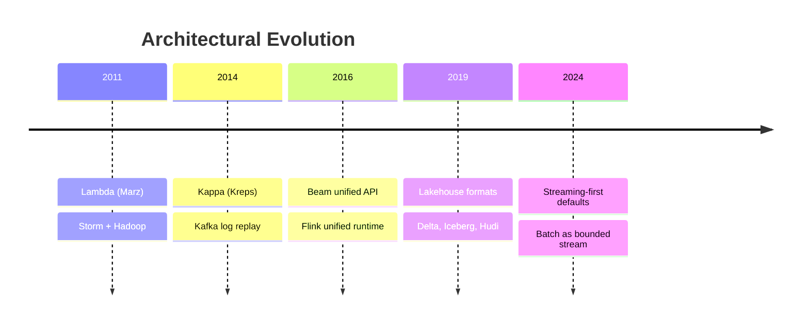
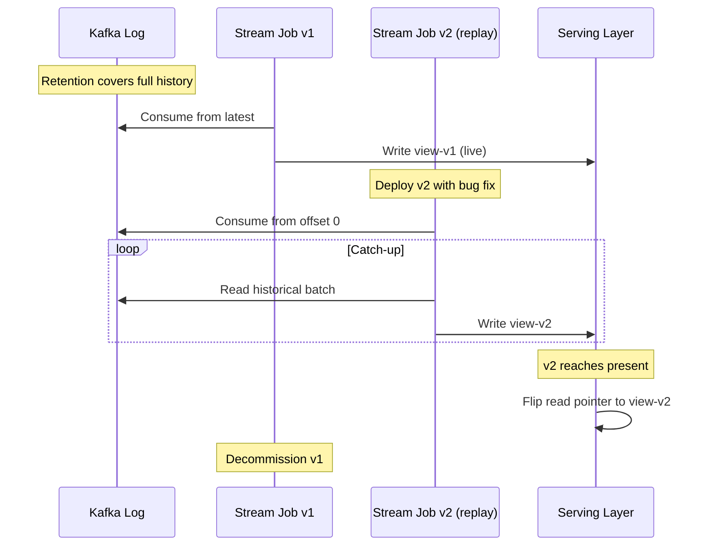

# Lambda vs Kappa Architecture

**Date:** 2026-04-25 | **Updated:** 2026-04-25
**Tags:** `system-design` `data-engineering` `architecture` `streaming`

## Table of Contents

- [Summary](#summary)
- [Overview](#overview)
- [Key Concepts](#key-concepts)
  - [Lambda — Three Layers](#lambda--three-layers)
  - [Kappa — One Engine, Replay the Log](#kappa--one-engine-replay-the-log)
  - [Reprocessing Strategies](#reprocessing-strategies)
  - [The Lakehouse Alternative](#the-lakehouse-alternative)
  - [Unified Engines (Flink, Beam, Spark Structured Streaming)](#unified-engines-flink-beam-spark-structured-streaming)
- [Trade-offs](#trade-offs)
  - [Code Duplication](#code-duplication)
  - [Accuracy vs Latency](#accuracy-vs-latency)
  - [Operational Complexity](#operational-complexity)
  - [Storage Cost and Retention](#storage-cost-and-retention)
- [Architectural Comparison Diagram](#architectural-comparison-diagram)
- [When Lambda Still Makes Sense](#when-lambda-still-makes-sense)
- [Real-World Uses](#real-world-uses)
- [Anti-Patterns](#anti-patterns)
- [Related](#related)
- [References](#references)

## Summary

Lambda and Kappa are the two canonical architectures for combining historical and real-time data processing. Lambda (Nathan Marz, 2011) runs a slow batch layer for accuracy and a fast speed layer for low-latency approximation, then merges results in a serving layer. Kappa (Jay Kreps, 2014) collapses the design to a single streaming layer and reprocesses history by replaying the durable log from offset zero. The modern trajectory has gone further: Flink and Beam treat batch as a bounded stream over the same engine, and lakehouse formats (Delta Lake, Iceberg, Hudi) give streaming pipelines transactional storage so the historical and live worlds share one substrate. This doc walks through the three patterns, when each still earns its keep, and the operational price tag attached to each — because the "two codebase tax" of Lambda is real and the "one log to rule them all" promise of Kappa is only true if your retention budget can pay for it.

## Overview

Before 2011 the assumption was that real-time and historical analytics were separate problems with separate stacks. You ran Hadoop nightly for accurate aggregates and bolted on a small online system that did approximate counters in Redis or Memcached. The two systems disagreed constantly and nobody could explain why.

Lambda was the first formal pattern. Marz proposed treating the batch layer as the source of truth — periodically recomputing everything from raw events — while a parallel stream layer handled the gap between "now" and the last batch run. The serving layer merged the two views.

Kappa, coined by Kreps in his "Questioning the Lambda Architecture" post, looked at Lambda and asked: if your message log is durable and replayable, why do you need a batch layer at all? Just keep the stream job, and when you need to recompute history, spin up a parallel stream job that reads the log from the beginning. One codebase, one engine, one model.

Modern unified engines (Flink, Beam, Spark Structured Streaming) and lakehouse formats (Delta Lake, Iceberg, Hudi) are the synthesis: stream as the primary model, batch as the bounded special case, transactional storage so historical reprocessing is cheap and incremental.



## Key Concepts

### Lambda — Three Layers

Lambda partitions the system by latency requirement.

**Batch layer.** Holds the immutable master dataset — the raw event log on HDFS or S3. Periodically (typically every 1–24 hours) it recomputes a complete view from scratch over the entire dataset. The output is **batch views** — denormalized, query-friendly artifacts written into the serving layer. Tools historically: Hadoop MapReduce, Hive, Spark batch.

**Speed layer.** Compensates for the latency of the batch layer. It processes only the data that has arrived since the last batch view was published, computing **real-time views** that are correct enough to be useful but explicitly approximate. State is small (only a few hours' worth) and is discarded once batch catches up. Tools historically: Storm, Heron, Spark Streaming.

**Serving layer.** Indexes both batch views and real-time views and serves queries by merging them. A query for "total clicks today" might read `clicks_through_yesterday_midnight` from the batch view and add `clicks_since_midnight` from the real-time view. Storage tools: Cassandra, HBase, ElephantDB, Druid.

```text
Raw events ─────┬─→ Batch layer    ─→ Batch view ─────┐
                │   (Hadoop/Spark)                     ├─→ Serving layer ─→ Query
                └─→ Speed layer    ─→ Real-time view ─┘    (merge logic)
                    (Storm/Heron)
```

Marz's stated invariants:

1. The master dataset is immutable and append-only.
2. The batch layer is the source of truth — it always wins.
3. The speed layer is "best effort" and can drop or correct data without permanent harm because the next batch run will overwrite it.
4. Human fault tolerance comes from the immutable dataset — bugs in views are recoverable by re-running batch.

### Kappa — One Engine, Replay the Log

Kreps's argument was that the durable log (Kafka) plus a stream processor that supports stateful, exactly-once processing makes the batch layer redundant. His three observations:

1. **The log is the master dataset.** Configure Kafka with long retention (or tiered storage), and the topic itself is the immutable source of truth.
2. **Reprocessing is replay.** To recompute, start a new instance of the stream job that reads from offset 0. When it catches up, atomically swap which version backs the serving layer.
3. **Same code, two purposes.** The same stream job serves both real-time and historical computation. No drift, no two implementations of the same business logic.

```text
Raw events ──→ Kafka log ──┬─→ Stream job v1 (live)         ─→ View v1 ─┐
                           │                                              ├─→ Serving (cutover)
                           └─→ Stream job v2 (replay from 0) ─→ View v2 ─┘
```

Kappa's preconditions are real:

- Log retention must cover the longest reprocessing window you care about. For "recompute from the beginning of time" you need either infinite retention or tiered storage (Kafka tiered storage, Pulsar's Apache BookKeeper + offload, or Confluent Cloud's S3 tier).
- The stream engine must support **stateful exactly-once** processing or your replay produces a different answer than the original run.
- Schema evolution becomes a first-class concern — old log entries must remain decodable.
- Replay must be **bounded-throughput-friendly** so you can finish catch-up in reasonable wall time.

### Reprocessing Strategies

Whether you call your architecture Lambda or Kappa, you need a reprocessing strategy. The mechanics differ.

**Lambda reprocessing.** Re-run the batch job. The batch view is overwritten on completion. The speed layer continues handling the tail. Trivial in concept; expensive in compute.

**Kappa reprocessing — parallel topic strategy.** Spin up a new instance of the stream job that writes to a _different_ output topic (`view-v2`). Let it catch up while the old job (`view-v1`) keeps serving. When `view-v2` is current, flip the serving layer's read pointer. This is the cleanest, lowest-risk approach.

**Kappa reprocessing — offset reset strategy.** Stop the consumer group, reset offsets to zero, restart. Simpler operationally but the serving layer sees a moving target — the view rewinds to "near the beginning of the log" and slowly catches up, leaving downstream consumers reading partial data. Acceptable only for derived data with clear "rebuild in progress" UX.

**Kappa reprocessing — savepoint-based replay.** Modern engines (Flink) take a **savepoint** before deploying a new version, then start the new job from a chosen source offset (often 0 for full replay) with no state, letting it rebuild. The savepoint of the old version remains as a rollback target. This is the production-grade flavor of the parallel-topic strategy with first-class engine support.



### The Lakehouse Alternative

Lambda's batch layer assumed an immutable file dump (HDFS, S3) that you scan from scratch each run. That was tolerable when batch was slow on purpose. Modern **lakehouse table formats** — Delta Lake (Databricks, 2019), Apache Iceberg (Netflix, 2018), Apache Hudi (Uber, 2017) — give the storage layer:

- ACID transactions on object storage
- Schema evolution
- Time travel (query the table as of a specific snapshot)
- Incremental reads (`MERGE INTO` from CDC, change data feeds)
- Streaming and batch readers/writers against the same table

This collapses two assumptions Lambda baked in:

1. **Batch storage is append-only and slow.** Lakehouse tables support upserts and deletes with reasonable performance.
2. **Batch and stream cannot share storage.** Now they can — a Flink job writes Iceberg, a Spark batch job reads the same table, a Trino interactive query hits the same snapshot.

The result is a pattern sometimes called "streaming lakehouse" or "unified analytics": stream events into a lakehouse table, run incremental transformations as continuous Flink/Spark jobs that update downstream tables, expose those tables to BI and ML. Both batch and stream are first-class consumers of the same source of truth, but you have only one pipeline.

### Unified Engines (Flink, Beam, Spark Structured Streaming)

The Beam programming model — and Flink's runtime that adopted the same philosophy — makes one assertion: **batch is a bounded stream**. The same operators (windowed aggregation, joins, side inputs) work over both. The runtime decides:

- For a bounded source: process as fast as possible to completion, no watermark advancement gymnastics required.
- For an unbounded source: maintain watermarks, fire windows on triggers, manage state durability.

Code-wise, the same `keyBy().window().aggregate()` works whether the source is `KafkaSource` (unbounded) or `FileSource` (bounded). For organizations that previously maintained a Hadoop pipeline _and_ a Storm pipeline, this collapses the two-codebase tax that motivated Kappa in the first place.

> See [modern-streaming-engines.md](./modern-streaming-engines.md) for the engine shootout (Kafka Streams vs Flink vs Spark vs Beam) and [batch-vs-stream-processing.md](./batch-vs-stream-processing.md) for the broader architectural comparison.

## Trade-offs

### Code Duplication

Lambda's defining cost. The same business logic — fraud rule, user-feature aggregation, billing computation — must be implemented twice: once in the batch dialect (Spark SQL, Hive, MapReduce) and once in the stream dialect (Storm, Heron, Spark Streaming). Symptoms:

- The two implementations drift over time. A bug fix lands in batch, the speed layer keeps the bug.
- "Why does the dashboard show different numbers when I refresh?" — the merge logic in the serving layer leaks the discrepancy.
- Test coverage doubles: every business rule needs batch-side and stream-side tests, plus a reconciliation test.
- New developers struggle to know which layer to modify; PRs pile up against one side and skip the other.

Kappa eliminates this directly. One codebase, one set of tests. The cost shifts to "make the stream engine handle batch-scale throughput during replay," which is largely an operational and capacity problem rather than a correctness problem.

### Accuracy vs Latency

Lambda framed this trade-off explicitly: the speed layer is _allowed_ to be wrong because batch will overwrite it. That sounds clean but it has a consequence — downstream consumers that read the merged view see numbers that change retroactively when batch catches up. UI must communicate "preliminary" vs "final" or risk eroding trust.

Kappa, by contrast, has a single answer at a single point in time. With exactly-once semantics, that answer is correct. With at-least-once, you accept a known duplication factor. Either way, the inconsistency between two layers disappears.

The accuracy-latency frontier is now mostly determined by your watermark and allowed-lateness budget, not by which architecture you chose. See [stream-processing.md](../communication/stream-processing.md) on watermarks and lateness.

### Operational Complexity

| Dimension | Lambda | Kappa | Unified Engine |
|-----------|--------|-------|----------------|
| Number of distinct systems | 3+ (batch + stream + serving + log) | 2 (stream + log) | 2 (engine + log/lakehouse) |
| Deploy targets | Hadoop cluster, Storm cluster, serving DB | Stream cluster, log | Single engine cluster, log/lakehouse |
| Failure modes | Layer-specific; merge logic itself can fail | Replay catch-up time; state restoration | Replay catch-up time; checkpoint tuning |
| Operator skill set | Hadoop ops + stream ops + DB ops | Stream ops + Kafka/Pulsar ops | Engine ops + lakehouse ops |
| Debugging | "Which layer is wrong?" — branching investigation | "Why does the stream job produce X?" — one place to look | One engine, one set of metrics |

Kappa is operationally simpler in the steady state but pushes complexity into the replay path — you must be able to spin up a parallel job, manage two views in the serving layer during cutover, and monitor catch-up progress. Lambda is operationally complex in the steady state because three systems need to be observed, scaled, and upgraded independently.

### Storage Cost and Retention

Kappa's "the log is the source of truth" requires retention long enough to cover the longest reprocessing window. For high-volume events (clickstream, ad impressions, IoT), this can mean petabytes of Kafka. Tiered storage (Kafka tiered storage to S3, Pulsar's BookKeeper offload, Confluent Cloud's infinite retention) makes this affordable but introduces a second access tier with higher read latency for old data.

Lambda's master dataset on HDFS/S3 was already cheap object storage by design. Replaying batch over S3 is the normal case, not an exotic one. The cost was always there; Lambda just owned it explicitly.

The lakehouse synthesis splits the difference: streaming engines write to Iceberg/Delta tables on object storage, retain in Kafka only as long as needed for in-flight processing (hours to days), and reprocess by reading the lakehouse table.

## Architectural Comparison Diagram

```mermaid
graph TB
    subgraph Lambda
        L_E[Raw events] --> L_Q[Kafka / queue]
        L_Q --> L_B[Batch layer<br/>Hadoop/Spark<br/>nightly]
        L_Q --> L_S[Speed layer<br/>Storm/Heron<br/>real-time]
        L_B --> L_BV[Batch view<br/>Cassandra/HBase]
        L_S --> L_RV[Real-time view<br/>Redis/in-memory]
        L_BV --> L_M[Serving layer<br/>merge query]
        L_RV --> L_M
        L_M --> L_C[Client]
    end

    subgraph Kappa
        K_E[Raw events] --> K_L[Kafka log<br/>long retention]
        K_L --> K_J[Stream job v1<br/>Flink/Kafka Streams]
        K_L -.->|on reprocess| K_J2[Stream job v2<br/>replay from 0]
        K_J --> K_V1[View v1]
        K_J2 --> K_V2[View v2]
        K_V1 --> K_S[Serving layer<br/>cutover]
        K_V2 --> K_S
        K_S --> K_C[Client]
    end

    subgraph Unified
        U_E[Raw events] --> U_L[Kafka / Pulsar]
        U_L --> U_F[Flink / Beam<br/>unified runtime]
        U_F --> U_T[Iceberg / Delta<br/>lakehouse table]
        U_T --> U_BI[Batch / BI / ML]
        U_T --> U_RT[Real-time consumer]
        U_BI --> U_C[Client]
        U_RT --> U_C
    end
```



## When Lambda Still Makes Sense

Lambda is not dead — it is the right answer in specific situations.

**You already have a mature batch system and a new low-latency requirement.** Years of Hadoop, Hive, dbt, Airflow with hundreds of pipelines, validated SLAs, monitoring, and team expertise. Bolting on a speed layer for one new dashboard is genuinely cheaper than rewriting everything to Kappa.

**Regulatory or audit requirements pin batch to a specific tool.** SOX, financial reporting, healthcare, government workloads sometimes mandate specific batch tooling for the "official" numbers, with stream layers explicitly disclaimed as preliminary.

**Batch is computationally cheaper for the heavy aggregations.** Some analytics — large-window joins, complex machine learning training — are dramatically faster as batch on a 1000-node Spark cluster than as a continuous stream job. Lambda lets you keep batch for the heavy lifting and stream for the freshness layer.

**Latency requirement is one-way.** "I need it within 24 hours, but I'd love a peek at the last hour." A speed layer providing that peek without rewriting batch is a small marginal investment.

**The team is 10x more comfortable with batch than streams.** This is a real engineering constraint. A correct Lambda system maintained by skilled batch engineers beats an attempted Kappa system that the team can't operate at 3am.

The honest test: if you're greenfielding a system today, default to unified streaming over a lakehouse. Choose Lambda only when an existing batch investment would be wasteful to abandon and a small speed layer earns its keep alongside it.

## Real-World Uses

**Twitter — Storm + Hadoop, then Heron-only.** The original Lambda poster child. Twitter ran Storm for real-time analytics (timeline metrics, search, ad impressions) alongside Hadoop for nightly recomputation. They eventually replaced Storm with Heron (operationally cleaner, same conceptual model) and progressively moved more workloads off Hadoop as Heron's exactly-once and stateful capabilities matured. The Heron team has publicly described moving to a more Kappa-shaped approach for many pipelines, retaining batch only where it earned its keep.

**LinkedIn — Kappa via Samza.** Kreps coined Kappa partly from LinkedIn's experience running Samza on Kafka. LinkedIn's metrics, recommendations, and stream-derived features ran on a single Samza-and-Kafka substrate, with replay-based reprocessing the standard pattern. The "log as source of truth" framing comes directly from LinkedIn's internal architecture decisions.

**Netflix — Streaming + Iceberg lakehouse.** Netflix uses Apache Flink for real-time stream processing (Mantis, Keystone) and Iceberg as the lakehouse table format for both streaming writes and batch ML/BI consumption. The historical Hadoop nightly is largely retired in favor of Flink-into-Iceberg with batch-style consumers reading the same tables.

**Uber — Hudi-based lakehouse, formerly Lambda.** Uber's original architecture was Lambda (Hadoop + Storm/Samza). They built Apache Hudi specifically to enable a unified architecture — a transactional, upsert-friendly table format that streaming and batch could both write to. Their stack converged on Flink + Hudi + Presto for unified analytics.

**Stripe — Stream-first analytics on Kafka + lakehouse.** Stripe runs payment-grade exactly-once stream processing for the live ledger and aggregates, with the same logs feeding lakehouse tables for finance, fraud, and BI workloads. The engineering blog has described the evolution explicitly as a Lambda-to-streaming-lakehouse migration.

**Pinterest — Lambda for ads, transitioning to Flink-on-Iceberg.** Public engineering content describes the same arc: original Lambda with batch on Spark and stream on a separate engine, migration to Flink for both real-time and incremental batch, Iceberg as the unified storage substrate.

The pattern across these organizations is consistent: start at Lambda because the tooling forced it, recognize the two-codebase tax, migrate to streaming-first or unified-engine architectures as the tooling caught up.

## Anti-Patterns

**Choosing Lambda when a stream alone suffices.** "We need both real-time and historical, so we need Lambda." No — if your stream engine supports replay and stateful exactly-once, you have both with one codebase. Lambda's two-codebase tax is large enough that it should be a last-resort architecture, not a default.

**Ignoring serving-layer merge complexity.** The Lambda papers gloss over the merge logic in the serving layer. In practice, "read batch view + read real-time view + merge" is a non-trivial application that has its own consistency bugs (e.g., the boundary timestamp between batch and speed layer must be exact or you double-count or drop data). Many Lambda failures live in this seam.

**Kappa without exactly-once.** "We'll just replay from offset zero when needed." If your engine is at-least-once, replay produces a _different_ answer than the original run because duplicates accumulate differently. Replay-based reprocessing only gives the same answer twice if the engine is deterministic and exactly-once.

**Kappa without sufficient retention.** Setting retention to 7 days and then needing to reprocess 6 months. The reprocess fails silently or gives a partial answer. Either provision retention to cover your worst reprocess case, or use tiered storage / lakehouse, or accept that "full history reprocess" is not a supported operation.

**Treating the speed layer as production-grade.** Lambda's speed layer was designed to be approximate. Teams that promote speed-layer numbers into customer-facing SLAs without acknowledging the approximation get burned when batch corrects it. If your speed-layer numbers are SLA-bound, you're really doing Kappa with extra steps.

**Maintaining Lambda after the unified-engine path is viable.** Sunk-cost reasoning. The two-codebase tax compounds annually; an engine migration pays for itself within a year or two for any team of meaningful size.

**Conflating "stream" with "Kappa."** A streaming pipeline is not automatically Kappa. Kappa specifically requires the log to be the system of record, with replay as the reprocessing primitive. A stream pipeline that processes-and-forgets, with no replay strategy, is just a stream pipeline.

**Skipping schema evolution planning.** Both Lambda and Kappa require old data (in HDFS or in Kafka) to remain decodable as the schema evolves. Without an explicit schema registry and forward/backward compatibility rules, replay breaks the moment a field is renamed.

**Reprocessing without observability.** A 6-hour replay running silently in production with no progress metric, no lag tracking, and no cutover procedure is how Kappa migrations turn into incidents. Treat replay as a first-class operation with its own runbook, dashboards, and abort criteria.

## Related

- [Batch vs Stream Processing — Architectures and Trade-offs](./batch-vs-stream-processing.md) — broader architectural framing this doc fits inside
- [Modern Streaming Engines — Kafka Streams vs Flink vs Spark vs Beam](./modern-streaming-engines.md) — engine-by-engine comparison for picking the right unified runtime
- [Stream Processing — Kafka Streams, Flink, and Windowing](../communication/stream-processing.md) — the conceptual model (event time, watermarks, state) underneath all three architectures
- [Design an Ad Click Aggregator](../case-studies/search-aggregation/design-ad-click-aggregator.md) — concrete Lambda-vs-Kappa decision in a high-volume aggregation system
- [Message Queues & Brokers — Kafka, RabbitMQ, SQS, NATS](../building-blocks/message-queues-and-brokers.md) — the durable log substrate Kappa requires
- [CQRS and Event Sourcing — Commands, Queries, and the Event Log](../scalability/cqrs-and-event-sourcing.md) — adjacent pattern that also treats the log as system of record
- [Idempotency and Exactly-Once Semantics](../communication/idempotency-and-exactly-once.md) — the guarantee Kappa replay depends on for deterministic reprocessing

## References

- [Nathan Marz, "Big Data: Principles and Best Practices of Scalable Realtime Data Systems"](https://www.manning.com/books/big-data) — the book that formalized Lambda; chapters 1–3 cover the master-dataset, batch, and speed layer model
- [Jay Kreps, "Questioning the Lambda Architecture"](https://www.oreilly.com/radar/questioning-the-lambda-architecture/) (O'Reilly Radar / LinkedIn, 2014) — the canonical Kappa post; explains why the log makes the batch layer redundant
- [Apache Flink — "Unified Batch and Stream Processing"](https://flink.apache.org/news/2020/01/29/state-unlocked-interacting-with-state-in-apache-flink.html) — Flink's unified runtime philosophy and savepoint mechanics
- [Tyler Akidau et al., "The Dataflow Model"](https://research.google/pubs/pub43864/) (VLDB 2015) — the paper behind Apache Beam; formalizes batch as bounded stream
- [Michael Armbrust et al., "Lakehouse: A New Generation of Open Platforms"](https://www.cidrdb.org/cidr2021/papers/cidr2021_paper17.pdf) (CIDR 2021, Databricks) — the Delta Lake / lakehouse architecture paper
- [Apache Iceberg — "Format Spec and Design"](https://iceberg.apache.org/spec/) — Netflix's table format that enables unified batch/stream consumption
- [Apache Hudi — "Concepts"](https://hudi.apache.org/docs/concepts/) — Uber's incremental processing and upsert-friendly storage layer
- [Confluent — "Kafka Tiered Storage"](https://www.confluent.io/blog/infinite-kafka-storage-in-confluent-platform/) — the operational mechanism that makes long-retention Kappa affordable
- [Twitter Engineering — "Heron: A New Generation of Streaming"](https://blog.twitter.com/engineering/en_us/a/2015/flying-faster-with-heron) — the Heron post-mortem on Storm and the move toward streaming-first analytics
- [Martin Kleppmann, "Designing Data-Intensive Applications," Chapter 11](https://dataintensive.net/) — the systems-level framing of Lambda, Kappa, and the unification pattern
