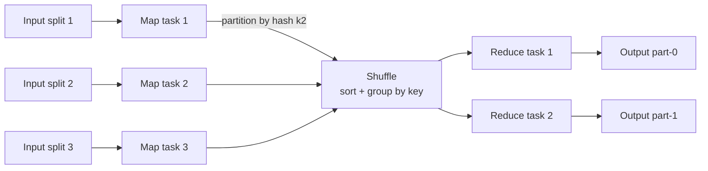
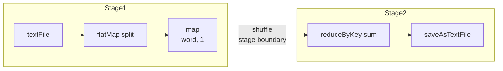

# MapReduce and Its Descendants

**Date:** 2026-04-25 | **Updated:** 2026-04-25
**Tags:** `system-design` `data-engineering` `batch` `distributed-computing`

## Table of Contents

- [Summary](#summary)
- [Overview](#overview)
- [The Dean-Ghemawat Model](#the-dean-ghemawat-model)
- [Hadoop MapReduce — The Open-Source Reference Implementation](#hadoop-mapreduce--the-open-source-reference-implementation)
- [Why MapReduce-as-API Faded](#why-mapreduce-as-api-faded)
- [Spark — DAG of Stages, RDDs, and the Catalyst Optimizer](#spark--dag-of-stages-rdds-and-the-catalyst-optimizer)
- [Flink — Dataflow as a First-Class Model](#flink--dataflow-as-a-first-class-model)
- [The Hadoop Ecosystem in Between — Tez, Pig, Hive](#the-hadoop-ecosystem-in-between--tez-pig-hive)
- [Apache Beam — Unified Batch and Stream](#apache-beam--unified-batch-and-stream)
- [Key Operators](#key-operators)
- [Shuffle — The Hardest Part](#shuffle--the-hardest-part)
- [Data Locality and Speculative Execution](#data-locality-and-speculative-execution)
- [Trade-offs — Hadoop MR vs Spark vs Flink vs BigQuery](#trade-offs--hadoop-mr-vs-spark-vs-flink-vs-bigquery)
- [Code Examples](#code-examples)
  - [Hadoop Streaming WordCount](#hadoop-streaming-wordcount)
  - [PySpark WordCount](#pyspark-wordcount)
  - [Modern Spark SQL Equivalent](#modern-spark-sql-equivalent)
- [Real-World Uses](#real-world-uses)
- [Anti-Patterns](#anti-patterns)
- [Related](#related)
- [References](#references)

## Summary

MapReduce is the model that made distributed batch processing tractable for the rest of us. The 2004 Dean-Ghemawat paper boiled down a generation of ad-hoc parallel data processing into three primitives — `map`, `shuffle`, `reduce` — and a runtime that handled partitioning, fault tolerance, and scheduling. Hadoop turned that paper into infrastructure. Spark, Flink, Tez, and modern cloud warehouses (BigQuery, Snowflake, Redshift Spectrum) then climbed up the abstraction ladder: DAG schedulers replaced rigid map-then-reduce pipelines, in-memory shuffles replaced disk round-trips between stages, and SQL planners replaced hand-written Java jobs. The MapReduce _API_ is mostly retired today, but the MapReduce _model_ — partition data by key, do work locally, exchange across the network, aggregate — is still the engine inside every distributed query you run on Spark, Flink, BigQuery, and Trino.

## Overview

Three eras to keep in mind:

1. **2004–2010 — MapReduce era.** Hadoop MapReduce dominates batch processing. Jobs are hand-written `Mapper`/`Reducer` Java classes. Anything more complex than "count words" is a chain of MR jobs reading and writing HDFS between every step.
2. **2010–2015 — DAG era.** Spark, Tez, and Flink generalize the model. Pipelines are arbitrary directed acyclic graphs of operators. Intermediate state stays in memory across stages when possible. Hive/Pig get retargeted from MR to Tez/Spark for 5–100× speedups.
3. **2015–present — Declarative era.** SQL is the dominant interface. Spark SQL, Flink SQL, BigQuery, Snowflake, Trino, Athena. The user writes SELECT/JOIN/GROUP BY and a query optimizer compiles it down to a DAG of MapReduce-shaped operators that run on a distributed shuffle-aware runtime. Most engineers writing "data pipelines" today have never written a `Mapper`.

This doc walks the lineage. The model survives even as the API got swallowed by SQL.

## The Dean-Ghemawat Model

The 2004 paper "MapReduce: Simplified Data Processing on Large Clusters" (Jeff Dean, Sanjay Ghemawat, OSDI '04) describes a programming model and a runtime, not a system you can download. It compresses any embarrassingly-parallel-with-aggregation problem into two user-supplied functions:

```text
map    : (k1, v1)        → list[(k2, v2)]
reduce : (k2, list[v2])  → list[(k3, v3)]
```

The runtime handles everything between: partitioning the input, distributing tasks, the shuffle phase that moves all values for a given `k2` to the same reducer, sorting them, calling the reducer, and writing the output. Failure handling, locality, retries — all the runtime's job.



Three runtime properties made the paper land:

- **Restartable tasks.** Map and reduce tasks are deterministic functions of their input. If a worker dies, the master re-runs the task on another worker — no checkpointing of partial state needed.
- **Materialization between phases.** Map output is written to local disk; reduce reads it over the network. This is slow but bulletproof: any phase can be re-executed independently.
- **Locality-aware scheduling.** The master tries to schedule map tasks on the same machine (or rack) as the input data block, exploiting the GFS/HDFS replica layout.

What the paper did _not_ have: in-memory pipelining, multi-stage DAGs, optimization, interactive query latency. Those came later.

## Hadoop MapReduce — The Open-Source Reference Implementation

Hadoop, originating from Doug Cutting's work on Nutch in 2006, became the dominant open-source implementation. Two pieces:

- **HDFS** — distributed filesystem inspired by the GFS paper; default replication factor 3; 64–128 MB blocks; locality metadata exposed to schedulers.
- **MapReduce v1 (and later YARN-based v2)** — JobTracker (master) + TaskTrackers (workers); jobs submitted as JAR files containing `Mapper` and `Reducer` Java classes plus a `JobConf`.

```java
public class WordCountMapper extends Mapper<LongWritable, Text, Text, IntWritable> {
    private final IntWritable one = new IntWritable(1);
    private final Text word = new Text();

    public void map(LongWritable key, Text value, Context context)
            throws IOException, InterruptedException {
        for (String token : value.toString().split("\\s+")) {
            word.set(token);
            context.write(word, one);
        }
    }
}

public class WordCountReducer extends Reducer<Text, IntWritable, Text, IntWritable> {
    public void reduce(Text key, Iterable<IntWritable> values, Context context)
            throws IOException, InterruptedException {
        int sum = 0;
        for (IntWritable v : values) sum += v.get();
        context.write(key, new IntWritable(sum));
    }
}
```

Boilerplate aside, the operational shape was fixed:

1. Map task reads input split from HDFS (locality-preferred).
2. Map output written to local disk, sorted and partitioned by reducer.
3. Reduce task pulls its partition over the network from every map task ("the shuffle").
4. Reducer output written back to HDFS, replicated three times.

Every join, every multi-step transform, every `GROUP BY` after a `JOIN` — each became another MR job in a chain, each materializing intermediate results to HDFS triple-replicated. This is the cost model that doomed the API.

## Why MapReduce-as-API Faded

Three real complaints, all observable in production:

**1. Verbosity.** A SQL `SELECT customer, SUM(amount) FROM orders JOIN customers USING (id) GROUP BY customer` is 80–200 lines of Java in raw MR, or two chained MR jobs (one for the join, one for the aggregate). Pig, Hive, and Cascading existed precisely to translate higher-level languages down to MR. Nobody actually wanted to write `Mapper` classes.

**2. Multi-stage jobs are slow because of disk I/O between stages.** A 5-stage pipeline writes to HDFS 5 times, replicates 5 times, reads back 5 times. For iterative algorithms (PageRank, k-means, graph traversal), this is catastrophic — the same data set is materialized again and again every iteration.

**3. The model is rigid.** "Map then reduce" doesn't fit operations like `JOIN` (needs two inputs at once), broadcast (needs the same data on every node), or arbitrary DAGs. People worked around it with chains of MR jobs, intermediate output staging, and creative use of the Combiner — but the abstraction was fighting them.

The fix wasn't to abandon the model. It was to:

- Generalize "map then reduce" to "arbitrary DAG of stages."
- Keep intermediate data in memory between stages when it fits.
- Move the user's interface up to SQL or a fluent dataset API.
- Let an optimizer pick the physical plan.

## Spark — DAG of Stages, RDDs, and the Catalyst Optimizer

Apache Spark (Zaharia et al., NSDI 2012) made three design moves that defined the DAG era:

**1. Resilient Distributed Datasets (RDDs).** A read-only, partitioned collection of records with two key properties: lineage (the sequence of transformations used to derive it) and lazy evaluation. If a partition is lost, Spark recomputes it from lineage rather than from a checkpoint. The lineage graph is the new `Mapper`/`Reducer` — but expressive enough to encode arbitrary DAGs.

**2. In-memory caching.** RDDs can be `persist()`ed in cluster RAM. Iterative workloads that previously touched HDFS every iteration now stay hot in memory. Reported speedups on iterative ML: 10–100×.

**3. Stage-based DAG scheduler.** The runtime breaks the DAG at shuffle boundaries into _stages_. Within a stage, operators are pipelined (no materialization). Between stages, a shuffle materializes data — but to local disk + memory, not replicated HDFS. Failure recovery uses lineage.



Then **Spark SQL + Catalyst** (2015) added a query optimizer that does what relational databases have done for 40 years — predicate pushdown, projection pruning, join reordering, code generation — but on top of Spark's distributed runtime. Suddenly a SQL query and a hand-written RDD job hit the same performance ceiling, and most users picked SQL.

The DataFrame/Dataset API replaced raw RDDs as the recommended interface. Catalyst rewrites `df.groupBy("customer").sum("amount")` into the optimized DAG. The MapReduce model is still in there — partition by key, shuffle, aggregate — but the user never wrote a `Mapper`.

## Flink — Dataflow as a First-Class Model

Apache Flink (Carbone et al., VLDB 2015) takes a different starting point: streaming first, with batch as a bounded special case. The runtime is a true continuous dataflow, not a sequence of materialized stages.

Key differences from Spark:

- **Pipelined execution** — operators stream records to the next operator continuously, even within batch jobs. No stage barriers by default; intermediate data can pass through network buffers without ever hitting disk.
- **Asynchronous barrier snapshots (Chandy-Lamport)** for fault tolerance — instead of recomputing from lineage, the runtime takes consistent distributed checkpoints. This works for unbounded streams where lineage replay is impossible.
- **Event-time semantics, watermarks, windows** as first-class runtime concepts, not user-code constructs.
- **Batch as bounded stream** — the same operators, the same runtime; batch jobs are just streams that the source declares finite. Some optimizations (e.g., sort-merge join) flip on for the bounded case.

For pure batch workloads Spark is often faster (sort-based shuffle, optimizer maturity). For unified workloads where the same logic must run as a backfill _and_ as a continuous stream, Flink's model wins. See [./batch-vs-stream-processing.md](./batch-vs-stream-processing.md) for the architectural framing.

## The Hadoop Ecosystem in Between — Tez, Pig, Hive

Before Spark won the DAG era, the Hadoop ecosystem evolved internally:

- **Apache Pig** (2008) — a dataflow scripting language (Pig Latin). Compiled to chains of MR jobs. Read-friendly compared to raw Java MR. Largely retired today.
- **Apache Hive** (2009, Facebook) — SQL-on-Hadoop. Metastore for table schemas; queries compiled to MR (originally), then to Tez or Spark. Hive Metastore is still the de facto schema catalog standard, used by Trino, Spark, Flink, and Iceberg.
- **Apache Tez** (2014) — a DAG execution framework for Hadoop, designed to replace MR as the execution engine under Hive and Pig. Same design moves as Spark (DAG of stages, in-memory passing), but stayed inside the Hadoop ecosystem and never reached Spark's adoption.

The contemporary stack is: Hive Metastore for catalog, Iceberg/Delta/Hudi for table format, Spark/Flink/Trino for compute, S3 for storage. MR and Tez are mostly historical curiosities.

## Apache Beam — Unified Batch and Stream

Apache Beam (originating as Google's Cloud Dataflow SDK, paper "The Dataflow Model" Akidau et al., VLDB 2015) is _not_ an engine — it's a unified programming model that compiles to multiple runners (Dataflow, Flink, Spark, Samza). Its central idea:

> Batch is a special case of streaming. There is one model — bounded and unbounded PCollections, windowing, triggers, accumulation modes — that subsumes both.

The Beam model elevates four questions that any data-processing job must answer:

1. **What** results are computed? (transformations: ParDo, GroupByKey, Combine)
2. **Where** in event time are results computed? (windowing)
3. **When** in processing time are results materialized? (triggers)
4. **How** do refinements relate? (accumulation: discarding vs accumulating vs accumulating-and-retracting)

Beam's value is portability and conceptual cleanness. Its cost is another abstraction layer; runner support varies, and most teams pick a single engine and use its native API. But the _model_ — especially watermarks, triggers, and the batch-as-bounded-stream framing — has shaped Flink, Spark Structured Streaming, and the BigQuery streaming API.

## Key Operators

The vocabulary that survives across Spark, Flink, Beam, and SQL planners.

| Operator | What it does | Shuffle? |
|----------|--------------|----------|
| `map` / `select` | One-to-one record transform | No |
| `filter` / `where` | Drop records by predicate | No |
| `flatMap` | One-to-many record transform | No |
| `groupByKey` | Collect all values for each key | Yes (full shuffle) |
| `reduceByKey` / `aggregateByKey` | Group + aggregate, with map-side combine | Yes (smaller shuffle) |
| `join` (shuffle hash / sort-merge) | Match records across two datasets by key | Yes |
| `broadcast join` (map-side join) | Replicate the small side to every node | No (if small side fits) |
| `union` | Concatenate datasets with same schema | No |
| `repartition` / `coalesce` | Change parallelism | Yes / No |
| `window` (event-time) | Group records into bounded chunks | Yes (per-key) |

A few high-leverage observations:

- **`reduceByKey` ≫ `groupByKey` + `sum`.** `reduceByKey` does a map-side combine (think: MR's Combiner), shrinking shuffle volume by orders of magnitude for high-cardinality aggregations.
- **Broadcast joins eliminate the shuffle on one side.** If your `customers` dim table is 50 MB and your `orders` fact table is 5 TB, broadcast `customers` and skip the 5 TB shuffle entirely. Catalyst and Flink's optimizer pick this automatically based on table statistics.
- **Joins on the same key as a prior `groupByKey` can avoid the shuffle.** This is _co-partitioning_; both Spark and Flink track partition layout to avoid redundant shuffles.

## Shuffle — The Hardest Part

The shuffle is the cross-partition data exchange between stages. It's where 80% of the engineering effort in any distributed processing engine goes, because:

- **All-to-all network traffic.** Every map task potentially writes data destined for every reduce task. With M maps and R reduces, that's M × R network connections worth of traffic.
- **Stage barrier.** No reducer can start until _every_ mapper writes its output (or at least until enough has been written for the reducer's partition). Stragglers in the map phase block the entire downstream stage.
- **Disk pressure.** Map output is written to local disk so it can be retried independently. Large jobs can shuffle terabytes per stage.
- **Skew amplification.** A single hot key sends 90% of its data to one reducer, which becomes the long tail.

Engines mitigate the cost in different ways:

| Technique | Engines | What it does |
|-----------|---------|--------------|
| Sort-based shuffle | Spark, Hadoop MR | Sort map output by partition+key; sequential reads |
| Hash-based shuffle | Older Spark | Faster for small reducer counts; lots of files |
| Push-based shuffle | Spark 3.x ("magnet") | Maps push to merge servers; reducers read sequential streams |
| Adaptive query execution (AQE) | Spark 3.x | Re-plan at shuffle boundary based on actual sizes |
| Coalesce post-shuffle | Spark, Flink | Merge tiny output partitions to reduce task count |
| Skew-aware joins | Spark AQE, Flink | Detect hot keys, split them across multiple reducers |

The mental model: every time you see a `groupBy`, `join`, `distinct`, `orderBy`, or `repartition`, ask "is there a shuffle here, and if so, how big?" That single question explains 90% of distributed-processing performance pathologies.

## Data Locality and Speculative Execution

Two runtime techniques inherited directly from the original MapReduce paper.

**Data locality.** The scheduler prefers to run a task on a node that already has the input data, falling back to same-rack, then any-node. The classic ranking:

1. `NODE_LOCAL` — data on this machine
2. `RACK_LOCAL` — data on this rack
3. `ANY` — anywhere

For HDFS-based jobs this saves the cost of fetching block data over the network. For object-store-backed compute (S3, GCS), locality is irrelevant — there is no "local" since storage is decoupled from compute. This is why modern lakehouse engines (Spark on EMR, Trino, BigQuery) lean harder on caching layers, predicate pushdown, and columnar formats (Parquet, ORC) instead of locality.

**Speculative execution.** Stragglers are a fact of life: a single slow disk, an over-loaded node, GC pauses. Once a stage has finished _most_ of its tasks, the scheduler launches duplicate ("speculative") instances of the still-running tasks on other nodes; whichever finishes first wins. This trades a small amount of redundant work for tail-latency improvements that compound across stages.

Both Hadoop MR and Spark do this; Flink uses different mechanisms (it's continuous, not stage-batched).

## Trade-offs — Hadoop MR vs Spark vs Flink vs BigQuery

| Dimension | Hadoop MapReduce | Spark | Flink | BigQuery / Snowflake |
|-----------|------------------|-------|-------|----------------------|
| Primary use | Batch only | Batch + micro-batch streaming | Stream + batch | OLAP SQL |
| Execution model | Map → shuffle → reduce | DAG of stages | Continuous dataflow | Distributed SQL |
| Intermediate state | HDFS (replicated) | Memory + local disk | Network buffers + state backend | Cloud-managed shuffle |
| Fault tolerance | Re-run task | Lineage recompute | Distributed checkpoint | Managed by service |
| User API | Java Mapper/Reducer | DataFrame / SQL | DataStream / Table API / SQL | SQL only |
| Optimizer | None | Catalyst | Calcite + custom | Proprietary, query-history-aware |
| Latency floor | Minutes | Seconds (batch), 100ms (micro-batch) | Sub-second streaming | Seconds (interactive SQL) |
| Operational burden | High | Medium (or zero on Databricks/EMR) | Medium-high | Zero (managed) |
| Cost shape | Cluster you run | Cluster or serverless | Cluster you run | Per-query bytes scanned |
| Best for today | Legacy maintenance only | General-purpose ETL, ML | Real-time + unified pipelines | Ad-hoc analytics, BI |

The strategic question for new pipelines: do you need a runtime, or do you need a query engine? If your workload is mostly SQL on tables stored as Parquet in S3, BigQuery / Snowflake / Databricks SQL / Trino is faster, cheaper, and lower-effort than running a Spark cluster. If you need imperative control flow, ML pipelines, or stream-batch unification, Spark or Flink is still the answer.

## Code Examples

The same word-count problem in three eras of the same lineage.

### Hadoop Streaming WordCount

`hadoop-streaming` lets you write `Mapper` and `Reducer` as any executable that reads stdin and writes stdout. This was the escape hatch from Java boilerplate.

```bash
#!/bin/bash
# mapper.sh
while read line; do
  for word in $line; do
    echo -e "${word}\t1"
  done
done

# reducer.sh
prev=""
count=0
while IFS=$'\t' read -r word val; do
  if [[ "$word" == "$prev" ]]; then
    count=$((count + val))
  else
    [[ -n "$prev" ]] && echo -e "${prev}\t${count}"
    prev="$word"
    count=$val
  fi
done
[[ -n "$prev" ]] && echo -e "${prev}\t${count}"

# submit
hadoop jar $HADOOP_HOME/share/hadoop/tools/lib/hadoop-streaming-*.jar \
  -input  /data/wikipedia \
  -output /data/wordcount-out \
  -mapper  mapper.sh \
  -reducer reducer.sh \
  -file mapper.sh -file reducer.sh
```

Even with the shell shortcut, you're managing partition keys, sort order, and intermediate output paths by hand. Anything more complex is a chain of these jobs.

### PySpark WordCount

The RDD API. Closer to MapReduce conceptually but with arbitrary DAGs and in-memory shuffle.

```python
from pyspark import SparkContext

sc = SparkContext(appName="WordCount")

counts = (
    sc.textFile("s3a://bucket/wikipedia/*.txt")
      .flatMap(lambda line: line.split())
      .map(lambda word: (word, 1))
      .reduceByKey(lambda a, b: a + b)   # map-side combine + shuffle
)

counts.saveAsTextFile("s3a://bucket/wordcount-out")
```

Two stages, one shuffle (at `reduceByKey`). The runtime pipelines `flatMap` → `map` → partial-aggregate within stage 1, shuffles, then runs the final aggregate in stage 2. No HDFS round-trips between operators.

### Modern Spark SQL Equivalent

What most teams actually write today.

```python
from pyspark.sql import SparkSession
from pyspark.sql.functions import explode, split, col

spark = SparkSession.builder.appName("WordCount").getOrCreate()

words = (
    spark.read.text("s3a://bucket/wikipedia/")
         .select(explode(split(col("value"), r"\s+")).alias("word"))
)

counts = words.groupBy("word").count()
counts.write.parquet("s3a://bucket/wordcount-out")
```

Or, equivalently:

```sql
CREATE OR REPLACE TABLE wordcount AS
SELECT word, COUNT(*) AS count
FROM (
  SELECT explode(split(value, '\\s+')) AS word
  FROM text.`s3a://bucket/wikipedia/`
)
GROUP BY word;
```

Catalyst compiles this to almost the same physical plan as the RDD version: scan, project, partial aggregate, shuffle, final aggregate, write Parquet. The user wrote SQL; the engine generated MapReduce-shaped operators. The MapReduce model is still in there; the API is gone.

## Real-World Uses

Concrete shapes where the MapReduce-derived model still does the work, even when the surface is SQL or notebooks.

- **ETL into a lakehouse.** Read raw events from S3, parse, dedupe, partition by date, write Iceberg/Delta tables. Pure batch DAG: scan → filter → groupBy(eventId) → take latest → write.
- **Reverse ETL and aggregation rollups.** Daily / hourly aggregate tables on top of fact tables. Classic `groupBy(dimensions).agg(metrics)`; the cost is the shuffle, the optimization is partition pruning + map-side combine.
- **Backfills and reprocessing.** Re-derive a year of derived tables when business logic changes. Spark on Databricks or EMR is the workhorse here precisely because batch is its strength.
- **Feature pipelines for ML.** Compute features from raw event logs, join against entity tables, write to a feature store. Often a chain of joins and aggregations.
- **Graph algorithms (PageRank, connected components).** Iterative; this is what RDD in-memory caching was designed for. Modern equivalents: GraphX (Spark), Flink Gelly, or running in a graph database.
- **Log analytics and security analytics.** Compile millions of events into per-user, per-host, per-rule aggregates. Often expressed as Trino/Athena SQL on Parquet — the engine still emits MapReduce-shaped plans.
- **Cloud warehouse internals (BigQuery, Redshift Spectrum, Snowflake).** The user writes SQL; under the hood the planner emits a DAG of operators that partition, shuffle, and aggregate over distributed columnar storage. The MapReduce paper's pseudocode would be recognizable to any of those engines' implementers.

## Anti-Patterns

The mistakes that show up in postmortems and slow pipelines.

- **Writing raw Hadoop MapReduce in 2026.** There is no remaining technical reason to. Spark/Flink/SQL on managed services are faster, simpler, and better supported. The only valid use is maintaining a legacy job already in production.
- **Multi-hop MR / chained jobs that re-read the same data.** A pipeline that runs job A, writes to HDFS, runs job B reading A's output, writes again, then job C — each materialization is replicated, network-traversed, and serialized. Collapse into a single Spark/Flink DAG.
- **`groupByKey` followed by aggregation.** Use `reduceByKey` / `aggregateByKey` so the engine can apply a map-side combine. Spark SQL does this automatically; raw RDD users frequently get it wrong.
- **Joining a small table with a `JOIN` instead of a broadcast.** A 100 MB lookup table shuffled to disk vs broadcast to every executor: orders of magnitude difference. Modern optimizers do this when statistics are present — make sure they are.
- **Ignoring data skew.** A single celebrity user, a `null` join key, a popular product: any one of these can stuff 50% of the data into one reducer. Detect with task duration histograms; fix with key salting, AQE skew handling, or pre-aggregation.
- **Treating the shuffle as free.** Every `groupBy`, `distinct`, `join`, `orderBy`, `window` is a shuffle. Pipelines that look short can be five shuffles deep. Read query plans (`explain()`) before tuning anything else.
- **Tiny files / over-partitioning.** Writing 10,000 partitions of 100 KB each kills both write performance (overhead) and downstream read performance (file open per task). Coalesce or repartition by a sensible cardinality before writing.
- **Iterative algorithms without caching.** PageRank, k-means, gradient descent — if the iteration body re-reads the same RDD/DataFrame, `.persist()` it. Without that, every iteration replays the lineage from source.
- **Choosing Spark/Flink for ad-hoc SQL.** Standing up a cluster to run interactive queries when BigQuery/Athena/Trino exist is operational masochism. Pick the right tool per workload.
- **Confusing "batch" with "slow."** A modern Spark job on Databricks SQL can hit single-digit-second latency for many ad-hoc queries. The historical "batch = overnight" association is an artifact of the Hadoop era, not a property of the model.

## Related

- [./batch-vs-stream-processing.md](./batch-vs-stream-processing.md) — the architectural framing for when batch (this doc's domain) is the right shape vs streaming
- [./modern-streaming-engines.md](./modern-streaming-engines.md) — head-to-head on the streaming descendants (Kafka Streams, Flink, Spark Structured Streaming, Beam runners)
- [./etl-elt-and-pipelines.md](./etl-elt-and-pipelines.md) — pipeline patterns built on top of the engines this doc covers
- [../data-consistency/oltp-vs-olap-and-lakehouses.md](../data-consistency/oltp-vs-olap-and-lakehouses.md) — the storage and consistency layer (Iceberg, Delta, Hudi) that modern Spark/Flink writes into
- [../communication/stream-processing.md](../communication/stream-processing.md) — the streaming counterpart, where the same model runs continuously instead of bounded

## References

- [Dean, Ghemawat — "MapReduce: Simplified Data Processing on Large Clusters" (OSDI 2004)](https://research.google/pubs/mapreduce-simplified-data-processing-on-large-clusters/) — the original paper; required reading
- [Zaharia et al. — "Resilient Distributed Datasets: A Fault-Tolerant Abstraction for In-Memory Cluster Computing" (NSDI 2012)](https://www.usenix.org/conference/nsdi12/technical-sessions/presentation/zaharia) — the Spark / RDD paper
- [Carbone et al. — "Apache Flink: Stream and Batch Processing in a Single Engine" (IEEE Data Eng. Bull. 2015 / VLDB)](https://www.vldb.org/pvldb/vol8/p1792-carbone.pdf) — the Flink design paper
- [Akidau et al. — "The Dataflow Model: A Practical Approach to Balancing Correctness, Latency, and Cost in Massive-Scale, Unbounded, Out-of-Order Data Processing" (VLDB 2015)](https://research.google/pubs/the-dataflow-model-a-practical-approach-to-balancing-correctness-latency-and-cost-in-massive-scale-unbounded-out-of-order-data-processing/) — the Beam / Cloud Dataflow paper
- [Saha et al. — "Apache Tez: A Unifying Framework for Modeling and Building Data Processing Applications" (SIGMOD 2015)](https://dl.acm.org/doi/10.1145/2723372.2742790) — Tez paper; the DAG generalization within Hadoop
- [Apache Spark — SQL, DataFrames, and Catalyst](https://spark.apache.org/docs/latest/sql-programming-guide.html) — current Spark SQL reference
- [Apache Flink — DataStream API and Architecture](https://nightlies.apache.org/flink/flink-docs-stable/) — current Flink reference
- ["Designing Data-Intensive Applications," Chapter 10 — Batch Processing](https://dataintensive.net/) by Martin Kleppmann — the systems-level framing of MapReduce and its descendants
