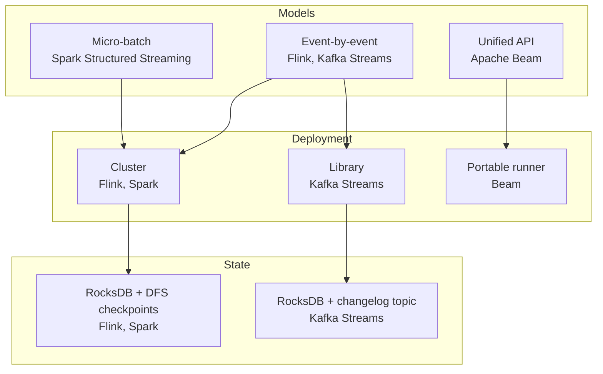

# Modern Streaming Engines — Flink, Spark Structured Streaming, Kafka Streams, Beam

**Date:** 2026-04-26 | **Updated:** 2026-04-26
**Tags:** `system-design` `data-engineering` `streaming` `flink` `spark` `kafka`

## Table of Contents

- [Summary](#summary)
- [Overview](#overview)
- [Key Concepts](#key-concepts)
  - [Apache Flink](#apache-flink)
  - [Spark Structured Streaming](#spark-structured-streaming)
  - [Kafka Streams](#kafka-streams)
  - [Apache Beam](#apache-beam)
- [State Backends Across Engines](#state-backends-across-engines)
- [Windowing Primitives Across Engines](#windowing-primitives-across-engines)
- [Exactly-Once — How Each Engine Gets There](#exactly-once--how-each-engine-gets-there)
- [Trade-offs](#trade-offs)
  - [Latency](#latency)
  - [State Size](#state-size)
  - [Operational Surface](#operational-surface)
  - [Exactly-Once Cost](#exactly-once-cost)
- [Comparison Matrix](#comparison-matrix)
- [Code Examples](#code-examples)
  - [Flink — DataStream WordCount](#flink--datastream-wordcount)
  - [Spark Structured Streaming — Python WordCount](#spark-structured-streaming--python-wordcount)
  - [Kafka Streams — Java WordCount](#kafka-streams--java-wordcount)
  - [Apache Beam — Portable Pipeline](#apache-beam--portable-pipeline)
- [Real-World Uses](#real-world-uses)
- [Anti-Patterns](#anti-patterns)
- [When to Choose Each](#when-to-choose-each)
- [Related](#related)
- [References](#references)

## Summary

Four engines dominate modern stream processing, and they do not solve the same problem. **Apache Flink** is a true event-by-event distributed dataflow runtime with the strongest event-time semantics, large embeddable state, and aligned-checkpoint exactly-once that propagates through transactional sinks. **Spark Structured Streaming** is a micro-batch engine that reuses the Spark SQL optimizer and DataFrame API; its exactly-once is delivered by deterministic batch boundaries plus idempotent or transactional sinks, with an experimental continuous-processing mode for sub-second latency. **Kafka Streams** is a JVM library — not a cluster — that turns each app instance into a stream task using Kafka itself as the coordinator, the changelog, and the source of exactly-once via Kafka transactions. **Apache Beam** is a unified programming model that runs on top of Flink, Spark, Dataflow, and others, trading a small expressiveness penalty for cross-runner portability. The right engine depends on latency target, state size, the operational team you have, and whether your data already lives in Kafka.

## Overview

The streaming-engine landscape stabilized around four shapes by the late 2010s and has barely moved since. Everything else is either built on top of one of these (ksqlDB on Kafka Streams, Decodable on Flink, Databricks on Spark) or fills a niche these miss (Materialize for incremental SQL, RisingWave for streaming-as-database).

The engines differ along four orthogonal axes:

1. **Execution model** — true event-by-event (Flink, Kafka Streams) vs. micro-batch (Spark) vs. unified abstraction (Beam).
2. **Deployment shape** — distributed cluster (Flink, Spark) vs. embedded library (Kafka Streams) vs. portable runner (Beam).
3. **State backend** — RocksDB on local disk + checkpoints to DFS (Flink, Spark) vs. RocksDB + Kafka changelog topics (Kafka Streams).
4. **Exactly-once mechanism** — aligned checkpoints + 2PC sinks (Flink) vs. deterministic batches + idempotent sinks (Spark) vs. Kafka transactions across input/output/state (Kafka Streams).



This doc assumes you already understand records, partitions, watermarks, windows, and the table-stream duality. Those primitives are covered in [stream-processing.md](../communication/stream-processing.md) and the [batch-vs-stream tradeoffs](./batch-vs-stream-processing.md) and [Lambda vs Kappa architecture](./lambda-vs-kappa-architecture.md). Here we focus on the engines themselves.

## Key Concepts

### Apache Flink

Flink is a distributed, JVM-based dataflow runtime explicitly designed around event-time streaming. It is the engine other engines are measured against for windowing semantics and large-state performance.

**Execution model.** Every record passes through every operator the moment it arrives — there is no batch boundary. Operators are arranged in a logical DAG that the runtime translates into a parallel physical plan with backpressure-aware credit-based network transport.

**State backend.** Flink stores operator state in a pluggable backend. The two production-ready choices:

- **HashMapStateBackend** — pure JVM heap. Fast but bounded by heap size, and every checkpoint serializes the whole map. Use only for small state (<1 GB per task).
- **EmbeddedRocksDBStateBackend** — RocksDB on local SSD. State is stored as serialized bytes; reads/writes hit native code with off-heap buffers. Supports incremental checkpoints (only changed SSTable files are uploaded). This is the default for any non-trivial production job.

**Checkpoints.** A periodic distributed snapshot using the Chandy-Lamport algorithm. The JobManager injects a checkpoint barrier into every source partition. Each operator, on receiving a barrier on all input channels, snapshots its state to durable storage (S3, HDFS, GCS) and forwards the barrier downstream. Default mode is **aligned checkpoints** — an operator with multiple inputs waits for the barrier on every channel before snapshotting, which guarantees consistency at the cost of latency under skew. **Unaligned checkpoints** (since 1.11) buffer in-flight records as part of the snapshot and remove the alignment wait, trading larger snapshots for faster completion.

**Savepoints.** A savepoint is a manually triggered, durable, version-stable variant of a checkpoint. It is the only safe way to upgrade a Flink job. Workflow: take savepoint → stop job → deploy new jar → start job from savepoint. State migrations are handled via schema evolution (Avro, POJO with serializer compatibility checks).

**Exactly-once.** Flink delivers end-to-end exactly-once via the **two-phase commit sink** protocol. Each transactional sink (`KafkaSink`, `FileSink`, `JdbcSink` with XA, Iceberg) plugs into the checkpoint lifecycle:

1. On normal record processing the sink writes to a *pre-committed* state — Kafka transaction with `transactional.id`, file in a `_temporary` directory, JDBC XA prepare.
2. When the checkpoint barrier arrives, the sink calls `preCommit()` and snapshots the transaction handle as part of state.
3. After all operators ack the checkpoint, the JobManager triggers `commit()` on every sink. Kafka's `commitTransaction()` runs, files are renamed, XA `commit` is sent.
4. On failure between `preCommit` and `commit`, the runtime restores from the last completed checkpoint and replays the commit (since the transaction handle was in state).

This is the strongest exactly-once guarantee available in production streaming. The cost is latency: the commit happens at checkpoint frequency (typically 10-60 seconds), so downstream readers see results in checkpoint-sized batches when reading committed-only.

### Spark Structured Streaming

Structured Streaming reuses the Spark SQL engine. The mental model: an unbounded input table grows over time, queries run continuously over the latest version, and results are emitted as appends, updates, or completes to an output table. The same DataFrame/Dataset API works for batch and streaming.

**Micro-batch (default).** The driver schedules a sequence of batches at trigger intervals (default: as fast as possible, otherwise `trigger(ProcessingTime("1 second"))`). Each batch reads the new offsets since the last batch from every source, runs the query as a Spark SQL job, and writes output. Latency floor is roughly 100ms-1s due to scheduling overhead.

**Continuous mode (experimental).** Since Spark 2.3, `trigger(Continuous("1 second"))` switches to a long-running per-task model with checkpoint frequency as the only batching boundary. Latency drops to ~1ms but supported operations are limited (no aggregations, no joins, no windows beyond projection/selection/filter). Most production deployments stay on micro-batch.

**State backend.** Spark stores keyed state in an embedded **HDFSBackedStateStore** by default — an in-memory hash map plus a delta-log written to the checkpoint location on every batch. Since 3.2 there's a **RocksDBStateStore** option that is the default for large-state jobs (Databricks recommends it past ~1 GB per task).

**Checkpointing.** Every micro-batch writes:

- The offsets read from each source (`offsets/`)
- The state delta (`state/`)
- The committed batch marker (`commits/`)

to the configured `checkpointLocation` directory. On restart, Spark reads the last committed batch marker and resumes from those offsets. The checkpoint dir is the system of record.

**Exactly-once.** Achieved by the combination of:

1. **Deterministic micro-batches** — given the same input offsets, the batch is deterministic; replay produces the same output.
2. **Idempotent sinks** — sinks must be either idempotent (rewriting the same batch produces the same effect) or transactional (commit-or-rollback per batch).
3. **Per-batch atomic commit** — file sinks rename `_spark_metadata/<batchId>` after writing. Kafka sinks write per-partition with deterministic offsets within a transaction (since Spark 2.4 with Kafka 2.0+ via `kafka.transactional.id.prefix`).

The guarantee is end-to-end exactly-once **only when both the source supports replayable offsets** (Kafka, Kinesis, file source) **and the sink supports idempotent or transactional writes**. Spark's `foreach` sink with arbitrary code does *not* give exactly-once unless the user implements idempotency manually.

### Kafka Streams

Kafka Streams is a Java library packaged as a single jar that turns any JVM application into a stream-processing node. There is no cluster, no master, no scheduler — the Kafka cluster itself is the coordinator.

**Execution model.** Each application instance reads from input topics using a Kafka consumer in a consumer group whose `group.id` equals the `application.id`. Kafka's group rebalance protocol assigns partitions to instances. Each instance creates a **stream task** per assigned partition. Tasks process records one at a time through the topology DSL (`stream`, `map`, `filter`, `groupByKey`, `windowedBy`, `count`, `join`, `to`).

**Topology.** The DSL builds a `Topology` — a DAG of processor nodes — at startup. Processor nodes can be stateless (map, filter) or stateful (aggregate, join, windowed-count). Stateful nodes are backed by **state stores**.

**State stores = changelog topics.** Every state store is a local RocksDB instance plus a Kafka topic that records every state change as a `(key, newValue)` message. The topic is named `<application-id>-<store-name>-changelog` and configured with `cleanup.policy=compact`, so it retains only the latest value per key. On task failure or rebalance, the new owner of a partition restores its state by replaying the changelog topic into a fresh local RocksDB. This is dramatically simpler than Flink's checkpointed-snapshot model — no DFS, no JobManager — but recovery time is proportional to changelog size.

**Standby replicas.** To reduce recovery time, Kafka Streams supports `num.standby.replicas` — additional instances that passively follow the changelog and keep a warm RocksDB ready, so on rebalance the takeover is near-instant.

**Exactly-once.** Configured via `processing.guarantee=exactly_once_v2` (the v2 variant uses a single producer per stream thread for better throughput). Each task wraps the following in one Kafka transaction:

- The output records produced to downstream topics
- The state changelog updates (writes to `<app>-<store>-changelog` topics)
- The committed input offsets (writes to `__consumer_offsets`)

If anything fails before `commitTransaction()` returns, all three are aborted atomically, and on restart the task re-reads from the previous committed offset. The key insight: the state changelog, the output, and the offset are **all topics in the same Kafka cluster**, so a single Kafka transaction covers them all. No external coordinator. No 2PC across systems. This is why Kafka Streams' exactly-once is conceptually the simplest of the four — but it is also why it is **only end-to-end within Kafka**. A Kafka Streams app calling `RestTemplate.post()` mid-process gets at-least-once on that side effect.

### Apache Beam

Beam is a programming model, not a runtime. You write a pipeline once using the Beam SDK (Java, Python, Go, Scala) and choose a runner at submission time — Flink, Spark, Dataflow, Samza, Apex, or DirectRunner for testing.

**The unified model.** Beam expresses every computation as a `PCollection<T>` (a possibly-unbounded distributed dataset) transformed by a `PTransform`. The model has four primitive concepts:

- **What** — `ParDo`, `GroupByKey`, `Combine` — the computation.
- **Where** — windowing strategy (fixed, sliding, session, global, custom).
- **When** — triggers (event-time, processing-time, data-driven, composite).
- **How** — accumulation mode (discarding, accumulating, accumulating-and-retracting).

This is the model from Tyler Akidau's "Streaming 101/102" articles, made concrete. It is the most expressive trigger system in the four engines — Flink and Spark each support a subset.

**Runner translation.** Each runner implements as much of the model as it can. Dataflow (Google's hosted runner) implements the full model and is the reference. Flink runner covers ~95% — most production-grade Beam-on-Flink works well. Spark runner is more limited (no per-key state in older versions, custom triggers partially supported). The Beam capability matrix at `beam.apache.org` is the source of truth for what a given runner supports.

**Why pick Beam.** Two real reasons: (a) you already use Dataflow and want portability as insurance, or (b) you want to express triggers and accumulation modes that Flink/Spark APIs don't expose directly. Otherwise the extra abstraction layer is overhead.

## State Backends Across Engines

| Engine | Backend | Durability | Recovery | Max practical state per task |
|--------|---------|------------|----------|------------------------------|
| Flink | RocksDB on local SSD | Incremental checkpoint to DFS | Restore from latest checkpoint | 100s of GB |
| Flink | HashMap (heap) | Full snapshot to DFS | Restore from latest checkpoint | <1 GB |
| Spark SS | RocksDB (3.2+) | Delta log to checkpoint dir | Replay delta log | 10s of GB |
| Spark SS | HDFSBackedStateStore | In-memory + delta log to DFS | Replay delta log | <10 GB |
| Kafka Streams | RocksDB on local SSD | Changelog topic in Kafka | Replay changelog | 10s of GB (limited by Kafka retention/space) |
| Beam (on Flink) | Inherits Flink backend | Inherits Flink | Inherits Flink | Same as Flink |
| Beam (on Dataflow) | Managed (Bigtable-backed) | Managed | Managed | TBs |

Three observations:

1. **Local state is non-negotiable for serious streaming.** All four engines put state on local SSD via RocksDB and fault-tolerate it externally. There is no production engine that uses Redis-as-state-store for primary state, because the network round-trip per record kills throughput.
2. **Flink scales state highest among self-hosted options.** RocksDB + incremental checkpoints lets a single Flink task hold hundreds of GB. Netflix runs 10TB+ jobs on Flink. Kafka Streams hits practical limits earlier because the changelog topic must hold every key.
3. **Recovery time differs sharply.** Flink restores from a single checkpoint snapshot — fast. Kafka Streams replays the changelog from offset 0 — slow if the changelog is large, mitigated by standby replicas.

## Windowing Primitives Across Engines

The conceptual primitives — tumbling, hopping/sliding, session, global — exist in all four engines but with name and semantic differences.

| Window type | Flink | Spark SS | Kafka Streams | Beam |
|-------------|-------|----------|---------------|------|
| Tumbling (fixed, non-overlap) | `TumblingEventTimeWindows.of(...)` | `window($"ts", "10 min")` | `TimeWindows.ofSizeAndGrace(...)` | `FixedWindows.of(...)` |
| Hopping/Sliding (fixed, overlap) | `SlidingEventTimeWindows.of(size, slide)` | `window($"ts", "10 min", "5 min")` | `TimeWindows.ofSizeAndGrace(...)` then advance | `SlidingWindows.of(size).every(slide)` |
| Session | `EventTimeSessionWindows.withGap(...)` | `session_window($"ts", "5 min")` | `SessionWindows.ofInactivityGapWithNoGrace(...)` | `Sessions.withGapDuration(...)` |
| Global + custom trigger | `GlobalWindows.create()` + custom trigger | Limited (mapGroupsWithState) | `UnlimitedWindows` (rare) | `GlobalWindows` + Beam triggers |

**Naming traps to remember:**

- **Flink "sliding" = Kafka Streams "hopping"** — both mean fixed-size, overlapping by a slide interval.
- **Kafka Streams "sliding window"** is reserved for a *join*-window concept (a relative timestamp range between two streams), not a regular aggregation window. Easy to confuse.
- **Spark `window()`** with two duration arguments is hopping; with one argument it is tumbling.

**Allowed lateness.** Flink and Beam expose first-class `allowedLateness()` plus side-output for late records. Kafka Streams expresses lateness via the `grace` argument of the window definition. Spark uses `withWatermark("ts", "5 minutes")` — events older than the watermark minus the grace period are silently dropped. Spark's late-record handling is the least flexible of the four.

## Exactly-Once — How Each Engine Gets There

Three different mechanisms, all marketed as "exactly-once," all subtly different in scope.

```mermaid
graph TB
    subgraph Flink_2PC[Flink — Aligned Checkpoint + 2PC]
        F1[Source reads offset]
        F2[Operators process]
        F3[Sink pre-commits<br/>Kafka txn open]
        F4[Checkpoint barrier flows]
        F5[All operators snapshot]
        F6[JobManager triggers commit]
        F7[Sink commits<br/>Kafka txn commit]
        F1 --> F2 --> F3 --> F4 --> F5 --> F6 --> F7
    end

    subgraph Spark_Det[Spark — Deterministic Batch + Idempotent Sink]
        S1[Read offsets for batch N]
        S2[Run batch deterministically]
        S3[Write to sink with batch ID]
        S4[Atomic batch commit marker]
        S1 --> S2 --> S3 --> S4
    end

    subgraph KStreams_Txn[Kafka Streams — Single Kafka Transaction]
        K1[Begin Kafka transaction]
        K2[Process records<br/>write output + changelog]
        K3[Send offsets to txn]
        K4[Commit transaction<br/>output+changelog+offset atomic]
        K1 --> K2 --> K3 --> K4
    end
```



### Flink: aligned checkpoints + 2PC sinks

- **Scope:** end-to-end exactly-once across heterogeneous sinks (Kafka, Iceberg, JDBC-XA, file).
- **Cost:** latency floor = checkpoint interval (typical 10-60 s for read-committed downstream).
- **Failure mode if misconfigured:** sink not 2PC-aware → at-least-once.

### Spark Structured Streaming: deterministic batches + idempotent/transactional sinks

- **Scope:** end-to-end exactly-once when source is replayable AND sink is idempotent/transactional.
- **Cost:** latency floor = micro-batch interval (typical 1-10 s).
- **Failure mode if misconfigured:** `foreach` sink with non-idempotent writes → at-least-once with duplicate effects.

### Kafka Streams: Kafka transactions across input+output+state

- **Scope:** exactly-once **within Kafka only**. External side effects (HTTP, DB writes via JDBC) are at-least-once.
- **Cost:** transaction commit overhead per `commit.interval.ms` (default 100ms with EOS).
- **Failure mode if misconfigured:** EOS off, or external sink without idempotency → duplicates.

### Beam: depends on the runner

Beam itself does not implement exactly-once. The runner does. Beam-on-Flink inherits Flink's mechanism. Beam-on-Dataflow inherits Dataflow's (which is closer to Flink's model). Beam-on-Spark inherits Spark's micro-batch guarantees.

> See [stream-processing § Exactly-Once in Streams](../communication/stream-processing.md#exactly-once-in-streams) for the broader theory and the relationship to idempotency at the receiver side.

## Trade-offs

### Latency

| Engine | Typical latency | Floor |
|--------|----------------|-------|
| Flink (aligned checkpoints, read-uncommitted) | 10-100 ms | low ms |
| Flink (read-committed downstream) | checkpoint interval (10-60 s) | checkpoint interval |
| Spark SS micro-batch | 1-10 s | ~100 ms |
| Spark SS continuous mode | ~1 ms | ~1 ms (limited ops) |
| Kafka Streams | 5-50 ms | low ms |
| Kafka Streams with EOS | `commit.interval.ms` (default 100 ms) | 100 ms |
| Beam on Dataflow | ~5 s | ~1 s |

**Lesson.** If you need sub-second end-to-end latency with exactly-once, your only practical choice is **Flink with read-uncommitted** (and accept that downstream readers may see uncommitted data until the next checkpoint) or **Kafka Streams**. Spark micro-batch is fine for sub-10-second latency; do not pick it for trading systems or real-time fraud authorization.

### State Size

- **<1 GB per task:** any engine works. Heap-based backends are fine.
- **1-100 GB per task:** Flink RocksDB or Spark RocksDB. Kafka Streams works but the changelog topic gets big.
- **100 GB - several TB per task:** Flink RocksDB with incremental checkpoints, or Dataflow (managed Bigtable-backed state). Kafka Streams becomes operationally painful — recovery times from changelog grow linearly.
- **>10 TB:** Dataflow or Flink only. At this point you need to think hard about state TTL, key cardinality, and whether some keys belong in an external store.

### Operational Surface

| Engine | What you operate |
|--------|-----------------|
| Flink | Flink cluster (JobManager + TaskManagers) + DFS for checkpoints + your apps |
| Spark SS | Spark cluster + checkpoint dir + your apps |
| Kafka Streams | Just your apps (Kafka is already there) |
| Beam | Whichever runner you chose, plus the Beam SDK version compatibility matrix |

The order from lightest to heaviest operational footprint is: Kafka Streams (just a library) → Beam-on-Dataflow (managed) → Spark SS (if you already run Spark for batch) → Flink (dedicated cluster, savepoint discipline, checkpoint tuning).

### Exactly-Once Cost

- **Flink aligned checkpoints under skew:** alignment wait pins fast-input channels to the slowest, raising p99 latency. Mitigation: unaligned checkpoints (1.11+).
- **Spark per-batch commit:** the commit step runs on the driver and serializes batches, capping throughput at ~1000-10000 batches/sec depending on sink.
- **Kafka Streams transactions:** transactions add ~10-30% overhead vs. at-least-once; transaction coordinator becomes a hot path on the broker.

The cheapest exactly-once is "don't enable it; make your downstream consumer idempotent." This is genuine engineering advice and not laziness — at-least-once + idempotent receivers is often simpler and cheaper than chasing engine-level EOS, especially when the sink is your own service.

## Comparison Matrix

| Dimension | Flink | Spark SS | Kafka Streams | Beam |
|-----------|-------|----------|---------------|------|
| Execution model | True event-by-event | Micro-batch (default) / continuous (experimental) | True event-by-event | Inherited from runner |
| Deployment | Dedicated cluster | Spark cluster | Embedded library | Runner-dependent |
| Languages | Java, Scala, Python (PyFlink), SQL | Scala, Java, Python, R, SQL | Java, Scala (kotlin via interop) | Java, Python, Go, Scala |
| State backend | RocksDB / heap | RocksDB / heap | RocksDB + Kafka changelog | Inherited |
| State limits | 100s GB per task | 10s GB per task | 10s GB per task | Runner-dependent |
| Checkpointing | Distributed snapshot to DFS | Per-batch delta to DFS | Changelog topic in Kafka | Inherited |
| Recovery time | Fast (snapshot restore) | Fast (delta replay) | Slow without standby (changelog replay) | Inherited |
| Event-time semantics | Excellent | Good | Good | Excellent (most expressive) |
| Allowed lateness | Yes + side outputs | Yes (but limited) | Yes (grace period) | Yes + side outputs |
| Exactly-once mechanism | Aligned checkpoints + 2PC sinks | Deterministic batch + idempotent sink | Kafka transactions | Inherited |
| EOS scope | Heterogeneous sinks | Heterogeneous sinks | Kafka only | Runner-dependent |
| Latency floor (with EOS) | Checkpoint interval | Batch interval | `commit.interval.ms` | Runner-dependent |
| SQL surface | Flink SQL (production-ready) | Spark SQL (mature) | ksqlDB (separate) | Beam SQL (limited) |
| Backpressure | Credit-based, automatic | Rate limit + scheduling | Consumer pause | Runner-dependent |
| CEP / pattern matching | Flink CEP library | Limited | Limited | Limited |
| Best for | Large state, low latency, complex event-time | SQL/ML pipelines on existing Spark infra | Microservices already on Kafka | Cross-runner portability |
| Worst for | Tiny ops teams | Sub-second latency | State >100 GB or non-Kafka source | Runner-specific features |

## Code Examples

### Flink — DataStream WordCount

```java
import org.apache.flink.api.common.eventtime.WatermarkStrategy;
import org.apache.flink.api.common.functions.FlatMapFunction;
import org.apache.flink.api.common.serialization.SimpleStringSchema;
import org.apache.flink.api.java.tuple.Tuple2;
import org.apache.flink.connector.kafka.sink.KafkaSink;
import org.apache.flink.connector.kafka.source.KafkaSource;
import org.apache.flink.connector.kafka.source.enumerator.initializer.OffsetsInitializer;
import org.apache.flink.streaming.api.datastream.DataStream;
import org.apache.flink.streaming.api.environment.StreamExecutionEnvironment;
import org.apache.flink.streaming.api.windowing.assigners.TumblingEventTimeWindows;
import org.apache.flink.streaming.api.windowing.time.Time;
import org.apache.flink.connector.base.DeliveryGuarantee;
import org.apache.flink.util.Collector;

import java.time.Duration;

public class FlinkWordCount {
    public static void main(String[] args) throws Exception {
        StreamExecutionEnvironment env = StreamExecutionEnvironment.getExecutionEnvironment();

        // Checkpoint every 30s — exactly-once requires this
        env.enableCheckpointing(30_000);

        KafkaSource<String> source = KafkaSource.<String>builder()
            .setBootstrapServers("kafka:9092")
            .setTopics("text-input")
            .setGroupId("flink-wordcount")
            .setStartingOffsets(OffsetsInitializer.earliest())
            .setValueOnlyDeserializer(new SimpleStringSchema())
            .build();

        DataStream<String> lines = env.fromSource(
            source,
            WatermarkStrategy.<String>forBoundedOutOfOrderness(Duration.ofSeconds(10)),
            "kafka-source"
        );

        DataStream<Tuple2<String, Long>> counts = lines
            .flatMap((FlatMapFunction<String, Tuple2<String, Long>>) (line, out) -> {
                for (String word : line.toLowerCase().split("\\W+")) {
                    if (!word.isEmpty()) {
                        out.collect(Tuple2.of(word, 1L));
                    }
                }
            })
            .returns(org.apache.flink.api.common.typeinfo.Types.TUPLE(
                org.apache.flink.api.common.typeinfo.Types.STRING,
                org.apache.flink.api.common.typeinfo.Types.LONG))
            .keyBy(t -> t.f0)
            .window(TumblingEventTimeWindows.of(Time.minutes(1)))
            .sum(1);

        // EXACTLY_ONCE delivery: 2PC sink committing on each checkpoint
        KafkaSink<String> sink = KafkaSink.<String>builder()
            .setBootstrapServers("kafka:9092")
            .setRecordSerializer(/* serializer */ null)
            .setDeliveryGuarantee(DeliveryGuarantee.EXACTLY_ONCE)
            .setTransactionalIdPrefix("flink-wc-")
            .build();

        counts.map(t -> t.f0 + "\t" + t.f1).sinkTo(sink);

        env.execute("Flink WordCount with EOS");
    }
}
```

Key points:
- `enableCheckpointing(30_000)` is required for exactly-once.
- `WatermarkStrategy.forBoundedOutOfOrderness` declares a 10-second lateness budget.
- `TumblingEventTimeWindows` is event-time, not processing-time.
- `DeliveryGuarantee.EXACTLY_ONCE` plus a `transactionalIdPrefix` activates 2PC.

### Spark Structured Streaming — Python WordCount

```python
from pyspark.sql import SparkSession
from pyspark.sql.functions import col, explode, split, lower, regexp_replace, window

spark = (
    SparkSession.builder
    .appName("SparkSSWordCount")
    .config("spark.sql.streaming.stateStore.providerClass",
            "org.apache.spark.sql.execution.streaming.state.RocksDBStateStoreProvider")
    .getOrCreate()
)

# Input — Kafka source with event-time column
raw = (
    spark.readStream
    .format("kafka")
    .option("kafka.bootstrap.servers", "kafka:9092")
    .option("subscribe", "text-input")
    .option("startingOffsets", "earliest")
    .load()
)

lines = raw.selectExpr("CAST(value AS STRING) AS line", "timestamp AS ts")

words = (
    lines
    .select(
        explode(
            split(lower(regexp_replace(col("line"), r"[^a-z\s]", " ")), r"\s+")
        ).alias("word"),
        col("ts"),
    )
    .where(col("word") != "")
)

# Watermark + tumbling window — drop events more than 10 min late
counts = (
    words
    .withWatermark("ts", "10 minutes")
    .groupBy(window(col("ts"), "1 minute"), col("word"))
    .count()
)

# Exactly-once: Kafka sink with idempotent producer + checkpoint location
query = (
    counts
    .selectExpr("CAST(word AS STRING) AS key",
                "CAST(count AS STRING) AS value")
    .writeStream
    .format("kafka")
    .option("kafka.bootstrap.servers", "kafka:9092")
    .option("topic", "wordcount-out")
    .option("checkpointLocation", "s3a://my-bucket/checkpoints/wc")
    .outputMode("update")
    .trigger(processingTime="5 seconds")
    .start()
)

query.awaitTermination()
```

Key points:
- `RocksDBStateStoreProvider` is the production-grade state backend for non-trivial state.
- `withWatermark("ts", "10 minutes")` declares 10 min late tolerance — events past that are dropped silently.
- `checkpointLocation` is the system of record for offsets and state.
- Exactly-once = deterministic batch + Kafka sink with idempotent producer (default since 2.5+).

### Kafka Streams — Java WordCount

```java
import org.apache.kafka.common.serialization.Serdes;
import org.apache.kafka.streams.KafkaStreams;
import org.apache.kafka.streams.StreamsBuilder;
import org.apache.kafka.streams.StreamsConfig;
import org.apache.kafka.streams.kstream.Consumed;
import org.apache.kafka.streams.kstream.KStream;
import org.apache.kafka.streams.kstream.Produced;

import java.time.Duration;
import java.util.Arrays;
import java.util.Properties;

public class KafkaStreamsWordCount {
    public static void main(String[] args) {
        Properties props = new Properties();
        props.put(StreamsConfig.APPLICATION_ID_CONFIG, "kstreams-wordcount");
        props.put(StreamsConfig.BOOTSTRAP_SERVERS_CONFIG, "kafka:9092");
        props.put(StreamsConfig.DEFAULT_KEY_SERDE_CLASS_CONFIG, Serdes.String().getClass());
        props.put(StreamsConfig.DEFAULT_VALUE_SERDE_CLASS_CONFIG, Serdes.String().getClass());

        // Exactly-once via Kafka transactions across input + output + state
        props.put(StreamsConfig.PROCESSING_GUARANTEE_CONFIG, StreamsConfig.EXACTLY_ONCE_V2);
        props.put(StreamsConfig.COMMIT_INTERVAL_MS_CONFIG, 100);

        // Standby replicas for fast failover
        props.put(StreamsConfig.NUM_STANDBY_REPLICAS_CONFIG, 1);

        StreamsBuilder builder = new StreamsBuilder();

        KStream<String, String> textLines = builder.stream(
            "text-input",
            Consumed.with(Serdes.String(), Serdes.String())
        );

        textLines
            .flatMapValues(line -> Arrays.asList(
                line.toLowerCase().replaceAll("[^a-z\\s]", " ").split("\\s+")))
            .filter((k, v) -> v != null && !v.isEmpty())
            .groupBy((k, word) -> word)
            .count()
            .toStream()
            .to("wordcount-out", Produced.with(Serdes.String(), Serdes.Long()));

        KafkaStreams streams = new KafkaStreams(builder.build(), props);

        Runtime.getRuntime().addShutdownHook(new Thread(streams::close));
        streams.start();
    }
}
```

Key points:
- No cluster — this app *is* the stream task. Run N instances and Kafka rebalances partitions.
- `EXACTLY_ONCE_V2` wraps output + changelog + offset commits in a single Kafka transaction.
- The `count()` operator creates a `KTable` backed by a state store and a `kstreams-wordcount-KSTREAM-AGGREGATE-STATE-STORE-...-changelog` topic automatically.
- `NUM_STANDBY_REPLICAS_CONFIG=1` means one warm replica per task for fast failover.

### Apache Beam — Portable Pipeline

```python
import apache_beam as beam
from apache_beam.options.pipeline_options import PipelineOptions
from apache_beam.transforms.window import FixedWindows
from apache_beam.io.kafka import ReadFromKafka, WriteToKafka

options = PipelineOptions([
    "--runner=FlinkRunner",
    "--flink_master=flink-jobmanager:8081",
    "--streaming",
])

with beam.Pipeline(options=options) as p:
    (
        p
        | "ReadKafka" >> ReadFromKafka(
            consumer_config={"bootstrap.servers": "kafka:9092"},
            topics=["text-input"],
        )
        | "DecodeValue" >> beam.Map(lambda kv: kv[1].decode("utf-8"))
        | "Tokenize" >> beam.FlatMap(
            lambda line: [w for w in line.lower().split() if w])
        | "WindowInto" >> beam.WindowInto(FixedWindows(60))
        | "PairWithOne" >> beam.Map(lambda w: (w, 1))
        | "Count" >> beam.CombinePerKey(sum)
        | "FormatOutput" >> beam.Map(
            lambda kv: (kv[0].encode("utf-8"), str(kv[1]).encode("utf-8")))
        | "WriteKafka" >> WriteToKafka(
            producer_config={"bootstrap.servers": "kafka:9092"},
            topic="wordcount-out",
        )
    )
```

The same pipeline runs unchanged on Dataflow by switching `--runner=DataflowRunner` (plus GCP project/region flags). This portability is Beam's central value proposition.

## Real-World Uses

- **Netflix — Flink** at the core of their Keystone pipeline. Routes trillions of events/day, runs personalization model features, drives real-time alerting. State sizes in the tens of TB; checkpoints to S3.
- **Uber — Flink + AthenaX (SQL on Flink)** for marketplace pricing, fraud, ETA. Picked Flink for event-time correctness and large state. Their `Marmaray` ingestion piece runs on Spark.
- **LinkedIn — Samza** historically (a sibling of Kafka Streams in concept), then Flink for newer pipelines. The `kafka-streams`-style colocated state was pioneered here.
- **Stripe — Spark Structured Streaming** for fraud signal aggregation, leveraging existing Spark/Databricks infrastructure. They tolerate the multi-second latency for batch-window features.
- **Confluent / Apache Kafka community — Kafka Streams** in countless microservices. Particularly popular for CDC-driven materialized views and event-driven service interiors that already speak Kafka.
- **Google internal + Spotify — Beam on Dataflow** for unified batch/stream over years of historical events. Spotify's "Wrapped" runs on Dataflow.
- **Pinterest — Flink** for real-time personalization and ad budgeting. Multi-PB state across thousands of jobs.

## Anti-Patterns

- **Picking Spark Structured Streaming for sub-second use cases.** The micro-batch floor is ~100ms-1s. If your SLO is "fraud decision in 200ms," Spark SS is the wrong answer — even continuous mode is too restricted to be useful for real workloads.
- **Picking Kafka Streams when your data is not in Kafka.** Kafka Streams reads only from Kafka and exactly-once works only within Kafka. If your sources are DynamoDB streams + Kinesis + Pulsar, Kafka Streams forces a Kafka middle layer for no benefit.
- **Picking Flink for a 50-line stateless transform.** Spinning up a Flink cluster, tuning checkpoints, training the team on savepoints — all to do `filter().map().to(topic)` is overkill. Use Kafka Streams or even a plain Kafka consumer.
- **Treating exactly-once as a flag you turn on.** Each engine's EOS has a scope. Flink: heterogeneous sinks if 2PC-aware. Spark: idempotent/transactional sinks. Kafka Streams: Kafka only. Enabling the flag and writing to a non-2PC sink does not give you EOS — it gives you slower at-least-once.
- **Ignoring savepoints in Flink.** Deploying a code change without taking a savepoint means the new code starts from the last automatic checkpoint, which may be incompatible after a serializer change. Worst case: state is gone, dashboards lie for hours.
- **Sending all state to heap.** "HashMapStateBackend is faster" — until restart, when the entire heap snapshot has to be deserialized from S3 and the job is unavailable for 20 minutes. Use RocksDB unless state is genuinely tiny.
- **Beam-on-Spark expecting Dataflow semantics.** The Spark runner does not implement the full Beam model. Custom triggers, late data side-outputs, accumulating-and-retracting modes — many silently fall back to the closest approximation. Read the runner capability matrix before committing.
- **Running Kafka Streams with `processing.guarantee=exactly_once_v2` and a 100GB state store.** The changelog topic is now 100GB+, every rebalance triggers a multi-hour restore, and one bad deploy can take the service down for the rest of the afternoon. Use standby replicas, or move to Flink.
- **One job doing everything.** A single Flink job with 50 operators, 20 different input topics, and 200 GB state is an operational nightmare — one bad operator kills the whole job. Split by domain; let independent jobs fail independently.

## When to Choose Each

A practical decision tree:

1. **Is your data already in Kafka, AND state per task < 50 GB, AND you don't want to operate a cluster?**
   → **Kafka Streams.** Lowest operational cost. Embed in your Spring Boot / microservice. EOS works out of the box.

2. **Do you need sub-second latency, large state (>100 GB), complex event-time windowing, or non-Kafka sources/sinks?**
   → **Apache Flink.** The only engine that does all of these well. Pay the cluster-operation tax.

3. **Are you already running Spark for batch ETL, your latency target is multi-second, and your team knows Spark SQL?**
   → **Spark Structured Streaming.** Reuse the cluster, the optimizer, the operational know-how. Don't pick it for greenfield streaming.

4. **Do you need cross-runner portability, or are you on Dataflow already?**
   → **Apache Beam.** Otherwise the abstraction is overhead.

5. **Is your team < 5 engineers and the use case is "transform Kafka topic A → Kafka topic B"?**
   → **Kafka Streams or even a plain Kafka consumer + producer.** Don't reach for a streaming framework for a stateless map.

## Related

- [Stream Processing — Kafka Streams, Flink, and Windowing](../communication/stream-processing.md) — the conceptual model (records, watermarks, windows, state, EOS) these engines all implement
- [Batch vs Stream Processing — Lambda, Kappa, Unified](./batch-vs-stream-processing.md) — when streaming is the right tool at all
- [Lambda vs Kappa Architecture](./lambda-vs-kappa-architecture.md) — the two architectural patterns that frame how these engines are deployed at scale
- [Designing a Distributed Message Queue](../case-studies/distributed-infra/design-message-queue.md) — the broker primitives (partitioned log, consumer groups, transactions) that Kafka Streams and Flink-Kafka-source build on

## References

- [Apache Flink Documentation — Stateful Stream Processing](https://nightlies.apache.org/flink/flink-docs-stable/docs/concepts/stateful-stream-processing/) — checkpoints, savepoints, state backends, the canonical reference
- [Apache Flink — Fault Tolerance via Aligned & Unaligned Checkpoints](https://nightlies.apache.org/flink/flink-docs-stable/docs/ops/state/checkpointing_under_backpressure/) — the checkpoint algorithm in production detail
- [Spark Structured Streaming Programming Guide](https://spark.apache.org/docs/latest/structured-streaming-programming-guide.html) — micro-batch model, output modes, watermarks, sinks
- [Spark — Continuous Processing Mode](https://spark.apache.org/docs/latest/structured-streaming-programming-guide.html#continuous-processing) — the experimental low-latency mode and its limitations
- [Apache Kafka Streams Documentation](https://kafka.apache.org/documentation/streams/) — DSL, processor API, state stores, exactly-once-v2
- [Confluent — Exactly-Once Semantics in Kafka Streams](https://www.confluent.io/blog/enabling-exactly-once-kafka-streams/) — the Kafka transaction mechanism explained from the engine team
- [Apache Beam Programming Guide](https://beam.apache.org/documentation/programming-guide/) — the unified model: PCollections, windows, triggers, accumulation modes
- [Beam Capability Matrix](https://beam.apache.org/documentation/runners/capability-matrix/) — which runner supports which model features (essential before picking Beam)
- ["Streaming Systems"](https://www.oreilly.com/library/view/streaming-systems/9781491983867/) by Tyler Akidau, Slava Chernyak, Reuven Lax — the book-length treatment of the model behind Beam and Dataflow; required reading for serious streaming work
- [Designing Data-Intensive Applications, Chapter 11](https://dataintensive.net/) by Martin Kleppmann — the systems-level framing that puts these engines in context
