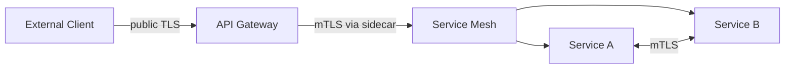
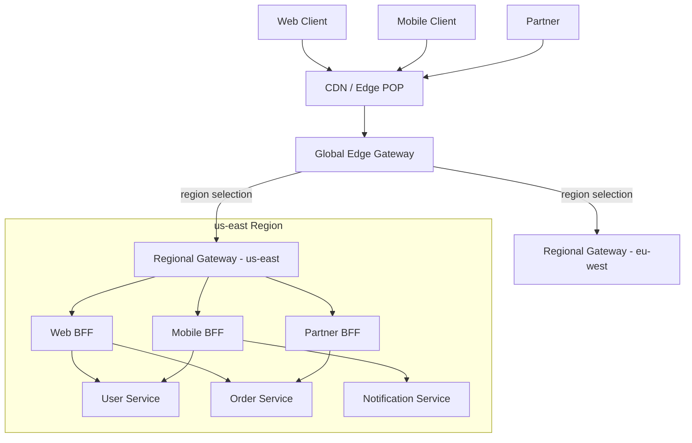
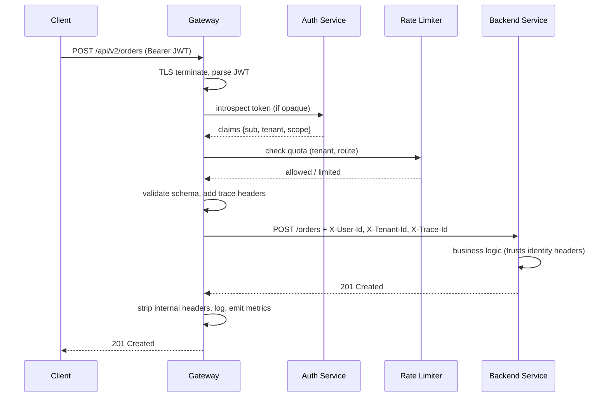

# API Gateways and BFFs — Routing, Auth Offload, Composition

**Date:** 2026-04-24 | **Updated:** 2026-04-24
**Tags:** `system-design` `building-blocks` `api-gateway` `bff` `architecture`

## Table of Contents

- [Summary](#summary)
- [Why Gateways Exist](#why-gateways-exist)
- [Core Responsibilities](#core-responsibilities)
- [Gateway vs Reverse Proxy](#gateway-vs-reverse-proxy)
- [Gateway vs Service Mesh](#gateway-vs-service-mesh)
- [The BFF Pattern — Backend-for-Frontend](#the-bff-pattern--backend-for-frontend)
  - [Where the BFF Lives](#where-the-bff-lives)
  - [When a BFF is Overkill](#when-a-bff-is-overkill)
- [GraphQL Gateway and Federation](#graphql-gateway-and-federation)
- [Exemplars — Who Does What](#exemplars--who-does-what)
- [Deployment Topology](#deployment-topology)
- [Request Flow Through a Gateway](#request-flow-through-a-gateway)
- [Composition and Aggregation](#composition-and-aggregation)
- [Common Anti-Patterns](#common-anti-patterns)
- [Performance Notes](#performance-notes)
- [Observability](#observability)
- [Gateway Config Example](#gateway-config-example)
- [Decision Checklist](#decision-checklist)
- [Related](#related)
- [References](#references)

## Summary

An **API gateway** is the single, policy-aware entry point that sits between external clients and your internal services. It owns cross-cutting concerns — TLS termination, auth, rate limiting, routing, observability — so services don't re-implement them in every language and framework. A **Backend-for-Frontend (BFF)** is a specialization: a client-specific aggregation layer (one per web, mobile, partner API) that tailors payloads and orchestrates calls to avoid chatty clients and over-fetching.

From a system-design perspective, the key questions are: what belongs at the edge, what belongs in a BFF, what belongs in the service mesh, and what belongs in the services themselves. Getting those boundaries wrong is how gateways turn into god objects and how BFFs turn into thin pass-throughs that justify their own existence.

## Why Gateways Exist

Before gateways, every microservice team re-implemented the same cross-cutting logic: TLS handling, JWT validation, rate limiting, request logging. Three problems compound as a system grows:

1. **Duplication across languages.** A Node service and a Spring service each needed their own auth middleware, correlation-ID plumbing, and metrics emitters. Drift was inevitable.
2. **Topology leaking to clients.** Mobile apps and SPAs ended up hard-coding hostnames for `orders.internal`, `users.internal`, `catalog.internal`. Refactoring services meant coordinating app releases across app stores.
3. **Too many client types.** A public REST API, a mobile app, a web SPA, and partner integrations all have different auth, latency, and payload requirements. One "canonical" API cannot serve all of them well.

The gateway pattern addresses all three by acting as a **facade** (see Chris Richardson's API Gateway pattern). Services stay simple and internal; the gateway projects a stable, policy-controlled surface to the outside world.

## Core Responsibilities

A production gateway typically owns:

- **Routing** — map external paths (`/api/v2/orders/*`) to internal services, usually via host/path/header/method matchers.
- **TLS termination** — centralize cert management, protocol negotiation (HTTP/2, HTTP/3), and cipher policy.
- **Auth / Authz offload** — validate JWTs, introspect opaque tokens, exchange session cookies for internal identity headers. Services receive a verified, trusted identity claim (e.g. `X-User-Id`, `X-Tenant-Id`) and don't re-do the crypto.
- **Rate limiting and quotas** — per-client, per-route, per-tenant. See the companion [rate limiters doc](../../networking/infrastructure/rate-limiters.md).
- **Request/response transformation** — strip internal headers, rewrite paths, normalize content types, mask fields, add correlation IDs.
- **Aggregation / composition** — fan out to multiple services and merge responses (more common in BFFs; see [below](#composition-and-aggregation)).
- **Retries and timeouts** — bounded retries with backoff, per-route timeouts, circuit breaking on upstream failure.
- **Observability** — access logs, RED metrics (Rate/Errors/Duration), distributed-trace propagation, auth-user attribution.
- **Caching** — response caching for idempotent reads, often via `Cache-Control` and ETags.
- **Schema and contract enforcement** — request validation (OpenAPI, JSON Schema) before requests hit backends.

The distinguishing property is that these are **policy** concerns, not business logic. The gateway should be stateless and replaceable; it should never own domain state.

## Gateway vs Reverse Proxy

The line is genuinely blurry — most gateways are built on reverse-proxy engines (NGINX, Envoy, HAProxy), and most reverse proxies can be configured to do gateway-like things.

| Dimension | Reverse Proxy | API Gateway |
|-----------|---------------|-------------|
| Primary concern | Generic HTTP routing and load balancing | API-aware policy and composition |
| Awareness | L4/L7 transport | Understands API versions, methods, auth schemes, schemas |
| Configuration shape | Static config, host/path rules | Declarative API definitions (often OpenAPI), plugin pipelines |
| Typical add-ons | Static file caching, compression | JWT validation, rate limiting, transformation, aggregation |
| Operator | Platform / infra team | API platform team (sometimes same, sometimes separate) |

Rule of thumb: if the device only cares that something is HTTP, it's a reverse proxy. If it cares that the HTTP request is calling a specific _API operation_ — and enforces policy on that basis — it's a gateway. Envoy, for example, is marketed as a proxy but is also the data plane of Istio and the foundation of many gateways (Ambassador/Emissary, Contour, Gloo).

## Gateway vs Service Mesh

Both handle L7 traffic; the axis that separates them is **direction**.

- **North-south (gateway):** traffic crossing the trust boundary — clients talking to the platform. Edge concerns: public TLS, external auth schemes, internet-scale rate limiting, WAF.
- **East-west (mesh):** traffic inside the platform — service A calling service B. Internal concerns: mTLS between pods, per-service retries and circuit breaking, fine-grained authz between workloads, SRE-grade telemetry.

They coexist. A typical modern stack has:



In Kubernetes, the two concerns converge around the **Gateway API** spec: `Gateway` and `HTTPRoute` resources for north-south, and mesh-specific CRDs (Istio `VirtualService`, Linkerd traffic policies) for east-west. Some projects (Istio, Kuma) offer both ingress and mesh from a unified control plane.

A common mistake is to try to use the mesh for north-south traffic. You _can_, but you give up the richer API-gateway ecosystem (developer portals, plan-based quotas, OpenAPI import, partner-key management).

## The BFF Pattern — Backend-for-Frontend

[Sam Newman's original 2015 writeup](https://samnewman.io/patterns/architectural/bff/) describes the problem bluntly: a single "general-purpose" API ends up serving no one well. A mobile client wants small, pre-aggregated payloads and tolerates latency poorly (radio wakeups cost battery). A web SPA wants richer payloads and can parallelize calls. A partner API has long-lived stability requirements and different auth.

A **BFF** is an API layer dedicated to one experience — typically one per client type:

```
┌─────────┐   ┌─────────┐   ┌──────────┐
│ Web SPA │   │  iOS    │   │ Partners │
└────┬────┘   └────┬────┘   └─────┬────┘
     │             │              │
┌────▼───────┐ ┌───▼────────┐ ┌───▼──────┐
│  Web BFF   │ │ Mobile BFF │ │Partner BFF│
└────┬───────┘ └───┬────────┘ └───┬──────┘
     │             │              │
     └─────┬───────┴──────┬───────┘
           │              │
       ┌───▼──┐      ┌────▼────┐
       │Users │      │ Orders  │   ... domain services
       └──────┘      └─────────┘
```

Each BFF:

- Is **owned by the client team** (or co-owned) — their velocity isn't blocked on the "general" API team.
- **Aggregates and shapes** responses to match one screen / one flow. The home screen on iOS may need user profile + order summary + notifications count — the BFF does one round trip instead of three.
- Speaks a protocol the client likes (REST, GraphQL, gRPC-Web, tRPC).
- Holds **no durable domain state** — it orchestrates calls to domain services.

### Where the BFF Lives

Two common placements:

1. **BFF as the gateway itself.** For small teams, the gateway _is_ the BFF. One component handles auth, routing, and the aggregation. Fast to ship, harder to keep clean as clients diverge.
2. **BFF behind a shared edge gateway.** The edge gateway handles TLS, WAF, global rate limiting, auth offload. Each BFF sits behind it and focuses on composition and client-specific shaping. This scales better and separates concerns.

The second is the dominant pattern at scale — see Netflix's adoption of BFFs behind Zuul/Gateway, and the same split at Spotify and SoundCloud.

### When a BFF is Overkill

A BFF earns its complexity when **clients diverge meaningfully** — different payloads, different auth, different latency budgets. If you have one web SPA and a hypothetical mobile app that may exist someday, a BFF is premature. Start with a well-factored API; extract a BFF when a second client type creates real pressure on the first.

## GraphQL Gateway and Federation

GraphQL shifts the aggregation problem from server to client — the client asks for exactly the fields it needs. Used naively, each team builds a monolithic GraphQL schema, which reintroduces the coordination problem microservices were supposed to solve.

**[Apollo Federation](https://www.apollographql.com/docs/federation/)** solves this by letting each service own a slice of the graph (a "subgraph") and having a **gateway/router** compose them into one unified graph at the edge. A query that crosses services (`user → orders → items → pricing`) is planned by the router, which dispatches sub-queries to the right subgraphs and stitches the result.

When a GraphQL gateway is a good fit:

- You have genuinely rich, graph-shaped data with many client-defined views.
- You have multiple client teams with different field needs, and want to avoid a combinatorial explosion of REST endpoints.
- You're willing to invest in schema governance (breaking-change detection, deprecation process, subgraph ownership).

When it's not:

- Simple CRUD with predictable payloads — REST or gRPC is lower-overhead.
- Operations with heavy side effects or strict transactional semantics — GraphQL mutations get awkward.
- Teams without capacity for schema-governance discipline.

Schema stitching (the predecessor to Federation) is generally discouraged for new work in favor of Federation v2.

## Exemplars — Who Does What

Self-hosted:

- **Kong** — plugin-based gateway on OpenResty/NGINX. Mature plugin ecosystem, good OSS story, enterprise tier for RBAC and analytics.
- **Envoy** — proxy primitive; also the data plane for many gateways. The [Kubernetes Gateway API](https://gateway-api.sigs.k8s.io/) spec has multiple Envoy-based implementations (Contour, Emissary, Gloo).
- **Spring Cloud Gateway** — Java/Reactor gateway, idiomatic for Spring shops. Good for teams who want to run the gateway alongside their Spring services with shared tooling.
- **Traefik** — strong K8s and Docker Swarm integration, automatic service discovery.
- **KrakenD** — declarative composition-first gateway, optimized for aggregation.
- **Tyk** — OSS + enterprise, plugin-based, good developer portal.
- **Apollo Router** — GraphQL federation router written in Rust.
- **Zuul 1/2** — Netflix's original gateway; largely superseded by Spring Cloud Gateway in the Spring world.

Managed:

- **AWS API Gateway** — REST, HTTP, and WebSocket APIs; tight integration with Lambda, IAM, Cognito. HTTP APIs are the lower-cost, lower-feature option.
- **Azure API Management** — developer portal, policies-as-XML, hybrid gateway for on-prem backends.
- **GCP API Gateway** — managed, OpenAPI-driven, designed around Cloud Run / Cloud Functions / GKE.

Choice drivers: where you run (cloud vs on-prem vs K8s), your language stack, whether you need a developer portal, cost model (per-request vs fixed infra), and the depth of the plugin ecosystem you need.

## Deployment Topology

A production-grade topology often looks like this:



Roles:

- **CDN / edge POP** — static asset caching, DDoS absorption, TLS termination close to the user.
- **Global edge gateway** — WAF, global rate limiting, geo routing, bot mitigation.
- **Regional gateway** — per-region routing, auth offload, regional rate limits.
- **BFFs** — client-type-specific composition.
- **Domain services** — business logic and durable state.

In Kubernetes, the regional gateway typically sits at the **Ingress / Gateway API** layer. External traffic hits a LoadBalancer Service, which forwards to a Gateway implementation (Envoy, NGINX, HAProxy). BFFs and domain services are Deployments exposed as ClusterIP Services and wired in via `HTTPRoute`.

## Request Flow Through a Gateway

A typical authenticated POST, annotated with where each concern is handled:



Two things worth noting:

1. **Trust boundary is at the gateway.** Once the gateway has authenticated a request, it attaches verified identity headers and the backend trusts them. Backends must not be externally reachable, or they'd trust spoofed headers.
2. **Every hop is a potential failure.** Retries and timeouts must be tuned so the gateway doesn't amplify outages (retry storms).

## Composition and Aggregation

Aggregation is the most commonly misunderstood gateway capability.

**Simple fan-out (appropriate at the BFF layer):**

```pseudocode
// Mobile home-screen BFF endpoint
GET /mobile/home
  parallel {
    user    = GET users-svc/users/{id}
    orders  = GET orders-svc/orders?user={id}&limit=5
    notifs  = GET notif-svc/unread-count?user={id}
  }
  return {
    user:   project(user, [name, avatarUrl]),
    recentOrders: orders.map(o => project(o, [id, total, status])),
    unreadNotifications: notifs.count,
  }
```

Good properties: single round trip for the client, projection that hides internal schemas, parallel fan-out.

**Cross-cutting only (appropriate at the edge gateway):**

Edge gateways should generally _not_ aggregate business data. They should route, authenticate, rate-limit, and observe. When aggregation leaks into the edge gateway, it becomes coupled to every domain, and every service-schema change forces a gateway deploy.

The split is: **edge handles envelope concerns, BFF handles content composition.**

## Common Anti-Patterns

1. **The gateway as a god object.** Business logic accretes in routing config — field mappings, conditional transforms that depend on user state, fraud checks. The gateway becomes unreviewable YAML and every domain change requires a gateway deploy by a central team.

2. **One BFF for three clients with divergent needs.** Defeats the purpose of the pattern. The BFF ends up with `if (clientType === 'mobile')` branches everywhere and becomes the coordination point the pattern was supposed to remove.

3. **Inconsistent auth placement.** Some routes authenticate at the gateway, some at the service, some at both. Services end up unsure whether they can trust identity headers, leading to double-validation or (worse) bypassable endpoints.

4. **Gateway becomes the SPOF.** A single gateway instance, a single region, or a gateway without a documented failure mode. Since every external request flows through it, gateway availability bounds platform availability from above.

5. **Retries without backoff or budget.** Gateway-level retries layered on top of service-mesh retries layered on top of client retries. A single slow backend triggers a retry storm that takes the whole platform down.

6. **Thin pass-through BFF.** BFF endpoints that just forward the request with no composition or projection. Adds a hop and a team boundary with no benefit. Either compose or cut it.

7. **Leaking internal schemas.** Backends change a field name; the client breaks because the gateway forwarded the raw payload. Either transform at the gateway/BFF or version the internal contracts explicitly.

8. **Putting domain state in the gateway.** User preferences in gateway config, feature flags in route rules, per-tenant business logic. The gateway should be stateless; state goes in services or a config service the gateway queries.

## Performance Notes

- **Extra hop cost.** Each gateway adds ~1-5 ms of p50 latency and a bit more at p99. This is usually acceptable; the win on connection reuse, TLS termination, and caching often compensates. Measure, don't assume.
- **Connection reuse.** Gateways maintain warm connection pools to backends (HTTP/2 multiplexing, gRPC streams). A million short-lived client connections collapse into thousands of long-lived backend connections.
- **HTTP/2 and HTTP/3.** Modern gateways speak HTTP/2 to clients (header compression, multiplexing) and can speak HTTP/2 or HTTP/1.1 to backends. HTTP/3 (QUIC) at the edge helps mobile users on lossy networks.
- **Latency contributor at p99.** Gateway queueing, JWT validation, and auth-service introspection can dominate at p99. Cache introspection results; use stateless JWT validation where possible (public-key verification is fast and local).
- **Payload size.** A BFF doing composition can _reduce_ total bytes on the wire for mobile by projecting to only the fields the client needs.
- **Warm-up and autoscaling.** Gateways are on the hot path. Cold starts and slow autoscale can turn a traffic spike into a cascading timeout. Over-provision, pre-warm, and set scaling metrics (CPU alone is rarely enough).

## Observability

The gateway is the **natural attribution point** for requests. At minimum, emit:

- **Request ID / trace ID.** Generate at the gateway if absent; propagate via `traceparent` (W3C Trace Context) to backends. Every log line downstream should carry it.
- **RED metrics per route.** Rate (req/s), Errors (by status class), Duration (histogram) — labeled by route, method, and response class. Avoid high-cardinality labels like user-ID.
- **Auth-user attribution.** Attach a stable user/tenant ID to logs, but keep it out of metric labels (cardinality bomb). Put it in traces and structured logs.
- **Rate-limit decisions.** Log allow/limit decisions with the limit key and current counter — invaluable when tenants complain about 429s.
- **Upstream health.** Gateway's view of backend latency and error rate is the best ground truth for SLOs — it's what the client actually experiences minus the last mile.

Distributed tracing propagation through the gateway is non-negotiable. If the gateway drops trace headers, every trace starts at the first backend and you lose the end-to-end view.

## Gateway Config Example

A minimal, opinionated sketch — real configs vary by product, but the shape is similar.

```yaml
# Pseudo-Kong/Envoy-style declarative gateway config
listeners:
  - name: public-https
    port: 443
    tls:
      cert_ref: public-cert
      min_version: TLSv1.2

routes:
  - id: orders-v2-create
    match:
      host: api.example.com
      path: /api/v2/orders
      method: POST
    filters:
      - type: jwt
        issuer: https://auth.example.com/
        jwks_uri: https://auth.example.com/.well-known/jwks.json
        forward_claims:
          sub: X-User-Id
          tenant: X-Tenant-Id
      - type: rate_limit
        key: "${claims.tenant}:orders-create"
        limit: 100
        window_seconds: 60
      - type: request_validate
        openapi_ref: orders-v2.yaml
      - type: trace
        propagate: [traceparent, tracestate]
    upstream:
      service: orders-service.default.svc.cluster.local
      port: 8080
      timeout_ms: 2000
      retries:
        max: 2
        conditions: [connect_failure, 5xx]
        budget_percent: 10

  - id: mobile-home
    match:
      host: mobile.example.com
      path: /home
      method: GET
    filters:
      - type: jwt
        issuer: https://auth.example.com/
    upstream:
      service: mobile-bff.default.svc.cluster.local
      port: 8080
      timeout_ms: 1500
```

A [Kubernetes Gateway API](https://gateway-api.sigs.k8s.io/) equivalent carves the same concerns across `Gateway`, `HTTPRoute`, and filter/policy CRDs:

```yaml
apiVersion: gateway.networking.k8s.io/v1
kind: HTTPRoute
metadata:
  name: orders-v2
spec:
  parentRefs:
    - name: public-gateway
  hostnames: ["api.example.com"]
  rules:
    - matches:
        - path:
            type: PathPrefix
            value: /api/v2/orders
          method: POST
      filters:
        - type: ExtensionRef
          extensionRef:
            group: gateway.example.com
            kind: JWTPolicy
            name: orders-jwt
      backendRefs:
        - name: orders-service
          port: 8080
```

## Decision Checklist

Before adding a gateway or BFF, ask:

- [ ] What cross-cutting concern is being centralized? If the answer is "none yet," you don't need a gateway.
- [ ] Where is the trust boundary, and is auth placed consistently across it?
- [ ] Does each BFF correspond to a distinct client type with divergent needs, or are you building speculative layers?
- [ ] Is the gateway stateless? Can you redeploy or replace it without data migration?
- [ ] Are retries, timeouts, and circuit breakers budgeted end-to-end, or layered without coordination?
- [ ] Is trace context propagated end-to-end through the gateway?
- [ ] Is the gateway's own failure mode documented (bypass path, failover region, blast radius)?
- [ ] If you have a mesh _and_ a gateway, is the north-south vs east-west split clear?

## Related

- [Reverse Proxies and Gateways (networking infrastructure view)](../../networking/infrastructure/reverse-proxies-and-gateways.md)
- [Rate Limiters](../../networking/infrastructure/rate-limiters.md)
- [Kubernetes Cluster Architecture](../../kubernetes/core-concepts/cluster-architecture.md)

## References

1. Sam Newman — [Pattern: Backends For Frontends (BFF)](https://samnewman.io/patterns/architectural/bff/)
2. Chris Richardson — [API Gateway Pattern (microservices.io)](https://microservices.io/patterns/apigateway.html)
3. Microsoft Azure Architecture Center — [Gateway Routing / Gateway Aggregation / Gateway Offloading patterns](https://learn.microsoft.com/en-us/azure/architecture/patterns/category/messaging)
4. Kong Gateway Documentation — [https://docs.konghq.com/gateway/](https://docs.konghq.com/gateway/)
5. AWS API Gateway Developer Guide — [https://docs.aws.amazon.com/apigateway/](https://docs.aws.amazon.com/apigateway/)
6. Envoy Proxy Documentation — [https://www.envoyproxy.io/docs](https://www.envoyproxy.io/docs)
7. Kubernetes Gateway API — [https://gateway-api.sigs.k8s.io/](https://gateway-api.sigs.k8s.io/)
8. Apollo Federation Documentation — [https://www.apollographql.com/docs/federation/](https://www.apollographql.com/docs/federation/)
