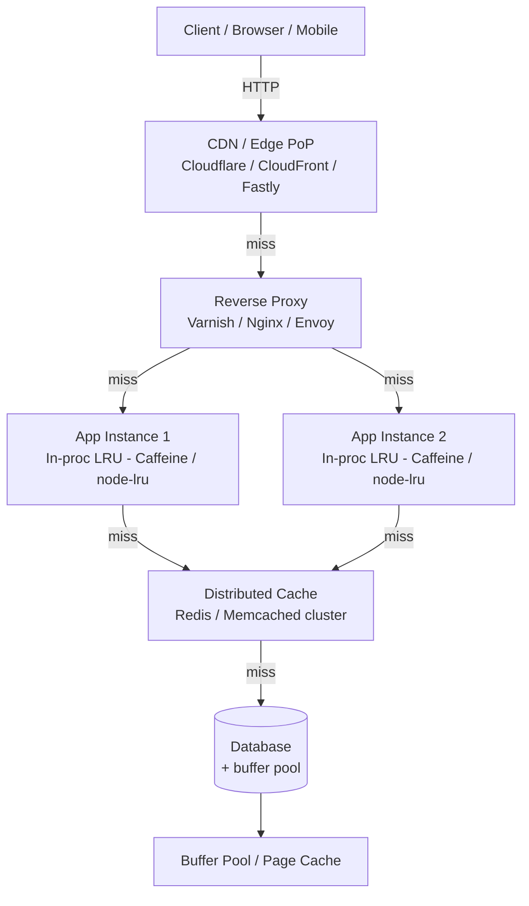

# Caching Layers — Client, CDN, Reverse-Proxy, Application, Distributed

**Date:** 2026-04-24 | **Updated:** 2026-04-24
**Tags:** `system-design` `building-blocks` `caching` `cdn` `redis` `memcached`

## Table of Contents

- [Summary](#summary)
- [Why Cache — and Why It Makes Everything Harder](#why-cache--and-why-it-makes-everything-harder)
- [The Caching Hierarchy](#the-caching-hierarchy)
- [Layer-by-Layer](#layer-by-layer)
  - [Client Cache (Browser, Mobile, SDK)](#client-cache-browser-mobile-sdk)
  - [CDN / Edge Cache](#cdn--edge-cache)
  - [Reverse-Proxy Cache (Varnish, Nginx, Envoy)](#reverse-proxy-cache-varnish-nginx-envoy)
  - [Application / In-Process Cache (Caffeine, Guava, node-lru-cache)](#application--in-process-cache-caffeine-guava-node-lru-cache)
  - [Distributed Cache (Redis, Memcached)](#distributed-cache-redis-memcached)
  - [Database Buffer Pool](#database-buffer-pool)
- [Cache Patterns — Overview](#cache-patterns--overview)
- [Eviction Policies](#eviction-policies)
- [Stampede and Thundering Herd](#stampede-and-thundering-herd)
- [Consistency Hazards](#consistency-hazards)
- [Redis vs Memcached vs In-Process — Decision Table](#redis-vs-memcached-vs-in-process--decision-table)
- [CDN Caching — Directives, Keys, Purge](#cdn-caching--directives-keys-purge)
- [Observability — What to Measure](#observability--what-to-measure)
- [Anti-Patterns](#anti-patterns)
- [Related](#related)
- [References](#references)

## Summary

A real system is not "the database plus a cache in front of it". It is a **stack of caches**: the browser, the CDN edge, a reverse proxy, the application's in-process LRU, a distributed Redis/Memcached cluster, and finally the DB buffer pool. Each layer has its own hit ratio, invalidation story, failure mode, and blast radius. This doc is the Tier 2 overview of the whole hierarchy — what belongs at each layer, why you add it, when you should _not_ add it, and the hazards that hurt most in production (stampedes, stale reads, dual-writes, unbounded key growth). For a deeper tour of cache-aside / write-through / write-back strategy trade-offs, see the Tier 3 doc at [../scalability/read-write-splitting-and-cache-strategies.md](../scalability/read-write-splitting-and-cache-strategies.md).

## Why Cache — and Why It Makes Everything Harder

Every cache exists to buy one of three things:

| Reason | Gain | Typical order-of-magnitude |
|--------|------|----------------------------|
| **Latency reduction** | Serve from RAM / edge instead of disk / origin | 10ms DB query → 0.1ms in-proc; 200ms cross-continent round trip → 5ms edge |
| **Origin offload** | Fewer hits on expensive backends (DB, 3rd-party API, search index) | 10× to 1000× reduction in origin QPS |
| **Cost reduction** | Cheaper cache bytes than origin IO or egress | CDN egress often 1/10th of origin egress; RAM reads trivial vs RDS IOPS |

But caching is one of the genuinely hard problems in computer science, famously alongside naming things and off-by-one errors. A cache introduces:

- **A second source of truth** that can disagree with the first
- **A new failure mode** (cache stampede, hot-key shard, eviction storm, split-brain between cache and DB)
- **Invalidation complexity** — who expires what, when, across how many layers
- **Debugging opacity** — "it's cached somewhere" is the hardest class of bug to reproduce
- **Cost you did not budget for** — Redis memory, CDN requests, cross-AZ traffic

Rule of thumb: do not add a cache until you have a measured latency or load problem, and even then put the cache **as close to the client as correctness allows**. A browser cache hit costs you nothing. A Redis hit still costs a network round trip.

## The Caching Hierarchy



Each arrow is a miss path. A request travels right only when the layer to the left does not have a valid entry. The ideal case is that the request never leaves the browser.

| Layer | Where it lives | Typical hit latency | Typical hit ratio | Invalidation story |
|-------|---------------|--------------------:|------------------:|--------------------|
| Client | End-user device | 0ms | Varies per user | HTTP cache directives, app-level cache keys |
| CDN / Edge | ISP-local PoP | 5–30ms | 80–99% for static, 30–70% for dynamic | `Cache-Control`, surrogate keys, purge API |
| Reverse proxy | Same region as app | 1–5ms | 50–90% for cacheable responses | VCL / Nginx config, surrogate keys |
| In-process | App heap | <0.01ms | 30–70% for hot keys | TTL, explicit `invalidate()`, pub/sub |
| Distributed | Nearby Redis/Memcached | 0.3–2ms | 70–95% for read-heavy data | TTL, `DEL`, event-driven eviction |
| DB buffer pool | DB RAM | 0.05–0.5ms | 90%+ healthy, <50% sick | Managed by the DB |

## Layer-by-Layer

### Client Cache (Browser, Mobile, SDK)

**What it caches:** HTML, JS, CSS, images, fonts, API responses tagged cacheable; app-specific caches (IndexedDB, SQLite on mobile, React Query / SWR in-memory cache).

**Hit ratio shape:** Extremely high for static assets with content-hashed URLs (`app.abc123.js` never changes → cache forever). Low for personalized or rapidly changing data.

**Add it when:**
- You control asset fingerprinting so `Cache-Control: immutable, max-age=31536000` is safe
- You have repeat users (SPAs, mobile apps, logged-in flows)
- Data has a known, long-enough freshness tolerance

**Do NOT add it when:**
- You cannot version the URL and must expire on-demand
- The content is user-private and sent through shared proxies (use `Cache-Control: private`)
- Staleness risk outweighs latency savings (real-time pricing, auth state, balances)

**Key mechanics:** HTTP `Cache-Control`, `ETag`/`If-None-Match` conditional GETs (304 Not Modified), `Vary` headers to cache per `Accept-Encoding` / `Accept-Language`. Service workers for offline-first. Mobile SDKs layer their own on-disk SQLite cache. See [../../networking/application-layer/http-evolution.md](../../networking/application-layer/http-evolution.md) for the HTTP-level details.

### CDN / Edge Cache

**What it caches:** Anything HTTP — static assets, API responses, HTML for anonymous pages, video segments (HLS/DASH), even dynamic content with short TTLs or stale-while-revalidate.

**Hit ratio shape:** 95%+ for versioned static assets; 60–80% for well-designed dynamic caching; drops hard if cache keys include high-cardinality fields (cookies, unsanitized query strings).

**Add it when:**
- Users are globally distributed (RTT savings compound)
- Traffic is read-heavy with repeated requests
- You want DDoS absorption at the edge — CDNs eat volumetric attacks before they reach your origin
- You serve large media and want to stop paying egress at origin

**Do NOT add it when:**
- Every request is unique (per-user dashboards with no cacheable fragment)
- The entire surface is write-heavy with no read amplification
- Caching headers would mislead the CDN into caching private data

**Key mechanics:** PoPs (Points of Presence) near ISPs; tiered caching / origin shielding (edge → mid-tier → origin) reduces origin load; cache keys built from URL + `Vary` headers + custom (cookies, device class); purge APIs (tag-based via "surrogate keys" / "cache tags" is the sane way, URL-by-URL only as a fallback). See [../../networking/infrastructure/cdn-and-edge.md](../../networking/infrastructure/cdn-and-edge.md) for the wire-level story.

### Reverse-Proxy Cache (Varnish, Nginx, Envoy)

**What it caches:** Full HTTP responses at a proxy sitting in front of the app — typically same region as the app fleet, behind the CDN.

**Hit ratio shape:** Depends entirely on what you configure as cacheable. 50–90% achievable for SSR pages, anonymous catalog pages, search result pages with low cardinality.

**Add it when:**
- You need finer control than the CDN exposes (edge-side includes, custom VCL logic)
- You serve uncacheable-by-default responses that you can coerce cacheable with VCL
- You want a caching layer that is still inside your security perimeter (PII concerns at the CDN)

**Do NOT add it when:**
- The CDN already covers the traffic and you're just adding another hop
- Your fleet is small — maintaining Varnish VCL is non-trivial

**Key mechanics:** Varnish's VCL (Varnish Configuration Language) lets you rewrite requests, choose cache keys, apply ESI (Edge Side Includes), ban by tag. Nginx `proxy_cache` with `proxy_cache_key` and `proxy_cache_bypass`. Envoy has the HTTP Cache filter. The reverse proxy also does TLS termination, compression, request routing — caching is often a co-benefit. See [../../networking/infrastructure/reverse-proxies-and-gateways.md](../../networking/infrastructure/reverse-proxies-and-gateways.md).

### Application / In-Process Cache (Caffeine, Guava, node-lru-cache)

**What it caches:** Objects in the app's heap. Decoded DB rows, parsed config, computed values, rendered fragments, JWT-to-user lookups, feature flag evaluations.

**Hit ratio shape:** Very high for small, hot working sets that fit in heap. Plummets if working set > heap or if you have many instances (each instance warms its own cache independently → low fleet-wide hit ratio).

**Add it when:**
- Data is read many times per instance per second (per-request config, per-user session decoded)
- The data is small enough to fit comfortably in heap
- You can tolerate each instance seeing a slightly different snapshot for `ttl` seconds

**Do NOT add it when:**
- The cache would dominate heap and trigger GC pauses (big on JVM; Node similarly degrades)
- You need coordinated invalidation across instances — that's distributed-cache territory
- The data is user-specific and each instance only sees a fraction of users (low hit ratio)

**Key mechanics:**
- **Java: [Caffeine](https://github.com/ben-manes/caffeine)** — near-optimal [W-TinyLFU admission policy](https://github.com/ben-manes/caffeine/wiki/Efficiency) which beats classic LRU on skewed workloads. `AsyncLoadingCache` handles refresh-ahead. `Weigher` for size-bounded caches.
- **Java: Guava** — predecessor to Caffeine, still common; migrate if you hit hit-ratio issues.
- **Node.js: [`lru-cache`](https://www.npmjs.com/package/lru-cache)** (isaacs) — the canonical LRU for Node, supports TTL, size-based eviction, staleness tracking.
- **Spring Boot:** `@Cacheable` with Caffeine backend, zero boilerplate. See [springboot-patterns](../../java/spring-boot/caching-in-spring.md) if you have it.

```java
// Caffeine example — sized, TTL'd, with W-TinyLFU
Cache<String, User> users = Caffeine.newBuilder()
    .maximumSize(10_000)
    .expireAfterWrite(Duration.ofMinutes(5))
    .refreshAfterWrite(Duration.ofMinutes(4)) // refresh-ahead
    .recordStats()
    .build();
```

```typescript
// Node lru-cache — sized, TTL'd, stale-while-revalidate
import { LRUCache } from 'lru-cache'

const cache = new LRUCache<string, User>({
  max: 10_000,
  ttl: 5 * 60_000,
  allowStale: true,      // serve stale on miss while we refresh
  updateAgeOnGet: false, // LRU, not LFU-ish
})
```

### Distributed Cache (Redis, Memcached)

**What it caches:** Shared state across all app instances. Session data (if not stateless), decoded DB aggregates, rate limit counters, computed feed pages, API response envelopes, short-lived tokens.

**Hit ratio shape:** 70–95% for well-designed read paths. Lower if keys are very high cardinality (per-user-per-action) without good reuse.

**Add it when:**
- You have multiple app instances that should see the same cache state
- You want a cache that survives app restarts / rolling deploys
- Your working set is larger than a single instance's heap
- You need cache features the app can't easily provide (atomic counters, pub/sub, sorted sets, TTL)

**Do NOT add it when:**
- The data is hot _per-instance_ and coherence across instances is optional — in-proc wins on latency
- You only have one or two app instances and a tiny dataset
- You can't tolerate the extra failure mode (Redis outage → cache-miss storm to origin)

**Operational reality:** distributed cache outages are the most common cause of "database surprise overload" incidents. Plan for Redis going away. Strategies:
- Short circuit breakers and timeouts on cache calls (never block indefinitely)
- Fall through to origin when cache is unreachable, with concurrency limits on origin
- For critical paths, keep a small in-proc fallback layer

See [../../database/polyglot/redis-beyond-caching.md](../../database/polyglot/redis-beyond-caching.md) for Redis as a data structure server, not just a cache.

### Database Buffer Pool

**What it caches:** Disk pages of tables and indexes in DB RAM. Every mature RDBMS does this (PostgreSQL `shared_buffers`, MySQL InnoDB buffer pool, Oracle SGA).

**Hit ratio shape:** Should be 95%+ in healthy OLTP. Buffer pool hit ratio < 90% generally means undersized RAM or a query pattern that thrashes it (full scans of large tables).

**Why it matters for designers:** The DB buffer pool is a cache you get for free. Many "we need Redis" conversations evaporate when you realize the hot query already hits a warm buffer pool in sub-millisecond time. Add an application cache _because of round-trip or CPU cost_, not because the DB is slow at the page level. See [../../database/engine-internals/storage-and-mvcc.md](../../database/engine-internals/storage-and-mvcc.md) for the internals.

## Cache Patterns — Overview

These are briefly summarized here; the Tier 3 doc [../scalability/read-write-splitting-and-cache-strategies.md](../scalability/read-write-splitting-and-cache-strategies.md) goes deep on trade-offs, failure modes, and when each wins.

| Pattern | Read | Write | Strength | Weakness |
|---------|------|-------|----------|----------|
| **Cache-aside** (lazy loading) | App checks cache → miss → load from DB → populate cache | App writes DB, invalidates cache key | Simple; cache can fail safely | Race between writer and reader can leave stale entry |
| **Read-through** | App asks cache; cache loads from DB on miss | App writes DB directly | Clean API; cache owns loading logic | Couples cache to DB client; harder to test |
| **Write-through** | Read-through | Write goes to cache, cache writes DB synchronously | Cache is never stale on the write path | Write latency = cache + DB |
| **Write-back (write-behind)** | Read-through | Write to cache only; cache flushes to DB async | Huge write-throughput win | Data loss on cache failure; hard to reason about |
| **Write-around** | Cache-aside or read-through | Write directly to DB, bypass cache | Avoids caching write-only data | First read after write is always a miss |
| **Refresh-ahead** | Read-through | Cache preemptively refreshes entries near expiry | Low tail latency | Wasted work on unused entries |

```text
# Cache-aside read path (pseudocode)
def get_user(user_id):
    value = cache.get(f"user:{user_id}")
    if value is not None:
        return value                          # hit
    value = db.query_user(user_id)            # miss: go to origin
    if value is not None:
        cache.set(f"user:{user_id}", value, ttl=300)
    return value

# Cache-aside write path
def update_user(user_id, patch):
    db.update_user(user_id, patch)
    cache.delete(f"user:{user_id}")           # invalidate, don't repopulate
```

Invalidating on write (delete, not set) avoids the classic race where two concurrent writers each populate the cache with their own stale-by-the-other-write value. The next reader takes the miss penalty and sees the fresh DB value.

## Eviction Policies

When the cache is full, something has to go. The choice of eviction policy shapes hit ratio more than people expect.

| Policy | Evicts | Good for | Bad for |
|--------|--------|----------|---------|
| **LRU** (Least Recently Used) | The entry least recently accessed | Workloads with recency locality | One-shot scans (a full-table scan evicts everything hot) |
| **LFU** (Least Frequently Used) | The entry accessed fewest times | Workloads with strong frequency skew | Slow to adapt to shifts in the hot set |
| **FIFO** | Oldest inserted | Simple caches where access pattern is uniform | Almost always worse than LRU |
| **TTL-based** | Entries whose TTL expired | Deterministic freshness | Wastes memory if actual access is shorter than TTL |
| **Random / approximate LRU** | A random sample's oldest | Huge caches where tracking exact LRU is expensive | Slightly lower hit ratio than true LRU |
| **[W-TinyLFU](https://github.com/ben-manes/caffeine/wiki/Efficiency)** (Caffeine) | Admission-controlled LFU with a sliding window | General-purpose; near-optimal on skewed real-world loads | More complex to implement from scratch |

**Redis's `allkeys-lru` and `allkeys-lfu` are approximate** — Redis samples a small number of keys (default 5) and evicts the oldest/least-frequent of the sample. This is intentional: exact LRU over millions of keys would need a doubly-linked list touching every access and is not worth the cost. See [Redis's docs on key eviction](https://redis.io/docs/latest/develop/reference/eviction/).

**Memcached's default is LRU**, with a slab allocator — each slab class has its own LRU. This introduces slab calcification: if your value size distribution shifts, old slabs stay allocated for sizes nobody uses. Memcached 1.5+ added automatic slab rebalancing, but it's still a real gotcha on long-running caches.

**Caffeine's W-TinyLFU** is the current state of the art for in-process caches. It combines a small "window" LRU admission filter with a main LFU to adapt quickly to new hot entries while still capturing long-term frequency skew. On real workloads it typically beats classic LRU by 5–25% hit ratio at the same memory budget.

## Stampede and Thundering Herd

A **cache stampede** (aka dog-pile, thundering herd) is what happens when a popular key expires and N concurrent requests all miss simultaneously, each doing the origin query. The origin can be crushed by what was a single key.

Defenses, in order of increasing sophistication:

1. **Request coalescing / single-flight** — the first miss does the origin call; other concurrent misses for the same key wait on the same in-flight promise. Built into Go's `singleflight`, easy to implement in any language.
2. **Mutex / lease on miss** — first miss acquires a short lock (e.g., `SET key:lock NX EX 5`), does the origin call, populates cache, releases the lock. Others retry the cache after a brief sleep.
3. **Early / probabilistic expiration** — instead of expiring at exactly TTL, compute a probability of "refresh now" that rises as TTL approaches. The [XFetch algorithm](https://www.vldb.org/pvldb/vol8/p886-vattani.pdf) is the canonical reference. Spreads refreshes over time.
4. **Stale-while-revalidate (SWR)** — serve the stale value to the caller while kicking off an async refresh. HTTP has a standard [`stale-while-revalidate`](https://datatracker.ietf.org/doc/html/rfc5861) directive; CDNs implement it; in-process caches like Caffeine's `refreshAfterWrite` do the equivalent.
5. **TTL jitter** — add `±10%` random jitter to every TTL at write time. Prevents the synchronized expiry of a batch of keys all written together at startup.

```python
# Probabilistic early refresh (XFetch-style, simplified)
import random, math, time

def get_with_xfetch(key, compute_fn, beta=1.0):
    entry = cache.get_with_metadata(key)  # returns value, ttl_remaining, compute_time_ms
    if entry is None:
        return compute_and_set(key, compute_fn)
    remaining = entry.ttl_remaining
    # probability of early refresh rises as remaining → 0
    if remaining - entry.compute_time_ms * beta * math.log(random.random()) <= 0:
        return compute_and_set(key, compute_fn)
    return entry.value
```

```bash
# Redis-based single-flight lock
# 1) Try to acquire a short exclusive lock for this key's refresh
SET user:42:lock "$(uuidgen)" NX EX 5
# 2) If you got it, do the origin call, then SET the cached value
# 3) If you didn't, sleep 50ms and re-read the cache
```

Stampede protection is non-optional for any high-QPS cache path. A single unprotected hot key can destabilize an entire service tier.

## Consistency Hazards

Caching trades consistency for performance. You should know exactly which trade you made.

### Stale reads

The cache's value is older than the DB's. Common, usually acceptable if you set bounded-staleness TTLs and your product tolerates it. Not acceptable for balances, auth state, or pricing where a stale value causes a business error.

### The dual-write problem

```text
# BROKEN: two writes, no single source of truth
def update_user(id, patch):
    db.update_user(id, patch)          # write 1
    cache.set(f"user:{id}", new_value)  # write 2
    # If process dies between 1 and 2, cache is stale.
    # If 2 happens before replication catches up, readers see fresh cache
    # but other stale replicas of the DB.
```

Two writes to two systems cannot be atomic without a transactional mechanism spanning them. Mitigations:

- **Invalidate, don't update**: `cache.delete(key)` after DB write. If the delete fails, next reader takes the miss and repopulates from DB. Less catastrophic than an inconsistent `set`.
- **Outbox + CDC**: write to DB with an outbox row in the same transaction; a Change Data Capture consumer (Debezium, Postgres logical replication) reads the outbox and updates or invalidates the cache. The cache becomes a read-only projection.
- **Eventual consistency with tight TTLs**: accept that cache lags DB by ≤ TTL seconds.

### Split-brain between cache and DB

A replica lag + cache-hit combination can show users their own write's _before_ state. Example:

1. User writes a comment → DB primary updated, replicas lagging
2. Cache is invalidated
3. User's next read hits cache miss → reads from a _replica_ → gets pre-write state → populates cache with stale value
4. Every other reader now sees the stale cached version for the whole TTL

Fixes: read-your-writes routing (send the user's post-write reads to the primary for N seconds), or scope the cache entry with a version token the writer controls, or simply delay cache repopulation until after replication is known converged. See [../foundations/cap-and-consistency-models.md](../foundations/cap-and-consistency-models.md) for the consistency vocabulary.

### Cache stampede on TTL expiry

Covered above. A consistency hazard because the burst of origin traffic can cause a _second_ failure (origin slow → more requests pile up → timeouts → retries → ...) that compounds the original.

## Redis vs Memcached vs In-Process — Decision Table

| Dimension | In-process (Caffeine / lru-cache) | Memcached | Redis |
|-----------|-----------------------------------|-----------|-------|
| **Hit latency** | <0.01ms | 0.3–1ms | 0.3–2ms |
| **Shared across instances** | No | Yes | Yes |
| **Data structures** | Whatever your language has | Key → opaque blob only | Strings, hashes, lists, sets, sorted sets, streams, bitmaps, HLL, geo, JSON (module), pub/sub |
| **Persistence** | None (lost on restart) | None by default | RDB snapshots + AOF log |
| **Eviction** | LRU / LFU / W-TinyLFU | LRU per slab class | 8 policies (noeviction, allkeys-lru/lfu, volatile-lru/lfu/ttl/random, allkeys-random) |
| **Multi-threading** | N/A | Yes (internally) | Single-threaded per shard (Redis 6+ uses threads for IO, not commands) |
| **Scaling model** | One per process | Client-side sharding (consistent hashing) | Redis Cluster with hash slots, or client-side sharding, or managed (ElastiCache / MemoryDB) |
| **Failover / replication** | N/A | Not built in | Primary-replica, Sentinel, Cluster |
| **Atomic ops** | Whatever you implement | CAS, incr/decr | Rich: `INCR`, `LPUSH`, `ZADD`, Lua scripts, `MULTI`/`EXEC`, `WATCH` |
| **Value size sweet spot** | Small hot objects | < 1MB values, simple | < 512MB but typically ≪ 1MB; very flexible |
| **Best for** | Per-instance hot path, config, derived data | Pure cache with simple k/v, max speed and simplicity | Cache + data structures + rate limits + pub/sub + locks + queues |
| **When NOT to use** | Shared state, coordinated invalidation | Complex data patterns, persistence, atomic ops beyond CAS | When "just a cache" is all you need and you want operational simplicity |

**Practical defaults for new designs:**

- Start with **in-process LRU** for hot-per-instance data. Zero new infrastructure.
- Add **Redis** when you need shared cache, atomic counters, rate limits, leader election, pub/sub, or locks — you'll use Redis for five other things anyway.
- Choose **Memcached** only if you've specifically benchmarked that Redis isn't giving you enough throughput per core for a pure k/v workload, or you're running inside an ecosystem that already uses it (e.g., the [Facebook Memcache at Scale paper, NSDI 2013](https://www.usenix.org/conference/nsdi13/technical-sessions/presentation/nishtala) is still the canonical reference for pushing Memcached to millions of QPS).

## CDN Caching — Directives, Keys, Purge

CDN caching is the single biggest lever for global read-heavy systems. Get the three things right:

### Cache-Control directives

```text
# Static asset with content-hashed URL — cache forever, never validate
Cache-Control: public, max-age=31536000, immutable

# API response — cacheable for 60s at edge, browsers get fresh every request
Cache-Control: public, max-age=0, s-maxage=60

# Stale-while-revalidate — serve stale for up to 30s while revalidating
Cache-Control: public, max-age=60, stale-while-revalidate=30

# User-private — never let shared caches keep it
Cache-Control: private, max-age=0, no-store

# Do not cache at all, anywhere
Cache-Control: no-store
```

Key distinctions:
- `max-age` = how long any cache (including browser) may serve without revalidation
- `s-maxage` = how long _shared_ caches (CDN, reverse proxy) may serve; overrides `max-age` for them
- `stale-while-revalidate` = may serve stale for this many extra seconds while fetching a fresh copy async
- `stale-if-error` = may serve stale if origin is down (a resilience bonus)
- `no-cache` (common confusion) means "must revalidate before reuse", _not_ "do not cache"
- `no-store` means "do not write to any cache"

See [MDN's Cache-Control reference](https://developer.mozilla.org/en-US/docs/Web/HTTP/Headers/Cache-Control).

### Cache key design

Default CDN cache key is URL + `Vary` headers + a few chosen request attributes. Things that will destroy your hit ratio:

- **Uncontrolled query strings** (`?utm_source=...` → every referrer creates a unique key). Normalize or strip on the CDN.
- **`Vary: Cookie`** with a session cookie — every logged-in user gets their own cache entry. Usually what you want, but don't use it on anonymous pages.
- **`Vary: User-Agent`** — there are ~millions of UA strings. Use a CDN feature to bucket UAs (mobile vs desktop) instead.
- **Casing inconsistencies** in paths (`/API/users` vs `/api/users`) — normalize.

Good pattern: use CDN-specific **cache tags / surrogate keys** so you can purge semantically ("all pages containing product 42") instead of enumerating URLs.

### Purge / invalidation

- **Hard purge**: delete an entry immediately. Use for compliance (DMCA, GDPR deletions) and emergency rollbacks.
- **Soft purge** (supported by Fastly, Cloudflare's newer APIs): mark stale but keep for `stale-while-revalidate`-style serving while the origin refills. Protects the origin from a purge-induced stampede.
- **Tag-based purge**: purge everything tagged `product:42`. Essential at any real scale.
- **Versioned URLs**: the nuclear option. Change the URL and old entries age out naturally. Best for static assets.

### Origin shielding

Configure the CDN so every edge PoP that misses goes through a single "shield" PoP before hitting the origin. The shield consolidates concurrent misses for the same key into one origin request. Without it, a viral page can hit the origin once per PoP (hundreds of requests) instead of once globally.

## Observability — What to Measure

If you cannot see your cache, you cannot tune it. Minimum instrumentation per layer:

| Metric | Why it matters | Alert when |
|--------|----------------|------------|
| **Hit ratio** | The primary knob. Low hit ratio = not buying anything | Drops > 10% from baseline |
| **Miss latency P99** | The user's actual experience on miss. Hit latency is obvious; miss is the tail | Exceeds origin SLO budget |
| **Eviction rate** | Rising evictions mean undersized cache or key explosion | Sudden jumps; eviction-to-insert ratio > 0.5 |
| **Key space cardinality** | Unbounded cardinality → eviction storm → low hit ratio | Grows without bound |
| **Memory usage** | How close to `maxmemory` | > 85% of configured limit |
| **Connection pool saturation** (Redis) | Waits on clients → cascade timeouts | Wait time > 1ms P99 |
| **Origin QPS on miss path** | What load the cache is _actually_ removing | Rising despite stable user traffic (hit ratio regression) |
| **Stampede indicators** | Concurrent origin calls for the same key | In-flight-per-key > 1 consistently |

**Hot key detection:** Redis has `redis-cli --hotkeys` (sampling). Cloudflare and Fastly expose per-key analytics. In-process caches should export per-key hit counts for the top-N keys so you can spot a single key eating most of the memory.

**Cache stampede detection:** alert on (origin_QPS × avg_miss_latency) suddenly exceeding origin capacity, or on repeated lock-acquisition failures in your single-flight layer.

## Anti-Patterns

### Caching writes

"Let me cache the write so we respond to the user fast." Unless you fully own the write-back discipline (durability on cache, replay on crash, backpressure on origin), this loses data. Use write-behind only with a broker-backed queue, not a bare Redis `LPUSH`.

### Caching auth state incorrectly

- Caching a JWT's validity check is fine _if_ you cap the cache TTL ≤ the revocation window your product guarantees.
- Caching _authorization decisions_ (can user X access resource Y) requires invalidation on ACL change, which is easy to forget.
- Never cache an auth decision longer than you cache the underlying identity.

### Unbounded key space

`cache.set(f"search:{query}", results)` for arbitrary user input → every unique query creates a unique key → the hot keys get evicted by the cold tail. Bound the key space:
- Cache only queries that cleared some popularity threshold
- Use a bloom filter / count-min sketch to gate caching to seen-before queries
- Cap max entries and accept cache-miss for unusual queries

### Missing TTL jitter

Batch-loading 100k keys at startup with identical TTL = all 100k expire in the same second 5 minutes later. Jitter: `ttl = base_ttl * (1 + random.uniform(-0.1, 0.1))`.

### Treating the cache as a database

Caches drop data: on eviction, on restart (Memcached), on cluster failover (Redis). If the system cannot function after all cache entries vanish, it is not a cache, it is an unreliable database. Redesign.

### Caching tiny scalars over the network

A Redis round trip costs ~0.5ms. Caching a 4-byte boolean across the network to save a 0.1ms DB hit _loses latency_. Either cache bigger objects or cache in-process.

### Negative-cache oversights

Forgetting to cache "not found" results means every request for a non-existent key hits the origin. Attackers exploit this (enumerate IDs → origin DoS). Cache 404s with a short TTL (`60–120s`), and be careful not to cache them so long that a newly created resource stays invisible.

### Cache as feature flag

Using TTL to roll out features ("set the flag, wait 5 minutes for caches to expire"). Use a proper feature-flag system with push-invalidation. Cache TTLs are a bad coordination primitive.

## Related

- [Load Balancers in System Design — L4 vs L7, Algorithms, and Health](load-balancers.md) — the layer that sits in front of cache-aware services and health-checks them
- [Read/Write Splitting & Cache Strategies — Through, Back, Around, Aside](../scalability/read-write-splitting-and-cache-strategies.md) — Tier 3 deep dive on the patterns summarized above
- [CAP, PACELC, and Consistency Models](../foundations/cap-and-consistency-models.md) — the consistency vocabulary that caching trades against
- [CDN and Edge Networking](../../networking/infrastructure/cdn-and-edge.md) — CDN internals, PoPs, anycast routing
- [Reverse Proxies and Gateways](../../networking/infrastructure/reverse-proxies-and-gateways.md) — Varnish / Nginx / Envoy as caching layers and routers
- [HTTP Evolution](../../networking/application-layer/http-evolution.md) — Cache-Control, ETags, conditional GETs
- [Redis Beyond Caching](../../database/polyglot/redis-beyond-caching.md) — Redis as data structure server, rate limiter, pub/sub, lock manager
- [Database Storage and MVCC](../../database/engine-internals/storage-and-mvcc.md) — the buffer pool layer at the bottom of the hierarchy

## References

- [Redis Documentation — Key eviction](https://redis.io/docs/latest/develop/reference/eviction/) — all eight eviction policies and how approximate LRU/LFU work
- [Redis Documentation — Client-side caching (tracking)](https://redis.io/docs/latest/develop/reference/client-side-caching/) — Redis 6+ invalidation protocol for in-process caches
- [Memcached Wiki — Overview](https://github.com/memcached/memcached/wiki/Overview) and [ProgrammingFAQ](https://github.com/memcached/memcached/wiki/ProgrammingFAQ) — slab allocator, LRU, cache semantics
- [Caffeine Wiki — Efficiency](https://github.com/ben-manes/caffeine/wiki/Efficiency) — W-TinyLFU design and hit-ratio comparisons against LRU/LFU
- [Cloudflare — How CDN works and caching behavior](https://developers.cloudflare.com/cache/concepts/default-cache-behavior/) — cache keys, tiered caching, purge models
- [AWS CloudFront Developer Guide — Caching content based on request](https://docs.aws.amazon.com/AmazonCloudFront/latest/DeveloperGuide/cache-key-understand-cache-behavior.html) — cache key policies, origin shield
- [Nishtala et al., "Scaling Memcache at Facebook" (NSDI 2013)](https://www.usenix.org/conference/nsdi13/technical-sessions/presentation/nishtala) — the canonical large-scale Memcached deployment paper: lease, gutter pool, regional invalidation
- [Varnish Documentation — Users Guide](https://varnish-cache.org/docs/trunk/users-guide/index.html) — VCL, cache invalidation, ESI, common patterns
- [RFC 5861 — HTTP `stale-while-revalidate` and `stale-if-error`](https://datatracker.ietf.org/doc/html/rfc5861) — the standard behind SWR
- [Vattani, Chierichetti, Lowenstein — "Optimal Probabilistic Cache Stampede Prevention" (VLDB 2015)](https://www.vldb.org/pvldb/vol8/p886-vattani.pdf) — the XFetch algorithm
