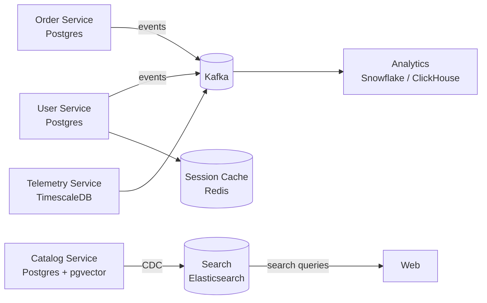
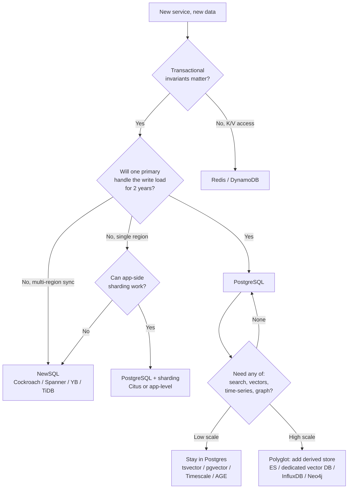

# Databases as a Component — SQL, NoSQL, NewSQL, and Picking One

**Date:** 2026-04-24 | **Updated:** 2026-04-24
**Tags:** `system-design` `building-blocks` `databases` `sql` `nosql` `newsql`

## Table of Contents

- [Summary](#summary)
- [Picking a Database Is a Design Decision, Not a Preference](#picking-a-database-is-a-design-decision-not-a-preference)
- [The Taxonomy](#the-taxonomy)
  - [Relational / Row-Store OLTP](#relational--row-store-oltp)
  - [Document](#document)
  - [Key-Value](#key-value)
  - [Wide-Column](#wide-column)
  - [Graph](#graph)
  - [Time-Series](#time-series)
  - [Search (Deferred)](#search-deferred)
  - [Vector](#vector)
  - [NewSQL](#newsql)
- [The Relational Default](#the-relational-default)
- [When SQL Stops Working](#when-sql-stops-working)
- [NewSQL — What It Promises and What It Costs](#newsql--what-it-promises-and-what-it-costs)
- [Polyglot Persistence](#polyglot-persistence)
- [Decision Framework](#decision-framework)
- [Anti-Patterns](#anti-patterns)
- [Related](#related)
- [References](#references)

## Summary

"Which database do we use?" is one of the cheapest sentences to say and one of the most expensive questions to answer. In a design review, the database choice encodes the system's consistency model, scaling ceiling, operational surface, and, often, its team's next two years of on-call pain. This doc is the picking-one layer: the taxonomy of database families, the default (start with Postgres), the specific symptoms that justify leaving the default, what NewSQL actually buys you, the polyglot-persistence trade, a decision table, and the anti-patterns that fail the loudest. For Postgres internals, query optimization, and indexing, see the `database/` path — this doc deliberately does not duplicate it.

## Picking a Database Is a Design Decision, Not a Preference

Databases are commitments, not libraries. Swapping a caching layer is hours. Swapping a HTTP framework is days. Swapping a primary database is **quarters** — schema migrations, dual writes, CDC pipelines, application rewrites, operator training, and a long tail of features that depended on vendor-specific behavior.

Three properties of a database essentially never change after launch:

- **The consistency model** — once clients depend on strong consistency, you cannot quietly relax it. Once they depend on eventual consistency, you cannot cheaply add transactions.
- **The data model's fit to the domain** — relational JOINs vs document embedding vs graph traversal: the shape of queries follows the shape of storage.
- **The operational story** — who patches it, who backs it up, who does the failover drill. Managed services hide this; self-hosting exposes it.

Pick a database for the product you have two years from now, not the prototype you have today. And pick it with the knowledge that it will probably be wrong in some dimension — plan for the seams that let you escape.

Useful mental model: a database is a **component** in the architecture diagram, with:

- An input SLA (write QPS, payload size, write consistency requirement)
- An output SLA (read QPS, read consistency requirement, p99 latency)
- A failure mode (what happens when the primary dies, a region goes away, a disk fills)
- A cost model (per-GB storage, per-op throughput, read vs write amplification)
- A team cost (who knows this thing well enough to debug at 3am)

Every family below differs on these axes.

## The Taxonomy

```mermaid
graph TB
    DB[Database Families]
    DB --> REL[Relational / OLTP<br/>row-store]
    DB --> DOC[Document]
    DB --> KV[Key-Value]
    DB --> WC[Wide-Column]
    DB --> GR[Graph]
    DB --> TS[Time-Series]
    DB --> SR[Search]
    DB --> VEC[Vector]
    DB --> NSQ[NewSQL]

    REL --> PG[PostgreSQL]
    REL --> MY[MySQL]
    REL --> OR[Oracle / SQL Server]

    DOC --> MG[MongoDB]
    DOC --> CB[Couchbase]
    DOC --> FS[Firestore]

    KV --> RD[Redis]
    KV --> DY[DynamoDB]
    KV --> RK[RocksDB / embedded]

    WC --> CS[Cassandra]
    WC --> SC[ScyllaDB]
    WC --> BT[Bigtable / HBase]

    GR --> N4[Neo4j]
    GR --> AG[Apache AGE / JanusGraph]

    TS --> IX[InfluxDB]
    TS --> TD[TimescaleDB]
    TS --> PR[Prometheus]

    SR --> ES[Elasticsearch / OpenSearch]
    SR --> MS[Meilisearch / Typesense]

    VEC --> PC[pgvector]
    VEC --> PN[Pinecone / Weaviate / Qdrant]

    NSQ --> CR[CockroachDB]
    NSQ --> SP[Google Spanner]
    NSQ --> YB[YugabyteDB]
    NSQ --> TI[TiDB]
```



For each family: data model, typical use case, scaling model, consistency story, examples, and failure modes to watch.

### Relational / Row-Store OLTP

- **Data model**: normalized tables, rows and columns, foreign keys, schemas enforced at write time. SQL as the query language.
- **Typical use case**: transactional systems of record — orders, accounts, inventory, anything where "the invariant must hold" matters more than raw throughput. The 99% case for new backend services.
- **Scaling model**: vertical scaling first (bigger box, NVMe, more RAM for buffer pool). Read replicas for read scaling. Sharding is possible but painful and usually a sign you should have considered NewSQL.
- **Consistency**: single-node ACID, serializable or snapshot isolation available. Read replicas introduce replication lag (see [replication patterns](../scalability/replication-patterns.md)).
- **Exemplars**: PostgreSQL, MySQL, Microsoft SQL Server, Oracle.
- **Failure modes**:
  - Primary failover is not automatic without additional tooling (Patroni, RDS, Aurora, orchestrator).
  - Long-running transactions cause bloat (MVCC) and lock escalation. A careless `SELECT ... FOR UPDATE` in a 30s transaction will kill your tail latency.

### Document

- **Data model**: self-contained JSON/BSON documents in collections. Nested structure, array fields, schema-flexible (though schemas are usually de-facto enforced in application code or validators).
- **Typical use case**: entity-per-document domains where the aggregate is the read unit — product catalogs, user profiles, content items, CMS-like payloads. Good when reads are "fetch the whole thing" and bad when you need cross-document JOINs.
- **Scaling model**: horizontal by shard key, built-in (MongoDB shards, Couchbase buckets). Good write throughput per shard.
- **Consistency**: MongoDB supports multi-document ACID since 4.0, but the performance and locking profile differs from Postgres. Default read concern is eventual on secondaries.
- **Exemplars**: MongoDB, Couchbase, Firestore, DocumentDB (AWS, Mongo-compatible-ish).
- **Failure modes**:
  - Schema drift: documents written months apart diverge; application code accumulates `if "v2" in doc` branches.
  - Picking a bad shard key locks you in — resharding is expensive.
  - Teams reach for document DBs to "skip schema work" and reinvent relational modeling badly.

### Key-Value

- **Data model**: opaque value under an opaque key. Optionally structured (Redis hash, list, set, sorted set).
- **Typical use case**: caches, session stores, rate-limit counters, feature flags, ephemeral leaderboards, token blocklists. Anything addressable by a single key where the access pattern is `get(key)` or `set(key, v)`.
- **Scaling model**: consistent hashing across shards (Redis Cluster, DynamoDB partitions). Near-linear horizontal scaling for point reads/writes.
- **Consistency**: DynamoDB offers tunable (eventual or strongly consistent reads). Redis is single-primary per shard with async replication — data loss on failover is possible.
- **Exemplars**: Redis, DynamoDB, RocksDB (embedded), Memcached.
- **Failure modes**:
  - Treating a KV store like a database (secondary indexes implemented in application code, scans instead of lookups).
  - Hot keys: one popular key saturates one shard regardless of total capacity.
  - Redis persistence (RDB/AOF) is not a replacement for a real database — it is a cache that happens to survive restarts.

### Wide-Column

- **Data model**: `(partition_key, clustering_key) -> columns`. Rows within a partition are sorted by clustering key. Often described as "a sparse sorted map."
- **Typical use case**: massive write throughput, time-ordered data at scale, event logs, IoT telemetry, messaging inboxes, feature stores.
- **Scaling model**: horizontal, peer-to-peer gossip (Cassandra/Scylla) or Google-style Bigtable with tablet servers. Writes are cheap (LSM trees).
- **Consistency**: tunable quorum (see Cassandra CL and Dynamo-style NWR — covered in [quorum and tunable consistency](../data-consistency/quorum-and-tunable-consistency.md)).
- **Exemplars**: Apache Cassandra, ScyllaDB (C++ rewrite of Cassandra), Google Bigtable, HBase.
- **Failure modes**:
  - Query-first modeling is mandatory: you design the table around the queries you will run, because you cannot JOIN and you cannot add secondary indexes freely without pain.
  - Tombstones from deletes can silently destroy read performance.
  - Operators underestimate the expertise cost — Cassandra is powerful and unforgiving.

### Graph

- **Data model**: nodes and edges, both with properties. Queries express traversals: "friends-of-friends who liked X."
- **Typical use case**: relationships are the domain — social graphs, knowledge graphs, fraud detection, recommendation rails, permission/IAM graphs, supply chain dependencies.
- **Scaling model**: hard. Graph data does not shard cleanly because traversals cross shard boundaries. Most graph DBs scale vertically; distributed graph DBs exist (JanusGraph, Neptune) but are operationally complex.
- **Consistency**: Neo4j provides ACID; distributed graph DBs vary.
- **Exemplars**: Neo4j, Amazon Neptune, JanusGraph, Apache AGE (graph on Postgres).
- **Failure modes**:
  - "We have a graph" is often wrong — many JOIN-heavy relational schemas are misdiagnosed as graph problems.
  - Cypher/Gremlin expertise is scarce; query performance can be counterintuitive.

### Time-Series

- **Data model**: append-heavy, timestamp-indexed series of measurements with tags/labels. Usually compressed and downsampled.
- **Typical use case**: metrics, observability, financial ticks, IoT sensor streams, anywhere the dominant query is "show me values in this time range for these tags."
- **Scaling model**: horizontal sharding by time window and/or series key. Aggressive compression (Gorilla, delta-delta encoding).
- **Consistency**: usually eventual or last-write-wins per series; not a system of record.
- **Exemplars**: InfluxDB, TimescaleDB (Postgres extension), Prometheus (operational metrics, not long-term store), QuestDB, Apache IoTDB.
- **Failure modes**:
  - Using a general-purpose relational DB for high-cardinality time-series past ~1B rows without TimescaleDB or partitioning — write amplification and index bloat crush you.
  - Prometheus as long-term storage — it is not designed for that; pair with a remote-write store (Mimir, VictoriaMetrics, Thanos).

### Search (Deferred)

Full-text search — inverted indexes, relevance scoring, faceting, typo tolerance — belongs in its own doc. See `search-systems.md` in this same Tier 2 directory (planned). Elasticsearch/OpenSearch and Meilisearch/Typesense are the usual exemplars. Quick rules:

- Search indexes are a **derived view**, not a system of record. Source of truth stays in your primary DB; data flows to search via CDC or an indexing pipeline.
- Postgres full-text (`tsvector` + GIN) is often good enough up to a surprisingly high scale; reach for Elasticsearch when relevance tuning, faceting, or cross-type search becomes the dominant workload.

### Vector

- **Data model**: high-dimensional float vectors with nearest-neighbor search (ANN, usually HNSW or IVF).
- **Typical use case**: semantic search, RAG, recommendations, embeddings-based deduplication.
- **Scaling model**: varies — some shard by vector, some replicate the whole index.
- **Exemplars**: `pgvector` (Postgres extension), Pinecone, Weaviate, Qdrant, Milvus. Elasticsearch and OpenSearch added ANN as well.
- **Failure mode**: a dedicated vector DB is rarely needed at small scale — `pgvector` handles millions of vectors fine. Introducing a second system for embeddings is a real operational tax; only do it when recall/latency at your scale actually demands it.

### NewSQL

- **Data model**: SQL surface, ACID transactions, relational schemas — but horizontally scalable from the ground up.
- **Typical use case**: global OLTP where you genuinely outgrew a single-primary Postgres/MySQL, need multi-region writes, or need transactional consistency across many shards.
- **Scaling model**: automatic range-based sharding, Raft/Paxos per range, rebalancing.
- **Exemplars**: Google Spanner, CockroachDB, YugabyteDB, TiDB.

NewSQL gets its own section below because the promise is specific and the cost is specific.

## The Relational Default

For almost every new backend service, **start with PostgreSQL** (or MySQL — both are fine; Postgres has a richer feature set for complex workloads). The reasons are not nostalgic:

- **Relational modeling is a powerful design tool.** Constraints, foreign keys, and schemas catch whole classes of bugs at write time that would otherwise become runtime surprises.
- **Postgres does many jobs acceptably.** Document storage (`JSONB` with GIN indexes), full-text search (`tsvector`), time-series (TimescaleDB extension), geospatial (PostGIS), queueing (SKIP LOCKED), vector search (`pgvector`). One operational surface, one backup/restore story, one transaction log.
- **The ecosystem is deep.** Every ORM, every migration tool, every observability stack, every cloud provider's managed offering supports it.
- **It scales further than people think.** Modern Postgres on decent hardware with good indexes routinely does tens of thousands of TPS. Read replicas buy you more. Partitioning buys more still.
- **The failure modes are well-documented.** After 30+ years of production use, whatever you hit, someone else hit first and wrote a blog post.

```sql
-- Postgres doing document-store work acceptably well
CREATE TABLE events (
  id BIGSERIAL PRIMARY KEY,
  occurred_at TIMESTAMPTZ NOT NULL,
  payload JSONB NOT NULL
);

CREATE INDEX idx_events_payload ON events USING GIN (payload jsonb_path_ops);
CREATE INDEX idx_events_occurred_at ON events (occurred_at DESC);

-- Queryable, indexable, transactional. Good enough up to a real scale threshold.
SELECT * FROM events
WHERE payload @> '{"type": "login"}'
  AND occurred_at > NOW() - INTERVAL '1 hour';
```

The rule: **leave the relational default only when pushed out**, not when attracted by novelty. The next section is about knowing when you have been pushed out.

## When SQL Stops Working

Specific symptoms — not vibes — that justify reaching for something other than a single-primary relational DB:

1. **Sustained write throughput beyond a single primary.** You are running Postgres on the biggest box your provider offers, the WAL is saturating, and sharding is the only remaining lever. At this point you are either sharding application-side (painful, but sometimes correct) or looking at NewSQL or wide-column.

2. **Single-table sizes past ~1–10 TB with point-in-time writes.** Partitioning helps; at some point vacuum, index maintenance, and replication lag become the operational story. Time-series DBs and wide-column stores are designed for this shape.

3. **Truly schema-less payloads from untrusted or evolving sources.** External webhooks from dozens of partners, each with their own schema drift. You can do this in Postgres JSONB, but if the dominant access pattern is "store it and later search it loosely," document DBs are a cleaner fit.

4. **Graph traversals as the dominant query pattern.** Recursive CTEs are fine for shallow traversals; by the time you are writing 10-hop friend-of-friend queries over millions of edges, a graph DB is measurably better.

5. **Multi-region strong consistency.** A single-primary Postgres cannot give you strongly-consistent writes from multiple regions with low latency. This is Spanner/Cockroach territory.

6. **Extreme write fan-out with eventual-consistency tolerance.** IoT sensor data, messaging inboxes, feature stores at internet scale — Cassandra/Scylla/Bigtable exist for this.

7. **Cardinality explosion in time-series.** Millions of unique series, billions of points, range-dominant reads. Dedicated TSDBs win on compression and query shape.

None of these triggers fire because of expected growth in year one. If you are choosing a non-relational primary for a new service based on year-three projections, you are probably planning for a different product than the one you will ship.

## NewSQL — What It Promises and What It Costs

NewSQL systems — **CockroachDB**, **Google Spanner**, **YugabyteDB**, **TiDB** — promise the SQL and ACID you are used to, with the horizontal scalability you got from NoSQL.

**What they promise:**

- Familiar SQL (Postgres or MySQL wire protocol in most cases)
- ACID transactions across rows, tables, and even across what would have been shards in a classic system
- Linear horizontal scaling by adding nodes
- Multi-region deployment with strong consistency (via Raft or Paxos on every range)
- Automatic rebalancing and failover

**What they cost:**

- **Latency floor.** Distributed consensus means every write is at least one RTT across your quorum. A cross-region cluster adds tens to hundreds of ms to every write. Compare to single-node Postgres at sub-millisecond writes.
- **Operational complexity, even managed.** Range splits, hot ranges, zone configs, replication factors, backup/restore at scale — the knobs are real, the documentation is dense, and the expert pool is small.
- **Feature gaps.** Postgres extensions (PostGIS, pgvector, TimescaleDB) do not all work. Certain query patterns that are free on single-node Postgres are expensive in a distributed planner.
- **Cost.** Spanner and Cockroach Dedicated/Enterprise are not cheap. At small scale you are paying for capability you do not need.

**When NewSQL is genuinely the right call:**

- You already hit the SQL-stops-working symptoms above specifically for write throughput or multi-region consistency, and the business needs relational semantics.
- You are building a platform that will have multi-region users from day one, with regulatory data-residency requirements, and you need strong consistency across regions.
- You have the operational maturity (or a managed offering) to absorb the complexity.

**When it is probably the wrong call:**

- "We might scale someday." Postgres with a thoughtful schema and good indexes will take you further than you think.
- "We want SQL but scalable." Fine, but the latency floor will bite earlier than expected in an app that was written against single-digit-ms writes.

```text
Single-node Postgres:      ~0.5–2ms writes, limited by one box
NewSQL, single region:     ~2–10ms writes, scales by adding nodes
NewSQL, multi-region sync: ~50–300ms writes depending on topology
```

For a deeper look at Spanner's design — TrueTime, external consistency, and the actual paper — see the references.

## Polyglot Persistence

**Polyglot persistence** means using different databases for different bounded contexts in the same system. The argument is that no single database is best at everything, so let each subsystem use the right tool.



This is often correct. It is also expensive. Every additional database is:

- Another backup and restore story
- Another failover drill
- Another auth and networking surface
- Another set of client libraries, connection-pool settings, and ORM quirks
- Another page on the on-call rotation
- Another thing nobody on the team is the expert at

The right posture:

- **One DB per bounded context is an aspiration, not a mandate.** If a context does not have a strong reason to leave the default, do not.
- **Prefer extensions over new systems when close.** `pgvector` over Pinecone when your scale allows. JSONB over MongoDB when your schema stability permits. Postgres full-text over Elasticsearch until relevance tuning becomes the dominant workload.
- **Derived views are cheap to add later.** CDC → search/OLAP/cache is a well-trodden path. Start with the source-of-truth DB right; add derived stores as usage shapes emerge.
- **Operational capacity is a first-class constraint.** A three-engineer team should not run four database systems.

See [sharding strategies](../scalability/sharding-strategies.md) and [change data capture](../data-consistency/change-data-capture.md) for how data flows between stores.

## Decision Framework

| If you need | Consider | But watch out for |
|---|---|---|
| Transactional system of record with relational invariants | PostgreSQL, MySQL | Eventually hitting single-primary write limits; plan for partitioning |
| Cache, session store, rate limit counter, simple queue | Redis | Treating it as a database; hot keys; persistence ≠ durability |
| Massive write fan-out, time-ordered events, eventual consistency OK | Cassandra, ScyllaDB, Bigtable | Query-first modeling mandatory; operator expertise cost |
| Document-shaped entities with flexible schema | Postgres JSONB first, then MongoDB / Couchbase | Schema drift; bad shard keys; reinventing relational modeling |
| Relationships as the domain (social, fraud, knowledge graph) | Neo4j, Amazon Neptune | Specialist skills; distributed graph is hard; check if it is really a graph problem |
| Time-series metrics / telemetry | TimescaleDB (in-Postgres) or InfluxDB, Prometheus (short term) | Prometheus is not long-term storage; cardinality explosions |
| Full-text / faceted search | Postgres `tsvector` first, then Elasticsearch / OpenSearch | Search index is a derived view, not a source of truth |
| Semantic / embedding search | `pgvector` first, then Pinecone / Weaviate / Qdrant | Extra DB is operational tax you may not need yet |
| Horizontally scalable SQL with multi-region writes | CockroachDB, Spanner, YugabyteDB, TiDB | Latency floor; feature gaps; cost at small scale |
| Analytics / OLAP over large event volumes | Snowflake, BigQuery, ClickHouse, DuckDB | Not an OLTP replacement; ETL/CDC pipeline to feed it |
| S3-like blob storage (files, images, backups) | S3 / R2 / GCS + metadata in Postgres | Do not store blobs in OLTP; use presigned URLs |

### A simple decision tree



## Anti-Patterns

### MongoDB-as-Postgres

Picking MongoDB for a transactional relational domain (orders, payments, inventory) because "it's faster" or "we don't want to do migrations." You end up re-implementing foreign keys in application code, paying for multi-document transactions anyway, and eventually migrating to Postgres. The schema was always there — MongoDB just hid it from the database and put it in `if` statements.

### Postgres JSONB as an unacknowledged document store

Using JSONB for everything because "schemas are rigid." JSONB is a tool; using it for your entire domain gives you the worst of both worlds: relational operational overhead without relational constraint enforcement. Symptoms: `WHERE (payload->>'status') = 'active'` everywhere, no FKs, application-side validation scattered through the codebase. If you are doing this, either commit to a real document DB or promote the fields to columns.

### Time-series in vanilla Postgres past ~1B rows

Postgres is great for time-series up to a point. Past that, without partitioning or TimescaleDB, you hit vacuum pain, index bloat, and slow range scans that partitioning would have made fast. The fix is cheap if you anticipate it (declarative partitioning or Timescale hypertables); expensive if you discover it at 2 AM.

### "Microservices means a DB per service" as dogma

Bounded contexts are the unit that justifies its own database, not services. Two services in the same bounded context can share a database; cross-context queries should go through APIs or events, not joins. Splitting the DB the moment you split the service multiplies your operational surface without providing corresponding isolation — you end up with distributed transactions between services that should have shared a schema.

### Reaching for NewSQL at small scale

Running CockroachDB or Spanner for a product with 50 req/s and no multi-region requirement is paying a latency and operational tax for capability you do not use. Postgres (or MySQL) will be faster, simpler, and cheaper until you actually hit the walls NewSQL is designed to solve.

### Elasticsearch as a source of truth

Elasticsearch is a search index, not a system of record. It loses data, it is eventually consistent, and its durability story is weaker than a real OLTP DB. Source of truth in Postgres; push to Elasticsearch via CDC. When Elasticsearch dies, you rebuild from the source.

### Redis as a durable database

Redis persistence (RDB snapshots, AOF) is not a durability guarantee equivalent to an ACID database. Failovers can lose recent writes; replicas are async. Treat Redis as a fast, rebuildable cache/work-queue; if data cannot be lost, it lives somewhere else and Redis is a view onto it.

### Caching as a substitute for a better database

When the primary database cannot keep up, the reflex is to add a cache. Sometimes that is right. Often it hides the real problem: bad indexes, bad queries, bad schema, or a genuine wrong-database-family fit. Fix the DB first; add caching for legitimate hot-read amplification, not as life support. See [caching layers](caching-layers.md).

## Related

- [Database learning path index](../../database/INDEX.md) — for Postgres internals, query planning, indexing, MVCC, vacuum, partitioning, and polyglot persistence deep dives. This doc is the "pick one" layer; that path is the "make it work well" layer.
- [CAP, PACELC, and Consistency Models](../foundations/cap-and-consistency-models.md) — the consistency vocabulary that every database family inherits or diverges from.
- [Back-of-Envelope Estimation](../foundations/back-of-envelope-estimation.md) — numbers to sanity-check a database choice against actual traffic.
- [Caching Layers](caching-layers.md) — the layer in front of the database; often the difference between a happy Postgres and a sharded one.
- [Load Balancers](load-balancers.md) — sits in front of read replicas and connection-pool layers.
- [Sharding Strategies](../scalability/sharding-strategies.md) — what you do when a single primary is no longer enough.
- [Replication Patterns](../scalability/replication-patterns.md) — primary-replica, multi-primary, quorum; the mechanics behind availability and lag.
- [Quorum and Tunable Consistency](../data-consistency/quorum-and-tunable-consistency.md) — NWR math for Dynamo-style and Cassandra-style systems.
- [Change Data Capture](../data-consistency/change-data-capture.md) — how the source-of-truth DB feeds derived stores in a polyglot architecture.
- [OLTP vs OLAP and Lakehouses](../data-consistency/oltp-vs-olap-and-lakehouses.md) — the analytics side, explicitly out of scope here.

## References

- Kleppmann, Martin. *Designing Data-Intensive Applications.* O'Reilly, 2017. The canonical systems-level treatment of storage engines, replication, partitioning, transactions, and consistency. Chapters 2 (data models), 5 (replication), 6 (partitioning), and 7 (transactions) are directly relevant.
- AWS — [Choosing the right AWS database service](https://aws.amazon.com/products/databases/) and the purpose-built databases guidance: when to pick RDS / Aurora / DynamoDB / DocumentDB / Neptune / Timestream / Keyspaces / MemoryDB.
- Google Cloud — [Choose the right database for your workload](https://cloud.google.com/products/databases) and the Cloud SQL vs Spanner vs Bigtable vs Firestore decision documentation.
- DeCandia, G. et al. *"Dynamo: Amazon's Highly Available Key-value Store."* SOSP 2007. The origin of tunable-consistency, quorum-based NoSQL design. [Paper PDF](https://www.allthingsdistributed.com/files/amazon-dynamo-sosp2007.pdf).
- Corbett, J. et al. *"Spanner: Google's Globally-Distributed Database."* OSDI 2012. TrueTime, external consistency, and the foundation of the NewSQL generation. [Paper PDF](https://research.google/pubs/spanner-googles-globally-distributed-database-2/).
- CockroachDB — [Architecture Overview](https://www.cockroachlabs.com/docs/stable/architecture/overview) and the architecture deep-dive series (SQL layer, transaction layer, distribution layer, replication layer, storage layer).
- MongoDB — [MongoDB Architecture Guide](https://www.mongodb.com/resources/products/fundamentals/mongodb-architecture-guide) and the sharded cluster documentation.
- Apache Cassandra — [Architecture documentation](https://cassandra.apache.org/doc/latest/cassandra/architecture/) covering gossip, snitches, replication, and tunable consistency.
- Stonebraker, M. and Cattell, R. *"10 Rules for Scalable Performance in 'Simple Operation' Datastores."* Communications of the ACM, 2011. A pragmatic counterweight to NoSQL enthusiasm from one of the field's most opinionated voices.
