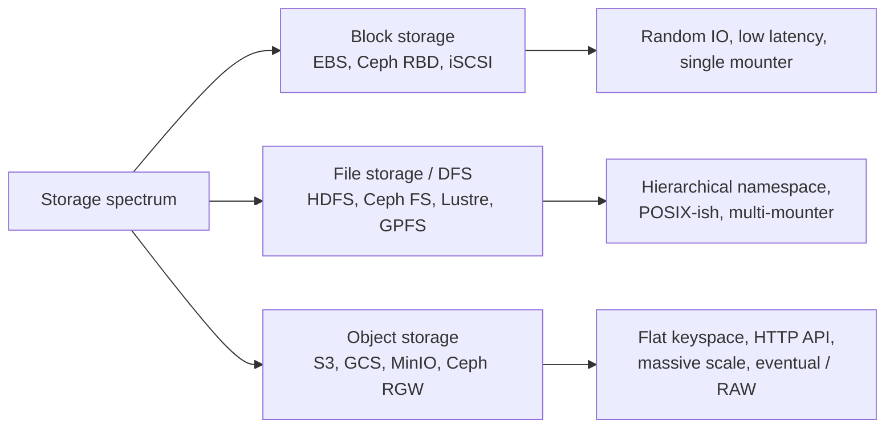
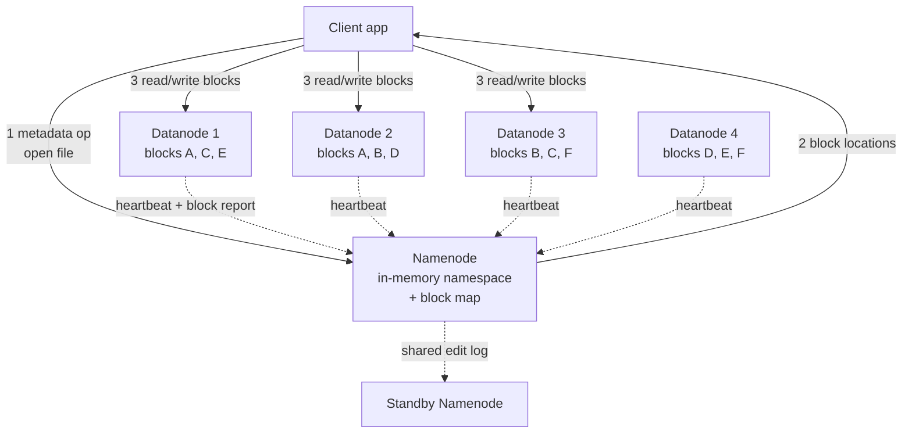
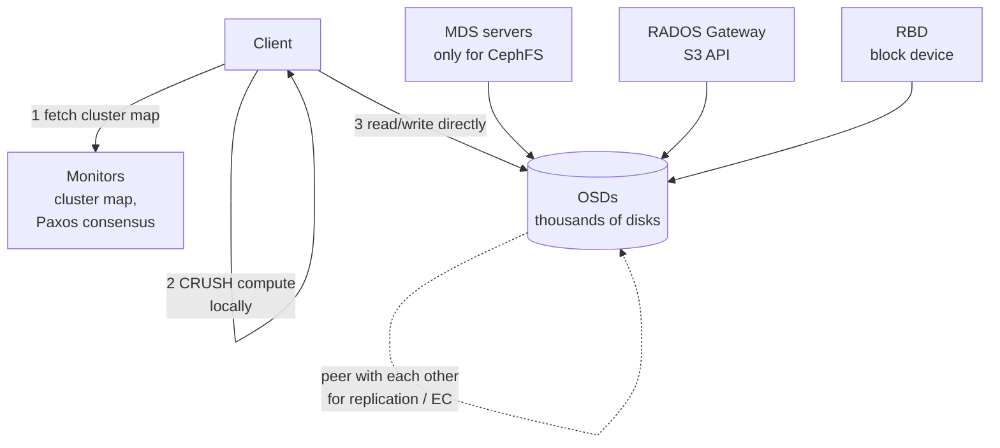
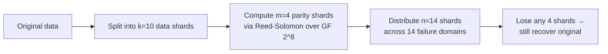
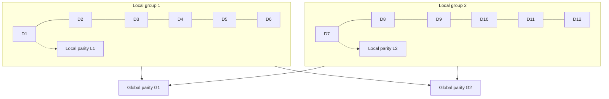

# Distributed File Systems & Erasure Coding

**Date:** 2026-04-26 | **Updated:** 2026-04-26
**Tags:** `system-design` `storage` `distributed-fs` `erasure-coding` `hdfs` `ceph`

## Table of Contents

- [Summary](#summary)
- [Why This Matters](#why-this-matters)
- [Overview — The DFS Spectrum](#overview--the-dfs-spectrum)
- [Key Concepts](#key-concepts)
  - [HDFS Architecture — Namenode and Datanodes](#hdfs-architecture--namenode-and-datanodes)
  - [GFS Lineage — The 2003 Paper That Started It](#gfs-lineage--the-2003-paper-that-started-it)
  - [Ceph and CRUSH Placement](#ceph-and-crush-placement)
  - [MinIO and S3-Compatible Erasure Mode](#minio-and-s3-compatible-erasure-mode)
  - [Reed-Solomon Math — The MDS Property](#reed-solomon-math--the-mds-property)
  - [Local Reconstruction Codes — Cutting Repair Bandwidth](#local-reconstruction-codes--cutting-repair-bandwidth)
  - [POSIX Semantics In a Distributed Filesystem](#posix-semantics-in-a-distributed-filesystem)
- [Trade-offs](#trade-offs)
  - [Replication vs Erasure Coding — Cost and Recovery](#replication-vs-erasure-coding--cost-and-recovery)
  - [DFS vs Object Storage — When To Use Which](#dfs-vs-object-storage--when-to-use-which)
  - [HDFS vs Ceph vs MinIO vs Lustre](#hdfs-vs-ceph-vs-minio-vs-lustre)
- [Code Example — Reed-Solomon (4+2) Encode and Decode](#code-example--reed-solomon-42-encode-and-decode)
- [Real-World Uses](#real-world-uses)
- [Anti-Patterns](#anti-patterns)
- [Related](#related)
- [References](#references)

## Summary

A **distributed file system** (DFS) presents many machines' disks as one filesystem, usually with a hierarchical namespace and POSIX-ish semantics, and absorbs disk and node failures via either **replication** (copy each block N times) or **erasure coding** (split data into k chunks, compute n−k parity chunks, survive any n−k losses). HDFS, Google's GFS, Ceph, MinIO, and Lustre are the canonical implementations and they pick very different points on the consistency / latency / storage-overhead curve. **Reed-Solomon** RS(k, m) — for example RS(10, 4) — is the workhorse code: 1.4× storage instead of 3× replication, surviving 4 simultaneous failures, but costing far more CPU and far more **repair bandwidth** when a single shard is lost. **Local Reconstruction Codes (LRC)** add intra-group parity to fix the repair-cost problem at modest extra storage. The right choice depends on whether the workload is **HPC analytics scratch** (Lustre, HDFS), **mixed object + block** (Ceph), or **S3-compatible application object storage** (MinIO).

## Why This Matters

In a design review someone will say "let's just use HDFS for the data lake" or "MinIO is S3-compatible so we'll drop it in." Both sentences hide an enormous amount of trade-off space:

- HDFS has a **single-namenode metadata bottleneck** that breaks at billions of small files; that alone disqualifies it for a lot of modern workloads.
- "Erasure coded" sounds free until the first disk fails and you saturate a rack switch reading 10 shards from 10 different machines to rebuild one.
- "POSIX-compliant" in marketing copy almost never means strict POSIX semantics — concurrent appends, mtime, fsync, and rename atomicity are where vendors quietly diverge.
- Cost models are dominated by the storage-overhead multiplier (3× for replication, ~1.2–1.5× for typical EC) but operations are dominated by **repair bandwidth** and metadata throughput.

If you can speak about k-of-n MDS codes, repair degree, namenode federation, and CRUSH maps in concrete terms you'll be operating well above the "we'll just put it on S3" tier.

## Overview — The DFS Spectrum

Distributed storage divides cleanly along three axes that drive most architectural decisions:



The three axes:

| Axis | What it controls | Typical answers |
|------|------------------|-----------------|
| **Namespace** | Hierarchical (paths) vs flat (keys) | DFS: hierarchical, POSIX-ish. Object: flat, HTTP. |
| **Durability** | How copies of bytes are kept | Replication (3×, 2×) or erasure coding (k+m). |
| **Consistency** | What clients see across nodes | Strong on metadata (HDFS, CephFS), eventual on object data (legacy S3), close-to-open (NFS), per-object linearizable (modern S3). |

Distributed file systems sit in the middle column. They give you `open`, `read`, `write`, `mkdir`, `rename` semantics that look like a Unix filesystem, but storage is spread across many machines, and they all confront the same three problems:

1. Where does each byte live? (placement / metadata)
2. How do we survive failures without losing bytes? (replication or EC)
3. What semantics do clients see during failures and concurrent access? (consistency model)

The rest of this doc walks through the canonical answers — HDFS, GFS, Ceph, MinIO, Lustre — and the math behind erasure coding that makes the modern answers cheap.

## Key Concepts

### HDFS Architecture — Namenode and Datanodes

HDFS, the Hadoop Distributed File System, is a near-direct implementation of Google's 2003 GFS paper. The architecture is brutally simple:



Key properties:

- **One active namenode** owns the entire filesystem namespace and the block-to-datanode map, all in RAM. This is the brilliant simplification and the famous limitation.
- **Datanodes** store opaque, fixed-size blocks (default 128 MB; commonly tuned to 256 MB). They report their block inventory to the namenode periodically.
- **Block-level replication, not file-level.** Each block is replicated independently — default 3×, configurable per file. The first replica goes to a node in the writer's rack, the second to a different rack, the third to another node in the second rack — the classic rack-aware policy that survives a full rack loss.
- **Append-mostly.** HDFS is optimized for write-once-read-many: single-writer-per-file, no random in-place updates, append since 0.20.205. This is what lets metadata stay simple.
- **High Availability** via a Standby Namenode kept in sync through a shared edit log on a quorum of JournalNodes. Failover is automatic via ZooKeeper; takes seconds, not milliseconds.
- **Erasure coding** was added in HDFS 3.0 (HDFS-7285, released 2017) as a per-policy alternative to 3× replication, typically RS(6,3) or RS(10,4). EC files trade higher CPU and higher recovery cost for lower storage overhead.

The pain points are well-known. The single-namenode RAM ceiling is roughly **300–500 million files per namenode** in a healthy cluster (each file/block consumes a few hundred bytes of namespace memory). **Federation** (HDFS-1052) lets you mount multiple independent namenodes under one client view but does not give you a single global namespace with shared metadata. Small-file workloads remain the canonical anti-use-case.

See [Object and Blob Storage](./object-and-blob-storage.md) for the contrasting architecture where there is no central metadata service at all.

### GFS Lineage — The 2003 Paper That Started It

The 2003 SOSP paper [_The Google File System_](https://research.google/pubs/the-google-file-system/) by Ghemawat, Gobioff, and Leung is the direct ancestor of HDFS, and many of its assumptions still leak into modern systems:

- **Failures are common, not exceptional.** Designed for thousands of cheap disks where something is always broken.
- **Files are huge, mostly multi-GB; mostly appended, rarely random-written.**
- **Workloads are streaming reads and large appends**, not transactional small writes.
- **Single master plus chunkservers**, where the master holds metadata in RAM and chunkservers hold 64 MB chunks.
- **Atomic record-append** — a single primitive that lets many clients concurrently append to one file without coordination, returning the offset where each record landed.

GFS was retired internally at Google in favor of **Colossus** (the next-generation system, ~2010), which fixed the single-master limit by sharding metadata across thousands of servers and was the first widely-deployed system to use Reed-Solomon erasure coding at scale. HDFS inherited the original GFS architecture more or less unchanged and is now, in 2025, where Colossus was 15 years ago.

### Ceph and CRUSH Placement

Ceph (Sage Weil's 2006 thesis at UC Santa Cruz, [paper](https://www.ssrc.ucsc.edu/papers/weil-osdi06.pdf)) takes a fundamentally different approach: **no central metadata service for object placement**. Instead it uses an algorithm called **CRUSH** (Controlled Replication Under Scalable Hashing) that lets any client compute, locally, exactly which OSDs store any given object.



The four-layer architecture:

- **RADOS** (Reliable Autonomic Distributed Object Store) is the bottom layer — a flat namespace of opaque objects across all disks.
- **OSDs** (Object Storage Daemons) are one daemon per disk; they hold objects, gossip with each other, run replication or EC, and execute scrubs.
- **Monitors** maintain the cluster map (which OSDs exist, are up, are in) via Paxos. Clients fetch this map and then route by themselves.
- **CRUSH** is a deterministic, pseudo-random placement function: given the cluster map, an object name, and a placement rule, every client computes the same OSD set. No metadata lookup per IO. Add a disk and only the small fraction of objects that should now live there move.

On top of RADOS, Ceph offers three interfaces:

- **RBD** — virtual block devices for VMs (used heavily by OpenStack).
- **CephFS** — POSIX filesystem, with metadata managed by separate MDS servers (the only stateful, somewhat-centralized component, and it can scale via dynamic subtree partitioning).
- **RGW** — RADOS Gateway, which speaks the S3 and Swift HTTP APIs.

Ceph supports both replication (default 3×) and erasure coding per **pool**. Pool-level configuration like `erasure-code-profile=k=4,m=2` is common.

The win is operational: a Ceph cluster can grow from 3 nodes to thousands without touching application code, and the placement algorithm avoids the namenode-RAM problem HDFS hits.

### MinIO and S3-Compatible Erasure Mode

[MinIO](https://min.io/) is a Go-based, single-binary, S3-compatible object store designed for Kubernetes and on-prem deployments. Unlike Ceph it is object-only (no POSIX, no block) and unlike HDFS it has no central metadata service — metadata lives alongside object data on the same drives.

Critical defaults:

- **Erasure coding by default.** Replication is not the default; MinIO writes every object as Reed-Solomon shards across all drives in the deployment's _erasure set_. The default for an N-drive set is N/2 data + N/2 parity, so a 16-drive set is RS(8, 8) — 2× storage, surviving 8 simultaneous drive losses.
- **Erasure sets** group drives into fixed-size units (typically 4 to 16 drives across as many failure domains as possible). Within a set, EC works; across sets, MinIO uses deterministic placement (a hash of the object name picks the set).
- **Strict consistency** for object reads after writes — like modern S3 since December 2020.
- **No metadata server.** Each object's metadata is stored as small files (`xl.meta`) next to its data shards. There's nothing to scale, but also nothing to query for "list all objects matching prefix" without scanning.
- **Built for fast network and SSDs.** The design assumes 25 GbE+ between nodes; on slower fabrics, EC repair becomes painful.

The trade-off vs Ceph: MinIO is dramatically simpler to operate (one binary, no monitors, no MDS, no CRUSH map editing) but offers only the object interface and is less flexible about heterogeneous hardware.

### Reed-Solomon Math — The MDS Property

**Reed-Solomon codes** were introduced by Irving Reed and Gus Solomon in [_Polynomial Codes over Certain Finite Fields_](https://doi.org/10.1137/0108018) (1960). They are the foundational erasure code in nearly every modern storage system: GFS Colossus, HDFS EC, Ceph EC pools, MinIO, Backblaze, Azure, and S3 all use Reed-Solomon (or LRC variants below).

The **k-of-n MDS construction**:

- Take a piece of data, split it into **k** equal-size data shards.
- Compute **m = n − k** parity shards using polynomial arithmetic over a finite field (typically GF(2^8)).
- Store all **n** shards on different failure domains.
- **MDS property** (Maximum Distance Separable): _any_ k of the n shards are sufficient to reconstruct the original data. You can lose any m simultaneously.



Concrete numbers for the common configurations:

| Code | Storage overhead | Fault tolerance | Common deployment |
|------|------------------|-----------------|-------------------|
| 3× replication | 3.0× | 2 simultaneous | HDFS classic, Ceph default |
| RS(6, 3) | 1.5× | 3 simultaneous | HDFS EC default, conservative |
| RS(10, 4) | 1.4× | 4 simultaneous | HDFS EC, GFS Colossus, common cloud |
| RS(8, 8) | 2.0× | 8 simultaneous | MinIO default for 16-drive sets |
| RS(17, 3) | ~1.18× | 3 simultaneous | Backblaze B2 (until 17+3 became the standard) |
| RS(20, 4) | 1.2× | 4 simultaneous | Backblaze Vaults, current |

The multipliers are deceptive at first. 3× replication for a 1 PB dataset is 3 PB raw. RS(10, 4) is 1.4 PB raw — savings of **1.6 PB per logical PB**. At cloud-disk prices that's the entire reason erasure coding exists.

The cost is computational and operational:

1. **Encode CPU.** Galois-field multiplications over GF(2^8). Modern CPUs have AVX-accelerated implementations (Intel's ISA-L, Backblaze's open-source library) that hit ~10 GB/s per core.
2. **Decode CPU.** Same arithmetic, slightly more work because you must invert a sub-matrix.
3. **Repair bandwidth — the real killer.** When one shard is lost, you must read **k** shards from k different nodes to reconstruct the one missing one. With RS(10, 4) that's 10 shards across 10 racks just to rebuild one drive. Replication only needs to copy from one surviving replica.

That last point is the motivation for LRC.

### Local Reconstruction Codes — Cutting Repair Bandwidth

Microsoft's 2012 paper [_Erasure Coding in Windows Azure Storage_](https://www.usenix.org/system/files/conference/atc12/atc12-final181.pdf) (Huang et al.) introduced **Local Reconstruction Codes (LRC)** to fix the repair-bandwidth problem at modest extra storage cost.

The idea: split the k data shards into smaller _groups_ and compute a **local parity** per group, in addition to the **global parities** Reed-Solomon would normally produce.

The Azure deployment is **LRC(12, 2, 2)**:

- 12 data shards, split into two groups of 6.
- 2 local parities (one per group), each covering only its 6 data shards.
- 2 global parities covering all 12 data shards.
- Total: 16 shards stored. Storage overhead: 16/12 ≈ **1.33×**.
- Comparable RS(12, 4) is also 1.33× overhead but worse for repair.



What this buys you:

- **Single-shard repair reads only 6 shards** (the rest of its local group + its local parity), not 12. Halves the repair bandwidth, the dominant operational cost.
- **Same fault tolerance against any 4 simultaneous failures** as RS(12, 4) — the global parities still cover catastrophic losses.
- **Same storage overhead** of 1.33×.

LRC variants are now standard at Microsoft Azure, Facebook (HDFS-RAID, then HDFS-EC variants), and HDFS 3.0+ supports LRC-like codes as policies.

### POSIX Semantics In a Distributed Filesystem

POSIX promises a lot of things that are awkward to provide across a wide-area network:

| POSIX expectation | Distributed reality |
|-------------------|----------------------|
| `read()` after another client's `write()` returns the new data | Requires either a single source of truth per file or a lease + invalidation protocol. |
| `fsync()` returns when data is durable | "Durable on how many replicas?" — most DFS configure this. |
| `rename()` is atomic on the same filesystem | Cross-shard renames require distributed transactions; many systems fudge this. |
| Concurrent appends produce well-defined results | GFS chose a relaxed consistency model where atomic-record-append is the only well-defined concurrent write. POSIX does not match. |
| `mtime` reflects the last write | Pushing mtime through metadata servers on every write kills throughput. |
| Hard links, sparse files, extended attributes | Often half-supported. |

Each system makes a different compromise:

- **HDFS** is explicitly _not_ POSIX. Single-writer per file, no random writes, append-only since 0.20.205, no overwrite. This is why it scales.
- **CephFS** is fully POSIX-compliant including atomic renames, but pays for it with the MDS layer and capability protocol.
- **Lustre** is mostly POSIX, with a separate **MDS / MDT** for metadata and **OSS / OSTs** for data; it relaxes some semantics under heavy concurrent IO for performance.
- **NFS** (not really a DFS, but the canonical "distributed POSIX") uses **close-to-open consistency** — changes from one client are visible to others only after close+open, not on every write.
- **MinIO** is object-only and intentionally does not pretend to be POSIX.

The general rule: **the closer to strict POSIX, the more synchronization the metadata path requires, and the worse small-file performance gets.** Pick a system whose semantics actually match your workload — HPC analytics doesn't need rename atomicity; a shared user home directory does.

## Trade-offs

### Replication vs Erasure Coding — Cost and Recovery

Reduce this to one table you can pull up in a design review:

| Property | 3× replication | RS(10, 4) | LRC(12, 2, 2) |
|----------|----------------|-----------|---------------|
| Storage overhead | 3.0× | 1.4× | 1.33× |
| Simultaneous failures tolerated | 2 | 4 | 4 |
| CPU per write | Trivial | Moderate (encode) | Moderate (encode) |
| Read latency for healthy data | One disk | One shard if "fast read" via direct, else k shards if degraded | One shard healthy; partial group on local repair |
| **Repair bandwidth (single shard loss)** | Copy 1 shard | **Read 10 shards** | Read 6 shards |
| Suitability for hot reads | Excellent | Poor (decode tax under failure) | Better than RS |
| Tail latency under failure | Best | Worst — k-shard fan-out | Middle |
| When to choose | Hot data, small files, latency-sensitive | Cold archival, large files, cost-sensitive | Modern default — large + warm |

**Practical heuristics:**

- **Hot tier: replicate.** If reads dominate, the latency tax of EC reconstruction (when even one shard is on a slow disk) destroys p99.
- **Cold tier: erasure code.** Archival, backup, infrequent-access — pay 30–50% storage and save 60–70% over 3×.
- **Most modern systems run mixed tiers automatically.** S3 Intelligent-Tiering moves objects between hot and cold storage classes that internally use different codes; HDFS supports per-policy EC at the directory level.
- **Always consider repair bandwidth as a network sizing input.** A rack of 100 disks at 10 TB each holds 1 PB. If that rack drops, EC rebuild reads roughly 10 PB across the network. Plan accordingly.

### DFS vs Object Storage — When To Use Which

A persistent confusion in design reviews. The honest rule:

- **Object storage (S3, GCS, Azure Blob, MinIO) for blob workloads.** Web assets, backups, ML training data, video, application file uploads, lake-formation tables (Iceberg, Delta Lake). HTTP API, immense scale, no POSIX, and it is what every modern app actually wants.
- **DFS (HDFS, CephFS, Lustre) when something legitimately needs a filesystem mount.** HPC analytics that runs `mmap` over multi-TB files; legacy MapReduce or Hadoop YARN jobs; scientific simulation codes; ML training jobs with frameworks that require POSIX paths; shared user scratch in a research cluster.
- **Block storage (EBS, Ceph RBD) for single-attached volumes** under a single VM or container — databases, OS root volumes. Not the topic here, but the third leaf of the spectrum.

The strongest tell that you _don't_ need a DFS: if your application is happy talking to S3, give it S3. The strongest tell that you _do_: if a job opens a file, seeks randomly inside it, and expects another job to see the writes via mtime updates, you're past what object storage offers.

A generation of "data lake" architectures that started on HDFS have migrated to object storage with table formats (Apache Iceberg, Delta Lake, Hudi) layered on top. See [OLTP vs OLAP and Lakehouses](../data-consistency/oltp-vs-olap-and-lakehouses.md) for that progression in detail, and [Designing Object Storage](../case-studies/distributed-infra/design-object-storage.md) for the system-design-interview shape of this trade-off.

### HDFS vs Ceph vs MinIO vs Lustre

| Dimension | HDFS | Ceph | MinIO | Lustre |
|-----------|------|------|-------|--------|
| **Interfaces** | HDFS API + WebHDFS | Block (RBD), File (CephFS), Object (RGW) | Object only (S3) | Parallel POSIX |
| **Metadata** | Single namenode (HA standby) | Distributed monitors + MDS for FS | None centralized; xl.meta on disk | MDS / MDTs (HA pairs) |
| **Placement** | Namenode-managed block map | CRUSH (deterministic, client-local) | Hash → erasure set | MDS-managed object placement |
| **Default durability** | 3× replication, EC opt-in | 3× replication per-pool; EC per-pool | Reed-Solomon by default | Replication or RAID; HSM tiering |
| **Consistency** | Strong on metadata; append-only files | Strong (per-object) | Strong read-after-write | POSIX, mostly |
| **Sweet spot** | Large append-only analytics | Mixed object/block/file at petabyte scale | Cloud-native S3 on-prem and at edge | HPC parallel filesystem (LLNL, CERN, AWS FSx) |
| **Operational complexity** | Medium (namenode is a SPoF design center) | High (many daemons, CRUSH tuning) | Low (single binary) | Very high (specialized tuning, custom networking) |
| **Concurrent writers per file** | Single | Single (CephFS); per-object atomic (RGW) | Per-object atomic | Many (parallel IO is the point) |
| **Small-file performance** | Bad | Mediocre | Good | Bad (each file hits MDS) |
| **Languages / runtimes** | JVM (Java, Scala) | C++, librados bindings | Go | C, kernel client |

Quick mapping:

- "We have an analytics warehouse on Spark over Parquet." → Object storage + table format. HDFS only if you must use existing on-prem hardware.
- "We're an HPC site running parallel scientific codes." → Lustre or GPFS.
- "We need on-prem S3 for our applications." → MinIO if you can swallow object-only; Ceph (RGW) if you also need block / file.
- "We have a research cluster with mixed workloads — VMs, FS mounts, S3 buckets — and one storage budget." → Ceph.

## Code Example — Reed-Solomon (4+2) Encode and Decode

Pseudocode showing the structure of encode and recovery for RS(4, 2): four data shards, two parity shards, can lose any two and recover.

```text
# All arithmetic is over GF(2^8) — i.e., bytes form a finite field
# of 256 elements where add is XOR and multiply is a small lookup table.
# Real implementations (ISA-L, Backblaze Java, Klauspost reedsolomon)
# use CPU SIMD instructions; the algebra below is the conceptual contract.

# --- Setup: build a (k+m) x k generator matrix G ---
# Top k rows are the identity matrix → data shards survive verbatim.
# Bottom m rows are a Vandermonde or Cauchy matrix → parity shards.
function build_generator(k, m):
    G = matrix(rows = k+m, cols = k, field = GF_256)
    for i in 0..k-1:
        G[i][i] = 1                       # identity block
    for i in 0..m-1:
        for j in 0..k-1:
            G[k+i][j] = vandermonde(i, j) # e.g., (i+1)^j in GF_256
    return G


# --- Encode: data (k shards) → all (k+m) shards ---
function encode(data_shards, k, m):
    G = build_generator(k, m)
    # parity_shards[i][b] = sum over j of G[k+i][j] * data_shards[j][b]
    parity_shards = matmul(G[k:], data_shards)   # m parity shards
    return data_shards ++ parity_shards          # k+m shards total


# --- Decode: any k surviving shards → original data ---
# Suppose we lose data_shard 1 and parity_shard 0 in a (4,2) code.
# We have shards at indices [0, 2, 3, 5] — that's k=4 survivors. Good.
function decode(surviving_shards, surviving_indices, k, m):
    G = build_generator(k, m)

    # 1. Build the k x k decoding matrix from the rows of G we still have.
    D = G[surviving_indices]   # pick rows corresponding to surviving shards

    # 2. Invert it. MDS property guarantees D is invertible for ANY
    #    k-subset of the n rows of G — that's the magic of RS codes.
    D_inv = invert(D)

    # 3. Multiply: original_data = D_inv * surviving_shards
    original_data = matmul(D_inv, surviving_shards)

    return original_data       # k data shards reconstructed


# --- Worked example: RS(4, 2), lose 1 data shard + 1 parity shard ---
data = [shard_A, shard_B, shard_C, shard_D]   # k=4 originals
all_shards = encode(data, 4, 2)
# all_shards = [A, B, C, D, P0, P1]            # n=6 stored

# Disk failure: B (index 1) and P0 (index 4) are gone.
survivors        = [all_shards[0], all_shards[2], all_shards[3], all_shards[5]]
survivor_indices = [0, 2, 3, 5]

recovered = decode(survivors, survivor_indices, 4, 2)
assert recovered == [shard_A, shard_B, shard_C, shard_D]    # B is back

# To repair just B back onto a fresh disk, we re-encode it from the
# recovered data using row 1 of the generator matrix.
```

What real implementations add on top of this:

- **SIMD-accelerated GF arithmetic.** ISA-L hits ~10 GB/s/core on AVX-512.
- **Streaming encode.** Operate on shard-stripes (e.g., 1 MB stripes) without loading the whole object into RAM.
- **Bit matrix optimization** (Cauchy Reed-Solomon) — replaces field multiplications with XORs, faster but at slightly higher CPU during the matrix construction.
- **Lazy parity.** Some systems write data shards immediately and compute parity asynchronously; this is faster but leaves a vulnerability window.

For real code, see Klaus Post's [github.com/klauspost/reedsolomon](https://github.com/klauspost/reedsolomon) (Go, used by MinIO) or Backblaze's [JavaReedSolomon](https://github.com/Backblaze/JavaReedSolomon).

## Real-World Uses

- **Yahoo, then Meta, on HDFS.** Yahoo deployed HDFS at the largest scale in the late 2000s — clusters of 4000+ nodes — and pushed namenode federation upstream to break the single-namenode bottleneck. Meta runs some of the largest HDFS deployments still in production for analytics; their evolution toward warm-tier erasure coding is documented in their engineering blog posts on the f4 storage system and Tectonic.
- **CERN on Ceph and EOS.** CERN runs ~hundreds of PB on a mix of Ceph (for OpenStack block storage and S3) and EOS, their custom file system, for the LHC experiments. The [Ceph at CERN](https://ceph.io/en/news/blog/2017/ceph-at-cern-six-years-on/) write-ups document growth from a few hundred TB to >100 PB across multiple data centers, with both replication and erasure-coded pools.
- **Backblaze B2 on Reed-Solomon.** Backblaze's [Vault architecture](https://www.backblaze.com/blog/vault-cloud-storage-architecture/) spreads each file across 20 storage pods using an RS(17, 3) configuration (later updated to RS(20, 4) variants) — 1.18× to 1.2× storage overhead, surviving simultaneous loss of three full pods. They open-sourced their Reed-Solomon library, which became one of the most-used reference implementations.
- **Microsoft Azure on LRC.** As described in the 2012 ATC paper, Azure's primary storage layer uses LRC(12, 2, 2) for the bulk of cold-tier blob storage. The savings vs the original 3× replication freed enough capacity that the LRC roll-out was self-funding within the fleet.
- **Google Colossus.** GFS's successor, in production since ~2010, was the first production system to use Reed-Solomon at fleet scale and to shard the master across thousands of machines. It is the storage substrate for nearly all Google products today.
- **AWS FSx for Lustre.** AWS's managed Lustre offering for HPC workloads — including ML training over multi-TB datasets — exposes Lustre semantics with S3 import/export. A practical example of when DFS still earns its keep over object storage.

## Anti-Patterns

- **3× replication forever.** "It's how the cluster started, we never moved to EC." For warm and cold data this is leaving 1.6× the storage budget on the floor. Most modern systems support per-policy or per-bucket EC; aging tiers should adopt it.
- **Erasure coding for hot, small reads.** Running an OLTP-ish workload over RS(10, 4) means every degraded read fans out to 10 shards on 10 different disks. Tail latency under any failure is catastrophic. Hot data: replicate. EC: large, warm-to-cold, append-only, reads in large chunks.
- **Ignoring repair bandwidth in capacity planning.** A single-disk failure under RS(10, 4) generates 10× the disk's contents in network traffic. Lose a rack and you're moving petabytes across the spine. If your network was sized for steady-state IO, your repairs will starve workloads or simply fall behind faster than disks fail.
- **Treating HDFS as a generic filesystem.** It isn't. Single-writer files, no random writes, no overwrite, append since 0.20.205. If your workload wants those, you want CephFS or Lustre, not HDFS.
- **Using HDFS for small files.** The namenode has a hard RAM ceiling; ~300–500 million files is the empirical limit. A workload generating millions of small Parquet files breaks HDFS long before disk runs out. Solutions: HAR archives, container files, or move to object storage with table formats.
- **Pretending MinIO replaces a database.** It doesn't. Listing objects with prefix scans is O(n) over the keyspace; there's no secondary index. Use a database for indexes; MinIO/S3 for blobs.
- **Mixing rack-awareness policies and reality.** Rack-aware placement is configured by labels. If labels are wrong (every node says rack=rack1 because someone forgot to tag), all your "replicas across racks" actually live in one rack. Audit topology in any cluster you inherit.
- **Single-namenode HDFS without HA.** Production HDFS without a Standby Namenode and JournalNodes will eventually have an outage that loses minutes of edits. There is no excuse for non-HA in 2026.
- **Blindly trusting "POSIX-compliant" marketing.** Atomic rename, fsync semantics, mtime, hard links — every distributed filesystem cuts at least one corner. Run the actual workload's edge cases against the system before committing.
- **Over-tight EC on tiny clusters.** Running RS(10, 4) on a 14-node cluster means every node holds at least one shard of every object. Lose one node, and degraded reads touch every other node — you've created a fragility multiplier. EC works best when n ≪ total nodes.

## Related

- [Object and Blob Storage as a Component](./object-and-blob-storage.md) — the flat-keyspace counterpart to DFS, including how S3-class systems use erasure coding internally.
- [Designing an Object Storage System](../case-studies/distributed-infra/design-object-storage.md) — system-design-interview-style walkthrough of building an S3-like service from scratch.
- [OLTP vs OLAP and Lakehouses](../data-consistency/oltp-vs-olap-and-lakehouses.md) — where the data-lake-on-DFS migration to lakehouse-on-object-storage is covered in depth.
- [Replication Patterns — Primary-Replica, Multi-Primary, Quorum](../scalability/replication-patterns.md) — the broader family of replication mechanisms that DFS replication slots into.
- [CAP, PACELC, and Consistency Models](../foundations/cap-and-consistency-models.md) — the consistency vocabulary used to classify how each DFS behaves under partition.
- [Databases as a Component](./databases-as-a-component.md) — for the contrast between a filesystem-on-blocks abstraction and a database-on-blocks abstraction.

## References

- Sanjay Ghemawat, Howard Gobioff, and Shun-Tak Leung, ["The Google File System"](https://research.google/pubs/the-google-file-system/) (SOSP 2003) — the paper that started modern distributed file systems and the direct ancestor of HDFS.
- Apache Hadoop project, ["HDFS Architecture"](https://hadoop.apache.org/docs/stable/hadoop-project-dist/hadoop-hdfs/HdfsDesign.html) and ["HDFS Erasure Coding"](https://hadoop.apache.org/docs/stable/hadoop-project-dist/hadoop-hdfs/HDFSErasureCoding.html) — official documentation for HDFS architecture and the EC subsystem (HDFS-7285).
- Sage Weil et al., ["Ceph: A Scalable, High-Performance Distributed File System"](https://www.ssrc.ucsc.edu/papers/weil-osdi06.pdf) (OSDI 2006) — the original Ceph paper, including the CRUSH algorithm.
- Sage Weil et al., ["CRUSH: Controlled, Scalable, Decentralized Placement of Replicated Data"](https://ceph.com/assets/pdfs/weil-crush-sc06.pdf) (SC 2006) — the standalone CRUSH paper.
- Irving Reed and Gus Solomon, ["Polynomial Codes over Certain Finite Fields"](https://doi.org/10.1137/0108018) (Journal of the SIAM, 1960) — the foundational Reed-Solomon paper.
- Cheng Huang et al., ["Erasure Coding in Windows Azure Storage"](https://www.usenix.org/system/files/conference/atc12/atc12-final181.pdf) (USENIX ATC 2012) — the LRC paper from Microsoft, the canonical reference for production-deployed local reconstruction codes.
- Maheswaran Sathiamoorthy et al., ["XORing Elephants: Novel Erasure Codes for Big Data"](https://www.vldb.org/pvldb/vol6/p325-sathiamoorthy.pdf) (VLDB 2013) — Facebook's HDFS-RAID work and a comparison of LRC vs Reed-Solomon at scale.
- Brian Beach, ["Backblaze Open-Sources Reed-Solomon Erasure Coding"](https://www.backblaze.com/blog/reed-solomon/) (Backblaze blog, 2015) — accessible explanation of Reed-Solomon with a working Java reference implementation; the Vault architecture is described in [Vault Cloud Storage Architecture](https://www.backblaze.com/blog/vault-cloud-storage-architecture/).
- MinIO documentation, ["Erasure Coding"](https://min.io/docs/minio/linux/operations/concepts/erasure-coding.html) — official explanation of MinIO's default EC mode and erasure-set sizing.
- Lustre.org, ["Introduction to Lustre Architecture"](https://www.lustre.org/) and the [OpenSFS Lustre documentation](https://wiki.lustre.org/Main_Page) — primary references for Lustre's MDS/OSS architecture and POSIX semantics.
- Martin Kleppmann, _Designing Data-Intensive Applications_, chapter 5 (Replication) and chapter 7 (Transactions) — the modern textbook treatment of replication, EC, and the consistency vocabulary used here.
