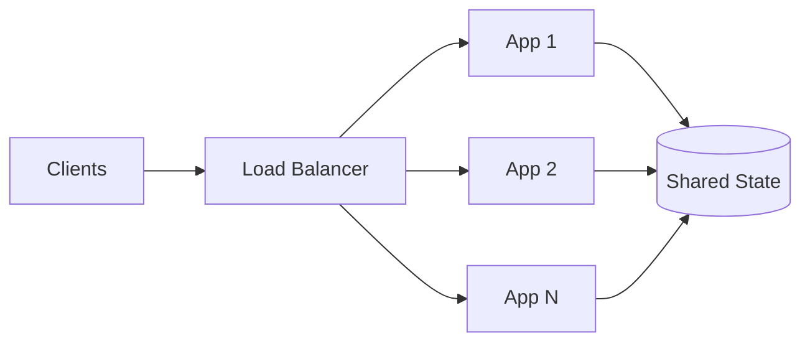
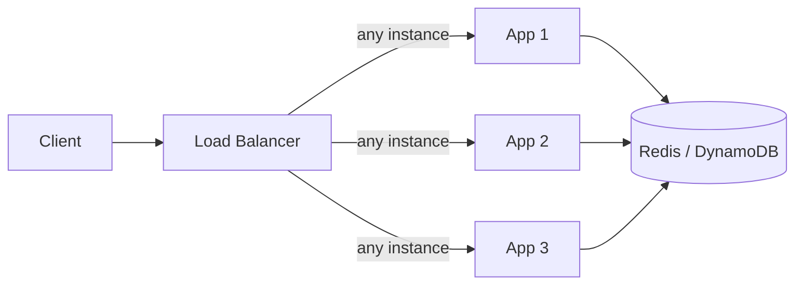
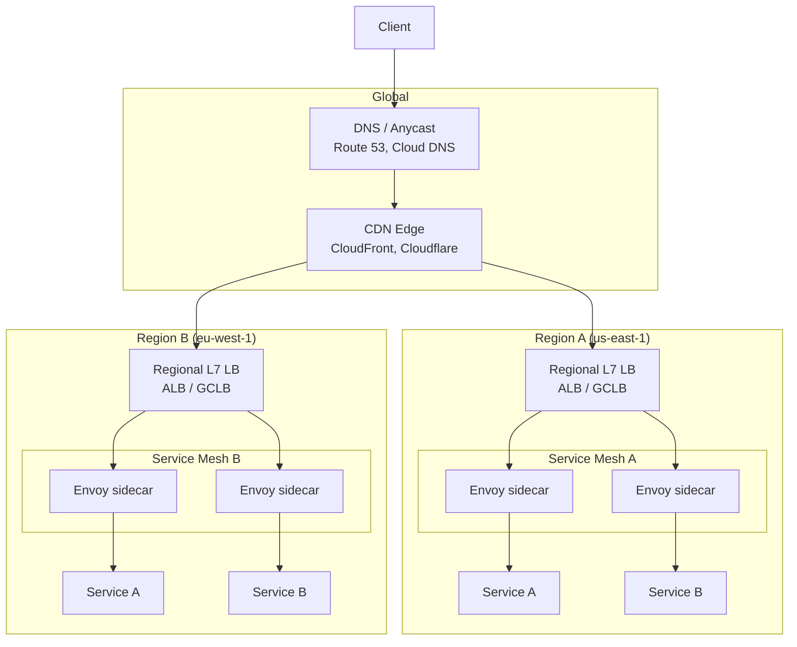

# Load Balancers in System Design — L4 vs L7, Algorithms, and Health Checks

**Date:** 2026-04-24 | **Updated:** 2026-04-24
**Tags:** `system-design` `building-blocks` `load-balancing` `infrastructure`

## Table of Contents

- [Summary](#summary)
- [Why Every Design Has a Load Balancer](#why-every-design-has-a-load-balancer)
- [L4 vs L7 — A System Designer's Refresher](#l4-vs-l7--a-system-designers-refresher)
- [Algorithms — The Part That Actually Matters](#algorithms--the-part-that-actually-matters)
  - [Round Robin and Weighted Round Robin](#round-robin-and-weighted-round-robin)
  - [Least Connections / Least Response Time](#least-connections--least-response-time)
  - [Power of Two Random Choices](#power-of-two-random-choices)
  - [Consistent Hashing](#consistent-hashing)
  - [Rule of Thumb](#rule-of-thumb)
- [Health Checks — Where Outages Actually Come From](#health-checks--where-outages-actually-come-from)
- [Stickiness and Session Affinity](#stickiness-and-session-affinity)
- [Tiered Topology — Global → Regional → Service](#tiered-topology--global--regional--service)
- [The Load Balancer as a Single Point of Failure](#the-load-balancer-as-a-single-point-of-failure)
- [Where Clients Load Balance](#where-clients-load-balance)
- [Service Mesh Sidecars vs Central Load Balancers](#service-mesh-sidecars-vs-central-load-balancers)
- [Picking a Load Balancer — The Product Landscape](#picking-a-load-balancer--the-product-landscape)
- [Common Anti-Patterns](#common-anti-patterns)
- [Architecture Review Checklist](#architecture-review-checklist)
- [Related](#related)
- [References](#references)

## Summary

A load balancer is the first thing you draw on a system design whiteboard after the client, and the last thing anyone thinks about when things break. This doc focuses on LB _placement_ — where it sits in the architecture, how you tier it from global down to service level, and how it silently becomes your single point of failure — rather than the packet-level mechanics (covered in the sibling networking doc). If you only remember two things: load balancers are themselves a service that needs HA, and health checks decide your real availability far more than algorithm choice.

## Why Every Every Design Has a Load Balancer

Any design that claims "horizontal scalability" implies a load balancer, even if the diagram doesn't show one. The LB is the indirection layer that lets you:

- **Decouple clients from server identity** — clients hit one name/IP; servers come and go
- **Terminate TLS once** — offload cert management and crypto from app instances
- **Absorb failure** — ejecting unhealthy instances is the primary availability mechanism
- **Enable deploys** — rolling, blue/green, and canary releases all need traffic steering
- **Shape traffic** — rate limit, apply WAF rules, inject headers, authenticate at the edge

In system design interviews, omitting the LB is forgivable once. Omitting it when you then talk about "scaling the web tier" is not. Every stateless horizontally-scaled tier has an LB in front of it. Full stop.



The LB is also the natural cross-cutting layer for the things you don't want in every app: TLS, observability sampling, WAF, geo-routing, auth token validation. Pushing these into the LB keeps app code boring.

## L4 vs L7 — A System Designer's Refresher

> Packet-level detail (TCP proxying, HTTP/2 framing, header parsing) lives in the sibling networking doc. This section is about _when_ to pick which layer.

**L4 (transport layer)** load balancers make forwarding decisions on IP + port. They do not parse application bytes. Classic L4: AWS NLB, HAProxy in `mode tcp`, GCP Internal TCP/UDP LB, LVS.

**L7 (application layer)** load balancers parse HTTP/gRPC/HTTP/2 and route on path, host, header, cookie, or body. Classic L7: AWS ALB, Nginx, Envoy, HAProxy in `mode http`, Traefik, GCP HTTPS LB.

| Concern | L4 | L7 |
|---------|----|----|
| Throughput ceiling | Millions of cps | Hundreds of thousands of rps |
| Latency overhead | ~microseconds | ~milliseconds (parsing + buffering) |
| Protocol awareness | None — opaque bytes | HTTP method, path, headers, cookies |
| TLS termination | Pass-through or terminate | Usually terminates |
| Non-HTTP protocols | MySQL, Redis, SMTP, arbitrary TCP | HTTP/1.1, HTTP/2, HTTP/3, gRPC only |
| Path-based routing | No | Yes |
| Sticky sessions | 5-tuple hash only | Cookie-based |
| WAF / auth injection | No | Yes |

**Design rule**: if you need to route by URL path or inject HTTP-level behavior, you need L7. If you need raw throughput or the backend speaks TCP (databases, MQTT, custom wire protocols), use L4. Many modern architectures use **both in sequence**: an L4 LB at the edge for TLS pass-through and DDoS absorption, then an L7 LB (or service mesh) inside the VPC for routing.

A hybrid worth naming: **AWS Gateway Load Balancer (GWLB)** and **GCP Network Load Balancer (proxy tier)** — L4 LBs that forward through L7 virtual appliances. Useful for inline security inspection.

## Algorithms — The Part That Actually Matters

The algorithm choice is rarely the binding constraint on performance, but it is usually the binding constraint on _tail latency_ and _stampede behavior_. Get this right and p99 improves measurably.

### Round Robin and Weighted Round Robin

Simplest possible: each new connection goes to the next backend in a rotation. Weighted RR biases the rotation by capacity (e.g., an 8xlarge gets weight 4, an 2xlarge gets weight 1).

- **Good**: equal-cost backends, short-lived uniform requests
- **Bad**: mixed workloads — one slow request pins a backend while RR keeps piling on
- **Dangerous**: after a rolling deploy, cold backends get the same traffic share as warm ones

### Least Connections / Least Response Time

Pick the backend currently handling the fewest in-flight requests (or with the lowest recent latency). Works well for variable-cost requests and heterogeneous backends.

- **Good default** for L7 app traffic where request cost varies
- **Requires accurate state** — which means a single LB instance (or careful state sharing). This is why LB clusters often partition rather than share state.

### Power of Two Random Choices

Pick two backends at random, send the request to the one with fewer active connections. Counter-intuitively, this is **nearly as good as least-connections** while requiring almost no coordination. Used by Nginx (`least_conn` approximation), HAProxy (`random`), and modern service meshes.

- Coordination-free: perfect for _multiple_ LB instances with no shared state
- Avoids the "herd" effect where every LB decides "backend 7 is idlest" simultaneously
- The original paper (Mitzenmacher, 1996) is short and worth reading

```python
# Conceptual — real implementations track this per-LB-instance
def power_of_two(backends):
    a, b = random.sample(backends, 2)
    return a if a.in_flight <= b.in_flight else b
```

### Consistent Hashing

Hash something stable about the request (user ID, cache key, source IP) and map it to a backend on a hash ring. Same key → same backend, even as backends are added/removed. Only ~1/N of keys remap when a backend joins or leaves.

- **Essential** for cache affinity (don't shred your Redis/Memcached hit rate)
- **Essential** for stateful backends where a session lives on one instance (game servers, shard owners)
- **Caution**: hot keys still concentrate load — use "bounded-load consistent hashing" (Google, 2017) to cap per-backend load

### Rule of Thumb

| Workload | Algorithm |
|----------|-----------|
| Uniform short HTTP requests | Round robin |
| Variable-cost requests, single LB | Least connections |
| Variable-cost, multi-LB cluster | Power of two choices |
| Cache or session affinity | Consistent hashing (bounded) |
| Heterogeneous backend sizes | Weighted variant of the above |

Default to **power of two choices** unless you have a specific reason otherwise. It's the sweet spot for modern fleets.

## Health Checks — Where Outages Actually Come From

Every real outage I've investigated that involved a load balancer came down to a bad health check, not a bad algorithm. This section matters more than the one above.

**Active health checks** — LB polls backends on a schedule. Classic `GET /health` returning 200. Cheap, deterministic, but only reflects whatever the endpoint actually checks.

**Passive health checks** — LB infers health from real request outcomes (5xx, timeouts, connection resets). Fast to react, no extra traffic, but noisy — a single bad client can eject a healthy backend.

**Composite health checks** — the modern default. Combine both:

- Active probe confirms the process is listening and the basic contract is met
- Passive outlier detection ejects backends misbehaving under real traffic
- Circuit breaker wraps the whole thing

Envoy's [outlier detection](https://www.envoyproxy.io/docs/envoy/latest/intro/arch_overview/upstream/outlier) and Istio's destination rules are the canonical modern example.

### Health-check design pitfalls

1. **Shallow health checks** — `return 200` from a handler that never touches the database. The app reports healthy while every request 500s. Health checks should hit the critical dependencies they gate.
2. **Deep health checks that cascade** — `/health` that queries the DB, Redis, and three downstream services. A slow downstream causes _every_ backend to fail health checks simultaneously → LB ejects everything → full outage. This is a classic metastable failure mode.
3. **Health checks that don't match real traffic** — probe hits `GET /health`, real traffic is `POST /api/orders` with a 50 MB body. Only the real path exposes the actual failure mode.
4. **Thresholds that are too tight** — "3 consecutive failures ejects the backend" with a 2-second interval. GC pause or leader election blip → ejection storm. Use longer windows and hysteresis.

### Graceful drain / connection draining

When a backend is being removed (scale-in, deploy, maintenance), the LB must:

1. **Stop sending new connections** immediately (mark the backend as draining)
2. **Let in-flight requests finish** up to a timeout (typically 30s–5min)
3. **Only then terminate** the backend

Kubernetes wires this via the `preStop` hook + `terminationGracePeriodSeconds`. AWS ALB has "deregistration delay". If you skip drain, rolling deploys produce a visible blip of 5xx or reset connections.

```yaml
# Kubernetes pattern — tell the LB "stop" before the app dies
spec:
  terminationGracePeriodSeconds: 60
  containers:
    - name: app
      lifecycle:
        preStop:
          exec:
            command: ["/bin/sh", "-c", "sleep 15 && /app/graceful-shutdown"]
```

The `sleep 15` gives the LB/service mesh time to notice the pod is `Terminating` and stop routing to it. Then the app performs its own graceful shutdown.

## Stickiness and Session Affinity

Sticky sessions pin a client to the same backend for the duration of a session, typically via a cookie set by the LB (`AWSALB`, `JSESSIONID` when proxied) or by source-IP hash on L4.

**When you genuinely need it:**

- WebSocket / SSE long-lived connections (already pinned by nature of the connection)
- Server-local caches you can't afford to rebuild (rarely worth it today)
- In-memory session stores (almost always a mistake — see below)

**When it's a symptom of a bug, not a solution:**

- Using stickiness to paper over a non-stateless app tier. This is the most common misuse. Server restarts, scale-in, and zone failures will still break sessions; you just made the problem quieter until it's loud.

**The correct pattern: externalize session state.**



With session state in Redis, the app tier is truly stateless, the LB can use any algorithm, and you can redeploy freely. This is the right shape for ~95% of web workloads. Reach for stickiness only when the session genuinely cannot be externalized cheaply.

## Tiered Topology — Global → Regional → Service

A production system rarely has _one_ load balancer. It has a stack of them, each solving a different problem. Drawing this correctly is the difference between a passing and failing architecture review.



**Global tier** — routes users to the nearest/healthiest region.

- **DNS-based** (Route 53 latency/geo routing, Cloud DNS): cheap, universal, but TTL-limited (~60s minimum failover)
- **Anycast** (Cloudflare, GCP Global LB, AWS Global Accelerator): single IP announced from many locations; BGP steers to the closest PoP. Sub-second failover, no TTL problem.
- **CDN edge**: caches static responses, terminates TLS close to users, protects origins from DDoS

**Regional tier** — inside a region, distributes to AZ/instance level.

- Cloud LBs (ALB/NLB, GCLB, Azure LB) — fully managed, auto-scaling
- Self-hosted (Nginx, HAProxy, Envoy) — when you need features cloud LBs don't offer, or you're on bare metal

**Service tier** — inside the cluster, service-to-service traffic.

- Service mesh sidecars (Istio/Envoy, Linkerd)
- Kubernetes Service (kube-proxy, iptables/IPVS) — L4 only, round-robin-ish
- Client-side LB (gRPC, Spring Cloud LoadBalancer) — covered below

**Why tier at all?** Different layers solve different problems efficiently. Global handles geography and DNS; regional handles ingress, TLS, and WAF; service handles fine-grained policy and service discovery. Collapsing tiers pushes responsibility somewhere it doesn't fit — a single global LB cannot do mTLS-per-service, and a service mesh cannot do DNS failover.

## The Load Balancer as a Single Point of Failure

Here's the uncomfortable truth: **the load balancer is usually the most load-bearing single component in your stack**. If the LB tier fails, nothing else matters. How you mitigate this depends on tier.

### Global tier SPOF mitigation

- **Anycast** — the IP is announced from many PoPs; losing one withdraws its BGP advertisement and traffic reroutes in seconds. This is how Cloudflare, CloudFront, and GCP Global LB are inherently resilient.
- **DNS failover** with low TTLs and health-checked records. Slower (minutes, not seconds) and clients cache aggressively, but works anywhere.
- **Multi-provider DNS** — run Route 53 + Cloud DNS + NS1 simultaneously. Protects against a single DNS provider outage (which has happened).

### Regional tier SPOF mitigation

- Cloud managed LBs (ALB, GCLB) are already multi-AZ internally — you don't see the individual LB instances. Trust the cloud provider's SLA (typically 99.99%).
- For self-hosted: **active-active LB pairs** using BGP/ECMP, or **active-passive** with VRRP + floating IP (keepalived). The latter is simpler; the former scales further.
- **Multiple LB clusters behind DNS RR** — N independent LB clusters, DNS returns all; client tries another on connection failure.

```text
DNS A-record for api.example.com:
  lb-cluster-1.example.com.  (health-checked)
  lb-cluster-2.example.com.  (health-checked)
  lb-cluster-3.example.com.  (health-checked)
```

### Service tier SPOF mitigation

Service mesh sidecars have no SPOF at the traffic layer — each pod has its own sidecar. The mesh _control plane_ can fail without breaking data plane traffic (Istio is explicit about this separation).

### The underappreciated failure mode: LB capacity exhaustion

LBs have connection limits, bandwidth limits, and (for L7) CPU limits for TLS and HTTP parsing. A traffic spike that the _backend_ could handle can still saturate the LB. Always:

- Graph LB connection count, new-conn-per-sec, TLS handshakes/sec, and CPU
- Alert well below the documented LB ceiling
- Know your LB's horizontal scaling story (ALB auto-scales slowly — pre-warm for predictable spikes)

## Where Clients Load Balance

Not all load balancing happens on a separate LB box. **Client-side load balancing** lets the client itself pick a backend, usually via a service discovery lookup. Common in microservice environments and especially in gRPC / long-lived-connection worlds.

### When client-side LB wins

- **Long-lived connections (HTTP/2, gRPC)** — a proxy LB picks a backend at _connection_ time, then every subsequent stream reuses it. With 100 clients × 1 connection × 1 backend, you get terrible load distribution. Client-side LB with subsetting solves this.
- **Latency sensitivity** — one less network hop
- **No proxy capacity management** — each client does its own tiny share

### When client-side LB loses

- **Polyglot fleets** — every language needs an LB implementation and they drift
- **Complex routing** — path rewrites, WAF rules, auth injection live more naturally in a proxy
- **Client misbehavior** — a buggy client can load-hammer or miss backends entirely

### Implementations worth knowing

- **gRPC built-in** — `round_robin` and `pick_first` LB policies, with `xds` for dynamic config from a control plane
- **Spring Cloud LoadBalancer** — Java client-side LB integrated with service discovery (Eureka, Consul); replaced Netflix Ribbon in modern stacks
- **Envoy as sidecar** — technically a local proxy, but architecturally "client-side LB" from the app's perspective; config comes from the mesh control plane

```java
// Spring Cloud LoadBalancer — client-side LB, picks instance from discovery
@Bean
@LoadBalanced
public WebClient.Builder loadBalancedWebClient() {
  return WebClient.builder();
}

// 'orders' resolves via service discovery; LB picks an instance per call
String out = webClient.get()
    .uri("http://orders/api/status")
    .retrieve()
    .bodyToMono(String.class)
    .block();
```

```typescript
// gRPC Node client — round_robin LB over resolved backends
import { credentials, ServiceConfig } from '@grpc/grpc-js';

const client = new OrdersClient(
  'dns:///orders.internal:50051',
  credentials.createInsecure(),
  { 'grpc.service_config': JSON.stringify({
      loadBalancingConfig: [{ round_robin: {} }],
    }) },
);
```

## Service Mesh Sidecars vs Central Load Balancers

A service mesh (Istio, Linkerd, Consul Connect) inserts an Envoy/Linkerd-proxy sidecar next to every pod. All outbound traffic goes through the sidecar, which does LB, mTLS, retries, timeouts, and observability.

| Dimension | Central LB | Sidecar mesh |
|-----------|-----------|--------------|
| Deployment | One shared fleet | One proxy per pod |
| Observability granularity | Coarse (per-LB) | Fine (per-call) |
| mTLS between services | Hard / DIY | Built-in |
| Per-service policy | Limited | Rich (retries, timeouts, outlier detection) |
| Operational complexity | Low–medium | High |
| Extra latency per call | 0 (direct) | ~1–3ms sidecar round-trip |
| Resource cost | Proxies share capacity | Every pod runs a proxy (100–200MB RAM each) |

**When a mesh earns its cost**: 20+ services with real policy needs, compliance-driven mTLS requirements, heterogeneous language stacks.

**When a mesh is overkill**: 3 services that mostly call each other over HTTP. Just use k8s Services and a decent retry library. You can always adopt a mesh later.

The mesh is not a replacement for the ingress LB — it handles east-west (internal) traffic. You still need a north-south LB (ALB, GCLB, ingress controller) at the edge.

## Picking a Load Balancer — The Product Landscape

Architecture reviews die on "why did you pick X LB?" Have a one-sentence answer ready for each candidate.

### AWS

- **ALB (Application LB)** — L7, HTTPS, path/host routing, WebSockets, gRPC (HTTP/2). Default for HTTP workloads. Per-LCU pricing, multi-AZ, integrates with WAF, Cognito, Lambda targets.
- **NLB (Network LB)** — L4, extreme throughput, static IPs per AZ, preserves source IP trivially, TLS offload in pass-through or termination mode. Use for non-HTTP TCP, MQTT, databases, or when you need millions of connections.
- **GWLB (Gateway LB)** — L3 transparent forwarding to inline security appliances. Niche but necessary for certain compliance topologies.
- **CLB (Classic)** — legacy, avoid in new designs.

### GCP

- **Global External HTTPS LB** — anycast L7, single global IP, automatic TLS, HTTP/3. Default for public HTTP workloads at global scale.
- **Regional External HTTPS LB** — regional variant, cheaper, standard-tier networking.
- **External TCP/UDP Network LB** — L4, passthrough, per-region.
- **Internal HTTP(S) LB / Internal TCP/UDP LB** — for VPC-internal traffic; equivalent of AWS internal ALB/NLB.

### Open source, self-hosted

- **HAProxy** — L4 + L7, legendary reliability and performance, no frills. The default "I just need an LB that works" choice. Runtime config via Runtime API; Data Plane API for declarative config.
- **Nginx / Nginx Plus** — L4 + L7, huge feature surface (caching, scripting via Lua), massive community. Open-source version lacks dynamic upstream reconfiguration without reload; commercial version fixes this.
- **Envoy** — L4 + L7, xDS-driven dynamic config, HTTP/2 and HTTP/3 native, observability-first. The data plane under Istio, Gloo, AWS App Mesh, and dozens of API gateways. More complex than HAProxy/Nginx; configuration is verbose but precise.
- **Traefik** — L7-focused, automatic service discovery from Docker/Kubernetes/Consul labels, easy Let's Encrypt integration. Great for small-to-medium Kubernetes ingress; less proven than Envoy at massive scale.

### Appliance / commercial

- **F5 BIG-IP / Citrix ADC** — enterprise hardware/virtual LBs with deep L7 features, SSL acceleration, advanced WAF. Expensive and operationally heavy; still common in regulated enterprises.

### Decision heuristic

1. In a cloud? Default to the managed LB of your HTTP flavor (ALB, GCLB HTTPS). Move off only for a concrete missing feature.
2. In Kubernetes? Ingress controller is usually Nginx-Ingress, Traefik, or an Envoy-based one (Contour, Emissary, Gloo). Pick the one your ops team has context on.
3. On bare metal? HAProxy for L4 + simple L7; Envoy if you're going mesh or need xDS dynamic config.
4. Need a mesh? Istio if you want breadth (or your cloud offers a managed Istio); Linkerd if you want simplicity and lower overhead.

## Common Anti-Patterns

Each of these has cost me or a colleague at least one incident.

**Sticky sessions to fake statelessness.** The app keeps session data in memory. Stickiness hides the problem. Then a backend crashes, is deployed, or scales in, and users silently log out or lose cart state. _Fix_: externalize session to Redis/DB.

**Health checks that don't check anything.** `GET /health` returns 200 unconditionally. LB reports all backends healthy while 100% of real requests fail. _Fix_: health check must exercise the app's critical path — a lightweight real query, not a static response.

**Health checks that check too much.** `/health` touches every dependency. One slow downstream ejects all backends simultaneously → full outage. _Fix_: shallow health for LB routing; separate deep diagnostic endpoint for humans; circuit-break dependencies inside the app.

**No graceful drain.** Deploy rotates pods; LB routes to a pod that's already `SIGTERM`ed. Users see resets or 5xx. _Fix_: `preStop` delay, connection draining on the LB, app handles `SIGTERM` to finish in-flight requests.

**LB hiding backend connection limits.** A backend can handle 500 concurrent connections. LB merrily opens 5000 and the backend falls over. _Fix_: explicit backend connection limits on the LB (HAProxy `maxconn`, Envoy `max_connections`) to cap and queue, protecting the backend.

**Single LB, no failover story.** "The LB hasn't crashed in a year" — until it does, taking the whole system with it. _Fix_: anycast, DNS failover with low TTLs, or active-active/active-passive pairs at minimum.

**L7 LB for inherently L4 traffic.** Running Postgres or Redis through an ALB (doesn't work) or through a full HTTP proxy (works but wastes CPU and can mangle protocols). _Fix_: use NLB / HAProxy in TCP mode / GCP Internal TCP LB.

**Uneven load with sticky HTTP/2 connections.** 10 gRPC clients × 1 persistent connection each × round-robin at connection time = 10 backends max get load, all others idle. _Fix_: client-side LB with per-request balancing, or enable subsetting + periodic connection recycling.

**Trusting `X-Forwarded-For` blindly.** After TLS termination at the LB, only the LB's IP reaches the app unless you propagate. But trusting client-supplied `X-Forwarded-For` headers lets attackers spoof source IP for rate limiters and audit logs. _Fix_: only trust `X-Forwarded-For` from known LB IPs; use the PROXY protocol for L4 source-IP preservation.

**Assuming the LB's retry will save you.** LB retries on connection failure to _a different backend_ can amplify load during an incident (retry storms) and can double-apply non-idempotent writes. _Fix_: only enable LB retries for idempotent methods (GET, HEAD, PUT idempotently designed); use budgets and backoff.

## Architecture Review Checklist

Before calling a design "done", verify:

- [ ] Every horizontally scaled tier has an LB in front of it in the diagram
- [ ] L4 vs L7 choice is justified (not "because ALB is the default")
- [ ] Algorithm chosen matches workload (uniform vs variable cost; affinity needs)
- [ ] Health check exercises a meaningful code path and is _shallow_ for routing decisions
- [ ] Graceful drain / connection draining is configured for deploys
- [ ] Session state is externalized; stickiness is only used where unavoidable
- [ ] Global tier has a failover mechanism (anycast or DNS)
- [ ] Regional LB is multi-AZ (managed service) or has a paired peer (self-hosted)
- [ ] LB capacity (conns, bandwidth, TLS/sec) is monitored and alerted
- [ ] Retries are scoped to idempotent methods with a budget
- [ ] `X-Forwarded-For` / PROXY protocol is handled safely
- [ ] There is a documented way to drain the LB itself for maintenance

## Related

- [Load Balancing (Networking) — L4/L7 mechanics, algorithms, protocols](../../networking/infrastructure/load-balancing.md) — sibling networking doc with packet-level detail on how LBs actually forward traffic
- [Kubernetes Cluster Architecture](../../kubernetes/core-concepts/cluster-architecture.md) — kube-proxy, Services, and how internal LB works in k8s
- _(Forthcoming sibling building-blocks entries)_: CDNs and edge caching; API gateways; service discovery; reverse proxies vs LBs vs gateways

## References

- [AWS Elastic Load Balancing — product overview](https://docs.aws.amazon.com/elasticloadbalancing/latest/userguide/what-is-load-balancing.html) — canonical reference for ALB / NLB / GWLB capabilities and limits
- [Google Cloud Load Balancing overview](https://cloud.google.com/load-balancing/docs/load-balancing-overview) — global vs regional tiers, backend services, health check model
- [Envoy proxy documentation — load balancing](https://www.envoyproxy.io/docs/envoy/latest/intro/arch_overview/upstream/load_balancing/load_balancing) — modern LB algorithm reference (including power-of-two-choices and subsetting)
- [HAProxy documentation](http://docs.haproxy.org/) — deep reference on L4/L7 modes, health checks, stick tables, and queuing
- Mitzenmacher, M. (1996). [_The Power of Two Choices in Randomized Load Balancing_](https://www.eecs.harvard.edu/~michaelm/postscripts/tpds2001.pdf) — the foundational paper; short and readable
- [Google SRE Book — Chapter 19: Load Balancing at the Frontend](https://sre.google/sre-book/load-balancing-frontend/) and [Chapter 20: Load Balancing in the Datacenter](https://sre.google/sre-book/load-balancing-datacenter/) — the best free writing on real-world LB design
- [Cloudflare Learning — What is load balancing?](https://www.cloudflare.com/learning/performance/what-is-load-balancing/) — concise intro including anycast context
- [NGINX — Choosing an NGINX Plus Load-Balancing Technique](https://www.nginx.com/blog/choosing-nginx-plus-load-balancing-techniques/) — practical algorithm comparison with real HTTP workloads
- Vahdat, A. et al. (2017). [_Consistent Hashing with Bounded Loads_](https://arxiv.org/abs/1608.01350) — the bounded-load variant used in modern meshes
