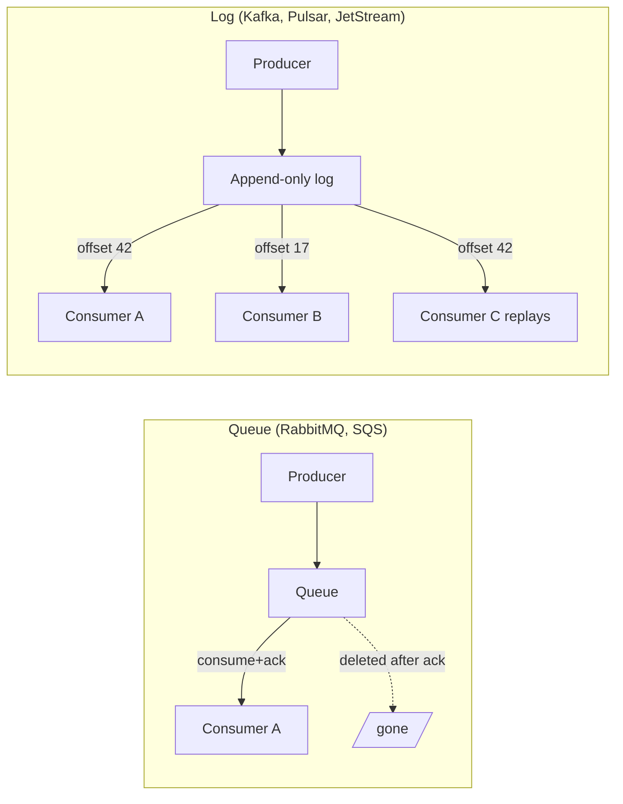
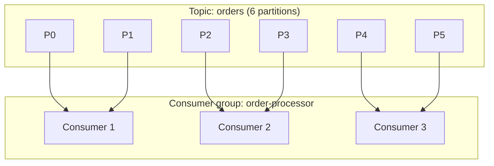
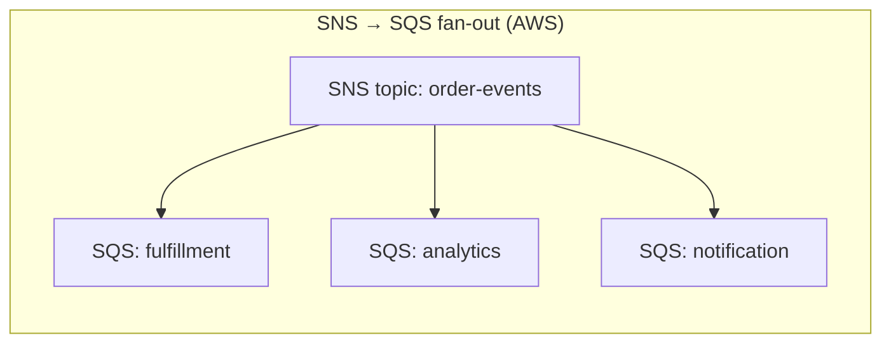

# Message Queues & Brokers — Kafka, RabbitMQ, SQS, NATS

**Date:** 2026-04-24 | **Updated:** 2026-04-24
**Tags:** `system-design` `building-blocks` `messaging` `kafka` `rabbitmq` `sqs`

## Table of Contents

- [Summary](#summary)
- [Queue vs Log — The Fundamental Split](#queue-vs-log--the-fundamental-split)
  - [Queue Semantics (Consume-and-Delete)](#queue-semantics-consume-and-delete)
  - [Log Semantics (Retained Append-Only)](#log-semantics-retained-append-only)
  - [Side-by-Side Comparison](#side-by-side-comparison)
- [Delivery Guarantees](#delivery-guarantees)
  - [At-Most-Once](#at-most-once)
  - [At-Least-Once](#at-least-once)
  - [Effectively-Once / Exactly-Once](#effectively-once--exactly-once)
- [Ordering](#ordering)
- [Partitioning & Consumer Groups vs Competing Consumers](#partitioning--consumer-groups-vs-competing-consumers)
  - [Kafka Model — Partitioned Consumer Groups](#kafka-model--partitioned-consumer-groups)
  - [RabbitMQ Model — Competing Consumers on a Queue](#rabbitmq-model--competing-consumers-on-a-queue)
- [Backpressure & Flow Control](#backpressure--flow-control)
- [Fan-out Patterns](#fan-out-patterns)
- [The Four Exemplars](#the-four-exemplars)
  - [Kafka](#kafka)
  - [RabbitMQ](#rabbitmq)
  - [SQS / SNS](#sqs--sns)
  - [NATS / NATS JetStream](#nats--nats-jetstream)
  - [Brief Mentions — Pulsar, Redis Streams, Google Pub/Sub](#brief-mentions--pulsar-redis-streams-google-pubsub)
- [Decision Framework](#decision-framework)
- [Operational Concerns](#operational-concerns)
- [Anti-Patterns](#anti-patterns)
- [Related](#related)
- [References](#references)

## Summary

Brokers split into two families: **queues** (consume-and-delete, "the work list"), and **logs** (retained append-only, "the event history"). Everything else — delivery guarantees, ordering, fan-out, replay, partitioning — flows from which side of that split the broker sits on. Kafka is the canonical log. RabbitMQ is the canonical smart queue. SQS is a managed queue with FIFO and standard variants. NATS JetStream is a lightweight hybrid. Pick the one whose semantics match your actual workload and stop trying to bend the other to fit.

## Queue vs Log — The Fundamental Split

This is the single most important model to carry into every messaging decision. Brokers are not interchangeable — they are built on fundamentally different storage models that determine what you can and cannot do.



### Queue Semantics (Consume-and-Delete)

- A message lives in the queue until a consumer **acknowledges** it; then it is gone.
- The broker tracks per-message state: _visible_, _in-flight_, _acked_, _nacked_.
- Adding a second consumer type for the same workload means declaring a second queue and routing a copy there (usually via an exchange or SNS topic).
- Mental model: a **shared work list**. Each task is done by exactly one worker.
- Retention is incidental — messages disappear when consumed, not on a timer.

### Log Semantics (Retained Append-Only)

- Messages are appended to a partitioned log with monotonically increasing **offsets**.
- Consumers track their own offset; the broker does not remove messages when they are read.
- Messages are deleted by **retention policy** (time or size), not by consumption.
- Multiple independent consumer groups can read the same log at different offsets simultaneously.
- Mental model: an **event history** you can rewind. Reprocessing is a first-class operation.

### Side-by-Side Comparison

| Dimension | Queue (RabbitMQ, SQS) | Log (Kafka, JetStream) |
|-----------|----------------------|------------------------|
| Storage model | Per-message state machine | Append-only segments |
| Message lifetime | Until ack or visibility timeout expiry | Until retention policy evicts |
| Consumer state | Held by broker | Held by consumer (offsets) |
| Adding a new consumer type | Declare a new queue + bind | Use a new consumer group, no new infra |
| Replay | Not supported (message is gone) | Seek to earlier offset |
| Throughput ceiling | Good (10k–100k msg/s per queue) | Very high (millions/s per cluster) |
| Per-message routing logic | Rich (exchanges, headers, routing keys) | Minimal (topic + partition key) |
| Natural use case | Task queues, RPC, work distribution | Event streams, audit logs, CDC, analytics |

> The sharpest question to ask yourself early: **"Do I need to replay this stream 6 months from now?"** If yes, you need a log. If the message stops mattering the moment it is processed, you want a queue.

## Delivery Guarantees

These three guarantees are the vocabulary for reasoning about correctness. Every broker implements some variation of the first two; the third is almost always a carefully engineered illusion.

### At-Most-Once

- Producer sends; if ack lost, producer does **not** retry.
- Consumer acks before processing, or uses fire-and-forget.
- Messages can be **lost**, never duplicated.
- Use for high-volume telemetry where loss is acceptable (metrics, click logs, trace samples).

### At-Least-Once

- Producer retries on timeout; consumer acks **after** processing completes.
- Duplicates are possible (producer retry, consumer crash between process and ack, rebalance).
- The default for almost every production system — combine with **idempotent consumers** to make duplicates harmless.
- Idempotency key sources: natural business ID, producer-generated UUID, `(topic, partition, offset)` tuple.

### Effectively-Once / Exactly-Once

- The honest name is **effectively-once**: externally observable behavior indistinguishable from exactly-once.
- Achieved by pairing at-least-once delivery with idempotent processing, or by a transactional protocol that couples consume + produce + offset-commit into one atomic unit.
- **Kafka's "exactly-once semantics" (EOS)** works end-to-end only when all three of these live inside Kafka: read from a topic → process → write to a topic → commit offsets atomically using `sendOffsetsToTransaction`. Any side-effect that leaves Kafka (HTTP call, SQL update, email) is outside the transaction and you need idempotency on the receiving side.
- Rule of thumb: true exactly-once across heterogeneous systems does not exist. You get effectively-once by making consumers idempotent and using the [outbox pattern](../data-consistency/distributed-transactions.md) for DB + event pairs.

```java
// Kafka exactly-once (consume-transform-produce) — the only place "exactly-once" is real
producer.initTransactions();
while (true) {
    ConsumerRecords<String, String> records = consumer.poll(Duration.ofMillis(100));
    producer.beginTransaction();
    for (ConsumerRecord<String, String> r : records) {
        producer.send(new ProducerRecord<>("out", transform(r.value())));
    }
    // Commit offsets INSIDE the producer transaction — atomic with the sends
    producer.sendOffsetsToTransaction(offsetsFor(records), consumer.groupMetadata());
    producer.commitTransaction();
}
```

## Ordering

Ordering is almost never "global". It is **per-partition**, **per-queue**, or **per-key** — and the cost of going any broader is steep.

- **Kafka**: ordering is strict **within a partition**, never across partitions. If you need order per user, hash `user_id` → partition. Adding partitions later breaks ordering for existing keys unless you rehash carefully.
- **RabbitMQ**: FIFO within a single queue, with a single consumer. Adding consumers (competing consumers) breaks strict order because messages in-flight can be redelivered out of sequence.
- **SQS Standard**: best-effort ordering only. No guarantees.
- **SQS FIFO**: ordered per **MessageGroupId**. Throughput is capped (3,000 msg/s with batching per group, 300 without) — treat it as per-key ordering, not global.
- **NATS JetStream**: ordered per subject within a stream.

> Global ordering requires a single partition / single queue / single group. That caps throughput to one consumer's speed. If you find yourself needing global order in a high-throughput system, question the requirement first — usually per-key order is enough.

## Partitioning & Consumer Groups vs Competing Consumers

The two dominant scale-out models look similar on a whiteboard but behave very differently.

### Kafka Model — Partitioned Consumer Groups

- A topic is split into **N partitions** (a number chosen at creation — painful to grow).
- A **consumer group** is a set of consumers coordinating to read the same topic.
- The group coordinator assigns each partition to **exactly one consumer** in the group. Two consumers in the same group never read the same partition simultaneously.
- Parallelism ceiling = partition count. More consumers than partitions → extras sit idle.
- Rebalancing on consumer join/leave can pause the group (mitigated by cooperative / incremental rebalancing in newer clients).



### RabbitMQ Model — Competing Consumers on a Queue

- One queue, many consumers subscribed to it.
- The broker dispatches each message to **one** of the consumers (round-robin, or weighted by prefetch / QoS).
- No partition concept: parallelism scales with consumer count, bounded by the queue's single-writer throughput (tens of thousands of msg/s per queue).
- Sibling queues scale horizontally; use consistent-hash exchanges or sharding plugins if you need key affinity.

| Concern | Kafka Consumer Group | RabbitMQ Competing Consumers |
|---------|---------------------|------------------------------|
| Message-to-consumer mapping | By partition (sticky, key-affine) | By availability (any free consumer) |
| Parallelism cap | Partition count | Consumer count (per queue) |
| Key affinity | Natural (hash → partition) | Needs consistent-hash exchange |
| Rebalance cost | Partition reassignment pause | None (consumers independent) |
| Replay | Seek offsets | Not available (message gone after ack) |

## Backpressure & Flow Control

Producers outrun consumers eventually. How the broker handles it determines whether your system degrades gracefully or collapses.

- **RabbitMQ**: consumer-side **prefetch (QoS)** limits unacked messages per consumer. Producer-side **publisher confirms** + flow control block producers when queues grow past memory watermarks.
- **Kafka**: producers get throttled by `max.in.flight.requests`, broker quotas, and partition-write throughput. Consumers pull at their own rate — the log absorbs the surplus up to retention size. This is why Kafka doubles as a buffer for spiky workloads.
- **SQS**: no explicit flow control; visibility timeout + consumer polling rate form a natural backpressure loop. If the consumer dies, the message reappears and another consumer picks it up.
- **NATS Core** (non-JetStream): subscribers that cannot keep up get disconnected with a "slow consumer" error — ruthless but cheap. JetStream buffers instead.

> The Kafka log-as-buffer property is a frequent reason to pick Kafka over a queue: write traffic bursts to 5× capacity for an hour and the system absorbs it without producer blocking, as long as you sized retention correctly.

## Fan-out Patterns

Getting one event to many consumers, each with their own fate.

- **Kafka**: one topic, **N consumer groups**. Each group reads the full stream independently, tracking its own offsets. Cheapest fan-out in the business — no extra infra.
- **RabbitMQ topic/fanout exchanges**: a producer publishes to an exchange; bindings decide which queues receive a copy. Routing keys allow pattern-based fan-out (`orders.*.created`).
- **SNS → SQS fan-out**: publish once to an SNS topic; N SQS queues subscribe. Each queue gets a copy and is consumed independently. The canonical AWS pattern for decoupling producer and consumers.
- **NATS subjects**: subject-based pub/sub with wildcards (`orders.*.created`) and queue groups for load-balanced delivery.



## The Four Exemplars

### Kafka

A **distributed, partitioned, replicated append-only log**. The default choice when you need durable event streams, replay, high throughput, and multiple independent consumers.

- **Storage**: partitioned log segments on disk, replicated across brokers (`replication.factor=3` typical). Reads are sequential — OS page cache makes this very fast.
- **Durability**: `acks=all` + `min.insync.replicas=2` survives single-broker failure. Lower `acks` for throughput over durability.
- **Ordering**: strict per-partition.
- **Throughput**: millions of msg/s per cluster; single-partition ceiling typically 10–100 MB/s.
- **Retention**: time-based (`retention.ms`) or size-based (`retention.bytes`). **Log compaction** keeps only the latest value per key — useful for state snapshots, not as a substitute for a queue.
- **Delivery**: at-least-once by default; exactly-once via transactional producers when the entire flow stays in Kafka.
- **Operational weight**: heavy. ZooKeeper historically (now KRaft), rebalancing pitfalls, partition count is a long-term commitment, broker JVMs need tuning. [Confluent Cloud](https://www.confluent.io/confluent-cloud/) / [MSK](https://aws.amazon.com/msk/) remove most of this.
- **When to pick**: event sourcing, CDC, analytics pipelines, fan-out to many consumers, high-throughput durable bus, anything that might want replay.

```typescript
// Node.js producer (KafkaJS)
import { Kafka } from 'kafkajs';

const kafka = new Kafka({ brokers: ['broker:9092'] });
const producer = kafka.producer({ idempotent: true });

await producer.connect();
await producer.send({
  topic: 'orders',
  messages: [{
    key: order.userId,         // ensures same user → same partition → ordered
    value: JSON.stringify(order),
    headers: { 'x-idempotency-key': order.id },
  }],
  acks: -1,                    // wait for all in-sync replicas
});
```

### RabbitMQ

A **smart broker** implementing AMQP 0-9-1. Strong choice when you need rich routing, per-message TTLs, priorities, delayed delivery, and a classic work-queue model.

- **Core primitives**: producers publish to **exchanges**, which route to **queues** via **bindings** (routing keys, headers, topic patterns).
- **Exchange types**: `direct` (exact routing key match), `topic` (pattern match), `fanout` (broadcast), `headers` (header match).
- **Queues**: classic, quorum (Raft-backed, modern default for HA), streams (newer log-like queue type introduced in 3.9).
- **Dead-Letter Exchange (DLX)**: messages that are rejected, TTL-expired, or exceed max-length are routed to a configured DLX — the foundation of retry-with-DLQ patterns.
- **Delivery**: at-least-once via publisher confirms + consumer acks. No transactional producer equivalent to Kafka EOS.
- **Throughput**: tens of thousands msg/s per queue; scales by adding queues, not by partitioning a single queue.
- **Operational weight**: moderate. Cluster management, queue mirroring (now superseded by quorum queues), memory/disk watermarks.
- **When to pick**: task/work queues, RPC, workflows needing rich routing, low-to-mid throughput with per-message logic, anything where the broker doing smart routing saves application code.

```python
# AMQP pseudocode — task queue with DLX
channel.exchange_declare('orders', type='topic', durable=True)
channel.queue_declare('orders.created.dlq', durable=True)
channel.queue_declare(
    'orders.created',
    durable=True,
    arguments={
        'x-dead-letter-exchange': '',
        'x-dead-letter-routing-key': 'orders.created.dlq',
        'x-message-ttl': 60000,          # 60s TTL → DLQ on expiry
    },
)
channel.queue_bind('orders.created', 'orders', routing_key='orders.*.created')

# Consumer acks only after successful processing
def on_message(ch, method, props, body):
    try:
        handle(body)
        ch.basic_ack(method.delivery_tag)
    except PermanentError:
        ch.basic_nack(method.delivery_tag, requeue=False)  # → DLX
```

### SQS / SNS

**AWS managed queues** — zero operational burden, integrates natively with the rest of AWS.

- **SQS Standard**: at-least-once, best-effort ordering, nearly unlimited throughput. The default pick for decoupling services on AWS.
- **SQS FIFO**: exactly-once delivery (via producer-provided `MessageDeduplicationId`) and strict ordering per `MessageGroupId`. Throughput limited — 3,000 msg/s with batching per group.
- **Visibility timeout**: when a consumer receives a message, it is hidden for N seconds; consumer must delete before timeout expires or the message reappears. Short-polling vs long-polling (`WaitTimeSeconds=20`) — always use long-polling in production.
- **DLQ**: built-in `RedrivePolicy` with `maxReceiveCount`; redrive via console, CLI, or `StartMessageMoveTask` API.
- **SNS**: pub/sub topic layer. Typical architecture is **SNS → multiple SQS**: producers publish once, each consumer owns a queue, failures are isolated per subscriber.
- **Limits to know**: 256 KB message size (use S3 + pointer for larger), 14-day max retention, 15-minute max visibility timeout extension.
- **When to pick**: on AWS, want a queue, don't want to operate a broker. Use Standard unless ordering is mandatory; use FIFO only when you truly need per-key order.

### NATS / NATS JetStream

A **lightweight, high-throughput messaging system**. Originally subject-based pub/sub with no persistence; JetStream adds durable streams.

- **NATS Core**: at-most-once, blazing fast, microsecond latency, no persistence. Subscribers that can't keep up get dropped.
- **JetStream**: persistent streams with retention policies, consumer groups, at-least-once delivery, exactly-once via message deduplication window. Much lighter than Kafka to operate — single binary, no external coordination service.
- **Subjects**: hierarchical (`orders.eu.created`), wildcard subscriptions (`orders.*.created`, `orders.>`).
- **Queue groups**: multiple subscribers on the same queue group round-robin the messages — the "competing consumers" primitive baked in.
- **Throughput**: millions of msg/s per server, sub-millisecond latency.
- **When to pick**: edge / IoT, microservices with mixed pub-sub + request-reply, teams wanting Kafka-like durability without Kafka's operational overhead, geographically distributed systems (built-in leaf nodes and cluster/supercluster topologies).

### Brief Mentions — Pulsar, Redis Streams, Google Pub/Sub

- **Apache Pulsar**: log-like like Kafka but with **segregated storage (BookKeeper)** and compute, multi-tenancy primitives, geo-replication out of the box. Niche in North America, more common in Asia. Worth a look if you need topic-level tenancy.
- **Redis Streams**: append-only log inside Redis with `XADD` / `XREADGROUP`. Great for in-process or small-scale event streams when you already run Redis; not a substitute for Kafka at scale — durability depends on Redis persistence configuration.
- **Google Cloud Pub/Sub**: managed pub/sub on GCP. Push or pull delivery, global routing, at-least-once, ordered delivery per ordering key. GCP's analogue of SNS+SQS collapsed into one service.

## Decision Framework

Use this as a starting point, not a verdict. The real answer depends on team operational capacity, cloud choice, and whether replay is a requirement.

| If you need... | Pick | Why |
|----------------|------|-----|
| Replay event history, multiple consumer groups, high throughput | **Kafka** (or Pulsar) | Log semantics, retention-based storage, per-group offsets |
| Rich routing (topic exchanges, headers, priorities, delayed delivery) | **RabbitMQ** | AMQP is built for this; app code stays simple |
| Classic task/work queue with retries and DLQs, on AWS | **SQS Standard** + DLQ | Zero ops, scales effortlessly, proven pattern |
| Strict per-key ordering + dedup, on AWS | **SQS FIFO** | Managed, but know the throughput cap |
| Fan-out one event to N independent AWS consumers | **SNS → SQS** | Standard AWS pattern, failure isolation per subscriber |
| Microservices chatter, low latency, mixed pub/sub + RPC | **NATS Core** | Sub-ms latency, request-reply primitive |
| Kafka-like durability without Kafka operational weight | **NATS JetStream** | Single binary, streams with retention |
| Event sourcing / CDC pipeline | **Kafka** | Log compaction, exactly-once within Kafka, Debezium ecosystem |
| Small-scale events and you already run Redis | **Redis Streams** | No new infra |
| GCP-native pub/sub with global routing | **Google Pub/Sub** | Managed, region-agnostic |

A quicker mental filter:

1. **Need replay?** → log (Kafka, JetStream, Pulsar).
2. **Need smart routing or per-message TTLs?** → RabbitMQ.
3. **On AWS and want minimum ops?** → SQS (+ SNS for fan-out).
4. **Need sub-ms latency on a mesh of services?** → NATS.

## Operational Concerns

Pointers only — Tier 5 communication docs will go deeper on each of these.

- **Poison messages**: messages the consumer cannot process. Without bounded retries they block progress forever. Always set a `max-receives` / retry count → DLQ. See [dead-letter queues and retries](../communication/dead-letter-queues-and-retries.md) (Tier 5, planned).
- **DLQs (Dead-Letter Queues)**: required. A queue without a DLQ is a time bomb. Attach alerting on DLQ depth > 0.
- **Redrive**: the act of moving DLQ messages back to the primary for reprocessing after fixing a bug. SQS has a managed redrive API; for Kafka and RabbitMQ you script it.
- **Retention**: Kafka lets you set days/weeks. RabbitMQ queues grow until memory/disk watermarks block publishers. SQS caps at 14 days. Pick retention by your **replay window** + buffer, not by gut feel.
- **Offset management (Kafka)**: commit offsets only after processing succeeds, or you create silent data loss on consumer crash. Use auto-commit only if you can tolerate at-most-once.
- **Consumer lag monitoring**: the first metric to alert on. Kafka: `kafka-consumer-groups` / [Burrow](https://github.com/linkedin/Burrow) / Prometheus exporter. SQS: `ApproximateAgeOfOldestMessage`. RabbitMQ: queue depth and consumer utilization.
- **Idempotency**: build it into every consumer. Dedup by business key or producer-supplied UUID. See [idempotency and exactly-once semantics](../communication/idempotency-and-exactly-once.md) (Tier 5, planned).

## Anti-Patterns

Common mistakes that work in a demo and fall over in production.

- **Kafka as a queue, using compaction to "delete" messages.** Log compaction keeps the latest value per key — it is not designed for per-message deletion. You leak storage and confuse consumers. Pick an actual queue.
- **RabbitMQ for multi-TB retention.** Classic queues are optimized for quick drain, not long-term storage. Streams (RabbitMQ 3.9+) help, but if you need TB of retained events, you want Kafka or Pulsar.
- **SQS Standard when you need per-key ordering.** Standard is best-effort ordering only. Use SQS FIFO, or partition upstream by key into Kafka.
- **No DLQ or retry strategy.** One poison message stalls the entire consumer. Always set max-receives + DLQ + alerting on DLQ depth.
- **Trusting "exactly-once" blindly.** Kafka EOS only works end-to-end inside Kafka. Any side-effect outside Kafka (SQL write, HTTP call, email) must be independently idempotent.
- **Unbounded partition growth in Kafka.** Each partition costs open file handles, replication traffic, and controller state. Thousands of topics × hundreds of partitions overwhelms the cluster. Capacity-plan partitions as a scarce resource.
- **Single giant topic with 1 partition "because ordering".** You cap throughput at one consumer. Re-ask whether you really need global order or just per-key order.
- **Direct DB write + publish from the same service transaction.** Dual writes diverge on crash. Use the [transactional outbox pattern](../data-consistency/distributed-transactions.md) (Tier 4, planned) or CDC.
- **Synchronous request-reply over a persistent queue.** If the reply path is a durable queue, you are paying disk I/O for an in-memory call. Use NATS request-reply or gRPC.

## Related

- [Databases as a Component — SQL, NoSQL, NewSQL, and Picking One](databases-as-a-component.md) — the storage side of most event-producing services
- [Caching Layers — Client, CDN, Reverse-Proxy, Application, Distributed](caching-layers.md) — frequently sits alongside messaging for read-path offload
- [Back-of-Envelope Estimation — Latency Numbers, QPS Math, and Capacity Planning](../foundations/back-of-envelope-estimation.md) — sizing broker throughput and retention
- [CAP, PACELC, and Consistency Models](../foundations/cap-and-consistency-models.md) — the consistency vocabulary behind delivery guarantees
- **Tier 5 — Communication & Messaging** (planned): [Sync vs Async](../communication/sync-vs-async-communication.md), [Event-Driven Architecture](../communication/event-driven-architecture.md), [Idempotency and Exactly-Once](../communication/idempotency-and-exactly-once.md), [Dead-Letter Queues and Retries](../communication/dead-letter-queues-and-retries.md), [Stream Processing](../communication/stream-processing.md)
- [Change Data Capture (CDC) and Dual Writes](../data-consistency/change-data-capture.md) — Tier 4, planned — the Debezium → Kafka pipeline
- [Distributed Transactions — 2PC, Sagas, Outbox](../data-consistency/distributed-transactions.md) — Tier 4, planned — how to avoid dual-write bugs
- [Application Layer — HTTP, gRPC, WebSockets, SSE](../../networking/application/application-layer-protocols.md) — the transports most producers/consumers speak
- [Kubernetes Cluster Architecture](../../kubernetes/core-concepts/cluster-architecture.md) — where brokers and consumers are usually deployed

## References

- [Apache Kafka Documentation — Design](https://kafka.apache.org/documentation/#design) — official design doc: log storage, replication, consumer groups
- [Confluent — Exactly-Once Semantics in Apache Kafka](https://www.confluent.io/blog/exactly-once-semantics-are-possible-heres-how-apache-kafka-does-it/) — the canonical explainer on Kafka EOS
- [Kafka: The Definitive Guide, 2nd Edition](https://www.confluent.io/resources/kafka-the-definitive-guide-v2/) — Narkhede, Shapira, Palino (O'Reilly / Confluent) — the book for Kafka operators
- [Designing Event-Driven Systems](https://www.confluent.io/designing-event-driven-systems/) — Ben Stopford (O'Reilly / Confluent, free download)
- [RabbitMQ Documentation](https://www.rabbitmq.com/documentation.html) — exchanges, queues, DLX, quorum queues, streams
- [AWS SQS Developer Guide](https://docs.aws.amazon.com/AWSSimpleQueueService/latest/SQSDeveloperGuide/welcome.html) — visibility timeouts, FIFO, redrive, SNS fan-out
- [NATS Documentation — JetStream](https://docs.nats.io/nats-concepts/jetstream) — streams, consumers, retention, exactly-once dedup
- [Apache Pulsar Documentation](https://pulsar.apache.org/docs/concepts-overview/) — segregated storage and multi-tenancy model
