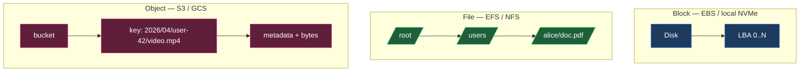
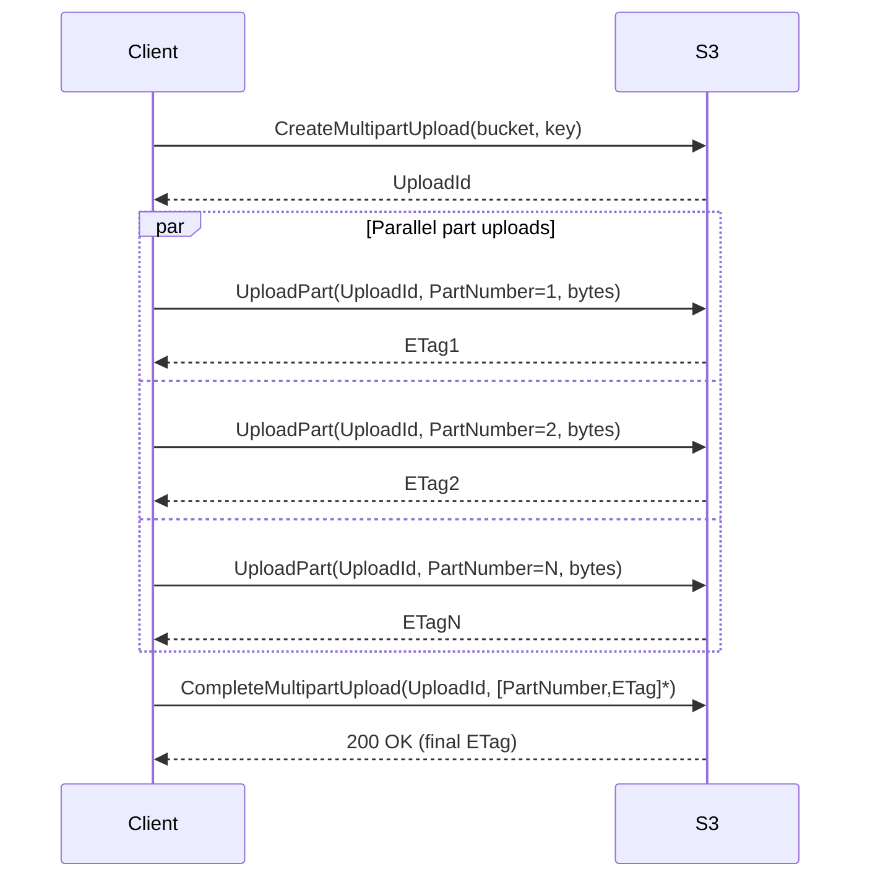
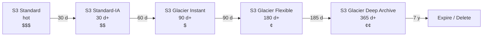
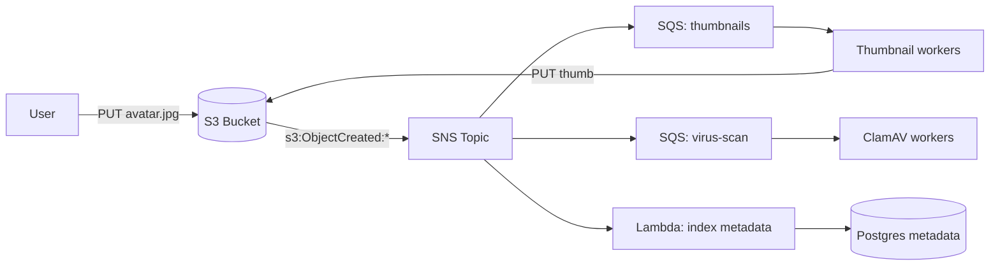
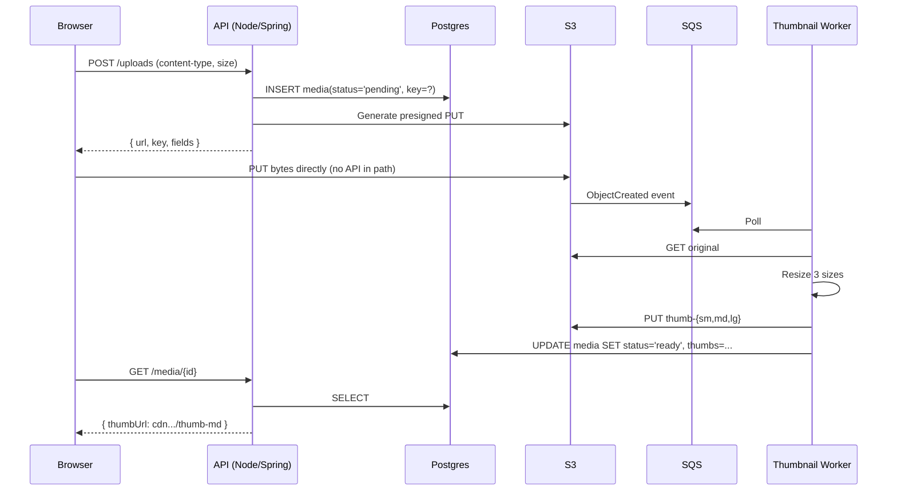

# Object and Blob Storage — S3-Style Systems, Chunking, Presigned URLs

**Date:** 2026-04-24 | **Updated:** 2026-04-24
**Tags:** `system-design` `building-blocks` `object-storage` `s3` `blob-storage`

## Table of Contents

- [Summary](#summary)
- [Object Storage vs Block Storage vs File Storage](#object-storage-vs-block-storage-vs-file-storage)
- [The S3 Model — Buckets, Objects, and the Flat Namespace](#the-s3-model--buckets-objects-and-the-flat-namespace)
- [Consistency — The 2020 Shift to Strong Read-After-Write](#consistency--the-2020-shift-to-strong-read-after-write)
- [Durability vs Availability](#durability-vs-availability)
- [Multipart Upload — Chunking, Parallelism, Resumability](#multipart-upload--chunking-parallelism-resumability)
- [Presigned URLs — Offloading Upload and Download](#presigned-urls--offloading-upload-and-download)
- [Lifecycle Policies — Hot, Infrequent, Cold, Archive](#lifecycle-policies--hot-infrequent-cold-archive)
- [Event Notifications](#event-notifications)
- [Access Control — Bucket Policies, IAM, ACLs](#access-control--bucket-policies-iam-acls)
- [Throughput and Hot Partitions](#throughput-and-hot-partitions)
- [When NOT to Use Object Storage](#when-not-to-use-object-storage)
- [Exemplars](#exemplars)
- [Design Integration Patterns](#design-integration-patterns)
- [Anti-Patterns](#anti-patterns)
- [Related](#related)
- [References](#references)

## Summary

Object storage is the default persistence layer for **unstructured, large, write-once data** — images, video, backups, logs, build artifacts, ML datasets. S3 and its compatibles expose a simple HTTP API over a **flat bucket-of-objects namespace**, trade POSIX semantics for **massive durability and horizontal scale**, and push heavy I/O off your app servers via **presigned URLs**. The important design decisions are: which storage class each object lives in, how keys are prefixed for throughput, how uploads are chunked for resumability, and how access is delegated without routing bytes through your API. Treat object storage as a **building block** you compose with a database (for metadata), a CDN (for read fan-out), and a queue (for event-driven processing).

## Object Storage vs Block Storage vs File Storage

Three different abstractions over the same spinning rust. Pick the one that matches your access pattern, not the one that is familiar.

| Dimension | Block Storage | File Storage | Object Storage |
|-----------|---------------|--------------|----------------|
| Unit | Fixed-size block (e.g. 4 KiB) | File with path | Object with key |
| Namespace | LBA (device-local) | Hierarchical tree | Flat within bucket |
| Protocol | iSCSI, NVMe, AWS EBS | NFS, SMB, AWS EFS | HTTP(S) REST, S3 API |
| Mutation | In-place block writes | In-place byte range | Whole-object replace |
| Typical latency | sub-ms | single-digit ms | tens of ms first-byte |
| Throughput scaling | per-volume IOPS cap | per-file-system cap | per-prefix, ~unbounded aggregate |
| Consistency | strict, POSIX | POSIX-ish | strong R-A-W, eventual listing |
| Fit | Databases, VMs, OS disks | Shared home dirs, legacy apps | Media, backups, data lakes, logs |



Rule of thumb: **if you would have used a file system in 2005 for this, use object storage in 2026** — unless the workload genuinely needs random-access mutation or POSIX semantics.

## The S3 Model — Buckets, Objects, and the Flat Namespace

An S3-style system has three primitives:

- **Bucket** — a named, globally/regionally unique container. Buckets live in a region. Access policies, lifecycle rules, encryption, and replication are configured at the bucket level.
- **Object** — a `(key, bytes, metadata)` triple. Keys are UTF-8 strings up to 1024 bytes on S3. Objects are immutable once written — "update" means replace the whole object (creating a new version if versioning is on).
- **Metadata** — system metadata (`Content-Type`, `Content-Length`, `ETag`, storage class, checksums) plus user-defined `x-amz-meta-*` headers.

### The flat namespace that looks hierarchical

S3 has **no directories**. The key `reports/2026/Q1/summary.pdf` is one opaque string. The console and CLI render slash-delimited prefixes as folders for human convenience, but internally the bucket is a sorted key-value store.

This has real consequences:

- **`ls` is a prefix scan** — `ListObjectsV2` with `Prefix=reports/2026/` and `Delimiter=/` walks the sorted index. Listing a "folder" with millions of siblings is slow.
- **No `rename`** — renaming is copy + delete, and for large objects that is a full re-upload at the server side.
- **Prefix is a partitioning hint** — see [Throughput and Hot Partitions](#throughput-and-hot-partitions).

```bash
# Create a bucket (S3)
aws s3api create-bucket --bucket acme-media-prod --region us-east-1

# Put an object with metadata
aws s3api put-object \
  --bucket acme-media-prod \
  --key "uploads/2026/04/user-42/avatar.jpg" \
  --body ./avatar.jpg \
  --content-type image/jpeg \
  --metadata uploaded-by=user-42,source=mobile

# List "under a folder" — really a prefix scan
aws s3api list-objects-v2 \
  --bucket acme-media-prod \
  --prefix "uploads/2026/04/" \
  --delimiter "/"
```

## Consistency — The 2020 Shift to Strong Read-After-Write

For nearly 15 years S3's consistency story was subtle: strong consistency for new-object PUTs in most regions, but **eventual consistency for overwrite PUTs, DELETEs, and LIST**. You could PUT an overwrite, GET the key back immediately, and still see the old version. Serious pipelines had to paper over this with DynamoDB metadata tables, retries, or S3Guard.

In **December 2020**, AWS announced that S3 now provides **strong read-after-write consistency for all operations** — PUTs, overwrites, DELETEs, and LIST — globally, at no extra cost. This was a genuinely hard distributed-systems result: AWS had to change the internal index protocol while serving trillions of requests per day, and it was released without an API version bump.

What you can now assume on S3 (and on S3-compatible systems that explicitly claim parity — GCS, Azure Blob, R2 all now offer strong consistency):

- After a successful PUT, any subsequent GET returns the new object.
- After a successful DELETE, any subsequent GET returns 404.
- LIST reflects committed PUTs and DELETEs.
- **Still eventual / weaker**: cross-region replication, cross-bucket copies, and billing/events.

> Do not assume strong consistency for *every* S3-compatible product. MinIO, Ceph RGW, Backblaze B2, and Cloudflare R2 all publish their own consistency semantics — read the docs before designing around them.

## Durability vs Availability

These are **different numbers** and people conflate them.

- **Durability** — probability that an object, once stored, survives. S3 Standard advertises **11 nines (99.999999999%)** of annual durability, meaning the expected loss rate for 10 million objects is one object every ~10,000 years.
- **Availability** — probability that the service can serve a request right now. S3 Standard SLA is **99.99%**, One Zone-IA is 99.5%, Glacier retrieval has its own latency SLOs.

Durability math sketch for 11 nines:

- Objects are chunked and erasure-coded (or replicated) across **≥ 3 availability zones** in a region.
- Independent disk failure probability is small; correlated failure across 3 AZs is extremely small.
- Continuous background scrubbing detects bit rot and rebuilds lost shards.
- The 11-nines number assumes regional durability. **A regional failure (fire, flood, misconfiguration blast-radius) is not modeled.** For true regional independence, use **Cross-Region Replication (CRR)** or a multi-region bucket.

Trade-offs by class:

| Class | Durability | Availability | AZs | Typical use |
|-------|------------|--------------|-----|-------------|
| S3 Standard | 11 nines | 99.99% | ≥ 3 | Hot data |
| S3 Standard-IA | 11 nines | 99.9% | ≥ 3 | Infrequent access, still ms latency |
| S3 One Zone-IA | 11 nines | 99.5% | 1 | Recreatable data, cheaper |
| S3 Glacier Instant | 11 nines | 99.9% | ≥ 3 | Archive, ms retrieval |
| S3 Glacier Flexible | 11 nines | 99.99% | ≥ 3 | Archive, minutes–hours retrieval |
| S3 Glacier Deep Archive | 11 nines | 99.99% | ≥ 3 | 7–10+ year retention, 12 h retrieval |

## Multipart Upload — Chunking, Parallelism, Resumability

A single PUT maxes out at 5 GiB on S3 and is fragile — one TCP hiccup at byte 4.9 GiB and you restart. **Multipart Upload** splits an object into parts (5 MiB – 5 GiB each, up to **10,000 parts**, so up to 5 TiB per object), uploads them in parallel, and assembles them server-side.

The protocol is three phases:



Why this matters in design:

- **Parallelism** — N parts can upload over N TCP connections. Big wins on fat long-haul links where a single stream is TCP-limited.
- **Resumability** — on failure, `ListParts` returns what's already uploaded; you re-upload only the missing parts. Essential for mobile clients.
- **Backpressure** — upload M parts at a time, not all N, to avoid saturating the client's uplink.
- **Byte-range integrity** — each part has its own `ETag` (MD5 by default, optionally SHA-256). The final object's ETag is `md5(concat(part_md5s)) + "-" + N`, not the MD5 of the whole body — a common surprise.
- **Abandoned uploads cost money** — parts of incomplete multipart uploads are billed until aborted. **Always set a lifecycle rule to abort incomplete uploads after N days.**

```bash
# Lifecycle rule to clean up abandoned multipart uploads
aws s3api put-bucket-lifecycle-configuration \
  --bucket acme-media-prod \
  --lifecycle-configuration '{
    "Rules": [{
      "ID": "abort-incomplete-mpu",
      "Status": "Enabled",
      "Filter": { "Prefix": "" },
      "AbortIncompleteMultipartUpload": { "DaysAfterInitiation": 7 }
    }]
  }'
```

## Presigned URLs — Offloading Upload and Download

A **presigned URL** is a time-limited, signed URL that grants a specific action (GET, PUT, POST) on a specific key, created with your IAM credentials but usable by an anonymous client. This is the single most important pattern in object-storage design.

Why it matters:

- **Your app server never handles the bytes.** Clients upload directly to S3 and download directly from S3 (or a CDN in front). Your server only mints URLs and records metadata.
- **Horizontal scale for free.** S3's throughput is not your app's throughput.
- **Least privilege.** A presigned URL is bounded by key, method, expiry, and (optionally) content-type/size/headers.

```ts
// TypeScript (Node) — presigned PUT for a browser upload
import { S3Client } from "@aws-sdk/client-s3";
import { PutObjectCommand } from "@aws-sdk/client-s3";
import { getSignedUrl } from "@aws-sdk/s3-request-presigner";

const s3 = new S3Client({ region: "us-east-1" });

export async function presignUpload(opts: {
  userId: string;
  contentType: string;
  maxBytes: number;
}): Promise<{ url: string; key: string; expiresAt: number }> {
  const key = `uploads/${new Date().toISOString().slice(0, 10)}/${opts.userId}/${crypto.randomUUID()}`;
  const cmd = new PutObjectCommand({
    Bucket: "acme-media-prod",
    Key: key,
    ContentType: opts.contentType,
    // ContentLength narrows what the client can upload; also enforce via bucket policy.
  });
  const url = await getSignedUrl(s3, cmd, { expiresIn: 300 });
  return { url, key, expiresAt: Date.now() + 300 * 1000 };
}
```

```python
# Python — presigned POST with size/content-type conditions (browser form uploads)
import boto3

s3 = boto3.client("s3", region_name="us-east-1")

def presign_post(key: str, max_bytes: int):
    return s3.generate_presigned_post(
        Bucket="acme-media-prod",
        Key=key,
        Fields={"Content-Type": "image/jpeg"},
        Conditions=[
            {"Content-Type": "image/jpeg"},
            ["content-length-range", 1, max_bytes],
        ],
        ExpiresIn=300,
    )
```

Security posture checklist:

- [ ] Short expiry (seconds–minutes, not days).
- [ ] Restrict the method (PUT-only, GET-only — don't mint LIST).
- [ ] Pin content-type and max content-length (use POST policy for conditions).
- [ ] Use a key pattern your app controls (namespace by user/tenant).
- [ ] Log issuance — you want an audit trail of who requested what.
- [ ] Use **server-side encryption**, ideally SSE-KMS with a tenant-scoped key.
- [ ] For downloads from private buckets, prefer **signed CDN URLs** (CloudFront/Cloud CDN signed URLs/cookies) to offload reads from S3 and get edge caching.

## Lifecycle Policies — Hot, Infrequent, Cold, Archive

Object storage is cheap *compared to block* but is not free. A bucket with no lifecycle rules will silently rack up bills forever. Lifecycle policies move or expire objects based on age, prefix, tag, or size.



Key design decisions:

- **Retrieval latency trade-off.** Glacier Flexible: minutes to hours. Deep Archive: up to 12 hours for standard, or ~48 h for Bulk. Your SLA must accept this.
- **Early-delete fees.** IA/Glacier classes have **minimum storage durations**. Deleting an object in IA after 10 days is billed as 30 days. Don't transition data that might be deleted soon.
- **Retrieval fees.** Glacier retrievals cost per-GB retrieved *and* per-request. Large batch restores should use `BulkRetrieval` with `Restore` requests, not one-at-a-time GETs.
- **Intelligent-Tiering.** S3 Intelligent-Tiering watches access patterns and moves objects between hot/infrequent/archive automatically — worth it when access is unpredictable.
- **Versioning interaction.** With versioning on, lifecycle rules can target *noncurrent versions* separately — typical pattern: keep current version hot, move noncurrent versions to IA after 30 d, delete after 90 d.

```bash
aws s3api put-bucket-lifecycle-configuration \
  --bucket acme-media-prod \
  --lifecycle-configuration '{
    "Rules": [
      {
        "ID": "age-out-uploads",
        "Status": "Enabled",
        "Filter": { "Prefix": "uploads/" },
        "Transitions": [
          { "Days": 30,  "StorageClass": "STANDARD_IA" },
          { "Days": 90,  "StorageClass": "GLACIER_IR" },
          { "Days": 365, "StorageClass": "DEEP_ARCHIVE" }
        ],
        "Expiration": { "Days": 2555 }
      }
    ]
  }'
```

## Event Notifications

S3 emits events on PUT, POST, COPY, DELETE, restore completion, and replication. Routes:

- **SNS** — fan-out to many subscribers.
- **SQS** — durable queue with at-least-once delivery to a worker fleet.
- **Lambda** — function invocation per event.
- **EventBridge** — richer filtering, cross-account routing, scheduling.

Typical uses:

- **Derivative generation** (thumbnails, transcode, OCR, virus scan) triggered by `s3:ObjectCreated:*`.
- **Metadata indexing** into PostgreSQL/OpenSearch on upload.
- **CDN invalidation** when a cached asset is replaced — though the more common pattern is **content-hashed keys that never need invalidation**.
- **Audit/compliance** shipping events to a SIEM.

Caveats:

- **At-least-once, not exactly-once.** Consumers must be idempotent — key on the object's versionId or a deterministic hash of the payload.
- **Ordering is not guaranteed across keys.** Within a key, `SequenceNumber` gives ordering hints but operational edge cases exist.
- **Events are eventually emitted** even though data is strongly consistent — don't gate user-visible state on event arrival unless you also have a reconciliation job.



## Access Control — Bucket Policies, IAM, ACLs

S3 has **three** overlapping access-control mechanisms, which is two too many. In 2026 the right default is clear.

| Mechanism | What it does | When to use |
|-----------|--------------|-------------|
| **IAM policies** | Policies attached to users/roles in your account | Principal-centric rules: "this service can write to this bucket" |
| **Bucket policies** | Policies attached to the bucket, JSON-based | Resource-centric rules: "deny all unencrypted PUTs", cross-account grants |
| **ACLs (legacy)** | Per-object/per-bucket legacy grants | **Avoid.** AWS now sets `BucketOwnerEnforced` by default, disabling ACLs. |
| **Presigned URLs** | Time-limited signed delegated actions | Temporary delegation to end-user clients |
| **Access Points** | Named policy endpoints for a bucket | Multi-tenant isolation at scale |

### Recommended default posture

1. **Block Public Access = ON** at the account level. Buckets are private. Public reads go through a CDN, not through S3's public endpoint.
2. **ACLs disabled** (BucketOwnerEnforced ownership). All access via policy.
3. **Deny unencrypted transport**:
   ```json
   {
     "Effect": "Deny",
     "Principal": "*",
     "Action": "s3:*",
     "Resource": ["arn:aws:s3:::acme-media-prod", "arn:aws:s3:::acme-media-prod/*"],
     "Condition": { "Bool": { "aws:SecureTransport": "false" } }
   }
   ```
4. **Deny uploads without SSE**:
   ```json
   {
     "Effect": "Deny",
     "Principal": "*",
     "Action": "s3:PutObject",
     "Resource": "arn:aws:s3:::acme-media-prod/*",
     "Condition": {
       "StringNotEquals": { "s3:x-amz-server-side-encryption": ["AES256", "aws:kms"] }
     }
   }
   ```
5. **Scope presigned URLs** by key prefix and HTTP method; never mint a URL that allows `s3:*`.
6. **Use Access Points** for multi-tenant isolation — each tenant gets a named endpoint with its own policy, instead of one giant bucket policy.

## Throughput and Hot Partitions

Per AWS's published performance guidance, S3 supports **at least 3,500 PUT/COPY/POST/DELETE and 5,500 GET/HEAD requests per second per prefix** in a bucket. Aggregate throughput across prefixes scales linearly: 10 prefixes → 10× the per-prefix budget.

In S3-speak a "prefix" is roughly a sharding hint for the internal partition layout. Historically (pre-2018) people had to **randomize the first characters of keys** to spread load across partitions. Since 2018, S3 auto-partitions as traffic grows, so you mostly don't need the `hex-hash-prefix/` trick — but you still want your keys to not concentrate writes into one logical prefix during a spike.

### Good key designs

- Time-partitioned writes spread across date prefixes:
  `logs/2026/04/24/14/<uuid>.json.gz` — each hour is its own prefix, natural spread.
- Tenant-first when tenants are many and similar:
  `tenants/{tenantId}/uploads/{uuid}` — each tenant partitions independently.
- Prefix reversed if the natural key is monotonic and hot:
  `ingest/{reversed-timestamp}/{id}` — avoids every new object piling into the tail of the key space.

### Bad key designs

- Everything under one deep folder: `media/all/{uuid}` — one prefix eventually hot.
- Monotonic timestamps with no sharding: `logs/{epoch}` — writes concentrate on the growing tail.
- Per-user nested too deep with a celebrity: `users/{id}/*` where one user gets 100× traffic.

### Read fan-out

For hot reads, don't scale S3 — put a **CDN in front** (CloudFront, Cloud CDN, Fastly). S3 becomes the origin; the CDN absorbs the fan-out. Use content-hashed keys (`assets/abc123def.jpg`) so you never need invalidations — new content = new key.

## When NOT to Use Object Storage

Object storage is wrong when you need:

- **Sub-millisecond latency.** First-byte latencies are tens of milliseconds. Use a cache, a local disk, or a database.
- **Byte-range updates to small files at high frequency.** Every "update" is a whole-object rewrite. A database or block volume fits better.
- **Transactions across multiple objects.** S3 has no multi-object atomicity. If you need `(object_a_write AND metadata_row_write)` atomic, stage it through a database + outbox.
- **Strong ordering across keys.** Event ordering is best-effort; if you need a totally ordered log, use Kafka.
- **POSIX semantics.** `fsync`, byte-range locks, `rename`-atomic, hard links — object storage doesn't do these. Mounts like `s3fs` paper over the gap and will bite you.
- **Many small files with frequent LIST.** LIST is a paginated sorted scan. 10 M tiny objects in one prefix with frequent "show me what's there" requests is painful and expensive. Either aggregate (tar / parquet batches) or put a metadata DB in front.

## Exemplars

| System | Notes |
|--------|-------|
| **AWS S3** | The reference. Strong R-A-W consistency since 2020. Widest ecosystem integration. |
| **Google Cloud Storage (GCS)** | Strong consistency from the start. Similar lifecycle/storage classes (Standard, Nearline, Coldline, Archive). XML API is S3-like, JSON API is native. |
| **Azure Blob Storage** | Three blob types: Block (S3-equivalent), Append (log-append optimized), Page (VHD-backed). Hot/Cool/Cold/Archive tiers. Hierarchical namespace mode (ADLS Gen2) actually gives you folders with atomic rename. |
| **Cloudflare R2** | S3-compatible API, **zero egress fees** — the single biggest cost shift for read-heavy workloads. Strong consistency. Pairs well with Workers. |
| **Backblaze B2** | S3-compatible, dramatically cheaper storage and egress than S3. Smaller ecosystem. |
| **MinIO** | Self-hostable, S3-compatible. Good for on-prem / air-gapped / dev parity. Erasure-coded pools across nodes. |
| **Ceph RGW** | Self-hostable, S3 and Swift compatible. Part of the Ceph distributed storage stack (also provides block via RBD and file via CephFS). |
| **OpenStack Swift** | The original non-S3 object store. Eventually consistent; less common today. |

S3 API compatibility is a de facto standard — most SDKs can talk to R2, B2, MinIO, and GCS (via interop mode) by just changing the endpoint URL. This gives you **escape hatches and portability** even when AWS is your primary.

## Design Integration Patterns

### Pattern 1 — Browser direct upload + thumbnail pipeline



Key points: API never proxies bytes; DB is source of truth for metadata and state; events trigger derivative work; CDN serves reads.

### Pattern 2 — Large media upload with resumable presigned multipart

For files > 100 MiB on flaky networks, use presigned multipart:

1. Client calls API `POST /uploads/start` → API calls `CreateMultipartUpload`, returns `uploadId` + `key`.
2. For each part, client calls API `POST /uploads/{id}/parts/{n}/url` → API returns a presigned URL for `UploadPart`.
3. Client uploads parts in parallel directly to S3.
4. On disconnect, client calls `POST /uploads/{id}/parts` → API returns `ListParts` result; client resumes missing parts.
5. Client calls API `POST /uploads/{id}/complete` with the part list → API calls `CompleteMultipartUpload`.
6. Nightly lifecycle rule aborts incomplete MPUs after 7 days.

### Pattern 3 — Archive with restore flow

Compliance data lands in Standard, transitions to Glacier Deep Archive at 365 days, retained 7 years. Restore flow:

1. User requests archive restore → API `POST /archives/{id}/restore`.
2. API issues `RestoreObject` with a tier (Standard 12 h, Bulk 48 h) and `Days` copy-in-hot-tier duration.
3. API writes a job row with `status=restoring, eta`.
4. Lambda listens for `s3:ObjectRestore:Completed` events, updates job status to `ready`, emails user a signed URL valid for 24 hours.
5. At `Days` expiry, the restored copy evaporates; original archive remains.

## Anti-Patterns

| Anti-pattern | Why it hurts | Fix |
|--------------|--------------|-----|
| **Proxying bytes through app servers** | Your API becomes an I/O hog; throughput = your server's bandwidth, not S3's. | Presigned URLs for direct-to-S3 up/download; CDN for reads. |
| **Treating bucket policies as ACLs** | ACLs are legacy, confusing, and AWS now disables them by default. Policies express intent better and audit cleanly. | Use IAM + bucket policy + presigned URLs. Leave `BucketOwnerEnforced` on. |
| **No lifecycle rules** | Orphaned multipart uploads + old versions + dev junk → quietly 5–10× expected cost. | Abort-incomplete-MPU after 7 d; transition-to-IA/Glacier for cold prefixes; expire old noncurrent versions. |
| **Hot-prefix hot-spotting** | One prefix saturates its per-prefix request budget; throttles and 503s at scale. | Spread keys across many prefixes; tenant/time-based prefixing; reverse monotonic keys. |
| **Using object storage as a database** | LIST-as-query, `HEAD` to check existence, whole-object rewrite for a field update. Latency and cost balloon. | Metadata in a database (Postgres, DynamoDB). Objects hold bytes; DB holds the "shape" of the data. |
| **Relying on eventual consistency semantics that no longer hold** | Stale guides still recommend S3Guard and tombstones. On modern S3 this is dead weight. | Delete the workaround; use strong R-A-W. |
| **Public-read buckets instead of signed URLs/CDN** | Leaks, hot-linking, cost surprises, no revocation. | Block Public Access on; CloudFront OAC for public read; presigned URLs for gated. |
| **Trusting event delivery as exactly-once** | Duplicate thumbnails, double-billed processing. | Idempotent consumers keyed on `versionId` or deterministic content hash. |
| **Deleting in IA/Glacier without minimum-duration awareness** | Billed for full minimum period. | Don't transition objects that might die young; use Intelligent-Tiering if access is unknown. |
| **Ignoring the ETag trap** | MPU ETag ≠ MD5 of the body; scripts that verify integrity via ETag break silently. | Use `x-amz-checksum-sha256` (or additional checksums) explicitly for multi-part uploads. |

## Related

- [Load Balancers in System Design](load-balancers.md) — how read traffic ends up hitting a CDN in front of object storage.
- [Caching Layers — Client, CDN, Reverse-Proxy, Application, Distributed](caching-layers.md) — CDN-as-cache on top of S3 origin.
- [Databases as a Component](databases-as-a-component.md) — the metadata DB that always sits alongside object storage.
- [Message Queues & Brokers](message-queues-and-brokers.md) — how S3 events fan out via SNS/SQS/EventBridge.
- [CDN and Edge Networks](../../networking/infrastructure/cdn-and-edge.md) — the wire-level detail for the edge tier in front of object storage.
- [Reverse Proxies and Gateways](../../networking/infrastructure/reverse-proxies-and-gateways.md) — when a reverse proxy in front of S3 makes sense (and when it doesn't).

## References

- [Amazon S3 — How it works / Architecture](https://docs.aws.amazon.com/AmazonS3/latest/userguide/Welcome.html) — official S3 concepts: buckets, objects, keys, storage classes.
- [Amazon S3 now delivers strong read-after-write consistency (AWS News, Dec 2020)](https://aws.amazon.com/blogs/aws/amazon-s3-update-strong-read-after-write-consistency/) — the consistency shift, explained.
- [Amazon S3 Data Consistency Model](https://docs.aws.amazon.com/AmazonS3/latest/userguide/Welcome.html#ConsistencyModel) — current guarantees in the user guide.
- [Amazon S3 Multipart Upload Overview](https://docs.aws.amazon.com/AmazonS3/latest/userguide/mpuoverview.html) — part sizes, limits, lifecycle, abort behavior.
- [Best Practices Design Patterns: Optimizing S3 Performance](https://docs.aws.amazon.com/AmazonS3/latest/userguide/optimizing-performance.html) — per-prefix request rates, parallelism guidance.
- [Using presigned URLs](https://docs.aws.amazon.com/AmazonS3/latest/userguide/using-presigned-url.html) — signing process and security considerations.
- [Google Cloud Storage — Storage classes](https://cloud.google.com/storage/docs/storage-classes) — Standard / Nearline / Coldline / Archive semantics.
- [Azure Blob Storage — Introduction](https://learn.microsoft.com/en-us/azure/storage/blobs/storage-blobs-introduction) — block/append/page blobs, access tiers, hierarchical namespace.
- [Announcing Cloudflare R2 Storage](https://blog.cloudflare.com/introducing-r2-object-storage/) — zero-egress S3-compatible object storage.
- [Cloudflare R2 Documentation](https://developers.cloudflare.com/r2/) — API compatibility matrix and consistency semantics.
