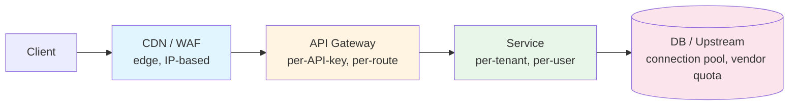
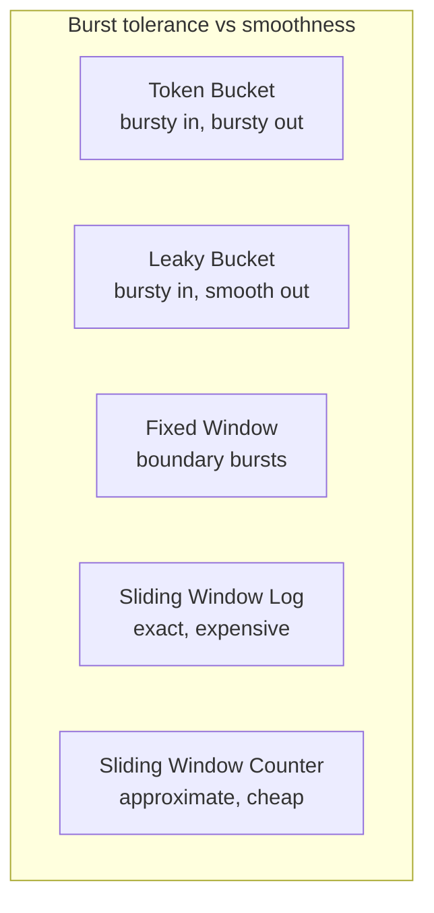
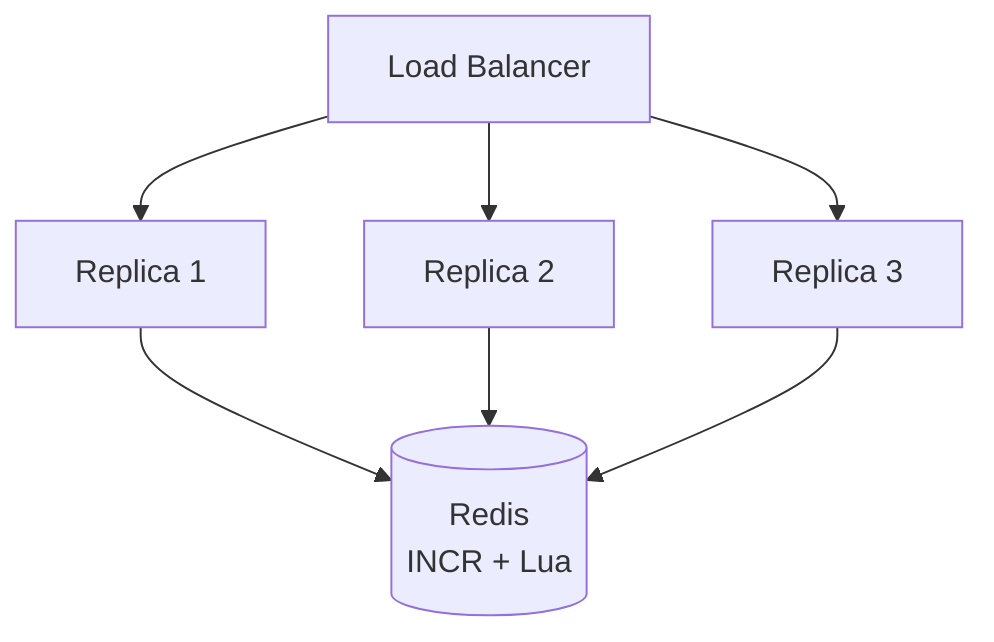

# Rate Limiters — Token Bucket, Leaky Bucket, Sliding Window

**Date:** 2026-04-24 | **Updated:** 2026-04-24
**Tags:** `system-design` `building-blocks` `rate-limiting` `algorithms` `resilience`

## Table of Contents

- [Summary](#summary)
- [Why Rate Limit](#why-rate-limit)
- [Where to Apply It](#where-to-apply-it)
- [Algorithms](#algorithms)
  - [Fixed Window Counter](#fixed-window-counter)
  - [Sliding Window Log](#sliding-window-log)
  - [Sliding Window Counter](#sliding-window-counter)
  - [Token Bucket](#token-bucket)
  - [Leaky Bucket](#leaky-bucket)
  - [Algorithm Comparison](#algorithm-comparison)
- [Distributed Rate Limiting](#distributed-rate-limiting)
- [Consistency Trade-offs](#consistency-trade-offs)
- [Dimensions — What You Limit On](#dimensions--what-you-limit-on)
- [Responses — Telling Clients They're Limited](#responses--telling-clients-theyre-limited)
- [Graceful Degradation Under Rate Limiting](#graceful-degradation-under-rate-limiting)
- [Common Anti-Patterns](#common-anti-patterns)
- [Related](#related)
- [References](#references)

## Summary

A **rate limiter** enforces an upper bound on the number of operations a caller can perform in a given window. It exists to protect finite resources (CPU, DB connections, external API quotas), enforce fairness across tenants, defend against abuse, cap costs, and preserve SLOs for well-behaved traffic. The algorithm you pick determines three things: **burst behaviour**, **memory cost**, and **accuracy at the window boundary**. Token bucket is the default when you want burst tolerance; leaky bucket is the default when you want a smooth output rate; sliding window counter is what most CDNs actually ship because it's a cheap, accurate-enough approximation. In a distributed system, a shared store (usually Redis) with atomic Lua scripts is the pragmatic answer — and the consistency trade-off (exact vs approximate) is almost always more important than the algorithm itself.

## Why Rate Limit

Rate limiting is a defensive **building block**, not a feature. It sits alongside timeouts, retries, circuit breakers, and bulkheads in the resilience toolkit. You reach for it whenever one caller's behaviour can harm others.

- **Protect finite resources** — a single runaway client should not saturate your DB connection pool, your Kafka producer quota, or your upstream vendor API.
- **Enforce fairness across tenants** — in a multi-tenant SaaS, one tenant's Black Friday should not degrade every other tenant. Per-tenant limits turn a noisy-neighbour problem into a contract.
- **Defend against abuse** — credential stuffing, scraping, signup fraud, and enumeration attacks all rely on high request rates. A rate limiter is a blunt but effective first line.
- **Cost control** — when you pay per request (OpenAI, Twilio, SendGrid, a paid search API) an unbounded client loop can generate real money in minutes. The limiter is the fuse.
- **SLO protection** — degrading one aggressive client to 429s is almost always better than degrading p99 latency for everyone. Rate limiting is load shedding with a specific policy.

The cost of _not_ rate limiting scales with blast radius. An internal script with no limit is mildly embarrassing. An unauthenticated public endpoint with no limit is an incident waiting for a crawler.

## Where to Apply It

Rate limiting is applied in **layers**, not in one place. Each layer has a different goal and a different data model.



- **Edge (CDN/WAF)** — Cloudflare, Akamai, AWS WAF. Coarse, IP-based, aimed at bots and volumetric abuse. Cheapest place to drop a request. Cannot easily see authenticated user identity.
- **API gateway** — Kong, Envoy, AWS API Gateway, Apigee. Per-API-key and per-route limits. This is where _product_ rate limits (free tier = 1 000 req/day) usually live.
- **Service** — inside the application. Per-user, per-tenant, per-endpoint. This is where _business_ rate limits live (a user can only create 10 invoices per minute), because only the service knows the domain.
- **DB / upstream** — connection pools and vendor quotas are themselves rate limiters. Your in-process limiter should reserve headroom so you never _hit_ the downstream limit.

A request typically passes through three or four of these. The edge catches 95% of junk cheaply; the gateway catches quota abuse; the service catches domain-specific abuse.

## Algorithms

Every rate-limiting algorithm answers the same question — "should this request be allowed right now?" — with different trade-offs between **burst tolerance**, **smoothness**, **memory**, and **accuracy**.

### Fixed Window Counter

Divide time into fixed buckets (e.g., one-minute buckets aligned to the wall clock). Keep a counter per caller per bucket. Allow the request if the counter is below the limit; otherwise reject.

```python
# Pseudocode — fixed window
def allow(user_id: str, limit: int, window_secs: int) -> bool:
    now = int(time.time())
    bucket = now - (now % window_secs)     # align to window start
    key = f"rl:{user_id}:{bucket}"
    count = store.incr(key)
    if count == 1:
        store.expire(key, window_secs)
    return count <= limit
```

**Trade-offs**

- Dead simple, O(1) memory per caller.
- **Boundary problem**: a caller who sends `limit` requests at 11:59:59 and another `limit` requests at 12:00:00 gets `2 × limit` through in two seconds, because they straddle the bucket boundary.
- Pick it when: you need something in an afternoon and the boundary burst is acceptable (internal tools, coarse abuse protection).

### Sliding Window Log

Store the **timestamp** of every request in a sorted set per caller. On each request, drop timestamps older than `now - window` and count what's left.

```python
# Pseudocode — sliding window log
def allow(user_id: str, limit: int, window_secs: int) -> bool:
    now = time.time()
    key = f"rl:{user_id}"
    store.zremrangebyscore(key, 0, now - window_secs)   # evict old
    count = store.zcard(key)
    if count >= limit:
        return False
    store.zadd(key, {str(uuid4()): now})
    store.expire(key, window_secs)
    return True
```

**Trade-offs**

- **Exact** — no boundary problem, no approximation.
- Memory is O(requests per window per caller). At 10 000 req/min per caller × 1M callers, this is painful.
- Pick it when: accuracy is a compliance or billing requirement and traffic volume is modest.

### Sliding Window Counter

The pragmatic middle ground, and what **Cloudflare** and **AWS** largely use. Keep two fixed-window counters (previous and current). Estimate the effective rate as a weighted sum proportional to how far into the current window you are.

```text
effective = current_count + previous_count × (1 - elapsed_in_current / window)
```

```python
# Pseudocode — sliding window counter
def allow(user_id: str, limit: int, window_secs: int) -> bool:
    now = time.time()
    current_bucket = int(now // window_secs)
    previous_bucket = current_bucket - 1
    elapsed = (now % window_secs) / window_secs          # 0.0..1.0

    cur = store.get(f"rl:{user_id}:{current_bucket}") or 0
    prev = store.get(f"rl:{user_id}:{previous_bucket}") or 0
    estimate = cur + prev * (1 - elapsed)

    if estimate >= limit:
        return False
    store.incr(f"rl:{user_id}:{current_bucket}")
    store.expire(f"rl:{user_id}:{current_bucket}", 2 * window_secs)
    return True
```

**Trade-offs**

- O(1) memory per caller, only two counters.
- Bounded error versus true sliding window (Cloudflare reports ~0.003% error at typical traffic).
- No severe boundary burst, because the previous window's weight decays linearly.
- Pick it when: you want sliding-window accuracy at fixed-window cost. **Default for most API gateways.**

### Token Bucket

Model a bucket of tokens that refills at rate `r` tokens/sec, capped at capacity `B`. Each request consumes one token (or more, for weighted cost). Reject if not enough tokens.

```ts
// Pseudocode — token bucket
type Bucket = { tokens: number; lastRefill: number };

function allow(b: Bucket, rate: number, capacity: number, cost = 1): boolean {
  const now = Date.now() / 1000;
  const elapsed = now - b.lastRefill;
  b.tokens = Math.min(capacity, b.tokens + elapsed * rate);
  b.lastRefill = now;
  if (b.tokens >= cost) {
    b.tokens -= cost;
    return true;
  }
  return false;
}
```

**Trade-offs**

- **Burst-friendly** — a client who has been quiet can spend `B` tokens in one burst, then is limited to the refill rate `r`. This matches real user behaviour (humans click in bursts, batch jobs pulse).
- Two parameters give you independent control of _sustained rate_ (`r`) and _burst size_ (`B`).
- O(1) state per caller (`tokens`, `lastRefill`).
- Pick it when: you need a sensible default for user-facing APIs. This is what **Stripe**, **GitHub**, and most "good" public APIs publish.

### Leaky Bucket

Think of a queue with a fixed outflow rate. Requests enter the queue; if the queue is full, they're rejected; the server drains the queue at a steady rate `r`.

```ts
// Pseudocode — leaky bucket (as a queue)
type Bucket = { queue: Request[]; capacity: number; rate: number };

function enqueue(b: Bucket, req: Request): boolean {
  if (b.queue.length >= b.capacity) return false; // reject
  b.queue.push(req);
  return true;
}

// background: every 1/rate seconds, dequeue and process one request
```

**Trade-offs**

- **Smooth output** — downstream sees a perfectly steady rate regardless of input burstiness. Ideal when the thing you're protecting cannot burst (a downstream with a strict QPS contract, a hardware device, a metered billing sink).
- **Adds queueing latency** — a request that arrives when the queue has N items waits `N/r` seconds. Under sustained load this latency grows to the queue cap, then drops requests.
- You're trading tail latency for smoothness. Know which one your caller cares about.
- Pick it when: the downstream cares about smoothness more than instantaneous throughput (video encoding pipelines, SMS gateways, scheduled batch into a third-party).

### Algorithm Comparison



| Algorithm              | Memory/caller       | Accuracy        | Bursts      | When to pick                                  |
| ---------------------- | ------------------- | --------------- | ----------- | --------------------------------------------- |
| Fixed window           | O(1)                | Boundary bursts | Allows 2×   | Quick internal tool, coarse abuse             |
| Sliding window log     | O(requests)         | Exact           | Configurable| Billing, compliance, low volume               |
| Sliding window counter | O(1) (two counters) | ~99.99%         | Smoothed    | API gateway default                           |
| Token bucket           | O(1)                | Exact w/ params | Up to B     | User-facing APIs, default for public APIs     |
| Leaky bucket           | O(queue)            | Exact           | No bursts   | Smooth output into a strict downstream        |

## Distributed Rate Limiting

Single-node counters break the moment you put more than one replica behind a load balancer. Two replicas each allowing `limit` requests gives `2 × limit` through. You need a **shared state store** that all replicas consult.



**Redis** is the overwhelmingly common choice: in-memory, millisecond latency, atomic primitives, TTLs built in. Two layers of correctness to think about.

**Naive `INCR` + `EXPIRE`** has a race: if the process crashes between `INCR` and `EXPIRE`, the key never expires and the caller is limited forever.

```lua
-- fixed window via atomic Lua script
-- KEYS[1] = counter key, ARGV[1] = limit, ARGV[2] = window seconds
local current = redis.call('INCR', KEYS[1])
if current == 1 then
  redis.call('EXPIRE', KEYS[1], ARGV[2])
end
if current > tonumber(ARGV[1]) then
  return 0  -- denied
end
return 1    -- allowed
```

Lua scripts run atomically in Redis — the `INCR` and `EXPIRE` cannot be interleaved by another client. Sliding-window and token-bucket implementations follow the same pattern: read counters or bucket state, compute, conditionally write, all in one script.

Alternatives to Redis:

- **Envoy's rate limit service** (gRPC, backed by a store you pick) — the reference model for service-mesh-wide limiting.
- **Per-node local counters with a side channel** — each node keeps its own counter; gossip the sum periodically. Lower latency, weaker consistency. Used at very high QPS where a Redis hop is too expensive.
- **Client-side rate limiting** — the client enforces the budget. Only useful when you trust the client (internal services, SDKs you control).

## Consistency Trade-offs

**Exact** distributed rate limiting requires a synchronous hop to a shared store on every request. At a million QPS, that's a million Redis round-trips — often the dominant cost of a request.

**Approximate** rate limiting is almost always acceptable:

- Allow up to, say, 10% over the stated limit.
- Each node keeps a local counter, syncs to Redis every N ms or every M requests.
- Used at scale by nearly every public API you've heard of.

The decision question: _what happens if a caller gets 110 requests through in a minute when the limit is 100?_ If the answer is "nothing bad", you can drop the synchronous hop. If the answer is "we charge the wrong amount" or "we exceed our upstream quota", you cannot.

## Dimensions — What You Limit On

The **key** you use to bucket requests defines who is being throttled against whom.

- **Per-IP** — edge and anti-abuse default. Beware: mobile carriers NAT thousands of users behind one IP; corporate networks do the same. An IP limit of 100 req/min can break a whole office.
- **Per-user / per-session** — requires auth. Fair across tenants, but does not protect against signup-spray attacks before auth exists.
- **Per-API-key** — the standard for product limits. Billable, revocable, identifiable.
- **Per-endpoint** — `POST /login` gets 5/min, `GET /search` gets 100/min. Expensive endpoints earn tighter limits.
- **Per-tenant** — in a multi-tenant SaaS, the tenant is the fair-share unit.
- **Hierarchical** — combine dimensions: a request must pass _both_ the per-user and per-tenant limit. A noisy user inside a quiet tenant is throttled on their own key; a tenant-wide burst is throttled at the tenant key.

```text
Allow if: tokens(user=u) >= 1 AND tokens(tenant=t) >= 1
```

Hierarchical limits are how you keep one user from burning the whole tenant's quota while still enforcing a tenant-level contract.

## Responses — Telling Clients They're Limited

Return **HTTP 429 Too Many Requests** (RFC 6585). Do not return 503 — 503 means _you_ are broken; 429 means _the caller_ exceeded their contract.

Include actionable headers. The IETF draft `draft-ietf-httpapi-ratelimit-headers` standardises this; adopt the draft now, it is stable enough for production.

```http
HTTP/1.1 429 Too Many Requests
Content-Type: application/json
Retry-After: 30
RateLimit-Limit: 100
RateLimit-Remaining: 0
RateLimit-Reset: 30
RateLimit-Policy: 100;w=60

{
  "error": "rate_limited",
  "message": "Limit is 100 requests per minute. Retry in 30 seconds.",
  "retry_after_seconds": 30
}
```

- `Retry-After` — seconds (or HTTP-date) until the client may retry. Existed before the draft and is understood by most HTTP stacks.
- `RateLimit-Limit`, `RateLimit-Remaining`, `RateLimit-Reset` — current policy, tokens left, seconds until reset.
- Legacy `X-RateLimit-*` headers (GitHub style) are still widely seen; emitting both during migration is common.

On the limited client side, treat 429 as **backpressure signalling**: slow down, retry with exponential backoff **and jitter**, and (if wrapped in a circuit breaker) consider a short open-circuit window to avoid stampeding the server.

## Graceful Degradation Under Rate Limiting

Rate limiting is only half of the resilience story. The other half is how the system behaves _around_ it.

- **Client retry with jitter** — `sleep = base × 2^attempt × random(0.5, 1.5)`. Without jitter, all rate-limited clients retry at the same moment and create a thundering herd every `retry_after` seconds.
- **Circuit breaker integration** — when 429 rates cross a threshold, open the breaker and stop sending. Pair with [backpressure and flow-control patterns](#) (Tier 3).
- **Shed vs queue** — a busy service can either drop excess requests (shed, low latency, caller retries) or queue them (queue, higher latency, bounded). Shedding is almost always the right default for interactive traffic; queueing is right for async/batch where latency is cheap.
- **Degrade, don't fail** — if a non-critical downstream is limiting you, serve a cached or partial response rather than a 5xx.
- **Priority lanes** — a high-priority request (a logged-in paying user's checkout) should not be shed while a low-priority one (a cron scraping your own analytics) still gets through. Implement with separate queues or token budgets per priority class.

## Common Anti-Patterns

- **`INCR` without atomic `EXPIRE`** — the classic. If the process crashes or loses connection between the two commands, the key lives forever and the caller is permanently limited. Always use a Lua script or `SET NX EX` pattern.
- **No jitter on client retries** — `Retry-After: 30` with synchronized clocks means every limited client retries at exactly `t+30`. Add `± 30%` jitter on the client.
- **IP-only limiting for mobile users** — carriers NAT thousands of users behind one egress IP. An IP limit low enough to stop abuse is low enough to break a subway carriage of legitimate users. Pair with device/session fingerprinting.
- **No escape hatch for internal services** — a health check, a debugger, or your own paging runbook script must not be rate-limited. Allowlist internal callers by network, mTLS identity, or a reserved API key class.
- **Limiting in the wrong layer** — rate limiting a cheap cached GET at the app layer wastes CPU. Push it to the CDN. Conversely, limiting a business-logic action (create invoice) at the edge hides the limit from the team that owns the rule.
- **Global limit without per-tenant limit** — one hot tenant consumes the whole pool and everyone else sees 429s. Always pair a global ceiling with per-tenant fairness.
- **Static limits** — a limit set two years ago is almost certainly wrong now. Review limits quarterly; track `429s / total` and `p99 limit consumption` as SLIs.
- **Silent rate limiting** — returning 200 with an empty body when limited. The client can't tell it's rate limited and won't back off. Always return 429 with clear headers.
- **Rate limiting as your only abuse defence** — rate limits stop _volume_, not _intent_. Pair with CAPTCHAs, bot scoring, account age heuristics, and proof-of-work for signup-class abuse.

## Related

- [API Gateways and BFF — Edge Layer, Auth, Routing, and Per-Client Shaping](api-gateways-and-bff.md) — where most product-level rate limits actually live, and how the gateway interacts with service-level limits
- Backpressure, Timeouts, and Circuit Breakers (Tier 3, planned) — the rest of the resilience toolkit; a 429 is just one backpressure signal among many
- Designing a Distributed Rate Limiter Service (Tier 10 case study, planned) — end-to-end design applying this doc's algorithms at scale

## References

- [Scaling your API with rate limiters — Stripe Engineering](https://stripe.com/blog/rate-limiters) — four practical limiter types Stripe runs in production, with code and lessons learned
- [How we built rate limiting capable of scaling to millions of domains — Cloudflare](https://blog.cloudflare.com/counting-things-a-lot-of-different-things/) — sliding window counter approximation and the trade-offs at CDN scale
- [Throttle API requests for better throughput — AWS API Gateway](https://docs.aws.amazon.com/apigateway/latest/developerguide/api-gateway-request-throttling.html) — token-bucket-based throttling, burst vs steady-state, account-level vs per-key limits
- [Rate limiting — redis.io docs](https://redis.io/docs/latest/develop/use/patterns/distributed-locks/) and [Pattern: rate limiter](https://redis.io/commands/incr/#pattern-rate-limiter) — the canonical `INCR` + `EXPIRE` pattern and its Lua-atomic variant
- [RateLimit header fields for HTTP — IETF draft-ietf-httpapi-ratelimit-headers](https://datatracker.ietf.org/doc/draft-ietf-httpapi-ratelimit-headers/) — the standard for `RateLimit-Limit`, `-Remaining`, `-Reset`, `-Policy` headers
- [RFC 6585 — Additional HTTP Status Codes](https://datatracker.ietf.org/doc/html/rfc6585#section-4) — the definition of 429 Too Many Requests and `Retry-After`
- [Global rate limiting — Envoy Proxy](https://www.envoyproxy.io/docs/envoy/latest/intro/arch_overview/other_features/global_rate_limiting) — the reference design for a rate-limit-as-a-service gRPC interface used by service meshes
- [System Design Interview — Design a rate limiter (Alex Xu, excerpted)](https://bytebytego.com/courses/system-design-interview/design-a-rate-limiter) — interview-style walkthrough covering algorithm choice, distributed state, and header design
