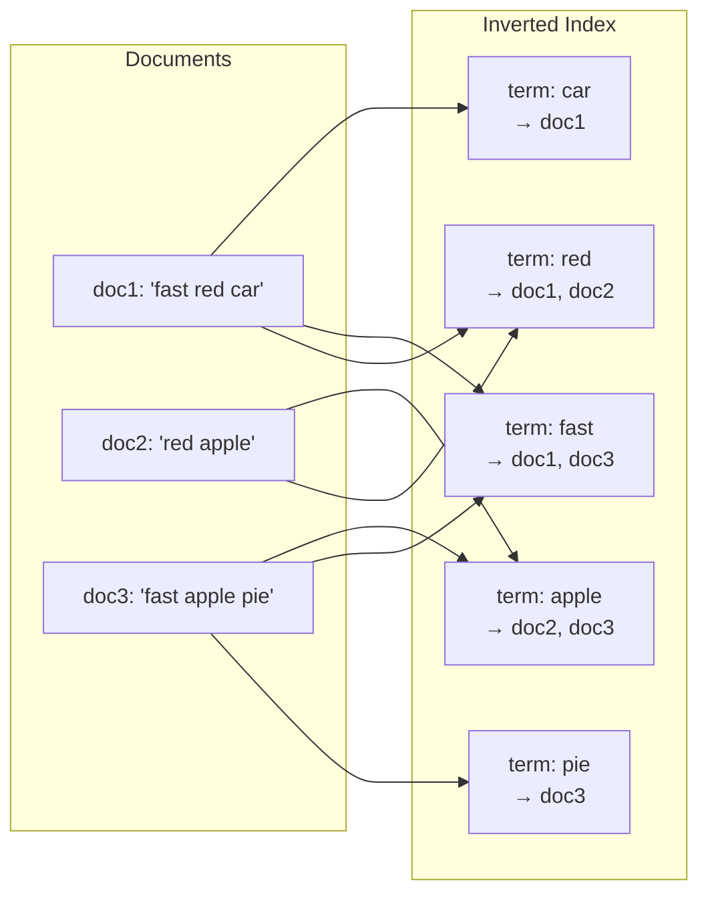
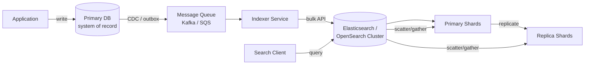
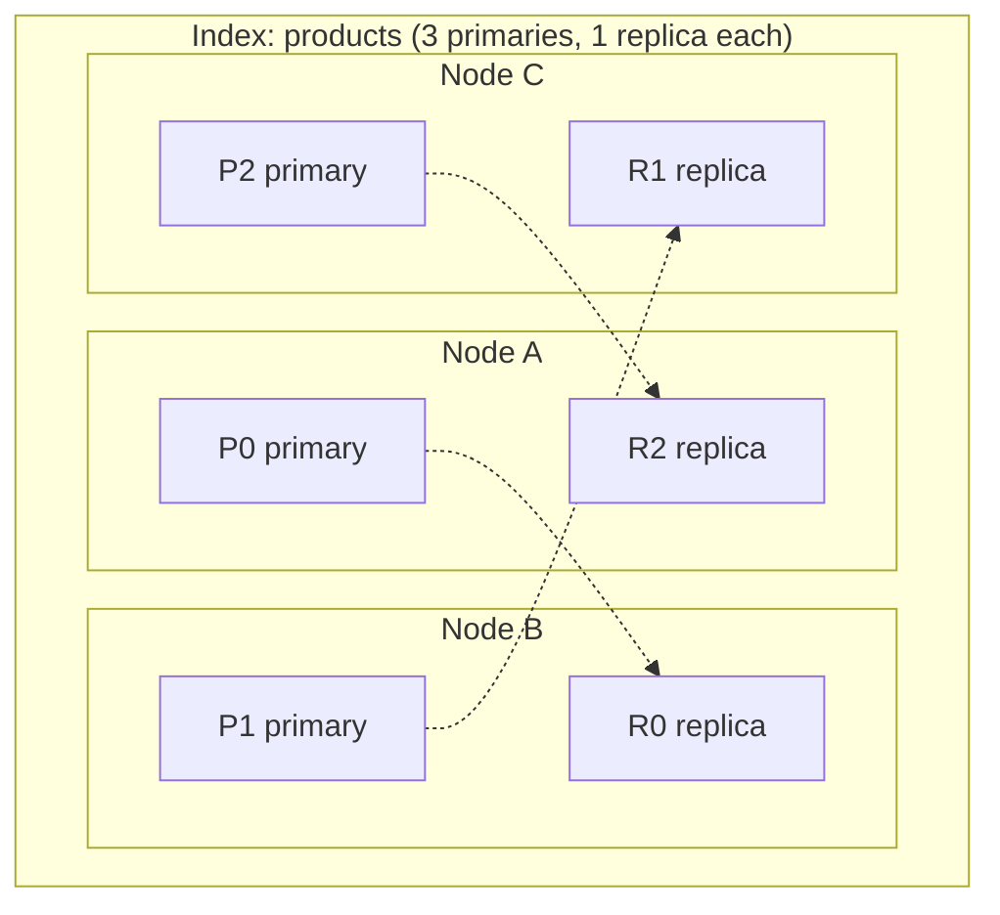
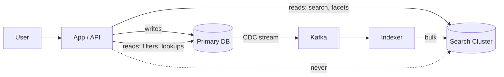

# Search Systems — Inverted Index, Elasticsearch / OpenSearch

**Date:** 2026-04-24 | **Updated:** 2026-04-24
**Tags:** `system-design` `building-blocks` `search` `elasticsearch` `inverted-index`

## Table of Contents

- [Summary](#summary)
- [Why a Separate Search System](#why-a-separate-search-system)
- [What a Search Engine Actually Is](#what-a-search-engine-actually-is)
  - [The Inverted Index](#the-inverted-index)
  - [Term Dictionary and Posting Lists](#term-dictionary-and-posting-lists)
  - [Tie-in to Postgres GIN](#tie-in-to-postgres-gin)
- [Analysis Pipeline](#analysis-pipeline)
- [Ingest Flow](#ingest-flow)
- [Relevance — TF-IDF, BM25, and Beyond](#relevance--tf-idf-bm25-and-beyond)
- [Facets and Aggregations](#facets-and-aggregations)
- [Sharding and Replication in Elasticsearch](#sharding-and-replication-in-elasticsearch)
- [Where It Fits in the Architecture](#where-it-fits-in-the-architecture)
- [Consistency and Freshness Trade-offs](#consistency-and-freshness-trade-offs)
- [Vector Search — The New Frontier](#vector-search--the-new-frontier)
- [Exemplars — The Search Landscape](#exemplars--the-search-landscape)
- [Decision Guidance](#decision-guidance)
- [Anti-Patterns](#anti-patterns)
- [Related](#related)
- [References](#references)

## Summary

A search system is a **specialized read-side projection** of your data optimized for full-text, faceted, and relevance-ranked queries — problems that relational indexes were never designed to solve efficiently. At its core sits the **inverted index**: a map from term → list of documents containing that term, built by an analysis pipeline that tokenizes, normalizes, and stems text. Elasticsearch and OpenSearch wrap Apache Lucene with clustering, sharding, replication, and an HTTP/JSON API. The hard parts are not "how do I query?" — they are **ingest topology, freshness vs throughput trade-offs, shard sizing, reindexing under schema change, and never treating the search cluster as your system of record**.

## Why a Separate Search System

SQL `LIKE '%term%'` and B-tree indexes work for lookups, range scans, and exact equality. They fall apart when you need:

| Requirement | Why SQL Struggles |
|---|---|
| **Full-text search** over long text fields | `LIKE '%x%'` can't use B-tree; sequential scan at terabyte scale is fatal |
| **Relevance ranking** (not just filter) | SQL returns a set, not a *sorted-by-score* set — no TF-IDF/BM25 primitive |
| **Fuzzy / typo tolerance** | `LIKE` is exact substring; Levenshtein in SQL is slow and painful |
| **Synonyms / stemming** (running → run) | Requires an analysis pipeline; SQL treats tokens as opaque |
| **Faceting** (counts per brand / price bucket) | `GROUP BY` works but does N scans for N facets; search engines do it in one pass over the posting lists |
| **Multi-field queries with field boosts** | Expressible but slow; search engines compile to optimized Lucene queries |
| **Highlighting of matched terms** | Not a database primitive |

Postgres has **GIN + `tsvector` / `pg_trgm`** and it is genuinely good enough for single-node catalogs up to a few million documents — we cover that in the [database path](../../database/INDEX.md). Beyond that, or when you need distributed faceting and relevance tuning, you outgrow the database and reach for a dedicated search engine.

## What a Search Engine Actually Is

### The Inverted Index

A forward index maps `doc_id → list of terms in the doc`. This is what a document store gives you. It's useless for "which documents contain the word *coffee*?" — you'd scan every document.

An **inverted index** flips that: `term → list of doc_ids containing the term` (plus positions, frequencies, and offsets). Given a query, you look up each query term's posting list and intersect/union them.



Query `fast AND apple` → intersect `{doc1, doc3} ∩ {doc2, doc3} = {doc3}`.

### Term Dictionary and Posting Lists

Two physical pieces:

- **Term dictionary** — a sorted data structure (in Lucene, a finite state transducer / FST) mapping terms to a pointer into the posting list file. Stored in-memory-mapped, supports prefix lookup.
- **Posting list** — for each term, a compressed list of `(doc_id, term_frequency, positions[])`. Delta-encoded and packed; skip-lists let intersections skip over non-matching documents.

Lucene stores these on disk in **immutable segments**. Writes produce new segments; segments are periodically merged. Deletes are tombstones applied at merge time. This immutability is why search engines love bulk indexing and hate tiny, constant, single-doc updates.

### Tie-in to Postgres GIN

A **GIN (Generalized Inverted Index)** in Postgres is literally an inverted index — same concept, bolted into the database. Each indexed term points to a posting tree of row TIDs. It's what makes `tsvector @@ tsquery` and `jsonb ? 'key'` and `pg_trgm` operators fast. If you understand GIN, you understand 80% of what Lucene does — the rest is distribution, richer analysis, scoring, and aggregations. See the [database path](../../database/INDEX.md) for GIN internals.

## Analysis Pipeline

Before a term enters the inverted index, it passes through an **analyzer**: a chain of `character filters → tokenizer → token filters`.

```text
"The Running Shoes!"
  ↓ char filter (strip HTML, normalize unicode)
"The Running Shoes!"
  ↓ tokenizer (standard: whitespace + punctuation)
["The", "Running", "Shoes"]
  ↓ lowercase filter
["the", "running", "shoes"]
  ↓ stop-word filter (remove "the")
["running", "shoes"]
  ↓ stemmer (Porter/Snowball)
["run", "shoe"]
  ↓ synonym filter (shoe → [shoe, sneaker, trainer])
["run", "shoe", "sneaker", "trainer"]
```

Key decisions:

- **Tokenization** — whitespace vs n-gram vs keyword vs language-specific. CJK languages need dedicated tokenizers (ICU, Kuromoji, Nori). URLs, emails, and hashtags often need custom tokenizers.
- **Normalization** — lowercasing, ASCII folding (café → cafe), unicode normalization (NFC/NFKC).
- **Stop words** — removing high-frequency low-signal terms (*the, a, of*). Trade-off: phrase queries like *"to be or not to be"* break if you strip stop words.
- **Stemming vs lemmatization** — stemming is cheap and crude (*running → run*, *universal → univers*). Lemmatization is dictionary-based and grammatical. Stemming is the default in Lucene.
- **Synonyms** — index-time vs search-time. Index-time bloats the index but is fast; search-time keeps the index small but every query expands. Search-time is usually preferred.
- **Language analyzers** — Elasticsearch ships per-language bundles (`english`, `french`, `japanese`) combining appropriate tokenizer + stemmer + stop words.

**Critical rule**: the **same analyzer must run at index time and query time**, or your query terms won't match the indexed terms. This is the source of half of all "search works in dev but not prod" bugs.

## Ingest Flow

A production ingest pipeline rarely writes directly from the application to the search cluster. The shape:



Why this shape:

1. **DB is the system of record.** The search cluster is derived state — you must be able to rebuild it from scratch.
2. **CDC or transactional outbox** decouples write latency from indexing latency. Covered in the [data consistency path](../../database/INDEX.md). Direct dual-writes (app → DB + app → ES) are the classic broken pattern because nothing is atomic across both stores.
3. **Indexer service** batches into **bulk API** calls. Bulk indexing is 10–100x faster than per-doc POST because it amortizes network round-trips and segment flushes.
4. **Near-real-time (NRT) refresh** — Elasticsearch batches writes into an in-memory buffer and flushes to a searchable segment every `refresh_interval` (default **1 second**). Reducing this to 100ms is possible but crushes throughput. For high-volume ingest, set `refresh_interval: 30s` or even `-1` during bulk loads and refresh manually at the end.
5. **Read replicas** serve queries. Replica count is tunable per index.

```json
// Bulk indexing request
POST /_bulk
{ "index": { "_index": "products", "_id": "1" } }
{ "title": "Running Shoes", "price": 79.99, "brand": "Acme" }
{ "index": { "_index": "products", "_id": "2" } }
{ "title": "Trail Runners", "price": 129.99, "brand": "Zephyr" }
```

## Relevance — TF-IDF, BM25, and Beyond

A search engine returns *sorted* results. The sort key is a **relevance score** per `(query, document)` pair.

**TF-IDF** (term frequency × inverse document frequency) — the old default.

- **TF** — how often the term appears in *this* document (more is better).
- **IDF** — how rare the term is across the *whole corpus* (rarer terms carry more signal; "the" has low IDF).
- Score = sum over query terms of `TF × IDF`.

**BM25** — Lucene's default since ~2016, and Elasticsearch's default since 5.0. A refinement of TF-IDF with two tuning parameters:

- `k1` — term frequency saturation. Past a point, more occurrences don't keep boosting the score. (Default 1.2.)
- `b` — length normalization. Longer documents are penalized because they trivially accumulate more term matches. (Default 0.75.)

```text
                      f(q_i, D) · (k1 + 1)
BM25(D, Q) = Σ IDF(q_i) · ─────────────────────────────────────
                      f(q_i, D) + k1 · (1 - b + b · |D| / avgdl)
```

You don't need to memorize the formula — you need to know:

- BM25 is the default; it's good.
- You can **boost** fields: a match in `title^3` contributes 3x vs `body^1`.
- You can override scoring with **function_score** (recency boost, popularity boost, geo-distance decay).
- **Learning-to-rank (LTR)** — train a gradient-boosted model (LambdaMART, XGBoost) on click-through data or human judgments, and let the model re-rank the top-N from BM25. Elasticsearch has an LTR plugin; OpenSearch has it built in. Most teams are not ready for LTR — ship BM25 + manual boosts + synonyms first.

```json
// Query with field boosts and recency boost
{
  "query": {
    "function_score": {
      "query": {
        "multi_match": {
          "query": "running shoes",
          "fields": ["title^3", "description", "brand^2"]
        }
      },
      "functions": [
        {
          "gauss": {
            "published_at": {
              "origin": "now",
              "scale": "30d",
              "decay": 0.5
            }
          }
        }
      ],
      "score_mode": "multiply"
    }
  }
}
```

## Facets and Aggregations

Facets are the "filter by brand / price range / category" sidebars on e-commerce sites. They are where search engines bury SQL.

Given a query, the engine returns:

- the matched documents (the page of results), **and**
- **counts** for each facet value across the *full* result set (not just the page).

```json
// Search + facets in one round-trip
{
  "query": { "match": { "title": "running shoes" } },
  "aggs": {
    "by_brand":  { "terms": { "field": "brand.keyword" } },
    "by_price":  {
      "range": {
        "field": "price",
        "ranges": [
          { "to": 50 },
          { "from": 50, "to": 100 },
          { "from": 100 }
        ]
      }
    },
    "avg_price": { "avg": { "field": "price" } }
  }
}
```

Aggregations run over the posting lists directly and use **doc values** (a columnar on-disk structure Lucene keeps alongside the inverted index). That's why a single query can return results + 10 facets + an average in one pass — you'd never get that shape from SQL without a data cube or materialized view per facet.

Nested aggregations, date histograms, cardinality estimates (HyperLogLog), and percentile aggregations are all first-class.

## Sharding and Replication in Elasticsearch

An **index** is split into **primary shards** (each a full Lucene index). Each primary has zero or more **replica shards** on other nodes.



**Routing**: by default, `shard = hash(doc_id) % primary_count`. Writes go to the primary first, then replicate. Reads fan out to any copy (primary or replica) of every shard and merge results (scatter-gather).

**Custom routing**: you can force all documents for `tenant_id=X` onto the same shard by specifying `?routing=tenant_X`. Queries filtered by that tenant only touch one shard. Essential for multi-tenant designs.

**Resharding pain**: the primary shard count is **fixed at index creation**. You cannot add primary shards to an existing index — you must create a new index with the desired layout and **reindex** (with `_reindex` API or external pipeline), then atomically swap an alias. This is the single most important sizing decision. Common guidance:

- Aim for shards of 10–50 GB each.
- Don't go below ~1 GB per shard (too many tiny shards inflates cluster-state overhead).
- Don't go above ~50 GB per shard (slow recovery, slow merges).
- Plan for 2–3x current data size so you don't reindex every six months.

**Replicas** are for (a) HA (survive a node failure) and (b) read throughput. Add replicas freely at runtime; they're dynamic.

**Index lifecycle management (ILM)** — for time-series data (logs, metrics, events), rotate to a new index daily/weekly and use aliases. Delete old indices rather than deleting documents (deleting is expensive; dropping an index is cheap).

## Where It Fits in the Architecture



**Mental model: the search cluster is a read-only projection**, not a primary store. Rules:

1. **Writes never go to ES from the app directly.** They go to the DB. CDC or the transactional outbox propagates to ES.
2. **On schema change, reindex.** Mapping changes in ES are severely limited (you can add fields but can't change field types). The standard play: create `products_v2`, reindex from DB, flip the alias, drop `products_v1`.
3. **You can rebuild ES from the DB at any time.** If you can't, your architecture is wrong. Back up the DB; the search index is derivable.
4. **Search results should often re-hydrate from the DB for final rendering.** Store only search-relevant fields in ES (title, facets, tags). The rich document can be loaded from the primary by ID after the search returns. This keeps the search index small and fast.

## Consistency and Freshness Trade-offs

Search is **eventually consistent** with the primary store, always. The question is how much lag is acceptable.

| Knob | Effect |
|---|---|
| `refresh_interval` (default 1s) | Lower = fresher queries, higher indexing CPU + more small segments to merge |
| Bulk size | Bigger bulks = higher throughput, higher per-doc latency before it's searchable |
| Replica count | More replicas = more read throughput, slower writes (wait for replication) |
| `wait_for_active_shards` | Stronger write durability at cost of write latency |

Typical production defaults:

- User-facing search: `refresh_interval: 1s`, accept ~1–3 seconds of lag.
- Bulk backfill / reindex: `refresh_interval: -1` during load, then refresh once at end.
- Logging / observability: `refresh_interval: 30s` or higher; freshness doesn't matter, throughput does.

**Read-your-writes in search is hard.** A user creates a product and immediately searches for it — the product may not appear yet because it's in the in-memory buffer. Options:

- Fall back to direct DB lookup for "my recent items" views.
- Force a refresh on the write path (`?refresh=true`) — slow, don't do this at volume.
- Use `?refresh=wait_for` — blocks until the next scheduled refresh picks it up. Reasonable for occasional user-visible writes.

## Vector Search — The New Frontier

Classical search matches *tokens*. It struggles with semantic similarity: a query for "dog food" won't match a product titled "canine nutrition" unless you've painstakingly built synonyms.

**Vector search** embeds documents and queries into a high-dimensional space (via a neural model — sentence transformers, OpenAI embeddings, etc.) and retrieves by nearest-neighbor distance (cosine / dot product). Semantically similar text ends up near each other in vector space even without shared tokens.

Ecosystem:

- **Elasticsearch / OpenSearch** — native `dense_vector` field with HNSW (Hierarchical Navigable Small World) indexing. Good for teams already on ES.
- **Specialized vector DBs** — Pinecone, Weaviate, Qdrant, Milvus. Optimized purely for ANN (approximate nearest neighbor) at scale.
- **pgvector** — Postgres extension. Fine up to a few million vectors on a single box. Covered in the [database path](../../database/INDEX.md).

**Hybrid retrieval** — the winning pattern in 2024–2026. Run BM25 and vector search in parallel, then combine with **Reciprocal Rank Fusion (RRF)** or a learned re-ranker. You get lexical precision (exact product names, SKUs, brand tokens) *and* semantic recall (paraphrase tolerance). Elasticsearch and OpenSearch both ship RRF out of the box.

```json
// Hybrid BM25 + vector in OpenSearch
{
  "query": {
    "hybrid": {
      "queries": [
        { "match": { "title": "running shoes" } },
        { "knn": { "title_vector": { "vector": [...], "k": 50 } } }
      ]
    }
  }
}
```

## Exemplars — The Search Landscape

| System | Type | Strengths | Weaknesses |
|---|---|---|---|
| **Elasticsearch** | Self-hosted / Elastic Cloud | The default; huge ecosystem, rich aggregations, ILM, vector support | Heavyweight; licensing changed (SSPL/Elastic License) in 2021 |
| **OpenSearch** | AWS-led fork of ES 7.10 | Open source (Apache 2.0); native to AWS; good vector + hybrid | Forked API diverges from ES over time; smaller ecosystem |
| **Apache Solr** | Self-hosted | Mature, battle-tested (older than ES); strong in enterprise | Less momentum; harder distribution story than ES |
| **Meilisearch** | Self-hosted, lightweight | Fast, simple config, typo tolerance by default, great DX | Less rich aggregations; not for TB-scale |
| **Typesense** | Self-hosted / Typesense Cloud | Developer-first, fast, fixed-schema, sane defaults | Smaller than ES ecosystem; less tunable |
| **Algolia** | Hosted SaaS | Best-in-class search-as-you-type, instant; zero ops | Expensive at scale; vendor lock-in |
| **Lucene** | Library | Powers ES, OpenSearch, Solr | Raw — you build the cluster yourself |

Special mention: **ClickHouse** has bolted on full-text indexing, and **Postgres FTS + pgvector** keeps closing the gap for small-to-medium catalogs.

## Decision Guidance

**Postgres FTS (`tsvector` + GIN) is enough when:**

- Corpus fits on one machine comfortably (< ~10M docs, depending on doc size).
- You don't need distributed faceting over the full corpus.
- One language, simple relevance, simple synonyms.
- You want one fewer system to operate.
- Transactional consistency with the primary data matters (search updates *in the same transaction* as the write).

**Reach for Elasticsearch / OpenSearch when:**

- Data volume exceeds what a single Postgres can faceted-query under latency SLO.
- You need rich aggregations, percentiles, nested facets.
- Multiple languages, custom analyzers, synonym management at scale.
- You need logs/metrics ingest alongside search (observability stack).
- You want learning-to-rank or hybrid vector + BM25.

**Reach for Algolia / Typesense when:**

- Time-to-ship matters more than long-term cost control.
- You need search-as-you-type UX (< 50 ms tail latency) and don't want to operate it.
- Small team, no dedicated search engineer.

**Reach for a dedicated vector DB (Pinecone, Weaviate) when:**

- Vector is the *primary* retrieval mode, not a supplement.
- 100M+ vectors with strict ANN latency SLOs.
- You already have an ES cluster but it's not the right place for embeddings at scale.

## Anti-Patterns

1. **Search cluster as system of record.** The one that ends careers. ES is not a database — no transactions, weaker durability guarantees, weak schema evolution, recovery is slow. If you can't rebuild it from another store, you've already lost data; you just don't know yet.
2. **Direct app writes to ES with no source of truth.** "We'll just write to ES from the API." Now your DB and ES disagree, you can't rebuild, and there's no CDC story. Write to the DB, project to ES.
3. **Dual writes without the outbox pattern.** `app.db.insert(); app.es.index();` — the second call fails, and now the stores diverge silently. Use the transactional outbox or CDC.
4. **Single massive index, no routing.** Every query fans out to every shard on every node. Kills p99 latency. Shard by tenant / time / region where appropriate.
5. **Ignoring refresh interval.** Default 1s is fine for search; catastrophic for high-volume log ingest. Tune per workload.
6. **Mismatch between index-time and query-time analyzers.** "Works in dev, doesn't match in prod" — almost always this.
7. **Changing a field's mapping in place.** You can't. Create a new index, reindex, swap alias. Plan for it.
8. **Over-sharding small indexes.** 30 primary shards for a 500 MB index wastes cluster-state memory. Under-shard first, reindex later if needed.
9. **No index lifecycle management for time-series data.** Unbounded index growth, eventually OOM on the master. Use ILM, rotate, delete old indices.
10. **Treating BM25 output as gospel.** BM25 is a strong baseline, not the end. Add field boosts, synonyms, recency decay, and measure with real click-through data.
11. **Vector-only retrieval for e-commerce.** Product SKUs, brand names, and exact terms disappear in semantic space. Always hybrid for e-commerce / catalog.

## Related

- [Database Path](../../database/INDEX.md) — PostgreSQL GIN / full-text search / `pg_trgm`, where search lives *inside* the database, and pgvector for embeddings.
- [Caching Layers](caching-layers.md) — putting a result cache in front of search is cheap and massive; search queries are cacheable by query-string hash.
- [Message Queues & Brokers](message-queues-and-brokers.md) — the ingest pipeline between DB and search cluster almost always runs over Kafka or similar.
- [Databases as a Component](databases-as-a-component.md) — search is one axis of polyglot persistence; this doc frames when to split stores.
- [Read/Write Splitting & Cache Strategies](../scalability/read-write-splitting-and-cache-strategies.md) _(Tier 3)_ — search is conceptually a read-side projection; the patterns overlap.

## References

- [Elasticsearch Reference](https://www.elastic.co/guide/en/elasticsearch/reference/current/index.html) — the canonical reference for mapping, analysis, query DSL, aggregations, and cluster operations.
- [OpenSearch Documentation](https://opensearch.org/docs/latest/) — the Apache-2.0 fork; concepts largely track ES with AWS-oriented additions (hybrid search, security plugin, k-NN).
- [Apache Lucene Documentation](https://lucene.apache.org/core/documentation.html) — the engine beneath ES, OpenSearch, and Solr. Read the `org.apache.lucene.index` package docs for segment and inverted-index internals.
- [BM25 — Okapi BM25 (Wikipedia)](https://en.wikipedia.org/wiki/Okapi_BM25) — canonical formulation and references to the original Robertson/Spärck Jones papers.
- [Turnbull & Berryman — *Relevant Search*](https://www.manning.com/books/relevant-search) (Manning, 2016) — the standard practical book on relevance tuning with Elasticsearch/Solr.
- [Meilisearch Documentation](https://www.meilisearch.com/docs) — modern lightweight alternative; good reference for typo-tolerance and ranking-rules-as-config.
- [Typesense Documentation](https://typesense.org/docs/) — developer-first search engine; clean data model and good primer on fast instant search.
- [Algolia Engineering Blog](https://www.algolia.com/blog/engineering/) — high-quality writing on search UX, ranking, and operational patterns of a hosted search provider.
- [PostgreSQL Full-Text Search](https://www.postgresql.org/docs/current/textsearch.html) — for the "is Postgres enough?" branch of the decision; compare GIN with Lucene.
