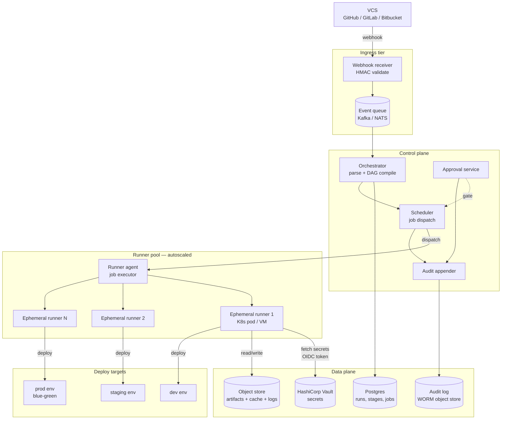

# Design a CI/CD Pipeline — DAG Execution, Ephemeral Runners, and Safe Promotion

**Date:** 2026-04-25 | **Updated:** 2026-04-25
**Tags:** `system-design` `case-study` `devops` `ci-cd` `medium`
**Difficulty:** Medium | **Type:** HLD | **Estimated read:** 30–35 min

## Table of Contents

- [Summary](#summary)
- [1. Functional Requirements](#1-functional-requirements)
- [2. Non-Functional Requirements](#2-non-functional-requirements)
- [3. Capacity Estimation](#3-capacity-estimation)
- [4. API Design](#4-api-design)
  - [Trigger API](#trigger-api)
  - [Status API](#status-api)
  - [Logs API](#logs-api)
  - [Webhook ingress](#webhook-ingress)
- [5. Data Model](#5-data-model)
  - [Pipeline definition](#pipeline-definition)
  - [Run, stage, job](#run-stage-job)
  - [Artifact and audit log](#artifact-and-audit-log)
- [6. High-Level Architecture](#6-high-level-architecture)
- [7. Deep Dives](#7-deep-dives)
  - [7.1 DAG execution and failure isolation](#71-dag-execution-and-failure-isolation)
  - [7.2 Runner autoscaling and ephemerality](#72-runner-autoscaling-and-ephemerality)
  - [7.3 Secrets injection and vault integration](#73-secrets-injection-and-vault-integration)
  - [7.4 Environment promotion and approvals](#74-environment-promotion-and-approvals)
  - [7.5 Caching — dependencies and layers](#75-caching--dependencies-and-layers)
  - [7.6 Blue-green, canary, and rollback](#76-blue-green-canary-and-rollback)
  - [7.7 Audit log and tamper resistance](#77-audit-log-and-tamper-resistance)
- [8. Bottlenecks & Trade-offs](#8-bottlenecks--trade-offs)
- [9. Anti-Patterns](#9-anti-patterns)
- [Related](#related)
- [References](#references)

## Summary

A CI/CD pipeline is a **distributed workflow engine** dressed in DevOps clothing. Behind the friendly `.yml` file sit hard problems — translate a declarative DAG into a scheduled job graph, hand each job to a freshly minted ephemeral runner, inject short-lived secrets without writing them to disk, fan out matrix builds in parallel, cache aggressively without leaking state across tenants, and gate the final hop into production behind human approval and a rollback story.

This case study designs a multi-tenant CI/CD platform modelled on the architectural shapes of GitHub Actions, GitLab CI, Tekton, Argo Workflows, and Drone CI. The blueprint covers VCS webhook ingress, a stateless orchestrator that compiles pipelines into job DAGs, an autoscaled pool of single-use runners, a content-addressed artifact store with build/layer caching, Vault-backed secret injection, environment promotion with manual approvals, and an append-only audit log that survives the rest of the system.

The design emphasises **per-job isolation** as the load-bearing primitive: every job runs in its own runner, with its own secrets scope, its own filesystem, its own network policy. Once isolation holds, the rest — caching, autoscaling, promotion — composes cleanly on top.

## 1. Functional Requirements

The platform must support:

- **VCS-driven triggers.** Webhooks from GitHub, GitLab, or Bitbucket on `push`, `pull_request`, `tag`, and `schedule`. Triggers may also be manual (UI button) or upstream-pipeline-driven.
- **Declarative pipeline definitions.** YAML in the repo (`.ci/pipeline.yml` or `.github/workflows/*`). The orchestrator parses and validates the file before scheduling.
- **DAG execution.** Stages compose into a directed acyclic graph: `build → test → deploy`. Within a stage, jobs may run in parallel; across stages, downstream jobs wait on upstream success.
- **Matrix builds.** Fan out one job over a Cartesian product of parameters (OS × runtime version × architecture) — see [GitHub Actions matrix docs][gh-matrix].
- **Runner pool.** Auto-scaled, ephemeral runners that come up clean for each job and are destroyed on completion. Mix of self-hosted and provider-managed.
- **Artifact storage.** Each job can publish artifacts (binaries, test reports, container images) and consume artifacts from upstream jobs.
- **Secrets management.** Pipelines reference secrets by name; the platform injects them at runtime from a vault, never persists them in the pipeline definition.
- **Environment promotion.** Deploy stage targets named environments (`dev`, `staging`, `prod`) with per-environment config and approval policies.
- **Manual approvals.** Production deploys block on a human reviewer. Approvers come from an ACL.
- **Failure isolation.** A failing job does not corrupt downstream jobs; transient failures retry; the runner is replaced if it crashes.
- **Caching.** Dependency caches (npm, pip, Maven, Cargo) and Docker layer caches keyed by lockfile or Dockerfile hash.
- **Deploy strategies.** Blue-green and canary hooks invokable from the deploy stage.
- **Rollback.** One-click revert to the previous green release.
- **Audit log.** Tamper-resistant record of who triggered what, what was approved, what was deployed, and when.
- **Logs and artifacts retention.** Searchable logs, configurable retention.

## 2. Non-Functional Requirements

| NFR | Target | Why |
|-----|--------|-----|
| Webhook → first job scheduled | **< 5 s p95** | Developer feedback loop; perceived latency belongs to the platform, not VCS. |
| Runner cold-start | **< 30 s p95** | Most jobs run < 5 minutes; a slow runner doubles wall-clock. |
| Concurrency | **10k+ concurrent jobs** | A mid-size org runs thousands of merges per day; peak is bursty. |
| Throughput | **100k+ jobs/day** | One service-tier above small SaaS, comparable to mid-sized GitHub Enterprise instance. |
| Pipeline isolation | **Strong** — no shared state across tenants or runs | Security boundary; see anti-patterns. |
| Availability | **99.9%+** orchestrator | Outages stall every team. Webhook ingress can buffer briefly. |
| Audit durability | **WORM**, ≥ 7 years | Compliance (SOC 2, PCI). |
| Cache hit rate | **> 80%** for repeat builds | Dominates wall-clock for most modern builds. |
| Secret blast radius | **Per-job, per-environment** | A leaked CI token must not unlock production. |

## 3. Capacity Estimation

**Traffic.** Assume **5k engineers**, 50 merges/engineer/day, average pipeline = 12 jobs. That's **3M jobs/day** at the high end, or about **35 jobs/s** sustained, **150 jobs/s** peak (midday burst). Webhooks land at ~1k/s during peak.

**Compute.** Average job runs 4 minutes on 2 vCPU, 4 GB RAM. At 150 concurrent jobs, that's **300 vCPU, 600 GB RAM** of runner capacity. With 80th-percentile concurrency around 10k jobs in flight (long-running E2E suites), peak runner capacity is **20k vCPU**.

**Artifact storage.**

```text
Avg artifacts per pipeline: ~50 MB (binaries + test reports)
3M jobs/day × 50 MB = ~150 TB/day raw

With dedup (content-addressed) and 30-day hot retention:
  Hot: ~20 TB after dedup
  Warm/cold (S3 IA / Glacier): ~unbounded with lifecycle policy
```

**Logs.** ~5 MB/job × 3M jobs = **15 TB/day** raw. Compressed (gzip) ~3 TB. Retention 90 days → ~270 TB. Hot for 7 days, cold thereafter.

**Cache store.** Per-repo dependency cache 200 MB–2 GB; container layer cache 5–20 GB per service. **~5 PB** at the high end across an enterprise; lifecycle to S3 IA after 7 days idle.

**Database.**

```text
Pipelines, runs, stages, jobs metadata: ~10 KB per run × 3M runs/day × 90 days
  = ~2.7 TB hot OLTP store
Audit log (append-only, WORM): ~1 KB/event × 50M events/day = ~50 GB/day
```

Postgres handles run metadata; audit log streams to immutable object storage with checksum chains.

## 4. API Design

### Trigger API

REST. Idempotent on the `(commit_sha, pipeline_ref)` pair so duplicate webhooks are safe.

```http
POST /v1/pipelines/{pipeline_id}/runs
Authorization: Bearer <oidc-token>
Content-Type: application/json

{
  "ref": "refs/heads/main",
  "commit_sha": "a1b2c3d4...",
  "trigger": {
    "kind": "webhook",
    "vcs_event": "push",
    "actor": "user@example.com"
  },
  "inputs": {
    "skip_e2e": false
  }
}

201 Created
{
  "run_id": "run_01HZAB...",
  "status": "queued",
  "url": "https://ci.example.com/runs/run_01HZAB..."
}
```

The orchestrator deduplicates by `(pipeline_id, commit_sha, trigger_kind, ref)` within a configurable window. Re-running an identical trigger returns the existing `run_id` rather than spawning a new run.

### Status API

```http
GET /v1/runs/{run_id}
{
  "run_id": "run_01HZAB...",
  "pipeline_id": "...",
  "status": "running",            // queued | running | succeeded | failed | cancelled
  "started_at": "2026-04-25T09:14:22Z",
  "stages": [
    {"name": "build", "status": "succeeded"},
    {"name": "test",  "status": "running",  "jobs_total": 12, "jobs_done": 7},
    {"name": "deploy","status": "pending"}
  ]
}
```

A streaming variant (`GET /v1/runs/{id}/events` over SSE or WebSocket) emits state-transition events for live UI.

### Logs API

Paginated and streamable; supports tailing while the job runs.

```http
GET /v1/jobs/{job_id}/logs?since_offset=42915&limit=4096
GET /v1/jobs/{job_id}/logs?stream=true        # SSE / chunked
```

Logs are stored as append-only segments in object storage; the API hydrates the live tail from a small in-memory ring buffer on the runner agent until the job ends, then serves from object store.

### Webhook ingress

```http
POST /v1/webhooks/{provider}
X-Hub-Signature-256: sha256=...

# GitHub-shape body, GitLab-shape body, etc.
```

The ingress validates the HMAC signature, normalises the payload to an internal event, and enqueues it. **It returns 202 immediately** and never blocks on pipeline scheduling — the only synchronous work is signature validation and durable enqueue.

## 5. Data Model

### Pipeline definition

```yaml
# .ci/pipeline.yml
version: 1
stages: [build, test, deploy]

jobs:
  build:
    stage: build
    runner:
      labels: [linux, x64]
    steps:
      - uses: actions/checkout@v4
      - run: ./scripts/build.sh
    artifacts:
      paths: [dist/]
    cache:
      key: ${{ hashFiles('package-lock.json') }}
      paths: [node_modules/]

  test:
    stage: test
    needs: [build]
    strategy:
      matrix:
        os: [ubuntu-22.04, macos-14]
        node: [18, 20, 22]
    steps:
      - uses: actions/download-artifact@v4
      - run: npm test

  deploy:
    stage: deploy
    needs: [test]
    environment:
      name: prod
      approvals: 2
    secrets:
      AWS_ROLE_ARN: vault:aws/prod-deploy
    steps:
      - run: ./scripts/deploy.sh
```

### Run, stage, job

```sql
CREATE TABLE pipeline_runs (
  run_id        TEXT PRIMARY KEY,         -- ULID
  pipeline_id   TEXT NOT NULL,
  commit_sha    TEXT NOT NULL,
  ref           TEXT NOT NULL,
  trigger_kind  TEXT NOT NULL,            -- webhook | manual | schedule | upstream
  actor         TEXT NOT NULL,
  status        TEXT NOT NULL,            -- queued | running | succeeded | failed | cancelled
  created_at    TIMESTAMPTZ NOT NULL DEFAULT now(),
  started_at    TIMESTAMPTZ,
  finished_at   TIMESTAMPTZ,
  UNIQUE (pipeline_id, commit_sha, trigger_kind, ref, dedup_window)
);
CREATE INDEX ON pipeline_runs (pipeline_id, created_at DESC);

CREATE TABLE stages (
  stage_id      TEXT PRIMARY KEY,
  run_id        TEXT NOT NULL REFERENCES pipeline_runs,
  name          TEXT NOT NULL,
  ordinal       INTEGER NOT NULL,         -- DAG topo order
  status        TEXT NOT NULL,
  started_at    TIMESTAMPTZ,
  finished_at   TIMESTAMPTZ
);

CREATE TABLE jobs (
  job_id        TEXT PRIMARY KEY,
  stage_id      TEXT NOT NULL REFERENCES stages,
  name          TEXT NOT NULL,
  matrix_axes   JSONB,                    -- e.g. {"os":"ubuntu-22.04","node":20}
  needs         JSONB NOT NULL DEFAULT '[]'::jsonb,
  runner_id     TEXT,
  status        TEXT NOT NULL,
  attempt       INTEGER NOT NULL DEFAULT 1,
  exit_code     INTEGER,
  started_at    TIMESTAMPTZ,
  finished_at   TIMESTAMPTZ
);
CREATE INDEX ON jobs (status) WHERE status IN ('queued', 'running');
```

The `jobs.needs` field encodes per-job dependencies, denormalised so the scheduler does not have to walk the pipeline definition on every dispatch.

### Artifact and audit log

```sql
CREATE TABLE artifacts (
  artifact_id   TEXT PRIMARY KEY,
  job_id        TEXT NOT NULL REFERENCES jobs,
  name          TEXT NOT NULL,
  content_hash  TEXT NOT NULL,            -- sha256, content-addressed dedup
  size_bytes    BIGINT NOT NULL,
  storage_uri   TEXT NOT NULL,            -- s3://bucket/by-hash/ab/cd...
  created_at    TIMESTAMPTZ NOT NULL DEFAULT now(),
  expires_at    TIMESTAMPTZ
);
CREATE INDEX ON artifacts (content_hash);  -- dedup lookup

-- Append-only, write-once
CREATE TABLE audit_log (
  seq           BIGSERIAL PRIMARY KEY,
  ts            TIMESTAMPTZ NOT NULL DEFAULT now(),
  actor         TEXT NOT NULL,
  action        TEXT NOT NULL,            -- run.created, deploy.approved, secret.accessed
  subject_kind  TEXT NOT NULL,            -- run | deployment | secret | runner
  subject_id    TEXT NOT NULL,
  metadata      JSONB NOT NULL,
  prev_hash     TEXT NOT NULL,            -- chain previous row hash
  row_hash      TEXT NOT NULL             -- sha256 over (seq, ts, actor, ..., prev_hash)
);
```

Audit log uses a hash chain (each row references the prior row's hash) so any tampering is detectable in linear-time verification — the same shape Sigstore Rekor uses for its transparency log ([Sigstore docs][sigstore-rekor]).

## 6. High-Level Architecture



**Request flow:**

1. VCS pushes a commit; webhook arrives at the ingress. HMAC validated, payload normalised, enqueued.
2. Orchestrator pulls the event, fetches the pipeline definition from the repo at the target commit, validates and compiles it into a job DAG, persists `pipeline_runs / stages / jobs` to Postgres.
3. Scheduler walks the DAG, marks jobs whose dependencies are satisfied as **dispatchable**, and pushes them to the runner pool's job queue.
4. A runner agent (one per runner) claims a job, requests an ephemeral runner from the pool (K8s pod or VM), and streams the job script to it.
5. The runner exchanges its workload identity (OIDC token) for short-lived secrets from Vault, executes the steps, streams logs and artifacts to object store.
6. On job completion the runner is **destroyed**; the agent reports status back to the scheduler, which advances the DAG.
7. Deploy stages targeting protected environments pause at the approval service; once approvers click approve, the scheduler resumes and dispatches the deploy job.
8. Every state transition writes to the audit log.

## 7. Deep Dives

### 7.1 DAG execution and failure isolation

The orchestrator compiles the pipeline YAML into a directed acyclic graph: nodes are jobs, edges are `needs`/`depends_on` relations. Stages are a convenience grouping — under the hood every dependency is a per-job edge.

**Compilation steps:**

1. **Parse + validate** the pipeline file (schema, no cycles, referenced secrets exist, runner labels are valid).
2. **Expand matrices.** A 3 OS × 4 runtime matrix becomes 12 job nodes with synthesised names (`test (ubuntu, node-20)` etc.).
3. **Topological sort.** Determine the schedule order; reject if a cycle is detected.
4. **Persist.** Write `stages` and `jobs` rows; emit a `run.created` audit event.

**Scheduling loop:**

```text
loop:
  ready = SELECT * FROM jobs
            WHERE status = 'queued'
              AND all_needs_succeeded(job_id)
            ORDER BY enqueued_at
            LIMIT batch_size;
  for job in ready:
    runner = match_runner(job.runner_labels)
    if runner == NULL:
      continue                         # try again next tick; trigger autoscale
    dispatch(job, runner)
    UPDATE jobs SET status='running', runner_id=runner.id WHERE id=job.id
```

**Failure isolation** is the key property:

- Each job runs on a **fresh** runner (see §7.2). A poisoned runner cannot leak into the next job.
- A failing job marks its node `failed`; downstream jobs that depend (transitively) on it are marked `skipped` rather than executed. This prevents the "every downstream stage runs anyway and prints noise" problem older CI systems suffered from.
- **Retry policy** is per-job, opt-in. Default: no retry on user-script failures (deterministic), automatic retry on infrastructure failures (runner OOM, network blip). The distinction is captured by the runner agent: exit code from the user script vs. agent-reported infra error.
- **Concurrency keys** prevent two runs of the same pipeline-on-the-same-branch from colliding (e.g. two deploys to prod from main racing). The scheduler holds a key like `prod:my-service` and serialises on it.

This DAG-with-isolation pattern is exactly what Argo Workflows and Tekton expose: nodes are containerised tasks, edges are explicit dependencies, the controller reconciles state from a CRD ([Argo Workflows architecture][argo-arch], [Tekton concepts][tekton-concepts]).

### 7.2 Runner autoscaling and ephemerality

The single most important security and reliability decision: **every job runs on its own runner, which is destroyed afterward**. This is what GitHub calls "ephemeral self-hosted runners" and what GitLab calls "instance runners with `--once`" ([GitHub ephemeral runners][gh-ephemeral]).

**Why ephemeral:**

- **No state leakage.** A previous job's checked-out code, secrets pulled into env, mutated `~/.npmrc`, etc. cannot affect the next job.
- **Determinism.** Builds run against a known clean image; "works on the runner that has my old node_modules" disappears.
- **Security boundary.** A compromised job cannot pivot to a future job because the runner is gone before the next one starts.

**Architecture pattern (Actions Runner Controller / GitLab K8s executor):**

```text
Job queued → Scaler watches queue depth →
  Scaler creates K8s Pod with runner image + JIT registration token →
  Pod registers with control plane, picks up *one* job →
  Job finishes → Pod deletes itself
```

**Scaling math.** With 150 jobs/s arrival and 4 min average duration, steady-state in-flight is ~36k. Pod provisioning takes 10–30 s on a warm cluster, much longer on a cold one. To keep cold-start under 30 s p95:

- Maintain a **warm pool** of pre-pulled runner images on each node.
- **Pre-warm** a small percentage (1–5%) of the steady-state count as idle pods that can claim a job immediately.
- Use **node pre-warming** via cluster autoscaler with a buffer: `desired = ceil(in_flight × 1.1) + warm_pool`.
- For Linux, **firecracker-style microVMs** (the model AWS uses for Lambda) deliver sub-second cold starts at the cost of operational complexity.

**Cost shaping.** Spot/preemptible nodes for non-critical jobs (PR builds), on-demand for `main` and deploy jobs, dedicated nodes for jobs that need GPUs or specific kernel features. The job's runner labels drive node selection.

**Multi-tenancy.** Two tenants must never share a runner. Enforce via:

- Per-tenant node pools (or per-tenant K8s namespace with strict NetworkPolicy).
- Disabling Docker socket mounting (which trivially escapes the container).
- gVisor or Kata Containers for jobs running untrusted code (PRs from forks).

### 7.3 Secrets injection and vault integration

Secrets are the highest-blast-radius surface in a CI/CD platform. The classic compromise modes:

1. Secret printed in a log via accidental `echo $SECRET`.
2. Secret baked into a container image during `docker build`.
3. Long-lived static credential in the runner that survives the job.
4. Secret accessible to a fork PR build (a hostile contributor exfiltrates it).

The architecture:

```text
Runner starts → Runner has *no* secrets, only an OIDC identity token (signed JWT) →
  Runner exchanges OIDC token at Vault for a *short-lived* lease →
  Vault returns a per-job, per-environment credential valid for the job duration →
  Runner injects credential as env var or file in tmpfs (never disk) →
  Job exits → Vault revokes the lease automatically
```

**Why OIDC.** Vault, AWS IAM, GCP, and Azure all accept OIDC federated tokens issued by the CI provider. The runner never holds a long-lived secret; the cloud provider trusts the CI's OIDC issuer and binds policy to claims like `repo`, `branch`, `environment`. GitHub Actions, GitLab, Tekton Chains, and Argo Workflows all support this pattern ([GitHub OIDC][gh-oidc], [Vault JWT auth][vault-jwt]).

**Per-job, per-environment scope.** A token issued for the `deploy` job to `prod` should not unlock `staging` or `dev`. The Vault policy keys on the OIDC claim:

```hcl
path "aws/sts/prod-deploy" {
  capabilities = ["read"]
  allowed_parameters = {
    "*" = []
  }
}
# Bound to claim {"environment": "prod", "repo": "org/svc"}
```

**Fork-PR safety.** Forks must not have access to secrets. The standard pattern is **two-pipeline**: an unprivileged validation pipeline runs on every fork PR (lint, build, test with no secrets), and a privileged pipeline runs only after a maintainer applies a label or comments `/test`, switching to the trusted pipeline with secrets.

**Log scrubbing.** The runner agent maintains a list of secret values fetched during the job and replaces them with `***` in stdout/stderr before shipping logs. Imperfect — a transformed secret (base64'd, hashed) leaks — but catches the common case.

For deeper coverage of vault patterns and rotation, see [`../../security/secrets-management-key-rotation.md`](../../security/secrets-management-key-rotation.md).

### 7.4 Environment promotion and approvals

Environments are first-class objects: `dev`, `staging`, `prod`, `prod-eu`, etc. Each has:

- **Config bundle.** Per-environment variables (DB host, feature flags).
- **Secrets scope.** Separate Vault path; deploy to prod requires a token Vault only issues to jobs running in the `prod` environment.
- **Approval policy.** Number of required approvers, ACL, optional waiting period.
- **Concurrency.** Only one deploy to a given environment at a time (concurrency key).
- **Schedule constraint.** Optional deploy windows (no Friday afternoon prod deploys).

**Promotion model (auto):**

```text
build → test → deploy(dev) → deploy(staging) → [APPROVAL] → deploy(prod)
```

The deploy stages are ordinary jobs but each holds a concurrency key on the environment name. The approval gate is a special "manual" job: scheduler dispatches it not to a runner but to the **approval service**, which exposes an API like:

```http
POST /v1/approvals/{job_id}/decision
{"decision": "approve", "comment": "looks good"}
```

The approval service enforces:

- Approver must be in the environment's ACL.
- Approver must not be the same person who triggered the run (4-eyes principle, configurable).
- N distinct approvers required.
- Approver must authenticate via SSO + MFA in the last 5 minutes (sensitive action re-auth).
- Every decision writes to the audit log with actor identity, timestamp, comment.

**Promotion model (manual):**

A run completes through `staging` and stops. A separate `promote` action takes the artifacts from that run and triggers a deploy job targeting `prod`. The audit chain links the promote action back to the upstream run. This is the GitLab "manual jobs" pattern and the Argo Workflows "suspend node" pattern ([GitLab manual jobs][gitlab-manual]).

**Environment as a security boundary**, not just a config bundle: the approval gate, the Vault scope, the runner pool selection, and the audit visibility all key on the environment field. Treating environments as ACL roots is what makes the rest secure.

### 7.5 Caching — dependencies and layers

Caches are the difference between a 30-second build and a 6-minute build. Two flavours matter:

**Dependency cache.** `node_modules`, `~/.m2`, `~/.cargo`, etc. — language package managers' downloaded artifacts.

```yaml
cache:
  key: ${{ runner.os }}-node-${{ hashFiles('**/package-lock.json') }}
  paths: [node_modules/]
```

The **key** is the cache identity. Best practice is to derive it from the lockfile hash so any dependency change invalidates the cache. Layered keys (a fallback restore-key) let a near-miss restore a similar cache and incrementally update.

Storage shape: object store (S3) keyed by `(tenant, repo, key)`, content-addressed for deduplication. A 5 GB `node_modules` is cheap to store once and pulled in seconds.

**Pull-through cache for registries.** Run a private Artifactory / Sonatype Nexus / Verdaccio that proxies upstream registries. Pipelines pull from the proxy; the proxy caches packages at the org level. Same effect as per-repo cache, much higher hit rate, also a defence against upstream supply-chain incidents (npm package taken down).

**Container layer cache.** `docker build` layer reuse depends on the build's prior layers being available. Three approaches:

1. **`docker build --cache-from`** with layers pulled from the registry. Works but slow and limited to the layers the registry has.
2. **BuildKit remote cache** (`--cache-to type=registry,mode=max`). BuildKit pushes per-layer cache manifests to a registry; subsequent builds restore at layer granularity ([BuildKit cache docs][buildkit-cache]).
3. **Persistent build cache volume** mounted into the runner. Conflicts with ephemerality unless scoped per-tenant and content-addressed.

The pragmatic choice today is BuildKit's registry cache mode `max`, which scales horizontally and survives runner ephemerality.

**Cache poisoning is a real threat.** A malicious PR can pollute a shared cache key with a backdoored `node_modules`. Mitigations:

- Scope cache keys by **branch**: PR builds write to a PR-specific key, only `main` writes to the canonical key.
- For container layers, sign or attest cached layers (Sigstore + cosign) and verify on restore.
- Never let a PR build invalidate a base-branch cache.

### 7.6 Blue-green, canary, and rollback

The deploy job is just another job — the platform doesn't bake in deployment strategy, it provides hooks the deploy script invokes. The strategies live in code (Argo Rollouts, Spinnaker, Flagger, custom helm charts) but the platform must support **observability + rollback** as first-class.

**Blue-green.** Two production environments (`blue`, `green`); only one is "live". Deploy goes to the inactive one, runs smoke tests, then a router/load-balancer swap promotes it.

```text
prod-blue (live, v1.4.2)        prod-green (idle)
                                       ↓ deploy v1.5.0
                                 prod-green (v1.5.0)
                                       ↓ smoke tests
                                       ↓ swap
prod-blue (idle, v1.4.2)        prod-green (live, v1.5.0)
```

Rollback = swap back; near-instant, since the previous version is still warm.

**Canary.** Route a small percentage of traffic to the new version, observe error rate / latency / business metrics, gradually ramp.

```text
v1.4.2  ████████████████████░░  95%
v1.5.0  █░░░░░░░░░░░░░░░░░░░░░   5%   → 25% → 50% → 100%
```

The deploy job interacts with a rollout controller (Argo Rollouts, Flagger) that owns the traffic-shifting and metric-gating logic.

**Rollback** is decoupled from forward deploys. A rollback is **just a deploy job targeting the previous green release**, expressed as a one-click operation in the UI:

```http
POST /v1/runs/{run_id}/rollback
```

The platform looks up the most recent successful deploy to the same environment **before** the failed one and triggers a deploy job pinned to that artifact. The same approval policy applies (production rollback still wants two approvers — a panicked one-click revert can break things further).

**Forward-fix vs rollback.** Modern shops increasingly prefer "fix forward" (deploy a hotfix) over rollback because rollbacks raise their own issues — schema changes that aren't trivially reversible, cache invalidation, dependent service versions. The platform should support both equally; the choice is operational, not architectural.

### 7.7 Audit log and tamper resistance

The audit log captures every consequential action: run started, run cancelled, approval granted, deploy executed, secret accessed, runner provisioned, pipeline definition changed.

**Storage.** Write-once / WORM. Two tiers:

1. **Hot:** Postgres `audit_log` table with hash-chained rows for fast queries.
2. **Cold:** Daily snapshots to S3 with object lock enabled (Compliance mode), retention 7 years.

**Hash chain.** Each row includes:

```text
row_hash = sha256(seq || ts || actor || action || subject || metadata || prev_hash)
```

Any modification to a historical row breaks the chain at that point and at every row after. A periodic verifier walks the chain and alerts on mismatch. This is the same primitive Sigstore Rekor uses for signed-build provenance ([Sigstore Rekor][sigstore-rekor]).

**Identity provenance.** Pair the audit log with **build attestations** — the SLSA framework defines a standard provenance format that records what built what, with what inputs, on which runner ([SLSA framework][slsa]). The CI platform produces a signed attestation for every deploy, so months later you can prove "this binary was built from commit X by pipeline Y on runner Z, approved by user A and user B".

**Compliance use cases.** SOC 2, PCI-DSS, ISO 27001, FedRAMP all require evidence of who deployed what and when. A tamper-resistant audit log + signed attestations is the artifact auditors look for.

## 8. Bottlenecks & Trade-offs

| Concern | Bottleneck | Trade-off |
|---------|-----------|-----------|
| **Cold-start latency** | Runner pod provisioning | Warm pool (cost) vs faster cold-start; microVMs (complexity) vs container speed |
| **Throughput** | Scheduler dispatch loop | Shard scheduler by tenant or runner pool; eventual consistency in DAG state |
| **Cache hit rate** | Cross-runner cache transfer | Centralised object store (slow restore) vs per-node cache (low hit rate) |
| **Multi-tenancy isolation** | Shared kernel risk | Dedicated nodes (cost) vs gVisor/Kata (perf) vs strict NetworkPolicy (weakest) |
| **Webhook backpressure** | VCS webhook spikes | Durable queue absorbs bursts; orchestrator scales horizontally on queue depth |
| **Log volume** | Storage and search | Hot search 7d, cold object store thereafter; sample stdout for chatty jobs |
| **Pipeline definition trust** | YAML in repo can be edited | Required reviews on `.ci/` paths; scoped tokens by branch protection |
| **Approval bottleneck** | Single approver out of office | N-of-M approvers, SLA timers, paged escalation |
| **Artifact cost** | Hot S3 storage of 50 MB/job × millions | Lifecycle policy → IA after 7d, Glacier after 30d, expire by tier |

A useful framing: **a CI/CD platform is a workflow engine first, a runner pool second, and a UI last**. Most catastrophic outages come from the workflow engine (deadlocks, lost state) or runner pool (security breach). Optimise reliability there before adding features to the UI.

## 9. Anti-Patterns

- **Sharing runners across tenants.** A previous job's git history, env mutations, or planted binaries leak into the next tenant's job. The blast radius is the entire runner host. Always ephemeral, always per-job, ideally per-tenant node pools.
- **Baking secrets into images.** `docker build --build-arg DB_PASSWORD=$DB_PASSWORD` embeds the secret in the image's history. `docker history` reveals it forever. Use BuildKit secret mounts or runtime injection instead.
- **Long-lived static credentials in runners.** A leaked runner token unlocks every secret it can fetch, every deploy target it can reach. Use OIDC + short-lived Vault leases.
- **Running PRs from forks with full secrets.** A drive-by hostile PR exfiltrates everything. Use unprivileged validation pipelines for forks; gate trusted runs behind maintainer approval.
- **No concurrency key on deploys.** Two `main` merges land seconds apart; both deploys race; production state is undefined. Always serialise deploys per environment.
- **Mounting the Docker socket into the build job.** Trivial container escape — the job can launch privileged sibling containers on the host. Use rootless Docker, BuildKit, or Kaniko instead.
- **Caching on the host filesystem across jobs.** Negates ephemerality, leaks state, opens a cache-poisoning vector. Use a scoped, content-addressed cache in object storage.
- **Treating the audit log as best-effort.** Without WORM + hash chaining, a compromised admin can rewrite history. Compliance auditors notice; so does an incident postmortem.
- **Hard-coding deploy strategy in the platform.** Different services need different rollout shapes. The platform should provide hooks; the strategy lives with the service.
- **Skipping the approval gate for "small" prod changes.** The biggest incidents come from the smallest changes someone thought didn't need review. Approval gates are non-negotiable for prod.
- **Letting a failed test step skip cleanup.** Resources leak, runners stay marked busy, the next run can't start. Always run cleanup steps unconditionally (`if: always()` in GitHub Actions terms).
- **Storing logs only on the runner.** Runner is destroyed after the job — logs gone. Stream logs to object storage in real time.
- **Treating `main` as the only branch worth caching.** Many builds are PR builds. Layered cache keys with PR-scoped writes get most of the benefit without the poisoning risk.

## Related

- **Companion patterns:**
  - [`../../security/secrets-management-key-rotation.md`](../../security/secrets-management-key-rotation.md) — vault patterns, OIDC federation, key rotation strategies.
  - [`./design-job-scheduler.md`](./design-job-scheduler.md) — the underlying scheduling primitive shared with batch / cron systems.
  - [`../distributed-infra/design-message-queue.md`](../distributed-infra/design-message-queue.md) — webhook ingress queue and event durability.
- **Building blocks:**
  - DAG execution, idempotency, dedup keys.
  - Object-store-backed log streaming.
  - OIDC federation as a workload identity primitive.

## References

- [GitHub Actions — workflow syntax and matrix strategy][gh-matrix]
- [GitHub Actions — autoscaling self-hosted runners (ARC)][gh-arc]
- [GitHub Actions — JIT ephemeral runners][gh-ephemeral]
- [GitHub Actions — OpenID Connect for cloud authentication][gh-oidc]
- [GitLab CI/CD — pipeline architecture and DAG][gitlab-pipelines]
- [GitLab CI/CD — manual jobs and environments][gitlab-manual]
- [Argo Workflows — architecture and DAG semantics][argo-arch]
- [Tekton Pipelines — concepts and CRDs][tekton-concepts]
- [Drone CI — pipeline model][drone]
- [HashiCorp Vault — JWT/OIDC auth method][vault-jwt]
- [BuildKit — registry-backed cache][buildkit-cache]
- [SLSA — supply-chain levels for software artifacts][slsa]
- [Sigstore Rekor — transparency log for build provenance][sigstore-rekor]

[gh-matrix]: https://docs.github.com/en/actions/using-jobs/using-a-matrix-for-your-jobs
[gh-arc]: https://docs.github.com/en/actions/hosting-your-own-runners/managing-self-hosted-runners-with-actions-runner-controller
[gh-ephemeral]: https://docs.github.com/en/actions/hosting-your-own-runners/managing-self-hosted-runners/autoscaling-with-self-hosted-runners
[gh-oidc]: https://docs.github.com/en/actions/deployment/security-hardening-your-deployments/about-security-hardening-with-openid-connect
[gitlab-pipelines]: https://docs.gitlab.com/ee/ci/pipelines/
[gitlab-manual]: https://docs.gitlab.com/ee/ci/jobs/job_control.html#create-a-job-that-must-be-run-manually
[argo-arch]: https://argo-workflows.readthedocs.io/en/latest/architecture/
[tekton-concepts]: https://tekton.dev/docs/concepts/
[drone]: https://docs.drone.io/pipeline/overview/
[vault-jwt]: https://developer.hashicorp.com/vault/docs/auth/jwt
[buildkit-cache]: https://docs.docker.com/build/cache/backends/registry/
[slsa]: https://slsa.dev/spec/v1.0/
[sigstore-rekor]: https://docs.sigstore.dev/logging/overview/
