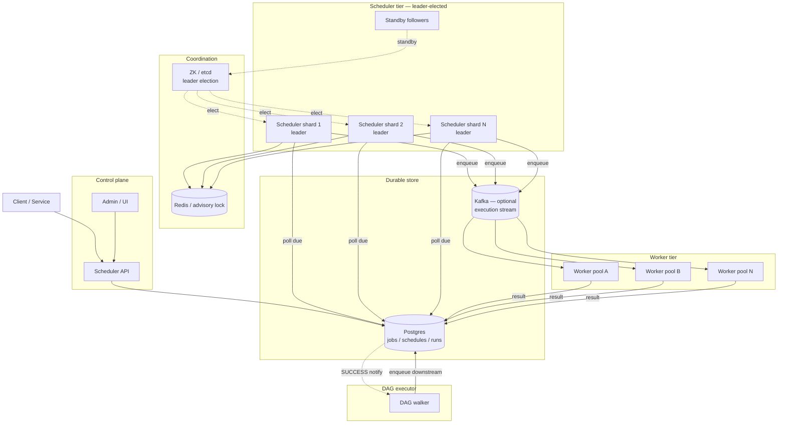

# Design a Job Scheduler — Cron Triggers, Distributed Locks, Retries, and DAG Orchestration

**Date:** 2026-04-25 | **Updated:** 2026-04-25
**Tags:** `system-design` `case-study` `async` `scheduling` `medium`
**Difficulty:** Medium | **Type:** HLD | **Estimated read:** 30–35 min

## Table of Contents

- [Summary](#summary)
- [1. Functional Requirements](#1-functional-requirements)
- [2. Non-Functional Requirements](#2-non-functional-requirements)
- [3. Capacity Estimation](#3-capacity-estimation)
- [4. API Design](#4-api-design)
  - [Job submission](#job-submission)
  - [Schedule management](#schedule-management)
  - [Run history and observability](#run-history-and-observability)
- [5. Data Model](#5-data-model)
  - [Job definition](#job-definition)
  - [Schedule](#schedule)
  - [Run history](#run-history)
  - [DAG edges](#dag-edges)
- [6. High-Level Architecture](#6-high-level-architecture)
- [7. Deep Dives](#7-deep-dives)
  - [7.1 Distributed lock per job](#71-distributed-lock-per-job)
  - [7.2 Retry with exponential backoff and idempotency](#72-retry-with-exponential-backoff-and-idempotency)
  - [7.3 Multi-tenant fairness and weighted fair queueing](#73-multi-tenant-fairness-and-weighted-fair-queueing)
  - [7.4 Time-zone correctness for cron](#74-time-zone-correctness-for-cron)
  - [7.5 Missed-fire policies](#75-missed-fire-policies)
  - [7.6 Job dependency DAG](#76-job-dependency-dag)
  - [7.7 Leader election for the scheduler itself](#77-leader-election-for-the-scheduler-itself)
- [8. Bottlenecks & Trade-offs](#8-bottlenecks--trade-offs)
- [9. Anti-Patterns](#9-anti-patterns)
- [Related](#related)
- [References](#references)

## Summary

A job scheduler answers two coupled questions: **when should this job run?** and **who is responsible for running it exactly once even when machines fail?** Answering one without the other gets you either a cron daemon that misses fires every time the box reboots, or a queue worker that double-charges customers because two pollers grabbed the same row. This case study designs a scheduler that combines durable triggers (cron and one-shot), per-job distributed locking, at-least-once delivery with idempotent execution, retries with exponential backoff, multi-tenant fairness, priority queues, time-zone-correct cron, missed-fire recovery, dependency DAGs, and leader election — modeled on the architectures behind Quartz, Airflow, Temporal, Cadence, and AWS EventBridge Scheduler.

The design covers a sharded scheduler tier with leader election (per-shard or via Raft), a Postgres-backed job table that doubles as the durable queue, Redis or DB advisory locks to prevent double-execution, a worker tier that pulls work via SKIP LOCKED, and a DAG executor that walks dependency edges as upstream tasks complete. The hard parts are not "how do I run cron" — they are how the system survives a scheduler crash mid-fire, how a job whose worker died still completes exactly-once-effectively, and how one noisy tenant doesn't starve the rest of the fleet.

## 1. Functional Requirements

The service must support:

- **Cron-style triggers.** Standard 5- or 6-field cron expressions, plus extensions like `@daily` and `@hourly`. Time zone is part of the schedule, not the server clock — see §7.4.
- **One-shot triggers.** Schedule a job to run at an absolute future time (e.g. `2026-05-01T09:00:00Z`) or after a delay (e.g. `now + 15m`). Common for retry-after-N-minutes and delayed notifications.
- **Job submission API.** Idempotent create with caller-supplied `idempotency_key` so retried client calls don't enqueue duplicates.
- **Persistent durable queue.** Job rows survive scheduler crashes. Either DB-backed (Postgres with `SELECT … FOR UPDATE SKIP LOCKED`) or Kafka-backed for higher throughput. Quartz's `JobStoreTX` and Airflow's metadata DB use the DB-backed approach; AWS EventBridge Scheduler and Temporal use durable internal stores.
- **At-least-once delivery + idempotency.** The framework guarantees the job's handler runs at least once; the handler is responsible for making the work idempotent (deduplicate by job-run-id, use upserts, etc.). This is the model Temporal documents explicitly.
- **Retry with exponential backoff.** Configurable per job: `max_attempts`, `initial_backoff`, `multiplier`, `max_backoff`, optional jitter.
- **Multi-tenant fairness.** Per-tenant rate limits, weighted fair queueing so a tenant with weight 2 gets twice the worker share of a tenant with weight 1.
- **Priority queues.** Within a tenant, urgent jobs (`HIGH`) preempt batch jobs (`LOW`). Priority is honored without starving lower priorities forever.
- **Missed-fire policy.** When the scheduler was down across a fire time, what happens? Quartz defines five misfire instructions per trigger type — see §7.5.
- **Job dependency DAG.** A job can declare upstream dependencies; it does not run until all upstreams reached a terminal success state. This is Airflow's core abstraction.
- **Run history.** Every run has a row with start/end, attempt number, outcome, error, and worker ID. Retained per tenant policy.
- **Cancel and pause.** Cancel a scheduled run, pause an entire schedule, resume later.

## 2. Non-Functional Requirements

| NFR | Target | Why |
|-----|--------|-----|
| Trigger fire accuracy | **Within 1 s of scheduled time** at p99 | Calendar-driven workflows; missing a 09:00 batch by 30 s is acceptable, by 30 min is not |
| Throughput | **100k jobs/min** sustained, 500k/min peak | Mid-sized SaaS; large tenants schedule in bulk |
| Scheduler availability | **99.95%+** | Down-time directly translates to missed fires |
| Worker availability | **99.9%** | Less critical — retries cover transient worker loss |
| Exactly-once-effective | A successful run is recorded once, even with worker crashes | Idempotency + dedup, not literal exactly-once |
| Time-zone correctness | DST transitions handled per IANA tz database | A cron `0 2 * * *` in `America/New_York` must not fire twice on fall-back day |
| Lock acquisition latency | < 50 ms p99 | Latency in the dispatch loop |
| End-to-end latency (one-shot) | < 5 s from fire-time to handler start | Standard expectation for "fire at T" workloads |

## 3. Capacity Estimation

**Workload.** Assume a SaaS scheduler with 10k tenants, 1M active schedules total. Average schedule fires every 6 hours, with peaks on the hour and at midnight UTC.

```text
Steady-state fires/min = 1M schedules / (6 × 60) = ~2,800/min
Peak fires/min (top of hour)            = 100k–500k/min
```

**Storage.**

```text
Schedule row              ~ 500 B (cron expr, tz, payload, metadata)
Run history row           ~ 1 KB (timestamps, attempt, error, worker_id)
Avg runs retained / sched = 30 (last month)

Schedules:    1M × 500 B = 500 MB
Run history:  1M × 30 × 1 KB = 30 GB
```

A single Postgres instance with sharding by `tenant_id` handles this, but at 500k/min peak the dispatch query (`SELECT … FOR UPDATE SKIP LOCKED`) becomes the hot path. Quartz documents the same tradeoff: `JobStoreTX` is fine until you scale into the tens of thousands of triggers per scheduler, then you shard.

**Lock contention.** With per-job locking and 500k fires/min peak, that's ~8.3k lock acquisitions/sec. A single Redis node handles ~100k ops/sec, so one lock cluster is plenty — the pressure is on the queue, not the lock store.

**Worker fleet.** If average job runs 5 s, peak 500k/min means ~42k concurrent workers needed at peak. In practice, with autoscaling and priority-based shedding, ~10k workers handle the steady-state and burst into a backlog you drain over minutes.

**Bandwidth.** Job payloads are typically small (< 4 KB). 500k/min × 4 KB ≈ 33 MB/s — trivial compared to the metadata work.

## 4. API Design

### Job submission

REST + JSON for the management plane; gRPC for high-volume internal callers. Idempotency on every create.

```http
POST /v1/jobs
Idempotency-Key: client-uuid-7f3a...

{
  "tenant_id": "acme",
  "name": "nightly-invoice-rollup",
  "handler": "invoice.rollup",
  "payload": { "month": "2026-04" },
  "trigger": {
    "type": "cron",
    "expression": "0 2 * * *",
    "timezone": "America/New_York"
  },
  "retry": {
    "max_attempts": 5,
    "initial_backoff_ms": 1000,
    "multiplier": 2.0,
    "max_backoff_ms": 300000,
    "jitter": "full"
  },
  "priority": "NORMAL",
  "missed_fire_policy": "FIRE_ONCE_NOW",
  "depends_on": []
}

# 201 Created
{ "id": "j_01HX...", "next_fire_at": "2026-04-26T06:00:00Z" }
```

One-shot triggers swap the trigger block:

```json
"trigger": { "type": "one_shot", "fire_at": "2026-05-01T09:00:00Z" }
```

The `Idempotency-Key` is hashed with `tenant_id + name` and stored on the row; a duplicate POST returns the existing job ID.

### Schedule management

```http
GET    /v1/jobs/{id}
PATCH  /v1/jobs/{id}              # update payload, retry policy, paused flag
DELETE /v1/jobs/{id}              # tombstone, stops future fires
POST   /v1/jobs/{id}/pause
POST   /v1/jobs/{id}/resume
POST   /v1/jobs/{id}/trigger      # manual fire now (still respects locks/dedup)
```

### Run history and observability

```http
GET /v1/jobs/{id}/runs?limit=50
GET /v1/runs/{run_id}
GET /v1/tenants/{tenant_id}/runs?status=FAILED&since=2026-04-25T00:00:00Z
```

Each run carries: `run_id`, `attempt`, `started_at`, `ended_at`, `worker_id`, `status` (`PENDING|RUNNING|SUCCESS|FAILED|RETRY_SCHEDULED|TIMED_OUT|CANCELED`), `error`, `next_retry_at`.

## 5. Data Model

The data model is the single most important design decision. The DB row is simultaneously the schedule, the queue entry, and the audit record. Quartz, Airflow, and most production schedulers all converge on this shape.

### Job definition

```sql
CREATE TABLE jobs (
  id              UUID PRIMARY KEY,
  tenant_id       TEXT NOT NULL,
  name            TEXT NOT NULL,
  handler         TEXT NOT NULL,
  payload         JSONB NOT NULL,
  retry_policy    JSONB NOT NULL,
  priority        SMALLINT NOT NULL DEFAULT 5,    -- 1..10, higher = more urgent
  paused          BOOLEAN NOT NULL DEFAULT FALSE,
  idempotency_key TEXT NOT NULL,                  -- hash of tenant+name+client-uuid
  created_at      TIMESTAMPTZ NOT NULL DEFAULT now(),
  UNIQUE (tenant_id, idempotency_key)
);
CREATE INDEX ON jobs (tenant_id, paused);
```

### Schedule

Triggers live in a separate table because a single job can have multiple triggers (e.g. cron + manual fire), and because the dispatch loop only needs the `next_fire_at` index — not the full job row.

```sql
CREATE TABLE schedules (
  id              UUID PRIMARY KEY,
  job_id          UUID NOT NULL REFERENCES jobs(id) ON DELETE CASCADE,
  trigger_type    TEXT NOT NULL,                  -- 'cron' | 'one_shot'
  cron_expression TEXT,
  timezone        TEXT,                            -- IANA tz name, e.g. 'America/New_York'
  fire_at         TIMESTAMPTZ,                     -- one-shot only
  next_fire_at    TIMESTAMPTZ NOT NULL,            -- always populated, drives dispatch
  prev_fire_at    TIMESTAMPTZ,
  misfire_policy  TEXT NOT NULL DEFAULT 'FIRE_ONCE_NOW',
  state           TEXT NOT NULL DEFAULT 'WAITING', -- WAITING|ACQUIRED|EXECUTING|COMPLETE|PAUSED|ERROR
  locked_by       TEXT,                            -- scheduler/worker instance ID
  locked_until    TIMESTAMPTZ,
  version         INTEGER NOT NULL DEFAULT 0       -- optimistic concurrency
);
CREATE INDEX ON schedules (state, next_fire_at);   -- the hot dispatch index
CREATE INDEX ON schedules (locked_by, locked_until);
```

The `(state, next_fire_at)` partial index on `state IN ('WAITING')` is the dispatch hot path — see §7.7.

### Run history

```sql
CREATE TABLE runs (
  id            UUID PRIMARY KEY,
  job_id        UUID NOT NULL,
  schedule_id   UUID,
  fire_time     TIMESTAMPTZ NOT NULL,             -- when it was *supposed* to fire
  attempt       INTEGER NOT NULL,
  started_at    TIMESTAMPTZ,
  ended_at      TIMESTAMPTZ,
  worker_id     TEXT,
  status        TEXT NOT NULL,                     -- PENDING|RUNNING|SUCCESS|FAILED|...
  error         TEXT,
  next_retry_at TIMESTAMPTZ,
  UNIQUE (job_id, fire_time, attempt)             -- dedup key for at-least-once
);
CREATE INDEX ON runs (job_id, fire_time DESC);
CREATE INDEX ON runs (status, next_retry_at) WHERE status = 'RETRY_SCHEDULED';
```

The `(job_id, fire_time, attempt)` unique constraint is what turns at-least-once into effectively-exactly-once: a duplicate dispatch tries to insert the same run row, hits the unique violation, and aborts.

### DAG edges

```sql
CREATE TABLE job_dependencies (
  downstream_job_id UUID NOT NULL,
  upstream_job_id   UUID NOT NULL,
  PRIMARY KEY (downstream_job_id, upstream_job_id)
);
CREATE INDEX ON job_dependencies (upstream_job_id);
```

When an upstream run reaches `SUCCESS`, the DAG executor walks the index looking for downstream jobs whose every upstream has succeeded — see §7.6.

## 6. High-Level Architecture



**Request flow:**

1. Client `POST /v1/jobs` → API writes `jobs` and `schedules` rows in one transaction; computes `next_fire_at` from the cron expression.
2. **Scheduler shards** (each owning a partition of `tenant_id` hash, with a leader elected via ZooKeeper / etcd) poll `schedules WHERE state='WAITING' AND next_fire_at <= now() FOR UPDATE SKIP LOCKED LIMIT N`, claiming due triggers.
3. For each due trigger, the scheduler acquires a **per-job lock** in Redis (or a Postgres advisory lock) to serialize against any other shard or replay path.
4. The scheduler inserts a `runs` row in `PENDING` (the unique constraint dedupes), updates the schedule's `next_fire_at` to the next cron occurrence, and **enqueues** to Kafka or directly to a worker queue.
5. A **worker** consumes the run, executes the handler, writes `SUCCESS` / `FAILED` back to `runs`, and on success notifies the DAG executor to walk downstream.
6. On failure, the scheduler writes `next_retry_at = now() + backoff(attempt)` and the run goes back into the dispatch loop as a `RETRY_SCHEDULED` row.

## 7. Deep Dives

### 7.1 Distributed lock per job

The fundamental risk: two scheduler shards (or a shard plus its rebooted twin) both decide to fire the same trigger. Without a lock, you get duplicate runs — and duplicate side effects. The lock has to satisfy three properties:

1. **Mutual exclusion.** Only one holder at a time per `job_id`.
2. **Lease-based.** The lock auto-expires if the holder crashes, so a stuck worker doesn't pin the job forever.
3. **Fencing.** The lock returns a monotonically increasing token; downstream operations check the token before mutating state, so a paused-then-resumed holder doesn't write stale results. Martin Kleppmann's "How to do distributed locking" makes the case that without fencing, lease-based locks are unsafe; the Redis docs acknowledge this debate openly in the Redlock spec.

**Implementation options:**

| Backend | Strengths | Weaknesses |
|---------|-----------|------------|
| **Postgres advisory lock** (`pg_try_advisory_lock`) | Same DB as state; transactional; no extra infra | Held for the duration of the session — long-running jobs hold a connection |
| **Redis SETNX + TTL** | Sub-ms acquire; trivial to scale | No fencing token unless you layer one on; Redlock has known correctness debates |
| **etcd / ZooKeeper lease** | Linearizable; native leases and watches | Higher latency; more ops overhead |
| **Row-level `FOR UPDATE SKIP LOCKED`** | Built into the dispatch query; no separate lock service | Lock scope is the row, not the logical job — fine for dispatch, weaker for handler-level serialization |

For a typical job scheduler, the workable combo is:

- `SELECT … FOR UPDATE SKIP LOCKED` on the **schedule row** for dispatch claim (no two shards can claim the same trigger).
- A **fenced lock** on `(job_id)` in Redis or etcd for the **handler execution window**, with the fencing token written into the `runs` row on every state transition — Postgres's `UPDATE … WHERE version = ?` enforces fencing as optimistic CAS.

Pseudocode for the dispatch claim:

```sql
WITH claimed AS (
  SELECT id FROM schedules
  WHERE state = 'WAITING'
    AND next_fire_at <= now()
    AND tenant_id = ANY($shard_tenants)
  ORDER BY next_fire_at, priority DESC
  FOR UPDATE SKIP LOCKED
  LIMIT 100
)
UPDATE schedules s
SET state = 'ACQUIRED',
    locked_by = $instance_id,
    locked_until = now() + interval '60 seconds',
    version = version + 1
FROM claimed
WHERE s.id = claimed.id
RETURNING s.*;
```

`SKIP LOCKED` is the linchpin — it lets multiple scheduler instances poll concurrently without contention. Postgres's docs describe it as designed for exactly this multi-consumer queue pattern.

### 7.2 Retry with exponential backoff and idempotency

When a handler fails, retry — but not immediately, and not forever. The standard policy: **exponential backoff with jitter**.

```text
delay(attempt) = min(max_backoff, initial_backoff × multiplier^attempt) × jitter
```

AWS's "Exponential Backoff and Jitter" post is the canonical reference: full jitter (`delay × random(0, 1)`) is the default choice; equal jitter (`delay/2 + random(0, delay/2)`) is a slightly tighter alternative. **Always add jitter** — without it, retries from many failed jobs synchronize and create a thundering-herd at every backoff boundary.

```python
def next_retry_delay(attempt, policy):
    base = min(
        policy.max_backoff_ms,
        policy.initial_backoff_ms * (policy.multiplier ** attempt)
    )
    if policy.jitter == 'full':
        return random.uniform(0, base)
    if policy.jitter == 'equal':
        return base / 2 + random.uniform(0, base / 2)
    return base
```

**Idempotency is the worker's job, not the framework's.** The framework guarantees at-least-once; the handler must:

1. Use the run-id as a deduplication key for any external side effect (e.g. Stripe charge `idempotency_key = run_id`).
2. Use upserts (`INSERT … ON CONFLICT DO NOTHING`) instead of inserts.
3. Compare current state before mutating (`UPDATE … WHERE status = 'pending'`).

Temporal documents this explicitly: it provides at-least-once activity execution and tells users to make activities idempotent. The same model holds for any scheduler — exactly-once delivery is a fairy tale; exactly-once **effect** is achievable with idempotent handlers.

**Retry budget.** Cap total attempts (`max_attempts = 5–10`). After the cap, route to a dead-letter table for human review. Do not retry forever — a poison-pill job will burn worker capacity indefinitely.

### 7.3 Multi-tenant fairness and weighted fair queueing

A single tenant scheduling 1M jobs at midnight will starve every other tenant if the queue is FIFO. Two tools fix this:

**1. Per-tenant rate limit.** A simple ceiling: tenant `acme` cannot have more than `N` runs in flight, or more than `M` runs/min. Implemented as a token bucket per tenant (see [`design-rate-limiter.md`](../basic/design-rate-limiter.md)). When the dispatch loop picks a candidate, it checks the tenant's bucket; if empty, the row is deferred (left as `WAITING` with a small `next_fire_at` bump).

**2. Weighted fair queueing (WFQ).** Within the global capacity, tenants get worker share proportional to their weight. The classic algorithm (originally from packet scheduling) tags each job with a virtual finish time:

```text
virtual_finish_time(job) = max(virtual_clock, last_finish[tenant]) + size / weight[tenant]
```

The dispatcher always picks the smallest virtual finish time. A tenant with weight 2 has its virtual finish times advance half as fast, so it gets twice the share. Airflow's `pool` abstraction approximates this — pools cap concurrent slots per logical group, and you assign jobs to pools.

**Priority queues.** Within a tenant, priorities are a separate axis. A common shape:

```text
ORDER BY priority DESC, next_fire_at ASC
```

Higher-priority jobs jump ahead. To prevent starvation, **age-boost**: every minute, `priority := min(MAX, priority + 1)` for `WAITING` rows older than some threshold. Without an aging policy, a steady stream of HIGH jobs blocks LOW jobs forever — a real production failure mode.

A pragmatic combination: **fairness across tenants, priority within a tenant**. Pick the next tenant by WFQ, then pick its highest-priority due job.

### 7.4 Time-zone correctness for cron

This is the deep dive that bites every scheduler that ignores it. Three traps:

**Trap 1: storing the cron expression without a time zone.** "Every day at 02:00" — in whose 02:00? Server's? UTC? The user's? Always store an IANA tz name (`America/New_York`, not `EST` — see below) alongside the cron expression. Quartz's `CronTrigger` takes an explicit `setTimeZone(TimeZone)`; AWS EventBridge Scheduler accepts a `ScheduleExpressionTimezone`.

**Trap 2: DST transitions.**

- **Spring-forward.** In `America/New_York`, on the second Sunday of March, the wall clock jumps from 02:00 to 03:00. A trigger of `0 2 * * *` has **no 02:00 that day**. The standard answer (Quartz, cron) is to skip the fire, not to fire at 03:00 — but document this clearly.
- **Fall-back.** On the first Sunday of November, 02:00 happens twice (02:00 EDT, then 02:00 EST). A naive scheduler fires twice. The fix is to record the last fire's UTC instant and ensure the next fire's UTC instant is strictly greater.

**Trap 3: deprecated tz names.** `EST`, `PST`, etc. don't follow DST. Use the IANA names (`America/New_York`, `America/Los_Angeles`). The IANA tz database is the source of truth; `tzdata` updates ship multiple times per year as governments change DST rules.

**Implementation rule:**

```text
1. Parse cron expression in the schedule's IANA timezone.
2. Compute next local fire time using a tz-aware library
   (e.g. java.time.ZonedDateTime, Python pytz/zoneinfo, Go time.LoadLocation).
3. Convert to UTC instant — this is what next_fire_at stores.
4. After firing, ensure the next computed UTC instant is strictly > the just-fired one.
   (Defends against fall-back duplicate.)
```

**Always update the tzdata package on a schedule.** Stale tzdata in the scheduler container = wrong fire times for any tz that changed rules. AWS publishes EventBridge Scheduler tz updates; Quartz delegates to Java's `TimeZone`, which depends on JRE tzdata.

### 7.5 Missed-fire policies

The scheduler was down from 01:55 to 02:30. A trigger configured for 02:00 was missed. What now? Quartz codifies this with **misfire instructions** — five options for `CronTrigger`:

| Policy | Behavior |
|--------|----------|
| `FIRE_ONCE_NOW` | Fire once immediately, then resume the normal schedule. Default for most cases. |
| `DO_NOTHING` | Skip the missed fire entirely; next fire is the next scheduled occurrence. Use when "yesterday's batch" has no value today. |
| `FIRE_ALL_MISSED` | Fire every missed occurrence in sequence. Use only when each fire is independent and idempotent — otherwise you'll thrash. |
| `IGNORE_MISFIRE_POLICY` | Fire every missed occurrence with no rate limit. Almost never what you want; can DoS your own workers. |
| Smart policy | Library picks based on trigger type (`SimpleTrigger` vs `CronTrigger`). |

**Misfire threshold.** A scheduler is considered "missed" only after it's later than the fire time by `misfire_threshold` (default ~60 s in Quartz). Below threshold, it's just "running late," not a misfire — so brief GC pauses or dispatch lag don't trigger the policy.

**Per-trigger choice.** A nightly invoice rollup needs `FIRE_ONCE_NOW` (run yesterday's rollup as soon as we recover). A "ping the partner API every minute" health check needs `DO_NOTHING` (next minute will fire normally; replaying 60 missed pings is pointless). Make the policy a first-class field on the trigger.

**Recovery on startup.** When a scheduler instance starts, it scans for `WAITING` schedules with `next_fire_at < now() - misfire_threshold`. For each, apply the configured misfire policy: typically advance `next_fire_at` to "now" (FIRE_ONCE_NOW) or to the next future occurrence (DO_NOTHING). Quartz's `JobStore` does this in its initialization sequence.

### 7.6 Job dependency DAG

Airflow's defining feature: a job (DAG, in their term) is a directed acyclic graph of tasks; a task does not run until every upstream task has succeeded. The same pattern is useful in a general scheduler.

**Data shape.** A `job_dependencies` edge table (see §5). Every job has an implicit `unmet_upstream_count` — the number of upstream jobs that have not yet reached `SUCCESS` for the current `fire_time`.

**Walking the DAG on success.** When a run flips to `SUCCESS`:

```sql
-- 1. Find downstream candidates
SELECT downstream_job_id
FROM job_dependencies
WHERE upstream_job_id = $just_succeeded;

-- 2. For each, check if every upstream has SUCCESS for this fire_time
SELECT downstream_job_id
FROM job_dependencies d
WHERE NOT EXISTS (
  SELECT 1 FROM job_dependencies d2
  LEFT JOIN runs r ON r.job_id = d2.upstream_job_id
                   AND r.fire_time = $fire_time
                   AND r.status = 'SUCCESS'
  WHERE d2.downstream_job_id = d.downstream_job_id
    AND r.id IS NULL
);

-- 3. For each ready downstream, enqueue a run.
```

**Failure semantics.** Three policies for "what if an upstream fails?":

- **`all_success` (default).** Downstream waits forever or fails after a deadline; manual intervention required.
- **`all_done`.** Downstream runs regardless of upstream outcome — useful for cleanup tasks.
- **`one_failed` / `all_failed`.** Inverse triggers — a "notify on failure" task runs only when an upstream fails.

Airflow names these `TriggerRule` and ships them all out of the box.

**Cycle prevention.** On submission, run a cycle check: a topological sort over the `job_dependencies` edges including the new edge. Reject if it forms a cycle. Cheap (DFS) and avoids deadlocks at runtime.

**Backfill and catch-up.** A new dependency added to an existing DAG: do you re-run downstream for past `fire_time`s? Airflow makes this an explicit `catchup` flag on the DAG. Default to `catchup=False` — past runs stay as-is; only future fires honor the new edge.

### 7.7 Leader election for the scheduler itself

The scheduler tier itself must not double-fire triggers. Two architectures:

**A. Single leader, multi-follower.** One node holds a lease in ZooKeeper / etcd / Consul; only the leader runs the dispatch loop. Followers stand by. On leader loss, a follower wins the next election and resumes within a few seconds.

- **Pros.** Simple. Only one writer. No coordination during normal operation.
- **Cons.** All dispatch throughput on one box. Failover gap is downtime for fires that happen during it.

**B. Sharded, leader-per-shard.** Partition the schedule space by `hash(tenant_id) % N`. Each shard has its own leader. Per-shard election runs in ZooKeeper / etcd. The fleet scales horizontally with N.

- **Pros.** Throughput scales with N. Failover blast radius is one shard.
- **Cons.** More moving parts; rebalancing shards on resize is non-trivial.

**Election primitive.** Modern stacks use:

- **etcd lease + key.** A node creates a lease, attempts to put `/leader/<shard>` with `ifNotExists`; the holder renews the lease. This is the pattern Kubernetes itself uses for controller-manager leader election.
- **ZooKeeper ephemeral sequential nodes.** Nodes create `/leader/seq-N`; the smallest sequential number wins. Quartz with `JobStoreCMT` uses a similar database-row-based "lock" to serialize scheduler instances.
- **Raft (Temporal, Cadence).** The scheduler is built on a Raft-replicated state machine; leadership comes for free from the consensus layer.

**Lease duration.** Trade-off:

- **Short (5–10 s).** Fast failover, but expires under GC pauses. Risk: the old leader's still-running dispatch loop fires triggers after losing leadership — fenced via the dispatch row's `version` column, but operationally messy.
- **Long (30–60 s).** Survives GC pauses, but failover gap = lease duration.

Mitigations: include a fencing token in every write, so any straggler whose lease expired finds its writes rejected; tune GC to keep pauses well below the lease.

**Co-design with §7.1.** Leader election prevents two shards from polling the same partition; per-job locking prevents replays within a single shard's window from double-firing. Both are needed — a leader can be ousted mid-fire (its TCP connection to Postgres survives the lease loss) and the new leader will re-dispatch the same trigger.

## 8. Bottlenecks & Trade-offs

| Concern | Bottleneck | Trade-off |
|---------|-----------|-----------|
| **Dispatch latency** | `SELECT … FOR UPDATE SKIP LOCKED` on the schedules table | Partition by tenant hash; one scheduler per partition |
| **Fairness vs throughput** | WFQ adds per-tenant accounting | Approximate WFQ (deficit round-robin) is cheaper than exact |
| **Lock service availability** | Redis / etcd outage stalls dispatch | DB advisory locks as fallback; degraded mode allows duplicates briefly |
| **Run history growth** | Unbounded retention = TB-scale tables | Per-tenant retention; partition `runs` by month; archive to cold storage |
| **DAG fan-out** | 10k downstream tasks ready at once | Rate-limit the enqueue; spread over a configurable window |
| **Tzdata staleness** | Wrong fires after government rule change | Auto-update tzdata on a schedule; alert on package age |
| **Worker concurrency** | Burst of fires exceeds worker pool | Backpressure: reject enqueue when worker queue exceeds threshold; jobs go to `DEFERRED` |

A useful framing: **a scheduler trades latency for correctness.** The dispatch loop runs every few seconds, not every millisecond, because the cost of a tighter loop (more lock contention, more SKIP LOCKED churn) outweighs the benefit (sub-second instead of sub-5-second fire latency) for almost every workload. If you need sub-second triggers, you're not building a job scheduler — you're building a workflow engine like Temporal.

## 9. Anti-Patterns

- **Cron in `crontab` on every host.** The classic mistake: install the same cron on N hosts for redundancy. Result: every fire runs N times. Either use a single host with monitoring (and accept downtime risk) or run a real distributed scheduler with leader election.
- **Polling without `SKIP LOCKED`.** Every scheduler shard polls `SELECT … FOR UPDATE`, blocking on the same rows. Throughput collapses to single-threaded. `SKIP LOCKED` is the fix.
- **At-least-once delivery without idempotent handlers.** "We retry on failure" + "the handler isn't idempotent" = duplicate charges, duplicate emails, duplicate side effects. Always pair the two.
- **Storing cron expressions without a tz.** Server reboots in a different region, every fire shifts. Always store IANA tz alongside.
- **Stale tzdata.** Government changes DST; your fires are now off by an hour. Pin tzdata updates to your build pipeline.
- **No misfire policy.** Scheduler downtime → a flood of catch-up fires → workers melt. Define the policy per trigger; default to `FIRE_ONCE_NOW` or `DO_NOTHING`, never `FIRE_ALL_MISSED` for high-frequency triggers.
- **Naive priority without aging.** HIGH-priority jobs starve LOW. Age-boost LOW jobs after a threshold.
- **DAG without cycle check.** A dependency loop deadlocks at runtime. Run topological sort on every dependency edit.
- **Exponential backoff without jitter.** Synchronized retry storms at every backoff boundary. Always jitter.
- **No fencing on the lock.** A paused-then-resumed leader writes stale results. Use fencing tokens or row-version CAS.
- **Single shared run-history table without partitioning.** Grows unboundedly; vacuum becomes painful. Partition by month.
- **Conflating scheduler and workflow engine.** A scheduler fires triggers; a workflow engine (Temporal, Cadence, Step Functions) orchestrates long-running stateful workflows. If your "scheduler" tasks include sleeps, retries with state, and signals, you want a workflow engine.

## Related

### Deep-Dive Companions

- [`job-scheduler/distributed-lock-per-job.md`](job-scheduler/distributed-lock-per-job.md) — lease + TTL, fencing tokens, ZK/etcd/Postgres/Redis backends, split-brain mitigation.
- [`job-scheduler/retry-and-idempotency.md`](job-scheduler/retry-and-idempotency.md) — backoff/jitter, retry budgets, idempotency keys, inbox pattern, DLQ.
- [`job-scheduler/multi-tenant-fairness.md`](job-scheduler/multi-tenant-fairness.md) — WFQ, DRR, stride/lottery, hierarchical fairness, priority classes.
- [`job-scheduler/time-zone-correctness.md`](job-scheduler/time-zone-correctness.md) — IANA tzdata, DST gap/overlap policies, RRULE, run-history schema.
- [`job-scheduler/missed-fire-policies.md`](job-scheduler/missed-fire-policies.md) — catch-up vs skip vs coalesce, watermark detection, multi-region coordination.
- [`job-scheduler/dependency-dag.md`](job-scheduler/dependency-dag.md) — topological scheduling, branching trigger rules, fan-out/fan-in, sub-DAGs.
- [`job-scheduler/leader-election-for-scheduler.md`](job-scheduler/leader-election-for-scheduler.md) — single-decider HA, lease TTL, fencing tokens, sharded schedulers.

### Foundations and Adjacent Systems

- **Coordination primitive:** [`../../data-consistency/leader-election-coordination.md`](../../data-consistency/leader-election-coordination.md) — Raft, ZooKeeper, etcd patterns for the scheduler tier.
- **Locking primitive:** [`../distributed-infra/design-distributed-locking.md`](../distributed-infra/design-distributed-locking.md) — Redlock, fencing tokens, advisory locks.
- **Queue substrate:** [`../distributed-infra/design-message-queue.md`](../distributed-infra/design-message-queue.md) — durable queue semantics, at-least-once delivery, dead-letter queues.
- **CI/CD twin:** [`./design-cicd-pipeline.md`](./design-cicd-pipeline.md) — DAG execution, retries, and job orchestration in a build context.
- **Fairness primitive:** [`../basic/design-rate-limiter.md`](../basic/design-rate-limiter.md) — per-tenant token buckets used in §7.3.

## References

- [Quartz Scheduler — Configuration and JobStore documentation][quartz]
- [Quartz — Misfire Instructions for CronTrigger][quartz-misfire]
- [Apache Airflow — Scheduler architecture and DAG concepts][airflow]
- [Temporal — At-least-once execution and idempotency][temporal]
- [Cadence Workflow — Architecture and consistency model][cadence]
- [AWS EventBridge Scheduler — Schedule types and time zones][eb-sched]
- [AWS Architecture Blog — Exponential Backoff and Jitter][aws-jitter]
- [Postgres — `SELECT … FOR UPDATE SKIP LOCKED`][pg-skip-locked]
- [Martin Kleppmann — How to do distributed locking][kleppmann-lock]
- [IANA Time Zone Database (tzdata)][iana-tz]

[quartz]: https://www.quartz-scheduler.org/documentation/quartz-2.3.0/configuration/
[quartz-misfire]: https://www.quartz-scheduler.org/documentation/quartz-2.3.0/tutorials/tutorial-lesson-04.html
[airflow]: https://airflow.apache.org/docs/apache-airflow/stable/core-concepts/scheduler.html
[temporal]: https://docs.temporal.io/activities#at-least-once-execution
[cadence]: https://cadenceworkflow.io/docs/concepts/architecture/
[eb-sched]: https://docs.aws.amazon.com/scheduler/latest/UserGuide/schedule-types.html
[aws-jitter]: https://aws.amazon.com/blogs/architecture/exponential-backoff-and-jitter/
[pg-skip-locked]: https://www.postgresql.org/docs/current/sql-select.html#SQL-FOR-UPDATE-SHARE
[kleppmann-lock]: https://martin.kleppmann.com/2016/02/08/how-to-do-distributed-locking.html
[iana-tz]: https://www.iana.org/time-zones
