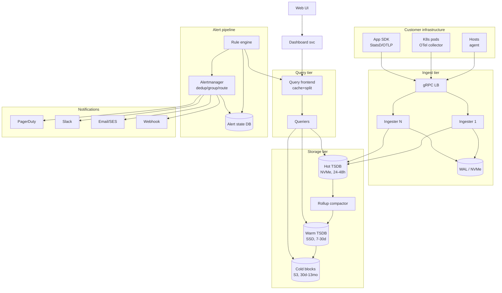

# Design a Monitoring & Alerting System — Ingestion, TSDB, Rule Eval, and Alert Routing at Scale

**Date:** 2026-04-25 | **Updated:** 2026-04-25
**Tags:** `system-design` `case-study` `observability` `monitoring` `medium`
**Difficulty:** Medium | **Type:** HLD | **Estimated read:** 30–35 min

## Table of Contents

- [Summary](#summary)
- [1. Functional Requirements](#1-functional-requirements)
- [2. Non-Functional Requirements](#2-non-functional-requirements)
- [3. Capacity Estimation](#3-capacity-estimation)
- [4. API Design](#4-api-design)
  - [Ingest API](#ingest-api)
  - [Query API (PromQL-style)](#query-api-promql-style)
  - [Alert rule management](#alert-rule-management)
  - [Webhook receiver contract](#webhook-receiver-contract)
- [5. Data Model](#5-data-model)
  - [Series identity and labels](#series-identity-and-labels)
  - [On-disk TSDB layout](#on-disk-tsdb-layout)
  - [Rollups and downsampling tiers](#rollups-and-downsampling-tiers)
  - [Alert state model](#alert-state-model)
- [6. High-Level Architecture](#6-high-level-architecture)
- [7. Deep Dives](#7-deep-dives)
  - [7.1 Ingestion path — agents, ingest service, write fan-out](#71-ingestion-path--agents-ingest-service-write-fan-out)
  - [7.2 Rollups and downsampling](#72-rollups-and-downsampling)
  - [7.3 Alert evaluation engine](#73-alert-evaluation-engine)
  - [7.4 Alert routing, deduplication, grouping, silencing](#74-alert-routing-deduplication-grouping-silencing)
  - [7.5 Dashboard compute and query path](#75-dashboard-compute-and-query-path)
  - [7.6 High-cardinality challenges](#76-high-cardinality-challenges)
  - [7.7 Log-to-metric conversion](#77-log-to-metric-conversion)
  - [7.8 Anomaly detection basics](#78-anomaly-detection-basics)
- [8. Bottlenecks & Trade-offs](#8-bottlenecks--trade-offs)
- [9. Anti-Patterns](#9-anti-patterns)
- [Related](#related)
- [References](#references)

## Summary

A production monitoring system has to do three things well at different time scales: **ingest** millions of metric points per second from a fleet of agents, **store** them efficiently for fresh queries (last 5 min) and long retention (13 months), and **fire alerts** within seconds of a breach without drowning the on-call in noise. This case study designs a Datadog-style, Prometheus-influenced platform: agents push to a sharded ingest tier, the writer fan-outs into a time-series database (TSDB) with tiered rollups (raw → 1m → 5m → 1h), an alert engine evaluates rules over sliding windows, and a routing layer (modelled on Prometheus Alertmanager) dedupes, groups, silences, and dispatches to PagerDuty / Slack / email.

The hard problems aren't "store points fast" — that's table stakes. They are **high-cardinality label explosions** (one bad `user_id` label OOMs your TSDB), **alert fatigue** (a bad deploy fires 10 000 correlated alerts), **dependency-aware suppression** (don't page on app errors when the database is already paging), **log-to-metric conversion** without paying for logs twice, and **dashboard queries** that scan billions of points sub-second.

## 1. Functional Requirements

The system must support:

- **Metric ingestion** from agents (StatsD, OpenTelemetry, Prometheus scrape, custom SDK) at high throughput. Every metric point is `(name, label_set, timestamp, value)`.
- **Metric types**: counter (monotonic), gauge (instantaneous), histogram (bucketed distribution), summary (pre-aggregated quantiles). Match the [OpenTelemetry metric data model][otel-metrics].
- **Query language** with selectors, time ranges, aggregation operators (`sum`, `avg`, `rate`, `histogram_quantile`), and basic arithmetic — at minimum a PromQL-compatible subset (see [PromQL docs][promql]).
- **Configurable retention**: raw (24 h–7 d), 1-minute rollup (30 d), 5-minute rollup (90 d), 1-hour rollup (13–24 mo).
- **Alert rules** evaluated on a fixed cadence: threshold (`> X for Y minutes`), absence (`absent(metric) for Y`), rate of change, multi-condition.
- **Alert routing**: per-rule receivers, label-based matchers, severity tiers (P1/P2/P3), maintenance windows / silences, dependency-aware suppression.
- **Notification channels**: PagerDuty, Slack, email, webhook, SMS (via Twilio).
- **Dashboards** with fast (sub-second) compute over rollups, real-time tile refresh, templated variables.
- **Log-to-metric conversion** so common log patterns (HTTP 5xx count, exception class) become first-class metrics without paying log storage twice.
- **Multi-tenancy**: label-based isolation, per-tenant quotas on ingest rate and active series.

Out of scope: full distributed tracing (covered separately in [`../../performance-observability/distributed-tracing-metrics-logs.md`](../../performance-observability/distributed-tracing-metrics-logs.md)), root-cause analysis automation, synthetic monitoring.

## 2. Non-Functional Requirements

| NFR | Target | Why |
|-----|--------|-----|
| **Ingest latency** (agent → durable) | p50 < 1 s, p99 < 5 s | Dashboards and alerts should reflect "now" within seconds |
| **Alert detection lag** | < 30 s end-to-end (sample → fire) | SRE expectation; matches Google SRE Book guidance on alerting latency |
| **Alert delivery SLO** | p99 < 60 s from fire to PagerDuty/Slack ack | Pager flow is the product's most visible promise |
| **Query latency** | p95 < 500 ms for last-1h, < 2 s for last-30d | Dashboard responsiveness drives adoption |
| **Ingest throughput** | 1B metric points/min sustained, 3B peak | One mid-large SaaS easily generates this |
| **Active series capacity** | 100M unique series per tenant, 10B aggregate | Defines TSDB sharding |
| **Durability** | No data loss on single AZ failure; ≤ 30 s point loss on multi-AZ | Replication factor 3, async to remote |
| **Retention** | 13 months at 1h granularity | Enables YoY comparisons |
| **Availability** | 99.9% query, 99.95% ingest, 99.99% alert delivery | Alerts are the most critical path |

Note the asymmetry: **alert delivery has a stricter SLO than query**. A dashboard hiccup is annoying; a missed page can be a postmortem.

## 3. Capacity Estimation

**Workload.** 10 000 hosts × 200 metrics / 10 s = 200 K pts/s; 5 000 pods × 500 metrics / 15 s = 167 K pts/s; 1 000 K8s objects × 50 / 30 s = 1.7 K pts/s. Aggregate ~370 K pts/s steady, ~1.1M pts/s peak ≈ **1B points/min** as the target.

**Storage.**

```text
Per point (in-memory): 16 B (timestamp + double)
Per point (compressed, Gorilla XOR / delta-of-delta): ~1.3 B average
  (Gorilla paper reports 1.37 B/point for production Facebook workload — see [Gorilla][gorilla])

Raw, 7-day retention:
  1.1M points/s × 86400 × 7 ≈ 6.65 × 10^11 points
  × 1.3 B = ~865 GB/tenant for raw shard, before replication
  × 3 (RF) = ~2.6 TB

1m rollup, 30-day retention:
  Each rollup point summarizes 60 s of raw → 1/6 of raw rate (assuming 10s scrape)
  Storage ~ 1/6 × 30/7 × 865 GB ≈ ~620 GB × 3 = ~1.9 TB

5m rollup, 90 days: ~370 GB × 3
1h rollup, 13 months: ~110 GB × 3
```

Total per tenant ≈ **5–6 TB replicated**. For 100 tenants: 500 TB working set across the TSDB cluster. Object storage tier (S3) for cold blocks brings cost down; hot tier (NVMe) holds last 24–48 h.

**Active series.** Each unique `(metric_name, label_set)` is one series. The series index dominates memory: ~200 B per series header (label hash + metadata + chunk pointers) → 100M series ≈ 20 GB resident per ingester replica. A bad `user_id` label can push that into billions of series and OOM the ingester — see §7.6.

**Alert eval.** 10 000 rules × 30 s eval = 333 evals/s; each scans ~30 K points (last 5–15 min) → ~10M points/s read load. Comfortable from in-memory chunks on a sharded TSDB.

**Network.** 1.1M pts/s × ~50 B (compressed protobuf) ≈ **55 MB/s** = 440 Mbps. Comfortable on 10 GbE; co-locate ingest with compute to avoid cross-region egress.

## 4. API Design

### Ingest API

Push-based, gRPC, batched writes. Mirrors the [OpenTelemetry OTLP/Metrics][otlp] shape.

```protobuf
service MetricIngest {
  rpc Push(WriteRequest) returns (WriteResponse);
}

message WriteRequest {
  string tenant_id = 1;
  repeated TimeSeries series = 2;
}

message TimeSeries {
  repeated Label labels = 1;            // sorted; defines identity
  repeated Sample samples = 2;          // ordered ts ascending
  repeated Exemplar exemplars = 3;      // optional trace correlation
  MetricMetadata meta = 4;
}
// Sample {ts_ms, value}; Exemplar {trace_id, value, ts};
// MetricMetadata.Type ∈ {COUNTER, GAUGE, HISTOGRAM, SUMMARY}
```

Typical agent sends ≤ 100 series × ≤ 60 samples per request every 10–15 s. The ingest service returns `200 OK` plus per-series status on partial failure (e.g. cardinality-limited series rejected without failing the batch). Pull-based scraping (Prometheus model) is supported via a sidecar that converts scrapes into the same `WriteRequest`.

### Query API (PromQL-style)

```http
GET /api/v1/query_range
  ?query=rate(http_requests_total{job="api",code=~"5.."}[5m])
  &start=2026-04-25T10:00:00Z
  &end=2026-04-25T11:00:00Z
  &step=15s
```

```json
{
  "status": "success",
  "data": {
    "resultType": "matrix",
    "result": [
      {
        "metric": {"job": "api", "code": "500", "instance": "pod-7"},
        "values": [[1714039200, "2.3"], [1714039215, "2.1"], ...]
      }
    ]
  }
}
```

Match the Prometheus HTTP query API contract ([docs][prom-http]) so existing dashboards and exporters interoperate.

### Alert rule management

```http
POST /api/v1/rules
{
  "name": "high_5xx_rate",
  "expr": "sum by (service) (rate(http_requests_total{code=~\"5..\"}[5m])) > 0.05 * sum by (service) (rate(http_requests_total[5m]))",
  "for": "5m",
  "labels": {
    "severity": "page",
    "team": "platform"
  },
  "annotations": {
    "summary": "{{ $labels.service }} 5xx rate > 5% for 5 minutes",
    "runbook_url": "https://runbooks.example.com/5xx"
  },
  "depends_on": ["database_unreachable", "upstream_lb_down"]
}
```

The `for` clause is critical: it requires the condition to hold continuously for that duration before firing — the standard mechanism Prometheus uses to suppress flapping ([docs][prom-alerting-rules]). The optional `depends_on` enables dependency-aware suppression (§7.4).

### Webhook receiver contract

When dispatching to a generic webhook, send Alertmanager's compact JSON envelope so existing tooling (Slack apps, on-call bots) can consume it unchanged ([Alertmanager webhook][am-webhook]):

```json
{
  "version": "4",
  "groupKey": "{}/{severity=\"page\"}:{service=\"checkout\"}",
  "status": "firing",
  "receiver": "platform-pagerduty",
  "groupLabels": {"service": "checkout"},
  "commonLabels": {"severity": "page", "alertname": "high_5xx_rate"},
  "alerts": [
    {
      "status": "firing",
      "labels": {"alertname": "high_5xx_rate", "service": "checkout", "instance": "pod-7"},
      "annotations": {"summary": "..."},
      "startsAt": "2026-04-25T10:32:14Z",
      "fingerprint": "9c3e9b..."
    }
  ]
}
```

## 5. Data Model

### Series identity and labels

A series is uniquely identified by `(metric_name, sorted_label_set)`. The fingerprint is a 64-bit hash:

```text
fingerprint = xxhash64(metric_name + sort(labels).map(l => l.name + "=" + l.value).join(","))
```

Properties:

- **Sort order matters.** `{a=1,b=2}` and `{b=2,a=1}` must produce the same fingerprint.
- **Append-only label set.** Adding or changing any label produces a new series.
- **Cardinality of a metric** = number of distinct label-value combinations actually observed.

Common label conventions (from the [Prometheus label best practices][prom-labels]):

| Label key | Use | Cardinality |
|-----------|-----|-------------|
| `service`, `job`, `env`, `region` | Coarse grouping | Low (10s) |
| `instance`, `pod`, `host` | Per-replica identity | Medium (1000s) |
| `endpoint`, `method`, `status_code` | Per-route | Medium |
| `user_id`, `request_id`, `trace_id` | **NEVER as labels** | Unbounded — log/trace it |

### On-disk TSDB layout

Borrowing from Prometheus TSDB and Gorilla:

```text
/var/tsdb/<tenant>/
├── head/                          # In-memory mmap, last 2h of writes
│   ├── chunks_head/
│   └── wal/                        # WAL for crash recovery
├── 01HX...3K/                      # Block: 2h of compacted data, immutable
│   ├── chunks/                     # Compressed sample chunks (Gorilla XOR)
│   ├── index                       # Postings: label → list of series IDs
│   ├── tombstones                  # Deletion markers
│   └── meta.json                   # Block boundaries, stats
├── 01HX...3M/
└── compact/                        # Merged blocks: 6h, 24h, 7d (rollups)
```

Key files:

- **`chunks/`** — Gorilla-compressed samples, ~1.3 B/point.
- **`index`** — inverted index mapping every `(label_name, label_value)` pair to the list of series IDs that contain it. Fast multi-label set intersection drives PromQL selectors.
- **`wal/`** — append-only write-ahead log for crash recovery before in-memory chunks have flushed.

This layout is described in detail in [`../distributed-infra/design-time-series-database.md`](../distributed-infra/design-time-series-database.md).

### Rollups and downsampling tiers

| Tier | Resolution | Retention | Aggregation |
|------|-----------|-----------|-------------|
| Raw | 10–15 s | 24 h–7 d | None |
| 1m | 1 min | 30 d | min, max, sum, count, last |
| 5m | 5 min | 90 d | min, max, sum, count |
| 1h | 1 h | 13–24 mo | min, max, sum, count |

Each tier stores **5 aggregations per series per bucket**. This lets the query layer answer `avg`, `sum`, `min`, `max`, `count` from any tier without re-reading raw points. `quantile` queries on histograms aggregate via histogram bucket rollups, not by re-computing percentiles from rolled-up min/max — that's mathematically wrong (see §7.2).

### Alert state model

Alerts are first-class entities in their own store (Postgres or a dedicated state DB):

```sql
CREATE TYPE alert_state AS ENUM ('inactive', 'pending', 'firing', 'resolved');

CREATE TABLE alerts (
  fingerprint   BYTEA PRIMARY KEY,                   -- hash(rule_id + label_set)
  rule_id       UUID NOT NULL,
  state         alert_state NOT NULL,
  labels        JSONB NOT NULL,
  annotations   JSONB NOT NULL,
  starts_at     TIMESTAMPTZ NOT NULL,
  ends_at       TIMESTAMPTZ,                          -- NULL while firing
  last_eval_at  TIMESTAMPTZ NOT NULL,
  pending_since TIMESTAMPTZ,                          -- entered 'pending' (within `for` clause)
  silenced_by   UUID[]                                -- matching silence IDs
);
CREATE INDEX ON alerts (rule_id, state);
CREATE INDEX ON alerts (last_eval_at) WHERE state IN ('pending','firing');
```

The fingerprint disambiguates instances: one rule `high_5xx_rate` may produce 50 firing alerts (one per `service` label combination), each tracked independently.

## 6. High-Level Architecture



**Request flow on the hot path:**

1. **Ingest.** Agent batches samples and sends to `LB → Ingester` selected by consistent hash on `tenant_id + series_fingerprint`. Ingester writes WAL synchronously (durability), updates in-memory chunk, ACKs.
2. **Compaction.** Every 2 h, the ingester flushes a sealed block to hot TSDB. A background compactor merges blocks at 6 h / 24 h / 7 d and produces 1m, 5m, 1h rollups.
3. **Query (dashboard).** UI hits dashboard service → query frontend (caches + splits long ranges) → queriers fan out to whichever tier covers the requested resolution (raw for last hour, 1m for last day, 5m for last week, 1h beyond).
4. **Alerting.** Alert rule engine wakes every `evaluation_interval` (default 30 s), runs the rule's PromQL through the same query path, compares against threshold, transitions state, and dispatches firing alerts to Alertmanager.
5. **Notification.** Alertmanager dedupes, groups, applies silences, then sends to receivers (PagerDuty, Slack, email).

## 7. Deep Dives

### 7.1 Ingestion path — agents, ingest service, write fan-out

**Agent design.** A good agent is small, memory-bounded, and never blocks the host:

- Bounded local ring buffer (~5–60 s); drop oldest on overflow with a counter.
- Compression before send (zstd / snappy) — 60–80% size reduction.
- Exponential backoff with jitter on 429/503, capped at 30 s.
- Optional disk WAL for billing-grade metrics that need survive-restart durability.

**Ingester sharding.** The LB hashes `(tenant_id, series_fingerprint)`. This co-locates all samples for one series on one ingester (tight chunk compression) and keeps consistent-hash moves on scale-out under ~5% of series. Hashing on only one of the two is the classic mistake: tenant-only melts one ingester for a big tenant; fingerprint-only loses tenant isolation.

**Replication factor.** Three replicas per series, primary + two standbys. Cortex / Mimir use this exact pattern ([Cortex docs][cortex]). On primary failure, queriers read from any replica with the most-advanced chunks.

**WAL and durability.** Per-batch fsync is too slow for 1M points/s. Group-commit every 100 ms or 4 KB, ACK only after fsync. On crash, replay WAL into in-memory chunks before serving reads ([TSDB design][prom-tsdb]).

**Backpressure.** Overloaded ingesters return `429 + Retry-After`; agents buffer and retry. **Never silently drop server-side** — the agent's local buffer knows which metrics matter.

### 7.2 Rollups and downsampling

Rolling up means: for every series, replace N raw points with one rollup point summarizing them. Done right, you cut storage 5–60× and queries 10–100× without losing the ability to ask interesting questions.

**Aggregations per rollup.** `min`, `max`, `sum`, `count`, `last` (or `first`). `avg = sum/count` (don't store directly — lossy when re-aggregating). `rate = (last - first) / interval`. Histograms roll up per-bucket (each bucket is a counter), and `histogram_quantile()` is computed at query time — same answer, mergeable.

**Critical mistake — pre-computed percentiles.** Storing "p99 of last minute" and averaging p99 across hours is **mathematically wrong** — quantiles don't average. Always roll up the underlying distribution, then apply `histogram_quantile` at query time. Datadog's [distribution metrics][datadog-dist] use DDSketch sketches precisely so percentiles are mergeable across rollups.

**When to roll up.** A background compactor on the warm tier:

```text
every hour:
  for each tenant:
    raw blocks older than 2h → 1m rollup blocks
    1m blocks older than 30d → 5m
    5m blocks older than 90d → 1h
    1h blocks older than 13mo → delete (or archive to glacier)
```

Compaction is offline, idempotent, and resumable. Failed compactions are retried; they never block ingest.

**Query rewriting.** The query frontend picks the cheapest tier that satisfies the requested step:

```text
query_range(start, end, step):
  if step >= 1h and end < now - 30d: route to 1h rollup
  elif step >= 5m and end < now - 7d: route to 5m
  elif step >= 1m and end < now - 24h: route to 1m
  else: route to raw
```

A 30-day query at 1h step scans ~720 points per series instead of 259 200 raw points. That's the difference between 50 ms and 5 s.

### 7.3 Alert evaluation engine

**Loop.** Each rule runs every `evaluation_interval` (default 30 s, per-rule override):

```text
for each rule r:
  vector = query(r.expr, end=now, step=r.evaluation_interval)
  for each series s in vector:
    fp = fingerprint(r.id, s.labels); state = alert_states[fp]
    if s.value satisfies r.threshold:
      if state == inactive: state = pending; pending_since = now
      elif state == pending and now - pending_since >= r.for_duration:
        state = firing; emit Alertmanager event
    else if state in (pending, firing):
      state = resolved; emit resolve event
    persist state
```

The **pending → firing** transition is gated by `for: <duration>`. Without it, a 30 s blip pages on-call; with `for: 5m`, the metric must stay over threshold five consecutive evals. This is Prometheus's standard suppression mechanism ([alerting rules][prom-alerting-rules]).

**Sharding.** Rules partition by `hash(rule_id)` across engine pods, redistributed by leader election (etcd / Consul) on failure. 10 000 rules at 30 s eval = ~333 evals/s/cluster.

**Correctness.** Query envelope must align to the rule's step (`start = end - lookback`), otherwise rate windows disagree. On restart, read persisted state and resume — pending must persist too, or the `for` clock resets and hides real incidents.

**Reduce eval cost via recording rules.** Rules sharing common subqueries (e.g. five rules computing `rate(http_requests_total[5m])`) share a recording rule that pre-computes the intermediate vector once ([recording rules][prom-recording]).

### 7.4 Alert routing, deduplication, grouping, silencing

This layer is where alert **fatigue** is won or lost. Adopting Prometheus Alertmanager's model (see [Alertmanager docs][am-docs]):

**Deduplication.** Multiple alert engine replicas may emit the same alert (HA setup, retries). Dedupe by fingerprint = `hash(alertname + sorted_labels)`. If the same fingerprint arrives within a dedupe window (e.g. 5 min) and is already firing, drop the duplicate.

**Grouping.** When 50 pods of the same service all start erroring simultaneously, the on-call wants **one** notification, not 50. Group on common labels:

```yaml
route:
  group_by: ['alertname', 'service', 'cluster']
  group_wait: 30s        # buffer before sending first notification for a new group
  group_interval: 5m     # min between notifications for same group
  repeat_interval: 4h    # re-page interval if still firing
```

`group_wait` is critical: it lets correlated alerts coalesce into one notification with a list of affected instances, instead of 50 phones buzzing in 30 seconds.

**Silencing.** A silence is a label matcher with a time window:

```json
{
  "matchers": [
    {"name": "service", "value": "checkout", "isEqual": true},
    {"name": "env", "value": "staging", "isEqual": true}
  ],
  "startsAt": "2026-04-25T22:00:00Z",
  "endsAt": "2026-04-26T02:00:00Z",
  "createdBy": "alice@example.com",
  "comment": "Planned maintenance"
}
```

Any alert whose labels match a non-expired silence is suppressed (still tracked in state, just not dispatched). Use silences for: planned maintenance, known broken environments, post-mortem investigation.

**Inhibition (dependency-aware suppression).** When the database is down, every service that talks to it errors. You want **one** page (database), not fifty (every consumer). Inhibition rules:

```yaml
inhibit_rules:
  - source_match:
      alertname: 'DatabaseUnreachable'
      severity: 'page'
    target_match_re:
      alertname: 'High5xxRate|HighLatency'
    equal: ['cluster']    # only inhibit targets in the same cluster
```

This says: if `DatabaseUnreachable[cluster=prod]` is firing, suppress `High5xxRate[cluster=prod]` and `HighLatency[cluster=prod]` for the same cluster. The on-call only pages on the upstream cause.

**Routing tree.** A single alert is matched against a tree of routes — first match wins, with optional `continue: true` for fan-out. Severity, team, time-of-day all become matchers:

```yaml
route:
  receiver: default-slack
  routes:
    - matchers: [severity = "page"]
      receiver: pagerduty
      continue: true                    # also send to slack for visibility
    - matchers: [team = "platform"]
      receiver: platform-slack
    - matchers: [team = "data"]
      receiver: data-slack
```

**Notification fan-out reliability.** Each receiver (PagerDuty, Slack, email) is an independent worker queue. PagerDuty failure must not block Slack. Use bounded retries with exponential backoff; on permanent failure, fall back to a secondary receiver (e.g. SMS via Twilio) and emit a `notification_dispatch_failed` metric — which itself drives an alert. **Yes, the alerting system monitors itself.**

### 7.5 Dashboard compute and query path

Dashboards refresh every 10–60 s with 6–20 panels per page; each panel is a `query_range` request. A heavily-used dashboard easily drives 1 200 queries/min. Two choices make this affordable:

**1. Query frontend caching.** A frontend (Cortex / Mimir / Thanos) splits long ranges into 24-h sub-queries, caches each by `(tenant, query_text, start, end, step)`, and re-executes only the last (incomplete) one. A 7-day chart at 30 s refresh runs ~30 s of fresh work, not 7 days.

**2. Subquery dedup.** When 50 dashboards reference `rate(cpu_usage[5m])`, fan-in to a single in-flight query and broadcast the result. Same idea as a request-coalescing CDN.

**Range vector eval.** `rate(http_requests_total[5m])` over 1 h at 15 s step doesn't materialize every sample — the querier computes rate from Gorilla chunk endpoints. Cardinality of the **result set**, not the input, drives merge cost across shards.

**Cost guards.** Every query is bounded by max series scanned (50 000), max samples (50 M), and wall-clock timeout (30 s ad-hoc / 120 s batch). Exceeding returns `422` with a cardinality estimate, not `500`.

### 7.6 High-cardinality challenges

The single most common cause of monitoring system meltdowns: **cardinality explosion**. One innocent label change — adding `user_id` to an HTTP metric — and series count goes from 100 to 10 million overnight.

**What goes wrong.**

- Series index resident memory grows linearly with series count → ingester OOM.
- WAL size explodes; replay on restart takes hours.
- Queries scan more series, latency degrades.
- Cold storage costs balloon (each series is its own object).

**Detection.** Monitor `tsdb_active_series` per tenant per metric; alert when growth rate > 10×/hour. A top-N high-cardinality dashboard usually shows the top 10 metrics own > 80% of total series.

**Mitigation: in-flight cardinality limits.**

```yaml
limits:
  per_tenant:
    max_active_series: 10_000_000
    max_series_per_metric: 1_000_000
    max_label_names_per_series: 30
    max_label_value_length: 1024
```

When a tenant exceeds the cap, **new series get rejected** (existing ones still write). Return a typed error so the agent SDK can log it loudly. Datadog's [custom metrics quotas][datadog-custom] follow the same pattern.

**Mitigation: agent-side relabeling.** Drop high-cardinality labels at the source via `metric_relabel_configs` (`labeldrop`, `labelmap`). For unbounded fields like `request_id`, never label them on metrics — keep them in traces.

**Mitigation: exemplars instead of labels.** To know which users saw slow requests, don't label the histogram by `user_id`. Attach **exemplars** — sample annotations carrying `trace_id` on a subset of points. The aggregate stays low-cardinality; exemplars link to traces ([OpenMetrics exemplars][exemplars]).

**Mitigation: per-tenant series sharding.** When a tenant legitimately exceeds 100M series, split across multiple ingester shard groups (Cortex blocks-based pattern). Cardinality becomes per-shard, not per-cluster.

### 7.7 Log-to-metric conversion

Logs are high-volume, expensive to store, and slow to query. Often the only thing you actually want is "**count** of error logs per service per minute" — that's a metric. Convert at ingest:

```yaml
log_metric_rules:
  - name: http_5xx_log_count
    matcher: 'level=ERROR status=~"5.."'
    extract:
      service: 'service'
      method: 'http_method'
    type: counter
    sample_rate: 1.0
```

The log pipeline (Vector / Fluent Bit / Logstash) parses each log line, evaluates the matcher, increments the counter, and emits a synthetic metric point. The metric carries low-cardinality labels only (service, method) — never `request_id`.

This pattern delivers two wins:

1. **Long-retention metric** for a fraction of the cost of long-retention logs.
2. **Alertable signal** without paying for a full log query on every eval.

The log itself can still go to cold storage with shorter hot retention; the converted metric carries the long-tail signal.

**Pitfall: double counting on retry.** If the log pipeline retries a delivery and your converter is not idempotent, you over-count. Tag log records with a unique ID and dedupe in the converter before incrementing.

### 7.8 Anomaly detection basics

Threshold alerts (`> 5%`) work for stable metrics. They fail for:

- Highly seasonal metrics (web traffic peaks Tuesday at 2 PM, dips Sunday at 4 AM).
- Slow drifts (memory leak: 10 MB/day creep is invisible to a 5-min `>` threshold).
- Multi-modal distributions (latency bimodal: cache-hit vs cache-miss).

**Method 1 — 3-sigma deviation.** For each timestamp-of-week, take the rolling expected value from the last 4 weeks and the stddev:

```text
expected(t) = mean(value(t-1w), value(t-2w), value(t-3w), value(t-4w))
sigma(t)    = stddev(those four)
alert if |value(t) - expected(t)| / sigma(t) > 3 for 5 minutes
```

Cheap, robust on stationary or weekly-seasonal series. Datadog ships [anomaly detection][datadog-anomaly] with `basic`, `agile`, and `robust` variants tuned for different shapes.

**Method 2 — forecasting.** Fit Holt-Winters / Prophet / exponential smoothing on the last 30 days, project the next hour, alert on residual outside the confidence band. More accurate, more expensive, more tuning.

**Method 3 — change-point detection.** Bayesian online CPD or CUSUM for abrupt level shifts ("did latency step up after the deploy?"). Pair with deploy markers from CI/CD.

**Practical guidance.** Reserve anomaly detection for SLO burn-rate alerts (multi-window multi-burn-rate; see [SRE Workbook][sre-workbook]), capacity-trend alerts (disk-fill projection), and business-metric alerts (signups, revenue) where seasonality breaks static thresholds. Always keep a static floor as a fallback — models drift, need retraining, and can mask gradual degradation a simple threshold would catch.

## 8. Bottlenecks & Trade-offs

| Concern | Bottleneck | Trade-off |
|---------|-----------|-----------|
| **Ingest throughput** | WAL fsync, ingester CPU on chunk encoding | Group-commit, per-CPU shards; accept ms-level write batching |
| **Active series memory** | Series index resident set | Per-tenant caps, agent-side relabeling; reject high-cardinality writes |
| **Query latency on long ranges** | Raw scans across blocks | Tiered rollups + query frontend cache + subquery dedup |
| **Alert delivery SLO** | Notifier dependency on third party (PagerDuty up/down) | Multi-channel routing; secondary receiver fallback |
| **Alert fatigue** | Lack of grouping/inhibition | Mandatory `for:` clause; group_by; inhibition rules; silences |
| **Cardinality blowups** | One bad label kills a tenant | Per-tenant limits; reject not drop; observability on the index itself |
| **Cross-region availability** | Replication lag | Region-pin ingest; cross-region for queries only on warm/cold tier |
| **Cost** | NVMe hot tier × 3 replicas | Aggressive rollup + S3 cold tier + Glacier for >12 mo |

Two framings to internalize:

- **Reads dominate cost; writes dominate complexity.** Storage cost goes to query traffic and rollup retention. Engineering complexity goes to keeping ingest correct and bounded.
- **The system that monitors must be more reliable than the system being monitored.** Self-monitoring is mandatory: instrument your monitoring stack with itself, alert on the alert pipeline, and run a second (smaller) blackbox monitor outside your own infra so a full outage is detectable.

## 9. Anti-Patterns

- **Using user IDs / request IDs / trace IDs as metric labels.** Cardinality explosion. Put them in traces; use exemplars to link.
- **Pre-computing percentiles in rollups.** `avg(p99)` is meaningless. Roll up histogram buckets, compute quantiles at query time.
- **Alerts without a `for:` clause.** Every blip pages. The `for:` window is the single highest-leverage knob for alert quality.
- **Routing every alert directly to PagerDuty.** Severity tiers exist for a reason. Reserve PagerDuty for SLO-burn page alerts; route everything else to chat / email / dashboard.
- **No grouping on the routing layer.** A bad deploy fires 500 alerts; without grouping, the on-call can't see signal through noise.
- **Tightly coupling the alert engine and the notifier.** Alertmanager-style separation lets you swap notifiers and add new channels without touching rule eval.
- **Storing alert state only in memory.** Engine restart loses pending state, fires duplicate alerts, or hides ongoing incidents.
- **Treating monitoring data as a regular database.** Time-series workloads have specific access patterns (append-heavy, range-scan dominant). Don't try to bolt monitoring onto Postgres at scale — use a TSDB.
- **Letting tenants share unbounded series quota.** One bad tenant kills shared ingesters. Per-tenant active-series and ingest-rate limits are non-negotiable.
- **Skipping log-to-metric for known-recurring log queries.** If you've alerted on "count of WARN logs" three times this quarter, that's a metric, not a log query.
- **Running the same Alertmanager replica everyone depends on.** HA mode (gossip-based) is built-in; use it. A single notifier failure must not block paging.
- **No runbook URL on the alert.** When the page wakes someone at 3 AM, "high_5xx_rate firing" is hostile. Link to `runbook_url` annotations; require them in CI for new rules.
- **Using anomaly detection as a primary alert with no static floor.** Models drift. Always pair with a static threshold for catastrophic conditions.
- **Letting `repeat_interval` be unset.** A firing alert that pages every minute is a guarantee the on-call disables the rule. Default to 4 h or longer for non-critical.

## Related

- **Observability building blocks:** [`../../performance-observability/monitoring-alerting-red-use.md`](../../performance-observability/monitoring-alerting-red-use.md) — RED and USE method, what to actually monitor.
- **Logs / metrics / traces architecture:** [`../../performance-observability/distributed-tracing-metrics-logs.md`](../../performance-observability/distributed-tracing-metrics-logs.md) — the three pillars, how exemplars stitch them.
- **Storage twin:** [`../distributed-infra/design-time-series-database.md`](../distributed-infra/design-time-series-database.md) — TSDB internals (Gorilla compression, head/blocks/index, compaction).
- **Routing companion:** Prometheus Alertmanager docs (see references) — the routing-tree model adopted here.

## References

- [Prometheus — Alerting rules][prom-alerting-rules]
- [Prometheus Alertmanager — overview & routing][am-docs]
- [Alertmanager — webhook receiver contract][am-webhook]
- [Prometheus — Recording rules][prom-recording]
- [Prometheus — HTTP query API][prom-http]
- [Prometheus — Naming and label best practices][prom-labels]
- [Prometheus — TSDB design][prom-tsdb]
- [Gorilla: A Fast, Scalable, In-Memory Time Series Database (Facebook, VLDB 2015)][gorilla]
- [Cortex / Grafana Mimir architecture][cortex]
- [Datadog — Distribution metrics][datadog-dist]
- [Datadog — Anomaly detection][datadog-anomaly]
- [Datadog — Custom metrics & cardinality][datadog-custom]
- [Google SRE Book — chapter 6, Monitoring Distributed Systems][sre-monitoring]
- [Google SRE Workbook — chapter 5, Alerting on SLOs][sre-workbook]
- [OpenTelemetry — metrics data model][otel-metrics]
- [OpenTelemetry — OTLP/Metrics protocol][otlp]
- [OpenMetrics — exemplars specification][exemplars]
- [PromQL — basics][promql]

[prom-alerting-rules]: https://prometheus.io/docs/prometheus/latest/configuration/alerting_rules/
[am-docs]: https://prometheus.io/docs/alerting/latest/alertmanager/
[am-webhook]: https://prometheus.io/docs/alerting/latest/configuration/#webhook_config
[prom-recording]: https://prometheus.io/docs/prometheus/latest/configuration/recording_rules/
[prom-http]: https://prometheus.io/docs/prometheus/latest/querying/api/
[prom-labels]: https://prometheus.io/docs/practices/naming/
[prom-tsdb]: https://prometheus.io/docs/prometheus/latest/storage/
[gorilla]: https://www.vldb.org/pvldb/vol8/p1816-teller.pdf
[cortex]: https://grafana.com/docs/mimir/latest/references/architecture/
[datadog-dist]: https://docs.datadoghq.com/metrics/distributions/
[datadog-anomaly]: https://docs.datadoghq.com/monitors/types/anomaly/
[datadog-custom]: https://docs.datadoghq.com/metrics/custom_metrics/
[sre-monitoring]: https://sre.google/sre-book/monitoring-distributed-systems/
[sre-workbook]: https://sre.google/workbook/alerting-on-slos/
[otel-metrics]: https://opentelemetry.io/docs/specs/otel/metrics/data-model/
[otlp]: https://opentelemetry.io/docs/specs/otlp/
[exemplars]: https://github.com/OpenObservability/OpenMetrics/blob/main/specification/OpenMetrics.md#exemplars
[promql]: https://prometheus.io/docs/prometheus/latest/querying/basics/
