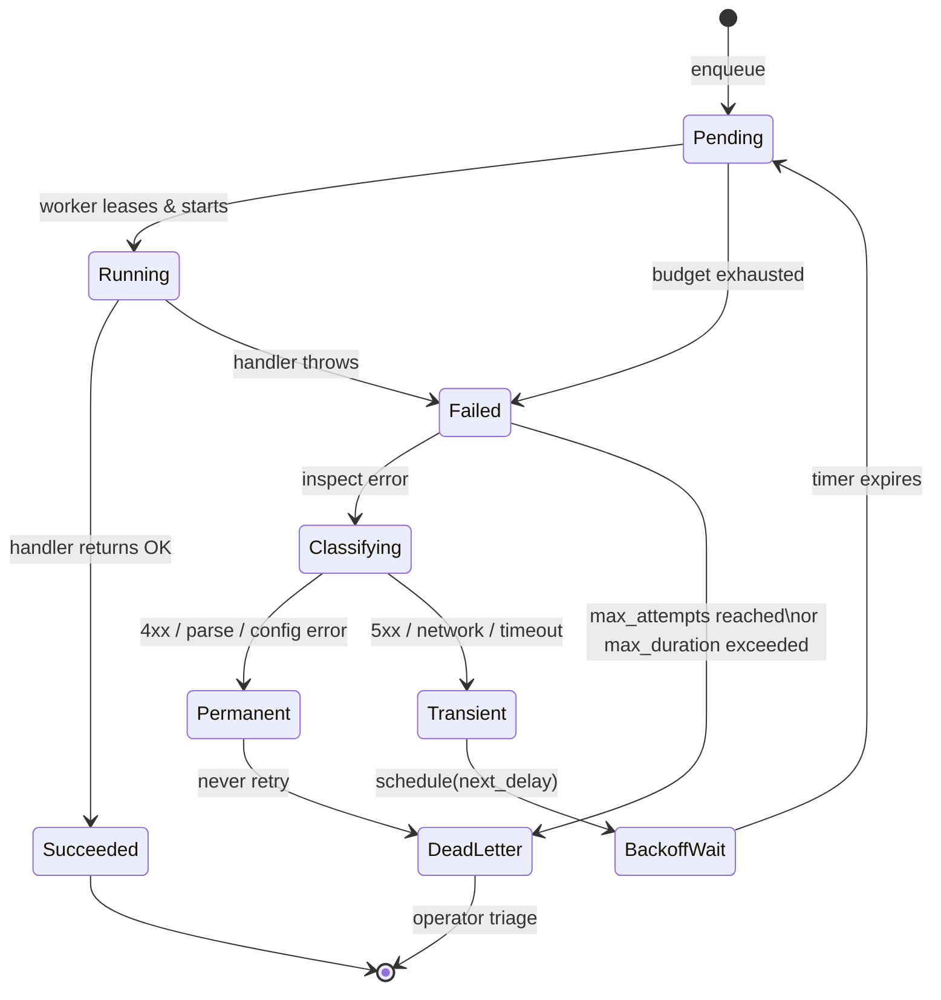

# Retry, Backoff, and Idempotency — At-Least-Once Execution Without Duplicate Side Effects

**Date:** 2026-05-01 | **Updated:** 2026-05-01
**Tags:** `system-design` `deep-dive` `scheduler` `retries` `idempotency`

> **Companion to:** [`../design-job-scheduler.md`](../design-job-scheduler.md), expanding §7.2. The parent case study covers the scheduler end-to-end (storage, dispatch, locking, fairness, cron correctness). This deep dive covers the retry-execution side: how to fail safely, when to give up, and how to make handlers safe to run more than once. The single most common production incident in any scheduler is *not* a missed job — it is the **duplicate side effect** caused by retrying a job whose handler was not idempotent.

## Table of Contents

- [Summary](#summary)
- [Overview — The Retry State Machine](#overview--the-retry-state-machine)
- [Why Every Job Will Eventually Fail](#why-every-job-will-eventually-fail)
  - [Transient Errors That Justify Retry](#transient-errors-that-justify-retry)
  - [Permanent Errors That Must Not Retry](#permanent-errors-that-must-not-retry)
  - [The Ambiguous Middle (Timeouts)](#the-ambiguous-middle-timeouts)
- [The Retry Budget](#the-retry-budget)
  - [Max Attempts vs Max Total Duration](#max-attempts-vs-max-total-duration)
  - [Per-Job vs Global Budgets](#per-job-vs-global-budgets)
  - [Token-Bucket Across Workers](#token-bucket-across-workers)
- [Backoff Strategies](#backoff-strategies)
  - [Exponential Backoff](#exponential-backoff)
  - [Full Jitter, Equal Jitter, Decorrelated Jitter](#full-jitter-equal-jitter-decorrelated-jitter)
  - [The Thundering-Herd Failure Mode](#the-thundering-herd-failure-mode)
- [Per-Job Retry Policy and Error Classification](#per-job-retry-policy-and-error-classification)
  - [Classification Drives Strategy](#classification-drives-strategy)
  - [HTTP Status Code Mapping](#http-status-code-mapping)
  - [Custom Domain Errors](#custom-domain-errors)
- [Idempotency at the Handler](#idempotency-at-the-handler)
  - [Run-IDs as the Per-Attempt Key](#run-ids-as-the-per-attempt-key)
  - [Forwarding the Key to Downstream Calls](#forwarding-the-key-to-downstream-calls)
  - [The Inbox Pattern — Cache the Result, Not Just the Key](#the-inbox-pattern--cache-the-result-not-just-the-key)
- [Dead-Letter Queues and Operator Triage](#dead-letter-queues-and-operator-triage)
  - [What Goes Into the DLQ](#what-goes-into-the-dlq)
  - [Poison-Message Detection](#poison-message-detection)
  - [Replay and Quarantine](#replay-and-quarantine)
- [Compensation for Partial Side Effects](#compensation-for-partial-side-effects)
- [Worked Example — HTTP 503, Three Attempts, Success](#worked-example--http-503-three-attempts-success)
- [Anti-Patterns](#anti-patterns)
- [Related](#related)
- [References](#references)

## Summary

The contract a scheduler offers is **at-least-once execution**. That means *every* handler must tolerate being invoked more than once for the same logical job, because reality conspires to make duplicates unavoidable: a worker crashes after side-effecting but before acknowledging; a network blip drops the ack; a deploy rolls a pod mid-handler; an OOM kills the process between the API call and the database commit. Telling users "we delivered exactly-once" is a fairy tale — at-most-once and at-least-once are the only honest choices, and a job scheduler cannot deliver at-most-once without losing work. Once you accept at-least-once, three pieces of machinery do the heavy lifting. **Exponential backoff with jitter** spreads retries across time so a flapping dependency does not get hammered the moment it recovers. **Retry budgets** (max attempts, max total duration) prevent a poison job from chewing worker capacity forever. **Idempotency keys**, threaded from the scheduler's `run_id` into every downstream API call, ensure that retrying a partially-completed handler does not double-charge a card, double-send an email, or double-decrement an inventory counter. The combination — bounded retries, jittered timing, and an idempotent handler that uses the inbox pattern to cache its result — gives you the engineering equivalent of exactly-once **effect**, even though the underlying delivery is at-least-once. This document is the operating manual for that combination.

## Overview — The Retry State Machine

A job execution moves through a small state machine. Most production schedulers (Sidekiq, Celery, Temporal, AWS Step Functions, Kubernetes Jobs) implement a variant of it.



A few pieces deserve early emphasis:

1. **Classification happens before backoff.** A 4xx response from a downstream API should not consume a retry attempt — it should go straight to the dead-letter queue. Retrying a permanent error is wasted work and amplifies bad behavior on every backoff cycle.
2. **`Pending → Running` is where idempotency matters.** Two workers might lease the same job because the previous lease holder crashed silently. The handler must assume this can happen.
3. **`DeadLetter` is a real terminal state, not a synonym for "lost".** A well-run scheduler treats the DLQ as a queue with a human consumer (the on-call engineer) and supplies tooling to inspect, replay, or quarantine messages.

## Why Every Job Will Eventually Fail

A scheduler running 1 K jobs/sec processes 86 M jobs/day. At those volumes, anything with a non-zero failure probability happens routinely. The mental model: failure is the modal case at scale, and the question is only how the system reacts.

### Transient Errors That Justify Retry

These represent ephemeral conditions; the same input has a high chance of succeeding on a later attempt.

- **Network**: connection-reset, DNS resolution failure, TLS handshake timeout, proxy 502.
- **Backend overload**: HTTP 503 Service Unavailable, HTTP 429 Too Many Requests, gRPC `RESOURCE_EXHAUSTED`, gRPC `UNAVAILABLE`.
- **Server-side internal**: HTTP 500 Internal Server Error (sometimes — see classification below).
- **Process-level**: worker OOM, container eviction, host-level kernel panic, deploy rollout SIGTERM.
- **Lock contention**: row lock wait timeout, deadlock victim, optimistic-lock retry on a `version` column.
- **Cloud quota**: throttled API call (S3 SlowDown, DynamoDB ProvisionedThroughputExceeded).

### Permanent Errors That Must Not Retry

These represent malformed or unauthorized input. Retrying does not change the outcome and adds cost.

- **HTTP 400 Bad Request** — the request body or parameters are wrong; nothing about waiting will fix it.
- **HTTP 401 Unauthorized / 403 Forbidden** — credentials are wrong; you'll just get the same answer.
- **HTTP 404 Not Found** — the resource is gone (sometimes — see exceptions in classification).
- **HTTP 422 Unprocessable Entity** — semantic validation failure.
- **Deserialization errors** — the payload cannot even be parsed. The job is broken at the data level.
- **Schema mismatch** — the worker is older than the producer; deploy will fix this, retrying will not.
- **Domain rule violations** — "user is suspended", "account is closed", "promotion already redeemed".

### The Ambiguous Middle (Timeouts)

Timeouts are the hardest class. A handler timed out at the network layer; *did it succeed?* You cannot tell. The processor might have charged the card and failed to return; the database might have committed and failed to ack. **Treat client timeouts as transient and retry — but only safely if the downstream call carried an idempotency key.** Without one, a retry on an ambiguous timeout is exactly how duplicate charges happen. This is the single most important reason idempotency keys exist on the wire (see [Stripe's idempotency contract](#references) below).

## The Retry Budget

Retry without bound is a denial-of-service attack on yourself. Every retry policy must answer two questions: *how many times?* and *for how long?*

### Max Attempts vs Max Total Duration

Two budgets, both required, whichever expires first wins.

- **`max_attempts`** — typical: 5–10. Sidekiq's default is 25 with a `retry_in` decay over ~21 days, which is too generous for most use cases; Temporal defaults to unlimited but recommends bounding via `MaximumAttempts`. Bound it. A poison job not failing fast steals worker capacity from healthy jobs.
- **`max_total_duration`** — typical: 1 hour for time-sensitive jobs, 24 hours for tolerant ones. This catches the case where exponential backoff has stretched out so far that the job will retry weeks from now, long after the business intent is dead. A welcome-email job that retries 30 days later is worse than no email at all.

```python
@dataclass
class RetryPolicy:
    max_attempts: int = 8
    max_total_duration_ms: int = 24 * 3600 * 1000  # 24 hours
    initial_backoff_ms: int = 1000
    max_backoff_ms: int = 5 * 60 * 1000             # 5 minutes
    multiplier: float = 2.0
    jitter: str = "decorrelated"                    # "full" | "equal" | "decorrelated"
    non_retryable_errors: tuple = (
        "ValidationError",
        "AuthenticationError",
        "PermissionDenied",
        "DeserializationError",
    )
```

### Per-Job vs Global Budgets

Per-job budgets are about correctness ("don't run this forever"). Global budgets are about platform health ("don't let one tenant's broken job storm the queue"). Both belong.

- **Per-job retry budget** — counted on the row itself (`job.attempts`, `job.first_attempt_at`). Each retry increments; budget exhaustion routes to DLQ.
- **Global retry budget** — a circuit-breaker–style limiter at the dispatcher level, expressed as "no more than X% of dispatched work this minute may be retries". This caps the blast radius when a downstream is broken: instead of devoting 100% of workers to retry storms, the platform caps retries at, say, 30% of capacity and lets new fresh work continue to flow.

### Token-Bucket Across Workers

For coordinated retry rate-limiting, a token bucket *per downstream dependency* shared across all workers is the right primitive.

- Bucket key: `retry::{tenant}::{dependency}`.
- Refill rate: e.g. 100 tokens/sec.
- Capacity: e.g. 200 tokens (burst).
- Backed by Redis (`INCRBY` / Lua) for atomic decrement-or-fail.

When the bucket is empty, the worker does not retry immediately — it requeues with extended backoff. This is the global-throttle equivalent of AWS Builders' Library's *adaptive retry* recommendation (see references): the system itself slows down retry rate when downstreams signal distress.

## Backoff Strategies

### Exponential Backoff

The base formula:

```text
delay(attempt) = min(max_backoff, initial_backoff × multiplier^attempt)
```

Doubling (`multiplier = 2`) is the default. With `initial = 1s`, `max = 5min`:

| Attempt | Raw delay (no jitter) |
|---:|---:|
| 0 | 1 s |
| 1 | 2 s |
| 2 | 4 s |
| 3 | 8 s |
| 4 | 16 s |
| 5 | 32 s |
| 6 | 64 s |
| 7 | 128 s |
| 8 | 256 s → capped at 300 s |
| 9+ | 300 s |

The cap matters. Without it, attempt 20 would wait ~12 days; attempt 25 would wait ~1 year. The cap also bounds the jitter window so retry storms cannot stretch into infinity.

### Full Jitter, Equal Jitter, Decorrelated Jitter

The 2015 AWS Architecture Blog post ["Exponential Backoff and Jitter"](https://aws.amazon.com/blogs/architecture/exponential-backoff-and-jitter/) is the canonical reference. Three jitter strategies, increasing in sophistication:

- **No jitter (`base`)** — fixed exponential. **Bad.** Synchronizes retries across all clients, creating a herd at every backoff boundary.
- **Full jitter (`random(0, base)`)** — uniform random between 0 and the computed base. AWS's recommended default. Smooths the herd completely, at the cost of occasionally retrying *too soon* (close to 0 ms).
- **Equal jitter (`base/2 + random(0, base/2)`)** — half the base, plus a random half. Compromise: never retries earlier than `base/2`, still spreads the rest.
- **Decorrelated jitter** — each attempt's delay is a random function of the *previous* attempt's delay, not the attempt number. Prevents tight cohorts from clumping at the same backoff because their attempt counters are aligned.

The decorrelated-jitter formula from the AWS post:

```python
import random

def decorrelated_jitter(prev_delay_ms: int, base_ms: int, cap_ms: int) -> int:
    """
    Decorrelated jitter (AWS Architecture Blog, 2015).
    Each delay is a random function of the previous delay,
    not of the attempt index. This avoids tight cohorts
    of clients re-synchronizing on shared exponential schedules.
    """
    next_delay = random.uniform(base_ms, prev_delay_ms * 3)
    return min(cap_ms, int(next_delay))


# Usage across attempts:
def backoff_schedule(policy: "RetryPolicy", attempts: int) -> list[int]:
    delays = []
    prev = policy.initial_backoff_ms
    for _ in range(attempts):
        d = decorrelated_jitter(prev, policy.initial_backoff_ms, policy.max_backoff_ms)
        delays.append(d)
        prev = d
    return delays
```

Picking between strategies in practice:

- **Full jitter** for most general workloads.
- **Equal jitter** when you want a minimum delay (e.g., respecting a `Retry-After` header at least loosely).
- **Decorrelated jitter** when you have a large client population (≥1 K workers) all retrying against the same downstream. This is the default for cloud SDKs (AWS SDK uses a variant by default).

### The Thundering-Herd Failure Mode

Without jitter, here is what happens. A downstream service hiccups for 30 seconds. 10 K jobs fail. They all schedule retries at exactly `t = 1 s, 2 s, 4 s, 8 s, …`. The downstream is hit by 10 K simultaneous requests at each boundary — a self-inflicted DDoS. Each hit makes the downstream slower, which makes the next batch of retries fail again, which compounds.

Jitter breaks this cleanly by spreading the 10 K retries uniformly across the backoff window. The instantaneous request rate is now roughly `10 K / window_seconds`, which the downstream can absorb. AWS's post quantifies the difference: full jitter reduced peak retry rate by ~10x in their internal experiments.

## Per-Job Retry Policy and Error Classification

### Classification Drives Strategy

A retry policy is meaningless without a classifier that says *what counts as retryable*. Classification is per-handler, not platform-wide. A 404 from the user-lookup service might be permanent (user really is gone) for one handler and transient (eventual-consistency lag) for another.

```python
class RetryDecision(Enum):
    RETRY = "retry"
    DEAD_LETTER = "dead_letter"
    DROP = "drop"  # rare; for jobs whose business intent has expired


def classify(error: Exception, attempt: int, policy: RetryPolicy) -> RetryDecision:
    # Hard non-retryable types (deserialization, validation, auth)
    if type(error).__name__ in policy.non_retryable_errors:
        return RetryDecision.DEAD_LETTER

    # HTTP-shaped errors
    if isinstance(error, HttpError):
        return classify_http(error, attempt, policy)

    # Budget exhaustion
    if attempt >= policy.max_attempts:
        return RetryDecision.DEAD_LETTER

    # Default for unknown errors: treat as transient
    return RetryDecision.RETRY


def classify_http(error: "HttpError", attempt: int, policy: RetryPolicy) -> RetryDecision:
    code = error.status_code
    if code == 429:
        return RetryDecision.RETRY  # honor Retry-After if present
    if 500 <= code < 600:
        return RetryDecision.RETRY  # 5xx are transient by default
    if 400 <= code < 500:
        return RetryDecision.DEAD_LETTER  # client errors are permanent
    return RetryDecision.RETRY
```

### HTTP Status Code Mapping

A reasonable starting point. Tune per-domain.

| Status | Default classification | Notes |
|---:|---|---|
| 200, 201, 202, 204 | Success | — |
| 400 | Dead-letter | Bad request — never retryable |
| 401 | Dead-letter | Auth missing/invalid; rotating creds is an operator action |
| 403 | Dead-letter | Authz denied — same |
| 404 | Dead-letter (usually) | Sometimes retryable in eventually-consistent systems |
| 408 | Retry | Server-side timeout — transient |
| 409 | Dead-letter (usually) | Conflict: caller's view is stale; refetch + replay logic, not a blind retry |
| 422 | Dead-letter | Semantic validation failure |
| 429 | Retry with `Retry-After` | Honor the header if present |
| 500 | Retry | Internal server error; might recover |
| 501 | Dead-letter | Not implemented — never retry |
| 502, 503, 504 | Retry | Bad gateway / unavailable / gateway timeout |
| Connection reset | Retry (with idempotency key) | Outcome unknown — see ambiguous-middle warning |
| TLS handshake failure | Retry | Transient infra |

### Custom Domain Errors

Define an error taxonomy for the handler's domain. Use exception types or error codes; do not parse human-readable messages.

```python
class TransientError(Exception): ...
class PermanentError(Exception): ...

class InventoryStockoutError(PermanentError): ...        # don't retry — business state
class PaymentDeclinedError(PermanentError): ...          # never retry — issuer said no
class PaymentProcessorBusyError(TransientError): ...     # retry — processor temporary
class DownstreamRateLimitedError(TransientError): ...    # retry with backoff
```

The classifier checks `isinstance(error, TransientError)` vs `isinstance(error, PermanentError)` — the type system carries the policy.

## Idempotency at the Handler

The framework guarantees at-least-once delivery. The handler guarantees at-least-once delivery does not produce more than one effect. Three patterns, applied in combination:

### Run-IDs as the Per-Attempt Key

Every job execution has two identifiers:

- **`job_id`** — stable across retries. The logical job (e.g., "send welcome email to user 42").
- **`run_id`** — stable across retries of the same logical execution. Generated when the job is enqueued (or when the cron firing materializes a run).

Some systems also keep an **`attempt`** counter (incremented per retry). The right choice for *downstream* idempotency keys is **`run_id`**, not `(run_id, attempt)`. The whole point of an idempotency key is that retries of the same logical operation collapse into a single side effect; using attempt-suffixed keys defeats that.

```python
def derive_idempotency_key(job_id: str, run_id: str, downstream: str) -> str:
    """
    Per-downstream idempotency key derived from the run_id.
    Same key across retries of the same run = same effect downstream.
    """
    return f"{downstream}:{job_id}:{run_id}"
```

### Forwarding the Key to Downstream Calls

Pass it on every external call. Stripe, Square, Adyen, AWS APIs, Twilio — all accept idempotency keys. Use them.

```python
# Stripe: Idempotency-Key header
stripe.Charge.create(
    amount=2000,
    currency="usd",
    source="tok_visa",
    idempotency_key=derive_idempotency_key(job_id, run_id, "stripe.charge"),
)

# AWS SDK: ClientToken / ClientRequestToken parameter
ec2.run_instances(
    ImageId="ami-...",
    MinCount=1,
    MaxCount=1,
    ClientToken=derive_idempotency_key(job_id, run_id, "ec2.run_instances"),
)
```

For internal services that you control, accept an `Idempotency-Key` header on every state-changing endpoint and treat duplicates as no-ops with cached responses.

### The Inbox Pattern — Cache the Result, Not Just the Key

The receiving end of an idempotent endpoint must remember not just that it saw the key, but *what answer it gave*. Otherwise a retry sees "yes I processed that" but cannot return the original response.

```sql
CREATE TABLE inbox (
    idempotency_key  TEXT PRIMARY KEY,
    request_hash     TEXT NOT NULL,         -- guards against key reuse with a different body
    response_status  INT  NOT NULL,
    response_body    JSONB NOT NULL,
    created_at       TIMESTAMPTZ NOT NULL DEFAULT NOW(),
    expires_at       TIMESTAMPTZ NOT NULL    -- e.g. 24 h
);

CREATE INDEX inbox_expires_idx ON inbox (expires_at);
```

```python
def idempotent_handler(request, key: str, processor):
    """
    Inbox-pattern wrapper: deduplicate by idempotency key,
    cache the full response so retries return the original answer.
    """
    request_hash = sha256_canonical(request)

    # Fast path: already processed
    cached = db.fetch_one(
        "SELECT request_hash, response_status, response_body "
        "FROM inbox WHERE idempotency_key = %s AND expires_at > NOW()",
        (key,),
    )
    if cached:
        if cached["request_hash"] != request_hash:
            # Same key, different body — caller bug. Reject hard.
            raise IdempotencyKeyConflict(key)
        return cached["response_status"], cached["response_body"]

    # Slow path: do the work, then store the result atomically
    with db.transaction():
        status, body = processor(request)
        db.execute(
            "INSERT INTO inbox "
            "(idempotency_key, request_hash, response_status, response_body, expires_at) "
            "VALUES (%s, %s, %s, %s, NOW() + INTERVAL '24 hours') "
            "ON CONFLICT (idempotency_key) DO NOTHING",
            (key, request_hash, status, body),
        )
    return status, body
```

Three properties this gives you:

1. **Deduplication.** A retry returns the cached response without re-running the side effect.
2. **Body conflict detection.** If a caller reuses the same key with a *different* request body (a real and pernicious bug), the inbox rejects it loudly instead of silently picking one.
3. **Atomic side effect + record.** The result row and any DB writes the processor performed live in the same transaction. There is no window where the side effect happened but the inbox does not know.

For external side effects (calling Stripe), the equivalent is "do the side effect inside a transaction that also writes the inbox row, *then* commit". A crash between the API call and the commit is recovered safely because the next attempt sees no inbox row, retries the call, and Stripe deduplicates on its side.

## Dead-Letter Queues and Operator Triage

### What Goes Into the DLQ

Anything that exhausts its retry budget or hits a permanent classification. The DLQ row carries enough context to triage without rerunning the failure:

```sql
CREATE TABLE dead_letter_jobs (
    job_id          TEXT PRIMARY KEY,
    run_id          TEXT NOT NULL,
    payload         JSONB NOT NULL,           -- original job payload
    last_error      TEXT NOT NULL,            -- exception class + message
    last_error_kind TEXT NOT NULL,            -- 'permanent' | 'budget_exhausted' | 'poison'
    attempts        INT  NOT NULL,
    first_failed_at TIMESTAMPTZ NOT NULL,
    last_failed_at  TIMESTAMPTZ NOT NULL,
    last_attempt_log JSONB,                   -- structured log of all attempts
    quarantined     BOOLEAN NOT NULL DEFAULT FALSE
);
```

The DLQ is a queue with a human consumer. Treat it as a first-class operational surface: a dashboard with counts by `last_error_kind`, alerts when growth rate spikes, and a runbook for each common error class.

### Poison-Message Detection

A "poison" message is one that fails deterministically — same payload, same error, every time. The retry machinery cannot tell this apart from a transient failure that happens to keep recurring. Detection helps:

```python
def is_likely_poison(job, recent_attempts: list) -> bool:
    """
    Heuristic: if the same exception class + message has occurred N times,
    the message is likely poison. Quarantine before consuming the full budget.
    """
    if len(recent_attempts) < 3:
        return False
    error_signatures = {(a.error_class, a.error_message_hash) for a in recent_attempts[-3:]}
    return len(error_signatures) == 1
```

When `is_likely_poison` fires, route the job to a quarantine bucket (still in DLQ, but flagged) and stop wasting retry budget. AWS SQS implements this natively via a `redrive_policy` and a DLQ; Kafka has DLT (Dead Letter Topics) in Kafka Connect; Sidekiq has a `dead set` you can browse and replay from.

### Replay and Quarantine

Operator tooling needs three actions on a DLQ row:

1. **Replay** — re-enqueue the job with a fresh `run_id` (for total replay) or the same `run_id` (to test whether the inbox catches it). Same-`run_id` replay is the safer choice when you've fixed the upstream bug and want idempotency to skip already-applied effects.
2. **Edit and replay** — modify the payload (e.g., correct a malformed field) and re-enqueue. Audit-logged.
3. **Discard** — explicitly drop. Audit-logged. Useful when the job's business intent has expired (a welcome email for a user deleted three days ago).

## Compensation for Partial Side Effects

Idempotency makes retries safe. It does not, by itself, make *partial completion* safe. Imagine a handler that does:

```text
1. Charge the card
2. Insert order row
3. Enqueue fulfillment task
```

If step 2 fails after step 1, an idempotent retry charges nothing extra (good) but you are now stuck — the charge happened, the order does not exist. There are two clean strategies:

- **All side effects in one local transaction.** Where possible, fold the work into a single DB transaction so partial completion is impossible. The outbox pattern (write the order row and an outbox event row in the same transaction; a separate publisher emits the event) is the canonical version of this.
- **Saga with compensations.** When you cannot, define a compensating action for each step (refund the charge if the order cannot be saved). The handler becomes a small saga. See [`../../e-commerce/amazon-ecommerce/checkout-saga.md`](../../e-commerce/amazon-ecommerce/checkout-saga.md) for the long-form treatment.

The retry-and-idempotency layer is necessary but not sufficient for handlers with multiple side effects. Plan for compensation before shipping the handler, not after the first incident.

## Worked Example — HTTP 503, Three Attempts, Success

A payment-status-poll job calls a downstream PSP at 14:00:00. The PSP is having a partial outage.

```text
t = 14:00:00.000   attempt 0
                   POST /charges/{id}/status with Idempotency-Key=psp:job123:run456
                   <- 503 Service Unavailable
                   classify(503) -> RETRY
                   prev_delay = 1000 ms
                   next_delay = decorrelated_jitter(1000, 1000, 300000)
                            = uniform(1000, 3000) -> 2150 ms
                   schedule retry at 14:00:02.150

t = 14:00:02.150   attempt 1
                   POST ... same Idempotency-Key
                   <- 503
                   classify -> RETRY
                   prev_delay = 2150
                   next_delay = uniform(1000, 6450) -> 4820 ms
                   schedule retry at 14:00:06.970

t = 14:00:06.970   attempt 2
                   POST ... same Idempotency-Key
                   <- 200 OK { "status": "succeeded", "amount": 2000 }
                   inbox stores response, handler returns success
                   job moves to Succeeded
```

Three observations from this trace:

1. **The same Idempotency-Key was sent on every attempt.** Even if attempt 0 had silently succeeded server-side and the 503 was a load-balancer artifact, attempt 1 and 2 would not have created a duplicate charge — the PSP's idempotency layer collapses them.
2. **Decorrelated jitter spread the retries across time** rather than putting attempt 1 at exactly 2 s and attempt 2 at exactly 4 s. If 100 K identical jobs all hit the same 503 at 14:00:00, their retries would be spread across the next ~6 seconds, not stacked at three precise instants.
3. **The total elapsed time is bounded.** Attempt 2 fired ~7 s after attempt 0. Even if the job had failed all 8 attempts, capped retries plus capped backoff would terminate in O(20 minutes), not O(weeks).

## Anti-Patterns

1. **Fixed-interval retry.** "Just retry every 5 seconds." Synchronizes retry storms perfectly across all failed jobs. Always use exponential backoff; always add jitter.
2. **Exponential backoff *without* jitter.** Less obviously broken than fixed interval, but still synchronizes the herd at every boundary (1 s, 2 s, 4 s, 8 s, …). Jitter is mandatory, not optional.
3. **Retry without `max_attempts`.** A poison job loops forever, consuming worker capacity that healthy jobs need. Even infinite-retry systems (Temporal default) should be bounded for production.
4. **Retry without `max_total_duration`.** A job that retries with 5-minute caps for a week is almost never wanted. The business intent has expired; the job is now a ghost. Bound the wallclock.
5. **No idempotency key on downstream calls.** A timeout at the network layer with no key on the wire is exactly how Stripe duplicate-charges and Twilio duplicate-SMS happen. The PSP cannot dedupe what you did not key.
6. **Retrying 4xx errors.** A 400 will be 400 forever. Retrying it costs money and produces noisy alerts. Classify before retrying.
7. **Per-attempt idempotency keys.** `key = f"{run_id}:{attempt}"` defeats the entire point — every retry generates a *different* key, so the downstream cannot collapse them. The key must be stable across retries of the same run.
8. **No DLQ.** Failed jobs vanish silently or, worse, occupy the main queue forever. The DLQ is a load-bearing operational surface.
9. **DLQ that nobody monitors.** Same as no DLQ, but with the additional insult of pretending you are operationally mature. Alert on DLQ growth rate, not just absolute size.
10. **Catching exceptions in the handler and returning success.** This is the worst failure mode: the framework thinks the job succeeded, no retry happens, no alert fires, the side effect was never produced. Handlers should propagate failures up to the framework — never swallow them.
11. **Retrying after `4xx Bad Request` due to a code bug.** A retry against a `null` field will fail the same way every time. These should be classified as permanent and dead-lettered immediately so the bug surfaces.
12. **Assuming exactly-once.** It is not a property the platform can offer end-to-end. Plan for at-least-once and engineer for idempotent effect.
13. **Storing inbox keys forever.** Inboxes need TTL (24–72 h is typical). Without it, the table grows unbounded and queries slow.
14. **Letting jitter pick `0`.** Full jitter on a `min(0, base)` window can pick a delay close to 0 ms, retrying instantly. For dependencies with rate limits, prefer equal jitter to enforce a minimum delay.
15. **One global retry policy for every handler.** A 1 ms cron emitter and a 5-minute report generator should not share `max_backoff` or `max_attempts`. Per-handler policy, every time.

## Related

- [`./distributed-lock-per-job.md`](./distributed-lock-per-job.md) — at-least-once dispatch *creates* the duplicate-execution risk this document mitigates. Locks reduce double-runs; idempotency makes the residual double-runs safe.
- [`./missed-fire-policies.md`](./missed-fire-policies.md) — when a recurring job's fire was missed (worker down, deploy window). Decisions here interact with retry policy: a coalesced missed fire still inherits the retry budget.
- [`./multi-tenant-fairness.md`](./multi-tenant-fairness.md) — global retry budgets and token buckets are part of the fairness story; one tenant's broken job storming the queue must be capped.
- [`../design-job-scheduler.md`](../design-job-scheduler.md) — parent case study; this deep dive expands §7.2.
- [`../../../reliability/retry-strategies.md`](../../../reliability/retry-strategies.md) — general retry-strategy reference covering circuit breakers, hedging, and adaptive retry.
- [`../../../communication/exactly-once-and-idempotency.md`](../../../communication/exactly-once-and-idempotency.md) — the communication-layer treatment of exactly-once delivery vs exactly-once effect; foundational reading.

## References

- AWS Architecture Blog, ["Exponential Backoff and Jitter"](https://aws.amazon.com/blogs/architecture/exponential-backoff-and-jitter/) — the canonical 2015 post that introduced full / equal / decorrelated jitter and quantified peak-load reduction.
- AWS Builders' Library, ["Timeouts, retries and backoff with jitter"](https://aws.amazon.com/builders-library/timeouts-retries-and-backoff-with-jitter/) — Marc Brooker's longer-form treatment, including adaptive retry, retry budgets across services, and circuit-breaker integration.
- Stripe API Reference, ["Idempotent requests"](https://stripe.com/docs/api/idempotent_requests) — canonical idempotency-key contract on a financial API; the model worth copying for any state-changing endpoint.
- Google Cloud Pub/Sub, ["At-least-once delivery"](https://cloud.google.com/pubsub/docs/subscriber#at-least-once-delivery) — explicit acknowledgment that exactly-once is not a primitive the platform offers, and the implications for subscriber design.
- AWS SQS Developer Guide, ["Amazon SQS dead-letter queues"](https://docs.aws.amazon.com/AWSSimpleQueueService/latest/SQSDeveloperGuide/sqs-dead-letter-queues.html) — DLQ semantics, redrive policies, and `maxReceiveCount` (the SQS analog of `max_attempts`).
- Sidekiq Wiki, ["Error Handling"](https://github.com/sidekiq/sidekiq/wiki/Error-Handling) — Ruby's most-used job framework's retry model, including the (overly generous) default 25-attempt schedule and the `dead set`.
- Temporal Documentation, ["Retry policies"](https://docs.temporal.io/encyclopedia/retry-policies) — workflow-engine retry semantics: per-activity policy, non-retryable error types, exponential coefficients, max attempts.
- AWS Well-Architected Lens, ["Idempotency for Distributed Systems"](https://docs.aws.amazon.com/wellarchitected/latest/financial-services-industry-lens/idempotency.html) — the financial-services lens chapter on idempotency-key derivation, inbox tables, and key lifetime.
