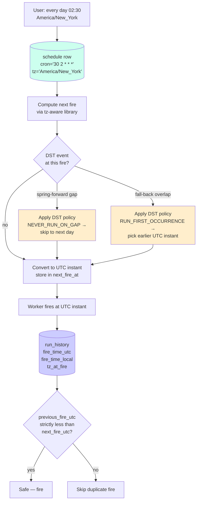

# Time-Zone Correctness for Cron — IANA TZ, DST Transitions, and Idempotent Fires

**Date:** 2026-05-01 | **Updated:** 2026-05-01
**Tags:** `system-design` `deep-dive` `scheduler` `timezone` `dst`

> **Parent case study:** [Design a Job Scheduler](../design-job-scheduler.md). This deep-dive expands §7.4 "Time-zone correctness for cron".

## Table of Contents

- [Summary](#summary)
- [Overview](#overview)
- [POSIX Time vs Civil Time](#posix-time-vs-civil-time)
- [Cron in UTC vs Cron in a Tenant Time Zone](#cron-in-utc-vs-cron-in-a-tenant-time-zone)
- [The IANA Time Zone Database — Source of Truth](#the-iana-time-zone-database--source-of-truth)
- [Storage: Cron Expression Plus IANA Name, Never Offset](#storage-cron-expression-plus-iana-name-never-offset)
- [The DST Trap — "Every Day at 02:30"](#the-dst-trap--every-day-at-0230)
- [Spring-Forward — Non-Existent Wall-Clock Times](#spring-forward--non-existent-wall-clock-times)
- [Fall-Back — Ambiguous Wall-Clock Times](#fall-back--ambiguous-wall-clock-times)
- [DST Policy Choice](#dst-policy-choice)
- [Computing Next Fire Time Across DST](#computing-next-fire-time-across-dst)
- [Run-History Records — Wall-Clock and UTC Together](#run-history-records--wall-clock-and-utc-together)
- [Tenant Moves Time Zones](#tenant-moves-time-zones)
- [Leap Seconds and Other Civil-Time Oddities](#leap-seconds-and-other-civil-time-oddities)
- [Quartz Cron vs Unix Cron Syntax](#quartz-cron-vs-unix-cron-syntax)
- [RRULE — RFC 5545 as a Richer Alternative](#rrule--rfc-5545-as-a-richer-alternative)
- [Worked Example — "Every Day 02:30 America/New_York"](#worked-example--every-day-0230-americanew_york)
- [tzdata Updates as Operational Cadence](#tzdata-updates-as-operational-cadence)
- [Anti-Patterns](#anti-patterns)
- [Related](#related)
- [References](#references)

## Summary

Time looks easy until you write a scheduler. The naive mental model — "store a cron expression, compute the next fire, sleep until then" — silently breaks twice a year on every machine in every region that observes daylight savings, and silently breaks every time a country quietly changes its DST rules and ships a new tzdata release. The class of bugs all reduce to the same root cause: **mixing wall-clock arithmetic with UTC arithmetic without naming which one you're in**, and storing schedules without naming which civil calendar they live in. The fix is a small, disciplined contract: schedules are stored as `(cron_expression, IANA_tz_name)` pairs (never as UTC offsets, never as deprecated abbreviations like `EST` or `PST`), the next-fire computation is always done by a tz-aware library that consults the IANA tz database (Java `ZonedDateTime`, Python `zoneinfo`, Go `time.LoadLocation`), the result is converted to a UTC instant for storage in `next_fire_at`, and **every fire is idempotent against its computed UTC instant** — meaning fall-back's two 01:30s map to two distinct instants and neither is fired twice; spring-forward's missing 02:30 is either skipped or shifted to 03:00 according to an explicit policy, never silently doubled or dropped. This deep-dive covers the civil-time concepts that make all of this necessary (POSIX time vs civil time, IANA's role, ambiguous and non-existent wall-clock times), the four operational DST policies (ALWAYS_RUN, NEVER_RUN_ON_GAP, RUN_FIRST_OCCURRENCE_ON_OVERLAP, RUN_BOTH), the run-history schema that lets you forensically reconstruct what fired when, the tenant-relocation problem (a corporate customer moves operational HQ from New York to London — what happens to in-flight schedules?), and the fact that **tzdata is a piece of operational state**, not a static library, that must be updated on a cadence. The anti-patterns at the end are the bugs that actually ship to production: storing UTC offsets instead of IANA names, computing next-fire by adding 86400 seconds to the previous fire, and treating DST as a UI problem when it is in fact a scheduler-correctness problem.

## Overview

The parent case study (`../design-job-scheduler.md`) introduces time-zone correctness in §7.4 and lists three traps: storing without a tz, DST transitions, and deprecated abbreviations. This document opens the third dimension — the *why* behind those rules — and walks through the operational consequences a production scheduler must handle.

The questions answered here:

1. **Why is "store the cron and the offset" wrong?** Because UTC offsets are not time zones. `-05:00` is correct for New York in winter and wrong in summer; `America/New_York` is correct year-round.
2. **Why is fall-back the dangerous one?** Because the same wall-clock time happens twice in the same calendar day. A naive matcher fires twice. The fix is to track the UTC instant of the last fire.
3. **Why is spring-forward also dangerous?** Because the wall-clock time the user asked for *does not exist that day*. A trigger of `30 2 * * *` in `America/New_York` has no 02:30 on the second Sunday of March. Skipping silently is wrong; firing at the next valid time is wrong without an explicit policy.
4. **What do I store in the database?** The cron expression as text plus the IANA tz name. Compute `next_fire_at` (UTC) on each fire, store both the wall-clock-local and the UTC instant in run history.
5. **What if the customer changes time zones?** The cron expression doesn't change but the schedule's interpretation does. There must be a deliberate policy: cut over at the next fire, cut over at midnight tonight, or grandfather in-flight runs.
6. **Quartz cron vs Unix cron — same syntax?** No. Quartz adds a seconds field, has different day-of-week numbering, supports `?`, `L`, `W`, `#`. A scheduler that accepts both must parse them differently.
7. **Is RRULE better?** For calendar-style schedules ("third Tuesday of every month at 09:00 unless it's a federal holiday"), yes — RFC 5545 expresses things cron cannot. For minute-resolution machine schedules, cron is fine.



The general scheduler placement-level treatment lives in `../design-job-scheduler.md`; this doc specifically handles the *time* dimension — how a scheduler computes the right instant in the face of civil-time pathology.

## POSIX Time vs Civil Time

The vocabulary is the first thing to fix. There are two kinds of time in a scheduler.

**POSIX time** (also called Unix time, epoch time, "the UTC instant") is a count of seconds since 1970-01-01T00:00:00 UTC. It is monotonic, globally agreed-upon, and unambiguous. The function `time(NULL)` in C returns it. `Instant.now()` in Java returns it. `time.time()` in Python returns it. POSIX time has *no concept of time zones, dates, hours, or minutes* — it is just a number. Two systems anywhere in the world that ask for "now" agree on the POSIX instant within their clock-sync error.

**Civil time** (also called wall-clock time) is what humans use: "Wednesday, May 1, 2026 at 14:30 in New York." Civil time is a function of POSIX time and a *time zone* — a body of rules describing offsets from UTC over time, including DST transitions. The same POSIX instant produces different civil times in different zones. The same civil time, in a zone with DST, can map to two different POSIX instants (during fall-back) or no POSIX instant at all (during spring-forward).

The POSIX `tzset(3)` function is the standard mechanism by which a process is told which time zone to interpret civil time in. The `TZ` environment variable, the `/etc/localtime` symlink, the `IANA_TZ` keyword in code — all are knobs onto the same underlying system: civil-time conversions are tz-parameterized.

A scheduler must be ruthless about which kind of time each variable holds:

```text
next_fire_at         POSIX instant (UTC)            — used for "is it time to fire?"
fire_time_local      civil time (zone-tagged)        — used for "what does this mean to the user?"
cron_expression      string in user's civil time     — never compute UTC arithmetic on it
schedule_tz          IANA name                       — the parameter that converts the two
```

Storing `next_fire_at` as a `TIMESTAMP WITH TIME ZONE` in Postgres is correct (it stores a POSIX instant); storing it as `TIMESTAMP WITHOUT TIME ZONE` and "knowing it's UTC" is a bug waiting to happen the first time someone reads it from `psql` in a non-UTC session. The full general treatment of time and ordering across distributed systems lives in [`../../../data-consistency/time-and-ordering.md`](../../../data-consistency/time-and-ordering.md).

## Cron in UTC vs Cron in a Tenant Time Zone

A scheduler must commit to one of two semantics, per schedule:

**UTC-fixed cron.** "`0 2 * * *` means 02:00 UTC, every day, no matter what." Simple, never has DST issues, always exactly 24 hours between fires. Suitable for system-internal jobs (database vacuums, log rotation, internal metrics rollups) where the human-meaningful time of day is irrelevant. The drawback is that "02:00 UTC" is 18:00 in Los Angeles, 21:00 in New York, 03:00 in Berlin, and 11:00 in Tokyo — which means a "nightly" job in a UTC-fixed scheduler runs in the middle of the LA workday.

**Civil-time cron in a named zone.** "`0 2 * * *` in `America/New_York` means 02:00 New York time, every day." The fire's UTC instant moves twice a year as DST transitions happen — 06:00 UTC half the year, 07:00 UTC the other half. This is the correct semantic for *user-visible* schedules: nightly billing rollups, end-of-day reports, "send me a daily email at 9 AM," region-specific data exports.

Most production schedulers offer both, with an explicit field on the schedule row. Some libraries pick one and force it: standard Unix `cron` runs in `TZ` (the daemon's environment), Quartz `CronTrigger` defaults to JVM time zone unless `setTimeZone()` is called, AWS EventBridge Scheduler requires an explicit `ScheduleExpressionTimezone`, and `pg_cron` runs in the database server's `timezone` setting.

The split shows up in the schema:

```sql
CREATE TABLE schedules (
  id              UUID PRIMARY KEY,
  job_id          UUID NOT NULL REFERENCES jobs(id),
  trigger_type    TEXT NOT NULL,                  -- 'cron' | 'one_shot'
  cron_expression TEXT,                            -- '30 2 * * *'
  cron_dialect    TEXT NOT NULL DEFAULT 'unix',   -- 'unix' | 'quartz' | 'rrule'
  schedule_tz     TEXT NOT NULL DEFAULT 'UTC',    -- IANA tz name
  dst_policy      TEXT NOT NULL DEFAULT 'NEVER_RUN_ON_GAP',
  next_fire_at    TIMESTAMPTZ NOT NULL,           -- POSIX instant
  CONSTRAINT valid_iana_tz CHECK (schedule_tz ~ '^[A-Za-z_]+(/[A-Za-z_]+)+$' OR schedule_tz = 'UTC')
);
```

Every schedule names its own time zone explicitly. There is no "default time zone of the server." Server clocks should be UTC; civil-time interpretation is per-schedule.

## The IANA Time Zone Database — Source of Truth

The IANA Time Zone Database (also called *tzdata*, *zoneinfo*, *tz*, or — historically — Olson) is a public, continuously-maintained dataset describing every civil time zone in use, including:

- The UTC offset history (Lima was UTC-5:08 until 1908, then UTC-5; New York observed double DST in 1942-1945 for war reasons).
- The DST rules currently in effect for each zone.
- Future DST rules where governments have published them in advance.
- The mapping of *abbreviations* (EDT, EST, PDT, PST, BST, CET, CEST, etc.) to actual offsets at specific dates.

It is updated multiple times per year — typically 4-8 releases — as countries change their DST rules. Recent examples: Egypt re-instated DST in 2023; Mexico abolished DST in most of the country in 2022; Samoa skipped December 30, 2011 entirely when it crossed the international date line. Every one of those is a tzdata release, and every scheduler that wants correct fire times needs to ingest the new release.

The data ships in two main forms: source `.zi` files compiled by `zic(8)` into binary `tzfile(5)` format under `/usr/share/zoneinfo/`. Java bundles a copy in the JDK; Python 3.9+ uses the system tzdata via `zoneinfo` (PEP 615) or falls back to the `tzdata` PyPI package; Go embeds a stripped tzdata in the standard library and can also read the system one. They all consult the same source data.

The names in tzdata are *region-based*: `America/New_York`, `Europe/London`, `Asia/Tokyo`, `Australia/Sydney`. They are stable identifiers that survive political renamings (`Europe/Kiev` was renamed `Europe/Kyiv` in 2022 with `Europe/Kiev` retained as a link), survive city-merge events, and survive DST rule changes. Abbreviations like `EST` or `PST` are *not* IANA names — they are display strings. Several abbreviations are ambiguous (CST is Central Standard Time in the US, China Standard Time in China, and Cuba Standard Time in Cuba). Storing `EST` is storing nothing useful.

The full IANA Time Zone Database documentation lives at <https://www.iana.org/time-zones> and the official policy on DST is at <https://data.iana.org/time-zones/tz-link.html>. The classic essay on why this is hard is *Falsehoods Programmers Believe About Time* (linked in references); read it before designing anything tz-related.

## Storage: Cron Expression Plus IANA Name, Never Offset

The single most-frequent storage mistake in scheduler systems is to store a UTC offset instead of an IANA name:

```sql
-- WRONG
schedule_tz_offset INTERVAL NOT NULL,   -- '-05:00'

-- WRONG
schedule_tz_abbreviation TEXT NOT NULL, -- 'EST'

-- RIGHT
schedule_tz TEXT NOT NULL,              -- 'America/New_York'
```

The offset `-05:00` is correct for New York in winter and wrong by an hour in summer. Storing it commits the schedule to permanent winter-offset semantics, which means the schedule's *wall-clock time slowly drifts* relative to the user's actual local time as DST cycles. After one DST transition, "02:30 daily" is actually firing at "01:30 local" in the user's perception.

The abbreviation `EST` is worse — it is ambiguous (Australia also has EST, by which they mean Australian Eastern Standard Time, UTC+10), it does not encode DST rules, and it is not in the IANA database as a primary identifier (it exists as a deprecated alias).

The IANA name `America/New_York` encodes everything — current DST rules, historical DST rules, future DST rules where known, and the offset transitions — by reference. The scheduler does not need to know whether the schedule will fire under EDT or EST today; the tz-aware library figures it out from the name and the date.

The full schema row is small:

```sql
CREATE TABLE schedules (
  id                  UUID PRIMARY KEY,
  cron_expression     TEXT NOT NULL,
  cron_dialect        TEXT NOT NULL,
  schedule_tz         TEXT NOT NULL,           -- IANA name
  dst_policy          TEXT NOT NULL,
  next_fire_at        TIMESTAMPTZ NOT NULL,    -- POSIX instant
  last_fire_at        TIMESTAMPTZ,             -- POSIX instant
  last_fire_local     TIMESTAMP,               -- civil time at last fire
  last_fire_tz        TEXT                     -- tz that produced last_fire_local
);
```

`last_fire_at` is the UTC instant; `last_fire_local` and `last_fire_tz` are stored together to enable forensic reconstruction ("what was the wall-clock time when this fired?") without re-running tz arithmetic that may have changed (since tzdata may have been updated since the fire). Forensics is an underrated requirement: when an auditor asks "did this nightly batch run on the day of the New York DST switch?", you want to be able to answer with stored facts, not re-derived ones.

## The DST Trap — "Every Day at 02:30"

The classic illustration. A user creates a schedule: "run my backup every day at 02:30, in `America/New_York`." It runs without incident from January through early March. Then on the second Sunday of March (spring-forward), and again on the first Sunday of November (fall-back), things go wrong:

- **March (spring-forward).** The wall clock jumps from 01:59:59 EST directly to 03:00:00 EDT. *There is no 02:30 that day.* A naive scheduler that adds 24 hours to the previous UTC fire will fire one hour late; a naive scheduler that polls "is local time 02:30?" will never fire that day; a clever scheduler with a documented policy will explicitly skip or shift.
- **November (fall-back).** The wall clock jumps from 01:59:59 EDT back to 01:00:00 EST. *02:30 happens once at 02:30 EDT, then again 60 minutes later at 02:30 EST.* A naive scheduler that polls wall clock fires twice. A naive scheduler that adds 24 hours to the previous UTC fire fires once but at the wrong absolute instant relative to "every day."

Both cases break the user's mental model of "every day at 02:30." There is no implementation that satisfies it perfectly — the user's model is inconsistent with civil-time reality on those two days. The scheduler must pick a side and document it.

The general implementation rule is the four-step sequence already in the parent doc:

1. Parse the cron expression in the schedule's IANA tz.
2. Compute the next *local* fire time using a tz-aware library.
3. Convert the local fire to a UTC instant. **This is what `next_fire_at` stores.**
4. After firing, ensure the next computed UTC instant is strictly greater than the just-fired one. (Defends against fall-back duplicate.)

The remaining sections cover the edge cases of step 2 — what to do when the local fire time doesn't exist, or exists twice.

## Spring-Forward — Non-Existent Wall-Clock Times

Spring-forward produces a *gap* in civil time: a range of wall-clock times that simply never occur in that zone on that day. In `America/New_York`, the second-Sunday-of-March gap is `[02:00, 03:00)` local — there is no 02:00, no 02:01, no 02:30, no 02:59 on that day. The local clock reads `01:59:59` and then `03:00:00`.

If the cron expression says "`30 2 * * *` (02:30 every day)", the local time the scheduler is computing — "the next 02:30 in `America/New_York`" — does not exist on that day. The scheduler has three options:

| Option | Behavior |
|--------|----------|
| **Skip the day.** | Report no fire for this date. Next fire is the following day at 02:30. The user gets six daily backups in a 7-day week. |
| **Shift forward to first valid local time.** | Fire at 03:00 local (the start of the post-gap range). The user gets a fire that's 30 minutes "late" in their wall-clock perception. |
| **Shift backward to last valid local time.** | Fire at 01:59:59 local (just before the gap). The user gets a fire that's 30 minutes "early." Almost never useful. |

`java.time.ZonedDateTime` defaults to "shift forward" via its conversion rules: if you ask for `LocalDateTime.of(2026, 3, 8, 2, 30)` in `America/New_York` via `atZone(ZoneId)`, you get `2026-03-08T03:30-04:00` — the gap is bridged and the local time is silently changed. Python's `zoneinfo.ZoneInfo` similarly has a `fold` parameter that controls behavior; for non-existent times, the conversion is implementation-defined.

Quartz's `CronTrigger` skips by default — the next fire after the spring-forward day is the following day at the configured time. This is the safest semantic ("don't fire something that the user didn't ask for") and is the recommended default.

## Fall-Back — Ambiguous Wall-Clock Times

Fall-back produces a *fold* in civil time: a range of wall-clock times that occurs *twice* on the same day. In `America/New_York`, the first-Sunday-of-November fold is `[01:00, 02:00)` local — 01:30 happens at 01:30 EDT (UTC-4) and again 60 minutes later at 01:30 EST (UTC-5).

If the cron expression says "`30 1 * * *` (01:30 every day)", the local time `01:30` on the fall-back day is ambiguous: it could mean either of two distinct UTC instants. The scheduler must pick a rule and apply it consistently.

The Python `zoneinfo` library exposes this via the `fold` attribute: `fold=0` selects the earlier interpretation (01:30 EDT), `fold=1` selects the later (01:30 EST). The default in PEP 615 is `fold=0`. Java's `ZonedDateTime` similarly disambiguates: by default it picks the earlier offset, with `withEarlierOffsetAtOverlap()` and `withLaterOffsetAtOverlap()` to make the choice explicit.

A naive scheduler that polls "is the local wall clock now 01:30?" will say yes twice — once at 01:30 EDT and again at 01:30 EST — and will fire twice. The fix is to **never poll wall-clock**; always work in UTC instants. The next-fire computation produces a single UTC instant; the worker checks "has the current UTC time passed `next_fire_at`?" and fires once. The next computation, after that fire, must produce a UTC instant *strictly greater* than the previous one — which it will, naturally, because tz-aware libraries advance by a day in *civil-time* terms, which on the fall-back day means 25 hours of UTC.

The defensive check is the third line of defense — explicit verification that we are not about to fire the same instant twice:

```java
Instant nextUtc = computeNextFireUtc(cronExpression, scheduleTz, lastFireUtc);
if (lastFireUtc != null && !nextUtc.isAfter(lastFireUtc)) {
    log.warn("Computed next-fire is not strictly after last fire — possible DST bug");
    nextUtc = computeNextFireUtc(cronExpression, scheduleTz, nextUtc);  // skip ahead
}
```

This is belt-and-suspenders code. A correct tz-aware library will never produce a non-monotonic sequence, but the assertion catches misconfiguration (cron expression that fires twice in the same minute, mistaken `lastFireUtc` from a stale cache, double-trigger from clock skew between scheduler instances).

## DST Policy Choice

A production scheduler needs an explicit, per-schedule policy for DST anomalies. The four useful values:

| Policy | Spring-Forward | Fall-Back |
|--------|----------------|-----------|
| `ALWAYS_RUN` | Fire at first valid local time after the gap (e.g., 03:00 instead of missing 02:30). | Fire once at the *first* occurrence of the ambiguous local time (01:30 EDT). |
| `NEVER_RUN_ON_GAP` | Skip the day entirely; next fire is the following day. | Fire once at the first occurrence (default). |
| `RUN_FIRST_OCCURRENCE_ON_OVERLAP` | (Identical to `NEVER_RUN_ON_GAP` for the gap case.) | Fire once at the *first* occurrence (01:30 EDT, the earlier UTC instant). |
| `RUN_BOTH` | (No effect — the gap has no times to fire.) | Fire twice — once at 01:30 EDT, once at 01:30 EST. Rare; only used when the schedule is explicitly intended to "happen twice on fall-back day," e.g. some monitoring probes. |

`NEVER_RUN_ON_GAP` is the recommended default. `RUN_BOTH` should never be the default — it violates the user's "daily" expectation — but is occasionally requested for monitoring jobs that *want* to capture both legs of fall-back. AWS EventBridge Scheduler defaults to skipping non-existent times and firing once on ambiguous times.

The implementation as a Java enum:

```java
public enum DstPolicy {
    ALWAYS_RUN {
        @Override
        Optional<ZonedDateTime> resolveSpringForwardGap(LocalDateTime requested, ZoneId zone) {
            // Shift to first valid time after the gap
            return Optional.of(requested.atZone(zone));  // ZonedDateTime auto-shifts
        }
        @Override
        ZonedDateTime resolveFallBackOverlap(LocalDateTime requested, ZoneId zone) {
            return requested.atZone(zone).withEarlierOffsetAtOverlap();
        }
    },
    NEVER_RUN_ON_GAP {
        @Override
        Optional<ZonedDateTime> resolveSpringForwardGap(LocalDateTime requested, ZoneId zone) {
            return Optional.empty();  // skip this fire entirely
        }
        @Override
        ZonedDateTime resolveFallBackOverlap(LocalDateTime requested, ZoneId zone) {
            return requested.atZone(zone).withEarlierOffsetAtOverlap();
        }
    },
    RUN_FIRST_OCCURRENCE_ON_OVERLAP {
        @Override
        Optional<ZonedDateTime> resolveSpringForwardGap(LocalDateTime requested, ZoneId zone) {
            return Optional.empty();
        }
        @Override
        ZonedDateTime resolveFallBackOverlap(LocalDateTime requested, ZoneId zone) {
            return requested.atZone(zone).withEarlierOffsetAtOverlap();
        }
    },
    RUN_BOTH {
        // Special case: the cron iterator yields two fires on overlap day
        // — handled in the iteration logic, not as a single-shot resolution.
        @Override
        Optional<ZonedDateTime> resolveSpringForwardGap(LocalDateTime requested, ZoneId zone) {
            return Optional.empty();
        }
        @Override
        ZonedDateTime resolveFallBackOverlap(LocalDateTime requested, ZoneId zone) {
            return requested.atZone(zone).withEarlierOffsetAtOverlap();  // first fire
        }
    };

    abstract Optional<ZonedDateTime> resolveSpringForwardGap(LocalDateTime requested, ZoneId zone);
    abstract ZonedDateTime resolveFallBackOverlap(LocalDateTime requested, ZoneId zone);
}
```

The enum is per-schedule, stored as a string column. The scheduler logic dispatches on it during `computeNextFireUtc`.

## Computing Next Fire Time Across DST

A sketch of the next-fire computation in Java, using the `cron-utils` library (a third-party Quartz/Unix cron parser) plus `java.time`:

```java
public class NextFireCalculator {
    private final CronParser parser;     // configured for the cron dialect
    private final DstPolicy dstPolicy;
    private final ZoneId zone;

    public Instant computeNextFireUtc(String cronExpr, Instant after) {
        Cron cron = parser.parse(cronExpr);
        ExecutionTime executionTime = ExecutionTime.forCron(cron);

        ZonedDateTime afterLocal = after.atZone(zone);
        ZonedDateTime candidate = afterLocal;

        // Loop because a candidate may be rejected by DST policy
        for (int attempt = 0; attempt < 366; attempt++) {
            Optional<ZonedDateTime> nextOpt = executionTime.nextExecution(candidate);
            if (nextOpt.isEmpty()) {
                throw new IllegalStateException("Cron expression has no future fire");
            }
            ZonedDateTime next = nextOpt.get();

            // Detect spring-forward gap: the local time we asked for doesn't exist
            LocalDateTime requestedLocal = next.toLocalDateTime();
            ZoneOffsetTransition transition = zone.getRules().getTransition(requestedLocal);
            if (transition != null && transition.isGap()) {
                Optional<ZonedDateTime> resolved = dstPolicy.resolveSpringForwardGap(requestedLocal, zone);
                if (resolved.isEmpty()) {
                    // Skip this fire; advance candidate past the gap and try again
                    candidate = next.plusDays(1).truncatedTo(ChronoUnit.DAYS);
                    continue;
                }
                next = resolved.get();
            } else if (transition != null && transition.isOverlap()) {
                next = dstPolicy.resolveFallBackOverlap(requestedLocal, zone);
            }

            return next.toInstant();
        }
        throw new IllegalStateException("Could not find next fire within 366 attempts");
    }
}
```

The 366-attempt loop is a safety bound — in pathological cases (a cron expression that only fires on Feb 29 in a tz that just lost Feb 29 due to a calendar reform) the loop terminates instead of looping forever. In practice the loop runs at most twice: once for the original computation, once if the DST policy rejected the first candidate.

Equivalent Python sketch, using `croniter` and `zoneinfo`:

```python
from datetime import datetime, timedelta
from zoneinfo import ZoneInfo
from croniter import croniter

class DstPolicy:
    NEVER_RUN_ON_GAP = "NEVER_RUN_ON_GAP"
    ALWAYS_RUN = "ALWAYS_RUN"
    RUN_FIRST_OCCURRENCE_ON_OVERLAP = "RUN_FIRST_OCCURRENCE_ON_OVERLAP"

def compute_next_fire_utc(
    cron_expr: str,
    schedule_tz: str,
    after_utc: datetime,
    dst_policy: str = DstPolicy.NEVER_RUN_ON_GAP,
) -> datetime:
    zone = ZoneInfo(schedule_tz)
    after_local = after_utc.astimezone(zone)
    iterator = croniter(cron_expr, after_local)

    for _ in range(366):
        next_local = iterator.get_next(datetime)

        # Detect non-existent time (spring-forward gap)
        # by round-tripping local → utc → local and checking equality
        next_utc = next_local.astimezone(ZoneInfo("UTC"))
        round_trip = next_utc.astimezone(zone)
        if round_trip != next_local:
            # Gap — local time doesn't exist
            if dst_policy == DstPolicy.NEVER_RUN_ON_GAP:
                continue  # Skip; next iteration of croniter will give the next day
            # ALWAYS_RUN: zoneinfo round-trip already shifted forward; use that
            return round_trip.astimezone(ZoneInfo("UTC"))

        # Detect ambiguous time (fall-back overlap)
        # by checking the fold attribute behavior
        early = next_local.replace(fold=0).astimezone(ZoneInfo("UTC"))
        late = next_local.replace(fold=1).astimezone(ZoneInfo("UTC"))
        if early != late:
            # Overlap — pick first occurrence (earlier UTC instant)
            return early

        return next_utc

    raise RuntimeError("Could not find next fire within 366 attempts")
```

The Python implementation is shorter but does the same work: detect gap (round-trip mismatch), detect overlap (`fold=0` vs `fold=1` produce different UTC instants), apply policy. The full `zoneinfo` semantics are documented in PEP 615.

## Run-History Records — Wall-Clock and UTC Together

The run-history record for each fire stores both representations so that audit, debugging, and forensic reconstruction work even after tzdata updates change tz interpretations.

```sql
CREATE TABLE run_history (
  id                  UUID PRIMARY KEY,
  schedule_id         UUID NOT NULL REFERENCES schedules(id),
  job_id              UUID NOT NULL REFERENCES jobs(id),

  -- The instant the fire was scheduled for (POSIX UTC)
  fire_time_utc       TIMESTAMPTZ NOT NULL,

  -- The wall-clock time at fire, decomposed for forensic queries
  fire_time_local     TIMESTAMP NOT NULL,    -- civil time, no zone
  fire_time_tz        TEXT NOT NULL,          -- IANA name at fire moment
  fire_time_offset    TEXT NOT NULL,          -- e.g. '-04:00' (EDT) or '-05:00' (EST)

  -- DST event flag for "what kind of day was this?"
  dst_event           TEXT,                   -- NULL | 'SPRING_FORWARD_GAP' | 'FALL_BACK_OVERLAP'
  dst_policy_applied  TEXT,                   -- the policy used for the resolution

  -- Standard run-tracking
  status              TEXT NOT NULL,
  attempt             INT NOT NULL DEFAULT 1,
  worker_id           TEXT,
  started_at          TIMESTAMPTZ,
  finished_at         TIMESTAMPTZ,

  -- The actual instant the worker processed the fire (may lag fire_time_utc)
  processed_at_utc    TIMESTAMPTZ
);

CREATE INDEX idx_run_history_schedule_fire ON run_history(schedule_id, fire_time_utc DESC);
CREATE UNIQUE INDEX idx_run_history_dedup ON run_history(schedule_id, fire_time_utc);
```

Two notes:

1. **The unique index on `(schedule_id, fire_time_utc)` is the idempotency lock.** Two competing schedulers that both compute the same `next_fire_at` and try to insert a run row will collide on the unique index; one inserts, one fails with a constraint violation. Combined with the rule "next UTC instant must be strictly greater than the last," fall-back doubling is impossible by construction — the second 02:30 EST has a different UTC instant from the first 02:30 EDT and would attempt a separate insert *only if* the cron iterator emits both, which it does only under `RUN_BOTH` policy. Under any other policy, the second 02:30 is never enqueued.
2. **Storing `fire_time_offset` as the actual offset at fire** (e.g., `-04:00` for EDT, `-05:00` for EST) makes audit reports unambiguous without re-running tz arithmetic. If tzdata changes after a fire (a country changes its rules retroactively, a tzdata bug is fixed), the historical record still reads as the offset that was actually in force.

Example query — "show me all fires for schedule X on the day of the November 2026 fall-back, with their wall-clock times":

```sql
SELECT
  fire_time_utc,
  fire_time_local,
  fire_time_offset,
  dst_event,
  dst_policy_applied,
  status
FROM run_history
WHERE schedule_id = 'XXX'
  AND fire_time_utc BETWEEN '2026-11-01 04:00:00+00' AND '2026-11-02 12:00:00+00'
ORDER BY fire_time_utc;
```

For a correctly-implemented `NEVER_RUN_ON_GAP` schedule of `0 2 * * *` America/New_York, the result is one row at `2026-11-01 06:00:00+00` with `fire_time_local = 2026-11-01 02:00:00`, `fire_time_offset = -04:00`, `dst_event = 'FALL_BACK_OVERLAP'`. *Not* two rows. The forensic value is high — when an auditor asks "did the daily report run on the fall-back day?", the answer is in a single SELECT.

## Tenant Moves Time Zones

A real production scenario: a tenant (a corporate customer running their own scheduler instance, or a project within a multi-tenant scheduler) relocates their operational center. The European subsidiary that was running schedules in `Europe/London` is reorganized under `Europe/Berlin`. The schedules don't change syntactically — `0 2 * * *` is still `0 2 * * *` — but the user's intent has shifted: "02:00 every day" now means CET, not GMT.

There are three policies a scheduler can offer:

1. **Hard cutover at the next fire.** The schedule's `schedule_tz` is updated. The next fire computes from the new tz. If the old tz was firing 02:00 GMT (= 03:00 CET), and the new tz is CET 02:00 (= 01:00 GMT), then the next fire jumps backward by an hour. This may produce two fires within an hour, or no fires for an hour, depending on direction. Document this explicitly to the user.
2. **Soft cutover at midnight tonight.** The schedule continues firing in the old tz until the next "midnight" in the new tz, then switches. This keeps daily continuity but is operationally complex (the scheduler must remember both tz interpretations during the transition).
3. **Grandfather in-flight runs; new tz applies to future schedules only.** The existing schedule keeps its original tz forever; a new schedule with the new tz is created. This is the safest policy for compliance-sensitive jobs — the audit trail is unbroken.

Most production schedulers default to (1) with a clear UI warning, and offer (3) by exposing the `schedule_tz` field and recommending the user create a new schedule. Policy (2) is rarely worth the implementation cost.

The same problem appears at a different scale when a tenant is *acquired* by a parent company that mandates UTC for all schedules. Hundreds or thousands of schedules need to migrate. The tooling answer is a *bulk migration job* that:

1. Snapshots all schedules in the old tz to an audit log.
2. Computes the next fire in the new tz for each, documenting the delta from the previous next-fire.
3. Applies the change atomically per schedule, with the old tz preserved in a `legacy_schedule_tz` column for a grace period.
4. Surfaces the deltas to the tenant for review.

Without the audit log and the legacy-tz column, a bulk tz migration is irreversible and undebuggable. Don't run it without them.

## Leap Seconds and Other Civil-Time Oddities

Leap seconds are a separate beast from DST. They are inserted (or, in principle, removed) into UTC by the IERS to keep UTC aligned with UT1 (mean solar time) within ±0.9 seconds. The most-recent leap second was inserted at the end of December 2016. As of late 2022, the global community has agreed to *abolish* leap seconds by 2035, replacing them with a different mechanism, but until then they remain a possible event.

For most cron schedulers, leap seconds are irrelevant: they happen at minute granularity boundaries (23:59:60 UTC), they affect at most one second per insertion, and a fire that was supposed to happen at 23:59:60 UTC is almost certainly the user-misformatted version of 23:59:59 or 00:00:00. The standard policy is to **silently smooth leap seconds** by relying on NTP smearing (Google, AWS, and Facebook all run smeared NTP that distributes the leap second over hours), which means the scheduler's clock never sees the 60-second minute.

Document the policy explicitly even if the answer is "we don't handle them specially" — auditors who see "leap seconds: not addressed" in a runbook are reassured; auditors who see no mention of them are not.

Other oddities the scheduler may encounter:

- **Calendar reforms.** Saudi Arabia switched from Hijri to Gregorian for civil purposes in 2016. Sweden famously had a February 30 in 1712. If a tz's history includes a calendar shift, tzdata captures it; cron iterators that rely on the modern Gregorian calendar may produce wrong results for historical cron-expression inputs. In practice this never matters for production schedulers.
- **Date-line crossings.** Samoa skipped December 30, 2011. A schedule that fires "every day" in `Pacific/Apia` simply has no fire on that date in 2011; tzdata correctly handles it.
- **Negative DST offsets.** Most DST shifts forward by 1 hour; some by 30 minutes (Lord Howe Island, Australia uses a 30-minute DST shift). tzdata captures these, but cron expressions may produce unexpected results in zones with sub-hour DST.

The general policy: rely on the tz-aware library (`java.time`, `zoneinfo`, `Go time`) for all civil-time arithmetic; never roll your own. The library has handled the cases above correctly for years; reimplementing them is an excellent way to introduce subtle bugs.

## Quartz Cron vs Unix Cron Syntax

A scheduler that supports both syntaxes must parse them differently. The differences:

| Feature | Unix cron | Quartz cron |
|---------|-----------|-------------|
| Field count | 5 (min hour dom month dow) | 6 or 7 (sec min hour dom month dow [year]) |
| Day-of-week numbering | 0-6 or 1-7 (depends on Unix variant; 0 and 7 both = Sunday) | 1-7 (1 = Sunday) |
| `?` (no specific value) | not supported | supported in dom and dow (mutually exclusive) |
| `L` (last) | not standard (some extensions) | supported (e.g., `L` in dom = last day of month) |
| `W` (nearest weekday) | not standard | supported (`15W` = nearest weekday to 15th) |
| `#` (nth weekday) | not standard | supported (`6#3` = third Friday) |
| Step values (`*/5`) | standard | supported |
| Names (JAN, MON) | GNU extension | standard |
| Year field | not standard | optional (1970-2099) |

Examples:

```text
Unix:    0 2 * * *           (every day at 02:00)
Quartz:  0 0 2 ? * *         (every day at 02:00 — note 6-field, ? in dom)

Unix:    0 9 15 * MON        (15th of month if Monday at 09:00 — actually fires every Mon AND every 15th)
Quartz:  0 0 9 15W * ?       (nearest weekday to 15th at 09:00 — different semantic)

Unix:    0 9 * * 5#3          (third Friday — non-standard, breaks portably)
Quartz:  0 0 9 ? * 6#3        (third Friday at 09:00 — standard)
```

The deepest gotcha is the day-of-week numbering: Unix has 0 = Sunday, Quartz has 1 = Sunday. A user pasting `0 9 * * 1` from a Unix-cron tutorial into a Quartz scheduler gets fires on Sunday instead of Monday. The scheduler's parser must reject ambiguous expressions or expose `cron_dialect` as a required field.

The `cron-utils` Java library handles all major dialects (Unix, Quartz, Spring) and is the standard recommendation for schedulers that need to ingest both.

## RRULE — RFC 5545 as a Richer Alternative

For calendar-style schedules, cron is too thin. Examples cron cannot express directly:

- "The third Tuesday of every month at 09:00, except in months containing federal holidays."
- "Every weekday in the first week of each quarter."
- "Every two weeks starting from a fixed date, at 14:00, for 26 occurrences."
- "The last business day of each month."

RFC 5545 (iCalendar) defines `RRULE` (recurrence rule) — a richer expression language for calendar recurrences. Examples:

```text
RRULE:FREQ=MONTHLY;BYDAY=3TU;BYHOUR=9            (third Tuesday at 09:00)
RRULE:FREQ=WEEKLY;INTERVAL=2;COUNT=26;BYHOUR=14  (every 2 weeks, 26 times, at 14:00)
RRULE:FREQ=MONTHLY;BYDAY=MO,TU,WE,TH,FR;BYSETPOS=-1  (last weekday of month)
```

`RRULE` semantics include:

- `FREQ` — the period (`SECONDLY`, `MINUTELY`, `HOURLY`, `DAILY`, `WEEKLY`, `MONTHLY`, `YEARLY`).
- `INTERVAL` — multiplier on FREQ (every 2 weeks, every 3 months).
- `COUNT` / `UNTIL` — termination (after N occurrences, or until a specific date).
- `BYxxx` — filter selectors (BYDAY, BYMONTH, BYHOUR, BYMINUTE, BYMONTHDAY, BYWEEKNO, BYSETPOS).

A scheduler can support RRULE alongside cron by:

1. Storing the RRULE text in the `cron_expression` column (or a separate `rrule_expression` column), with `cron_dialect = 'rrule'`.
2. Using a library like `python-dateutil` (`dateutil.rrule`) or `ical4j` (Java) to compute the next occurrence.
3. Applying the same DST resolution policy on the resulting local time, since RRULE produces civil-time outputs.

RRULE is overkill for "every minute" schedules and brilliant for "every third Tuesday" schedules. The pragmatic split: offer both, store the dialect, document the trade-offs in your scheduler's user-facing docs.

For the full RRULE grammar, RFC 5545 §3.3.10 is the source of truth.

## Worked Example — "Every Day 02:30 America/New_York"

A complete trace of a schedule across both DST boundaries in 2026.

**Schedule definition:**

```sql
INSERT INTO schedules VALUES (
  'sched-001',
  'job-backup-001',
  'cron',
  '30 2 * * *',
  'unix',
  'America/New_York',
  'NEVER_RUN_ON_GAP',
  '...',
  ...
);
```

**Spring-forward day: 2026-03-08.**

The DST transition that day jumps the New York wall clock from 01:59:59 EST (UTC-5) to 03:00:00 EDT (UTC-4). The window `[02:00, 03:00)` local is a gap.

| Day | Computation | UTC instant | Notes |
|-----|-------------|-------------|-------|
| Mar 7 (Sat) | "next 02:30 in America/New_York after Mar 6 fire" | 2026-03-07T07:30:00Z | EST, offset -05:00. Last fire before transition. |
| Mar 8 (Sun) | "next 02:30 in America/New_York after Mar 7 fire" | — gap detected — | Local 02:30 doesn't exist. Policy `NEVER_RUN_ON_GAP` skips. |
| Mar 8 (Sun) | (continuation) "next valid 02:30 after the skip" | 2026-03-09T06:30:00Z | EDT, offset -04:00. Note: 23 hours after Mar 7 fire, not 24. |

Run-history rows for the spring-forward window:

```text
2026-03-07T07:30:00Z   local=2026-03-07T02:30:00   offset=-05:00   dst_event=NULL                  status=SUCCESS
                       (no row for Mar 8 — skipped per policy)
2026-03-09T06:30:00Z   local=2026-03-09T02:30:00   offset=-04:00   dst_event=SPRING_FORWARD_GAP    status=SUCCESS
                                                                   dst_policy_applied=NEVER_RUN_ON_GAP
```

The user gets six fires that week instead of seven. The history makes it clear why.

**Fall-back day: 2026-11-01.**

The DST transition that day rolls the New York wall clock from 01:59:59 EDT (UTC-4) back to 01:00:00 EST (UTC-5). The window `[01:00, 02:00)` local occurs twice. But our schedule fires at 02:30, which is *outside* the overlap — it's after the transition completes. There's no overlap on 02:30. The fire is unambiguous.

| Day | Computation | UTC instant | Notes |
|-----|-------------|-------------|-------|
| Oct 31 (Sat) | next 02:30 NY after Oct 30 fire | 2026-10-31T06:30:00Z | EDT, offset -04:00 |
| Nov 1 (Sun) | next 02:30 NY after Oct 31 fire | 2026-11-01T07:30:00Z | EST, offset -05:00. 25 hours after Oct 31 fire. |
| Nov 2 (Mon) | next 02:30 NY after Nov 1 fire | 2026-11-02T07:30:00Z | EST, offset -05:00. 24 hours after Nov 1 fire. |

The fall-back day has one fire, exactly as expected for a `02:30` schedule. The "extra hour" is absorbed by the increased UTC delta (25 hours instead of 24).

**Counterfactual: a schedule of `30 1 * * *` (01:30) instead of 02:30 on the fall-back day.**

This is the dangerous case. 01:30 occurs twice on Nov 1, 2026 — once at 01:30 EDT (= 2026-11-01T05:30:00Z) and again at 01:30 EST (= 2026-11-01T06:30:00Z).

Under `NEVER_RUN_ON_GAP` (which is also our default for overlap → fire first occurrence):

| Day | Computation | UTC instant | Notes |
|-----|-------------|-------------|-------|
| Oct 31 | next 01:30 NY after Oct 30 fire | 2026-10-31T05:30:00Z | EDT |
| Nov 1 | next 01:30 NY after Oct 31 fire | 2026-11-01T05:30:00Z | EDT (the *first* of the two 01:30s) |
| Nov 2 | next 01:30 NY after Nov 1 fire | 2026-11-02T06:30:00Z | EST. **24 hours of UTC, but the local time is the same.** |

Note the UTC delta from Nov 1 to Nov 2 is 24 hours, but in *civil-time* terms the day is 25 hours long. The cron iterator in tz-aware-mode produces "01:30 on Nov 2" which corresponds to the EST offset since DST is now off. The scheduler does the right thing: one fire on Nov 1, picking the earlier of the two ambiguous instants, then one fire on Nov 2.

Under `RUN_BOTH` (rare):

| Day | Computation | UTC instant | Notes |
|-----|-------------|-------------|-------|
| Oct 31 | next 01:30 NY after Oct 30 fire | 2026-10-31T05:30:00Z | EDT |
| Nov 1 | (first of two on this day) | 2026-11-01T05:30:00Z | EDT |
| Nov 1 | (second of two on this day) | 2026-11-01T06:30:00Z | EST |
| Nov 2 | next 01:30 NY after Nov 1 second fire | 2026-11-02T06:30:00Z | EST |

Two fires on Nov 1, both at "01:30 local" but at different UTC instants. The unique constraint on `(schedule_id, fire_time_utc)` permits both. This is the only case where a schedule legitimately fires twice in a calendar day.

## tzdata Updates as Operational Cadence

Stale tzdata in the scheduler container produces wrong fire times for any zone whose rules have changed since the bundled version. Real examples:

- Lord Howe Island (Australia) has a 30-minute DST shift. A scheduler with tzdata older than 2008 might use the historical 30-min rule on the wrong dates.
- Egypt re-instated DST in 2023 after several years without it. Schedulers running 2022-vintage tzdata fire at the wrong times in Egypt.
- Mexico abolished DST in 2022 in most of the country. Same problem in reverse.
- Russia abolished DST in 2014; Brazil in 2019; Iran in 2022; Mexico (most) in 2022.

The operational rule: **tzdata is a piece of operational state**, not a one-time install. Update it on a schedule:

1. **Pin a tzdata version in production builds** so all instances agree on the rules.
2. **Subscribe to the tz-announce mailing list** (`tz-announce@iana.org`) for new releases. Releases are typically labeled `2026a`, `2026b`, etc.
3. **Roll new tzdata on a cadence** — minimum quarterly, ideally within 1 week of any release affecting a tz used by an active schedule.
4. **Recompute `next_fire_at` on rollout** for schedules whose tz had a rule change. If the new rule shifted the upcoming fire, the recompute catches it.
5. **Audit log the tzdata version** at fire time: `dst_policy_applied` is one column; `tzdata_version` is another. After-the-fact audits can correlate "fire happened at this UTC instant under tzdata 2026b" with "tzdata 2026c retroactively changed the rule for that zone."

For a Java scheduler, the tzdata is bundled with the JDK. Updates happen via JDK upgrade or via the standalone `tzupdater` tool (`https://www.oracle.com/java/technologies/downloads/#tzupdater`). For Python, `tzdata` is a PyPI package; pin and bump it. For Go, the `time/tzdata` package can be imported to bundle data into the binary, decoupling from the system.

The runbook entry: a tzdata release that affects an active customer's tz is a low-priority security-equivalent change. Schedule it. Don't wait for the customer to notice that their reports started running an hour late.

## Anti-Patterns

1. **Storing UTC offset (`-05:00`) instead of IANA name (`America/New_York`).** The offset is correct for one half of the year and wrong for the other half. The schedule slowly drifts in the user's wall-clock perception. Always store the IANA name; let the tz-aware library compute the offset at fire time.

2. **Storing deprecated abbreviations (`EST`, `PST`, `CST`, `BST`).** `EST` is "US Eastern Standard Time" to a US developer and "Australian Eastern Standard Time" to an Australian developer. `CST` is ambiguous between three tzs. Abbreviations are display strings, not identifiers.

3. **Computing next-fire by adding `86400` seconds.** Wall-clock days are not always 86,400 seconds. On spring-forward, the local day is 23 hours; on fall-back, 25 hours. Adding 86400 seconds to the previous fire's UTC instant produces the wrong fire on transition days.

4. **Computing next-fire by adding `1` to the local hour.** Wall-clock arithmetic on civil time produces undefined behavior across DST transitions. Always use the tz-aware library's "next occurrence" function.

5. **Polling wall-clock and firing when it matches the cron expression.** The fall-back overlap fires twice. The spring-forward gap fires zero times. Always work in UTC instants and use the cron iterator to compute them.

6. **Ignoring DST policy entirely; documenting "DST is the user's problem."** When the user's daily backup misses Spring Forward, they file a P1. The scheduler must have an explicit policy.

7. **Defaulting to `RUN_BOTH` on overlap.** Fires twice at "01:30 local" on the fall-back day. Most users intend "daily" semantics and will be confused. Default to `NEVER_RUN_ON_GAP` (which also picks the first occurrence on overlap), and require an explicit `RUN_BOTH` opt-in.

8. **Defaulting to `ALWAYS_RUN` on gap.** Silently shifts the user's "02:30" to "03:00" on Spring Forward. Some users want this; most don't. Default to skip, document clearly.

9. **Storing only the UTC fire instant in run history.** Forensic audit "what was the wall-clock time when this fired?" requires re-running tz arithmetic, which may have changed since the fire (tzdata update, schema migration). Store both UTC and the wall-clock time + tz at fire.

10. **No `(schedule_id, fire_time_utc)` unique constraint on run history.** Without it, fall-back doubling escapes detection. The constraint is the last line of defense against double-fire bugs in the cron iterator.

11. **Stale tzdata in the scheduler container.** A container built six months ago with tzdata `2025c` is wrong for any zone whose rules changed in `2025d`, `2025e`, `2026a`. Update tzdata on a documented cadence; recompute `next_fire_at` on rollout.

12. **Unix-cron and Quartz-cron parsed by the same parser.** Day-of-week numbering differs (Sunday = 0 in Unix, Sunday = 1 in Quartz). The same expression has different meanings. Make `cron_dialect` a required field; use a parser that's explicit about which dialect it accepts.

13. **Bulk tz migration without an audit log and a `legacy_schedule_tz` column.** A tenant moves from London to Berlin; a script updates `schedule_tz` for 5,000 schedules; one schedule had a custom override that fired on a Berlin holiday and now silently fires on a UK holiday instead. Without the audit log, the bug is invisible until next quarter's compliance review.

14. **Treating leap seconds as a scheduler concern when NTP is smearing.** Smeared NTP (Google, AWS, Facebook) makes leap seconds invisible to the application. Document the assumption and rely on it; don't write custom 23:59:60 handling.

15. **Computing `next_fire_at` lazily at read time.** The scheduler must persist `next_fire_at` so the dispatch query can use an index. Computing it on each "find ready schedules" query is O(N) and forces a re-parse of every cron expression every poll.

16. **Manual time-zone-conversion logic instead of a library.** "I'll just subtract 5 hours from local to get UTC for New York" — no, you won't, because half the year it's 4. Always use `java.time`, `zoneinfo`, or `time.LoadLocation`. Hand-rolled tz conversion is the canonical example of premature optimization.

## Related

- [`./missed-fire-policies.md`](./missed-fire-policies.md) — sibling deep-dive on Quartz misfire instructions and the recovery logic when the scheduler was down past a scheduled fire. Closely interacts with DST policy: a fire that falls in a gap and is also delayed by an outage is doubly-skipped under `NEVER_RUN_ON_GAP` + `DO_NOTHING`.
- [`./retry-and-idempotency.md`](./retry-and-idempotency.md) — sibling deep-dive on how a fire that succeeded once is recorded so retries don't re-execute side effects. The `(schedule_id, fire_time_utc)` unique constraint introduced here is one piece of that story.
- [`./distributed-lock-per-job.md`](./distributed-lock-per-job.md) — sibling deep-dive on per-job locking that prevents two schedulers from firing the same fire instant. Time-zone correctness assumes locking works; locking assumes time-zone correctness for the lock key.
- [`../design-job-scheduler.md`](../design-job-scheduler.md) — parent case study; this doc expands §7.4.
- [`../../../data-consistency/time-and-ordering.md`](../../../data-consistency/time-and-ordering.md) — foundation; the general treatment of POSIX time, civil time, ordering, and clocks across distributed systems. Required reading for the distinctions used here.
- [`../../../foundations/core-trade-offs.md`](../../../foundations/core-trade-offs.md) — foundation; the simplicity-vs-correctness trade-off that drives the "store the IANA name" rule. UTC-fixed schedules are simpler; civil-time schedules are correct for users.

## References

- IANA — [*Time Zone Database*](https://www.iana.org/time-zones). The authoritative source for tz rules. Releases happen 4-8× per year; subscribe to `tz-announce@iana.org` for notifications. The data files (`zone1970.tab`, `northamerica`, `europe`, etc.) are human-readable and worth a one-time read.
- IETF — [*RFC 5545 — Internet Calendaring and Scheduling Core Object Specification (iCalendar)*](https://datatracker.ietf.org/doc/html/rfc5545). The RRULE specification (§3.3.10) and the date/time-with-timezone semantics (§3.3.4-§3.3.5). Required reading for any scheduler that supports calendar-style schedules.
- The Open Group — [*POSIX `tzset(3)` and TZ Variable*](https://pubs.opengroup.org/onlinepubs/9699919799/functions/tzset.html). The Unix-level mechanism by which a process is told which civil time zone to interpret in. Foundational for understanding how `localtime(3)` and friends work.
- Quartz Scheduler — [*CronTrigger Tutorial*](https://www.quartz-scheduler.org/documentation/quartz-2.3.0/tutorials/crontrigger.html). The Quartz cron dialect (6/7-field, `?`, `L`, `W`, `#`), the `setTimeZone()` API, and the misfire instructions referenced in `./missed-fire-policies.md`.
- Linux Manual Pages — [*crontab(5)*](https://man7.org/linux/man-pages/man5/crontab.5.html). The Unix cron file format, including environment variables (`TZ`, `MAILTO`), special strings (`@daily`, `@hourly`), and the daemon's tz interpretation rules.
- Python — [*PEP 615 — Support for the IANA Time Zone Database in the Standard Library*](https://peps.python.org/pep-0615/) and [*`zoneinfo`*](https://docs.python.org/3/library/zoneinfo.html). The modern Python tz-aware datetime story (Python 3.9+); replaces the older `pytz` library, which is in maintenance mode.
- Oracle — [*`java.time` API (Java 8+)*](https://docs.oracle.com/en/java/javase/17/docs/api/java.base/java/time/package-summary.html). The JSR-310 datetime/zone library that replaced `java.util.Date` and `java.util.Calendar`. `ZonedDateTime`, `Instant`, `ZoneId`, and `ZoneOffsetTransition` are the relevant types for scheduler implementations.
- Noah Sussman — [*Falsehoods Programmers Believe About Time*](https://infiniteundo.com/post/25326999628/falsehoods-programmers-believe-about-time) and the follow-up [*More Falsehoods*](https://infiniteundo.com/post/25509354022/more-falsehoods-programmers-believe-about-time). The canonical lists of subtle time-related assumptions that don't hold. Read both before designing any tz-related code.
- AWS — [*Amazon EventBridge Scheduler — Schedule Expression Time Zones*](https://docs.aws.amazon.com/scheduler/latest/UserGuide/schedule-types.html#cron-based). AWS's treatment of `ScheduleExpressionTimezone`; useful as a reference design for civil-time cron in a managed service.
