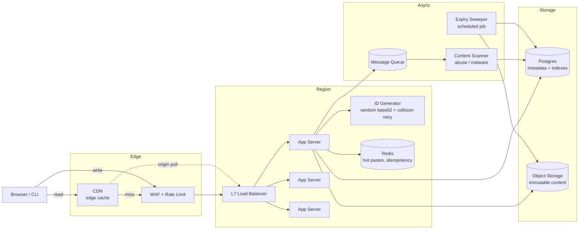

# Design Pastebin — Text Sharing with Object Storage, TTL, and CDN Reads

**Date:** 2026-04-25 | **Updated:** 2026-04-25
**Tags:** `system-design` `case-study` `pastebin` `content` `basic`
**Difficulty:** Easy (HLD)
**Audience:** Senior backend engineers preparing for or running system-design interviews.

## Table of Contents

- [Summary](#summary)
- [Functional Requirements](#functional-requirements)
- [Non-Functional Requirements](#non-functional-requirements)
- [Capacity Estimation](#capacity-estimation)
- [API Design](#api-design)
- [Data Model](#data-model)
- [High-Level Design](#high-level-design)
- [Deep Dives](#deep-dives)
  - [ID Generation — Random Base62 vs Hash](#id-generation--random-base62-vs-hash)
  - [Storage Choice — Database vs Object Storage](#storage-choice--database-vs-object-storage)
  - [Expiry Handling — TTL, Lifecycle Policies, and Sweepers](#expiry-handling--ttl-lifecycle-policies-and-sweepers)
  - [Abuse Defense — Rate Limits, Scanning, DMCA](#abuse-defense--rate-limits-scanning-dmca)
  - [Caching Strategy and CDN](#caching-strategy-and-cdn)
  - [Optional Features — Passwords, Access Logs, Syntax Highlighting](#optional-features--passwords-access-logs-syntax-highlighting)
- [Bottlenecks and Trade-offs](#bottlenecks-and-trade-offs)
- [Anti-Patterns](#anti-patterns)
- [Related](#related)
- [References](#references)

## Summary

Pastebin is a deceptively simple service: store a blob of text, return a short shareable URL, and serve it back fast. The architectural interest is not in CRUD logic but in the **storage split** (small metadata in a database, large content in object storage), **read amplification** (10:1 read:write at minimum, much higher for hot pastes), and **expiry semantics** (TTL, scheduled deletion, GDPR/DMCA takedown). It overlaps heavily with a URL shortener on the ID-generation surface but diverges sharply once the payload is multi-kilobyte text rather than a 30-byte URL.

This doc walks the standard interview structure: requirements → capacity → API → data model → diagram → deep dives → trade-offs.

## Functional Requirements

In-scope:

1. **Create paste.** User submits text content, optional title, optional expiry, optional password, optional language hint. Server returns a short URL.
2. **Read paste.** Anyone with the URL retrieves the raw content (and rendered/highlighted view).
3. **Expiry.** Pastes can expire after a duration (`10m`, `1h`, `1d`, `1w`, `1m`, `never`). Expired pastes return `410 Gone`.
4. **Raw vs rendered.** `/pastes/:id/raw` returns `text/plain`; `/pastes/:id` returns an HTML page with syntax highlighting.
5. **Optional password.** Encrypts content at rest; reader must supply the password to decrypt.
6. **Anonymous and authenticated** creation. Authenticated users can list/delete their own pastes.

Out of scope (explicitly):

- Rich-text editing, attachments, binary files (images, PDFs).
- Real-time collaborative editing (that's a different system — a CRDT/OT problem).
- Payment, premium tiers, ad serving.
- Search across paste contents.

Calling these out early in an interview prevents accidental scope creep into a Google-Docs-shaped problem.

## Non-Functional Requirements

| Requirement      | Target                                                                                    |
| ---------------- | ----------------------------------------------------------------------------------------- |
| Availability     | 99.9% for reads, 99.5% for writes. Reads matter more — most users are consumers.          |
| Read latency p99 | < 200 ms globally for cached content, < 500 ms for cold reads.                            |
| Write latency p99| < 500 ms (a bit of write latency is acceptable for a one-shot create flow).               |
| Read:write ratio | ~10:1 baseline; viral pastes can spike to 1000:1+.                                        |
| Durability       | 11 nines on the content store (S3-class). Losing a paste is a serious incident.           |
| Consistency      | Read-your-writes for the creator. Strong consistency on metadata; content is immutable.   |
| Scalability      | Horizontal on stateless app tier; storage scales linearly with bucket / DB sharding.      |
| Abuse defense    | Rate-limit creates per IP and per account; content scanning; DMCA / takedown workflow.    |

The **read-heavy, write-light, immutable-payload** combination is what makes object storage + CDN such a good fit here. The same combination underpins image and video delivery, static site hosting, and software release distribution.

## Capacity Estimation

Back-of-envelope, defensible numbers an interviewer will accept:

```text
Writes:        1,000,000 new pastes / day
              = 1e6 / 86400 ≈ 12 writes / sec  (peak ~3-5x = ~50 wps)

Avg paste:     10 KB (mix of small snippets and longer logs)
Daily volume:  1e6 * 10 KB = 10 GB / day
Yearly:        ~3.65 TB / yr
5-yr retention: ~18 TB raw; with replication factor 3 ≈ 55 TB

Reads (10:1):  10,000,000 reads / day ≈ 120 reads / sec average
              peak: ~600 rps; viral content: 10k+ rps to a single object
```

Implications:

- **18 TB of content over 5 years is trivial for object storage**, expensive for a relational DB. This forces the metadata-vs-content split.
- **120 rps average is small** — the interesting load is the long tail of viral pastes hitting the same key, which a CDN absorbs.
- **Metadata row size** is ~200 bytes. Five years of rows ≈ 1.8 B rows × 200 B ≈ 360 GB, comfortably handled by a single Postgres primary with read replicas, or trivially sharded by `id`.
- **ID space.** 8-character base62 = `62^8 ≈ 2.18 × 10^14`. With 1M pastes/day for 5 years (~1.8B), collision probability under random generation stays below 10⁻⁵ (birthday-paradox math), which is why 7-8 chars is the standard answer.

## API Design

Keep it small, RESTful, and idempotent where it can be:

```http
POST /v1/pastes
Content-Type: application/json
Idempotency-Key: <uuid>            # optional, prevents double-create on retry

{
  "content": "console.log('hi')",
  "title": "quick test",            // optional
  "language": "javascript",          // optional, hint for highlighter
  "expires_in": "1d",                // 10m | 1h | 1d | 1w | 1m | never
  "password": "hunter2",             // optional; triggers AES-GCM at rest
  "visibility": "unlisted"           // public | unlisted | private
}

201 Created
{
  "id": "aZ3kQ9pX",
  "url": "https://pb.example.com/aZ3kQ9pX",
  "raw_url": "https://pb.example.com/aZ3kQ9pX/raw",
  "expires_at": "2026-04-26T10:00:00Z"
}
```

```http
GET /v1/pastes/:id                   # rendered HTML view
GET /v1/pastes/:id/raw               # text/plain
GET /v1/pastes/:id?password=...      # for password-protected pastes (or via header)

DELETE /v1/pastes/:id                # owner-only, requires auth
GET    /v1/users/me/pastes?cursor=…  # owner listing, cursor-paginated
```

Notes that signal seniority:

- **`Idempotency-Key`** on `POST` so a retried create from a flaky mobile network does not produce two pastes. The server stores `(idempotency_key, response)` in a short TTL cache.
- **Cursor pagination**, not offset, on listing endpoints — offset pagination breaks under inserts.
- **Versioned path** (`/v1`) so a future v2 (e.g., binary attachments) can coexist.
- **Password in body or header**, never in the URL — URLs end up in proxy logs and browser history.

## Data Model

### Metadata table (Postgres / MySQL)

```sql
CREATE TABLE pastes (
    id            CHAR(8)       PRIMARY KEY,           -- base62, e.g. 'aZ3kQ9pX'
    title         VARCHAR(200),
    language      VARCHAR(32),                          -- highlighter hint
    content_ref   VARCHAR(256)  NOT NULL,               -- s3://bucket/aZ/3k/aZ3kQ9pX
    content_size  INTEGER       NOT NULL,
    content_hash  CHAR(64)      NOT NULL,               -- sha256, for dedup / integrity
    is_encrypted  BOOLEAN       NOT NULL DEFAULT FALSE,
    visibility    VARCHAR(16)   NOT NULL DEFAULT 'unlisted',
    owner_id      BIGINT        NULL,                   -- nullable for anon pastes
    created_at    TIMESTAMPTZ   NOT NULL DEFAULT NOW(),
    expires_at    TIMESTAMPTZ   NULL,                   -- NULL = never expires
    deleted_at    TIMESTAMPTZ   NULL                    -- soft delete for DMCA / user delete
);

CREATE INDEX idx_pastes_owner    ON pastes(owner_id, created_at DESC) WHERE deleted_at IS NULL;
CREATE INDEX idx_pastes_expires  ON pastes(expires_at) WHERE expires_at IS NOT NULL AND deleted_at IS NULL;
```

### Content layout in object storage

Store content in S3 (or compatible) with a key that scatters the prefix to avoid hot partitions on legacy S3:

```text
s3://pastebin-content/<prefix1>/<prefix2>/<id>
                       ^         ^
                       chars 1-2 chars 3-4   (e.g.  aZ/3k/aZ3kQ9pX)
```

Modern S3 auto-partitions by key, so the prefix scattering is mostly a habit from older days — but it still helps with directory listings, log routing, and CDN cache key distribution.

Content objects are stored **immutable**. Any "edit" creates a new paste with a new ID. This is what unlocks aggressive CDN caching (`Cache-Control: public, max-age=31536000, immutable`).

## High-Level Design



**Write path:**

1. Client `POST /v1/pastes` with content.
2. WAF + rate limiter accept or reject by IP/account.
3. App server generates an 8-char base62 ID (retry on collision, see deep dive).
4. App writes content to S3 (`PutObject`, often via presigned URL for large bodies — see deep dive).
5. App inserts metadata row in Postgres, including `content_ref` and `expires_at`.
6. App enqueues a scan job; returns `201` with the URL.

**Read path (cold):**

1. Client `GET /pb.example.com/aZ3kQ9pX` (or `/raw`).
2. CDN miss → origin pull through LB → app server.
3. App checks Redis for hot-paste hit; on miss, looks up metadata in Postgres.
4. If `expires_at < now()` or `deleted_at IS NOT NULL` → `410 Gone`.
5. Else, app fetches content from S3 (or 302-redirects to a signed S3/CloudFront URL for the raw endpoint).
6. CDN caches with `Cache-Control: public, max-age=…, immutable`, keyed on the ID.

**Read path (hot):** CDN serves directly from the edge; origin sees zero load.

## Deep Dives

### ID Generation — Random Base62 vs Hash

Three plausible strategies, each with a different failure mode:

| Strategy                     | Pros                                     | Cons                                                 |
| ---------------------------- | ---------------------------------------- | ---------------------------------------------------- |
| Random base62 (8 chars)      | Simple, unguessable, no coordination     | Must check DB for collision before commit            |
| Hash of content (e.g., sha256→base62) | Natural deduplication of identical content | Same content always maps to same URL — privacy risk; predictable |
| Counter + base62 encode      | Zero collisions, monotonic               | Requires distributed sequence (Snowflake, Redis INCR); guessable IDs let scrapers enumerate |

For Pastebin, **random base62 is the standard answer**. Reasons:

- Unguessability matters — many users treat unlisted pastes as "secret by URL." A monotonic counter lets anyone enumerate the corpus.
- Collisions are rare. With 1.8 B rows in `62^8 = 2.18 × 10^14` slots, expected collisions are on the order of 10⁻⁵ per insert. Handle with `INSERT … ON CONFLICT DO NOTHING` and retry.
- Stateless — every app server can mint IDs without coordination.

```python
import secrets, string

ALPHABET = string.ascii_letters + string.digits  # 62 chars
def new_paste_id(length: int = 8) -> str:
    return "".join(secrets.choice(ALPHABET) for _ in range(length))
```

The URL shortener case study makes the same decision for the same reasons; see `design-url-shortener.md`. The difference: a URL shortener sometimes wants **vanity / custom** slugs and a denser keyspace, whereas Pastebin almost never does.

### Storage Choice — Database vs Object Storage

Why not put the content directly in Postgres as `TEXT`?

- **Row size.** Postgres TOAST handles large values, but 10 KB per row × 1.8 B rows = ~18 TB on the primary. That's not what relational DBs are good at. Vacuum, replication, backups all suffer.
- **Cost.** S3 is ~10–20× cheaper per GB than provisioned RDS storage, before counting IOPS.
- **CDN-ability.** S3 + CloudFront / Cloudflare R2 gives you edge caching for free. Postgres rows do not.
- **Scaling axes.** S3 scales horizontally without operator effort. Postgres requires sharding once you outgrow a primary.

The split:

- **Postgres (or any OLTP DB)** holds the small, mutable metadata: id, title, owner, expiry, content reference.
- **S3 (or compatible)** holds the immutable content blob.

For very large pastes (multi-MB logs), use **presigned PUT URLs** so the client uploads directly to S3, skipping the app tier. The app server only sees the metadata and the post-upload confirmation:

```text
1. Client POST /pastes/init  →  app returns presigned PUT URL + paste_id
2. Client PUT  <presigned URL>  →  S3 stores the bytes
3. Client POST /pastes/:id/finalize  →  app verifies object exists, writes metadata row
```

This pattern keeps the app servers' bandwidth and CPU off the critical upload path. AWS supports presigned URLs up to 5 GB for single-part PUT and arbitrary size via multipart upload.

### Expiry Handling — TTL, Lifecycle Policies, and Sweepers

Three layers of defense against stale content:

1. **Metadata-driven check on read.** The cheapest, most authoritative gate. Every read compares `expires_at` to `now()`; expired → `410 Gone`. This is correct even if the actual S3 object is still there.
2. **S3 lifecycle policy.** Bucket-level rule: "delete objects where `tag:expires_at < today`" or "expire after N days." This reclaims storage cost without requiring the application to do anything. AWS S3 supports per-object tags + lifecycle filters; per-object TTL (Dapr-style "set TTL on PUT") is not native to S3 but can be approximated via tags + a daily lifecycle scan.
3. **Sweeper job.** A scheduled worker (e.g., hourly) selects rows where `expires_at < now() AND deleted_at IS NULL`, soft-deletes them in the DB, and issues `DeleteObject` on S3. This is what cleans up the "expires in 10 minutes" pastes that lifecycle policies (which run daily) cannot.

The metadata check on read is the source of truth. Lifecycle and sweeper are eventual-consistency cleanup. A user who shares a paste with `expires_in=10m` does not want the content to remain readable for 23 more hours just because the sweeper hasn't run.

```sql
-- Sweeper query, run hourly with LIMIT to avoid long transactions
WITH expired AS (
  SELECT id, content_ref
  FROM pastes
  WHERE expires_at < NOW()
    AND deleted_at IS NULL
  LIMIT 10000
  FOR UPDATE SKIP LOCKED
)
UPDATE pastes
SET deleted_at = NOW()
FROM expired
WHERE pastes.id = expired.id
RETURNING pastes.id, pastes.content_ref;
```

The returned `content_ref` list is then enqueued for S3 deletion in batches.

### Abuse Defense — Rate Limits, Scanning, DMCA

Pastebin is a magnet for abuse: credential dumps, malware payloads, phishing kits, copyrighted material. A real production design needs all of:

- **Rate limiting** at the edge (WAF) and at the app tier:
  - Per IP: e.g., 10 creates / minute, 100 / hour.
  - Per authenticated account: higher ceiling, lower for new accounts.
  - Per content hash: prevent reuploading the same banned blob.
  - See `../../building-blocks/rate-limiters.md` for token-bucket vs sliding-window trade-offs.
- **Async content scanning.** On create, enqueue a job that:
  - Hashes the content; compares against known-bad hashes (malware, leaked-credentials feeds).
  - Runs YARA rules or a regex pack for credit cards, SSH keys, AWS keys, JWTs.
  - Calls a third-party scanner (VirusTotal, internal classifier) for high-risk patterns.
  - On hit, soft-deletes the paste and notifies abuse@.
- **DMCA / takedown flow.** A reporting endpoint, an ops queue, a documented SLA (e.g., 24h), and an audit log of who took down what and when. Keep the row in the DB with `deleted_at` set rather than hard-deleting — you'll need it for legal records.
- **Account anti-abuse.** CAPTCHA after N anonymous creates from one IP, email verification for accounts, ban lists on signup email domains.
- **Egress controls.** No paste can embed an `<iframe>` that loads attacker JS into your domain — always serve raw content with `Content-Type: text/plain` and strict CSP, never execute it.

### Caching Strategy and CDN

Pastes are immutable once created, which is the perfect shape for edge caching.

- **CDN in front of `/raw` and the rendered view.**
  - `Cache-Control: public, max-age=31536000, immutable` for paste content.
  - `Vary: Accept-Encoding` for gzip/br variants.
  - Cache key includes the paste ID; password-protected pastes are not cached at the CDN (or are cached with a key that includes the password hash — usually simpler to just bypass).
- **Origin pull model.** The CDN fetches from the LB on miss and caches at the edge. A viral paste hitting 10k rps becomes a single origin request followed by edge hits.
- **Purge on deletion.** When a paste is deleted (user, sweeper, DMCA), issue a CDN purge for its URL. Without this, the deleted content lingers at the edge until TTL expiry.
- **Hot-paste tier.** A small Redis cache of the most recently accessed N pastes' content sits in front of S3. This protects S3 from origin-pull thundering herds when many CDN edges miss simultaneously.
- **Negative caching.** Cache `410 Gone` for expired pastes briefly (e.g., 60s) to avoid repeat DB hits on a deleted-but-still-linked URL.

### Optional Features — Passwords, Access Logs, Syntax Highlighting

**Password-protected pastes.** Two real designs:

1. **Client-side encryption (preferred for privacy).** The browser derives a key from the password (PBKDF2/Argon2) and encrypts the content before upload. The server stores ciphertext only and never sees the key. Reader supplies the password, browser decrypts. Server cannot read the paste even if compelled. PrivateBin uses this model.
2. **Server-side encryption.** Server stores `Enc(content, key)` where `key` is derived from the password. Server validates by decrypt-on-read. Easier to integrate with rendering / highlighting on the server, but the server can read the content if it wants to.

Mark `is_encrypted=true` on the metadata row; on read, prompt for password, decrypt, then render. Never log the password.

**Access logs.** For authenticated users, capture `(paste_id, viewer_ip_hash, user_agent_class, viewed_at)` to a separate analytics table or stream. Hash IPs to avoid storing PII verbatim. Aggregate counts in Redis (`INCR pastes:aZ3kQ9pX:views`) and flush periodically.

**Syntax highlighting.** Two flavors:

- **Server-side render.** Use a library like Pygments or Chroma at request time, output HTML with `<span class="…">` tokens, cache the rendered HTML at the CDN. Pro: fast first paint. Con: one cache entry per `(id, theme)` combination.
- **Client-side render.** Ship raw text + a JS highlighter (Prism, highlight.js, Shiki) to the browser. Pro: no server CPU, themable per-user. Con: extra JS payload, FOUC on slow devices.

For a public service, **server-side render with CDN caching** wins on latency and CPU efficiency. For a "logged-in dashboard" view, client-side is fine.

## Bottlenecks and Trade-offs

| Surface                | Bottleneck                                     | Mitigation                                                              |
| ---------------------- | ---------------------------------------------- | ----------------------------------------------------------------------- |
| Metadata DB writes     | 50 wps peak is small, but indexes + replication add overhead | Single primary with read replicas; partition by `id` prefix if it grows. |
| Content store reads    | Viral paste = thundering herd on S3 origin     | CDN with origin shielding; Redis hot tier in front of S3.               |
| ID collision retries   | Tail latency under high write volume           | 8 chars keeps collision rate ≪ 1%; retry budget capped at 3.            |
| Expiry precision       | Lifecycle is daily; sweeper is hourly          | Always gate on metadata read — that's the contract with the user.       |
| Password feature       | Server-side encryption couples ops to user secrets | Prefer client-side for privacy-first product; document the model clearly. |
| CDN purge propagation  | Stale content at edge after deletion           | Issue purge on delete; set `s-maxage` lower than `max-age` for sensitive paths. |
| Cost                   | Storage is cheap, egress is not                | CDN reduces origin egress; Cloudflare R2 / Backblaze B2 for cheaper egress. |

The dominant trade-off is **latency vs cost vs durability**, and it tilts toward "cache aggressively, store cheaply, never lose a paste." Pastebin is not a system where you need consensus, multi-region writes, or CRDTs.

## Anti-Patterns

- **Storing 10 KB content in a `TEXT` column** and then complaining that the DB is slow. Use object storage.
- **Monotonic numeric IDs** without considering enumeration attacks. Use random base62.
- **Skipping the idempotency key on create.** Mobile retries will create duplicate pastes and confuse users.
- **Caching password-protected pastes at the CDN** without keying on the password. Either bypass the CDN for these or include a password-derived token in the cache key.
- **Hard-deleting on user delete** with no `deleted_at`. You'll regret this the first time legal asks for an audit trail or a user reports an accidental deletion.
- **Relying on lifecycle policies for fine-grained expiry.** Lifecycle runs daily — a "10 minute" paste needs a metadata gate, not a lifecycle rule.
- **Trusting `Content-Type` from the user.** Always serve `/raw` as `text/plain; charset=utf-8` with `X-Content-Type-Options: nosniff` and a strict CSP. Otherwise you've built an XSS distribution platform.
- **One giant app process** doing create + scan + render + sweep. Split scanning and sweeping into async workers; keep the request path lean.
- **No DMCA / abuse playbook.** Public paste services attract bad content. Have the workflow and tooling ready before you launch publicly.

## Related

### Deep-Dive Companions

- [ID Generation](pastebin/id-generation.md) — random base62 vs UUID, content-addressed IDs, salting, visibility tiers, crawler resistance
- [Storage Choice](pastebin/storage-choice.md) — DB vs S3 split, hot/cold tiering, compression, encryption, lifecycle
- [Expiry Handling](pastebin/expiry-handling.md) — TTL semantics, sweepers, time-partitioned tables, burn-after-reading, GDPR
- [Abuse Defense](pastebin/abuse-defense.md) — content scanning, secret detection, DMCA, CSAM, ban lists, transparency
- [Caching and CDN](pastebin/caching-and-cdn.md) — immutable Cache-Control, private/password caching, edge compression
- [Optional Features](pastebin/optional-features.md) — passwords, zero-knowledge encryption, syntax highlighting, oEmbed, webhooks

### Cross-References

- `../../building-blocks/object-and-blob-storage.md` — S3-class storage primitives, presigned URLs, multipart uploads.
- `../../building-blocks/rate-limiters.md` — token bucket, sliding window, distributed rate limiting.
- `design-url-shortener.md` — sibling case study; same ID-generation problem, different payload shape.

## References

- [System Design Primer — Pastebin solution](https://github.com/donnemartin/system-design-primer/tree/master/solutions/system_design/pastebin) — canonical interview reference.
- [Pastebin.com](https://pastebin.com/) — the original public service.
- [GitHub Gist — REST API](https://docs.github.com/en/rest/gists/gists) — production-grade alternative; per-file 1 MB limit, OAuth-scoped writes.
- [haste-server (Hastebin)](https://github.com/toptal/haste-server) — open-source pastebin in Node.js with pluggable storage (Redis, Postgres, S3).
- [PrivateBin](https://privatebin.info/) — zero-knowledge pastebin; reference for client-side encryption design.
- [AWS S3 — Lifecycle expiration](https://docs.aws.amazon.com/AmazonS3/latest/userguide/lifecycle-expire-general-considerations.html) — TTL-style cleanup at the bucket level.
- [AWS S3 — Presigned URLs for upload](https://docs.aws.amazon.com/AmazonS3/latest/userguide/PresignedUrlUploadObject.html) — direct browser → S3 upload pattern.
- [MDN — `Cache-Control` header](https://developer.mozilla.org/en-US/docs/Web/HTTP/Reference/Headers/Cache-Control) — `immutable`, `s-maxage`, `stale-while-revalidate` semantics.
- [Cloudflare — Cache-Control concepts](https://developers.cloudflare.com/cache/concepts/cache-control/) — origin-pull caching at the edge.
