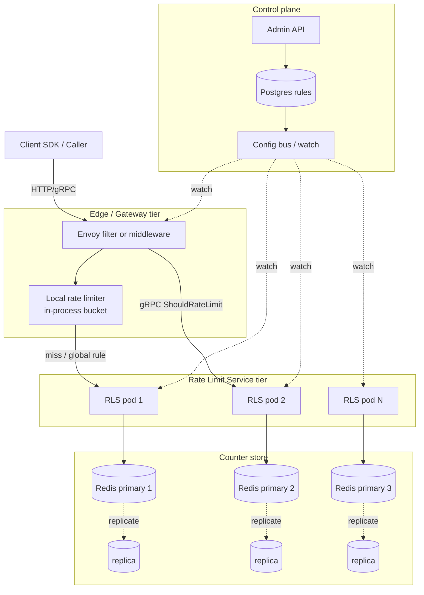

# Design a Rate Limiter Service — Quotas, Atomic Counters, and Distributed Correctness

**Date:** 2026-04-25 | **Updated:** 2026-04-25
**Tags:** `system-design` `case-study` `rate-limiter` `distributed` `redis`
**Difficulty:** Medium | **Type:** HLD | **Estimated read:** 25–30 min

## Table of Contents

- [Summary](#summary)
- [1. Functional Requirements](#1-functional-requirements)
- [2. Non-Functional Requirements](#2-non-functional-requirements)
- [3. Capacity Estimation](#3-capacity-estimation)
- [4. API Design](#4-api-design)
  - [Deployment shapes](#deployment-shapes)
  - [Check API](#check-api)
  - [Admin API](#admin-api)
  - [Client SDK](#client-sdk)
- [5. Data Model](#5-data-model)
  - [Rule store](#rule-store)
  - [Counter keyspace](#counter-keyspace)
- [6. High-Level Architecture](#6-high-level-architecture)
- [7. Deep Dives](#7-deep-dives)
  - [7.1 Algorithm choice](#71-algorithm-choice)
  - [7.2 Centralized vs distributed](#72-centralized-vs-distributed)
  - [7.3 Race conditions and atomicity](#73-race-conditions-and-atomicity)
  - [7.4 Hot keys and key sharding](#74-hot-keys-and-key-sharding)
  - [7.5 Failure modes — fail open vs fail closed](#75-failure-modes--fail-open-vs-fail-closed)
  - [7.6 Multi-tier limits](#76-multi-tier-limits)
  - [7.7 Synchronization across distributed nodes](#77-synchronization-across-distributed-nodes)
- [8. Bottlenecks & Trade-offs](#8-bottlenecks--trade-offs)
- [9. Anti-Patterns](#9-anti-patterns)
- [Related](#related)
- [References](#references)

## Summary

A rate limiter answers a deceptively simple question: **should this request be allowed right now?** Behind that question sit hard problems — atomic counter updates across thousands of gateway pods, sub-millisecond latency budgets, multi-tier quotas (tenant ⊃ user ⊃ endpoint), graceful degradation when the counter store hiccups, and standardized client signaling so well-behaved callers can back off instead of hammering 429s. This case study designs a centralized rate limiter service modelled on Stripe's and Envoy's production systems: a thin enforcement filter at the edge, a stateless decision service, and a Redis-backed atomic counter store driven by Lua scripts.

The design covers algorithm selection (token bucket as the workhorse, sliding window counter for smoothing), Redis keyspace layout, the INCR+EXPIRE race condition and its Lua fix, hot-key sharding, fail-open vs fail-closed policy, and the IETF `RateLimit-*` headers that let clients self-throttle.

## 1. Functional Requirements

The service must support:

- **Per-key limits.** Apply quotas to any extracted descriptor: user ID, API key, IP address, tenant, endpoint, or composite (e.g. `tenant:acme + endpoint:/v1/charges`).
- **Multi-tier quotas.** A single request can be checked against several rules at once; the most restrictive applies. Stripe runs **four tiers** in production — request rate, concurrent requests, critical-path load shedding, and non-critical load shedding — each with its own limiter (see [Stripe's blog][stripe-rl]).
- **Rule management API.** Admins create, update, and disable rules without redeploying. New rules propagate to enforcement points within seconds.
- **Grace burst.** Token-bucket semantics: a caller can briefly exceed the steady-state rate as long as accumulated tokens cover the spike. Stripe explicitly relies on this to absorb legitimate traffic spikes.
- **Standardized response.** When a request is rejected:
  - HTTP `429 Too Many Requests`
  - `Retry-After: <seconds>` header
  - `RateLimit-Policy` and `RateLimit` headers per the IETF draft (see [draft-ietf-httpapi-ratelimit-headers][ietf-rl]) so clients see remaining quota, the policy window, and reset time.
- **Multiple actions.** Beyond hard reject: `log_only` (shadow mode for new rules), `challenge` (CAPTCHA), `tarpit` (delay), and `degrade` (route to a cheaper code path).
- **Observability.** Per-rule counters, top-N noisy keys, and per-tenant dashboards.

## 2. Non-Functional Requirements

| NFR | Target | Why |
|-----|--------|-----|
| Decision latency | **p50 < 1 ms, p99 < 5 ms** | Sits in front of every API request; budget is unforgiving. |
| Throughput | **1M+ RPS** at the gateway tier | Must scale horizontally with edge fleet. |
| Distributed correctness | Counter updates atomic across N gateway pods | Two pods incrementing the same key must not double-count nor lose updates. |
| Availability | **99.99%+** | A broken limiter must not break the API. Choose fail-open or fail-closed per rule. |
| Tolerance to Redis hiccups | Survive 10–60 s outage | Local fallback bucket; degraded mode. |
| Rule-propagation latency | < 5 s globally | New limits take effect quickly without restart. |
| Memory per key | ~500 bytes | Drives Redis sizing for tens of millions of active keys. |

## 3. Capacity Estimation

**Traffic.** Assume a tier-1 API gateway at **1M RPS** sustained, **3M RPS** peak, with 50M monthly active users and ~5M concurrently active keys per minute.

**Counter operations.** Each request triggers ≥ 1 counter check. With N tiers (say 3: tenant, user, endpoint) per request, that's **3M Redis ops/s peak** — well beyond a single Redis node (a single node handles ~100k ops/s for Lua-script workloads). Sharding is mandatory.

**Memory.**

```text
Per active key metadata: ~500 bytes
  = key string (~80 B) + counter hash (tokens, last_refill, ttl) (~100 B)
  + Redis overhead (~300 B for hash + expiry index)

5M active keys × 500 B = ~2.5 GB working set
Plus rule store: ~10k rules × 1 KB = ~10 MB (negligible, kept in-memory on every gateway).
```

A 6-node Redis Cluster (3 primary + 3 replica) sized at 4 GB each handles the working set with headroom.

**Bandwidth.** 3M ops/s × ~200 B request + 100 B response ≈ **900 MB/s** counter traffic. Co-locate Redis with gateways in the same AZ to keep this off the cross-AZ wire.

**Sharding fan-out.** With consistent hashing on the limit key, each Redis primary owns ~1.7M ops/s — still too hot. Either (a) use **Envoy's local rate limiter as L1** to absorb obvious local hot keys before hitting the global service, or (b) split by region (multi-region pinning, see §7.2).

## 4. API Design

### Deployment shapes

Three options, each with trade-offs:

| Shape | Latency | Consistency | Ops cost |
|-------|---------|-------------|----------|
| **Embedded library** (in-process) | Lowest (<100 µs) | Eventually consistent across pods unless backed by shared store | Each app owns updates |
| **Sidecar / local proxy** (Envoy local rate limiter) | < 500 µs | Per-pod local, optionally tiered into global service | Standard service-mesh ops |
| **Centralized gRPC service** (Envoy global ratelimit, Stripe model) | 1–5 ms | Globally consistent | Single team owns it |

Production systems typically combine them: a **two-tier filter** — local rate limiter rejects the obvious cases in-process, then defers to the global service for the hard ones. Envoy explicitly supports this composition: "Local rate limiting can be used in conjunction with global rate limiting to reduce load on the global rate limit service" ([Envoy docs][envoy-global]).

### Check API

The hot path. gRPC for low overhead and streaming.

```protobuf
service RateLimitService {
  rpc ShouldRateLimit(RateLimitRequest) returns (RateLimitResponse);
}

message RateLimitDescriptor {
  // Ordered list of (key, value) entries. The service matches the most
  // specific configured rule for this descriptor.
  repeated Entry entries = 1;
  message Entry {
    string key = 1;    // e.g. "user_id", "endpoint", "tenant"
    string value = 2;  // e.g. "u_42", "/v1/charges", "acme"
  }
  uint32 hits_addend = 3;  // default 1
}

message RateLimitRequest {
  string domain = 1;                          // e.g. "edge-gateway"
  repeated RateLimitDescriptor descriptors = 2;
}

message RateLimitResponse {
  enum Code { UNKNOWN = 0; OK = 1; OVER_LIMIT = 2; }
  Code overall_code = 1;
  repeated DescriptorStatus statuses = 2;
}

message DescriptorStatus {
  Code code = 1;
  RateLimit current_limit = 2;
  uint32 limit_remaining = 3;
  uint32 duration_until_reset_seconds = 4;
}
```

This shape mirrors the [Envoy ratelimit gRPC contract][envoy-rl-repo] so any RLS-compliant proxy can drive it.

### Admin API

REST, low-traffic, strongly authenticated. New rules propagate via a config-watcher (etcd, Consul, or an internal config bus) to every enforcement point.

```http
POST /v1/rules
{
  "domain": "edge-gateway",
  "descriptor": [{"key": "user_id"}],          // match any user_id
  "algorithm": "token_bucket",
  "rate": 100,                                  // tokens
  "period": "1s",
  "burst": 200,
  "action": "reject",
  "shadow_until": "2026-05-01T00:00:00Z"        // optional log-only ramp
}

GET    /v1/rules
PATCH  /v1/rules/{id}
DELETE /v1/rules/{id}
```

Stripe specifically calls out **shadow mode** as the way to introduce new limiters safely: "how we started using rate limiters safely without affecting existing users' workflows" ([Stripe blog][stripe-rl]). Always ship `log_only` first, watch the dashboard for a week, then flip to `reject`.

### Client SDK

A thin wrapper around the gRPC stub. Three concerns:

1. **Header parsing.** Read `RateLimit-Remaining`, `RateLimit-Reset`, `Retry-After` from any response and surface them to the application's retry layer.
2. **Adaptive back-off.** When the SDK sees `Retry-After`, jittered sleep before next call instead of immediately retrying.
3. **Local pre-check.** Optional in-process token bucket that mirrors the user's known quota — saves a round trip when the caller is obviously over.

## 5. Data Model

### Rule store

Authoritative copy lives in Postgres or etcd; every gateway and every limiter pod keeps a hot, in-memory mirror refreshed via watch.

```sql
CREATE TABLE rate_limit_rules (
  id           UUID PRIMARY KEY,
  domain       TEXT NOT NULL,             -- e.g. 'edge-gateway'
  descriptor   JSONB NOT NULL,            -- match spec, e.g. [{"key":"user_id"}]
  algorithm    TEXT NOT NULL,             -- 'token_bucket' | 'sliding_window' | 'fixed_window'
  rate         INTEGER NOT NULL,
  period_ms    INTEGER NOT NULL,
  burst        INTEGER,
  action       TEXT NOT NULL,             -- 'reject' | 'log_only' | 'challenge' | 'degrade'
  priority     INTEGER NOT NULL,          -- when multiple rules match
  shadow_until TIMESTAMPTZ,
  enabled      BOOLEAN NOT NULL DEFAULT TRUE,
  updated_at   TIMESTAMPTZ NOT NULL DEFAULT now()
);
CREATE INDEX ON rate_limit_rules (domain, enabled);
```

### Counter keyspace

Redis keys are constructed from the **descriptor + window**:

```text
rl:{domain}:{algo}:{descriptor_hash}:{window_bucket}
  → HASH { tokens: 184, last_refill_ms: 1714000000123 }
  TTL: window_period * 2

# Examples
rl:edge:tb:user_id=u_42:                      # token bucket, no time bucket
rl:edge:fw:tenant=acme&endpoint=/v1/charges:1714000000  # fixed-window minute bucket
```

Key design rules:

- **Hash tag** the descriptor portion (`{user_id=u_42}`) so the cluster routes related keys to the same shard. This matters when one logical descriptor spans multiple keys (e.g. previous + current window in sliding window counter).
- **Always set TTL** equal to or slightly longer than the longest window. Without TTL, idle keys leak forever — at 1B/day key churn that's catastrophic.
- **Encode the window bucket in the key** for fixed-window so old buckets self-evict via TTL instead of needing cleanup jobs.

## 6. High-Level Architecture



**Request flow:**

1. Client hits Envoy at the edge.
2. Envoy's **local rate limiter** runs first — a pure in-memory token bucket per pod. Most rejects happen here without leaving the pod.
3. On miss, Envoy issues a `ShouldRateLimit` gRPC to the RLS tier.
4. RLS pod looks up matching rules from its in-memory mirror, executes a **single Lua script** against the appropriate Redis primary (selected by descriptor hash), and returns OK / OVER_LIMIT.
5. Envoy attaches `RateLimit-*` headers and either forwards or returns 429.

## 7. Deep Dives

### 7.1 Algorithm choice

A quick recap (full treatment in [`../../building-blocks/rate-limiters.md`](../../building-blocks/rate-limiters.md)):

| Algorithm | Memory/key | Burst-friendly | Boundary glitch | Best for |
|-----------|-----------|----------------|-----------------|----------|
| **Fixed window** | 1 counter | No | Yes — 2× burst at boundary | Crude per-minute caps |
| **Sliding window log** | O(N) timestamps | Yes (precise) | None | Strict compliance, low RPS |
| **Sliding window counter** | 2 counters | Approximate | Negligible (Cloudflare reports 0.003% error) | Edge / WAF — Cloudflare's choice |
| **Token bucket** | 2 fields (tokens, last_refill) | Yes (tunable burst) | None | API quotas — Stripe's choice |
| **Leaky bucket** | 2 fields | Smooths output rate | None | Egress shaping, queue draining |

**Default to token bucket** for API quotas: cheap (2 fields per key), bursty by design, and trivially atomic in Lua. **Reach for sliding window counter** when you need approximate-fairness over a window without per-request log overhead — Cloudflare uses it for WAF rules ([Cloudflare blog][cf-counting]).

Skip sliding window log unless N is small (admin endpoints, low-cardinality keys). At 1M RPS, even a 1-minute log per key is millions of timestamps in memory.

### 7.2 Centralized vs distributed

The core tension: a **single** counter store gives correctness; a **per-node** counter gives speed.

**Centralized (Stripe / Envoy global RLS).** All gateway pods talk to the same Redis cluster. Atomic Lua scripts give exact accounting. Trade-off: every request pays a network hop and the Redis cluster becomes the bottleneck.

**Atomic Lua script — token bucket consume:**

```lua
-- KEYS[1] = bucket key
-- ARGV: capacity, refill_rate_per_ms, now_ms, requested_tokens
local key = KEYS[1]
local capacity     = tonumber(ARGV[1])
local refill_rate  = tonumber(ARGV[2])
local now_ms       = tonumber(ARGV[3])
local requested    = tonumber(ARGV[4])

local data = redis.call("HMGET", key, "tokens", "last_refill_ms")
local tokens       = tonumber(data[1]) or capacity
local last_refill  = tonumber(data[2]) or now_ms

-- Refill based on elapsed time
local elapsed = math.max(0, now_ms - last_refill)
tokens = math.min(capacity, tokens + elapsed * refill_rate)

local allowed = 0
if tokens >= requested then
  tokens = tokens - requested
  allowed = 1
end

redis.call("HMSET", key, "tokens", tokens, "last_refill_ms", now_ms)
redis.call("PEXPIRE", key, math.ceil(capacity / refill_rate) * 2)

return { allowed, math.floor(tokens) }
```

The whole refill-check-consume cycle runs in one `EVAL`. Redis executes Lua scripts atomically — no other command interleaves ([Redis tutorial][redis-lua]).

**Multi-region.** A truly global counter across regions adds tens of milliseconds of replication lag. Two practical patterns:

- **Region-pinned counters.** Each user's request always lands in their home region; counter is local-region. Cross-region traffic is rare and gets its own (looser) limit.
- **CRDT counters / approximate global.** Use eventual-consistency counters (e.g. PN-counter) when you can tolerate over-allowing slightly. Not appropriate for strict billing-related limits.

**Replication mode.** Run Redis as primary-replica with `wait_for_replica_acks = 0` on the hot path. Don't wait for replication on every request — it adds a hop. Accept that a primary failover loses a sliver of recent counter state; the worst case is briefly under-counting, which is preferable to halving throughput.

### 7.3 Race conditions and atomicity

The classic naive implementation:

```go
// WRONG — race condition between INCR and EXPIRE
count, _ := redis.Incr(ctx, key).Result()
if count == 1 {
    redis.Expire(ctx, key, window)
}
if count > limit {
    return ErrRateLimited
}
```

Two failure modes:

1. **Leaked keys.** If the process crashes between `INCR` and `EXPIRE`, the key has no TTL and lives forever. At scale this leaks memory unboundedly ([Redis INCR docs][redis-incr]).
2. **Lost expirations.** Two clients can both observe `count == 1` due to a previous expiry race and one's `EXPIRE` overwrites the other's window.

**Fix:** wrap the entire sequence in a Lua script. Even the simplest one is correct:

```lua
local count = redis.call("INCR", KEYS[1])
if count == 1 then
  redis.call("EXPIRE", KEYS[1], ARGV[1])
end
return count
```

`MULTI/EXEC` does **not** save you here — pipelining commands in a transaction lets other clients sneak in between your operations across separate round-trips. Lua executes atomically server-side.

### 7.4 Hot keys and key sharding

A single celebrity key — say a misconfigured CI bot hammering one endpoint — can saturate one Redis primary. Two mitigations:

**1. Random-suffix sharding.** For a known hot key, split into N counters and aggregate:

```text
rl:edge:tb:endpoint=/v1/health:0
rl:edge:tb:endpoint=/v1/health:1
...
rl:edge:tb:endpoint=/v1/health:15
```

Each request picks `i = rand() % 16`, consumes one token from shard `i`, and the effective limit is `N × per_shard_limit`. Trade-off: at very low rates, the per-shard count rounds down and over-allows. Use only for high-rate keys.

**2. Local pre-aggregation.** The edge pod accumulates counts in-process for a few hundred milliseconds, then flushes to Redis as a batched `INCRBY n`. Stripe's load-shedder operates on similar logic — make the cheap decision locally first.

For known-hot **descriptor categories** (e.g. unauthenticated IP), keep a separate short-window limiter that runs entirely in-process, never touching Redis.

### 7.5 Failure modes — fail open vs fail closed

What happens when Redis is unreachable?

| Strategy | Behavior | When to use |
|----------|----------|-------------|
| **Fail open** | Allow all requests; log loudly | Default for most APIs — keeping the product up beats perfect quota enforcement |
| **Fail closed** | Reject all requests | Auth, billing, or anything where excess use is worse than downtime |
| **Fail to local** | Switch to per-pod local bucket with conservative limits | Best of both — Stripe and Envoy both support this |

The decision is **per-rule**. A rule protecting a database from runaway scans should fail closed; a rule shaping a free-tier user's request rate should fail open.

Make the fallback explicit in the rule definition:

```json
{
  "id": "...",
  "rate": 100,
  "period": "1s",
  "on_store_failure": "fail_to_local",
  "local_fallback_rate": 50
}
```

Watchdog the Redis health check independently of the request path — don't let timeouts pile up on the user.

### 7.6 Multi-tier limits

Most production systems enforce **nested quotas**: tenant ⊃ user ⊃ endpoint. A single request consumes a token from each tier; if any tier rejects, the whole request fails.

```text
Request from user u_42 in tenant acme to /v1/charges:
  Check 1: tenant=acme       (10000/s, current 8500)  → OK
  Check 2: user=u_42          (100/s,   current 99)    → OK
  Check 3: endpoint=/v1/charges (50/s,  current 50)    → OVER_LIMIT
  → 429
```

Two implementation pitfalls:

1. **Don't decrement multiple buckets if any will reject.** Run all checks in **dry-run mode first**, then commit only if all pass. Otherwise a rejected request still consumes from the tenant budget unfairly.
2. **Bound the descriptor explosion.** If a request matches 30 rules, you've burnt 30× the Redis ops. Cap the per-request descriptor count and design rule taxonomies to be flat, not deeply combinatorial.

Stripe's "4 tiers" pattern combines orthogonal limiters — request rate, concurrent in-flight, critical/non-critical shedding — rather than nesting deeper and deeper rules ([Stripe blog][stripe-rl]).

### 7.7 Synchronization across distributed nodes

Three options for keeping rate decisions consistent across N enforcement pods:

| Approach | Consistency | Latency cost | Complexity |
|----------|-------------|--------------|------------|
| **Centralized counter store (Redis)** | Strong | One network hop | Low |
| **Gossip-based aggregation** | Eventual (sub-second) | None on the hot path | High |
| **Periodic flush to central** | Eventually consistent | None on hot path | Medium |

**Gossip** (e.g. each pod broadcasts its local counts every 100ms via a pub/sub) lets you keep the hot path purely local but accepts that limits over-shoot by up to one gossip interval × N pods × per-pod rate. For lenient public-facing limits (e.g. anti-abuse on signup endpoints) that's fine. For strict billing limits, use centralized.

A useful middle ground is **periodic flush**: each pod runs an in-process bucket, then every K ms drains the consumed-tokens-since-last-flush to Redis as a single `INCRBY`. The Redis counter is the truth for billing reconciliation; the local bucket protects latency. This is essentially how Envoy's two-tier local + global limiter works in practice.

## 8. Bottlenecks & Trade-offs

| Concern | Bottleneck | Trade-off |
|---------|-----------|-----------|
| **Latency** | Network hop to Redis | Two-tier (local + global); accept slightly looser enforcement for sub-ms p99 |
| **Throughput** | Per-shard Redis ops | Hash tag descriptors, pre-shard hot keys, batch flushes |
| **Memory** | Per-key working set | TTL aggressively, evict idle keys, shard cluster |
| **Correctness** | Multi-region replication lag | Region-pin counters; only go cross-region for global tenant cap |
| **Operational risk** | Bad rule rejects all traffic | Always ship `shadow_until` first; staged rollout |
| **Cost** | Redis ops × QPS | Local pre-filter; per-rule sampling for non-critical limits |

A useful framing: **you cannot have low-latency, strongly-consistent, multi-region rate limiting**. Pick two. Most real systems pick low-latency + strongly-consistent (within a region) and accept regional drift.

## 9. Anti-Patterns

- **Naive INCR + EXPIRE in two round-trips.** Race condition; leaked keys; bad accounting. Always use Lua or a single atomic primitive. ([dev.to writeup][dev-race])
- **No TTL on counter keys.** Memory leak. Keys outlive their relevance.
- **Returning 429 without `Retry-After` or `RateLimit-*` headers.** Forces clients to retry blindly, often making the storm worse. The IETF draft headers exist precisely so well-behaved clients can self-throttle.
- **Single global Redis without sharding.** One node = one hot-key bottleneck; one node = one blast radius.
- **Fail-closed by default everywhere.** A Redis blip then takes the whole API down. Fail-closed should be a deliberate per-rule choice, not a default.
- **Logging every rate-limit decision at INFO.** Generates more traffic than the API itself. Sample, or log only rejections.
- **Mixing rate limiter with circuit breaker in the same component.** They solve different problems; coupling them makes both harder to reason about. See [`../../scalability/backpressure-bulkhead-circuit-breaker.md`](../../scalability/backpressure-bulkhead-circuit-breaker.md) for the separation.
- **Using fixed-window for fairness-sensitive limits.** The boundary glitch lets a caller get 2× the limit across a window edge.
- **Hand-rolling rate limiting in every microservice.** Centralize in the gateway / mesh; let downstream services trust the upstream decision.
- **No shadow-mode rollout.** New limits ship straight to `reject` and start triggering customer 429s. Always log-only first; Stripe explicitly highlights this.

## Related

### Deep-Dive Companions

- [Algorithm Choice](rate-limiter/algorithm-choice.md) — fixed/sliding/token/leaky/GCRA/concurrency/adaptive, decision matrix
- [Centralized vs Distributed](rate-limiter/centralized-vs-distributed.md) — single Redis, two-tier Envoy, gossip, CRDT, multi-region trade-offs
- [Race Conditions and Atomicity](rate-limiter/race-conditions-and-atomicity.md) — INCR+EXPIRE race, Lua atomicity, Redlock debate, alternatives
- [Hot Keys and Sharding](rate-limiter/hot-keys-and-sharding.md) — random/hash suffix sharding, local pre-aggregation, CMS heavy-hitter detection
- [Failure Modes](rate-limiter/failure-modes.md) — fail open/closed/local, watchdog, cascading failure, chaos engineering
- [Multi-Tier Limits](rate-limiter/multi-tier-limits.md) — nested vs orthogonal quotas, dry-run-then-commit, refunds
- [Distributed Synchronization](rate-limiter/distributed-synchronization.md) — gossip, periodic flush, CRDTs, drift bounds, clock sync

### Cross-References

- **Algorithms deep-dive:** [`../../building-blocks/rate-limiters.md`](../../building-blocks/rate-limiters.md) — token bucket, leaky bucket, sliding window math.
- **Companion patterns:** [`../../scalability/backpressure-bulkhead-circuit-breaker.md`](../../scalability/backpressure-bulkhead-circuit-breaker.md) — when rate limiting alone is not enough.
- **LLD twin:** [`../../../low-level-design/case-studies/developer-tools/design-rate-limiter-lld.md`](../../../low-level-design/case-studies/developer-tools/design-rate-limiter-lld.md) — class diagram, interface contracts, in-process token bucket implementation.

## References

- [Stripe — Scaling your API with rate limiters][stripe-rl]
- [Cloudflare — How we built rate limiting capable of scaling to millions of domains][cf-counting]
- [Cloudflare — Introducing Advanced Rate Limiting](https://blog.cloudflare.com/advanced-rate-limiting/)
- [Envoy — Global rate limiting (architecture)][envoy-global]
- [Envoy — HTTP rate limit filter configuration](https://www.envoyproxy.io/docs/envoy/latest/configuration/http/http_filters/rate_limit_filter)
- [envoyproxy/ratelimit — reference Go/gRPC implementation][envoy-rl-repo]
- [IETF — RateLimit header fields for HTTP (draft-ietf-httpapi-ratelimit-headers)][ietf-rl]
- [Redis — Rate limiting tutorial and algorithm comparison][redis-lua]
- [Redis — INCR command (rate limiter pattern)][redis-incr]
- [Fixing race conditions in Redis counters with Lua][dev-race]

[stripe-rl]: https://stripe.com/blog/rate-limiters
[cf-counting]: https://blog.cloudflare.com/counting-things-a-lot-of-different-things/
[envoy-global]: https://www.envoyproxy.io/docs/envoy/latest/intro/arch_overview/other_features/global_rate_limiting
[envoy-rl-repo]: https://github.com/envoyproxy/ratelimit
[ietf-rl]: https://datatracker.ietf.org/doc/html/draft-ietf-httpapi-ratelimit-headers
[redis-lua]: https://redis.io/tutorials/howtos/ratelimiting/
[redis-incr]: https://redis.io/docs/latest/commands/incr/
[dev-race]: https://dev.to/silentwatcher_95/fixing-race-conditions-in-redis-counters-why-lua-scripting-is-the-key-to-atomicity-and-reliability-38a4
