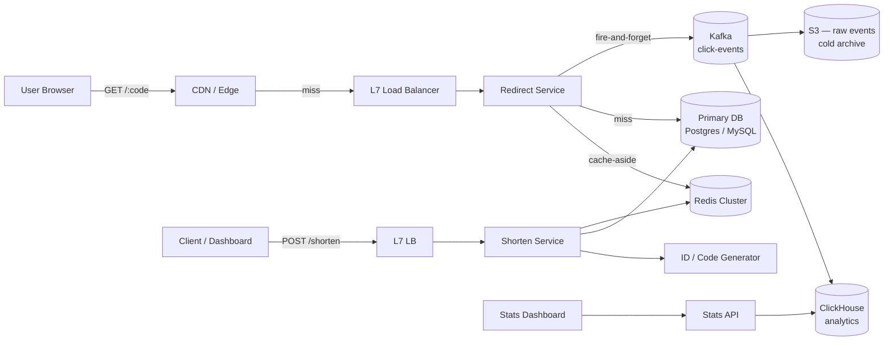
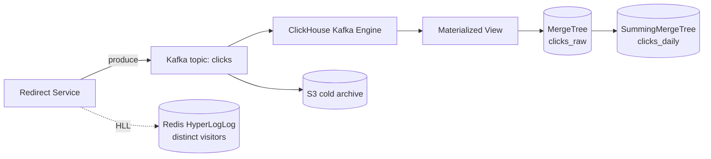

# Design a URL Shortener — HLD Case Study (Easy)

**Date:** 2026-04-25 | **Updated:** 2026-04-25
**Tags:** `system-design` `case-study` `url-shortener` `basic` `scalability`
**Difficulty:** Easy | **Surface:** High-Level Design

## Table of Contents

- [Summary](#summary)
- [Problem Framing](#problem-framing)
- [Functional Requirements](#functional-requirements)
- [Non-Functional Requirements](#non-functional-requirements)
- [Capacity Estimation](#capacity-estimation)
- [API Design](#api-design)
- [Data Model](#data-model)
- [High-Level Design](#high-level-design)
- [Deep Dives](#deep-dives)
  - [Code Generation Strategies](#code-generation-strategies)
  - [Cache Strategy](#cache-strategy)
  - [Custom Aliases](#custom-aliases)
  - [Click Analytics Pipeline](#click-analytics-pipeline)
  - [Redirect HTTP Code — 301 vs 302](#redirect-http-code--301-vs-302)
- [Bottlenecks & Trade-offs](#bottlenecks--trade-offs)
- [Anti-Patterns](#anti-patterns)
- [Related](#related)
- [References](#references)

## Summary

A URL shortener is the canonical "easy" system design interview problem because the surface API is tiny but the question hides every interesting backend trade-off: globally unique ID generation, read-heavy caching, asynchronous analytics, and the difference between **a hot redirect path you cannot afford to slow down** and **a cold write path you can afford to spend a few milliseconds on**. This doc walks through the high-level design at Bit.ly / TinyURL scale (~1B URLs, ~10K redirects/sec sustained, bursty hot links) and is paired with the implementation-level twin at [`../../../low-level-design/case-studies/developer-tools/design-url-shortener-lld.md`](../../../low-level-design/case-studies/developer-tools/design-url-shortener-lld.md).

The single most important insight: **redirects (read) and creations (write) are two different services that share storage**. Optimize them independently or you will under-build the read path and over-build the write path.

## Problem Framing

> Build a service that turns `https://example.com/some/very/long/path?q=1&utm=...` into `https://sho.rt/aZ4kP9` and, when a user visits the short URL, redirects them to the original.

Clarifying questions a senior engineer should surface before whiteboarding:

1. **Read vs write ratio?** — Industry norm is roughly **100:1** to **1000:1** reads per write.
2. **Is the short code public/guessable?** — Affects whether sequential counters are acceptable.
3. **Custom aliases?** — Adds a uniqueness check on the write path.
4. **Expiry / TTL?** — Drives cleanup jobs and storage forecasts.
5. **Analytics fidelity?** — Exact counts vs approximate; per-click metadata depth.
6. **Multi-region?** — Single region simplifies write path; multi-region forces ID coordination.

For this doc we assume: ~1B total URLs, 100:1 read:write, custom aliases optional, per-link click counts and basic geo/UA breakdown, single primary region with global edge cache.

## Functional Requirements

| # | Requirement | Notes |
|---|---|---|
| F1 | Shorten a long URL to a short code (default 7 chars) | `POST /shorten` |
| F2 | Redirect a short code to the long URL | `GET /:code` returns `301`/`302` |
| F3 | Custom alias (optional, user-supplied) | Must be unique, validated against banned-word list |
| F4 | Expiry (optional, user-supplied or default TTL) | Expired codes return `410 Gone` |
| F5 | Click analytics — total count, per-day count, geo, referrer, UA | Eventually consistent |
| F6 | Owner attribution and listing | Authenticated users can list/disable their links |

Out of scope for this HLD: rich link previews, A/B-testable destinations, link-in-bio pages, fraud/phishing scanning (mentioned briefly in trade-offs).

## Non-Functional Requirements

| # | Requirement | Target |
|---|---|---|
| NF1 | Redirect latency (p99) | < 50 ms at the edge, < 150 ms origin |
| NF2 | Availability — redirect | 99.99% (4 nines) |
| NF3 | Availability — create | 99.9% (3 nines, can tolerate brief degradation) |
| NF4 | Durability of the long-URL mapping | 99.999999999% (cannot lose a mapping) |
| NF5 | Scale | 1B URLs total, 10K RPS redirects, 100 RPS writes, 10x burst |
| NF6 | Short-code unguessability | Random or hashed codes, not raw sequential IDs |

The asymmetry between NF2 and NF3 matters: **a broken `/shorten` is an inconvenience; a broken redirect breaks every existing campaign, QR code, and printed flyer in the world.**

## Capacity Estimation

Back-of-envelope numbers for a 5-year horizon. See [`../../foundations/back-of-envelope-estimation.md`](../../foundations/back-of-envelope-estimation.md) for the methodology.

**Writes:**

```text
100 M new URLs / month
≈ 100,000,000 / (30 * 86400) ≈ 40 writes/sec average
Peak burst: ~10x → 400 writes/sec
```

**Reads:**

```text
Read:write ≈ 100:1
Sustained: ~4,000 redirects/sec
Peak: ~40,000 redirects/sec (a viral link or campaign launch)
```

**Storage** (per record ~500 bytes including indexes, metadata, owner):

```text
1 B URLs × 500 B ≈ 500 GB primary table
+ analytics events (write-heavy, retained 90 days):
  4,000 redirects/sec × 86400 × 90 ≈ 31 B events
  31 B × 200 B ≈ 6.2 TB of click-event data
```

**Bandwidth** (redirect responses are tiny — a `Location` header ~ 200 B):

```text
4,000 redirects/sec × 200 B ≈ 800 KB/sec ≈ 6.4 Mbps
Peak: ~64 Mbps — trivial; no bandwidth concern.
```

**Cache working set** (Pareto: ~80% of clicks hit ~20% of links):

```text
Hot URLs ≈ 200 M
× 500 B ≈ 100 GB → comfortably fits in a small Redis cluster.
A 10–20 GB cache hosting the top 1–5% likely captures >90% of redirects.
```

**Takeaway:** writes are negligible. Reads and analytics events dominate. Storage is small enough that a single sharded MySQL/Postgres cluster handles the canonical mapping; everything else is caching and analytics.

## API Design

### Create

```http
POST /api/v1/shorten
Authorization: Bearer <token>
Content-Type: application/json

{
  "long_url": "https://example.com/very/long/path?q=1",
  "alias": "launch-2026",       // optional
  "expires_at": "2026-12-31T23:59:59Z"  // optional
}
```

```http
HTTP/1.1 201 Created
Content-Type: application/json

{
  "code": "launch-2026",
  "short_url": "https://sho.rt/launch-2026",
  "long_url": "https://example.com/very/long/path?q=1",
  "expires_at": "2026-12-31T23:59:59Z",
  "created_at": "2026-04-25T10:14:00Z"
}
```

Errors: `400` invalid URL, `409` alias already taken, `422` banned alias, `429` rate limited.

### Redirect

```http
GET /:code HTTP/1.1
Host: sho.rt
```

```http
HTTP/1.1 302 Found
Location: https://example.com/very/long/path?q=1
Cache-Control: private, max-age=0
```

Choosing **302** over **301** is deliberate — see [Redirect HTTP Code — 301 vs 302](#redirect-http-code--301-vs-302).

### Stats (read-only, authenticated)

```http
GET /api/v1/links/launch-2026/stats?from=2026-04-01&to=2026-04-25
```

```json
{
  "code": "launch-2026",
  "total_clicks": 184302,
  "by_day": [{ "date": "2026-04-25", "clicks": 12041 }],
  "top_referrers": [{ "host": "twitter.com", "clicks": 41020 }],
  "top_countries": [{ "code": "US", "clicks": 92011 }]
}
```

## Data Model

The canonical mapping table is intentionally boring — a key/value lookup with metadata.

```sql
CREATE TABLE urls (
  code         VARCHAR(16)  PRIMARY KEY,
  long_url     TEXT         NOT NULL,
  owner_id     BIGINT       NOT NULL,
  created_at   TIMESTAMPTZ  NOT NULL DEFAULT now(),
  expires_at   TIMESTAMPTZ  NULL,
  is_disabled  BOOLEAN      NOT NULL DEFAULT FALSE,
  is_custom    BOOLEAN      NOT NULL DEFAULT FALSE
);

CREATE INDEX idx_urls_owner    ON urls (owner_id, created_at DESC);
CREATE INDEX idx_urls_expires  ON urls (expires_at) WHERE expires_at IS NOT NULL;
```

**Why `code` is the PK** — every redirect is a point lookup by code. Making code the clustered/primary key means the redirect path is one B-tree seek (or one cache hit).

**Click counters live elsewhere.** Putting `click_count` in this row turns every redirect into a write and destroys the hot read path. Counts are derived from the analytics pipeline.

```sql
-- Aggregated rollups in OLAP (e.g., ClickHouse)
CREATE TABLE clicks_daily (
  code        LowCardinality(String),
  day         Date,
  country     LowCardinality(String),
  referrer    String,
  ua_family   LowCardinality(String),
  count       UInt64
) ENGINE = SummingMergeTree()
PARTITION BY toYYYYMM(day)
ORDER BY (code, day, country, referrer, ua_family);
```

For sharding strategy when 500 GB outgrows a single primary, see [`../../scalability/sharding-strategies.md`](../../scalability/sharding-strategies.md). The natural shard key is `code` itself (range or hash).

## High-Level Design



Two independent service planes:

- **Hot path (redirect)** — CDN → L7 LB → stateless redirect service → Redis → DB. Click events are emitted asynchronously to Kafka; the redirect response is **never** blocked on analytics.
- **Cold path (write/admin)** — Shorten service generates a code, persists to DB, optionally warms the cache. Stats API reads from ClickHouse.

This is the dual-flow pattern Bit.ly publishes: caching absorbs the vast majority of redirects, and only cache misses and new URLs touch the database. See [`../../building-blocks/caching-layers.md`](../../building-blocks/caching-layers.md) for the layer-by-layer cache discussion.

## Deep Dives

### Code Generation Strategies

Three viable approaches; pick one and own its trade-offs.

**1. Counter + Base62**

Maintain a globally monotonic counter (Postgres sequence, Redis `INCR`, or a [Snowflake](https://github.com/twitter-archive/snowflake)-style allocator). Encode the integer in base62 (`[0-9A-Za-z]`).

```text
counter = 125_000_000_007
base62  = "bDcF7Tx"   (7 chars covers 62^7 ≈ 3.5 trillion)
```

- Pros: zero collisions by construction, dense (no wasted codes), tiny.
- Cons: codes are **guessable** (you can crawl the whole space), counter is a coordination point. Mitigate by allocating ranges per shard (each app server gets a 10K-block from the central allocator and serves locally).

**2. Hash + Truncate**

`code = base62(md5(long_url + salt))[:7]`

- Pros: deterministic — the same URL always shortens to the same code (idempotent shortening).
- Cons: **collisions guaranteed** at scale (birthday paradox — ~77K codes before a 50% collision probability in a 7-char base62 space ≈ 3.5T, but truncation makes it worse). Requires collision detection + retry on insert. Determinism can be a leak (someone hashing your private URL gets the same code).

**3. Random + Collision Check**

Generate 7 random base62 chars; insert with `ON CONFLICT DO NOTHING`; retry on conflict.

- Pros: unguessable, no central coordinator, simple.
- Cons: at high fill density (>50% of code space used), retry rate climbs. At our 1B-URL scale (~0.03% of 62^7), retries are vanishingly rare.

**Recommendation:** **Random + collision check** for public URLs (unguessability matters), or a **range-allocated counter** (Snowflake-style) when ID density and ordering matter more than unguessability. Avoid raw `MD5` truncation in production — the collision math is unforgiving and the determinism is a footgun.

For collision detection at very high ingest rates, front the DB check with a **Bloom filter** over existing codes — most "is this code taken?" lookups short-circuit without hitting storage.

### Cache Strategy

The redirect service is a textbook **cache-aside** workload:

```text
1. GET code from Redis → hit? respond with Location header.
2. Miss? SELECT from DB.
3. SET code → long_url in Redis with TTL (e.g., 24h).
4. Respond.
```

Sizing: the working set (top 1–5% of links) is well under 100 GB. A modest Redis cluster (3 shards × 32 GB) is plenty.

**Key hazards:**

- **Thundering herd on hot link expiration.** When a viral link's TTL expires, thousands of concurrent requests can stampede the DB. Mitigate with **request coalescing** (single-flight per key) or **probabilistic early refresh** before TTL hits zero.
- **Negative caching.** Cache a sentinel for "code not found" with a short TTL (60s) to avoid hammering the DB with 404 lookups for spammed/scanned codes.
- **Cache poisoning on write.** When a link is disabled or its target updated, invalidate (or write-through) the cache key. Don't rely on TTL alone for safety-critical changes.

For the full strategy taxonomy, see [`../../building-blocks/caching-layers.md`](../../building-blocks/caching-layers.md).

### Custom Aliases

Custom aliases (`/launch-2026`) share the `urls.code` namespace with auto-generated codes. Two extra checks on the write path:

1. **Uniqueness** — handled by the PK constraint; surface as `409 Conflict`.
2. **Banned-word list** — prevent slurs, brand impersonation (`/google`, `/login-paypal`), and reserved system paths (`/api`, `/admin`, `/health`). Maintain a curated deny-list and do a substring + Levenshtein check on suspicious patterns.

To prevent collisions between auto-generated codes and reserved aliases, **reserve a code-space region**: e.g., auto codes are exactly 7 chars from a restricted alphabet; aliases are 4–30 chars and may include `-`. The two spaces don't overlap.

### Click Analytics Pipeline

The redirect service emits one event per redirect to Kafka and **does not wait** for the produce ack — it uses fire-and-forget with a local in-memory ring buffer for backpressure tolerance.



Why this shape:

- **Kafka decouples** the redirect hot path from analytics availability. ClickHouse can be down for hours; redirects keep working; Kafka retains events.
- **ClickHouse** is purpose-built for billions of append-only rows with sub-second OLAP queries. The Kafka engine + materialized views auto-ingest.
- **Redis HyperLogLog** gives O(1)-memory **approximate distinct counts** per code per day for "unique visitors" — exact counts are too expensive at this scale and rarely worth it.
- **S3 cold archive** of the raw event stream gives you replay, re-aggregation under new schemas, and cheap long-term retention.

Each event carries a Snowflake-style globally unique event ID, so deduplication works end-to-end (Kafka → ClickHouse → reports).

### Redirect HTTP Code — 301 vs 302

| Code | Browser/CDN behavior | Implication |
|---|---|---|
| **301 Moved Permanently** | Cached aggressively (often forever) | Faster repeat visits, **but you lose every analytics signal** after the first visit because the browser stops asking your server. |
| **302 Found** | Not cached by default | Every visit hits your edge → analytics work, you can disable/rotate links. |
| **307 Temporary Redirect** | Not cached, preserves method/body | Useful for non-GET redirects; rarely needed for shorteners. |

**Recommendation:** **302** for any link where you want analytics or the ability to disable/edit destinations. Use **301** only for permanent, fire-and-forget redirects (e.g., domain migrations) where you have no analytics requirement. Bit.ly defaults to 301; many modern shorteners default to 302 because analytics value outweighs the cache benefit when you have a CDN doing the work anyway.

You can have both: send a **301 with a short `Cache-Control: max-age`** to retain some browser caching while still seeing most clicks.

## Bottlenecks & Trade-offs

| Concern | Bottleneck | Mitigation |
|---|---|---|
| Counter coordination | Single allocator → SPOF, write hotspot | Range-allocate to app servers; or use Snowflake/UUIDv7 with base62 |
| Hot key in cache | One viral link saturates one Redis shard | Replicate hot keys across multiple shards (key suffixing); CDN-level caching for the top N links |
| DB write hot partition | Sequential `code` PK clusters writes | Hash the code into the PK or use random codes; or shard by hash of code |
| Analytics backpressure | Kafka producer blocking redirects | Fire-and-forget, bounded local queue, drop on overflow with a counter metric |
| Phishing / abuse | Shorteners are an attractive cloak for malware | Real-time URL scanning on `POST /shorten`, integrate Google Safe Browsing / VirusTotal, allow takedowns |
| Multi-region writes | Two regions allocating the same code | Region-prefixed code space, or single-leader writes with regional read replicas |
| Cache stampede on hot expiry | Concurrent miss after TTL | Single-flight per key, probabilistic early refresh, or pin top-N keys with no TTL + manual invalidation |

## Anti-Patterns

- **Storing `click_count` on the `urls` row.** Turns every redirect into a write; destroys the hot path. Aggregate analytics out-of-band.
- **Using `MD5(long_url)[:7]` without collision detection.** Birthday-paradox math will eventually corrupt mappings.
- **Synchronously writing to ClickHouse from the redirect path.** Couples redirect availability to OLAP availability.
- **Returning `301` and then expecting analytics.** Browsers cache forever; your dashboard goes dark for repeat visitors.
- **Using a relational `AUTO_INCREMENT` PK as the public short code.** Codes are guessable — competitors can enumerate your entire link graph.
- **No expiry / no archival.** "We'll grow forever" is not a plan. Define TTL, archive cold rows to S3 + Glacier, keep the hot table small.
- **One service handling both `POST /shorten` and `GET /:code`.** They have different SLOs, traffic shapes, and dependency surfaces — split them.
- **Ignoring the abuse vector.** Free shorteners get weaponized for phishing within hours of launch. Build the moderation pipeline on day one.

## Related

- LLD twin: [`../../../low-level-design/case-studies/developer-tools/design-url-shortener-lld.md`](../../../low-level-design/case-studies/developer-tools/design-url-shortener-lld.md)
- Sharding when the mapping table outgrows one node: [`../../scalability/sharding-strategies.md`](../../scalability/sharding-strategies.md)
- Cache layer choices and pitfalls: [`../../building-blocks/caching-layers.md`](../../building-blocks/caching-layers.md)
- Capacity-math methodology: [`../../foundations/back-of-envelope-estimation.md`](../../foundations/back-of-envelope-estimation.md)
- Read/write split and cache strategy patterns: [`../../scalability/read-write-splitting-and-cache-strategies.md`](../../scalability/read-write-splitting-and-cache-strategies.md)
- Load balancers in the redirect hot path: [`../../building-blocks/load-balancers.md`](../../building-blocks/load-balancers.md)
- Message queues for analytics: [`../../building-blocks/message-queues-and-brokers.md`](../../building-blocks/message-queues-and-brokers.md)

## References

- [Hello Interview — Design a URL Shortener Like Bit.ly](https://www.hellointerview.com/learn/system-design/problem-breakdowns/bitly) — interview-grade walkthrough including sharding and ID generation trade-offs.
- [System Design Handbook — Design a URL Shortener Like Bit.ly](https://www.systemdesignhandbook.com/guides/design-bitly/) — dual-flow architecture and read-heavy caching insights attributed to Bit.ly's published design.
- [Witty Coder — Hashing Strategies: Base62, Counters, and Collision Avoidance](https://wittycoder.in/courses/url-shortener/url-shortener-hashing) — comparison of counter, hash, and random approaches with Bloom-filter collision short-circuit.
- [Cloudflare Workers KV docs — demos and architectures](https://developers.cloudflare.com/kv/demos/) — edge-native shortener pattern (Worker + KV) for low-latency global redirects.
- [HackerNoon — Build a Scalable URL Shortener With Cloudflare Workers and KV](https://hackernoon.com/how-to-build-a-scalable-url-shortener-with-cloudflare-workers-and-kv-under-10-minutes) — concrete edge architecture with KV as the redirect store.
- [Developer's Voice — Engineering URL Shorteners at Scale: Distributed ID Generation, Multi-Tier Caching, and Real-Time Analytics](https://developersvoice.com/blog/practical-design/url-shorteners-at-scale-practical-guide/) — Snowflake IDs, Kafka → ClickHouse analytics, dedup strategy.
- [Tinybird — URL Shortener (Dub) template](https://www.tinybird.co/templates/dub) — production reference for click-event ingestion and real-time analytics queries.
- [Dilip Kumar — Hyperscale URL Shortener System Design](https://dilipkumar.medium.com/url-shortener-system-design-f5817b7e22ce) — deeper treatment of sharding, hot-key replication, and multi-region considerations.
