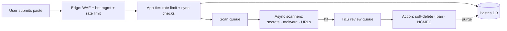
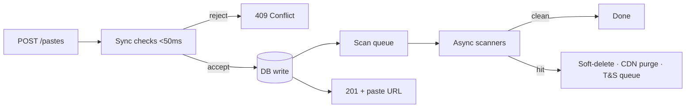
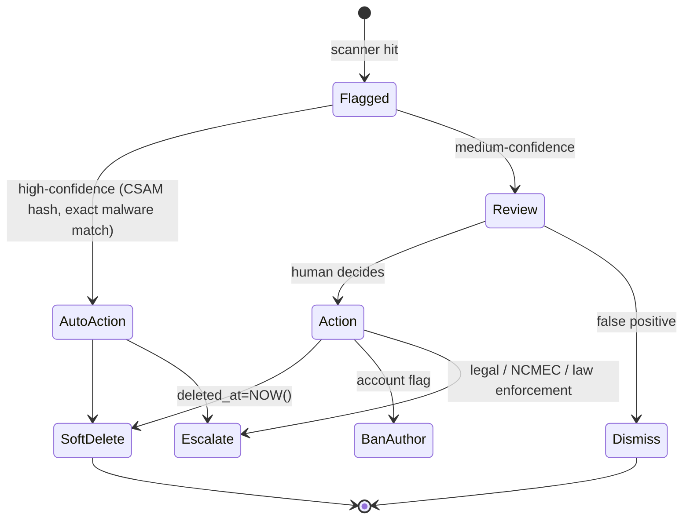

# Pastebin Deep Dive — Abuse Defense

**Date:** 2026-04-27 | **Updated:** 2026-04-27
**Tags:** `system-design` `case-study` `pastebin` `deep-dive` `abuse` `trust-safety` `dmca`

## Table of Contents

- [Summary](#summary)
- [Overview](#overview)
- [Threat Model](#threat-model)
- [Rate Limiting at Create](#rate-limiting-at-create)
- [Content Scanning at Write](#content-scanning-at-write)
- [Secret Detection](#secret-detection)
- [Trust and Safety Pipeline](#trust-and-safety-pipeline)
- [DMCA Takedown Flow](#dmca-takedown-flow)
- [CSAM Compliance](#csam-compliance)
- [Geo-Restrictions](#geo-restrictions)
- [Honeypots and Bots](#honeypots-and-bots)
- [Account Takeover Defense](#account-takeover-defense)
- [Reputational Ban Lists](#reputational-ban-lists)
- [Transparency and Appeals](#transparency-and-appeals)
- [Cost Analysis](#cost-analysis)
- [Anti-Patterns](#anti-patterns)
- [Related](#related)
- [References](#references)

## Summary

A Pastebin-style service with anonymous create is a frictionless drop point for malware, leaked credentials, phishing kits, copyrighted material, illegal content, and spam. Abuse defense is therefore not one feature; it is a **pipeline** that combines **rate limiting** at the edge and the app tier, **content scanning** at write (secrets, malware, known-bad URLs), an **async trust-and-safety queue** with human review, a **DMCA takedown flow** that satisfies 17 U.S.C. § 512 safe harbor, **mandatory CSAM reporting** to NCMEC's CyberTipline, **geo-restriction** for jurisdiction-illegal content, **honeypots and CAPTCHA** for bot floors, **account-takeover** defenses, and **reputational ban lists** drawn from Spamhaus / AbuseIPDB feeds. Each layer is independent so any single bypass still leaves attackers facing the next. The deep cost question is async vs sync: synchronous scanning blocks a user-visible write, async scanning saves latency but lets bad content live for seconds-to-minutes — the design decision is which content categories justify which budget.

## Overview

Look at the parent case study's Abuse Defense subsection ([../design-pastebin.md](../design-pastebin.md)). The parent gives the right shape — rate limit, async scan, DMCA, account anti-abuse, egress controls — but at production scale every one of those bullets is a system. This deep dive expands them into the layers an actual trust-and-safety org runs.

A useful frame: abuse defense for a public paste service has the same independent-layers structure as the security defense-in-depth story ([../../../security/defense-in-depth-and-threat-modeling.md](../../../security/defense-in-depth-and-threat-modeling.md)), but the threat actors are different. There, the attacker wants to steal data from your tenants. Here, the attacker wants to **use you as the carrier** for malware, phishing, leaks, or copyrighted content. You are not the target; you are the weapon. The design must therefore make you a poor weapon.



## Threat Model

Before any control is chosen, the design must enumerate what abuse on a paste service actually looks like. The categories below are not theoretical; they are the recurring traffic patterns that operate against every public paste host.

| Category | What it looks like | Why it matters |
|----------|--------------------|----------------|
| **Credential dumps** | `combo lists` (`email:password` lines), database breach excerpts, employee creds | Triggers credential-stuffing waves; mandatory reporting to source vendor; reputational hit |
| **Malware payloads** | PowerShell stagers, base64 shellcode, macro droppers | Service becomes part of an APT delivery chain; ASN gets blocked by EDRs |
| **Phishing kits** | HTML+CSS replicas of bank or SaaS login, with `action=` URLs to attacker-controlled hosts | Anti-phishing aggregators (PhishTank, Google Safe Browsing) flag your domain |
| **Copyrighted material** | Source code under proprietary license, ebook excerpts, leaked scripts | DMCA notices; loss of safe-harbor if pattern of inaction |
| **Illegal content** | CSAM, terror propaganda, doxxing dossiers | Legal liability; mandatory reporting; criminal exposure |
| **Doxxing / PII** | Home addresses, SSNs, real names of targeted individuals | GDPR Art. 17 right-to-erasure; harassment liability |
| **Spam and SEO** | Affiliate-link walls, casino spam, fake "free crypto" pages | Search-engine deindex of your raw paths |
| **C2 channels** | Encoded commands picked up by infected hosts polling raw URLs | Service is unwitting infrastructure for botnets |

The **ambient base rate** for a public paste service skews heavily abusive: any open submission endpoint without controls will trend toward >50% spam/abuse within weeks, simply because abuse is automated and legitimate use is not. The design decision is not "if" but "how much of this latency budget is spent stopping it."

A second framing — borrow STRIDE from the [defense-in-depth doc](../../../security/defense-in-depth-and-threat-modeling.md) but with abuse-relevant entries:

- **Spoofing** — bot pretending to be a browser; throwaway email accounts; rotating IPs via residential proxy.
- **Tampering** — modifying paste body to evade hash checks; polymorphic obfuscation.
- **Information disclosure** — your service exposing private pastes that were "unlisted but not access-controlled."
- **Denial of service** — a flood of creates designed to fill cheap storage or your scan queue.
- **Elevation of privilege** — abuse account becoming a "trusted" account by accumulating reputation, then dumping payloads.

## Rate Limiting at Create

Rate limiting is the cheapest first filter and the one that determines how loud the rest of the pipeline has to be. It belongs at **two tiers**: the edge (WAF / CDN bot management) and the application tier (token bucket per identity). For the algorithm trade-offs, the dedicated companion is at [../rate-limiter/multi-tier-limits.md](../rate-limiter/multi-tier-limits.md) and [../rate-limiter/algorithm-choice.md](../rate-limiter/algorithm-choice.md).

The right ceiling for a paste service is not one number — it is a tier matrix:

| Tier | Per minute | Per hour | Per day | Notes |
|------|-----------|----------|---------|-------|
| Anonymous (IP) | 5 | 30 | 100 | Small ceiling, big penalty for breach |
| Email-verified, < 7 days old | 10 | 100 | 500 | "Probationary" — heavier scanning |
| Email-verified, > 7 days, no flags | 30 | 500 | 5000 | Normal user |
| Authenticated API user with paid plan | 100 | 5000 | unlimited (with budget) | Trust earned via account standing |
| Internal / known-good integrations | configurable | configurable | configurable | Allowlist; still scanned |

Beyond identity-based limits, layer **behavioral signals** that a single counter cannot capture:

- **Per-content-hash limit** — if the same SHA-256 has been submitted N times, refuse. This catches re-upload after deletion.
- **Per-near-duplicate** — SimHash or MinHash bucket; suspicious blobs that vary by a few bytes (e.g., obfuscation jitter).
- **Per-burst entropy** — five identical-length pastes from the same /24 in 10 seconds is bot-shaped even if each IP is "under" its individual limit.
- **Per-ASN limit** — residential-proxy abuse rotates IPs but stays in the same ASN. Aggregate counters at ASN granularity for known-abuse ASNs.
- **CAPTCHA escalation** — at 80% of the ceiling, force a CAPTCHA before the paste is accepted. At 100%, refuse.

Edge-tier limits should be implemented as **fail-closed** counters — see [../rate-limiter/failure-modes.md](../rate-limiter/failure-modes.md). If the limiter store (Redis) is unreachable, the safest default for an anonymous create endpoint is **deny**, not allow.

## Content Scanning at Write

Once the create is accepted past rate limits, the body is scanned. The design choice is **synchronous block vs async quarantine**, and most services run both.



**Synchronous checks** (must finish in <50ms p99 or the user-perceived latency degrades):

- Body length cap.
- Content-type sanity (e.g., reject NUL-heavy binary).
- Hash check against the **known-bad SHA-256 cache** (Redis). This catches re-uploads of confirmed malware in microseconds.
- Cheap regex sweep for the highest-confidence secrets (AWS key, Stripe secret key) — see the catalog below.
- Allowlist / blocklist on the submitter's reputation (IP, ASN, account standing).

**Async scanners** (run after the 201 is returned):

- **YARA rules** for malware family signatures. YARA is the industry-standard pattern matcher for malware ([yara.readthedocs.io](https://yara.readthedocs.io/)). A worker loads the compiled rule set into memory once and matches each new paste body. Because YARA matches across binary and text, it handles base64-encoded shellcode and common obfuscations without a separate decode step.
- **ClamAV** (or commercial equivalent) for traditional AV signatures. Slower than YARA but broader.
- **URL extraction + Safe Browsing lookup**. Pull all URLs out of the body; check each against the [Google Safe Browsing API](https://developers.google.com/safe-browsing/v4) and [PhishTank](https://www.phishtank.com/). A paste containing a known-malicious URL is high-confidence abuse.
- **Custom ML classifier** for category-level signals (phishing-kit-like HTML, credential-dump-shaped lines).

Example YARA rule for one of the simplest detections — embedded PowerShell that downloads and executes a remote payload, a near-universal staging pattern:

```yara
rule PowerShell_DownloadString_Exec {
    meta:
        author = "pastebin-ts"
        description = "PowerShell that downloads and executes a remote string"
        severity = "high"

    strings:
        $a = "DownloadString" nocase
        $b = "IEX" nocase
        $c = "Invoke-Expression" nocase
        $d = /https?:\/\/[^\s"']+/ nocase

    condition:
        $a and ($b or $c) and $d
}
```

A real rule set has hundreds of these — generic stagers, reverse shells, known cobalt-strike templates, shell scripts that pipe `curl` to `bash`. YARA rules are a community ecosystem; subscribing to a curated feed (e.g., the [YARA-Forge](https://yarahq.github.io/) bundle) is more effective than authoring everything in-house.

**Synchronous block vs async quarantine — the trade-off:**

| Property | Sync block | Async quarantine |
|----------|-----------|------------------|
| User latency | +50–500ms | unchanged |
| Window where bad content is reachable | zero | seconds to minutes |
| False-positive UX | user sees rejection at create | user sees the paste, then it disappears |
| Throughput cap | bound by slowest scanner | bound by queue depth, not user latency |
| Best for | extreme-confidence high-cost categories (CSAM, known malware) | everything else |

The compromise most teams settle on: **sync block for known-bad hash and a tiny ultra-high-confidence regex pack; async for everything else with a CDN purge and soft-delete on hit.** The async window is the cost — for most categories, 30–120 seconds of exposure is acceptable; for CSAM, it is not.

## Secret Detection

Public pastes are one of the largest unintentional sources of leaked credentials. Tools like [TruffleHog](https://github.com/trufflesecurity/trufflehog) and [Gitleaks](https://github.com/gitleaks/gitleaks) exist precisely because developers paste configs, `.env` files, and API responses without redaction. The best secret-detection runs on every write, classifies the secret, attempts validation, and notifies the issuing vendor for revocation.

A high-precision regex catalog (sample, not exhaustive):

| Provider | Pattern | Notes |
|----------|---------|-------|
| AWS Access Key ID | `\bAKIA[0-9A-Z]{16}\b` | Always 20 chars, prefix `AKIA` (long-lived) or `ASIA` (session) |
| AWS Secret Access Key | `\b[A-Za-z0-9/+=]{40}\b` near "aws" or "secret" | Pure regex is high-FP; combine with proximity to AWS key id |
| GitHub PAT (fine-grained) | `\bgithub_pat_[A-Za-z0-9_]{82}\b` | Fixed prefix and length |
| GitHub classic token | `\bghp_[A-Za-z0-9]{36}\b` | `ghp_`, `gho_`, `ghu_`, `ghs_`, `ghr_` variants |
| Stripe live secret | `\bsk_live_[A-Za-z0-9]{24,}\b` | `sk_test_` for test; `pk_` for publishable (lower severity) |
| Slack token | `\bxox[abprs]-[A-Za-z0-9-]{10,}\b` | bot, app, user, workspace, refresh |
| Google API key | `\bAIza[0-9A-Za-z_\-]{35}\b` | 39 chars total |
| OpenAI API key | `\bsk-(?:proj-)?[A-Za-z0-9_\-]{40,}\b` | Updated several times; track current vendor format |
| Twilio Account SID | `\bAC[a-f0-9]{32}\b` | Often paired with auth token |
| JWT | `\bey[A-Za-z0-9_\-]{10,}\.[A-Za-z0-9_\-]{10,}\.[A-Za-z0-9_\-]{10,}\b` | Decode and inspect `alg`/`exp`; ignore obvious tutorial JWTs |
| Private key | `-----BEGIN (RSA|OPENSSH|EC|DSA|PGP) PRIVATE KEY-----` | Very high precision |

Vendor-specific prefixes (Stripe `sk_live_`, GitHub `ghp_`) are by design — they're called **secret prefixes** and exist so detectors can reliably flag them. Use them as the first filter; only run expensive scanners on regions of the body that contain these markers.

For high-entropy strings without an obvious provider prefix (custom service tokens, generic API keys), use **Shannon entropy** as a heuristic. A 32-character random base64 string has entropy near 5–6 bits per character; English prose hovers near 4. The simplest heuristic flags any token-shaped substring whose entropy exceeds a threshold.

```python
import math
from collections import Counter

def shannon_entropy(s: str) -> float:
    """Bits of entropy per character. Returns 0 for empty string."""
    if not s:
        return 0.0
    counts = Counter(s)
    length = len(s)
    return -sum(
        (count / length) * math.log2(count / length)
        for count in counts.values()
    )

# Usage in a scanner: extract token-shaped substrings, score them.
TOKEN_RE = r"[A-Za-z0-9+/=_\-]{20,}"
ENTROPY_THRESHOLD = 4.5  # bits/char; tune per corpus

def candidate_secrets(body: str) -> list[str]:
    import re
    return [
        token
        for token in re.findall(TOKEN_RE, body)
        if shannon_entropy(token) >= ENTROPY_THRESHOLD
    ]
```

False positives are the operational pain. Real configurations contain version hashes, build IDs, UUIDs, and base64-encoded test data that look secret-shaped. Mitigations:

- **Allowlist test prefixes** — `sk_test_`, `pk_test_`, `AKIA*EXAMPLE*` are documented test fixtures.
- **Validate before alerting** — call the vendor's introspection endpoint with the candidate secret. AWS STS `GetCallerIdentity`, Stripe `GET /v1/balance`, GitHub `GET /user`. A 401/403 means the secret is dead or fake; only act on live ones.
- **Suppress repeats** — if the same hash of the same secret has been seen and validated as fake, do not re-alert.

For **live** secrets, the highest-leverage action is **automated revocation notification to the issuing vendor**. GitHub, AWS, Google Cloud, Stripe, and Slack all run [secret scanning partner programs](https://docs.github.com/en/code-security/secret-scanning/secret-scanning-partnership-program) where the platform notifies the vendor on detection and the vendor revokes the secret. A paste service should ship its high-confidence detections through the same partner channels rather than silently soft-deleting and leaving the credential live.

## Trust and Safety Pipeline

Hits from the scanners flow into a queue that humans review. The design discipline is identical to a normal incident pipeline: ticket lifecycle, SLAs, and an audit log of every action. Without this, "we found something" goes nowhere.



The queue carries severity tiers with explicit SLAs:

| Severity | Examples | Review SLA | Default action while awaiting review |
|----------|----------|-----------|---------------------------------------|
| P0 | CSAM hash match, terror content | Auto-action; human verification within 15 min | Pre-emptively soft-deleted; report filed |
| P1 | Live AWS root creds, malware exact match | 1 hour | Soft-deleted on detection; reviewed for context |
| P2 | Suspected phishing, credential dump | 4 hours | Visible-but-flagged; downranked from search |
| P3 | DMCA notice, spam | 24 hours | Visible until reviewed |
| P4 | User-reported "doesn't look right" | 72 hours | Visible; aggregated for pattern detection |

Human review is the bottleneck. The queue UI must show: the body, the scanner verdicts, the author's account history, the IP and ASN, prior decisions on similar content, and one-click actions (delete, ban, dismiss). Every action writes an audit row — _who_, _when_, _what_, _why_ — both for legal defense and for training the next ML classifier.

## DMCA Takedown Flow

The [Digital Millennium Copyright Act](https://www.law.cornell.edu/uscode/text/17/512) section 512(c) creates a **safe harbor** for online service providers that host user content, conditional on:

1. Designating a registered DMCA agent with the U.S. Copyright Office.
2. Acting "expeditiously" to remove or disable access to claimed infringing material upon a valid notice.
3. Forwarding counter-notices to the original claimant and reinstating content if no lawsuit is filed within 10–14 business days.
4. Adopting and reasonably implementing a **repeat-infringer policy** that terminates accounts of repeat offenders.

A valid 512(c)(3)(A) notice has six required elements: signature, identification of the work, identification of the infringing material with enough detail to locate it, contact info, a good-faith statement, and a perjury statement.

The receiving system needs:

```pseudocode
state DMCA_PENDING
state DMCA_VALIDATED
state DMCA_TAKEDOWN
state DMCA_COUNTER_NOTICED
state DMCA_REINSTATED
state DMCA_REJECTED

on receive_notice(notice):
    if not has_required_elements(notice):
        send_rejection_email(notice.sender, missing=missing_elements(notice))
        transition -> DMCA_REJECTED
        return
    transition -> DMCA_VALIDATED

on dmca_validated(case):
    paste = lookup(case.paste_id)
    if paste:
        soft_delete(paste, reason="DMCA", case_id=case.id)
        purge_cdn(paste.url)
        record_strike(paste.author_id)
    notify_author(paste.author_id, case)
    transition -> DMCA_TAKEDOWN
    sla_timer.start(case.id, days=14)

on counter_notice_received(case, counter):
    if not has_counter_required_elements(counter):
        send_rejection_email(counter.sender)
        return
    forward_to_claimant(case.claimant, counter)
    transition -> DMCA_COUNTER_NOTICED
    reinstate_timer.start(case.id, business_days=10, max_days=14)

on reinstate_timer_expired(case):
    if not lawsuit_filed(case):
        restore_paste(case.paste_id)
        transition -> DMCA_REINSTATED

on repeat_strike(author):
    if author.strikes >= REPEAT_INFRINGER_THRESHOLD:
        terminate_account(author)
```

Practical notes:

- **Soft-delete, never hard-delete.** Set `deleted_at` and keep the row plus the original content (in cold storage, encrypted) for the duration of any legal hold. The DMCA process can boomerang if a counter-notice succeeds; you need to reinstate the exact same bytes.
- **Repeat-infringer threshold** is a policy choice. Three strikes within a year is a common floor; what matters is that the policy is documented, applied consistently, and enforced. Inconsistent enforcement is the single most common reason providers lose safe-harbor in litigation.
- **Public DMCA agent designation** through the Copyright Office's [DMCA designated agent directory](https://www.copyright.gov/dmca-directory/) is mandatory; a missing or stale registration disqualifies you from safe harbor entirely.
- **Counter-notice forwarding is required.** You cannot quietly drop a counter-notice; safe harbor depends on completing the round trip.

## CSAM Compliance

Child sexual abuse material is a different legal category from copyright. **18 U.S.C. § 2258A** requires U.S.-based "electronic communication service providers" to report apparent CSAM to the [NCMEC CyberTipline](https://www.missingkids.org/gethelpnow/cybertipline) "as soon as reasonably possible." Failure to report is itself a federal offense.

The technical pattern is **PhotoDNA** (Microsoft, free for qualifying providers) or its peers — perceptual hashing that resists resizing, recompression, and minor edits, then matched against the NCMEC hash database. A match is treated as a **mandatory** report event, not a discretionary one.

For a paste service that primarily handles text, CSAM still arrives as embedded base64 images, links to image hosts, or attached binary blobs. The pipeline must:

1. **Detect images** in paste bodies — base64 PNG/JPEG markers, links to image-CDN domains.
2. **Hash with PhotoDNA** (or equivalent — the program has eligibility requirements).
3. **On match**: pre-emptively block the paste, preserve the bytes plus full metadata (timestamp, IP, account, headers) under a legal hold, and generate a CyberTipline report through the [NCMEC reporting portal](https://report.cybertip.org/).
4. **Do not delete the evidence** before the report is acknowledged. NCMEC's intake process specifies retention and chain-of-custody expectations.
5. **Account action** is automatic ban + IP/account lockout pending law-enforcement direction.

Important: **do not "investigate" CSAM yourself**. The legal doctrine is mandatory reporting, not vigilante review. Engineers should never download flagged content "to verify"; the hash match plus metadata is the report. Establish a tight access-control perimeter around the legal-hold storage, with audit logs and an explicit law-enforcement-only access path.

## Geo-Restrictions

Some content is legal in the U.S. but illegal in Germany (Nazi paraphernalia), illegal in France (certain hate speech), illegal in Russia or China for political reasons, or illegal in Saudi Arabia for religious reasons. A global service must either:

- Pull globally on every notice (overbroad — reduces availability for jurisdictions where the content is legal), or
- **Geo-restrict** — block access for viewers in jurisdictions where the content is illegal while keeping it available elsewhere.

Implementation:

- **MaxMind GeoIP2** or equivalent at the CDN / edge to resolve viewer IP to ISO 3166-1 alpha-2 country code.
- A `geo_restriction` table on each paste: `paste_id`, `blocked_countries: ["DE", "FR"]`, `reason`, `notice_id`.
- Edge worker check: if `viewer_country in blocked_countries`, return `451 Unavailable for Legal Reasons` ([RFC 7725](https://datatracker.ietf.org/doc/html/rfc7725)) with a link to the takedown notice (or to a public transparency report entry).
- VPN circumvention is real and unavoidable — the legal obligation is good-faith enforcement, not perfect prevention.

A **transparency report** ([Lumen Database](https://lumendatabase.org/) is the canonical public archive) should publish, quarterly, aggregate counts of takedowns by jurisdiction and category. This is both reputational hygiene and, in some jurisdictions, a regulatory requirement (e.g., EU Digital Services Act Articles 15 and 24 for online platforms).

## Honeypots and Bots

Most abuse is automated. The defense layer between rate limiting and CAPTCHA is a set of **silent friction** controls that cost real users nothing and break naive bots.

- **Hidden form fields (honeypots).** Add a field named something a bot will assume is required (`email_confirm`, `homepage_url`) and hide it with CSS. A real user never fills it; a form-scraping bot fills every field. Reject any submit with a non-empty honeypot.
- **Time-on-page.** Browsers take ~hundreds of ms to load and render a page; bots POST in <100ms. Reject submissions that arrive faster than a plausible human could have produced them.
- **JavaScript challenges.** Require a JS-computed token in the request body. Headless browsers can run it, but the cheapest scraper category cannot.
- **Browser fingerprint coherence.** A request claiming `User-Agent: Chrome/120` should also have the JA3/JA4 TLS fingerprint Chrome 120 actually uses. Mismatch is bot.
- **CAPTCHA — last resort.** Both [reCAPTCHA v3](https://developers.google.com/recaptcha) and [hCaptcha](https://docs.hcaptcha.com/) score requests rather than always interrupting users. Trade-offs:

| | reCAPTCHA v3 | hCaptcha |
|---|--------------|----------|
| Privacy | Google data collection | Privacy-forward marketing; still tracks |
| Accessibility | Visual puzzles fall back to audio | Visual + alt modes |
| Cost | Free up to large volumes | Has paid tiers; pays site for solves |
| Effectiveness vs commercial solvers | Bypass-as-a-service exists for both | Same |
| Vendor lock-in concern | Google tracking | Smaller vendor |

The honest framing: CAPTCHA does not stop determined attackers. It raises the per-attempt cost, which makes the rate-limit ceiling harder to hit profitably. Treat CAPTCHA as **friction**, not detection.

## Account Takeover Defense

Authenticated accounts are valuable to attackers because they have higher rate-limit ceilings and accumulated reputation. A taken-over account can dump payloads at trusted-account rates before review catches up.

Controls:

- **Credential-stuffing detection.** Watch for distributed login attempts from many IPs against many accounts. Tools: anomaly detection on the `login_attempts` time series; commercial tools like [Have I Been Pwned](https://haveibeenpwned.com/) password lists; enforce that submitted passwords are not in known-leaked corpora.
- **Login anomaly.** A successful login from a new country, new device, or new ASN, especially after a password reset, triggers step-up auth (email confirmation, MFA challenge). See [../../../security/authentication.md](../../../security/authentication.md) for the broader auth-doc treatment.
- **MFA enforcement.** Mandatory for paid / API tiers; opt-in but strongly nudged for free-tier accounts. Prefer TOTP or WebAuthn over SMS.
- **Session invalidation on suspicious activity.** A burst of high-volume creates from a previously low-volume account triggers automatic session expiration and a reauthentication challenge.
- **Device-binding tokens.** Refresh tokens bound to a device fingerprint expire when the fingerprint shifts.
- **Email-change re-verification.** Changing the recovery email requires re-confirmation from the old address with a delay (24h cooling period) so a takeover cannot instantly orphan the legitimate user.

## Reputational Ban Lists

A meaningful slice of abuse is recidivist — the same IP ranges, ASNs, email providers, and phone-number prefixes show up repeatedly. Subscribing to commercial and community feeds short-circuits the work of detecting them again.

| Feed | Coverage | Use |
|------|----------|-----|
| [Spamhaus](https://www.spamhaus.org/) | IPs, domains, botnets | Block at WAF; deny signups from listed mail domains |
| [AbuseIPDB](https://www.abuseipdb.com/) | Crowd-reported abusive IPs | Score-based: heavier scanning at moderate scores, hard block at extreme |
| Google Safe Browsing | Malicious URLs | Body URL scanning |
| [PhishTank](https://www.phishtank.com/) | Verified phishing URLs | Body URL scanning |
| Disposable email lists (e.g., `disposable-email-domains`) | Throwaway providers | Disallow signup or treat as anonymous tier |
| Carrier-type / VoIP prefix lists | Phone numbers | Disallow VoIP for SMS-MFA, since they're cheap to lease |
| Tor exit node lists ([dan.me.uk](https://www.dan.me.uk/torlist/)) | Anonymity network egress | Allow but treat as anonymous tier with extra scanning |

Operate ban lists as **scores, not booleans**. A "Tor exit + new email + identical-length pastes" composite is high signal; any single one alone is not.

A subtle anti-pattern: **never permanently block at IP granularity**. ISPs reuse IPs constantly; the IP that abused you yesterday is a small business's office network today. Time-bound every entry (24h, 7d, 30d) and recompute reputation rather than hard-blocking forever.

## Transparency and Appeals

A paste service that quietly deletes content with no recourse will, over time, accumulate enough "wrongly removed my project" stories to become a reputational liability. Two practices fix this.

**Transparency reports.** Publish quarterly:

- Total pastes received.
- Total takedowns by category (DMCA, malware, phishing, spam, ToS, government request).
- Government-request volume by country.
- Counter-notice volume and reinstatement count.

Submit DMCA notices to the [Lumen Database](https://lumendatabase.org/) where appropriate so the public record exists. This is what makes "we follow the law" verifiable rather than an assertion.

**Appeals UX.** When a paste is removed, the author sees:

1. *Why* (category — DMCA, malware, ToS).
2. *Reference* — case ID for follow-up.
3. *Path to appeal* — a form that goes back into the T&S queue with priority, not /dev/null.
4. *Realistic timeline* — "We aim to respond within 7 days."

Due process for users matters. Without an appeal channel, every false positive becomes a Twitter thread; with one, most never escalate. Reference: any large platform's published policy (e.g., [GitHub's transparency report](https://innovation.consumerreports.org/wp-content/uploads/2018/06/0925_DMCA-1.pdf) and the EU Digital Services Act statement of reasons requirements).

## Cost Analysis

Abuse defense is not free, and the cost shape determines what you actually run.

**Latency budget.** A synchronous scan on every create costs the user latency. If the median paste is ~2 KB and the scanner pipeline is 200ms, the user-perceived latency of `POST /pastes` is dominated by scanning, not by the DB write. Production trade:

- Synchronous: ultra-fast checks only (hash blocklist, top-precision regex, length cap). Budget: <50ms.
- Async: everything else. Budget: 30–120s end-to-end before T&S review picks it up.

**Sampling at high volume.** At a large-enough QPS, scanning every paste with the heaviest tools (commercial ML classifier, ClamAV) becomes the cost driver. Cheap mitigations:

- Always scan high-risk shapes (pastes with URLs, pastes with high entropy, pastes from anonymous tier).
- Sample N% of low-risk pastes (authenticated, short, ASCII-prose-shaped) for the heavy scanner.
- Run heavy scanners overnight on an offline batch for the unsampled tail; takedown decisions can be made retroactively.

**ML classifier deployment.** A custom phishing-or-not / malware-or-not classifier is high-value but expensive to operate. Practical pattern:

- Train offline on the labeled review-queue corpus.
- Deploy as a **small, fast model** (distilled BERT or gradient-boosted features) at the scanner tier, not a full LLM. Budget: <100ms p99.
- Reserve LLM-class scoring for the queue UI, where a human reviewer benefits from a generated rationale, and the review SLA absorbs the seconds of latency.

**Storage of evidence.** Every soft-deleted abusive paste, every CSAM legal-hold blob, every DMCA archive lives somewhere with retention. Tiered storage (S3 Glacier / equivalent) at $1/TB-month is the right home. Keep the index online; keep the bytes cold.

**The math of "is this worth it?"** A pastebin without abuse defense quickly hits hosting and ASN-block consequences that cost more than an in-house T&S team. The bill at scale is: a small classifier-and-rules team (3–10 engineers), a part-time reviewer team (proportional to volume), and a vendor budget for hashing/scanning APIs. Treat it as a fixed cost of running a write-open public service.

## Anti-Patterns

- **Letting content go live with no scanning at all.** Even a 30-second async window plus best-effort scanners is far better than nothing.
- **Hard-deleting flagged pastes immediately.** You will need them for legal records, counter-notices, and reinstatement. Soft-delete with `deleted_at`.
- **"Investigating" CSAM internally.** This is illegal handling of material in many jurisdictions. Hash, report to NCMEC, lock down evidence, do not view.
- **Treating CAPTCHA as a substitute for rate limiting.** CAPTCHA raises per-attempt cost; rate limiting bounds total damage. You need both.
- **Permanent IP bans.** ISPs reuse IPs. Time-bound bans and re-evaluate.
- **Inconsistent DMCA enforcement.** Safe harbor is conditional on a "reasonably implemented" repeat-infringer policy. Inconsistent enforcement loses the harbor.
- **Quietly dropping counter-notices.** Required to forward to the claimant; failing to do so breaks the safe-harbor process.
- **No appeals.** False positives on a content service are inevitable; without a fixable channel, you accumulate reputation damage.
- **Trusting client-supplied geo.** Always resolve viewer country at the edge, not via a header the client controls.
- **Storing scanner secrets (API keys for VirusTotal, Safe Browsing) in code.** Secret-scan your own infra with the same tools you scan user pastes with.
- **Same scanner pipeline for anonymous and trusted tiers.** Anonymous traffic should always face a higher-friction pipeline; trust must be earned.
- **No transparency report.** Without external visibility, "we follow the law" is unverifiable, and regulators in some jurisdictions now require disclosures.

## Related

- Parent case study: [../design-pastebin.md](../design-pastebin.md)
- Defense-in-depth and threat modeling foundation: [../../../security/defense-in-depth-and-threat-modeling.md](../../../security/defense-in-depth-and-threat-modeling.md)
- Authentication patterns (account-takeover defenses): [../../../security/authentication.md](../../../security/authentication.md)
- Rate limiter — multi-tier limits: [../rate-limiter/multi-tier-limits.md](../rate-limiter/multi-tier-limits.md)
- Rate limiter — algorithm choice (token bucket vs sliding window): [../rate-limiter/algorithm-choice.md](../rate-limiter/algorithm-choice.md)
- Rate limiter — failure modes and fail-closed/fail-open: [../rate-limiter/failure-modes.md](../rate-limiter/failure-modes.md)

## References

- 17 U.S.C. § 512 — DMCA "Limitations on liability relating to material online" (Cornell LII): https://www.law.cornell.edu/uscode/text/17/512
- U.S. Copyright Office — DMCA Designated Agent Directory: https://www.copyright.gov/dmca-directory/
- NCMEC CyberTipline (mandatory CSAM reporting, U.S.): https://www.missingkids.org/gethelpnow/cybertipline and reporting portal https://report.cybertip.org/
- 18 U.S.C. § 2258A — Reporting requirements of providers (Cornell LII): https://www.law.cornell.edu/uscode/text/18/2258A
- Google Safe Browsing API v4 — Developer documentation: https://developers.google.com/safe-browsing/v4
- PhishTank — verified phishing URL database: https://www.phishtank.com/
- TruffleHog — secret scanning: https://github.com/trufflesecurity/trufflehog
- Gitleaks — secret detection patterns: https://github.com/gitleaks/gitleaks
- YARA — pattern-matching engine for malware: https://yara.readthedocs.io/
- GitHub Secret Scanning Partner Program: https://docs.github.com/en/code-security/secret-scanning/secret-scanning-partnership-program
- Spamhaus — IP / domain reputation: https://www.spamhaus.org/
- AbuseIPDB — crowd-sourced abuse reports: https://www.abuseipdb.com/
- hCaptcha documentation: https://docs.hcaptcha.com/
- reCAPTCHA documentation (Google): https://developers.google.com/recaptcha
- RFC 7725 — HTTP 451 Unavailable for Legal Reasons: https://datatracker.ietf.org/doc/html/rfc7725
- Lumen Database — public DMCA / takedown archive: https://lumendatabase.org/
