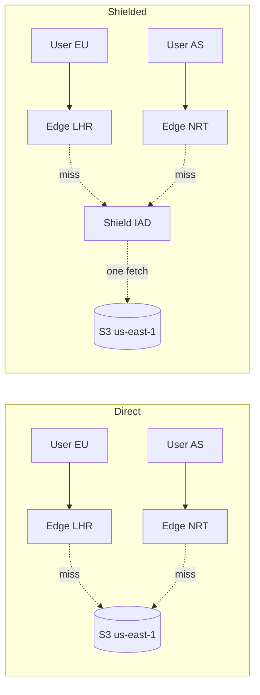

# Pastebin Deep Dive — Caching and CDN

**Date:** 2026-04-27 | **Updated:** 2026-04-27
**Tags:** `system-design` `case-study` `pastebin` `deep-dive` `caching` `cdn`
**Parent:** [`../design-pastebin.md`](../design-pastebin.md)

## Table of Contents

- [Summary](#summary)
- [Overview — Pastebin Is a CDN's Dream Workload](#overview--pastebins-dream-workload)
- [Cacheable Surfaces — Three TTLs, Three Audiences](#cacheable-surfaces--three-ttls-three-audiences)
- [Immutability + ID = Perfect CDN Candidate](#immutability--id--perfect-cdn-candidate)
- [CDN Strategy — Cache-Control, `immutable`, and Edge Behaviour](#cdn-strategy--cache-control-immutable-and-edge-behaviour)
- [Private and Password-Protected Pastes](#private-and-password-protected-pastes)
- [Invalidation on Delete and Expiry](#invalidation-on-delete-and-expiry)
- [Pre-Rendered HTML vs Client-Side Highlighting](#pre-rendered-html-vs-client-side-highlighting)
- [Range Requests for Huge Pastes](#range-requests-for-huge-pastes)
- [Edge-Side Compression — Brotli and Pre-Compressed Objects](#edge-side-compression--brotli-and-pre-compressed-objects)
- [Cache Key Strategy](#cache-key-strategy)
- [CDN Cost Model](#cdn-cost-model)
- [Stampede on Viral Pastes](#stampede-on-viral-pastes)
- [Write and Preview Bypass](#write-and-preview-bypass)
- [Multi-Region Topology — Origin Shield vs Direct Origin](#multi-region-topology--origin-shield-vs-direct-origin)
- [Anti-Patterns](#anti-patterns)
- [Related](#related)
- [References](#references)

## Summary

The parent case study at [`../design-pastebin.md`](../design-pastebin.md) treats CDN caching as a single sub-section, which hides most of the operational reality. A Pastebin clone is a **read-amplified, immutable-content** workload — almost the platonic ideal of what a CDN was built for. But the "free" cacheability has sharp edges: password-protected pastes that must never land at the wrong key, viral hits that need stampede protection, large pastes that demand byte-range support, expired or DMCA-removed content that has to disappear from hundreds of edges in seconds, and the SSR-vs-CSR highlighting trade-off.

Where the URL Shortener cache deep dive at [`../url-shortener/cache-strategy.md`](../url-shortener/cache-strategy.md) deals with **tiny, mutable redirect mappings**, Pastebin caches **immutable blobs of text** (KB to MB), often pre-rendered. The shared playbook — single-flight, jitter, pre-warm, surrogate-key purge — applies; the constraints differ enough to warrant their own treatment. This doc is the Pastebin-specific application of [`../../../building-blocks/caching-layers.md`](../../../building-blocks/caching-layers.md).

The single most important insight: **immutability + a content-addressable ID makes paste content the highest-leverage CDN target you can have**. Use `Cache-Control: public, max-age=31536000, immutable`, get every read off origin forever, and spend engineering attention on the *exceptions* — private pastes, deletes, stampedes, oversized blobs.

## Overview — Pastebin's Dream Workload

Three properties make pastes uniquely cache-friendly:

1. **Immutability.** A paste's content is fixed at create time. Edits create a new paste with a new ID. The cache entry is correct from birth until expiry/deletion — no invalidation-on-update problem.
2. **ID-as-cache-key.** The URL is the natural cache key. No query strings to normalize, no per-user variation, no `Vary: Cookie`.
3. **Read amplification.** A viral paste can do 10K views in an hour and 0 edits ever. Reads-to-writes run 10:1 to 1000:1.

Working numbers from the parent's capacity estimation (1 M pastes/day, 10 reads per paste average, hot-paste tail follows Pareto):

```text
Total pastes (1y retention):    365 M × ~10 KB avg ≈ 3.65 TB raw
Average read amplification:     10× → 3.65 GB writes/day, 36.5 GB reads/day
Peak read RPS:                  ~5,000 (viral burst → 50,000)
Average paste size:             10 KB raw, ~3 KB Brotli, ~25 KB rendered HTML
Hot-paste working set (top 1%): ~3.6 M × 10 KB = ~36 GB
```

Consequences: the CDN can absorb essentially the entire read load (99% edge hit ratio is realistic, dropping origin to 50 RPS); egress cost is the dominant line item, and CDN pricing differs by 10× across providers (see [Cost Model](#cdn-cost-model)). For patterns this doc does *not* re-derive (single-flight, jitter, negative caching, observability), consult [`../url-shortener/cache-strategy.md`](../url-shortener/cache-strategy.md).

## Cacheable Surfaces — Three TTLs, Three Audiences

Pastebin serves at least three distinct response shapes, each with different cacheability:

| Surface | Path | TTL | Cache-Control | Notes |
|---|---|---|---|---|
| Raw paste content | `/raw/{id}` | 1 year | `public, max-age=31536000, immutable` | Immutable; safe forever |
| Rendered HTML view | `/{id}` (server-rendered) | 1 year | `public, max-age=31536000, immutable` | Includes syntax-highlighted output; cacheable per `(id, theme)` |
| Metadata (expiry, owner, language) | `/api/paste/{id}/meta` | 5 minutes | `public, max-age=300, stale-while-revalidate=60` | Mutable: view counter, expiry can be revoked |
| Listing pages (user's pastes) | `/u/{user}` | 60 seconds | `private, max-age=60` | Per-user, mildly dynamic |
| Edit/preview endpoints | `POST /paste`, `/preview` | 0 | `no-store` | Never cache |

Three forces shape this table: content is immutable (very long TTL viable); metadata changes (view counts, soft-deletes — short TTL with SWR); per-user listings are private (never shared cache).

```http
# Raw paste content — the workhorse
HTTP/1.1 200 OK
Content-Type: text/plain; charset=utf-8
Cache-Control: public, max-age=31536000, immutable
ETag: "sha256-9df…"
Vary: Accept-Encoding
Content-Encoding: br

# Rendered HTML view — same TTL, ETag includes theme
HTTP/1.1 200 OK
Content-Type: text/html; charset=utf-8
Cache-Control: public, max-age=31536000, immutable
ETag: "sha256-9df…-monokai"

# Metadata — short TTL, SWR
HTTP/1.1 200 OK
Cache-Control: public, max-age=300, stale-while-revalidate=60

# User listing — private
HTTP/1.1 200 OK
Cache-Control: private, max-age=60
Vary: Cookie
```

The `immutable` directive is what makes a year-long TTL safe.

## Immutability + ID = Perfect CDN Candidate

A paste is born with a final state. From the cache's perspective:

- **Cache key is trivial.** Just the URL path. No query-string normalization (nobody appends UTM to a raw paste link), no `Vary` headaches.
- **Cache value is bit-exact.** Same `(id, theme)` always produces the same body. The `ETag` is the SHA-256 of canonical bytes — conditional revalidation is free.
- **No invalidate-on-write race.** The dual-write hazard from [`../../../building-blocks/caching-layers.md`](../../../building-blocks/caching-layers.md) doesn't exist; pastes have no "write" after create. Only mutations are *delete* and *expiry*, handled by purge or by responding `410 Gone`.
- **Browser cache becomes useful.** Unlike URL shorteners (where 302 + `no-store` preserves analytics), paste view counts are best-effort and you don't need every hit to reach origin.

Result: Pastebin clones can run a **two-layer cache** (CDN + origin S3) and skip the Redis/in-proc tier a shortener needs. CDN absorbs everything; on miss, one S3 GET resolves the request.

## CDN Strategy — Cache-Control, `immutable`, and Edge Behaviour

The hero header for raw paste content:

```http
Cache-Control: public, max-age=31536000, immutable
```

- `public` — opt into shared caches (CDN, corporate proxy). Without it, conservative caches treat responses as private.
- `max-age=31536000` — one year, the de facto "forever" max-age.
- `immutable` — body will never change for this URL; do not revalidate on reload (no `If-None-Match` even on F5). Defined by [RFC 8246](https://www.rfc-editor.org/rfc/rfc8246.html). Without it, Firefox and Safari issue a conditional GET on every refresh; even a 304 round-trip costs ~50 ms.

### Cloudflare cache rule

In Cloudflare's cache-rules language:

```text
# Cache rule for /raw/* and /{id}/raw
when: http.request.uri.path matches "^/(raw/|)[A-Za-z0-9]{6,12}(/raw)?$"
do:
  cache: eligible
  edge_ttl:
    mode: override_origin
    default: 31536000
  browser_ttl:
    mode: respect_origin
  cache_key:
    custom_key:
      query_string:
        include: []          # strip everything
      header:
        include: []
      cookie:
        include: []
  serve_stale:
    disable: false           # serve stale on origin error
  origin_error_page_pass_through: false
```

Cache by `host + path` only, 1y edge TTL, serve stale on origin failure.

### Fastly VCL snippet

Fastly's VCL is more explicit; here is a `vcl_recv` + `vcl_fetch` pair that handles raw and rendered pastes:

```vcl
sub vcl_recv {
  # Strip noisy query strings — pastes are not parameterized
  set req.url = querystring.remove(req.url);

  # Bypass cache for write/preview endpoints
  if (req.url ~ "^/(api/paste|preview)" || req.method != "GET" && req.method != "HEAD") {
    return(pass);
  }

  # Bypass for private/password-protected paths (signaled by header set at edge auth)
  if (req.http.X-Paste-Visibility == "private") {
    return(pass);
  }

  return(lookup);
}

sub vcl_fetch {
  if (beresp.status == 200 && req.url ~ "^/(raw/)?[A-Za-z0-9]{6,12}") {
    # Long TTL for immutable paste content
    set beresp.ttl = 1y;
    set beresp.http.Cache-Control = "public, max-age=31536000, immutable";
    # Surrogate key for selective purge on delete/DMCA
    set beresp.http.Surrogate-Key = "paste-" + regsub(req.url, "^/(raw/)?", "");
  }

  # Negative cache: 410 Gone (deleted/expired) for 60s — see Invalidation
  if (beresp.status == 410) {
    set beresp.ttl = 60s;
  }

  return(deliver);
}
```

The `Surrogate-Key` header is the lifeline for invalidation. One purge call (`PURGE /service/{id}/purge/paste-{id}`) drops the object from every PoP in seconds. See [Fastly's surrogate-key docs](https://www.fastly.com/documentation/reference/http/http-headers/Surrogate-Key/).

### CloudFront behaviour config

For CloudFront, the equivalent is a Cache Policy + a Behavior:

```jsonc
// Cache policy
{
  "Name": "PastebinImmutable",
  "DefaultTTL": 31536000,
  "MaxTTL": 31536000,
  "MinTTL": 0,
  "ParametersInCacheKeyAndForwardedToOrigin": {
    "EnableAcceptEncodingBrotli": true,
    "EnableAcceptEncodingGzip": true,
    "QueryStringsConfig": { "QueryStringBehavior": "none" },
    "HeadersConfig":      { "HeaderBehavior": "none" },
    "CookiesConfig":      { "CookieBehavior": "none" }
  }
}

// Behavior on the distribution
{
  "PathPattern": "/raw/*",
  "ViewerProtocolPolicy": "redirect-to-https",
  "AllowedMethods": ["GET", "HEAD"],
  "CachePolicyId": "<id-of-PastebinImmutable>",
  "OriginRequestPolicyId": "<all-viewer-except-host>",
  "Compress": true                    // CloudFront does Brotli/gzip on the fly
}
```

Per the [CloudFront cache key docs](https://docs.aws.amazon.com/AmazonCloudFront/latest/DeveloperGuide/controlling-the-cache-key.html), keeping query strings, headers, and cookies all to "none" maximizes hit ratio.

## Private and Password-Protected Pastes

Three flavours of "private":

1. **Unlisted** — anyone with the URL reads; not in listings. Cacheable as public; the URL is the secret.
2. **Private** — owner only, via session cookie. **Must not** sit in shared caches.
3. **Password-protected** — anyone with `(URL, password)` reads.

### The naive failure

```http
# DO NOT DO THIS — if the CDN caches this, anyone hitting the URL
# gets the decrypted body without supplying a password.
HTTP/1.1 200 OK
Cache-Control: public, max-age=31536000, immutable
[decrypted body]
```

A single edge cache poisoning leaks the paste. The password in a body/query is **not** automatically part of the cache key.

### The correct headers

```http
# Private (owner-only)
Cache-Control: private, no-store
Vary: Cookie

# Password-protected (after server-side password check)
Cache-Control: private, no-store
```

Layered defenses: `private` forbids shared caches; `no-store` blocks even browser disk cache (matters on shared workstations); CDN bypass at the edge based on visibility flag (the Fastly VCL above checks `X-Paste-Visibility`).

### Per-viewer caching for password pastes

To preserve some edge caching, derive a viewer-scoped key: `cache_key = sha256(paste_id || password)`, then `Vary: X-Paste-Token`. JS sets the token after the user enters the password. Cost: cache fragmentation (one entry per viewer) and operational complexity. **In practice, just bypass the CDN for password pastes** — the privacy risk of getting the key wrong dwarfs the latency savings. PrivateBin sidesteps this entirely with client-side decryption: the server (and CDN) only see ciphertext.

### The password-cache-leak problem

Failure mode: a developer adds `?p=hunter2` "just for testing". The CDN (correctly configured to ignore query strings on the public path) caches the *decrypted body* under the bare URL and serves it to everyone forever. Defenses: never put passwords in URLs (always POST body); match `/private/*` and `/locked/*` paths in CDN config to force `private, no-store`; test with two browsers — enter password in one, GET anonymously in another, expect 401.

## Invalidation on Delete and Expiry

Three legitimate cases where a paste's response changes despite immutability: user/DMCA delete, TTL expiry, password rotation. Every CDN edge that cached the 200 keeps serving it until purged or TTL'd out.

### Purge API calls

```bash
# Cloudflare — purge by URL
curl -X POST "https://api.cloudflare.com/client/v4/zones/$ZONE/purge_cache" \
  -H "Authorization: Bearer $TOKEN" \
  --data '{"files":["https://pastebin.example.com/raw/4kZ2nQpX",
                    "https://pastebin.example.com/4kZ2nQpX"]}'

# Fastly — purge by surrogate key (preferred; one call, all variants)
curl -X POST "https://api.fastly.com/service/$SERVICE/purge/paste-4kZ2nQpX" \
  -H "Fastly-Key: $TOKEN"

# CloudFront — path invalidation
aws cloudfront create-invalidation --distribution-id $DIST \
  --paths "/raw/4kZ2nQpX" "/4kZ2nQpX"
```

Surrogate-key purge (Fastly) drops every URL tagged `paste-{id}` (raw, rendered, multiple themes) in one call across every PoP. Cloudflare's equivalent is **Cache-Tags** (Enterprise).

### Soft-delete tombstones and `410 Gone`

Soft-delete (`deleted_at = now()`) for audit and DMCA. Origin returns:

```http
HTTP/1.1 410 Gone
Cache-Control: public, max-age=60

This paste was deleted.
```

`410` (intentionally gone) beats `404` (unknown) — search engines de-index immediately, crawlers stop probing. The 60-second TTL is negative caching for post-deletion traffic. If the paste is later re-created with the same custom alias, purge the `410` first.

### Race window between sweeper and CDN

```text
t=0:00:00  paste expires
t=0:00:42  sweeper marks deleted, issues CDN purge
t=0:00:43  edges drop the entry
```

Between 0:00:00 and 0:00:43, edges serve the 200. For most products this 43-second window is fine. For "burn after 1 hour" features, shorten TTL: `Cache-Control: public, max-age=300, must-revalidate` and return `410` once expired. Better mitigation: schedule the purge proactively at create time, since `expires_at` is known.

## Pre-Rendered HTML vs Client-Side Highlighting

Two implementations of "show the user a syntax-highlighted paste":

### Server-side rendering (SSR)

Use [Pygments](https://pygments.org/), [Chroma](https://github.com/alecthomas/chroma) (Go), or [highlight.js running in Node](https://highlightjs.org/) at request time:

```text
GET /4kZ2nQpX
  → origin: lookup raw bytes in S3
  → origin: detect language (or trust user-supplied)
  → origin: highlight → produce HTML with <span class="hljs-keyword">...</span>
  → origin: wrap in template, return
  → CDN caches under key "/4kZ2nQpX:theme=monokai"
```

| Aspect | SSR |
|---|---|
| First paint | Fast — HTML arrives ready to display |
| Origin CPU | High — Pygments at ~1 KB/ms; a 100 KB paste is 100 ms CPU |
| Cache entries per paste | One per `(id, theme)` combo; ~3 themes × 1 paste = 3 entries |
| JS payload to client | None for the highlighter |
| Re-theme without re-fetch | No — different theme is a different cache key |

Rendered HTML is immutable per `(id, theme)`, so it caches as well as raw. The render happens once per `(id, theme)` per edge. At 99% hit ratio and 3 themes, 5,000 RPS turns into ~150 highlighter runs/sec at origin worst case.

### Client-side rendering (CSR)

Ship raw text + a JS library ([Prism](https://prismjs.com/), [highlight.js](https://highlightjs.org/), [Shiki](https://shiki.matsu.io/)):

```text
GET /4kZ2nQpX
  → CDN: returns minimal HTML shell + <pre>{raw}</pre> + <script src=prism.js>
  → browser: prism.js runs, walks the <pre>, applies <span> tokens
```

| Aspect | CSR |
|---|---|
| First paint | Slower — flash of unstyled content (FOUC) until JS runs |
| Origin CPU | Near-zero |
| Cache entries per paste | One (the raw shell) |
| JS payload to client | 50–300 KB highlighter |
| Re-theme without re-fetch | Yes — switch CSS class, instant |

### When to pick which

| Scenario | Pick |
|---|---|
| Public, anonymous, broad audience | SSR — first paint matters, CDN absorbs cost |
| Logged-in dev dashboard, repeated views | CSR — JS loads once, themable |
| Mobile-first, slow connections | SSR — JS payload hurts more than cached HTML |
| Large pastes (>500 KB) | CSR with virtualization — SSR'd HTML grows ~3× |
| Embeds in third-party blogs | SSR — embedders cannot guarantee JS execution |

Hybrid: SSR first paint with default theme, then ship a small JS that swaps CSS variables for re-theme without re-fetching.

## Range Requests for Huge Pastes

Pastebin's parent doc allows pastes up to 10 MB. Loading 10 MB on a phone is rude. Two strategies:

### S3 byte-range support

S3 supports `Range:` natively; CDNs (CloudFront, Cloudflare with Argo, Fastly) cache range responses. The viewer's pagination layer asks for a slice:

```bash
# Fetch bytes 0–99,999 of a 10 MB paste
curl -H "Range: bytes=0-99999" https://pastebin.example.com/raw/4kZ2nQpX
```

Response:

```http
HTTP/1.1 206 Partial Content
Content-Type: text/plain
Content-Range: bytes 0-99999/10485760
Content-Length: 100000
Cache-Control: public, max-age=31536000, immutable
```

CDN gotchas: CloudFront caches 206 only when origin returns 206 — configure origin to honour `Range`. Cloudflare caches full objects by default; for objects >512 MB (free) or >5 GB (enterprise) see [Cache Large Files](https://developers.cloudflare.com/cache/concepts/cache-large-files/). Fastly needs `streaming_miss` for range caching.

### Viewer pagination

Encode page in path (avoiding query strings):

```text
/raw/4kZ2nQpX/p/0   → bytes 0..49999
/raw/4kZ2nQpX/p/1   → bytes 50000..99999
```

Each page is its own immutable cache entry. SSR'd HTML pagination is harder — the highlighter needs context (multi-line strings) — so either render once and stream via HTTP/2, or restrict pagination to the raw view.

## Edge-Side Compression — Brotli and Pre-Compressed Objects

Code compresses well. Typical Brotli ratios:

| Content | Raw | gzip | Brotli |
|---|---:|---:|---:|
| JavaScript source | 100 KB | 30 KB | 22 KB |
| Python source | 100 KB | 28 KB | 21 KB |
| JSON | 100 KB | 12 KB | 9 KB |

### CDN on-the-fly compression

CloudFront (`Compress: true`), Cloudflare (default for text/*), Fastly (Accept-Encoding aware) all compress on the fly. Fine for small responses; for large ones, edge CPU adds latency. CDNs use Brotli quality ~4–6, not 11.

### Pre-compressed objects in S3

Better: compress once at write time, store both encodings, let CDN pick:

```bash
# Compress the paste body to Brotli quality 11 (best ratio, slow but offline)
brotli -q 11 paste-4kZ2nQpX.txt -o paste-4kZ2nQpX.br

# Upload with Content-Encoding metadata
aws s3 cp paste-4kZ2nQpX.br s3://pastebin-content/4kZ2nQpX.br \
  --content-encoding br \
  --content-type "text/plain; charset=utf-8" \
  --cache-control "public, max-age=31536000, immutable" \
  --metadata-directive REPLACE
```

The origin worker (Lambda@Edge, Cloudflare Worker, Fastly Compute) selects the right object based on `Accept-Encoding`:

```javascript
// Cloudflare Worker — choose pre-compressed variant
export default {
  async fetch(req, env) {
    const id = new URL(req.url).pathname.split('/').pop();
    const ae = req.headers.get('Accept-Encoding') || '';

    let key, encoding;
    if (ae.includes('br')) { key = `${id}.br`; encoding = 'br'; }
    else if (ae.includes('gzip')) { key = `${id}.gz`; encoding = 'gzip'; }
    else { key = `${id}.txt`; encoding = null; }

    const obj = await env.PASTES.get(key);
    if (!obj) return new Response('Not found', { status: 404 });

    const headers = new Headers({
      'Content-Type': 'text/plain; charset=utf-8',
      'Cache-Control': 'public, max-age=31536000, immutable',
      'Vary': 'Accept-Encoding',
    });
    if (encoding) headers.set('Content-Encoding', encoding);
    return new Response(obj.body, { headers });
  }
};
```

Trade-offs: storage rises ~2.3× (raw + gzip + Brotli) — 3.65 TB → 8.4 TB → ~$193/mo at S3 standard, negligible vs egress savings. Write-time Brotli q=11 is ~100 ms for 100 KB, async-friendly. `Vary: Accept-Encoding` is **mandatory** — without it, a CDN can serve Brotli to a gzip-only client.

## Cache Key Strategy

**By ID alone (default).** `host + path`. Strip query strings entirely. No `Vary` other than `Accept-Encoding`. Maximum hit rate.

**By ID + tenant (multi-tenant SaaS).** Per-tenant subdomains: `acme.pastebin.example.com/raw/4kZ2nQpX` vs `globex.pastebin.example.com/raw/4kZ2nQpX`. Cache key already includes Host on CloudFront/Cloudflare/Fastly; verify on shared distributions.

**Separate caches for raw vs HTML.** Path differentiates:

```text
/raw/4kZ2nQpX        → text/plain
/4kZ2nQpX            → SSR'd HTML (default theme)
/4kZ2nQpX/m          → SSR'd, monokai theme (avoid query strings)
/4kZ2nQpX/embed      → iframe HTML
```

Each is a distinct entry. Tag all with surrogate key `paste-4kZ2nQpX` so one purge drops all variants.

**Cardinality killers.** Tracking params (`?ref=hn`, `?utm_source=...`) — strip. Locale in query — move to path or deliberately `Vary` on a normalized header. Per-user cookies on public paths — `Vary: Cookie` on `/raw/*` is a hit-ratio disaster; audit `Vary` headers in CDN logs.

## CDN Cost Model

Three lines: egress bandwidth, request count, purge/invalidation. Sample workload: 5,000 RPS, 3 KB Brotli response, 99% edge hit ratio = **~39 TB egress/month, ~13 B requests/month**.

| Provider | Egress | Requests | Purge | Estimate |
|---|---|---|---|---|
| **Cloudflare** Free→Business | Unmetered | Unmetered | URL purge unmetered; tag-purge on Enterprise | $0–$250/mo flat |
| **Fastly** | ~$0.12/GB (first 10 TB), volume discount | ~$0.0075/10K | Surrogate-Key free | ~$13K/mo |
| **CloudFront** US/EU | $0.085/GB first 10 TB | $0.01/10K | First 1K/mo free, then $0.005/path | ~$16K/mo |

Cloudflare's unmetered-egress pricing is the killer feature for egress-dominant Pastebin workloads. **Cloudflare wins by 50–100×** at this scale. Fastly and CloudFront pay off when you need their specific features (full VCL, AWS-native integration). Most Pastebin-style products run on Cloudflare for cost alone, and on the free tier in their early days. See [Fastly pricing](https://www.fastly.com/pricing/) and [CloudFront pricing](https://aws.amazon.com/cloudfront/pricing/).

## Stampede on Viral Pastes

HN front page → 5,000 RPS on one ID. Without single-flight, the first cold-edge miss is followed by 500 concurrent origin GETs. The patterns from [`../url-shortener/cache-strategy.md#thundering-herd--cache-stampede`](../url-shortener/cache-strategy.md#thundering-herd--cache-stampede) apply; Pastebin specifics:

### Origin shielding

Every edge miss routes through one designated PoP, which collapses concurrent misses into one origin request:

- Cloudflare: **Tiered Cache** (auto on Pro+), **Cache Reserve** (Business+).
- Fastly: **Origin Shielding** in service config.
- CloudFront: **Origin Shield**; pin to the AWS region of S3.

Without shielding, 50 PoPs issue 50 origin GETs. With it, one.

### Single-flight at origin

Even with shielding, multiple origin workers may exist. Single-flight inside each:

```go
import "golang.org/x/sync/singleflight"

type PasteOrigin struct {
    s3 S3Client
    sf singleflight.Group
}

func (p *PasteOrigin) Get(ctx context.Context, id string) ([]byte, error) {
    v, err, _ := p.sf.Do(id, func() (any, error) {
        // Concurrent calls for same id collapse to one S3 GET
        return p.s3.GetObject(ctx, "pastebin-content", id+".br")
    })
    if err != nil {
        return nil, err
    }
    return v.([]byte), nil
}
```

### Pre-warm and jitter

For pastes flagged "may go viral" (admin tag, large initial spike), prefetch from each PoP region. Mass-creates (CI bots dumping 1000 build logs with 24h TTL) need ±10% TTL jitter to avoid synchronized expiry, same as URL Shortener.

## Write and Preview Bypass

Three endpoints must bypass cache: `POST /api/paste`, `POST /api/paste/preview`, `DELETE /api/paste/{id}`. All return `Cache-Control: no-store`.

```http
HTTP/1.1 201 Created
Cache-Control: no-store
{"id": "4kZ2nQpX", "url": "..."}
```

`no-store` (not just `no-cache`) — neither browser nor CDN keeps. Belt-and-braces: configure the CDN to bypass these paths explicitly:

```text
# Cloudflare cache rule
when: http.request.uri.path matches "^/(api/paste|preview)" or http.request.method != "GET"
do:  cache: bypass
```

Explicit bypass on top of `no-store` covers misbehaving clients or buggy servers that return cacheable headers on a write response.

The preview endpoint runs the expensive highlighter on the edit path. At low edit RPS this is fine; if preview RPS climbs, **debounce client-side** (POST only after 300 ms of no typing) rather than caching previews — caching leaks edit-state.

## Multi-Region Topology — Origin Shield vs Direct Origin

Two topologies:



Direct: 50 PoPs each miss = 50 S3 GETs and 50× cross-region egress. Shielded: 1 S3 GET. Place the shield PoP **co-located with origin** (shield IAD if S3 is `us-east-1`).

**Multi-region origin** (S3 CRR or multiple clusters): EU → eu-west-1, AS → ap-northeast-1. Trade-off: CRR lag (~15 min p99) vs same-region latency (20 ms vs 50–200 ms cross-Atlantic). Pastes are immutable so lag is harmless after the first 15 min. Purge invalidation must fan out to all regions (Kafka topic or per-region purge calls).

Most clones ship **single-region S3 + origin shield**. Multi-region pays off only with global write patterns and tight latency SLOs.

## Anti-Patterns

- **Caching `private` pastes at the CDN.** `public, max-age=...` on a single-user paste leaks it. Always set `private, no-store` for non-public visibility.
- **Passwords in query strings.** `?p=hunter2` ends up in access logs and possibly cache keys. Always `POST` body.
- **Forgetting `Vary: Accept-Encoding` on pre-compressed objects.** A Brotli body served to a gzip-only client is garbage.
- **Hard-deleting.** No DMCA audit trail, no `410 Gone`. Soft-delete with `deleted_at`.
- **Trusting TTL for takedown.** "Will expire in 364 days" is not a takedown. Always purge by surrogate key.
- **`max-age=31536000` without `immutable`.** Browsers still issue conditional GETs on F5. Free latency lost.
- **Ignoring `Vary` discipline.** `Vary: Cookie` on a public path = one entry per session cookie. Restrict `Vary` to `Accept-Encoding` for public pastes.
- **Pre-rendering many themes server-side.** N themes × M pastes = N×M entries. Pick one default for SSR; client-side re-theme for the rest.
- **Caching `is_deleted` separately from body.** Many implementations cache `body` and DB-check `is_deleted` on every read, defeating the cache. Cache the *response decision*.
- **Forgetting to strip tracking params.** `?ref=hn`, `?utm_source=twitter` blow up cache cardinality.
- **One CDN zone for cache, auth, and rate limiting.** A worker bug on the auth path takes down reads. Separate workers, or fail-open on auth for public paths.
- **Synchronous `brotli -q 11` on the request path.** ~100 ms for KB inputs. Compress async at write time.

## Related

- Parent case study: [`../design-pastebin.md`](../design-pastebin.md)
- Caching layers theory: [`../../../building-blocks/caching-layers.md`](../../../building-blocks/caching-layers.md)
- URL Shortener cache strategy (sibling case study, shared patterns): [`../url-shortener/cache-strategy.md`](../url-shortener/cache-strategy.md)
- CDN and edge networking: [`../../../../networking/infrastructure/cdn-and-edge.md`](../../../../networking/infrastructure/cdn-and-edge.md)
- HTTP evolution and caching headers: [`../../../../networking/application-layer/http-evolution.md`](../../../../networking/application-layer/http-evolution.md)
- Read/write splitting and cache strategies: [`../../../scalability/read-write-splitting-and-cache-strategies.md`](../../../scalability/read-write-splitting-and-cache-strategies.md)

## References

- [RFC 8246 — HTTP Immutable Responses](https://www.rfc-editor.org/rfc/rfc8246.html) — defines `Cache-Control: immutable`; the directive that tells browsers not to revalidate on reload.
- [RFC 9111 — HTTP Caching](https://www.rfc-editor.org/rfc/rfc9111.html) — current HTTP caching specification (obsoletes RFC 7234); covers `Cache-Control`, `Vary`, conditional requests, and shared-cache semantics.
- [RFC 5861 — HTTP `stale-while-revalidate` and `stale-if-error`](https://datatracker.ietf.org/doc/html/rfc5861) — the SWR directive used for metadata responses and resilience.
- [MDN — `Cache-Control`](https://developer.mozilla.org/en-US/docs/Web/HTTP/Headers/Cache-Control) — practical reference for every directive with browser support tables.
- [Cloudflare Cache Documentation](https://developers.cloudflare.com/cache/) — cache rules, tiered caching, cache reserve, Argo, purge APIs, and large-object handling.
- [Fastly Surrogate-Key documentation](https://www.fastly.com/documentation/reference/http/http-headers/Surrogate-Key/) — tag-based purge model and VCL integration; the gold standard for selective invalidation.
- [Fastly VCL Reference](https://www.fastly.com/documentation/reference/vcl/) — full VCL language for `vcl_recv`, `vcl_fetch`, `vcl_deliver` customization at the edge.
- [AWS CloudFront Developer Guide — Cache Key and Origin Requests](https://docs.aws.amazon.com/AmazonCloudFront/latest/DeveloperGuide/controlling-the-cache-key.html) — cache policies, origin request policies, query string and header handling.
- [AWS CloudFront — Origin Shield](https://docs.aws.amazon.com/AmazonCloudFront/latest/DeveloperGuide/origin-shield.html) — co-locating a shield PoP with origin to collapse cross-region misses.
- [Brotli Compressed Data Format (RFC 7932)](https://www.rfc-editor.org/rfc/rfc7932.html) — the Brotli compression specification; ratios and quality levels.
