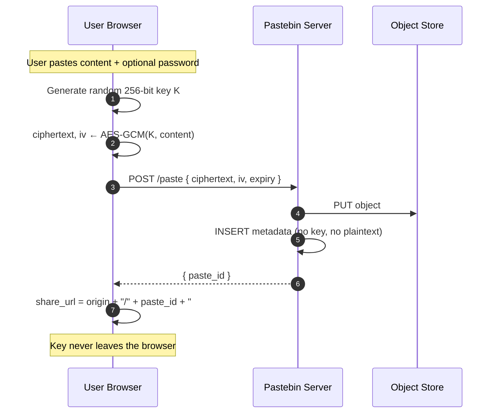

# Pastebin Deep Dive — Optional Features

**Date:** 2026-04-27 | **Updated:** 2026-04-27
**Tags:** `system-design` `case-study` `pastebin` `deep-dive` `encryption` `syntax-highlighting`

## Table of Contents

- [Summary](#summary)
- [Overview](#overview)
- [Password-Protected Pastes](#password-protected-pastes)
  - [Where the Password Lives](#where-the-password-lives)
  - [Key Derivation: Argon2id, scrypt, PBKDF2](#key-derivation-argon2id-scrypt-pbkdf2)
  - [The URL-Fragment Trick](#the-url-fragment-trick)
- [Server-Side Envelope Encryption](#server-side-envelope-encryption)
- [Client-Side (Zero-Knowledge) Encryption](#client-side-zero-knowledge-encryption)
- [Access Logs & Audit](#access-logs--audit)
  - [What to Log, What to Hash, What to Drop](#what-to-log-what-to-hash-what-to-drop)
  - [Aggregated Counts vs Raw Events](#aggregated-counts-vs-raw-events)
  - [GDPR-Compliant Retention](#gdpr-compliant-retention)
- [Syntax Highlighting](#syntax-highlighting)
  - [Server-Side vs Client-Side](#server-side-vs-client-side)
  - [Cacheability Impact](#cacheability-impact)
  - [Language Detection](#language-detection)
- [Diff & Revisions](#diff--revisions)
- [Embeds & oEmbed](#embeds--oembed)
- [API Access](#api-access)
- [Burn-After-Reading](#burn-after-reading)
- [Forking & Remixing](#forking--remixing)
- [Search](#search)
- [Webhooks](#webhooks)
- [Accessibility](#accessibility)
- [Anti-Patterns](#anti-patterns)
- [Related](#related)
- [References](#references)

## Summary

The Pastebin core spec — create, read, expire — is solved with random IDs, object storage, and a small metadata DB. The optional surface area is where the design choices get interesting and where most teams ship something that looks fine until the threat model, the GDPR auditor, or a CDN-cached burn-after-reading paste says otherwise. This deep dive expands the parent case study's "Optional Features" subsection into the design rationale behind each: **password protection** is really a key-management question (does the server hold the key, or is it a fragment of the URL the server never sees?); **access logs** are a privacy minefield where IP retention and GDPR retention windows matter more than the schema; **syntax highlighting** is a caching question (server-render once, cache forever, vs ship JS to every viewer); **burn-after-reading** is the most subtle of all because a single CDN cache hit defeats the entire mechanic. The pattern across all of them is: be explicit about which actor sees the plaintext, what the cache key is, and what the retention window says.

## Overview

The parent doc, [design-pastebin.md](../design-pastebin.md), enumerates these features in the "Optional Features — Passwords, Access Logs, Syntax Highlighting" subsection but stops short of the implementation depth a real design review would demand. Here we go layer by layer:

- For **passwords**, the key question is the trust boundary. Server-side encryption gets you rendering and search; client-side (zero-knowledge) gets you forensic resistance and is what PrivateBin and similar tools actually ship. The URL-fragment trick — putting the key after a `#` — is the load-bearing piece because the browser never sends the fragment to the server.
- For **access logs**, the schema is trivial; the retention policy and PII handling are not. Hashed IPs with a per-tenant salt are a defensible default; storing raw IPs forever is not.
- For **syntax highlighting**, the choice between server-side (Pygments, Chroma) and client-side (Prism, highlight.js, Shiki) is a cache-locality decision wearing a UX disguise.
- For **burn-after-reading**, the atomic decrement on the metadata row is the easy part. The hard part is making sure the CDN doesn't serve a cached copy after the burn. Cache key hygiene is everything.
- For everything else (forks, search, webhooks, oEmbed, accessibility), the patterns are well-established but tend to get cargo-culted from the wrong reference implementations.

The cross-cutting principles:

1. **Be explicit about who sees the plaintext.** Document this on the paste-creation page so users know what they're signing up for.
2. **Cache keys must encode every variable that affects the response.** Password, theme, language, viewer auth state. Get this wrong once and you have a confidentiality bug.
3. **Retention policies are part of the design.** A feature that captures viewer IPs without a documented retention policy is a GDPR Article 5 violation waiting to happen.

## Password-Protected Pastes

### Where the Password Lives

There are three meaningfully different designs and they have very different threat models:

| Design | Server holds | Server can read content? | Recoverable on lost password? | Searchable? |
|--------|--------------|--------------------------|-------------------------------|-------------|
| **Server-side encryption with password-derived KEK** | Wrapped DEK, salted password hash for verification | Only when the user presents the password (or if the operator coerces the user) | No (key derived from password) | No (ciphertext at rest) |
| **Server-side encryption with KMS-managed KEK + password as gate** | DEK, KMS-wrapped; password is just an access-control check | **Yes — operator with KMS access can read** | Yes (operator can re-grant access) | Possibly (operator-side decrypt) |
| **Client-side (zero-knowledge) encryption** | Ciphertext only. Key never reaches server. | **No, ever** | No (key is in URL fragment, lose it = lose data) | No |

The first design is what most "password-protected" features ship. It feels secure ("the server doesn't have the password") but the threat boundary is narrower than people think — a coerced or compromised server with the wrapped DEK and a guess at the password can still attempt offline cracking, which is why **the KDF choice matters**.

The third design is what privacy-first products like [PrivateBin](https://github.com/PrivateBin/PrivateBin) ship. It's strictly stronger but trades away server-side rendering, full-text search, and password recovery.

### Key Derivation: Argon2id, scrypt, PBKDF2

Passwords are low-entropy. A 10-character password is maybe 50–60 bits of entropy on a generous estimate. To resist offline cracking on the wrapped DEK, you must use a **memory-hard** KDF that makes parallel GPU/ASIC attacks expensive.

The hierarchy in 2026, per the [OWASP Password Storage Cheat Sheet](https://cheatsheetseries.owasp.org/cheatsheets/Password_Storage_Cheat_Sheet.html):

1. **Argon2id** — winner of the 2015 Password Hashing Competition, standardized in [RFC 9106](https://www.rfc-editor.org/rfc/rfc9106.html). Memory-hard, side-channel resistant. **Default choice.**
2. **scrypt** — older, also memory-hard, well-understood. Acceptable.
3. **bcrypt** — fine for password verification, but its memory profile is fixed and weak vs modern GPUs. Acceptable for legacy systems.
4. **PBKDF2-HMAC-SHA256** — not memory-hard. Acceptable only when FIPS 140 compliance forces your hand. Use ≥600,000 iterations per OWASP guidance.

```python
# Argon2id key derivation from a paste password
# Reference: RFC 9106 (https://www.rfc-editor.org/rfc/rfc9106.html)
from argon2.low_level import hash_secret_raw, Type
import os, secrets

def derive_paste_key(password: str, salt: bytes | None = None) -> tuple[bytes, bytes]:
    """
    Derive a 32-byte key from a paste password using Argon2id.

    OWASP 2026 minimum parameters:
      - memory_cost = 19 MiB (19456 KiB)
      - time_cost   = 2 iterations
      - parallelism = 1 lane

    For an interactive paste-unlock flow target ~250-500ms on commodity
    hardware. Tune up, never down. Store (salt, params) on the paste row;
    they are not secret.
    """
    if salt is None:
        salt = secrets.token_bytes(16)  # 128-bit salt, per RFC 9106 §3.1
    key = hash_secret_raw(
        secret=password.encode("utf-8"),
        salt=salt,
        time_cost=2,
        memory_cost=19_456,    # KiB
        parallelism=1,
        hash_len=32,           # 256-bit key for AES-256
        type=Type.ID,          # Argon2id — hybrid mode
    )
    return key, salt
```

Three things that go wrong with this in production:

- **Storing the password hash and the wrapped DEK with the same salt.** Use independent salts; never let the verification hash also be the KEK.
- **Forgetting to update the cost parameters as hardware improves.** Re-wrap on next successful unlock if the params on the row are below current minimum. Same pattern as bcrypt cost rotation.
- **Logging the password.** It happens. Add a redaction filter at the access-log layer that drops anything matching the password param name. See [Access Logs & Audit](#access-logs--audit) below.

### The URL-Fragment Trick

The single most important property of client-side encryption for pastes: **the browser never sends the URL fragment (`#...`) to the server**. The fragment is purely client-side state.

This means a URL like:

```
https://paste.example.com/aZ3kQ9pX#kY7vL2pQrS8nF1mTzXcVbN
```

…has `aZ3kQ9pX` as the paste ID (sent to server, used to look up ciphertext) and `kY7vL2pQrS8nF1mTzXcVbN` as the encryption key (stays in the browser, used to decrypt). The server logs only `/aZ3kQ9pX` — never the key. Even a wiretap inside the operator's TLS-terminating load balancer sees only the path, not the fragment.

This is the load-bearing trick behind PrivateBin, Hastebin's encrypted variants, and the "Firefox Send" model (now defunct but the design lives on). It's also what makes "send me a paste" linksecure-by-default in messaging apps that preserve fragments — and **insecure** in any system that strips, normalizes, or proxies URLs in a way that leaks the fragment to the server (URL preview bots, link unfurlers, malware scanners).

```html
<!--
  Client-side decrypt with key in URL fragment.
  Reference: https://github.com/PrivateBin/PrivateBin
  Uses WebCrypto AES-GCM. The key is base64url-encoded after the '#'.
-->
<script type="module">
  async function loadAndDecrypt(pasteId) {
    const fragment = window.location.hash.slice(1); // strip leading '#'
    if (!fragment) {
      throw new Error("missing decryption key in URL fragment");
    }
    const rawKey = base64UrlDecode(fragment);
    const key = await crypto.subtle.importKey(
      "raw", rawKey, { name: "AES-GCM" }, false, ["decrypt"]
    );

    // Server returns { iv, ciphertext } — both base64url
    const res = await fetch(`/api/paste/${pasteId}`);
    if (!res.ok) throw new Error(`fetch failed: ${res.status}`);
    const { iv, ciphertext } = await res.json();

    const plaintext = await crypto.subtle.decrypt(
      { name: "AES-GCM", iv: base64UrlDecode(iv) },
      key,
      base64UrlDecode(ciphertext),
    );
    return new TextDecoder().decode(plaintext);
  }

  function base64UrlDecode(s) {
    s = s.replace(/-/g, "+").replace(/_/g, "/");
    while (s.length % 4) s += "=";
    return Uint8Array.from(atob(s), c => c.charCodeAt(0));
  }
</script>
```

The encrypt path on paste creation is the mirror: generate a random 256-bit key, AES-GCM encrypt with a random 96-bit IV, POST `{ ciphertext, iv }` to the server, and append `#${base64UrlEncode(key)}` to the share URL after the server returns the paste ID.

## Server-Side Envelope Encryption

When the design calls for server-side encryption — usually because you want server-side rendering, search, or a way to revoke access without rotating every paste's URL — the right primitive is **envelope encryption**.

Two-layer key hierarchy:

- **DEK** (Data Encryption Key): a random 256-bit key per paste. Encrypts the content.
- **KEK** (Key Encryption Key): wraps the DEK. Lives in a KMS (AWS KMS, GCP KMS, Vault Transit, HSM) — never in application memory in plaintext for long.

For password-protected pastes, the KEK is **derived from the password** via Argon2id. The wrapped DEK is stored on the paste row. Decryption requires re-deriving the KEK from the user-supplied password.

```text
Create:
  DEK              ← random(32 bytes)
  iv               ← random(12 bytes)
  ciphertext       ← AES-256-GCM(DEK, iv, plaintext)
  KEK, salt        ← Argon2id(password, salt=random)
  wrapped_DEK, w_iv← AES-256-GCM(KEK, w_iv=random, DEK)
  store {paste_id, ciphertext, iv, wrapped_DEK, w_iv, salt, kdf_params}
  zero(DEK); zero(KEK); zero(plaintext)

Read:
  load {ciphertext, iv, wrapped_DEK, w_iv, salt, kdf_params}
  KEK              ← Argon2id(user_password, salt, kdf_params)
  DEK              ← AES-256-GCM⁻¹(KEK, w_iv, wrapped_DEK)
  plaintext        ← AES-256-GCM⁻¹(DEK, iv, ciphertext)
  zero(DEK); zero(KEK)

Delete:
  destroy(wrapped_DEK)   ← cryptographic erasure: ciphertext is now garbage
```

The win of envelope encryption isn't performance (though it helps — you only do an expensive KMS call per paste, not per byte). The win is **paste-level cryptographic erasure**: deleting a paste means destroying the wrapped DEK. The ciphertext can remain in object storage, in backups, in CDN caches, in S3 cross-region replication targets — none of it matters because the key to read it is gone. This is the only deletion model that survives "we forgot to purge the backup tape" in a forensic audit.

When the KEK is in a KMS rather than password-derived, you get **operator-managed encryption**: the KMS holds the master key, IAM gates which services can call `Decrypt`, and you get an audit trail of every decrypt for free. This is the pattern S3 SSE-KMS, Azure Storage Service Encryption, and GCP CMEK all implement. Cross-link: see [encryption-at-rest-and-in-transit.md](../../../security/encryption-at-rest-and-in-transit.md) for the full envelope pattern.

## Client-Side (Zero-Knowledge) Encryption

The strictly stronger design. The browser does everything; the server stores opaque blobs.



Properties:

- **Server can prove non-knowledge.** Subpoena delivers ciphertext only. This is the model PrivateBin documents under "Privacy" in their [README](https://github.com/PrivateBin/PrivateBin/blob/master/README.md).
- **Lost key = lost data.** No password reset. No "forgot password" link. The UX must make this brutally clear.
- **No server-side search.** You ship a search index over titles only, or no search at all.
- **No server-side syntax highlighting.** Highlighting happens client-side after decrypt.
- **CDN can still cache.** Ciphertext is content-addressable; an immutable cache works fine.

The accessibility footnote here matters: for screen-reader users, the decryption flow must announce "decrypting paste" and "paste decrypted" via `aria-live="polite"` regions. Otherwise the user hears nothing happen for a half-second and assumes the page is broken.

## Access Logs & Audit

### What to Log, What to Hash, What to Drop

A defensible access-log row for a paste view:

```sql
CREATE TABLE paste_access_log (
    id              BIGSERIAL PRIMARY KEY,
    paste_id        TEXT NOT NULL,
    viewed_at       TIMESTAMPTZ NOT NULL DEFAULT now(),
    viewer_ip_hash  BYTEA NOT NULL,        -- HMAC-SHA256(daily_salt, ip)
    user_agent_class TEXT,                  -- 'browser' | 'curl' | 'bot' | 'unknown'
    geo_country     CHAR(2),                -- ISO-3166 alpha-2, no city granularity
    referrer_host   TEXT,                   -- host only, never full URL
    auth_user_id    BIGINT REFERENCES users(id) -- NULL for anonymous
);

CREATE INDEX ON paste_access_log (paste_id, viewed_at DESC);
CREATE INDEX ON paste_access_log (viewed_at);  -- for retention sweeper
```

What's deliberately **not** in this row:

- Raw IP. Hashed with a daily-rotated salt so the hashes don't function as long-term identifiers across days.
- Full referrer URL. The host is enough for analytics; the path may contain tokens or sensitive identifiers.
- User-Agent string verbatim. UA strings have been used for browser fingerprinting; bucketing into classes (`'browser'`, `'curl'`, `'bot'`) keeps utility while reducing fingerprint surface.
- Cookies, headers, request body. None of these belong in an access log.

The daily salt rotation means: today's hash of `1.2.3.4` is different from tomorrow's hash of `1.2.3.4`. You can still count "how many distinct viewers today" but you can't link the same viewer across weeks. This is the standard pattern from privacy-respecting analytics (Plausible, Fathom).

### Aggregated Counts vs Raw Events

For the "this paste has been viewed N times" badge, you don't need the raw event log. A Redis counter is enough:

```text
INCR pastes:aZ3kQ9pX:views
EXPIRE pastes:aZ3kQ9pX:views 86400  # roll into DB nightly
```

The pattern from the URL shortener click-analytics pipeline applies directly here — see [click-analytics-pipeline.md](../url-shortener/click-analytics-pipeline.md) for the full Kafka → ClickHouse fan-out shape. For pastebin, the volumes are smaller (most pastes get one view, then zero) so a simpler Redis-counter + nightly batch insert into a wide-format aggregate table is usually enough.

The two-tier split:

- **Hot path (Redis):** counters, last-viewed-at, anti-abuse rate signals. Sub-millisecond.
- **Cold path (analytics DB):** raw events for forensic audit, retention enforcement, abuse investigation. Append-only, partitioned by date.

### GDPR-Compliant Retention

Article 5(1)(e) of the GDPR — storage limitation. Personal data must be kept "no longer than is necessary for the purposes for which the personal data are processed."

Defensible defaults:

| Data | Retention | Justification |
|------|-----------|---------------|
| Hashed IPs in access log | 30 days | Sufficient for abuse investigation; documented purpose |
| Aggregated counts | Indefinite | Not personal data once aggregated below k-anonymity threshold (k≥5) |
| Auth user ID + paste view | 90 days, then disassociate from paste_id | User can request "what pastes have I viewed" within a reasonable window |
| Full event stream (raw) | 7 days, then aggregate-and-drop | Hot debugging window; nothing operationally needs more |

The retention sweeper is a daily cron job that runs `DELETE FROM paste_access_log WHERE viewed_at < now() - interval '30 days'`. Document this in your privacy policy. If you can't say "we keep IP hashes for 30 days," you don't have a retention policy.

## Syntax Highlighting

### Server-Side vs Client-Side

The two mainstream architectures:

**Server-side rendering** with [Pygments](https://pygments.org/) (Python), [Chroma](https://github.com/alecthomas/chroma) (Go), [highlight.js](https://highlightjs.org/) running in Node, or [Shiki](https://shiki.style/) running in a build step. Output is HTML with `<span class="...">` tokens.

```python
# Server-side highlight with Pygments
# Reference: https://pygments.org/docs/quickstart/
from pygments import highlight
from pygments.lexers import get_lexer_by_name, guess_lexer
from pygments.formatters import HtmlFormatter
from pygments.util import ClassNotFound

def render_paste(code: str, language: str | None) -> str:
    """Render paste content as syntax-highlighted HTML.

    Result is safe to cache aggressively at the CDN — output is a pure
    function of (content, language, formatter_options). Cache key must
    include all three.
    """
    try:
        lexer = get_lexer_by_name(language) if language else guess_lexer(code)
    except ClassNotFound:
        lexer = get_lexer_by_name("text")  # fallback: no highlighting

    formatter = HtmlFormatter(
        cssclass="highlight",
        linenos="table",
        lineanchors="L",
        anchorlinenos=True,
        wrapcode=True,           # wrap output in <code> for screen readers
    )
    return highlight(code, lexer, formatter)
```

**Client-side rendering** with [Prism](https://prismjs.com/), [highlight.js](https://highlightjs.org/), or [Shiki](https://shiki.style/) shipped as JS. Server returns raw text; the browser highlights after `DOMContentLoaded`.

| Dimension | Server-side | Client-side |
|-----------|-------------|-------------|
| First paint latency | Fast (HTML is final) | Raw text first, FOUC, then highlighted |
| Server CPU per render | Modest (Pygments ~10ms for 10KB) | Zero |
| Cacheability | Excellent (immutable + CDN) | Excellent for raw text, but viewer pays |
| Theme switching | Requires re-render or per-theme cache entry | Trivial — viewer-side preference |
| JS bundle size | None | 30–200KB depending on language coverage |
| Works without JS | Yes | No |

### Cacheability Impact

The server-side version produces output that is a pure function of `(paste_id, language, theme)`. Cache it.

```text
Cache-Control: public, max-age=31536000, immutable
ETag: "sha256:<hash of rendered HTML>"
Vary: Accept-Encoding
Cache key includes: paste_id, language, theme (via path/query)
```

For multi-theme support without exploding the cache, the right pattern is: server-render with **theme-agnostic class names** (`.k`, `.s`, `.c1` — Pygments default), then ship a small CSS file per theme. One cache entry per `(paste_id, language)`, and the viewer's browser picks up the right theme from a separate stylesheet. This is exactly what Pygments' `HtmlFormatter` outputs by default.

Client-side rendering trades cache locality for viewer-side flexibility. For a public site (most viewers see each paste once), server-side wins. For an authenticated dashboard where the same user revisits their own pastes and wants per-user themes, client-side is fine.

### Language Detection

Three approaches, in order of effort:

1. **User-supplied.** A dropdown on the create form. Simple, accurate, accessible. Default to "auto-detect" with a sensible fallback.
2. **Heuristic.** Pygments' `guess_lexer()` runs each lexer's analyser and picks the highest-confidence match. Works well for distinctive languages (Python, Lisp), poorly for similar ones (C vs C++, JavaScript vs TypeScript).
3. **Trained classifier.** GitHub's [Linguist](https://github.com/github-linguist/linguist) is the gold standard — Bayesian classifier trained on the entire GitHub corpus. Overkill for a paste site but the right reference if you're building serious language detection.

For a pastebin, the pragmatic default: dropdown with last-used language remembered, fallback to `guess_lexer()` on the server, fallback to `text` if guess confidence is low.

## Diff & Revisions

Some pastebins (GitHub Gists most notably) support paste edits with revision history. Two storage models:

**Full snapshots.** Each edit creates a new immutable paste content object; the metadata row gains a `revisions` array of `{rev_id, content_id, edited_at}`. Storage cost is `O(n × content_size)` where `n` is the revision count. Diff rendering is "fetch two revisions, run diff algorithm client-side."

**Delta-encoded.** Store the first revision in full; subsequent revisions are diffs (unified diff or [DMP-style](https://github.com/google/diff-match-patch)) against the previous. Storage cost is `O(n × diff_size)`. Diff rendering is "fetch the diff, apply." Reading rev `n` requires materialising rev `0..n` in sequence.

For a paste service where edits are rare and content is small, **full snapshots win**. The storage cost is negligible (S3 at ~$0.02/GB/month for hot tier, $0.004 for IA tier), and the read path stays simple. Delta encoding is the right call for source-control systems with deep histories (git, Mercurial), not for a paste service.

Diff rendering itself is an unsolved-feeling but mostly-solved problem: [diff-match-patch](https://github.com/google/diff-match-patch) (Google's library) for character-level diffs, or [jsdiff](https://github.com/kpdecker/jsdiff) for line-level. Server-render the diff HTML and cache it the same way as syntax-highlighted content.

## Embeds & oEmbed

Two related but distinct features:

**iframe embeds.** The paste site exposes an `/embed/{paste_id}` URL that returns a stripped-down rendering (just the highlighted code, no chrome) suitable for iframing into blogs, Stack Overflow answers, etc. Security here is critical:

- **Set `Content-Security-Policy: frame-ancestors`** to control which sites can embed. For a public service, `frame-ancestors *` is the right call. For a private/paid one, restrict to known origins. See [MDN: CSP frame-ancestors](https://developer.mozilla.org/en-US/docs/Web/HTTP/Headers/Content-Security-Policy/frame-ancestors).
- **Sandbox the iframe.** The embedded content is text, not executable, but the embedding page can still be exposed to clickjacking if you don't set `X-Frame-Options` correctly. With CSP `frame-ancestors`, `X-Frame-Options` is redundant and can be omitted.
- **Never execute paste content.** Serve `/raw` with `Content-Type: text/plain; charset=utf-8` and `X-Content-Type-Options: nosniff`. This is restated in the parent doc's safety section but it's worth repeating: a paste containing `<script>alert(1)</script>` rendered as `text/html` is XSS-as-a-service.

**[oEmbed protocol](https://oembed.com/).** A standard for "given a URL, give me a JSON description I can embed." Twitter, YouTube, Slack, Discord all use oEmbed for link unfurling. Pastebin endpoint shape:

```json
{
  "version": "1.0",
  "type": "rich",
  "provider_name": "Example Pastebin",
  "provider_url": "https://paste.example.com",
  "title": "fizzbuzz.py",
  "author_name": "anon",
  "html": "<iframe src=\"https://paste.example.com/embed/aZ3kQ9pX\" width=\"600\" height=\"400\" frameborder=\"0\" sandbox=\"allow-scripts allow-same-origin\"></iframe>",
  "width": 600,
  "height": 400,
  "cache_age": "3600"
}
```

Discovery: the paste HTML page advertises its oEmbed endpoint via a `<link rel="alternate" type="application/json+oembed" href="https://paste.example.com/oembed?url=...">` tag. Consumers call this endpoint to fetch the JSON.

## API Access

Programmatic create/read is table-stakes for a paste service. The shape that works:

- **Public read** without authentication for non-private, non-password pastes. Rate-limited per IP via the patterns in [design-rate-limiter.md](../design-rate-limiter.md).
- **Authenticated write** with API tokens or OAuth. Per-user write quotas (e.g., 100 pastes/hour, 10MB/day) enforced at the gateway.
- **OAuth scopes** for third-party integrations: `paste:read`, `paste:write`, `paste:delete`. This mirrors the patterns in [authentication.md](../../../security/authentication.md).
- **Idempotency keys** on POST /paste (covered in the parent doc) so retried mobile creates don't duplicate.

The URL shortener's API surface (cross-link: [design-url-shortener.md](../design-url-shortener.md)) is structurally identical — `POST /shorten` is the same shape as `POST /paste`. The auth and rate-limiting layer is reusable across both.

## Burn-After-Reading

This is the feature that looks trivial and is actually the trickiest in the whole list.

**The naive design:** a `views_remaining` counter on the paste row, decrement on read, return 410 Gone when it hits zero. A `SELECT FOR UPDATE` or atomic `UPDATE … RETURNING` makes it race-free at the DB layer.

```sql
UPDATE pastes
SET views_remaining = views_remaining - 1, deleted_at = CASE WHEN views_remaining = 1 THEN now() ELSE NULL END
WHERE id = $1 AND views_remaining > 0
RETURNING views_remaining;
```

If the result is `NULL` (no row updated), return 410. Done.

**The bug nobody catches in design review:** the CDN. A burn-after-reading paste cached at the edge gets served from the cache to viewer #2, #3, #4… without the origin ever seeing the request. The decrement never fires. The "burn" never happens.

Three fixes, in order of how often they actually work:

1. **Don't cache burn-after-reading pastes at the CDN.** Set `Cache-Control: private, no-store` on the response. The CDN respects this and forwards every request to origin. You lose the edge-caching benefit but for one-shot pastes that's the correct trade.
2. **Origin shielding with cache-bypass for these paste IDs.** Tag the paste at create time as `burn=true`; the CDN config has a rule that bypasses cache for `burn=true` responses. Same outcome as (1) but more configurable.
3. **Decrement at the edge.** Cloudflare Workers, AWS Lambda@Edge, Fastly Compute can run logic at the edge and call origin to decrement before serving. More complex, more failure modes (what if the edge function fails after decrement but before serving?) but lets you keep edge caching for non-burn pastes.

Option 1 is the right default. The performance win of CDN caching matters for popular public pastes; burn-after-reading is by definition a one-view paste, so there's nothing to cache anyway.

The other thing to get right: **atomic deletion of the wrapped DEK** (if server-side encrypted). Decrement to zero AND destroy the key in the same transaction. Otherwise a crash mid-flight leaves a paste that can't be read but whose key is still recoverable from a backup.

## Forking & Remixing

Forking means: "create a new paste whose content is a copy of an existing paste, with attribution." This is what GitHub Gists does. Two design choices:

**Copy-on-write metadata.** The fork's metadata row references the parent's content blob until the fork is edited, at which point a new blob is written. Storage-efficient if forks are rarely edited.

**Eager copy.** The fork creates a new content blob immediately at fork time. Simpler; storage cost is `O(forks × content_size)`. For paste-sized content (KB to low MB), the eager copy is fine.

Attribution metadata on the fork row:

```sql
ALTER TABLE pastes ADD COLUMN forked_from TEXT REFERENCES pastes(id);
ALTER TABLE pastes ADD COLUMN forked_at TIMESTAMPTZ;
ALTER TABLE pastes ADD COLUMN license TEXT;  -- 'CC0' | 'CC-BY' | 'MIT' | NULL
```

The license tag is worth doing if your pastebin hosts non-trivial content (essays, code snippets used in tutorials). A `CC-BY-SA` paste forked into a new paste should propagate the license; a `CC0` paste can be relicensed; an unspecified-license paste is "all rights reserved" by default in most jurisdictions, which means forking is technically infringement. Show the license on the paste page; surface it in the fork dialog.

## Search

Full-text search across pastes is feasible for **public** pastes only. Indexing private or password-protected pastes defeats the privacy guarantee — an Elasticsearch cluster with read access to all paste plaintext is a single subpoena away from leaking everything.

**Architecture:**

- Public pastes are indexed in [Elasticsearch](https://www.elastic.co/elasticsearch) or [OpenSearch](https://opensearch.org/) on create. Index fields: `paste_id`, `title`, `content` (text), `language`, `created_at`, `tags`. Storage cost ~2x the raw content size for the inverted index.
- Private pastes are not indexed. The `is_public` column gates indexing.
- Encrypted pastes are not indexed (you can't index ciphertext).

**Privacy implication:** indexing public pastes makes them discoverable. A user who pastes their AWS access key to a "public" paste expecting only people-with-the-link to find it will be surprised when Google indexes the paste site and the key shows up in a search result minutes later. Document this. Default new accounts to "unlisted" (accessible by URL but not in search) and require an explicit opt-in for indexing. This is what Gist does.

**Cost:** Elasticsearch is expensive. 100GB of paste content becomes ~200GB of index, requiring (with replication) ~600GB of cluster storage at maybe $0.10/GB/month on managed offerings — $60/month for what was $2/month in S3. For most pastebins, search is a v2 feature that gets added when there's a clear product need, not on day one.

## Webhooks

Webhook flow: on paste create/edit/delete, POST a JSON payload to a user-configured URL.

```json
POST https://customer.example.com/webhooks/pastebin
Content-Type: application/json
X-Pastebin-Event: paste.created
X-Pastebin-Delivery: 7c8d9e1f-...
X-Pastebin-Signature: sha256=4f1c8a9b...

{
  "event": "paste.created",
  "paste_id": "aZ3kQ9pX",
  "created_at": "2026-04-27T14:32:11Z",
  "url": "https://paste.example.com/aZ3kQ9pX",
  "size_bytes": 1247,
  "language": "python"
}
```

The signature header is HMAC-SHA256 of the request body using a per-webhook secret. The receiver verifies before trusting:

```python
# Webhook signature verification (receiver side)
import hmac, hashlib

def verify_webhook(body: bytes, signature_header: str, secret: bytes) -> bool:
    """Verify HMAC-SHA256 webhook signature.

    The header format is 'sha256=<hex>'. Use compare_digest to avoid
    timing attacks. Reference: GitHub webhook signing pattern.
    """
    if not signature_header.startswith("sha256="):
        return False
    expected = hmac.new(secret, body, hashlib.sha256).hexdigest()
    received = signature_header[len("sha256="):]
    return hmac.compare_digest(expected, received)
```

**Retry policy.** Webhooks fail. Network blips, receiver downtime, 500s. Standard pattern: exponential backoff with jitter, max 5 retries, total window ~24h, dead-letter queue after that. Persist the delivery attempt log per webhook for the receiver's debugging UI.

**Replay protection.** Include a timestamp in the signed payload (`X-Pastebin-Timestamp`); receivers reject if it's >5 minutes off from `now()`. Without this, a captured webhook can be replayed indefinitely.

## Accessibility

The paste-rendering surface has three accessibility concerns that get missed:

**Semantic HTML for code.** The right markup is:

```html
<pre><code class="language-python" aria-label="Python source code">
  <span class="k">def</span> <span class="nf">fizzbuzz</span>...
</code></pre>
```

Not `<div class="code">`. Screen readers announce `<pre>` and `<code>` as code regions; they treat `<div>` as plain prose. This is in the [WHATWG HTML spec](https://html.spec.whatwg.org/multipage/text-level-semantics.html#the-code-element) and [ARIA Authoring Practices Guide](https://www.w3.org/WAI/ARIA/apg/).

**Token-level highlighting and screen readers.** The default Pygments output wraps every token in a `<span>`. NVDA and JAWS can announce each span individually, which is exhausting for a 200-line file. Two mitigations:

- Wrap the whole code block in `role="region"` with `aria-label="Source code, [language]"` and let the user navigate by paragraph (most readers treat the region as a single unit on first encounter).
- For users who want token-level navigation, the spans are still there. Don't disable them; just make the default reading experience flow as prose.

**Keyboard navigation.** The paste page must be fully keyboard-operable: Tab through the controls (copy button, raw view, fork, language selector), Enter to activate, Escape to close any modals (password prompt, share dialog). This is WCAG 2.2 SC 2.1.1 (Keyboard, Level A) — non-negotiable.

**Decryption flow announcements.** For client-side decryption (the URL-fragment trick), announce the state changes via `aria-live="polite"`: "decrypting" → "decrypted, [paste content available]". A user who hears nothing for 500ms during Argon2id derivation will assume the page broke.

## Anti-Patterns

- **"Server-side encryption with the password" but the password is also stored hashed in the same row.** That's password-as-access-control with an encryption-flavored sticker. The server can read everything; it just makes you type the password first. If the server holds plaintext, say so in the privacy policy.
- **Caching a password-protected paste at the CDN with no password in the cache key.** First viewer with the right password populates the cache; every subsequent viewer gets the plaintext without authentication. Either bypass the CDN or include a password-derived token in the cache key.
- **Indexing private pastes "for the user's convenience."** They will not thank you when the index is exfiltrated.
- **Logging the password.** Add a redaction filter at the access-log layer; test it; assume someone will eventually try to log the request body for debugging and get it past code review.
- **Burn-after-reading without CDN cache-bypass.** The most subtle and most common bug. If you ship this feature, assume your CDN config will defeat it on day one and design for it.
- **`<iframe>` embeds without `Content-Type: text/plain` on `/raw`.** XSS-as-a-service. The paste content is user data; treat it like user data.
- **Storing IPs verbatim in access logs with no retention policy.** GDPR Article 5(1)(e) and (f). The data subject can demand deletion; you must be able to honor it.
- **Token-level `<span>`s without a containing `role="region"`.** Screen-reader users get every span announced individually for a 200-line file. Don't do this.

## Related

- [Pastebin Case Study (parent)](../design-pastebin.md) — the full design walkthrough this companion expands.
- [URL Shortener — Click Analytics Pipeline](../url-shortener/click-analytics-pipeline.md) — the analytics fan-out shape that the paste access-log pipeline mirrors.
- [URL Shortener Case Study](../design-url-shortener.md) — sister case study; shares the random-ID, idempotency-key, and rate-limit patterns.
- [Rate Limiter Case Study](../design-rate-limiter.md) — the rate-limiting primitives applied to paste create/read.
- [Encryption at Rest and in Transit](../../../security/encryption-at-rest-and-in-transit.md) — envelope encryption, KMS integration, the broader pattern this doc applies to a single feature.
- [Authentication](../../../security/authentication.md) — OAuth scopes, API tokens, the auth layer for the API access section.

## References

1. **RFC 9106 — Argon2 Memory-Hard Function for Password Hashing and Proof-of-Work Applications** (IETF, September 2021). The standardized spec for Argon2id, with parameter recommendations. <https://www.rfc-editor.org/rfc/rfc9106.html>
2. **PrivateBin** — open-source, zero-knowledge pastebin. The reference implementation for client-side encryption with URL-fragment keys. Source and design docs: <https://github.com/PrivateBin/PrivateBin>
3. **Pygments documentation** — server-side syntax highlighting library, the de facto reference for tokenization-based code rendering. <https://pygments.org/docs/>
4. **oEmbed specification** — open format for embedded content discovery. <https://oembed.com/>
5. **MDN — `Content-Security-Policy: frame-ancestors`** — the directive that controls which origins may iframe a page; the modern replacement for `X-Frame-Options`. <https://developer.mozilla.org/en-US/docs/Web/HTTP/Headers/Content-Security-Policy/frame-ancestors>
6. **OWASP Password Storage Cheat Sheet** — current guidance on KDFs, including Argon2id/scrypt/PBKDF2 parameter recommendations. <https://cheatsheetseries.owasp.org/cheatsheets/Password_Storage_Cheat_Sheet.html>
7. **GitHub Linguist** — Bayesian language-detection classifier trained on the GitHub corpus; the reference for high-accuracy language detection. <https://github.com/github-linguist/linguist>
8. **W3C WAI-ARIA Authoring Practices Guide** — accessibility patterns including code-region markup and live-region announcements. <https://www.w3.org/WAI/ARIA/apg/>
