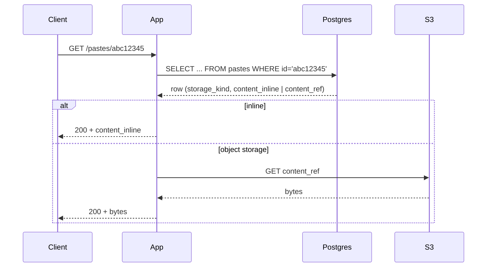

# Pastebin Deep Dive — Storage Choice

**Date:** 2026-04-27 | **Updated:** 2026-04-27
**Tags:** `system-design` `case-study` `pastebin` `deep-dive` `storage` `s3`

## Summary

The parent case study (`../design-pastebin.md`) sketches the "metadata in DB, content in S3" split in three paragraphs. That sketch hides several real decisions: **at what blob size do you stop putting content in the row, who pays the S3 round-trip on tiny pastes, how do you encrypt password-protected content, and what does the cost picture look like at 1.8 B objects with a long-tail access pattern.** This deep dive answers each in turn. The headline rules: keep paste content under ~16 KB inline in the OLTP row, push everything larger to object storage with a content-addressable or shard-prefixed key, compress with `zstd` before writing, encrypt with a tenant- or paste-scoped data key, and let lifecycle policies tier cold pastes into IA/Glacier classes after 30/365 days. Treat the database as a low-cardinality index over an immutable blob store, not as the blob store itself.

## Table of Contents

- [Summary](#summary)
- [Overview](#overview)
- [Metadata in DB, Content in Object Storage](#metadata-in-db-content-in-object-storage)
- [Row-Only Storage — Small Pastes in DB](#row-only-storage--small-pastes-in-db)
- [All-in-S3 with Metadata Index](#all-in-s3-with-metadata-index)
- [Hybrid Hot/Cold Tiering](#hybrid-hotcold-tiering)
- [Compression Strategy](#compression-strategy)
- [Encryption at Rest](#encryption-at-rest)
- [Multi-Region Replication](#multi-region-replication)
- [Object Storage Choice — S3 vs GCS vs R2 vs B2 vs MinIO](#object-storage-choice--s3-vs-gcs-vs-r2-vs-b2-vs-minio)
- [Content-Addressed Storage and Dedup](#content-addressed-storage-and-dedup)
- [Lifecycle Policies](#lifecycle-policies)
- [Backup and Disaster Recovery](#backup-and-disaster-recovery)
- [Read Path Latency Budgets](#read-path-latency-budgets)
- [Anti-Patterns](#anti-patterns)
- [Related](#related)
- [References](#references)

## Overview

Pastebin's storage problem looks deceptively simple — text in, text out — but the workload has three properties that decide everything else:

1. **Write-once, read-many, delete-rare.** A paste is created and never updated. The only mutation is delete (TTL or user action). This is the canonical fit for object storage.
2. **Long-tail access.** A small slice of pastes (the linked-from-Hacker-News ones) are read thousands of times. The vast majority are read once or twice within hours of creation, then never again. This calls for tiered storage.
3. **Variable size.** A "stack trace I want to share" is 4 KB. A "memory dump from prod" is 40 MB. A single storage strategy that handles both ends well does not exist; you pick a split point and route around it.

```mermaid
graph TB
    subgraph Client["Client"]
        C[Browser / curl]
    end
    subgraph App["App Tier"]
        API[API Gateway]
        APP[App Server]
    end
    subgraph Meta["Metadata"]
        PG[(Postgres<br/>id, owner, expiry,<br/>content_ref, size)]
    end
    subgraph Blob["Content"]
        S3[(S3<br/>pastes/{shard}/{id})]
        IA[(S3 Standard-IA<br/>>30 d)]
        GL[(Glacier Instant<br/>>365 d)]
    end
    subgraph Edge["Edge"]
        CDN[CloudFront / R2]
    end
    C --> CDN
    CDN -->|miss| API
    API --> APP
    APP -->|metadata| PG
    APP -->|inline if <16 KB| PG
    APP -->|presigned PUT/GET| S3
    S3 -->|lifecycle| IA --> GL
    classDef db fill:#1e5f3a,stroke:#4ad98a,color:#fff
    classDef obj fill:#5f1e3a,stroke:#d94a8a,color:#fff
    class PG db
    class S3,IA,GL obj
```

The rest of this document walks each layer, starting with the canonical split.

## Metadata in DB, Content in Object Storage

The default answer for any blob-plus-metadata workload. The relational database holds **structured, queryable, mutable** fields; the object store holds **opaque bytes**.

### Why size pushes content out of the row

A relational row is a unit of locking, replication, vacuum, and backup. Postgres's heap is page-based (8 KiB by default); MySQL's InnoDB is also page-based. The moment a column does not fit in a page, the engine has to overflow it — Postgres into **TOAST**, MySQL into **off-page storage**. That overflow works correctly, but it has costs:

- Sequential scans pay extra I/O reading the overflow chain even when you don't `SELECT` the big column.
- `pg_dump` and logical replication ship the entire row, including TOASTed columns, on every change.
- Vacuum and bloat math get harder — large dead rows are harder to reclaim.
- Replicas have to keep up with the write volume of the blob, not just the metadata.

**Rule of thumb split point: ~16 KiB.** Below that, inline content lives well in `bytea` / `MEDIUMBLOB` columns and your row is "small enough" that the OLTP path is unaffected. Between 16 KiB and 1 MiB is a judgement call (see [Row-Only Storage](#row-only-storage--small-pastes-in-db)). Above 1 MiB, **always** push to object storage — the row becomes a coordination cost on every read replica forever.

### The schema

```sql
-- Pastes metadata table
CREATE TABLE pastes (
    id              CHAR(8)       PRIMARY KEY,           -- base62 paste id
    owner_id        BIGINT        NULL REFERENCES users(id),
    title           VARCHAR(200)  NULL,
    syntax          VARCHAR(40)   NULL,                  -- "python", "json", ...
    size_bytes      INT           NOT NULL,
    sha256          BYTEA         NOT NULL,              -- content hash, 32 bytes
    storage_kind    SMALLINT      NOT NULL,              -- 0=inline, 1=s3, 2=s3-ia
    content_inline  BYTEA         NULL,                  -- present iff storage_kind=0
    content_ref     TEXT          NULL,                  -- s3://bucket/key, present iff storage_kind>0
    encryption_kind SMALLINT      NOT NULL DEFAULT 0,    -- 0=none, 1=sse-kms, 2=client-envelope
    encrypted_dek   BYTEA         NULL,                  -- wrapped per-paste key (envelope)
    created_at      TIMESTAMPTZ   NOT NULL DEFAULT NOW(),
    expires_at      TIMESTAMPTZ   NULL,
    deleted_at      TIMESTAMPTZ   NULL,
    CHECK ( (storage_kind = 0 AND content_inline IS NOT NULL AND content_ref IS NULL) OR
            (storage_kind <> 0 AND content_inline IS NULL AND content_ref IS NOT NULL) )
);
CREATE INDEX pastes_owner_idx     ON pastes (owner_id, created_at DESC);
CREATE INDEX pastes_expiry_idx    ON pastes (expires_at) WHERE expires_at IS NOT NULL AND deleted_at IS NULL;
CREATE INDEX pastes_sha256_idx    ON pastes (sha256);     -- enables dedup lookup
```

The `storage_kind` discriminator is the load-bearing field — every read does `if storage_kind == 0 then return content_inline else fetch(content_ref)`. The `CHECK` constraint guarantees you cannot have a half-state row.

### Read flow



For very large pastes (>5 MB) the app should redirect to a presigned GET URL or signed CDN URL rather than proxy bytes. That keeps app-tier bandwidth flat regardless of paste size.

## Row-Only Storage — Small Pastes in DB

The "everything in Postgres" approach is not crazy at small scale or for the **small-paste tail**.

### Postgres TOAST

Postgres stores variable-length values that exceed ~2 KB in a side table (`pg_toast_*`) using a per-table TOAST relation. Strategies:

- `PLAIN` — never compress, never out-of-line. Only valid for fixed-width types.
- `EXTENDED` — compress, then out-of-line. **Default for `text`/`bytea`.** What you almost always want for paste content.
- `EXTERNAL` — out-of-line without compression (faster substring access).
- `MAIN` — compress in-line if possible, out-of-line as last resort.

```sql
-- Force EXTENDED (default) and use lz4 compression on Postgres 14+
ALTER TABLE pastes
    ALTER COLUMN content_inline SET STORAGE EXTENDED,
    ALTER COLUMN content_inline SET COMPRESSION lz4;
```

`lz4` (Postgres 14+) is faster than the older `pglz` and reaches similar ratios on text. For a 100 KB JSON paste you typically see 30–50 KB after compression — but those bytes still live in the TOAST relation and replicate to every replica.

### MySQL `MEDIUMTEXT` / `MEDIUMBLOB`

```sql
CREATE TABLE pastes (
    id              CHAR(8)      PRIMARY KEY,
    content_inline  MEDIUMBLOB   NULL,            -- up to 16 MiB
    -- ...
) ROW_FORMAT=DYNAMIC;
```

InnoDB with `ROW_FORMAT=DYNAMIC` stores large variable columns entirely off-page with a 20-byte pointer in the row, which is closer to TOAST. `LONGBLOB` raises the cap to 4 GiB but at that point you should not be in MySQL.

### When sub-MB pastes don't justify the S3 round-trip

S3 first-byte latency is ~100–200 ms p50 from the same region; `GET` cost is ~$0.0004 per 1,000 requests on Standard. That sounds free, but at 1 B reads/month you are paying $400/month just for `GET` calls plus another ~$0.09/GB egress if it leaves the region. Compare:

- **Inline read:** part of the OLTP query, no extra network hop, ~1 ms.
- **S3 read:** dedicated request, ~100 ms cold, ~50 ms warm in-region.

For a 4 KB paste read 1,000 times, inline storage costs:

- Storage: 4 KB × 1.8 B rows × $0.115/GB-month (RDS gp3) ≈ $828/month for 7 TB.

For the same 4 KB paste in S3 Standard:

- Storage: 4 KB × 1.8 B × $0.023/GB-month ≈ $165/month.
- Plus `PUT` once: 1.8 B × $5/M ≈ $9,000 one-time.
- Plus `GET`s: at 5 reads/paste × 1.8 B = 9 B `GET`s × $0.40/M ≈ $3,600/month.

**The S3 path is cheaper on storage but more expensive on requests for tiny objects.** The break-even per-paste size where S3 wins outright is somewhere around 16–64 KiB depending on your read multiplier. Below that, inline-in-DB pays for itself.

The pragmatic policy:

```python
INLINE_THRESHOLD_BYTES = 16 * 1024  # 16 KiB

def store_paste(content: bytes, paste_id: str) -> dict:
    if len(content) <= INLINE_THRESHOLD_BYTES:
        return {"storage_kind": 0, "content_inline": content, "content_ref": None}
    key = f"pastes/{paste_id[:2]}/{paste_id}"
    s3.put_object(Bucket=BUCKET, Key=key, Body=content)
    return {"storage_kind": 1, "content_inline": None, "content_ref": f"s3://{BUCKET}/{key}"}
```

## All-in-S3 with Metadata Index

The other extreme: keep **only metadata** in the database; every paste, regardless of size, lives in S3.

### Schema

```sql
CREATE TABLE pastes (
    id           CHAR(8)      PRIMARY KEY,
    size_bytes   INT          NOT NULL,
    sha256       BYTEA        NOT NULL,
    s3_key       TEXT         NOT NULL,           -- pastes/{shard}/{id}
    expires_at   TIMESTAMPTZ  NULL,
    -- no content column
);
```

Or DynamoDB, if you want serverless:

```text
PK = paste_id
Attributes: size, sha256, s3_key, expires_at, owner_id
GSI1: owner_id → paste_id (for "my pastes")
TTL on expires_at attribute (DynamoDB native expiry)
```

### Sharded key prefix

S3 partitions by key prefix. A naive `pastes/{id}` key with random base62 IDs gives you good prefix entropy by accident, but you get more determinism by sharding explicitly:

```text
pastes/{shard}/{id}
  shard = id[0:2]    # first 2 chars of base62 → 3,844 prefix buckets
```

This guarantees no single prefix becomes a hot partition even if the ID generator suddenly skews.

### S3 request cost per paste

At list price (us-east-1, S3 Standard, 2026):

| Operation | Cost |
|-----------|------|
| `PUT` | $0.005 per 1,000 |
| `GET` | $0.0004 per 1,000 |
| Storage | $0.023 per GB-month |
| Egress to internet | $0.09 per GB |
| Egress in-region (to EC2) | free |

For 100 M monthly reads of 10 KB pastes from S3 to clients via CloudFront:

- `GET`: $40/month (negligible).
- Storage of 1.8 B × 10 KB = 18 TB: ~$414/month.
- Egress is via CloudFront, not direct S3 — covered by the CDN bill.

The all-in-S3 path is **the cheapest at scale** as long as you have a CDN absorbing reads. Without a CDN, egress dominates.

### Trade-offs

- Pro: One storage system to operate. The DB stays small (~200 GB at 1.8 B rows × 100 B each), backups fast.
- Pro: Lifecycle policies do tiering for free.
- Con: Tiny-paste read latency is higher (S3 first-byte vs DB row).
- Con: Two-phase write — DB row + S3 object — can leave orphans on app crash. Mitigate with idempotent finalize and a janitor that reconciles `s3_key` against bucket inventory.

## Hybrid Hot/Cold Tiering

The compromise that fits the long-tail access pattern best.

### The policy

- **Hot tier (last 7 days):** content lives **inline in the database** for pastes ≤ 64 KB and in **S3 Standard** for larger ones. Reads are fast across the board.
- **Warm tier (7–30 days):** all content in S3 Standard.
- **Cool tier (30–365 days):** S3 Standard-IA. First-byte still ms.
- **Cold tier (>365 days):** S3 Glacier Instant. Pennies per GB-month, ms retrieval.
- **Frozen tier (>3 years):** Glacier Deep Archive — only for pastes flagged "permanent" by user.

### Tiering automation

Two layers:

1. **S3 lifecycle rules** do the storage-class transitions automatically based on object age.
2. **A nightly batch job** moves pastes from "inline in DB" to "S3 Standard" once they cross the 7-day threshold:

```sql
-- Nightly batch — promote inline pastes older than 7 days
WITH cold AS (
    SELECT id, content_inline
    FROM pastes
    WHERE storage_kind = 0
      AND created_at < NOW() - INTERVAL '7 days'
      AND deleted_at IS NULL
    LIMIT 10000
    FOR UPDATE SKIP LOCKED
)
SELECT id, content_inline FROM cold;
-- (in app code: PUT each to S3, then UPDATE pastes SET storage_kind=1, content_inline=NULL, content_ref=... WHERE id IN (...))
```

The job is idempotent (SKIP LOCKED, conditional update on `storage_kind=0`) so it can be retried freely. Run it at low-traffic hours.

### Why not let lifecycle do everything?

S3 lifecycle cannot move a row out of Postgres. The hybrid model treats the DB as **a hot cache** with a 7-day TTL and S3 as the system of record. Once you accept that framing, the rest of the design follows.

## Compression Strategy

Paste content is text. Text compresses 2–10× depending on entropy. Compression is **almost always worth it** at this scale.

### Algorithms

| Algorithm | Ratio (text) | Compress speed | Decompress speed | When |
|-----------|--------------|----------------|-------------------|------|
| `gzip` | 2.5–4× | ~50 MB/s | ~200 MB/s | Universal, supported by every HTTP client |
| `brotli` | 3–5× | ~10 MB/s (q=6) | ~300 MB/s | Better ratio, slow compress, fast decompress; good for once-write-many-read |
| `zstd` | 3–4.5× | ~400 MB/s | ~1 GB/s | Best speed/ratio trade-off; default new choice |
| `lz4` | 1.8–2.5× | ~700 MB/s | ~3 GB/s | When CPU is the bottleneck, ratio is secondary |

For Pastebin: **`zstd` at level 3** is the default. It compresses ~400 MB/s per core (one core handles ~40 K pastes/sec at 10 KB each — way above the write rate) and decompresses fast enough to be invisible on the read path.

### Server-side vs client-side

- **Server-side (default):** the API server compresses before storing. Pro: deterministic, no client cooperation needed, you pick the algorithm. Con: app CPU cost.
- **Client-side:** the browser/CLI compresses with `Content-Encoding: br` or `gzip`. Pro: zero server CPU. Con: trust issues — a malicious client could send claimed-text-but-actually-gzip-bomb. Always validate the decompressed size against `Content-Length`.

For a CLI tool like `pbpaste`, **client-side `zstd` then upload directly via presigned PUT** is ideal — the bytes never decompress on the server.

### Compression as part of the storage envelope

```python
import zstandard as zstd
import boto3

s3 = boto3.client("s3")
cctx = zstd.ZstdCompressor(level=3)

def store_paste_to_s3(content: bytes, key: str, bucket: str) -> dict:
    compressed = cctx.compress(content)
    s3.put_object(
        Bucket=bucket,
        Key=key,
        Body=compressed,
        ContentEncoding="zstd",                  # advisory metadata
        Metadata={"orig-size": str(len(content)),
                  "compressed-size": str(len(compressed))},
        ServerSideEncryption="aws:kms",
        SSEKMSKeyId="alias/pastebin-content",
    )
    return {"orig_size": len(content), "stored_size": len(compressed)}
```

Storage savings at scale: 18 TB raw → ~5 TB compressed. At $0.023/GB-month that is ~$300/month saved. Across IA and Glacier the absolute savings are smaller but the ratio is the same.

## Encryption at Rest

Three levels of encryption, each with different threat models.

### Server-side encryption (SSE)

- **SSE-S3:** AWS-managed keys (AES-256). Free. Protects against bucket-level theft of disks, nothing else. Default-on for new buckets since 2023.
- **SSE-KMS:** AWS KMS-managed CMK. Per-bucket or per-prefix. **Enables audit:** every decrypt is a CloudTrail event. Costs $1/month per CMK plus $0.03 per 10 K KMS calls.
- **SSE-C:** customer-provided key in the request header. Rarely a fit — you have to reliably re-supply the key on every GET, which moves the secret-management problem to the client.

For Pastebin: **SSE-KMS with a per-tenant or per-environment CMK** is the default. Auditability matters because pastes can contain sensitive data (env vars, stack traces, tokens) and a "who decrypted what" trail is the difference between a routine investigation and a compliance incident.

```bash
aws s3api put-object \
  --bucket pastebin-content-prod \
  --key "pastes/ab/abc12345" \
  --body ./paste.zst \
  --server-side-encryption aws:kms \
  --ssekms-key-id alias/pastebin-content \
  --metadata orig-size=10240,encoding=zstd
```

### Client-side envelope encryption (per-paste)

For password-protected pastes the threat model is different: **the storage operator should not be able to read the content.** Use envelope encryption:

1. Generate a random 256-bit Data Encryption Key (DEK) per paste.
2. Encrypt the paste with the DEK (AES-256-GCM).
3. Wrap the DEK with a Key Encryption Key (KEK) derived from the user's password (`Argon2id` with paste-specific salt).
4. Store ciphertext + nonce in S3; store wrapped DEK + salt in the DB row.

```text
DEK = random(32 bytes)
KEK = Argon2id(password, salt=paste_salt, mem=64MB, iter=3, parallel=4) → 32 bytes
ciphertext, tag = AES-256-GCM(DEK, nonce, plaintext)
wrapped_dek = AES-256-GCM-Wrap(KEK, dek_nonce, DEK)
DB:  pastes(encryption_kind=2, encrypted_dek, dek_nonce, paste_salt)
S3:  ciphertext + tag + nonce
```

The server stores wrapped DEK and salt but **never the password**. To decrypt, the user supplies the password; the server derives the KEK, unwraps the DEK, and decrypts. If the user forgets the password, the paste is unrecoverable — by design.

See `../../../security/encryption-at-rest-and-in-transit.md` for the broader envelope-encryption pattern and KEK rotation.

### Defense-in-depth combination

Production Pastebin uses **both**: SSE-KMS at the storage layer (protects against operator-level disk theft) **and** client-side envelope encryption for password-protected pastes (protects against operator-level reads). The two layers are independent and compose without conflict.

## Multi-Region Replication

A single-region S3 bucket is durable (11 nines) but not regionally available. Regional outages happen — `us-east-1` notably in Dec 2021 and June 2023 — and a paste service that 503s for 6 hours will lose users.

### S3 Cross-Region Replication (CRR)

```bash
aws s3api put-bucket-replication \
  --bucket pastebin-content-prod-use1 \
  --replication-configuration '{
    "Role": "arn:aws:iam::ACCOUNT:role/s3-replication",
    "Rules": [{
      "ID": "ReplicateAllToEU",
      "Status": "Enabled",
      "Priority": 1,
      "Filter": { "Prefix": "pastes/" },
      "Destination": {
        "Bucket": "arn:aws:s3:::pastebin-content-prod-euw1",
        "StorageClass": "STANDARD_IA",
        "ReplicationTime": { "Status": "Enabled", "Time": { "Minutes": 15 } },
        "Metrics": { "Status": "Enabled", "EventThreshold": { "Minutes": 15 } }
      },
      "DeleteMarkerReplication": { "Status": "Enabled" }
    }]
  }'
```

Key choices:

- **`ReplicationTime` SLA (RTC):** 99.99% of objects replicated in 15 minutes, with CloudWatch metrics. Adds ~2× the per-PUT cost but gives a measurable RPO.
- **Storage class on replica:** Standard-IA is fine if the replica is for DR only. Match Standard if it's a read-from-region.
- **Delete-marker replication:** required if you want soft-deletes propagated.

### Latency for first-fetch from a foreign region

If a EU user requests a paste whose canonical copy is in `us-east-1`:

- CloudFront edge (Frankfurt): ~30 ms if cached.
- Origin fetch from `us-east-1`: ~100 ms TLS + ~80 ms first-byte = ~180 ms cold.
- Replica in `eu-west-1` (if you set up regional origin): ~50 ms first-byte.

The right answer is **CloudFront with origin failover** to a regional replica bucket. The CDN absorbs the long-haul latency on cache miss, and once the edge is warm everyone in the region sees ~30 ms.

### Cost

CRR pricing has three components: replication PUT (~$0.005 per 1,000 objects, same as a normal PUT), inter-region transfer ($0.02/GB), and storage in the destination region. For a 18 TB → 18 TB replica that is ~$360/month transfer one-time plus 2× storage. Use CRR only for content that justifies it — e.g., not for ephemeral 10-minute pastes.

## Object Storage Choice — S3 vs GCS vs R2 vs B2 vs MinIO

The S3 API is the lingua franca; most "object storage" products implement a subset of it. The differences are in pricing structure, egress, and where the bucket lives.

| Provider | Storage $/GB-mo (hot) | Egress to internet | `GET` per 1k | Notable |
|----------|----------------------|---------------------|--------------|---------|
| AWS S3 Standard | $0.023 | $0.09/GB | $0.0004 | Reference, deepest ecosystem |
| AWS S3 Standard-IA | $0.0125 | $0.09/GB | $0.001 + $0.01/GB retrieval | Min 30 d, min 128 KB |
| AWS S3 Glacier Instant | $0.004 | $0.09/GB | $0.01 + $0.03/GB retrieval | Min 90 d |
| GCS Standard | $0.020 | $0.12/GB | $0.0005 | Strong consistency, similar API |
| Azure Blob Hot | $0.018 | $0.087/GB | $0.0044 | LRS/ZRS/GRS replication tiers |
| Cloudflare R2 | $0.015 | **$0** | $0.36/M class-A, $0.036/M class-B | Free egress is the killer feature |
| Backblaze B2 | $0.006 | $0.01/GB (free 3× storage) | $0.004/M | Cheapest storage, S3-compatible API |
| MinIO (self-host) | hardware cost | bandwidth cost | none | On-prem, S3-compatible, you operate it |

For a paste service:

- **Reads dominate cost.** Egress matters more than storage. Cloudflare R2 with $0 egress is dramatic at scale — at 18 TB stored and 100× read amplification, S3 egress would be ~$160 K/month vs R2's $0.
- **B2** is the cheapest storage but charges for `GET`s aggressively at high read counts.
- **MinIO** makes sense when you have a private DC and predictable load; otherwise the operational burden is real (erasure coding, capacity planning, hardware refresh).
- **GCS / Azure** are roughly at parity with S3 on pricing; the choice usually follows the rest of your cloud.

Pricing for low-frequency-access pastes:

- 90% of pastes after 30 days are read 0 times. Putting them in **S3 Glacier Instant** (or **R2 with no IA tier — same flat rate**) at $0.004/GB-mo cuts long-tail storage by 5×.
- The 1% that are still read get a single retrieval fee ($0.03/GB), which is fine.

## Content-Addressed Storage and Dedup

If two users paste the exact same content, you have two choices: store both copies or store one and reference it from two metadata rows.

### Content-addressed keys

```python
import hashlib

def content_key(content: bytes) -> str:
    digest = hashlib.sha256(content).hexdigest()
    # Shard with first 2 chars to avoid prefix hot-spotting
    return f"pastes-cas/{digest[:2]}/{digest}"
```

Insert flow:

```python
def store_paste(content: bytes, paste_id: str) -> dict:
    sha = hashlib.sha256(content).digest()
    key = content_key(content)
    # Check if the object already exists (HEAD is cheap)
    try:
        s3.head_object(Bucket=BUCKET, Key=key)
        # Already there — just record metadata pointing at the existing object
    except s3.exceptions.ClientError:
        s3.put_object(Bucket=BUCKET, Key=key, Body=cctx.compress(content),
                      ServerSideEncryption="aws:kms", SSEKMSKeyId=KMS_KEY)
    db.execute(
        "INSERT INTO pastes (id, sha256, s3_key, ...) VALUES (%s, %s, %s, ...)",
        (paste_id, sha, key),
    )
```

Trade-offs:

- **Free dedup.** Memes, "rickroll" pastes, common config files — all share one object.
- **Reference counting becomes a problem.** When you delete paste A pointing at sha X, you must not delete the object if paste B also points at X. Solutions: (a) ref-count column updated transactionally; (b) "garbage-collect at scan time" — periodic scan over `pastes` builds the live set, sweeps unreferenced objects.
- **Content-addressed keys leak nothing about the user**, which is good for privacy.
- **Encryption breaks dedup.** If every paste is encrypted with a unique DEK, the ciphertexts differ even when plaintexts match. To dedup encrypted pastes you need **convergent encryption** (DEK = KDF(plaintext)), which has its own confirmation-of-a-file attack risks. Usually: dedup only the public, unencrypted corpus.

### Storage-class implications

Content-addressed objects can sit in **Glacier Instant** for the long tail with no metadata churn — an object's lifecycle is independent of which paste rows reference it. The scheduled GC job handles deletion when refcount hits zero.

## Lifecycle Policies

```json
{
  "Rules": [
    {
      "ID": "tier-30d-to-IA",
      "Status": "Enabled",
      "Filter": { "Prefix": "pastes/" },
      "Transitions": [
        { "Days": 30,  "StorageClass": "STANDARD_IA" },
        { "Days": 365, "StorageClass": "GLACIER_IR" }
      ]
    },
    {
      "ID": "abort-incomplete-mpu",
      "Status": "Enabled",
      "Filter": { "Prefix": "" },
      "AbortIncompleteMultipartUpload": { "DaysAfterInitiation": 7 }
    },
    {
      "ID": "expire-ephemeral-tagged",
      "Status": "Enabled",
      "Filter": { "Tag": { "Key": "ttl", "Value": "ephemeral" } },
      "Expiration": { "Days": 1 }
    }
  ]
}
```

### Cost-vs-retrieval-time matrix

| Class | Storage $/GB-mo | First-byte | Min duration | Retrieval fee |
|-------|------------------|------------|----------------|----------------|
| Standard | $0.023 | ms | none | none |
| Standard-IA | $0.0125 | ms | 30 d | $0.01/GB |
| Glacier Instant | $0.004 | ms | 90 d | $0.03/GB |
| Glacier Flexible | $0.0036 | min–hr | 90 d | $0.01/GB + restore req fee |
| Deep Archive | $0.00099 | 12 h | 180 d | $0.02/GB + req fee |

For Pastebin the rational tier is **Standard → Standard-IA at 30 d → Glacier Instant at 365 d**. Going past Glacier Instant trades a tiny storage saving for a UX penalty no user would accept ("your paste from 2024 will be ready in 4 hours").

### Tag-driven lifecycle

The `expire-ephemeral-tagged` rule above lets the app tag known-short-lived pastes (`Tagging: ttl=ephemeral`) and have S3 expire them at 1 day, regardless of the metadata-driven sweeper. This is a cheap second line of defense for the "I forgot to delete" case.

## Backup and Disaster Recovery

S3 is durable, not backed up. A bug in your application that issues `DeleteObject` with a wide prefix will happily delete millions of objects — and durability does not bring them back. Treat backup as a separate concern.

### Versioning + MFA delete

```bash
aws s3api put-bucket-versioning \
  --bucket pastebin-content-prod \
  --versioning-configuration 'Status=Enabled,MFADelete=Enabled' \
  --mfa "arn:aws:iam::ACCOUNT:mfa/root MFA-CODE"
```

With versioning, a `DeleteObject` writes a **delete marker** rather than removing the object. Recovery is "delete the delete marker." MFA-delete requires an MFA token to permanently remove versions — protects against compromised IAM credentials.

Cost: every overwrite keeps the old version. For a write-once paste workload this is fine; for an overwrite-heavy workload, lifecycle-rule old versions to IA after 7 d, expire after 30 d.

### Cross-account replication

Replicate to a **different AWS account** with a one-way IAM trust. An attacker in the primary account cannot reach the replica account; an accidental `DeleteBucket` cannot cascade.

### RTO and RPO targets

For Pastebin, reasonable targets:

- **RPO 15 min** — at most 15 minutes of writes lost. CRR with RTC SLA delivers this for the content tier; DB needs PITR / WAL streaming with the same target.
- **RTO 1 h** — at most 1 hour from outage declaration to user-visible service. Achievable with a warm-standby DB replica and a pre-built app deployment in the DR region.

Anything tighter (RPO < 1 min, RTO < 5 min) requires synchronous multi-region writes, which is a different architecture.

## Read Path Latency Budgets

A paste rendering target of 200 ms p95 from click to readable content sets the budget for every layer.

| Hop | p50 | p95 | Notes |
|------|-----|-----|-------|
| TLS handshake (warm) | 20 ms | 80 ms | TLS 1.3 0-RTT shaves this |
| CDN cache hit | 5 ms | 30 ms | Edge POP near user |
| CDN miss → in-region S3 | 50 ms | 200 ms | First-byte from S3 Standard |
| CDN miss → cross-region S3 | 150 ms | 400 ms | Trans-Atlantic origin fetch |
| Cold Glacier Instant | 60 ms | 250 ms | Same as Standard for first-byte |
| DB inline read | 1 ms | 5 ms | Index hit on PK |
| App rendering / syntax highlight | 5 ms | 30 ms | Server-rendered |

Composed paths:

- **Edge cache hit:** ~30 ms. Trivial.
- **CDN miss, inline-in-DB paste:** ~25 ms (DB) + ~30 ms (network back to user) = ~55 ms.
- **CDN miss, S3 paste in-region:** ~50 ms S3 + ~30 ms back to user = ~80 ms.
- **CDN miss, S3 paste cross-region:** ~180 ms + ~30 ms = ~210 ms.

The 200 ms p95 budget is comfortable for the in-region case and tight for cross-region without CRR. **The CDN is doing most of the work** — paste content is immutable and cacheable forever (until expiry), so cache hit ratios above 95% are routine for popular pastes. Set `Cache-Control: public, max-age=2592000, immutable` for paste GETs.

## Anti-Patterns

- **Storing 10 MB pastes inline in Postgres because it's "easier."** It is, until backups take 8 hours and replicas can't keep up. Push to S3 above 1 MB. No exceptions.
- **Using S3 as a key-value store for hot metadata.** Listing keys to "find a user's pastes" is a prefix scan — use the DB.
- **No lifecycle rule for incomplete multipart uploads.** Pays for orphaned parts forever. Add `AbortIncompleteMultipartUpload` to every bucket on day one.
- **One bucket per environment with no replication.** A regional outage takes you down. CRR is cheap insurance for the system-of-record buckets.
- **Encrypting per-paste with KMS but using the same KMS data key for everything.** Defeats the audit purpose. Use SSE-KMS with the bucket key feature for cost, and `aws:kms-context` for per-tenant scoping.
- **Storing password-protected paste content as plaintext + a "password gate" in the app.** The operator can read it. Use envelope encryption with KEK derived from the password, full stop.
- **Disabling versioning to save money.** Versioning is the only thing standing between you and a botched `DeleteObjects` call wiping the corpus. Use lifecycle rules to bound retention of noncurrent versions instead.
- **Optimizing storage cost at the expense of read latency.** Moving 30-day-old pastes to Glacier Flexible saves $50/month and breaks every "old paste" link with a 4-hour delay. Glacier Instant is the right tier for paste long-tail.
- **Not measuring `GET`/`PUT` request cost.** At 1 B+ requests/month, request fees rival storage fees. Compress, cache, and CDN aggressively.
- **Treating S3 strong consistency as multi-region strong consistency.** Replication is async by design. After a write to `us-east-1`, a read from `eu-west-1` may still 404 for ~15 min.

## Related

- `../design-pastebin.md` — the parent case study (Storage Choice section).
- `../../../building-blocks/object-and-blob-storage.md` — the reference for S3 mechanics, lifecycle, presigned URLs, and consistency.
- `../../../building-blocks/databases-as-a-component.md` — when DB storage is the right call vs object storage.
- `../../../security/encryption-at-rest-and-in-transit.md` — envelope encryption, KEK derivation, KMS patterns.
- `../url-shortener/` — sister case study; the metadata-only model there is the all-in-DB extreme of the same axis.
- `../../../building-blocks/caching-layers.md` — CDN behavior referenced in the read-latency section.

## References

- AWS, *S3 Storage Classes* — https://aws.amazon.com/s3/storage-classes/
- AWS, *Managing your storage lifecycle* — https://docs.aws.amazon.com/AmazonS3/latest/userguide/object-lifecycle-mgmt.html
- AWS, *Protecting data with server-side encryption using AWS KMS keys (SSE-KMS)* — https://docs.aws.amazon.com/AmazonS3/latest/userguide/UsingKMSEncryption.html
- AWS, *Replicating objects (Cross-Region Replication)* — https://docs.aws.amazon.com/AmazonS3/latest/userguide/replication.html
- PostgreSQL, *TOAST — The Oversized-Attribute Storage Technique* — https://www.postgresql.org/docs/current/storage-toast.html
- MySQL, *Data Type Storage Requirements* — https://dev.mysql.com/doc/refman/8.0/en/storage-requirements.html
- MinIO, *MinIO Object Storage for AWS S3* — https://min.io/docs/minio/linux/index.html
- Backblaze, *B2 Cloud Storage Pricing* — https://www.backblaze.com/cloud-storage/pricing
- Cloudflare, *R2 Pricing* — https://developers.cloudflare.com/r2/pricing/
