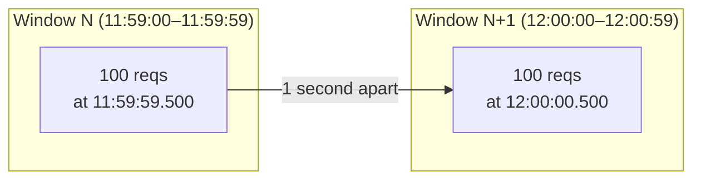

# Rate Limiter Deep Dive — Algorithm Choice

**Date:** 2026-04-27 | **Updated:** 2026-04-27
**Tags:** `system-design` `case-study` `rate-limiter` `deep-dive` `algorithms`

## Table of Contents

- [Summary](#summary)
- [Overview](#overview)
- [Fixed Window](#fixed-window)
- [Sliding Window Log](#sliding-window-log)
- [Sliding Window Counter](#sliding-window-counter)
- [Token Bucket](#token-bucket)
- [Leaky Bucket](#leaky-bucket)
- [GCRA — Generic Cell Rate Algorithm](#gcra--generic-cell-rate-algorithm)
- [Concurrency Limiters](#concurrency-limiters)
- [Adaptive Limiters](#adaptive-limiters)
- [Decision Matrix](#decision-matrix)
- [Probabilistic vs Exact Counting](#probabilistic-vs-exact-counting)
- [Anti-Patterns](#anti-patterns)
- [Related](#related)
- [References](#references)

## Summary

The Rate Limiter case study's `7.1 Algorithm choice` section condenses a real engineering decision into a five-row table. This companion expands every row plus four families the parent doc didn't have room for: **GCRA**, **concurrency limiters**, **adaptive (latency-driven) limiters**, and **probabilistic counting** with sketches. The recommendation hierarchy is unchanged — token bucket as default for API quotas (Stripe's choice), sliding window counter at the edge (Cloudflare's choice with a published 0.003% error rate over 400M requests), leaky bucket only when downstream smoothness matters more than tail latency, fixed window only for crude internal caps. What this doc adds is the **why** at the level of math, memory, and atomicity, plus working code (Lua, Python, Go) for the patterns that matter in production.

## Overview

Every rate-limiting algorithm answers the same question — _should this request be allowed right now?_ — and trades off four properties:

| Property | What it means | Who cares |
|----------|---------------|-----------|
| **Burst tolerance** | Can a quiet caller spend a saved-up budget in one burst? | Real users (humans click in bursts) |
| **Smoothness** | Does the output rate stay flat regardless of input shape? | Strict downstream contracts, hardware, billing meters |
| **Accuracy** | How close is the enforced rate to the stated rate? | Compliance, SLAs, contractual quotas |
| **State cost** | Bytes per key, network round-trips per request | Anyone running > 1k keys |

There is no algorithm that dominates on all four. The decision is which two you care about and which two you'll absorb. The shorthand:

- **Token bucket** — burst-friendly, exact, O(1) state. Default for user-facing APIs.
- **Sliding window counter** — approximate, smooth, O(1) state. Default at the edge / WAF.
- **Leaky bucket** — smooth output, queue-bounded, latency cost. Default when downstream is rigid.
- **GCRA** — token bucket's algebraic cousin: one float, no allocation, identical semantics.
- **Sliding window log** — exact, O(N) state. Reach for it only when N is small and accuracy is contractual.
- **Fixed window** — O(1), boundary glitch. Crude internal caps only.

Two orthogonal families that are not on this list but belong on the diagram:

- **Concurrency limiters** — bound _in-flight_ requests, not request rate. Different math, different failure mode.
- **Adaptive limiters** — change the rate dynamically based on observed latency or error signal (TCP-Vegas-style).

In production you almost always combine **at least two** of these: a per-key rate limiter and a global concurrency limiter, or an edge sliding-window counter and a service-tier token bucket.

## Fixed Window

### Math

Pick a window `W` (typically 60 s). Compute the bucket id as `floor(now / W)`. Increment a counter `c[key, bucket]`. Allow if `c <= limit`, else 429.

```text
allow(key) :=
    bucket_id = floor(now_seconds / W)
    c = INCR(key + ":" + bucket_id)
    if c == 1: EXPIRE(key + ":" + bucket_id, 2 * W)
    return c <= limit
```

State per key per window is one integer plus a TTL — call it ~50 bytes in Redis with overhead. The counter is wall-clock-aligned, which means **every key in the system rolls over simultaneously at `t mod W == 0`**.

### Boundary glitch — worked example

The classic failure mode. Limit `L = 100` per minute. A caller sends `100` requests at `11:59:59.500` and another `100` at `12:00:00.500`. Both pass — different buckets. Within a 1-second observation window the caller got `200` through, which is `2L`. With clock skew or batched-clock-tick clients the observed window can shrink below 100 ms.



This isn't a tunable knob; it's intrinsic to fixed windows. The only fix is to slide the window (next two algorithms).

### Memory profile

`O(1)` per key per window. The counter for window `N-1` can be evicted as soon as `now > N * W`; setting `EXPIRE` to `2*W` lets the previous window survive long enough for sliding-window-counter readers (see below) and is the standard pattern.

### When it's good enough

- **Internal admin endpoints** with a coarse "no one should hammer this" guard.
- **Cost-control on cron-like callers** where a 2× burst at midnight isn't a real risk.
- **Telemetry and abuse signals** where you want a cheap counter and the boundary error is in the noise.

Do not use it for paid-tier quotas, billing-adjacent limits, or any contract that says "100 requests per minute" with a straight face.

## Sliding Window Log

### Exact accounting

Keep a sorted set per key. The score is the timestamp; the member is a unique request id (UUID or `now_ns + nonce`). On each request:

1. `ZREMRANGEBYSCORE key 0 (now - W)` — drop entries that fell out of the window.
2. `ZCARD key` — count what's left.
3. If `count >= limit`, reject; else `ZADD key now uuid` and `EXPIRE key W`.

This is **exact**: there is no approximation, no boundary glitch, and the rate is enforced to the millisecond. The price is per-request memory linear in request rate.

### Per-key memory growth

A caller running at `r` requests per second over a window of `W` seconds keeps `r × W` entries live. Sorted-set entry overhead in Redis is roughly **80–100 bytes** per entry once you account for skiplist nodes and dictionary entries. So:

- 10 req/s × 60 s window = 600 entries × 80 B ≈ **48 KB** per caller. Fine.
- 1 000 req/s × 60 s window = 60 000 entries × 80 B ≈ **4.8 MB** per caller. Painful at 100 callers.
- 10 000 req/s × 60 s window = 600 000 entries × 80 B ≈ **48 MB** per caller. Don't.

### Sorted-set / log-pruning pattern

Atomic Lua keeps the read-prune-count-write under one redis op:

```lua
-- KEYS[1] = log key
-- ARGV: now_ms, window_ms, limit, request_id
local now    = tonumber(ARGV[1])
local window = tonumber(ARGV[2])
local limit  = tonumber(ARGV[3])
local rid    = ARGV[4]

-- Evict entries older than the window.
redis.call("ZREMRANGEBYSCORE", KEYS[1], 0, now - window)

local count = redis.call("ZCARD", KEYS[1])
if count >= limit then
  return {0, count, limit}  -- denied
end

redis.call("ZADD", KEYS[1], now, rid)
redis.call("PEXPIRE", KEYS[1], window)
return {1, count + 1, limit}  -- allowed
```

### When to pick it

- **Compliance-grade rate limits** — financial APIs, healthcare APIs, anything where "we promise not more than N per minute" has audit consequences.
- **Low-volume admin / write paths** — `POST /password-reset`, `POST /invite`, `POST /signup` — `r` is small, exactness is valuable.
- **Rate-limiting unit-of-work that costs money** — outbound SMS, paid SMS-receive, paid LLM calls.

Skip it for any "per-IP at the edge" use case. At Cloudflare scale (~400M requests in the published study) a log per source would not fit in memory at any reasonable cost.

## Sliding Window Counter

### Cloudflare's approach

Two adjacent fixed-window counters — `current` and `previous` — and a linear interpolation. If the request arrives at fraction `f` (0..1) into the current window, the effective count is:

```text
effective = previous_count × (1 - f) + current_count
```

The `(1 - f)` weight on the previous bucket linearly decays the contribution of older traffic as the current window fills. At `f = 0` (just rolled over) you inherit the full previous count; at `f = 1` you've fully replaced it with the current count. This is exactly the kind of approximation that's wrong in pathological synthetic traffic but extremely close on real traffic.

### Error bounds — Cloudflare's published 0.003%

Cloudflare published an empirical study over **400 million requests across 270 000 distinct sources** ([Cloudflare blog][cf-counting]). They reported:

- **0.003%** of requests were either wrongly allowed or wrongly limited.
- Average gap between estimated rate and true rate: **~6%**.
- **Zero false positives** (no source under threshold was throttled).
- **Three false negatives** (sources allowed through), all running ≤ 15% above threshold.

The intuition: the approximation is most wrong when traffic is bursty within a single window (since it assumes uniform distribution of the previous-window count). Real traffic, even bursty traffic, rarely produces a worst-case shape across a 60-second boundary.

### Atomic Lua

```lua
-- KEYS[1] = current bucket key
-- KEYS[2] = previous bucket key
-- ARGV: limit, window_ms, now_ms
local limit      = tonumber(ARGV[1])
local window_ms  = tonumber(ARGV[2])
local now_ms     = tonumber(ARGV[3])

local elapsed_in_current = now_ms % window_ms
local fraction_current   = elapsed_in_current / window_ms

local cur  = tonumber(redis.call("GET", KEYS[1])) or 0
local prev = tonumber(redis.call("GET", KEYS[2])) or 0

local estimate = prev * (1 - fraction_current) + cur

if estimate >= limit then
  return {0, math.floor(estimate), limit}
end

redis.call("INCR", KEYS[1])
redis.call("PEXPIRE", KEYS[1], 2 * window_ms)
return {1, math.floor(estimate) + 1, limit}
```

### Memory profile

Two integer counters per key per pair of windows. With `2*W` TTL, peak live keys per identity is two. Cloudflare's claim of "minimal memory" maps to `~2 × (key_overhead + int_size)` per source — call it ~150 bytes per active key. That's how 270 000 distinct sources fit comfortably in a single memcache shard.

### When to pick it

- **Edge / WAF** — millions of distinct keys, bursty IP traffic, "approximate" is the contract.
- **Public read endpoints** — `GET /search` with a per-IP cap; the 6% mean gap is below noise.
- **Anywhere fixed-window is tempting but the boundary glitch is unacceptable.**

## Token Bucket

### Refill math

State per key: `(tokens, last_refill_ms)`. Two parameters: `capacity` (max burst, `B`) and `refill_rate` (tokens per ms, `r`). On each request:

```text
elapsed   = max(0, now - last_refill)
tokens    = min(capacity, tokens + elapsed × refill_rate)
if tokens >= cost:
    tokens -= cost
    last_refill = now
    return ALLOW
else:
    return DENY (with retry-after = (cost - tokens) / refill_rate)
```

Notice three things:

1. The bucket **lazily refills** — there is no background timer. State only changes when a request arrives. This is what makes it cheap.
2. `capacity` and `refill_rate` are **independent** controls. You can configure 100 req/s sustained with a 500-token burst, or 10 req/s sustained with a 10-token burst. This decouples the long-term contract from the short-term tolerance.
3. The `Retry-After` value falls out of the math directly: how long until you'd accumulate enough tokens.

### Capacity vs rate — what each parameter controls

- **`refill_rate`** is the contract you publish: "100 requests per second." It's the long-run average.
- **`capacity`** is your tolerance for clumpy real traffic: "but we accept up to a 1-second burst all at once."

Setting `capacity = refill_rate × W` for some `W` produces a token bucket that allows a burst of `W` seconds' worth of requests after a `W`-second quiet period, then enforces `refill_rate` thereafter. Most "good" public APIs ship something like `capacity = 60 × refill_rate` so a polite client that's been quiet for a minute can catch up in one burst.

### Stripe's atomic Lua

This is the implementation pattern from the parent doc, expanded with denominator math and `PEXPIRE`:

```lua
-- KEYS[1] = bucket key
-- ARGV: capacity, refill_rate_per_ms, now_ms, requested_tokens
local key        = KEYS[1]
local capacity   = tonumber(ARGV[1])
local refill     = tonumber(ARGV[2])  -- tokens per ms
local now_ms     = tonumber(ARGV[3])
local requested  = tonumber(ARGV[4])

local data        = redis.call("HMGET", key, "tokens", "ts")
local tokens      = tonumber(data[1]) or capacity
local last_refill = tonumber(data[2]) or now_ms

local elapsed = math.max(0, now_ms - last_refill)
tokens = math.min(capacity, tokens + elapsed * refill)

local allowed
local retry_after_ms = 0
if tokens >= requested then
  tokens = tokens - requested
  allowed = 1
else
  allowed = 0
  retry_after_ms = math.ceil((requested - tokens) / refill)
end

redis.call("HMSET", key, "tokens", tokens, "ts", now_ms)
-- TTL = time until empty bucket fully refills, plus headroom.
redis.call("PEXPIRE", key, math.ceil(capacity / refill) + 1000)

return {allowed, math.floor(tokens), retry_after_ms}
```

The `EVALSHA` of this script becomes the canonical entry point for the rate-limit-as-a-service tier (see [Redis EVAL docs][redis-eval]). One round-trip per decision; no race.

### GCRA equivalence

A token bucket with capacity `B` and refill rate `r` is **mathematically equivalent** to GCRA with emission interval `T = 1/r` and burst tolerance `τ = B × T`. You can prove it by inverting the state: instead of tracking remaining tokens, track the earliest time a request would be conformant. See [GCRA](#gcra--generic-cell-rate-algorithm) below.

### When to pick it

- **API quotas** with real users — Stripe, GitHub, AWS API Gateway.
- **Anywhere bursts are part of the contract** — humans clicking, batch jobs pulsing, retries with backoff.
- **Anywhere you need an exact `Retry-After`.** Falls out of the math.

## Leaky Bucket

### Egress shaping vs ingress limiting

The leaky bucket is sometimes described as "the same as token bucket but for output." In practice the difference is **what overflowing means**.

- **Token bucket**: when tokens are exhausted, the request is _denied at ingress_ (429). Caller retries.
- **Leaky bucket as a queue**: when the queue is full, the request is _denied at ingress_. Otherwise it's enqueued and dequeued at fixed rate `r`. Caller waits.

Critically, leaky-bucket-as-a-queue **adds latency**. A request entering with N items already queued waits `N/r` seconds before processing. Token bucket adds zero latency to allowed requests.

### Queue overflow behavior

A leaky bucket with capacity `Q` and drain rate `r` exhibits three regimes:

1. **`λ < r`** — input rate below drain rate. Queue stays small; latency tracks instantaneous burst.
2. **`λ ≈ r`** — queue grows under burst, drains under quiet. Latency oscillates.
3. **`λ > r` sustained** — queue fills to `Q`, then the limiter switches from queueing to dropping. Latency for queued requests stabilizes at `Q/r`; new requests get 429.

The latency-vs-shed trade-off is the explicit design choice. A 5-second queue at the edge of an SMS gateway is fine because users expect SMS to take seconds anyway. A 5-second queue in front of a checkout API is a disaster because it converts a fast 429-and-retry into a slow timeout.

### When it differs meaningfully from token bucket

If you implement leaky bucket as a **counter** (not a queue) — increment on enqueue, decrement on virtual-drain — you get exactly the same allow/deny behavior as token bucket, just with inverted accounting. The interesting difference only shows up when you implement it as a **physical queue**:

- Output is _genuinely smooth_. Downstream sees requests at intervals of exactly `1/r`.
- Latency is _explicit_, observable, and bounded by `Q/r`.
- Bursts are _absorbed_ rather than _passed through_.

This matters in three concrete cases:

1. **Hardware-rate-limited downstream** — SMS gateway, video transcoder, printer queue. Smoothness is contractual.
2. **Cost-metered downstream** — a vendor charges per request and bills per-second peak; smoothing the peak saves money.
3. **Strict-FIFO requirement** — order matters and a denied request can't simply be retried out of order.

For everything else, token bucket is the better default because **shedding is cheaper than queueing under sustained overload**.

## GCRA — Generic Cell Rate Algorithm

### Single-state-variable elegance

GCRA was originally specified for ATM cell traffic shaping ([ITU-T I.371][itu-i371]). It encodes a token bucket as a **single timestamp**: the **TAT** (Theoretical Arrival Time) — the earliest moment a future request would be conformant.

Two parameters:

- **`T`** (emission interval) — `1 / rate`. The minimum time between two requests at the long-run rate.
- **`τ`** (burst tolerance) — how far in the past the TAT may slip before requests are conformant again. Equivalent to `(B - 1) × T` for a token bucket of capacity `B`.

Decision rule on a request at time `now`:

```text
if now < TAT - τ:
    DENY (request arrived too early; would exceed burst budget)
else:
    new_TAT = max(TAT, now) + T
    TAT = new_TAT
    ALLOW
```

State per key: **one float** (the TAT). No tokens, no last-refill, no separate burst counter. The single variable encodes both the long-run rate and the burst budget.

### Mathematical equivalence to token bucket

GCRA and token bucket compute the same allow/deny decision for every input sequence, given:

```text
T = 1 / refill_rate
τ = (capacity - 1) × T
```

Proof sketch: the "remaining tokens" of a token bucket at time `now` equals `(τ - max(0, TAT - now)) / T + 1`, capped at `capacity`. They are duals — one tracks how much budget you have left, the other tracks how far in the future you've already committed.

### Practical advantages

- **One variable.** Fits in a single Redis string, a single 8-byte slot in a struct, a single `AtomicLong` in JVM-land. No `HMGET`/`HMSET` round-trip.
- **No "tokens" abstraction.** The semantics are entirely time-based. There's no "what does it mean to consume 0.7 tokens" question.
- **Trivial to extend to weighted requests.** A request of cost `c` advances TAT by `c × T` instead of `T`. Same math, no new state.
- **Maps cleanly to `Retry-After`.** If denied at time `now`, the next conformant moment is `TAT - τ`. So `Retry-After = TAT - τ - now`. Exact.

### Python implementation

```python
import time
from dataclasses import dataclass

@dataclass
class GCRA:
    """Single-state-variable rate limiter, equivalent to a token bucket."""
    emission_interval: float   # T, seconds per request at the long-run rate
    burst_tolerance: float     # tau, seconds of burst budget
    tat: float = 0.0           # theoretical arrival time

    def allow(self, cost: float = 1.0, now: float | None = None) -> tuple[bool, float]:
        now = now if now is not None else time.monotonic()
        increment = cost * self.emission_interval
        new_tat = max(self.tat, now) + increment
        allow_at = new_tat - self.burst_tolerance
        if now < allow_at - increment:
            # Already too far in the future; deny.
            retry_after = allow_at - increment - now
            return False, retry_after
        self.tat = new_tat
        return True, 0.0


# 100 req/s sustained, burst of 50.
limiter = GCRA(emission_interval=0.01, burst_tolerance=0.49)
ok, retry = limiter.allow()
```

The Redis-side equivalent is roughly 10 lines of Lua and one `GETSET`-style operation. `redis-cell` ([brandur/redis-cell][redis-cell]) ships exactly this as a Redis module if you don't want to maintain the script.

## Concurrency Limiters

### Orthogonal to rate limiters

A rate limiter bounds **requests per unit time**. A concurrency limiter bounds **requests in flight at any instant**. They constrain different failure modes.

| Failure mode | Defense |
|--------------|---------|
| Caller floods you faster than you can process | Rate limiter (cap throughput) |
| Caller's requests pile up because each is slow | Concurrency limiter (cap parallel work) |
| Caller has no problem; you have a sudden DB stall | Concurrency limiter (cap WIP, shed early) |

A rate-only limiter says "100 req/s is fine" and lets 100 simultaneous slow requests stack up against your 50-thread pool. A concurrency-only limiter says "max 50 in flight" and is happy to let those 50 fire 1000 times per second if each finishes fast.

You usually need **both**: rate limit at the gateway for fairness and quota; concurrency limit at the service for self-protection.

### Semaphore-based implementation

The classic shape is a counting semaphore guarding a critical section, with non-blocking acquisition:

```go
package limiter

import (
    "context"
    "errors"
    "time"
)

// ConcurrencyLimiter caps in-flight requests using a buffered channel as a semaphore.
type ConcurrencyLimiter struct {
    slots chan struct{}
}

func NewConcurrencyLimiter(maxInFlight int) *ConcurrencyLimiter {
    return &ConcurrencyLimiter{slots: make(chan struct{}, maxInFlight)}
}

var ErrLimitExceeded = errors.New("concurrency limit exceeded")

// Acquire a slot or fail fast. Returns a release function the caller MUST call.
func (l *ConcurrencyLimiter) Acquire(ctx context.Context, wait time.Duration) (func(), error) {
    select {
    case l.slots <- struct{}{}:
        return func() { <-l.slots }, nil
    default:
        if wait <= 0 {
            return nil, ErrLimitExceeded
        }
    }
    timer := time.NewTimer(wait)
    defer timer.Stop()
    select {
    case l.slots <- struct{}{}:
        return func() { <-l.slots }, nil
    case <-timer.C:
        return nil, ErrLimitExceeded
    case <-ctx.Done():
        return nil, ctx.Err()
    }
}
```

In Java the same shape is `java.util.concurrent.Semaphore` with `tryAcquire(timeout, unit)`. In Python it's `asyncio.Semaphore`. The pattern is identical: bounded slot count, non-blocking acquire with optional brief wait, mandatory release in a `finally` / `defer`.

### Why you usually need both

A rate limit of 100 req/s with a per-request P99 latency of 2 s implies a steady-state in-flight count of ~200 (Little's law: `L = λ × W`). If your thread pool is 64, you're going to thrash even though the rate looks fine on paper. The concurrency limit is what catches the case where _latency moves_ — a database stall, a cold cache, a downstream incident — and converts a slow-everything-eventually-falls-over failure into a fast 429-or-503-now-the-pool-is-saturated failure.

Netflix's `concurrency-limits` library popularised _adaptive_ concurrency limits that move with observed latency (Vegas-style); see the next section.

## Adaptive Limiters

### React to backend latency, not static rate

Static rate limits are fixed at deployment. Real systems have:

- **Diurnal load** — quiet at 3 am, peak at 10 am.
- **Intermittent backend stalls** — a vacuumed DB table, a noisy neighbor, a downstream incident.
- **Cold caches and warm caches** — capacity literally changes by 5× between cold and warm.

Adaptive limiters infer the right rate from a feedback signal — usually **latency** or **error rate** — and adjust the cap continuously.

### TCP Vegas analogy

TCP Vegas (Brakmo & Peterson, 1994) inferred congestion not from packet loss but from **RTT inflation**: when RTT > expected, the network is queueing, so back off; when RTT ≈ minimum-observed, the network is empty, so push more.

Adaptive concurrency limiters apply the same idea at the application layer:

```text
RTT_min   = lowest observed in-flight latency (proxy for "uncongested")
RTT_now   = current observed P50 or P99 latency
queue     = in_flight × (1 - RTT_min / RTT_now)

if queue ≈ 0:    # we're not the bottleneck; allow more
    limit += k
else if queue > threshold:  # we're queueing; back off
    limit -= k
```

Netflix's `Vegas` and `Gradient2` algorithms do exactly this. The cap moves with the system instead of being hand-tuned.

### When to use adaptive

- **Multi-tenant services** where the right limit per backend partition differs by 10×.
- **Services in front of stateful stores** where capacity changes with cache warmth.
- **Anything fronting an external API** where _their_ capacity is the bottleneck and you can only observe it through latency.

The trade-off is operational: adaptive limits are harder to reason about, harder to alarm on ("is this 429 because the user is bad or because the backend is slow?"), and require dashboards that show the inferred limit over time as a primary signal.

## Decision Matrix

By **use case** rather than algorithm name — the decision question is what you're protecting, not which algorithm sounds clever.

| Use case | Primary algorithm | Secondary | Why |
|----------|-------------------|-----------|-----|
| **Public API quota (paid tiers)** | Token bucket | Concurrency limiter at service | Bursty real users; exact `Retry-After`; Stripe's choice |
| **Per-IP edge / DDoS shedding** | Sliding window counter | Fixed window for cheaper shed | Millions of keys; 0.003% error fine; Cloudflare's choice |
| **Egress to rigid downstream** | Leaky bucket (queue) | — | Smooth output; bounded latency; protect SMS / hardware |
| **Async job queue draining** | Leaky bucket (counter) | Concurrency limiter | FIFO; latency tolerant; protect DB pool |
| **Billing-grade per-tenant quotas** | Sliding window log (low rate) or token bucket (high rate) | — | Need exactness or contractually defensible math |
| **In front of slow backend** | Adaptive (Vegas) | + token bucket as ceiling | Capacity moves with latency; static would be wrong |
| **Service self-protection** | Concurrency limiter | + adaptive | Caps WIP regardless of rate; fast 503 under stall |
| **Internal admin / cron caps** | Fixed window | — | Boundary glitch acceptable; minimal complexity |
| **Auth endpoints (login, signup, reset)** | Sliding window log + per-IP token bucket | + global concurrency cap | Low rate, exactness valuable, abuse-prone |
| **WebSocket / streaming connections** | Concurrency limiter (connections) + token bucket (messages) | — | Two different resources to bound |

The general rule: **the limit you publish to clients determines the algorithm you pick to enforce it.** "100 req/min per API key" with a published `Retry-After` ⇒ token bucket. "Approximately 1000 req/min per IP, may shed earlier under load" ⇒ sliding window counter. "Exactly 10 password resets per hour per email" ⇒ sliding window log.

## Probabilistic vs Exact Counting

### When approximate counters are acceptable

At very high cardinality — millions of unique keys per minute — even sliding-window-counter's two integers per key gets expensive. The question becomes: do you actually need to know the count for **every** key, or only for **keys that exceed a threshold**?

This is the heavy-hitters problem, and it has a textbook answer: **Count-Min Sketch**.

### Count-Min Sketch as a rate limiter

A Count-Min Sketch ([Cormode & Muthukrishnan, 2005][cms-paper]) is a 2D array of counters indexed by `d` independent hash functions. To increment, hash the key with each of the `d` functions, increment the corresponding counter in each row. To query, return the **minimum** of the `d` counters.

```text
              column 0  column 1  column 2  ...  column W-1
hash_1  ───►     c00       c01       c02            c0(W-1)
hash_2  ───►     c10       c11       c12            c1(W-1)
...
hash_d  ───►     cd0       cd1       cd2            cd(W-1)
```

Properties:

- **Fixed memory** — `d × W` counters, independent of unique key count.
- **One-sided error** — never under-counts; may over-count due to hash collisions. Bounded by `ε × N` with probability `1 - δ`, where `W = ⌈e/ε⌉` and `d = ⌈ln(1/δ)⌉`.
- **No deletion** — counts only go up. Combine with a sliding window of multiple sketches if you need expiry.

For rate limiting at the edge against millions of unique IPs:

- Build a sketch sized for "we want < 1% over-count error with 99% confidence" → `W ≈ 272`, `d ≈ 5` ⇒ ~1 360 counters total. Fits in a few KB.
- On each request: hash the IP, increment, check `min`; if `min > limit`, throttle.
- False positives are bounded; false negatives (under-counting) are zero. **You may throttle a polite caller** if their key collides hard with a noisy one — the cost of probabilistic.

### When it's a fit

- **WAF-tier per-IP limits at very high cardinality**, where exact accounting is not contractual and the over-count error is bounded.
- **Heavy-hitter detection** — "tell me which sources are sending more than 1k req/min" without enumerating all sources.
- **Anti-abuse triage** — feed the sketch into a separate exact limiter only for sources that cross a coarse threshold.

### When it isn't

- Anywhere the limit is **published to and verified by the customer** (every billing-adjacent quota).
- Anywhere "wrongly throttled" produces a support ticket. CMS over-counts; over-counts mean wrong throttles.
- Below ~100k unique keys per window — the sketch's memory savings vanish, and a flat hash map is cheaper and exact.

See [`../../../data-structures/count-min-sketch-and-top-k.md`](../../../data-structures/count-min-sketch-and-top-k.md) for the full sketch treatment plus error-bound math.

## Anti-Patterns

- **Picking sliding window log because "exact is better"** — at high RPS you'll OOM your Redis. The exactness almost never pays for the memory.
- **Picking fixed window because "it's simple"** — the boundary glitch is real and customers will hit it within days of launch. Pick sliding window counter; it's only marginally more complex and removes the entire failure class.
- **Token bucket without a sensible `capacity`** — `capacity = refill_rate × 1s` is a token bucket pretending to be a constant-rate limiter. Either commit to allowing bursts or use leaky bucket.
- **Concurrency limiter without a rate limiter** — you'll allow infinite throughput as long as each request is fast. Costs at scale, even if latency stays good.
- **Rate limiter without a concurrency limiter** — slow requests stack and exhaust your thread pool while the rate limiter happily reports green.
- **Leaky bucket as a queue when the caller can't tolerate latency** — converts a fast 429 into a slow timeout. Customers prefer fast failures.
- **GCRA implemented "for cleverness" when no one on the team has read the original spec** — math is identical to token bucket; use what your team will be able to debug at 3 am.
- **Adaptive limits without an alarm-able floor and ceiling** — adaptive can collapse to zero under a feedback loop. Always cap with absolute min and max.
- **Sketch-based limiter that returns "we throttled you" without telling the user it might be wrong** — probabilistic throttles deserve a different error code class so support can disambiguate.
- **Mixing windows across limiters** — a per-key window of 60 s and a per-IP window of 10 s aligned to the same wall clock means every minute you see a synchronized retry storm. Stagger windows or use sliding-window counters.

## Related

- [`../design-rate-limiter.md`](../design-rate-limiter.md) — the parent case study; this doc expands its `7.1 Algorithm choice`.
- [`../../../building-blocks/rate-limiters.md`](../../../building-blocks/rate-limiters.md) — breadth-first treatment of rate limiting as a resilience building block; layer locations, dimensions, headers.
- [`../../../data-structures/count-min-sketch-and-top-k.md`](../../../data-structures/count-min-sketch-and-top-k.md) — sketch math used by the probabilistic limiter section.

## References

- [How we built rate limiting capable of scaling to millions of domains — Cloudflare][cf-counting] — sliding window counter approximation with the **0.003%** error figure across 400M requests / 270k sources.
- [Scaling your API with rate limiters — Stripe Engineering](https://stripe.com/blog/rate-limiters) — token bucket choice, Redis backing store, four limiter types Stripe runs in production.
- [EVAL — Redis Lua scripting introduction][redis-eval] — the canonical reference for atomic Lua scripts; every Lua block in this doc relies on the atomicity guarantee.
- [RateLimit header fields for HTTP — IETF draft-ietf-httpapi-ratelimit-headers](https://datatracker.ietf.org/doc/draft-ietf-httpapi-ratelimit-headers/) — `RateLimit-Limit`, `-Remaining`, `-Reset`, `-Policy` standardisation; what to put in your 429 responses.
- [RFC 6585 — Additional HTTP Status Codes](https://datatracker.ietf.org/doc/html/rfc6585#section-4) — the original 429 + `Retry-After` definition.
- [ITU-T Recommendation I.371 — Traffic control and congestion control in B-ISDN][itu-i371] — original GCRA specification (cell-rate enforcement for ATM); this is where token-bucket-as-TAT comes from.
- [redis-cell — A Redis module for rate limiting based on GCRA][redis-cell] — production-grade GCRA implementation as a Redis module by Brandur Leach (Stripe).
- [An approximate algorithm for the data stream summary — Cormode & Muthukrishnan, 2005][cms-paper] — Count-Min Sketch original paper; error bounds used in the probabilistic section.

[cf-counting]: https://blog.cloudflare.com/counting-things-a-lot-of-different-things/
[redis-eval]: https://redis.io/docs/latest/develop/interact/programmability/eval-intro/
[itu-i371]: https://www.itu.int/rec/T-REC-I.371
[redis-cell]: https://github.com/brandur/redis-cell
[cms-paper]: https://sites.cs.ucsb.edu/~suri/cs290/CormodeMuth.pdf
