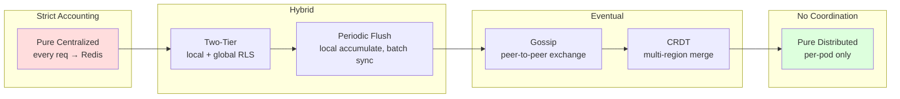

# Rate Limiter Deep Dive — Centralized vs Distributed

**Date:** 2026-04-27 | **Updated:** 2026-04-27
**Tags:** `system-design` `case-study` `rate-limiter` `deep-dive` `distributed-systems`

## Table of Contents

- [Summary](#summary)
- [Overview — The Spectrum](#overview--the-spectrum)
- [Pure Centralized (Single Redis Cluster)](#pure-centralized-single-redis-cluster)
- [Two-Tier — Envoy's Local + Global Pattern](#two-tier--envoys-local--global-pattern)
- [Pure Distributed (Per-Pod Local)](#pure-distributed-per-pod-local)
- [Periodic Flush / Batched Aggregation](#periodic-flush--batched-aggregation)
- [Gossip-Based Counter Exchange](#gossip-based-counter-exchange)
- [CRDT Counters (PN-Counter, G-Counter)](#crdt-counters-pn-counter-g-counter)
- [Multi-Region Challenges](#multi-region-challenges)
- [Failure Isolation](#failure-isolation)
- [Cost-Accuracy Frontier](#cost-accuracy-frontier)
- [Sharding the Counter Store](#sharding-the-counter-store)
- [Anti-Patterns](#anti-patterns)
- [Related](#related)
- [References](#references)

## Summary

A rate limiter has one structural decision that dominates everything else: **where does the counter live?** A single shared counter (centralized Redis) gives exact accounting at the cost of a network hop on every decision. Per-pod counters (pure distributed) give you the best latency and isolation but allow N times the configured limit when you have N pods. Between the two extremes sits a continuum — two-tier filters, periodic flush, gossip aggregation, CRDTs — each trading a measurable amount of accuracy for a measurable amount of throughput, latency, and blast-radius improvement. The right point on the curve is workload-specific: a billing-related quota tolerates almost no over-allow and pays the centralized tax willingly; an edge DDoS limiter tolerates wild over-allow because the absolute floor is "don't get crushed" rather than "be exact." This deep dive expands [section 7.2 of the rate limiter case study](../design-rate-limiter.md) by walking the whole spectrum, with sizing math, failure-mode analysis, and the patterns Stripe, Cloudflare, Envoy, and Kong actually ship.

## Overview — The Spectrum



The horizontal axis is **coordination cost**; the vertical axis (not drawn) is **enforcement tightness**. Every move right buys throughput and resilience and pays for it in worst-case over-allow.

Three numbers anchor every decision:

| Variable | Meaning | Typical range |
|----------|---------|---------------|
| **P** | Pods (or rate-limit-aware instances) | 10 – 10,000 |
| **R** | Per-pod request rate | 100 – 100,000 RPS |
| **L** | Configured limit (per key, per window) | 10 – 1,000,000 |

The **error bound** of a scheme is what fraction of L can be exceeded under adversarial timing. Pure centralized: 0%. Pure distributed: up to (P − 1) × (L per pod) per window. Everything in between has a derivable bound that depends on flush interval, gossip latency, or local-bucket size.

## Pure Centralized (Single Redis Cluster)

Every gateway pod issues a Redis call before deciding allow/deny. The Lua script in [section 7.2 of the parent doc](../design-rate-limiter.md) runs atomically: refill, check, consume, write back, set TTL — all in one `EVAL`. No other command interleaves ([Redis Lua scripting][redis-lua]).

```lua
-- Atomic token-bucket consume (centralized).
-- KEYS[1] = bucket key (e.g. "rl:user:1234:tier-pro")
-- ARGV: capacity, refill_per_ms, now_ms, requested
local key  = KEYS[1]
local cap  = tonumber(ARGV[1])
local rate = tonumber(ARGV[2])
local now  = tonumber(ARGV[3])
local req  = tonumber(ARGV[4])

local d         = redis.call("HMGET", key, "tokens", "ts")
local tokens    = tonumber(d[1]) or cap
local last      = tonumber(d[2]) or now
local elapsed   = math.max(0, now - last)
tokens          = math.min(cap, tokens + elapsed * rate)

local ok = 0
if tokens >= req then
  tokens = tokens - req
  ok = 1
end

redis.call("HMSET", key, "tokens", tokens, "ts", now)
redis.call("PEXPIRE", key, math.ceil(cap / rate) * 2)
return { ok, math.floor(tokens) }
```

### Network-hop cost

Add a Redis call to the request path and you add roughly:

- **0.3–0.8 ms** within the same AZ (same VPC, same datacenter)
- **1.5–4 ms** cross-AZ in the same region
- **30–80 ms** cross-region (and don't do this)

For an API gateway whose own p99 budget is 5 ms, a 0.5 ms Redis hop is 10% of the budget — significant but acceptable. For an edge proxy whose budget is 1 ms, it's catastrophic; this is why Cloudflare does not put Redis on the request path.

### Sizing the cluster

Capacity is dominated by per-key Lua evaluations. Modern Redis on a c6g.xlarge does roughly **80–120k ops/sec** of token-bucket Lua per primary shard. With **P** pods at **R** RPS each, the cluster needs:

```text
shards_required ≈ ceil((P × R) / 100,000)
```

A 200-pod gateway at 5,000 RPS each = 1M ops/sec → roughly 10–12 primary shards, plus replicas for failover, plus 30% headroom = a 16-shard Redis Cluster. This is a real cluster you have to operate.

### When centralized scales

- **Pod count** modest (≤ a few hundred)
- **Aggregate RPS** fits in a single Redis cluster (≤ ~1M ops/sec with comfortable headroom)
- **Latency budget** has room for sub-millisecond network hop
- **Limits are exact-money-related** (billing quotas, paid-tier APIs, regulatory caps)

### When centralized breaks

- **Hot-key stampede.** A single celebrity/whale customer keys all to one shard. That shard saturates while the rest idle. (Mitigation: hash-tag partitioning — see [Sharding](#sharding-the-counter-store).)
- **Cross-region traffic** added without a regional split. Every request from EU pays a transatlantic round-trip — no, you cannot serve it.
- **Redis cluster failure** — every gateway pod's decision depends on it. Without a fallback, you've moved the SPOF from the database to the limiter. Combine with [Failure Isolation](#failure-isolation).

Stripe ships exactly this for paid-tier API quotas: a single Redis cluster, atomic Lua, with strict accounting because the limits are dollar-bound ([Stripe Engineering blog][stripe-rl]).

## Two-Tier — Envoy's Local + Global Pattern

Envoy ships two filters that compose: **`envoy.filters.http.local_ratelimit`** (in-process token bucket per pod) and **`envoy.filters.http.ratelimit`** (gRPC to a global RLS service backed by Redis) ([Envoy global rate limit docs][envoy-grl]).

The pattern: configure local at a high but finite ceiling (e.g. "50 RPS per pod, no key cardinality"); configure global at the true policy ceiling (e.g. "100 RPS per user"). Local rejects raw flood; global enforces actual policy. Most requests never leave the pod.

```yaml
# Envoy listener — local first, global as fallback.
http_filters:
- name: envoy.filters.http.local_ratelimit
  typed_config:
    "@type": type.googleapis.com/envoy.extensions.filters.http.local_ratelimit.v3.LocalRateLimit
    stat_prefix: http_local_rate_limiter
    token_bucket:
      max_tokens: 5000
      tokens_per_fill: 5000
      fill_interval: 1s
    filter_enabled:
      runtime_key: local_rl_enabled
      default_value: { numerator: 100, denominator: HUNDRED }
- name: envoy.filters.http.ratelimit
  typed_config:
    "@type": type.googleapis.com/envoy.extensions.filters.http.ratelimit.v3.RateLimit
    domain: api_gw
    failure_mode_deny: false   # fail-open if RLS unreachable
    rate_limit_service:
      grpc_service:
        envoy_grpc:
          cluster_name: rate_limit_cluster
      transport_api_version: V3
- name: envoy.filters.http.router
```

The route attaches descriptors that the global RLS evaluates:

```yaml
rate_limits:
- actions:
  - request_headers:
      header_name: x-user-id
      descriptor_key: user
  - generic_key:
      descriptor_value: api_pro_tier
```

### Hit-rate math

Let **h** be the local-tier hit rate (fraction of requests resolved without crossing the gRPC boundary). RLS QPS is `(1 − h) × P × R`. Two cases:

- **Burst-shaped traffic.** A misbehaving client sends 10,000 RPS at one pod. Local bucket caps at 5,000 RPS → 50% of requests are rejected locally → RLS sees 5,000 RPS for that descriptor. Without the local tier, RLS would see 10,000 RPS.
- **Well-behaved traffic.** Aggregate is well below limit. Almost every request becomes a global lookup; local tier adds ~0 protection but a few microseconds of wasted CPU.

The win is asymmetric — local does almost nothing for well-behaved traffic and a *huge* amount during incidents. Run it.

### Practical configuration knobs

- **Local capacity = global limit / pod count × safety factor** (e.g. 1.5×) so legitimate traffic never local-rejects. The local tier should be a flood gate, not the policy.
- **`failure_mode_deny: false`** — if RLS is down, fall through. Combined with local, you still have *some* protection; without local, fail-open means unbounded.
- **Local tier has no key cardinality** — it's a single bucket per pod. You cannot enforce per-user limits locally; that's the global tier's job.

This is the pattern most large API gateways converge on. Lyft (Envoy's origin) uses it; Tetrate productizes it; Istio inherits it.

## Pure Distributed (Per-Pod Local)

No coordination. Each pod has its own token bucket, sized at `L / P`.

```go
// Per-pod, no network calls.
type LocalLimiter struct {
    mu       sync.Mutex
    tokens   float64
    capacity float64
    rate     float64 // tokens per ms
    last     time.Time
}

func (l *LocalLimiter) Allow() bool {
    l.mu.Lock()
    defer l.mu.Unlock()
    now := time.Now()
    elapsed := now.Sub(l.last).Milliseconds()
    l.tokens = math.Min(l.capacity, l.tokens + float64(elapsed) * l.rate)
    l.last = now
    if l.tokens >= 1 {
        l.tokens--
        return true
    }
    return false
}
```

### Best latency

A `sync.Mutex` lock and a few floating-point operations: tens of nanoseconds. No I/O. This is as fast as it gets.

### Drift bound

If load-balancing is uniform and clients hit pods round-robin, the aggregate limit is approximately `P × (L / P) = L` — the math works. But adversarial clients pin to a single pod (e.g. via long-lived HTTP/2 connections, sticky sessions, or just bad luck). Worst case: client hits one pod → sees `L / P` budget, exhausts it. Then reconnects → lands on a different pod → sees fresh `L / P`. Over a window, an adversary can extract:

```text
worst_case_throughput = P × (L / P) per reconnection cycle
                      = L per cycle, but with no memory across cycles
```

The drift bound (the *over-allow*) is bounded by `pods × per-pod-rate × interval`. If pods=200 and per-pod = 50 RPS over a 60s window, an adversary jumping pods can extract ~600,000 requests in a "100 RPS for 60s" budget. Multiply by 100x easily.

### When this is acceptable

- **Coarse limits** — DDoS first-line filters where the goal is "don't crush the origin," not "exactly N requests per user."
- **Symmetric clients with no incentive to evade** — internal services where nobody is gaming the limits.
- **The next tier downstream has its own enforcement** — e.g. local at the proxy, central at the service.
- **You cannot afford a Redis hop** — sub-millisecond budgets, edge POPs with no Redis in-region.

Cloudflare's edge does a per-machine token bucket as the *first* layer for raw L7 flood mitigation; precise per-customer accounting happens deeper in the stack against a sliding window counter ([Cloudflare counting blog][cf-counting]).

## Periodic Flush / Batched Aggregation

A compromise between pure local and pure central: each pod accumulates locally, then **flushes** counter deltas to Redis on a fixed interval (e.g. every 100 ms or every 1,000 requests). Decisions are made against a **locally cached** view of the global counter that's refreshed on flush.

### Reconciliation semantics

```text
each pod, every flush_interval:
  1. delta = local_consumed_since_last_flush
  2. global_count = redis.INCRBY(key, delta)         // returns new total
  3. local_consumed_since_last_flush = 0
  4. local_view_of_global = global_count
  5. local_remaining = max(0, limit - global_count)

each request:
  6. if local_remaining > 0:
       local_remaining--
       allow
     else:
       deny
```

Two flush parameters tune the system:

- **Flush interval** (time-based): every 100 ms. Lower = tighter accuracy, more Redis load.
- **Flush threshold** (count-based): every 1,000 requests. Adapts to load — quiet pods don't flush.

### Over-allow bound

In the worst case (everyone bursts at once between flushes), over-allow is bounded by:

```text
over_allow ≤ pods × max_local_burst_per_interval
            = P × (R × flush_interval)
```

For P=200, R=1000 RPS, flush_interval=100 ms: bound is `200 × 100 = 20,000` over-allowed requests in the worst window. If your limit is 1M/min, that's 2% over-allow — usually fine. If your limit is 100/min, that's 200x over-allow — disastrous.

### What gets lost on pod crash

The unflushed delta. If a pod consumed 800 requests since the last flush and crashes before the next flush, those 800 requests **never appear in the global counter**. Net effect: under-counting. The system over-allows the next requests because the counter looks lower than reality.

For a token bucket this self-heals on the next refill. For a fixed-window quota it does not — the lost count is permanently lost from that window. Acceptable for soft limits; not acceptable for billing-grade quotas.

This is the pattern Kong's "cluster" rate limit policy approximates: in-memory counters synced periodically across nodes.

## Gossip-Based Counter Exchange

Pods exchange counter state peer-to-peer on a gossip schedule (typically every 200 ms – 1 s). No central counter store; every pod ends up with an eventually-consistent view of every other pod's state. Hashicorp's `memberlist` is the reference implementation in Go ([memberlist][memberlist]).

```go
// Pseudocode: gossip-based aggregation.
type Counter struct {
    nodeID    string
    local     map[string]int64        // key → local count
    peers     map[string]map[string]int64  // peerID → key → count
    lock      sync.RWMutex
}

func (c *Counter) Incr(key string, delta int64) {
    c.lock.Lock()
    c.local[key] += delta
    c.lock.Unlock()
}

func (c *Counter) GlobalEstimate(key string) int64 {
    c.lock.RLock()
    defer c.lock.RUnlock()
    total := c.local[key]
    for _, peer := range c.peers {
        total += peer[key]
    }
    return total
}

// Triggered by memberlist every gossip_interval.
func (c *Counter) Broadcast() []byte {
    c.lock.RLock()
    defer c.lock.RUnlock()
    return encode(c.nodeID, c.local)
}

func (c *Counter) Receive(payload []byte) {
    peerID, snapshot := decode(payload)
    c.lock.Lock()
    c.peers[peerID] = snapshot
    c.lock.Unlock()
}
```

### Eventual consistency

Convergence time depends on gossip fan-out and interval. With memberlist defaults (gossip interval ~200 ms, 3 random peers per round), full propagation across N nodes takes roughly `O(log N) × interval` — for N=100 this is ~1.4 s.

### Latency bound

The error window is **gossip propagation time**. During the convergence window, every node has a slightly stale view of every other node's count. Worst case over-allow = `P × R × propagation_time`. Same shape as periodic flush but without a Redis dependency.

### When gossip wins

- **No central infra** — service-mesh sidecars that already gossip for membership can piggyback rate-limit state cheaply.
- **Symmetric homogeneous fleet** — every pod is equivalent, every pod is a peer.
- **Modest fleet size** — gossip is `O(N)` state per node; at thousands of nodes the memory and bandwidth grow.

### Where gossip loses

- **Asymmetric heavy-tail keys** — most keys are seen by one pod, gossiping all keys to all pods is wasteful. (Mitigation: shard keys to "owner" nodes; gossip only summaries.)
- **Tight accuracy requirements** — gossip is fundamentally eventually-consistent.

## CRDT Counters (PN-Counter, G-Counter)

Conflict-free Replicated Data Types make eventually-consistent counters mergeable across regions without coordination. Two relevant types ([Shapiro et al. 2011][crdt-paper]):

- **G-Counter** (grow-only): each replica has an integer slot; the global value is the sum of all slots; merge is element-wise max.
- **PN-Counter**: two G-counters (positive and negative); global value is `sum(P) − sum(N)`; supports decrement.

```text
// G-Counter pseudocode
GCounter {
    slots: map[replicaID]uint64
}

func (g *GCounter) Incr(replicaID) {
    g.slots[replicaID]++
}

func (g *GCounter) Value() uint64 {
    sum := 0
    for _, v := range g.slots { sum += v }
    return sum
}

func Merge(a, b GCounter) GCounter {
    out := GCounter{slots: map[string]uint64{}}
    for id, v := range a.slots { out.slots[id] = v }
    for id, v := range b.slots {
        if v > out.slots[id] { out.slots[id] = v }
    }
    return out
}

// PN-Counter
PNCounter {
    P: GCounter   // increments
    N: GCounter   // decrements
}

func (p *PNCounter) Value() int64 {
    return int64(p.P.Value()) - int64(p.N.Value())
}
```

### Why CRDTs over-allow rather than under-allow

Two regions, each replica unaware of the other for the duration of a partition. Each region accepts a request, increments its local slot, and gossips eventually. During the partition window, both regions allow up to the limit independently — net effect: up to `regions × limit` allowed requests during the window. **CRDTs converge on a sum, never on a true global cap.** They *cannot* enforce "no more than L globally" during a partition; they enforce "no more than L per region until merged."

This is why CRDT counters are a good fit for **upper-bound soft limits** (e.g., "approximately 1000 reqs/min globally, never exactly") and a terrible fit for **billing-grade caps** (e.g., "you paid for 10,000 API calls; we charge you for the 10,001st").

### When CRDTs are appropriate

- **Multi-region active-active** with cross-region partitions a real possibility.
- **Coarse limits** where 2× over-allow during a partition is preferable to denying availability in either region.
- **Long windows** (per-day, per-month) where the propagation lag is negligible relative to the window.

Riak ships PN-counters as a first-class CRDT ([Riak data types][riak-crdt]). Redis Enterprise ships CRDB with active-active CRDT counters for multi-region deployments.

## Multi-Region Challenges

Three structural problems compound:

### 1. Cross-region latency

A request in Tokyo cannot wait for a counter increment to propagate to Virginia and back — that's 150+ ms of dead air. Anything that requires synchronous global agreement is structurally incompatible with multi-region low-latency.

### 2. Region-pinned vs global counters

Two policy stances:

- **Region-pinned.** A user is anchored to their home region (by GeoDNS or session affinity). Their counter lives in that region. Cross-region traffic falls under a separate, looser rule. Simple, fast, slightly unfair to mobile users.
- **Globally aggregated.** The user has one quota across all regions. Implemented via CRDT or eventual flush, with the over-allow bound that comes with eventual consistency.

The first is what most large API providers ship. Global semantics are too expensive for marginal correctness gain.

### 3. The CAP trade-off

You cannot simultaneously have:

- **Low latency** (sub-10 ms decision)
- **Strong consistency** (no over-allow ever)
- **Multi-region availability** (each region serves during partitions)

Pick two. Most products pick low-latency + multi-region availability and accept eventual consistency. Strict-quota systems (e.g. paid API tiers with hard ceilings) pick strong-consistency + low-latency and either run single-region or accept that one region is "primary" for the counter and the other does a synchronous cross-region call (hidden in the SLA).

See [Quorum and Tunable Consistency](../../../data-consistency/quorum-and-tunable-consistency.md) for the formal model — rate limiters face the same CAP wall as Dynamo-style stores, just with simpler data structures.

## Failure Isolation

The counter store will fail. The interesting question is **how the limiter degrades**.

### Fail-open vs fail-closed

```text
on RLS unreachable / Redis timeout:
  fail-open   → allow the request, log
  fail-closed → deny the request, return 429 / 503
```

The default for nearly every public-facing API gateway is **fail-open**. Reasoning: rate limiting is a protection mechanism, not a correctness mechanism. A failure in the protection layer should not become a failure in the production layer — that's the [Network partitions and split-brain](../../../reliability/network-partitions-and-split-brain.md) failure cascade in miniature.

The exception: **billing-related quotas**. If your system promises "this is a paid feature with a strict cap" and the limiter goes down, fail-open is giving away free service. These rules deserve fail-closed — but applied selectively.

Modern gateways (Envoy, Kong) let you set the policy **per rule**:

```yaml
rate_limits:
- actions: [...]
  failure_mode_deny: false   # general API, fail-open
- actions: [...]
  failure_mode_deny: true    # billing-bound, fail-closed
```

### Watchdog and fail-to-local

A more nuanced pattern: when the global tier fails, **fall back to the local tier** (which is configured for raw flood protection but no per-key precision). Detection is via a circuit breaker on the gRPC channel to RLS — see [Failure Detection](../../../reliability/failure-detection.md).

```text
on every request:
  if rls_circuit_breaker.is_open():
    return local_filter.decide(req)
  else:
    response = call_rls(req)
    if response.timeout or response.error:
      rls_circuit_breaker.record_failure()
      return local_filter.decide(req)
    return response.decision
```

This gives you **degraded but not absent** protection during a Redis or RLS outage. The local tier was sized for "absorb a flood, not enforce policy"; during failure it covers the gap.

### Health probes and watchdogs

A separate watchdog process pings the RLS tier and the Redis cluster on a cadence independent of request traffic. On three consecutive failures, it flips a config flag that gateways read; gateways degrade to local-only until the flag clears.

## Cost-Accuracy Frontier

The full spectrum, with rough cost-per-decision numbers and where common products land:

| Pattern | Network hops/req | p99 added | Over-allow bound | Cluster cost | Where it ships |
|---------|------------------|-----------|-------------------|---------------|----------------|
| **Pure centralized (Lua)** | 1 | 0.5–2 ms | 0 | High (must scale Redis to traffic) | Stripe paid quotas; Envoy global RLS |
| **Two-tier (local + global)** | 0 if local-rejected, 1 otherwise | 0.5–2 ms on miss | 0 (when global is reached) | Medium (RLS sees only misses) | Lyft, Istio, Envoy default; Kong shared |
| **Periodic flush** | 1 every N requests | <0.1 ms (amortized) | P × R × flush_interval | Low (Redis sees deltas, not requests) | Kong cluster mode; some homegrown |
| **Gossip** | 0 (background) | ~0 | P × R × propagation_time | Very low (no central store) | Service-mesh sidecars; HashiCorp Nomad-style |
| **CRDT (multi-region)** | 0 (async merge) | ~0 | regions × limit during partition | Low | Riak counters; Redis Enterprise CRDB |
| **Pure distributed (per-pod)** | 0 | ~0 | P × (L/P) × adversarial = up to P×L | None | Cloudflare edge first-line; embedded library limiters |

### Where common products land

- **Stripe API** — pure centralized for paid-tier limits; the limit *is* a billing line item, so they pay the centralization cost.
- **Cloudflare WAF / DDoS** — per-edge-machine local for raw flood absorption; sliding-window counter sync for per-customer policy ([Cloudflare counting blog][cf-counting]).
- **Envoy global rate limit** — two-tier by design. Local first, global on miss. Reference architecture for service-mesh ([Envoy docs][envoy-grl]).
- **Kong** — multiple policies: `local` (per-node), `cluster` (DB-backed flush), `redis` (centralized), pick per use case.
- **AWS API Gateway** — opaque, but documented behavior is consistent with token bucket per-account in a sharded counter store with eventual cross-region propagation.

## Sharding the Counter Store

When centralized (or two-tier with global), you almost always cluster Redis. Two patterns:

### Hash-tagged keys for cluster-affinity

Redis Cluster routes a key to a shard by hashing it. Keys with the same `{...}` tag hash identically and land on the same shard ([Redis hash tags][redis-tags]):

```text
# Without hash tag — keys land on different shards.
rl:user:1234:tier-pro
rl:user:1234:burst

# With hash tag — both keys land on the same shard.
rl:{user:1234}:tier-pro
rl:{user:1234}:burst
```

Why this matters: a Lua script can only access keys on the same shard. If your script needs to read both the per-user counter and a per-tier counter, they must be hash-tag-co-located. Mis-tag and you get `CROSSSLOT Keys in request don't hash to the same slot`.

### Shard placement pitfalls

- **All keys for one whale customer hash to one shard.** That shard's CPU saturates while siblings idle. Traditional sharding fixes this by **sub-keying** — hash by `(user_id, request_id % N)` where N is small, then sum across N keys at decision time. Trades exactness for spread.
- **Unbalanced shards over time.** Customer churn shifts the hot key set; shards that were balanced last quarter are skewed now. Plan for resharding or use **client-side consistent hashing with virtual nodes** (the Dynamo-style approach — see [Sharding Strategies](../../../scalability/sharding-strategies.md)).
- **Cross-shard atomicity is not free.** Lua doesn't span shards. A "global" counter that needs to enforce both "100 RPS this user" and "10,000 RPS this tier across all users" requires either co-location (hash tag both keys to the same shard, sacrificing tier shard distribution) or a higher-level coordinator (sequential calls with reconciliation).

### Hot-shard mitigation

- **Per-key sub-keying.** Split a hot bucket into N counters, decide by reading all N. Acceptable if N is small (e.g. 4) and the read budget tolerates N reads.
- **Local cache with short TTL.** For *very* hot keys, cache the global counter at the gateway with a 50–100 ms TTL. Decisions during the TTL are stale-but-fast.
- **Move the hot key out.** If one customer is genuinely 10× the next, give them their own shard explicitly. Also called *per-tenant sharding* — operationally heavier but bounded.

## Anti-Patterns

- **Naive `INCR` then `EXPIRE`.** Two separate commands; if the process dies between them the key has no TTL and leaks. Use the atomic Lua script. Already covered in [section 7.3 of the parent doc](../design-rate-limiter.md).
- **Synchronous cross-region Redis writes on the request path.** 100 ms+ latency added to every decision. Region-pin or use CRDT instead.
- **Fail-closed for everything.** Single Redis outage = total API outage. Match failure mode to the policy: fail-closed only for billing-bound rules.
- **Per-pod limits sized as if pods=1.** "100 RPS per user" enforced per-pod with 200 pods = 20,000 RPS effective. Either centralize or size local at `L / P`.
- **Hash-tag everything to one tag.** Defeats sharding entirely; everything hashes to one shard. Use hash tags for *related* keys, not all keys.
- **Mixing strict and loose limits in the same data structure.** A token bucket whose semantics are "approximate during partitions" cannot also be the source of truth for "you exceeded your paid quota." Separate them — use centralized for the strict ones.
- **No watchdog / no fallback.** Rate limiter goes down → unbounded traffic to backend → backend goes down. The limiter must degrade, not vanish.
- **Treating a CRDT as a strict cap.** PN-counters cannot enforce a global cap during a partition; they only converge after one. If the SLA says "no more than N globally," CRDTs do not satisfy it.

## Related

- [Design a Rate Limiter — Case Study](../design-rate-limiter.md) — parent doc with section 7.2 this expands.
- [Sharding Strategies](../../../scalability/sharding-strategies.md) — consistent hashing, hash tags, shard rebalancing.
- [Quorum and Tunable Consistency](../../../data-consistency/quorum-and-tunable-consistency.md) — the same CAP wall, applied to counters.
- [Failure Detection](../../../reliability/failure-detection.md) — circuit breakers and watchdogs for fail-to-local.
- [Network Partitions and Split-Brain](../../../reliability/network-partitions-and-split-brain.md) — multi-region failure modes.
- [Multi-Region Architectures](../../../reliability/multi-region-architectures.md) — broader context for region-pinned vs global state.

## References

- Envoy Proxy. *Global rate limiting architecture overview.* <https://www.envoyproxy.io/docs/envoy/latest/intro/arch_overview/other_features/global_rate_limiting>
- Envoy Proxy. *Local rate limit filter.* <https://www.envoyproxy.io/docs/envoy/latest/configuration/http/http_filters/local_rate_limit_filter>
- Stripe Engineering. *Scaling your API with rate limiters.* <https://stripe.com/blog/rate-limiters>
- Cloudflare. *Counting things, a lot of different things.* <https://blog.cloudflare.com/counting-things-a-lot-of-different-things/>
- Redis. *Hash tags — keys hash slot.* <https://redis.io/docs/latest/operate/oss_and_stack/reference/cluster-spec/#hash-tags>
- Redis. *EVAL command and Lua scripting.* <https://redis.io/docs/latest/commands/eval/>
- Shapiro, Preguiça, Baquero, Zawirski. *A comprehensive study of Convergent and Commutative Replicated Data Types.* INRIA RR-7506, 2011. <https://hal.inria.fr/inria-00555588/document>
- HashiCorp. *memberlist — gossip-based cluster membership.* <https://github.com/hashicorp/memberlist>
- Riak. *Data types — counters, sets, maps.* <https://docs.riak.com/riak/kv/latest/developing/data-types/>

[redis-lua]: https://redis.io/docs/latest/commands/eval/
[envoy-grl]: https://www.envoyproxy.io/docs/envoy/latest/intro/arch_overview/other_features/global_rate_limiting
[stripe-rl]: https://stripe.com/blog/rate-limiters
[cf-counting]: https://blog.cloudflare.com/counting-things-a-lot-of-different-things/
[redis-tags]: https://redis.io/docs/latest/operate/oss_and_stack/reference/cluster-spec/#hash-tags
[crdt-paper]: https://hal.inria.fr/inria-00555588/document
[memberlist]: https://github.com/hashicorp/memberlist
[riak-crdt]: https://docs.riak.com/riak/kv/latest/developing/data-types/
