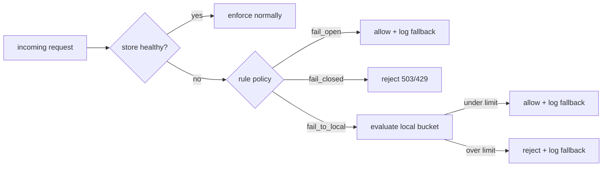
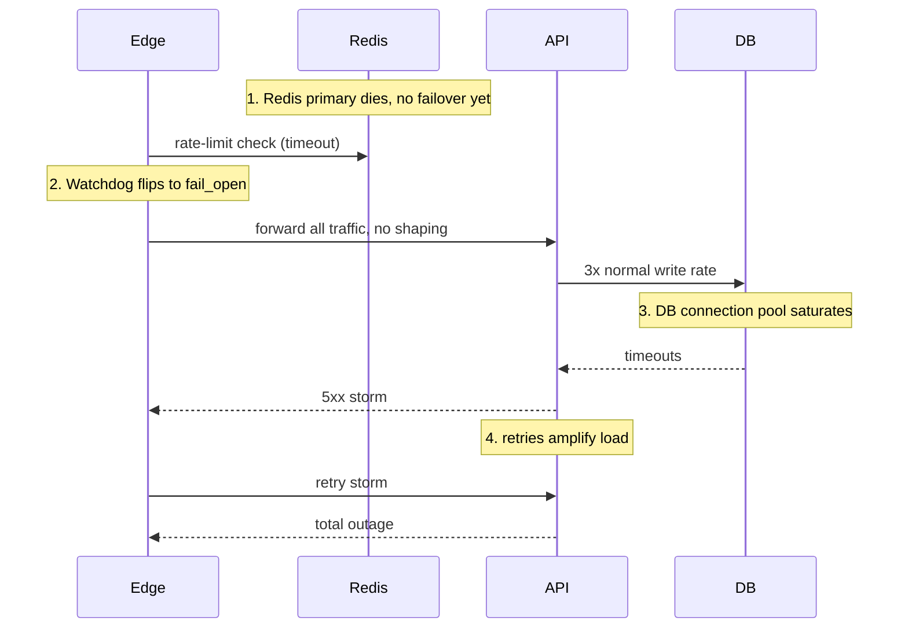

# Rate Limiter Deep Dive — Failure Modes

**Date:** 2026-04-27 | **Updated:** 2026-04-27
**Tags:** `system-design` `case-study` `rate-limiter` `deep-dive` `reliability` `failure-modes`

## Table of Contents

- [Summary](#summary)
- [Overview](#overview)
- [Fail Open](#fail-open)
- [Fail Closed](#fail-closed)
- [Fail to Local](#fail-to-local)
- [Per-Rule Policy](#per-rule-policy)
- [Watchdog and Health Checks](#watchdog-and-health-checks)
- [Cascading Failures](#cascading-failures)
- [Partial Failure](#partial-failure)
- [Network Partition Handling](#network-partition-handling)
- [Graceful Degradation Tiers](#graceful-degradation-tiers)
- [Chaos Engineering for Rate Limiters](#chaos-engineering-for-rate-limiters)
- [Observability of Failure Mode Changes](#observability-of-failure-mode-changes)
- [Anti-Patterns](#anti-patterns)
- [Related](#related)
- [References](#references)

## Summary

A distributed rate limiter sits on the hottest path in your system. Every request touches it, and every request expects a sub-millisecond verdict. That makes its failure modes uniquely consequential — when the counter store (typically Redis) is unreachable, you must decide in advance whether to **let everything through** (fail open), **block everything** (fail closed), or **fall back to a conservative in-process limiter** (fail to local). The wrong default can either cause an outage that did not need to happen, or invite the very overload the limiter was supposed to prevent. This doc expands section 7.5 of the parent rate-limiter case study into a careful treatment: per-rule policy, watchdog patterns, cascading-failure dynamics, partial failure across a Redis cluster, network-partition behavior during failover, graceful-degradation tiers, chaos drills, and the observability you need so the team actually notices when the limiter is in fallback mode.

## Overview

The rate limiter has two failure surfaces that get conflated:

1. **The store is sick** — Redis primary unreachable, replica lagging, cluster shard missing, network partition between the limiter pod and the store.
2. **The store is fine but slow** — p99 latency on the rate-limit lookup blows past the request budget; timeouts pile up; the limiter itself becomes the source of latency.

A robust design treats both as the same class of event: **the centralized verdict is unavailable in time**. The question is what to do with the request you are holding.

There are three primary strategies, and which one you pick is **per rule**, not global:



The rest of this doc walks each strategy, then the operational discipline (watchdogs, chaos, observability) that keeps it honest.

## Fail Open

**Default for most public APIs.** When the rate-limit store is unreachable, allow the request through with an unenforced verdict. The reasoning: an outage of the limiter should not cause an outage of the product. If the limit was protecting against a 1-in-10000 abuser, keeping the other 9999 users serviced is the right call.

When fail-open is acceptable:

- **Quota / fairness limits** — free-tier requests-per-day, anti-abuse on signup, generous "be reasonable" caps on read endpoints.
- **The protected resource is not at risk under normal traffic** — the limit exists for the tail, not the median. If the median request can be served safely without the limiter, you can fail open without harming the system.
- **There is a lower-level safety net** — the application server has its own concurrency bulkhead, the database has connection-pool limits, the LB does basic DDoS protection. The rate limiter is one layer of defense, not the only one.

When fail-open is dangerous:

- The limit is the **only** thing standing between an attacker and an expensive operation (password verification, signup, password reset emails).
- The protected dependency cannot tolerate even a brief surge (a fragile legacy integration, a paid third-party API with a hard cap).
- Failing open changes the economic contract — you suddenly serve requests that the customer is not paying for, or that you are not paying upstream costs for.

### How to alert when running open

Failing open silently is the worst of both worlds — no enforcement and no awareness. Required signals:

- **Per-request flag** — every response served in fallback mode carries a structured log field (`rl.fallback=true`, `rl.fallback_reason=store_timeout`) and an internal header on the response object so downstream services can reason about it.
- **Counter metric** — `rate_limiter_requests_total{mode="fail_open"}` incremented every time the fallback fires.
- **Ratio alert** — page when `fail_open_requests / total_requests > 1%` for more than 60 seconds. The threshold is per-service; high-traffic edges may want 0.1%.
- **Duration alert** — fallback for any single rule for more than 5 minutes is an incident even if the ratio is low — the limiter has been silently disabled for that surface.
- **Synthetic probe** — a probe job hits the rate-limit store independently and fires its own alert, decoupled from request volume.

A small amount of fail-open noise is normal during deploys and Redis failovers. The dashboards should distinguish between **transient** (under 30s) and **sustained** fallback. The runbook should answer: "is this a known failover, a network blip, or a real Redis outage?"

## Fail Closed

**Default for safety-critical limits.** When the store is unreachable, reject the request. The reasoning: serving a request that bypasses the limit is worse than not serving it at all.

When fail-closed is correct:

- **Auth surfaces** — login, password verification, MFA challenges, password reset. Fail-open here lets an attacker brute-force unimpeded the moment the limiter blinks.
- **Billing-impacting calls** — usage-billed APIs where excess use is converted to dollars; outbound paid integrations (SMS, email, third-party LLM tokens, payment-processor calls).
- **Hard regulatory caps** — limits required by contract or law (e.g., PII export rate, regulator-mandated transaction throttles, KYC step-up triggers).
- **Anti-DoS at the edge for known-expensive endpoints** — full-text search, expensive analytics queries, large file generation.

The cost of fail-closed is real — every Redis blip becomes a partial outage on those endpoints. So make it safe to live with:

### Admin override

Provide an out-of-band "panic open" toggle that ops can flip in seconds. Properties:

- Distinct from the rate-limit config itself — flipping it does **not** require the rate-limit store to be up.
- Per-rule (you are not opening the floodgates everywhere).
- Audited, time-bound, with a default expiry of 1 hour.
- Surfaces in dashboards as a banner — there should be no question that the limiter is in manual override.

### Circuit-breaker-of-circuit-breakers

A fail-closed rule held open by a downstream incident can itself become a cascading-failure source (every login fails because Redis is sick, support tickets pile up, the auth team is paged for what looks like an auth outage). Wrap the fail-closed rule in a meta-breaker:

- If the rule is rejecting more than X% of traffic for Y minutes due to store failure (not policy violation), trip a higher-level breaker that switches the rule to **fail-to-local with very low limits** until ops intervenes.
- This is graceful degradation applied to the limiter itself: instead of "fully closed" or "fully open", you fall to "barely open" — enough to let real users through at a low rate while still throttling abuse.

## Fail to Local

The pragmatic middle path. Each enforcement pod keeps a small in-process token bucket that activates only when the centralized store is unhealthy. Stripe and Envoy both expose this pattern (Envoy's `local_rate_limit` filter is explicitly designed to be combined with `ratelimit` for global enforcement plus local fallback).

The shape:

```text
healthy:    pod -> Redis (global counter, accurate)
degraded:   pod -> in-process bucket (conservative, per-pod)
```

Properties:

- The local bucket is **strictly smaller** than the global limit divided by the number of pods. If the global limit is 10000 rps and you have 20 pods, do not set the local fallback to 500 rps each — that re-creates the global limit with no consistency. Set it to **half** of the per-pod share or less, accepting that fallback over-protects rather than under-protects.
- The fallback bucket is **kept warm** — it tracks recent traffic in steady state so it is not cold-started when fallback fires. Some implementations use a sliding-window estimator that is always running but ignored when the global counter is healthy.
- The fallback decision is **fast** — the local check must add no more than ~50µs to request handling, otherwise it becomes a different kind of latency hazard.

### How to size the conservative fallback

Three inputs:

1. **Per-pod fair share of the global limit.** `share = global_limit / pod_count`.
2. **A conservatism factor.** Typical `0.3 to 0.5` — the fallback should let through the legitimate steady-state traffic but not the spiky surges that the global limiter would have shaped.
3. **A floor.** A minimum that keeps the service usable even at small pod counts — say 5 rps per pod, so a single-pod redeploy does not nuke the service.

```text
local_fallback_rate = max(floor, share * conservatism)
```

For a 10k rps global limit across 20 pods with conservatism 0.4 and floor 10 rps:

```text
share = 10000 / 20 = 500
local_fallback = max(10, 500 * 0.4) = 200 rps per pod
fleet_capacity_during_fallback = 200 * 20 = 4000 rps  (40% of global)
```

That is the intentional trade-off: during fallback you serve 40% of peak, which is enough for most steady-state traffic and far less than the unbounded fail-open path.

### Initialization

The local bucket should not be allocated lazily inside the request hot path. Initialize at startup, keep it in a per-rule registry, and refill via a background goroutine (or equivalent) on a fixed tick.

```go
// fallback bucket initialization, per rule, called at process start
type LocalBucket struct {
    rate     int           // tokens per second
    burst    int           // max bucket size
    tokens   atomic.Int64  // current tokens, scaled
    lastTick atomic.Int64  // unix nanos
}

func NewLocalBucket(rate, burst int) *LocalBucket {
    b := &LocalBucket{rate: rate, burst: burst}
    b.tokens.Store(int64(burst))
    b.lastTick.Store(time.Now().UnixNano())
    return b
}

// hot path: allow returns true if a token was consumed
func (b *LocalBucket) Allow() bool {
    now := time.Now().UnixNano()
    last := b.lastTick.Swap(now)
    elapsed := time.Duration(now - last)
    refill := int64(elapsed.Seconds() * float64(b.rate))
    if refill > 0 {
        cur := b.tokens.Load() + refill
        if cur > int64(b.burst) {
            cur = int64(b.burst)
        }
        b.tokens.Store(cur)
    }
    if b.tokens.Load() > 0 {
        b.tokens.Add(-1)
        return true
    }
    return false
}
```

This is intentionally lock-free on the hot path; the bucket is per-rule per-pod, so contention is bounded by request concurrency on a single pod.

## Per-Rule Policy

The single most important insight in this whole topic: **failure mode is per rule, not global**. A rule protecting login should fail closed; a rule shaping a free-tier read endpoint should fail open; a rule on an expensive search endpoint might fail to local. Lumping all rules into one global policy is how teams end up either too brittle (everything closed → tiny Redis blip = full outage) or too permissive (everything open → Redis dies = backend dies).

Encode the policy in the rule definition itself:

```json
{
  "id": "rl.login.per_ip",
  "rate": 5,
  "period": "1m",
  "descriptor": ["ip"],
  "on_store_failure": "fail_closed",
  "store_failure_admin_override_key": "ops.rl.login.panic_open",
  "metric_label": "auth.login"
}
```

```json
{
  "id": "rl.search.per_user",
  "rate": 30,
  "period": "1m",
  "descriptor": ["user_id"],
  "on_store_failure": "fail_to_local",
  "local_fallback_rate": 10,
  "local_fallback_burst": 20,
  "metric_label": "search.query"
}
```

```json
{
  "id": "rl.feed.per_user",
  "rate": 600,
  "period": "1m",
  "descriptor": ["user_id"],
  "on_store_failure": "fail_open",
  "fail_open_log_level": "warn",
  "metric_label": "feed.read"
}
```

Schema fields worth standardizing across rules:

| Field | Type | Purpose |
|-------|------|---------|
| `on_store_failure` | enum: `fail_open`, `fail_closed`, `fail_to_local` | Primary policy |
| `local_fallback_rate` | int | Required if `fail_to_local`; per-pod token rate |
| `local_fallback_burst` | int | Bucket size for the local fallback |
| `store_failure_admin_override_key` | string | Flag key for the panic switch |
| `fail_open_log_level` | enum: `info`, `warn`, `error` | Some fail-open events should page; most should not |
| `metric_label` | string | Stable label so fallback metrics aggregate cleanly |

Validate the schema at config-load time. A rule with `fail_to_local` but no `local_fallback_rate` is a bug — fail the deploy, do not silently default.

## Watchdog and Health Checks

Do not detect store failure from the request hot path alone. By the time enough requests have timed out to trip a circuit breaker, you have already burned latency budget on every one of them. Run an **independent health probe**.

Properties of the probe:

- **Out-of-band** — a goroutine, dedicated thread, or sidecar that pings the store on a fixed cadence (e.g., every 200ms).
- **Cheap** — `PING` or a tiny `GET` against a dedicated key, not a real rate-limit operation.
- **Threshold-based** — `n` consecutive failures within a window flips the breaker; `m` consecutive successes flips it back. Avoid flapping by using different thresholds for open and close (asymmetric hysteresis).
- **Per-target** — if you have multiple Redis shards, probe each independently. A single shard failure should not blackhole healthy ones (see Partial Failure below).

```go
// watchdog probe loop, per-store-target
type StoreHealth struct {
    healthy        atomic.Bool
    consecFails    atomic.Int32
    consecOK       atomic.Int32
    failsToOpen    int32 // e.g. 3
    oksToClose     int32 // e.g. 5
}

func (h *StoreHealth) probeLoop(ctx context.Context, client redis.Cmdable, interval time.Duration) {
    h.healthy.Store(true)
    t := time.NewTicker(interval)
    defer t.Stop()
    for {
        select {
        case <-ctx.Done():
            return
        case <-t.C:
            ok := h.probeOnce(client)
            if ok {
                h.consecFails.Store(0)
                if h.consecOK.Add(1) >= h.oksToClose && !h.healthy.Load() {
                    h.healthy.Store(true)
                    metrics.Incr("rate_limiter.store.recovered")
                }
            } else {
                h.consecOK.Store(0)
                if h.consecFails.Add(1) >= h.failsToOpen && h.healthy.Load() {
                    h.healthy.Store(false)
                    metrics.Incr("rate_limiter.store.failed")
                }
            }
        }
    }
}

func (h *StoreHealth) probeOnce(client redis.Cmdable) bool {
    ctx, cancel := context.WithTimeout(context.Background(), 50*time.Millisecond)
    defer cancel()
    return client.Ping(ctx).Err() == nil
}

// hot path consults this
func (h *StoreHealth) Healthy() bool { return h.healthy.Load() }
```

The request path then does:

```go
if !storeHealth.Healthy() {
    return policy.OnStoreFailure(rule, req)  // fail_open / fail_closed / fail_to_local
}
ctx, cancel := context.WithTimeout(req.Context(), 5*time.Millisecond)
defer cancel()
verdict, err := redisLimiter.Check(ctx, rule, req)
if err != nil {
    metrics.Incr("rate_limiter.store.hot_path_error", "rule", rule.ID)
    return policy.OnStoreFailure(rule, req)
}
return verdict
```

Two key properties:

- The **hot path never waits the full Redis timeout** when the breaker is open. The probe has already declared the store unhealthy; we go straight to the fallback policy.
- The **timeout is per-request and tight** (a few ms). A slow store is treated the same as a dead store for the purpose of the hot path. Pile-ups are the enemy.

## Cascading Failures

The counterintuitive lesson: **failing open at the rate limiter can cause the very outage you were trying to prevent.**

The classic chain:



Steps 3 and 4 are where the cascade lives. The rate limiter was protecting the DB; without it, the DB falls over; once the DB falls over, the API does too, and now the whole service is down — far worse than a partial outage on the limiter.

Mitigations:

- For **rules that are protecting a fragile downstream**, the correct policy is `fail_to_local` or `fail_closed`, not `fail_open`. The rule declaration should reflect what it is actually protecting.
- **Bulkheads downstream of the limiter** — bounded connection pools, request budgets per dependency, queue limits. The rate limiter being open should not be the only thing standing between traffic and the DB. See `../../../scalability/backpressure-bulkhead-circuit-breaker.md`.
- **Backend self-protection** — the API itself has its own load shedder (Stripe's "criticality classes" pattern). When CPU or queue depth crosses a threshold, the API sheds non-critical traffic regardless of what the rate limiter said.
- **Retry budgets** — clients use a token-bucket retry budget so a service-side 5xx storm does not get amplified by client retries.
- **Disable retries during fallback** — when the limiter is in fallback and the API is shedding, set `Retry-After` long and break client retry loops explicitly.

The principle: **defense in depth**. The rate limiter is not the only safety belt; build the rest of the system as if it might be wrong.

## Partial Failure

Real Redis deployments are clusters with N shards. "Redis is down" is rarely the actual incident. More often: **one shard is down, the others are fine**.

Symptoms:

- Some keys map to the dead shard and time out; others succeed.
- The fail-open ratio metric is non-zero but well below 100%.
- A specific subset of users (those whose `user_id` hashes to the dead shard) is silently un-rate-limited.

Handling:

- **Per-shard health.** The watchdog tracks each shard independently. A request whose key hashes to a dead shard goes to the fallback policy; a request whose key hashes to a healthy shard proceeds normally.
- **Per-rule, per-shard fallback policy.** A rule with `fail_closed` rejects only the requests whose key would have gone to the dead shard, not all requests.
- **Hot-key awareness.** If the dead shard is hosting a hot key (a celebrity user, a busy tenant), the impact is wildly disproportionate. Use the random-suffix sharding from section 7.4 of the parent doc to spread hot keys across shards before the incident, not after.
- **Replica reads on store failure.** If the primary for shard `k` is down but the replica is healthy, you can serve **read-only** rate-limit checks (e.g., "are we over limit?") from the replica until failover completes. You cannot do `INCR` on a replica, so this is not a full substitute, but it is better than the fallback for some rules.

A graceful partial-failure response is far better than the binary "all healthy / all dead" model. Most production incidents are partial.

## Network Partition Handling

A network partition between the limiter pod and the Redis primary is operationally indistinguishable from a Redis outage. But the dynamics during a **failover** are subtly different and worth calling out.

### Split-brain during failover

A typical Redis Sentinel or Redis Cluster failover sequence:

1. Primary becomes unreachable from sentinels (or hits health-check threshold).
2. Sentinels elect a new primary from the replicas.
3. Clients are redirected to the new primary.
4. The old primary, if still alive but partitioned, may continue accepting writes from clients that have not yet been redirected.

That fourth point is the split-brain risk. For rate-limiting specifically, the impact is bounded — the worst case is double-counted decrements during the failover window, which means the limiter is **slightly more permissive** than its quota for a few seconds. That is usually acceptable. It is much less acceptable for billing or deduplication, where Redis is a poor choice in the first place.

### Quorum settings

Redis Cluster's `cluster-replica-validity-factor` and Sentinel's `quorum` settings govern how aggressive failover is. Tighter quorum means fewer false failovers but slower recovery from real ones; looser means faster recovery but more risk of split-brain. For rate-limiting, prefer **fast recovery** — a few seconds of split-brain is cheaper than a minute of fail-open.

### `wait_for_replica_acks`

Redis 7+ supports `WAIT` to block until N replicas acknowledge a write before returning. For a rate limiter, **do not use `WAIT` on the hot path** — it converts every request into a multi-RTT operation and destroys p99. The limiter is already an "approximately correct" component; chasing strict durability of counts is the wrong battle.

The trade-off is explicit:

| `WAIT` setting | Latency | Durability | Suitability for rate limiting |
|----------------|---------|------------|-------------------------------|
| `WAIT 0 0` (default) | One RTT | Async to replicas | Correct choice |
| `WAIT 1 50` | Two RTT, 50ms cap | Acked by 1 replica | Acceptable for billing-class rules only |
| `WAIT 2 200` | Three RTT, 200ms cap | Strong durability | Too slow; do not use |

If you really need durable counters (e.g., a true monthly billing meter), the correct architecture is **not Redis on the hot path with `WAIT`**, but a separate write-ahead-log + materialized aggregate with the rate limiter operating on a softer derived value.

For more on partition dynamics, see `../../../reliability/network-partitions-and-split-brain.md`.

## Graceful Degradation Tiers

Borrowing the tiered model from `../../../reliability/graceful-degradation-and-feature-flags.md` and applying it to the limiter:

| Tier | Name | Behavior | Trigger |
|------|------|----------|---------|
| T0 | Full enforcement | Centralized counters, all rules active | Normal |
| T1 | Looser fallback | Centralized counters with relaxed limits (e.g., 1.5x burst) | Store p99 latency > 10ms for 30s |
| T2 | Fail-to-local | In-process buckets per pod, conservative limits | Store breaker open |
| T3 | Fail-open with logging | Pass through, structured fallback log per request | Local bucket itself unhealthy / disabled |
| T4 | Hard fail-closed | Block traffic on the rule | Admin override or meta-breaker tripped |

T1 and T3 are the often-missed middle tiers:

- **T1 (looser fallback)** is what you do when the store is alive but groaning. Instead of timing out 10% of requests, relax the limit slightly so the store handles the load. This is a gentle backpressure release — counters become a bit less precise to keep the system serving.
- **T3 (fail-open with logging)** is the explicit "we know we are not enforcing right now" state. It should be visually obvious on dashboards.

Trigger conditions live in config, not code. Operators can tune tier boundaries during an incident.

```yaml
rate_limiter:
  tiers:
    - name: T0_full
      condition: store.p99_ms < 5 AND store.error_rate < 0.001
    - name: T1_loose
      condition: store.p99_ms < 20 AND store.error_rate < 0.01
      multiplier: 1.5
    - name: T2_local
      condition: store.healthy == false
      policy_per_rule: true
    - name: T3_open
      condition: local.healthy == false
    - name: T4_admin_closed
      condition: ops.rate_limiter.panic_close == true
```

## Chaos Engineering for Rate Limiters

Failure modes you have not exercised do not work. Treat the rate limiter as a tier-1 system and run game days against it.

Game-day scenarios worth running quarterly:

1. **Redis primary kill.** SSH into the primary, `kill -9` the redis-server process. Watch failover, watch fallback metrics, watch user-visible latency.
2. **Redis primary slow-loris.** Inject 100ms latency on the primary's network interface using `tc qdisc`. The store is "alive" but slow. Does the watchdog catch it before request budgets blow?
3. **Single shard outage.** In a clustered setup, take down one shard. Verify only the affected key range falls back and other rules continue normally.
4. **Network partition.** Use iptables to drop traffic between the limiter pods and Redis for 60 seconds. Watch the breaker open, watch traffic survive on local fallback, watch the breaker close cleanly when partition heals.
5. **Total cluster outage.** Kill the entire Redis cluster. Every rule should fall to its declared fallback policy. Verify that fail-closed rules actually reject and fail-open rules actually allow.
6. **Slow recovery.** Bring the cluster back gradually with one shard at a time. Verify that partial recovery is handled cleanly.
7. **Config push during incident.** Push a rule config change while the store is degraded. The deploy path should not depend on the store being healthy.
8. **Admin override exercise.** Flip the panic switch on a fail-closed rule, verify it opens; flip it back, verify it closes. Time the propagation.

Reference: Netflix's Chaos Monkey philosophy (https://principlesofchaos.org/) — fail randomly in production, build the muscle to handle failure routinely. Game days are the structured cousin: scheduled, scripted, with explicit success criteria.

For a deeper treatment of game-day discipline, see `../../../reliability/chaos-engineering-and-game-days.md`.

## Observability of Failure Mode Changes

A rate limiter in fallback that nobody notices is a rate limiter that is not running. Required observability:

### Metrics

| Metric | Purpose |
|--------|---------|
| `rate_limiter.requests_total{rule, mode}` | Total checks; `mode` ∈ `enforced`, `fail_open`, `fail_closed`, `fail_to_local` |
| `rate_limiter.store.healthy{shard}` | Gauge per shard: 1 healthy, 0 down |
| `rate_limiter.store.latency_seconds{quantile,operation}` | p50/p95/p99 of store ops |
| `rate_limiter.fallback_ratio{rule}` | `fallback_requests / total_requests` per rule, 1m window |
| `rate_limiter.tier_current` | Current degradation tier (0–4) |
| `rate_limiter.tier_transitions_total{from,to}` | Counter of tier flips, incident forensics |
| `rate_limiter.local_bucket_saturation{rule}` | How full each local bucket is when fallback is active |

### Alerts

- **Page**: any rule in `fail_closed` mode rejecting traffic due to store failure for > 60s.
- **Page**: fleet-wide fallback ratio > 1% for > 60s.
- **Page**: tier transition to T3 or T4.
- **Warn**: single-rule fallback ratio > 5% for > 5m even if fleet-wide is fine.
- **Warn**: store p99 > 20ms for > 5m (precursor to fallback).
- **Info / record**: every tier transition, even brief ones, for post-incident review.

### Dashboards

A single "Rate Limiter Health" dashboard with:

- Current tier as a big colored block at the top.
- Time series of fallback ratio per rule, top 10.
- Store p50/p95/p99 latency per shard.
- Per-rule reject rates split by reason: `policy_violation` vs `store_failure`.
- Local bucket saturation, top 10.
- Annotation lane for tier transitions and admin-override flips.

This dashboard is the on-call's first stop during a "is the limiter the cause or a symptom?" question. If you cannot answer that question in 15 seconds, the dashboard is wrong.

For dashboard structure conventions, see `../../../reliability/graceful-degradation-and-feature-flags.md` and the parent dashboards-runbooks-on-call doc referenced from there.

## Anti-Patterns

- **Global fail-open as the only policy.** "Just let everything through if Redis is down" sounds humane and is sometimes a cascading-failure machine. Per-rule policy is non-negotiable.
- **Global fail-closed as the only policy.** Equally bad — every Redis hiccup becomes a full outage. The policy must reflect what each rule is actually protecting.
- **No watchdog; detect failure from the hot path.** Means every Redis blip burns request latency budget while you discover what is already obvious.
- **Local fallback sized at full per-pod fair share.** Re-creates the global limit with no consistency, which means under fallback you serve more than the global limit allowed.
- **Silent fail-open.** No metrics, no logs, no alerting. The limiter is effectively off and nobody knows. The first sign is a security or billing incident.
- **Treating the rate-limit store as durable.** Rate-limit counters are an estimate. Building billing or critical state on them invites correctness bugs that no amount of `WAIT` can save.
- **Configuring failover thresholds for safety, not speed.** A 30-second failover is too slow. Tune for fast recovery; the cost of split-brain on rate-limit counters is small.
- **No game-day exercise of the kill switches.** A panic-open admin override that has never been flipped is a hope, not a control.
- **Logging fallback at `error` level for every request.** Floods the log pipeline during an incident, costs money, drowns the actually-useful signals. Use `warn` once per N seconds with a counter.
- **One rate limiter for everything.** Auth, billing, free-tier, search, internal calls — all the same store, all the same policy. Different rules have different blast radii; treat them differently.
- **Skipping the meta-breaker on fail-closed rules.** Without it, a downstream Redis outage becomes an indefinite auth outage. The meta-breaker is the safety on the safety.

## Related

- [../design-rate-limiter.md](../design-rate-limiter.md) — parent case study; section 7.5 is the entry point this doc expands.
- [../../../reliability/graceful-degradation-and-feature-flags.md](../../../reliability/graceful-degradation-and-feature-flags.md) — tiered degradation and kill-switch discipline that this doc applies to the limiter.
- [../../../reliability/chaos-engineering-and-game-days.md](../../../reliability/chaos-engineering-and-game-days.md) — game-day structure for exercising the fallback paths described here.
- [../../../reliability/network-partitions-and-split-brain.md](../../../reliability/network-partitions-and-split-brain.md) — broader treatment of the partition and failover dynamics that affect the Redis store.
- [../../../scalability/backpressure-bulkhead-circuit-breaker.md](../../../scalability/backpressure-bulkhead-circuit-breaker.md) — the runtime mechanisms (breaker, bulkhead, retry budget) that compose with the limiter's failure modes to prevent cascading failure.

## References

- Stripe Engineering — "Scaling your API with rate limiters." Covers Stripe's tiered limiter (request rate, concurrent in-flight, criticality-class shedding) and the explicit fallback to local enforcement when the central store is unavailable. <https://stripe.com/blog/rate-limiters>
- Envoy Proxy Documentation — "Global rate limiting" filter configuration. Documents the combination of the global `ratelimit` service with a `local_rate_limit` filter as a fail-to-local pattern. <https://www.envoyproxy.io/docs/envoy/latest/intro/arch_overview/other_features/global_rate_limiting>
- Envoy Proxy Documentation — "Local rate limit" filter, the in-process token bucket used as a fallback or first-line defense. <https://www.envoyproxy.io/docs/envoy/latest/configuration/http/http_filters/local_rate_limit_filter>
- Principles of Chaos Engineering — Netflix-originated discipline for building confidence in system behavior under turbulent conditions; the philosophical basis for the game-day scenarios in this doc. <https://principlesofchaos.org/>
- Google SRE Book — "Handling Overload," chapter 21. Covers load shedding, criticality classes, retry budgets, and the cascading-failure dynamics that make fail-open dangerous on protected paths. <https://sre.google/sre-book/handling-overload/>
- Google SRE Book — "Addressing Cascading Failures," chapter 22. The reference treatment of how a partial failure becomes a total one and how to break the cycle. <https://sre.google/sre-book/addressing-cascading-failures/>
- Netflix Tech Blog — "Hystrix" (legacy reference). Although Hystrix is in maintenance mode, the design discussion (latency and fault tolerance, fallback, circuit-breaker semantics) remains the canonical reference for the patterns this doc relies on. <https://github.com/Netflix/Hystrix/wiki>
- Redis Documentation — "High availability with Redis Sentinel" and "Redis Cluster specification." Authoritative reference for failover semantics, quorum settings, and the split-brain dynamics discussed under Network Partition Handling. <https://redis.io/docs/management/sentinel/> and <https://redis.io/docs/reference/cluster-spec/>
