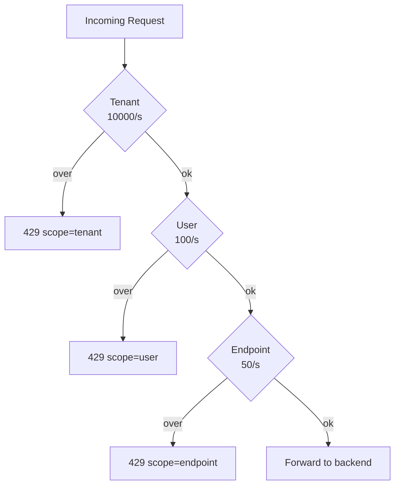

# Rate Limiter Deep Dive — Multi-Tier Limits

**Date:** 2026-04-27 | **Updated:** 2026-04-27
**Tags:** `system-design` `case-study` `rate-limiter` `deep-dive` `quotas` `fairness`

## Table of Contents

- [Summary](#summary)
- [Overview — Why Multi-Tier](#overview--why-multi-tier)
- [Hierarchy Patterns](#hierarchy-patterns)
- [Dry-Run-Then-Commit](#dry-run-then-commit)
- [Order of Evaluation](#order-of-evaluation)
- [Descriptor Explosion](#descriptor-explosion)
- [Stripe's 4-Tier Pattern](#stripes-4-tier-pattern)
- [Header Semantics](#header-semantics)
- [Quota Math — Sum-of-Children vs Independent Budgets](#quota-math--sum-of-children-vs-independent-budgets)
- [Cross-Tier Observability](#cross-tier-observability)
- [Burst-Borrowing](#burst-borrowing)
- [Refunds and Compensation](#refunds-and-compensation)
- [Anti-Patterns](#anti-patterns)
- [Related](#related)
- [References](#references)

## Summary

A production rate limiter rarely enforces a single rule per request. A real request flows through a **stack of limits**: per-tenant fairness, per-user fairness, per-API-key fairness, per-endpoint protection, per-IP anti-abuse, and sometimes per-region capacity caps. Each of these answers a different concern, and they are best modelled as **nested** or **orthogonal** limiters rather than collapsed into one rule. This deep-dive expands section 7.6 of the parent rate-limiter case study: how to evaluate multiple tiers atomically (dry-run-then-commit), how to keep the descriptor count from exploding, when to nest tiers vs apply them orthogonally (the Stripe pattern), how to communicate which tier rejected a request via headers, and how to handle nasty corners — burst-borrowing across tiers, idempotent refunds when a downstream rejects, and compensating accounting when the limiter and the work disagree about whether a request "happened".

## Overview — Why Multi-Tier

A single global limit is almost always wrong. Consider a SaaS API with three tenants, each with hundreds of users:

- A **tenant-only** limit (`tenant=acme: 10000/s`) cannot stop one user inside Acme from monopolising the entire tenant budget by busy-looping a script. Acme is fine relative to other tenants but its own users are starved internally.
- A **user-only** limit (`user=u_42: 100/s`) cannot stop ten thousand free-tier users in tenant Acme from collectively consuming 1M/s of platform capacity.
- An **endpoint-only** limit (`/v1/charges: 50/s`) protects the endpoint but offers no fairness story between tenants or users. The first tenant to fill the bucket wins.

Each tier exists to defend a **different invariant**:

| Tier | Invariant defended | Failure mode if missing |
|------|-------------------|-------------------------|
| Global / region | Total backend capacity | One large customer drives everyone offline |
| Tenant | Cross-tenant fairness | One tenant monopolises shared capacity |
| User / API key | Within-tenant fairness | One bad script inside a tenant drains the tenant budget |
| Endpoint | Hot-path protection | Cheap endpoints absorb spend meant for expensive ones |
| IP / fingerprint | Anti-abuse, pre-auth | Credential stuffing, signup floods |

The rule of thumb: **add a tier when there is a fairness or protection concern that the existing tiers cannot express**. Stop adding tiers when the marginal tier doesn't change rejection behaviour for any realistic traffic pattern — every extra tier costs ops, latency, and operational complexity.



## Hierarchy Patterns

Two dominant shapes appear in production:

### Strict Nesting

`tenant ⊃ user ⊃ endpoint`. Each child lives _inside_ its parent. A user-key cell can never exceed its user budget; a user can never exceed its tenant budget. The math is hierarchical.

This is what GitHub's REST API does for authenticated requests: there is a primary rate limit per token (5,000/hour for classic PATs, 15,000/hour for GitHub Apps installed in an Enterprise) and a separate **secondary rate limit** that protects specific endpoints from concurrent or content-creation bursts ([GitHub REST API rate limits][gh-rl]). You can be inside your token's hourly budget and still be rejected because you tripped a secondary limit on `POST /repos/{owner}/{repo}/issues`.

### Orthogonal Composition

Tiers are not nested but **independent dimensions**. Stripe's API uses this shape: a request must pass a request-rate limit, a concurrent-request limit, and a critical-vs-non-critical shedding gate ([Stripe scaling-rate-limiters blog][stripe-rl]). They are evaluated as a logical AND — any one can reject — but no tier's quota is a slice of another's.

Concrete shapes you'll see:

| Hierarchy | Used by | Notes |
|-----------|---------|-------|
| `tenant ⊃ user ⊃ endpoint` | Most B2B SaaS | Classic nested, easy to explain |
| `tenant ⊃ project ⊃ api_key ⊃ endpoint` | Cloud platforms (GCP-style) | Project is the billing/quota boundary; key is the principal |
| `org ⊃ token ⊃ endpoint` (with secondary limits) | GitHub | Primary by token, secondary by endpoint for abuse |
| `request_rate × concurrent × priority_class` | Stripe | Orthogonal, not nested |
| `ip ⊕ user_id ⊕ endpoint` (anti-abuse) | Login, signup endpoints | OR-composed: any signal trips the limit |

The choice matters for **rejection messages and headers** (see below) and for **quota math** — nested hierarchies imply children sum into the parent; orthogonal limiters do not.

## Dry-Run-Then-Commit

The cardinal pitfall of multi-tier limits: **decrementing tier 1 before checking tier 2 wastes the parent budget on requests that will be rejected anyway**. If the tenant has 8500/10000 used, and one of its users has 99/100 used, and the user-tier rejects the next request, the naive flow has already incremented the tenant counter to 8501. The tenant's budget has been spent on a request that did not actually run.

Worse, the rejected request now counts against another tenant's fair share if you ever do redistribution.

The fix is **two-phase atomic check-then-commit**: probe every tier in dry-run mode, and only commit consumption to all tiers if every tier's check passes. In Redis with a Lua script, this is a single round-trip operating on multiple keys (you must use `{hashtag}` style key formatting so all keys land on the same Cluster slot):

```lua
-- multi_tier_check_and_commit.lua
-- KEYS: tier counter keys, all in same hash slot
-- ARGV: { now_ms, window_ms, limit_per_tier_csv, cost }
--
-- Returns: { allowed (0/1), rejecting_tier_index, remaining_per_tier_csv }

local now      = tonumber(ARGV[1])
local window   = tonumber(ARGV[2])
local limits   = {}
for s in string.gmatch(ARGV[3], '([^,]+)') do
  table.insert(limits, tonumber(s))
end
local cost     = tonumber(ARGV[4])

-- Phase 1: read every tier, decide pass/fail without writing.
local current = {}
for i, key in ipairs(KEYS) do
  local v = tonumber(redis.call('GET', key) or '0')
  current[i] = v
  if v + cost > limits[i] then
    -- Reject. Do NOT mutate any key.
    local remaining = {}
    for j = 1, #limits do
      remaining[j] = tostring(limits[j] - current[j])
    end
    return { 0, i, table.concat(remaining, ',') }
  end
end

-- Phase 2: every tier passed; commit the consumption to all.
local remaining = {}
for i, key in ipairs(KEYS) do
  local newv = redis.call('INCRBY', key, cost)
  -- Set TTL only when key is fresh (counter == cost).
  if newv == cost then
    redis.call('PEXPIRE', key, window)
  end
  remaining[i] = tostring(limits[i] - newv)
end
return { 1, 0, table.concat(remaining, ',') }
```

Two correctness properties:

1. **All-or-nothing commit.** If phase 1 finds any tier overspend, no key is mutated. The script is atomic from the caller's perspective because Redis evaluates Lua single-threadedly per shard.
2. **Per-tier observability.** The reply identifies _which_ tier rejected (`rejecting_tier_index`), so the caller can emit headers and metrics that name the offending tier.

In SQL-backed implementations (less common; Redis dominates because of latency) the same shape is a single transaction:

```sql
BEGIN;
SELECT used FROM rl_counters WHERE key IN ('tenant:acme', 'user:u_42', 'ep:charges') FOR UPDATE;
-- application checks each row against its limit
-- if all pass:
UPDATE rl_counters SET used = used + 1 WHERE key IN (...);
COMMIT;
-- else:
ROLLBACK;
```

`SELECT ... FOR UPDATE` serialises concurrent multi-key transactions and gives you the same atomicity, at the cost of disk-bound latency. Almost no one does this for hot rate limits; it's used only when the limiter is also the system of record for billing quotas.

## Order of Evaluation

Within the dry-run phase, **the order in which you evaluate tiers matters for cost, even though correctness is order-independent**.

Two principles:

1. **Cheapest check first.** An in-process token bucket counter (a few nanoseconds, no I/O) should be evaluated before a Redis-backed counter (a network round-trip). If the in-process tier rejects, you saved a network call.
2. **Most-likely-to-reject first** when checks are similar in cost. If the per-endpoint limit is the tightest, evaluate it before the tenant limit on hot endpoints.

But ordering must not break correctness. For dry-run-then-commit, **all** tiers that pass must be committed atomically. You cannot short-circuit a Redis Lua script half-way and decide to only check tiers 1–2 and skip tier 3 — that would let the third tier overshoot.

Practical pattern: a **two-stage filter**.

- **Stage A (in-process):** every enforcement pod runs a local token bucket per tenant. It is loose but free. If the local bucket rejects, return 429 immediately, no Redis call at all.
- **Stage B (Redis Lua):** if local passes, send all remaining tiers to a single multi-key Lua script. The Lua script does dry-run-then-commit across the global tiers atomically.

This is exactly how Envoy's local rate limiter and global rate limit service compose — local first, global second, accept slight over-allow because the local tier is permissive, accept that the global tier is the authority ([Envoy global rate limiting docs][envoy-rl]).

```text
[req] → local bucket (RAM)
        │  reject? → 429 (no Redis hit)
        ↓ pass
        Redis Lua: check tenant + user + endpoint atomically
                   │ reject? → 429 with X-RateLimit-Scope
                   ↓ pass
                   commit all three counters, forward
```

## Descriptor Explosion

A "descriptor" in Envoy/lyft-ratelimit terminology is one rule applied to a request. Each descriptor maps to a counter key. If a request triggers 30 descriptors, you do **30 counter checks per request**.

This adds up fast:

- 30 descriptors × 50,000 RPS = **1.5M Redis ops/sec just for rate limiting**.
- Even with pipelining and Lua, a single Redis shard tops out around 100k–200k ops/sec for non-trivial Lua. You now need to shard the limiter purely because the descriptor count is too high.
- p99 latency rises because more keys are touched per Lua invocation, and any one slow key (eviction, slot migration) drags the whole script.

Pragmatic limits:

- **Cap the per-request descriptor count** in the limiter's config validator. Five to seven tiers is a lot. Ten is suspicious. Twenty is a bug.
- **Design rule taxonomies flat, not deeply combinatorial.** Avoid rules like `tenant=X AND user=Y AND endpoint=Z AND method=POST AND content_type=json AND auth_class=oauth` — that's one descriptor per combination, and the count multiplies.
- **Hash-tag colocate** descriptors that participate in the same atomic check (`{tenant:acme}:user:u_42`, `{tenant:acme}:tenant`) so all keys land in the same Redis Cluster slot — otherwise multi-key Lua is rejected with `CROSSSLOT`.
- **Batch.** Where possible, fold a tier into another. A "tenant-and-endpoint" rule is one descriptor; a separate "tenant" rule plus a separate "endpoint" rule is two.

A useful rule: every descriptor must justify itself with **a fairness or protection invariant nothing else covers**. If two descriptors reject the same kinds of traffic in the same way, merge them.

### A multi-tier rule definition

A practical config shape — declarative, machine-readable, expresses tenant ⊃ user ⊃ endpoint nesting plus the keys participating in the atomic check:

```json
{
  "rule_id": "rl_charges_v3",
  "description": "Tenant + user + endpoint enforcement on /v1/charges",
  "evaluation": "all_must_pass",
  "tiers": [
    {
      "name": "tenant",
      "key_template": "{tenant_id}:tenant",
      "limit": 10000,
      "window_ms": 1000,
      "burst": 12000
    },
    {
      "name": "user",
      "key_template": "{tenant_id}:user:{user_id}",
      "limit": 100,
      "window_ms": 1000,
      "burst": 200
    },
    {
      "name": "endpoint",
      "key_template": "{tenant_id}:ep:{route_id}",
      "limit": 50,
      "window_ms": 1000,
      "burst": 100
    }
  ],
  "on_reject": {
    "status": 429,
    "headers": {
      "RateLimit-Policy": "{rejecting_tier.limit};w={rejecting_tier.window_s}",
      "RateLimit": "limit={rejecting_tier.limit}, remaining=0, reset={reset_s}",
      "Retry-After": "{reset_s}",
      "X-RateLimit-Scope": "{rejecting_tier.name}"
    }
  },
  "shadow_until": "2026-05-15T00:00:00Z"
}
```

Two design notes:

- **`{tenant_id}` prefix on every key** is intentional — it forces all three keys into the same Redis Cluster hash slot via the `{...}` hash-tag, so the multi-key Lua script doesn't fail with `CROSSSLOT`.
- **`shadow_until`** is a staged-rollout knob: the rule evaluates and emits metrics but does not actually reject until the date passes. Always ship a new tier in shadow mode first, watch the rejection counts, then flip it to enforcing.

## Stripe's 4-Tier Pattern

Stripe's engineering writeup ([Scaling rate limiters][stripe-rl]) describes four limiters that compose **orthogonally**, not by nesting deeper rules:

| # | Limiter | Concern | Mechanism |
|---|---------|---------|-----------|
| 1 | **Request-rate** | Per-key requests per second | Token bucket on `(account, route)` |
| 2 | **Concurrent-request** | In-flight at once | Counter incremented on enter, decremented on exit |
| 3 | **Fleet-usage load shedder** | Total fleet busy → drop low-priority | Drops non-critical traffic when capacity nears saturation |
| 4 | **Worker utilisation load shedder** | Per-worker saturation → defer non-essential | Drops cosmetic traffic so checkout-flow keeps responding |

The contribution worth absorbing: **load shedding is part of the rate-limiting stack**. Tiers 3 and 4 don't have per-customer quotas at all — they look at fleet health and the criticality class of the traffic, and they prefer to reject `GET /v1/customers/list` over `POST /v1/charges`. The "rate limit" mental model expands to "quota + concurrency + criticality-aware shedding".

A configuration sketch in the Stripe shape:

```yaml
limiters:
  - name: request_rate
    type: token_bucket
    key: "{account_id}:{route}"
    rate: 100   # per second
    burst: 200

  - name: concurrent_in_flight
    type: counter
    key: "{account_id}"
    limit: 25   # max concurrent

  - name: fleet_shed
    type: load_shedder
    signal: fleet_busy_workers_pct
    threshold_pct: 80
    drop_class: [non_critical]   # tag on the route

  - name: worker_shed
    type: load_shedder
    signal: worker_local_queue_depth
    threshold: 50
    drop_class: [non_critical, cosmetic]

routing_policy:
  evaluation: AND   # all four must pass
  on_reject:
    headers:
      X-RateLimit-Scope: "${rejecting_limiter_name}"
```

The orthogonal shape **does not nest budgets**. Tier 2 (concurrent) has nothing to do with tier 1 (rate); they constrain different physical resources. Tier 3 (fleet) has nothing to do with the customer at all; it's a system-health gate.

When you see a rate-limit problem that looks combinatorial in the nested mental model, it's usually a sign that the right answer is orthogonal limiters, not deeper nesting.

## Header Semantics

A 429 with no informative headers is a black hole — the client retries blindly, often with a worse storm. The IETF draft `RateLimit` header fields ([draft-ietf-httpapi-ratelimit-headers][ietf-rl]) standardise what to return:

```http
HTTP/1.1 429 Too Many Requests
RateLimit-Policy: 100;w=60
RateLimit: limit=100, remaining=0, reset=42
Retry-After: 42
```

`RateLimit-Policy` advertises the policy (limit and window). `RateLimit` reports current state (limit, remaining, reset-in-seconds). `Retry-After` is the older RFC 6585 field — well-supported, redundant with `reset` but still worth including for HTTP/1.x clients.

The IETF design covers **one limit at a time**. In a multi-tier world, you have multiple policies in play, only one of which actually rejected. Two reasonable strategies:

### Strategy A: Report the binding limit only

Pick the tier that rejected (or, on success, the tier with the smallest `remaining`) and emit just that tier's `RateLimit-*` headers. Add a custom header to disambiguate which tier:

```http
HTTP/1.1 429 Too Many Requests
RateLimit-Policy: 100;w=60
RateLimit: limit=100, remaining=0, reset=42
X-RateLimit-Scope: user
Retry-After: 42
```

`X-RateLimit-Scope` (custom; the IETF draft does not standardise multi-tier scope) tells the client _which_ tier was binding. Clients that understand `X-RateLimit-Scope: tenant` can route the backoff into a tenant-wide circuit breaker rather than a per-user one.

### Strategy B: Report multiple limits with policy names

The IETF draft permits multiple `RateLimit-Policy` lines distinguished by a policy name, each with its own quota. Some implementations use this to expose tenant + user + endpoint in parallel:

```http
RateLimit-Policy: "tenant";q=10000;w=1
RateLimit-Policy: "user";q=100;w=1
RateLimit-Policy: "endpoint";q=50;w=1
RateLimit: "tenant";r=1500;t=0
RateLimit: "user";r=0;t=42
RateLimit: "endpoint";r=20;t=0
```

This is more informative but verbose, and clients need to know to interpret named policies. Strategy A + a custom scope header is the more widely adopted pragma; Strategy B is closer to the draft's intent.

GitHub uses a similar shape (`X-RateLimit-Limit`, `X-RateLimit-Remaining`, `X-RateLimit-Reset`, plus `X-RateLimit-Resource` to indicate which resource group — `core`, `search`, `graphql`, `integration_manifest` — was hit) ([GitHub REST API rate limits][gh-rl]).

### Client-side handling

A multi-tier-aware client should branch on the scope:

```pseudocode
on 429:
    scope = response.header("X-RateLimit-Scope") or "unknown"
    retry_after_s = response.header("Retry-After") or response.header("RateLimit-Reset") or 1

    match scope:
      "tenant"   -> open a tenant-wide circuit breaker for retry_after_s
                    (no point retrying any user inside this tenant)
      "user"     -> back off this user only; siblings can keep going
      "endpoint" -> back off this endpoint only; other endpoints fine
      _          -> exponential backoff, single request
```

This is the payoff of including scope: the client can target its backoff at exactly the bottleneck, rather than treating every 429 as if it required a global slow-down.

## Quota Math — Sum-of-Children vs Independent Budgets

Two distinct shapes hide behind the words "tenant has 10000/s":

### Sum-of-children

The tenant budget is the **pool**. Children share it freely. If users in tenant Acme together use 9999/s, only one more request fits regardless of whether it's user A's first or user B's hundredth.

This is the "fair share" semantics of cgroups, of GCS download bandwidth, of most cloud-quota systems. The implementation is _one_ counter at the parent level; children are advisory or capped lower for fairness but not summed independently.

### Independent budgets

Each child has its own budget, **regardless of siblings**. User A gets 100/s. User B gets 100/s. The tenant doesn't have a quota at all, or has one that is the maximum the platform ever allocates (`sum(user_limits) ≥ tenant_limit`).

This is the shape you want when each child must be insulated from the others. SaaS APIs typically allocate per-key quotas this way: an enterprise customer may have ten API keys, each with its own 100/s, and there is no global cap on the customer aggregate beyond what the platform decides to allow.

### Hybrid (the common production case)

Both. Each user has 100/s (independent), AND the tenant aggregate has 10000/s (sum-of-children, in this case effectively a cap on top). Enforcement requires **both** counters because:

- The user-only check lets one tenant with 1000 users use 100,000/s combined — way past the platform's intended tenant share.
- The tenant-only check lets one user inside the tenant burn the whole 10000/s budget.

Hybrid is what most multi-tier limiters actually implement. The dry-run-then-commit pattern handles it correctly; the rules engine just needs to know about both keys.

A subtle gotcha: when you do hybrid, **the per-user limit must usually be < the tenant limit**, otherwise the per-user limit is effectively never enforced (the tenant limit catches first). Conversely, **`sum(user_limits)` is usually >> tenant limit** because not all users are active at once. Setting `sum(user_limits) == tenant_limit` is overprovisioning the wrong axis: it makes the tenant cap the binding limit always, defeating the purpose of per-user fairness.

## Cross-Tier Observability

You cannot tune a multi-tier limiter you cannot observe. The questions you need answers to:

1. **Which tier rejects most often?** If 95% of rejections come from the endpoint tier, the endpoint limit is too tight (or the endpoint genuinely needs scaling). If 95% come from the tenant tier, you have one or two heavy tenants — separate concern.
2. **Which (rule_id × tenant) cells reject most?** A heatmap. Spotting "tenant Acme is consistently rejected on endpoint /v1/charges at 14:00 UTC daily" is a tuning signal.
3. **Are any tiers _never_ binding?** Then either delete the tier (it's dead config) or its limit is set so loose that another tier always catches first — also dead.
4. **Latency added per tier.** A tier that adds 5ms p99 to every successful request is a tax; sometimes the right call is to drop it.

Minimum metrics to emit per request:

```text
ratelimit_check_total{tier="tenant", rule_id="rt_42", outcome="allow|reject|shadow"}
ratelimit_remaining{tier="user", rule_id="rt_42"}   # gauge sample
ratelimit_check_duration_seconds{tier="endpoint"}    # histogram
ratelimit_descriptor_count{rule_id="rt_42"}          # to spot descriptor explosion
```

Then build:

- **Bar chart**: rejections by tier (over the last hour).
- **Heatmap**: rule_id × hour-of-day, cell value = rejection count.
- **Top-N table**: tenants by rejection count (so a noisy tenant doesn't hide behind a global aggregate).
- **Saturation panel**: `remaining / limit` averaged across the busiest tier per (tenant, endpoint) — answers "who is closest to their cap right now".

Without per-tier outcome labels, all you have is "429s went up", and you cannot tell whether it's a misbehaving customer, a tightened endpoint cap, or a rule rollout that's too aggressive.

### A debugging walkthrough

Suppose a customer reports "we're getting 429s but our dashboard says we're at 60% of our quota". Without cross-tier observability, this is opaque. With it:

1. Filter the rejection metric by `tenant=acme`, group by `tier`. Discover 95% of the rejections are `tier=endpoint`, not `tier=tenant`. The customer's _tenant_ counter is indeed at 60%, but their `/v1/charges` endpoint counter is hitting its cap.
2. Filter further by `rule_id`. Identify the specific endpoint rule.
3. Cross-reference with the customer's traffic mix — if 80% of their requests target the rate-limited endpoint, the endpoint cap is the binding constraint regardless of tenant headroom.
4. Decision: raise the endpoint cap for this customer (override), redirect them to a higher-rate endpoint, or accept the throttle as intended capacity protection.

Without per-tier scope, that conversation goes "we don't know" → "raise everything" → operational mess.

## Burst-Borrowing

Real traffic is bursty. A user's per-second quota is set for the steady state but their actual pattern is silent for 30 seconds and then 200 requests in 2 seconds. Strict per-second enforcement rejects 100 of those 200 requests even if the **tenant** parent has plenty of headroom.

**Burst-borrowing** lets a child temporarily exceed its own limit if the parent has slack. The child's quota becomes a soft floor, not a ceiling.

A simple model: each tier has `(rate, burst)` where `burst > rate`. A token bucket with `burst=200, rate=100/s` lets the child consume up to 200 tokens in a quiet-then-loud burst, paying back out of future seconds. This is the **leaky-bucket-with-burst** pattern — child can borrow against its _own_ future rate.

Cross-tier borrowing is harder. To let child A borrow from child B's unused budget, you need:

- **Compensation accounting** — a ledger that records "tenant Acme's user u_42 borrowed 50 tokens at t=12:00:00 from the tenant pool". Otherwise the parent's bookkeeping is wrong.
- **Repayment policy** — does the child pay back from its next refill (delays its own future bursts) or is the borrow forgiven (parent pays)? Either is defensible; the choice must be explicit.
- **Cap on borrow** — to prevent one child from exhausting the parent. Borrow ≤ parent_remaining × max_borrow_fraction.

When is cross-tier borrowing worth the complexity?

- **Worth it** when traffic is genuinely bursty and steady-state quotas would force overprovisioning the per-child limit far above its average — wasting the parent budget.
- **Not worth it** when the parent budget is large relative to children's peaks (no contention) or when fairness is the first-order concern (one borrowing child denies a sibling's later burst).

Most production limiters implement **only intra-tier burst** (`burst > rate` in the token bucket) and skip cross-tier borrowing entirely. The 5% case where it's needed is usually solved by raising the child's `burst` parameter rather than building a borrowing protocol.

## Refunds and Compensation

A subtle correctness problem: the rate limiter consumed a token, the request was allowed, but **downstream rejected it for an unrelated reason** (auth failed at the next hop, the backend returned 503, the request body parse failed). Did the work happen?

If you don't refund, the client is double-punished — they consumed a token AND got an error AND will retry, consuming another token. Their effective rate becomes higher than the limit suggests.

If you do refund, you must do it **idempotently**. Otherwise a retry path that calls the refund handler twice causes the counter to drift down, eventually allowing more traffic than the limit permits.

### When to refund

| Downstream outcome | Refund? | Reason |
|--------------------|---------|--------|
| 5xx server error before any work | Yes | The "request" never really happened — limiter shouldn't bill it. |
| 5xx after partial work (e.g. payment captured but DB write failed) | No | The work happened; downstream will reconcile. Don't double-credit. |
| 4xx client error (bad input) | Usually no | The client's request was legitimate-from-the-server's-view, even if malformed. Refunding rewards bad clients. |
| 401/403 from downstream service | Sometimes | If the gateway authenticated and downstream rejected, the gateway consumed a token for a request the gateway should have caught earlier. Fix the gateway, then decide. |
| Circuit-breaker trip / load-shed | Yes | Backend explicitly chose to drop; no work happened. |

### Idempotent refund pseudocode

```text
refund(request_id, tier_keys, cost):
    # Idempotency: a refund_record per request prevents double-credit.
    refund_key = "refund:" + request_id

    if EXISTS(refund_key):
        return AlreadyRefunded   # safe to call twice

    # Apply credit to each tier, atomically with the idempotency marker.
    LUA_BEGIN
        if redis.call('SETNX', refund_key, '1') == 0 then
            return 'noop'
        end
        redis.call('PEXPIRE', refund_key, IDEMPOTENCY_TTL_MS)
        for _, key in ipairs(tier_keys) do
            local v = tonumber(redis.call('GET', key) or '0')
            if v >= cost then
                redis.call('DECRBY', key, cost)
            else
                # Counter window rolled; refund would underflow. Skip.
                # This is intentional — refunding into a fresh window
                # would over-credit the new window.
                redis.call('SET', key, '0')
            end
        end
        return 'refunded'
    LUA_END
```

The two correctness corners:

1. **Idempotency marker** keyed on `request_id` (or a refund-id derived from it) prevents replays. TTL is long enough to cover the longest plausible retry window — typically minutes to an hour.
2. **Window-boundary handling.** If the counter has rolled over (the original consumption was in the previous second/minute window, the refund arrives in the next window), refunding would credit the **wrong** window. Either skip the refund or clamp to zero. Don't allow a refund to make a fresh-window counter go negative.

### Compensation, not "undo"

A subtler view: refunds are a form of compensating transaction. The rate limiter's accounting and the downstream's success/failure are eventually consistent, not transactional. You'll see brief inconsistencies — counter shows consumed, downstream rejected, refund hasn't fired yet. As long as the refund _eventually_ fires and is idempotent, the per-second average is correct over a longer window.

For strict billing-tied quotas (where the rate limit double-acts as the meter for billing), refund correctness becomes a money question and you may want to log every refund event to a durable ledger (Kafka topic → S3) for reconciliation independent of the Redis counter. Counter-only refunds are fine for fairness but not for invoicing.

## Anti-Patterns

- **Decrementing tier 1 before checking tier 2.** Wastes the parent budget on rejected requests, creates an unfair feedback loop where tenants whose users misbehave get throttled harder. Use dry-run-then-commit always.
- **Returning 429 with no scope information.** Forces clients to retry blindly. Always set `X-RateLimit-Scope` or equivalent so clients know which tier was binding.
- **Letting descriptor count grow without bound.** A request that touches 30 counter keys is a flag, not a feature. Cap and audit.
- **Setting per-user limit ≥ tenant limit.** The per-user limit is dead config; the tenant limit always catches first. Either lower the per-user or remove it.
- **Treating concurrent requests as a rate.** Concurrency is not RPS. They constrain different things; combine them as orthogonal limiters (Stripe pattern), don't try to fold one into the other.
- **Refunds that aren't idempotent.** Replays drive the counter negative, allowing traffic far above the limit. Always key refunds on a stable `request_id`.
- **Cross-tier borrowing without compensation accounting.** "Just let the child go over if the parent has room" without bookkeeping leaves the parent's accounting permanently wrong, and you only discover it when an audit asks.
- **Reporting only one limit's headers when multiple are in play.** Clients build heuristics on the wrong tier and back off the wrong way. Use named policies (IETF Strategy B) or scope hints (Strategy A) — never silent.
- **No observability on per-tier outcomes.** All you see is total 429 count, with no way to tune which tier is overshooting.
- **Confusing rate limiting with load shedding.** Rate limiting is fairness-by-quota; load shedding is system-health protection. They compose orthogonally; neither replaces the other.

## Related

- [Designing a Rate Limiter](../design-rate-limiter.md) — the parent case study; section 7.6 is what this deep-dive expands.
- [Rate Limiters — Building Block](../../../building-blocks/rate-limiters.md) — algorithmic shapes (token bucket, leaky bucket, fixed/sliding window) that each tier may use.
- [Authorization — RBAC, ABAC, ReBAC](../../../security/authorization.md) — multi-tier limits and authorization both ask "is this principal allowed to do this thing right now?"; the architectural patterns (PEP/PDP, sidecar vs central) are siblings.

## References

- Paul Tarjan and the Stripe engineering team, ["Scaling your API with rate limiters"](https://stripe.com/blog/rate-limiters) — the canonical writeup of the orthogonal 4-tier pattern (request rate, concurrency, fleet shedder, worker shedder).
- GitHub, ["Rate limits for the REST API"](https://docs.github.com/en/rest/overview/rate-limits-for-the-rest-api) — primary vs secondary limits, per-resource header reporting (`X-RateLimit-Resource`).
- IETF, ["RateLimit header fields for HTTP" (draft-ietf-httpapi-ratelimit-headers)](https://datatracker.ietf.org/doc/draft-ietf-httpapi-ratelimit-headers/) — standardised `RateLimit` and `RateLimit-Policy` headers, including named-policy syntax for multi-tier reporting.
- Envoy proxy documentation, ["Global rate limiting"](https://www.envoyproxy.io/docs/envoy/latest/intro/arch_overview/other_features/global_rate_limiting) and ["Rate limit service descriptors"](https://www.envoyproxy.io/docs/envoy/latest/configuration/other_features/rate_limit) — descriptor model and the local + global two-tier shape.
- lyft/ratelimit GitHub repository — [github.com/envoyproxy/ratelimit](https://github.com/envoyproxy/ratelimit) — reference open-source implementation of Envoy's rate limit service, including the descriptor configuration format.
- Betsy Beyer, Chris Jones, Jennifer Petoff, Niall Richard Murphy (eds.), ["Site Reliability Engineering"](https://sre.google/sre-book/handling-overload/) — chapter on Handling Overload covers per-customer quotas, criticality classes, and graceful degradation, the foundation for tiers 3–4 of the Stripe pattern.
- Marc Brooker, ["Fairness in Multi-Tenant Systems"](https://brooker.co.za/blog/2021/09/24/fairness.html) — practical fairness math behind why per-tenant + per-user enforcement compose.
- Redis documentation, ["EVAL and Lua scripting"](https://redis.io/docs/latest/develop/interact/programmability/eval-intro/) and ["Redis cluster specification — hash tags"](https://redis.io/docs/latest/operate/oss_and_stack/reference/cluster-spec/#hash-tags) — atomic multi-key Lua and the `{tag}` pattern required for multi-tier scripts to colocate keys.
- Google Cloud, ["Quotas overview"](https://cloud.google.com/docs/quotas/overview) — concrete example of nested project ⊃ region ⊃ resource quotas with per-resource and aggregate caps.

[stripe-rl]: https://stripe.com/blog/rate-limiters
[gh-rl]: https://docs.github.com/en/rest/overview/rate-limits-for-the-rest-api
[ietf-rl]: https://datatracker.ietf.org/doc/draft-ietf-httpapi-ratelimit-headers/
[envoy-rl]: https://www.envoyproxy.io/docs/envoy/latest/intro/arch_overview/other_features/global_rate_limiting
